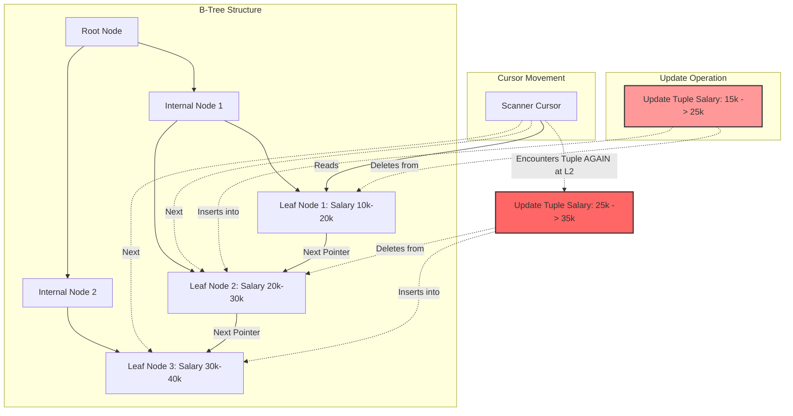

Khái niệm "The Halloween Problem" là một trong những hiện tượng dị thường kinh điển và phức tạp nhất trong lý thuyết cơ sở dữ liệu và kiến trúc hệ thống xử lý giao dịch. Được phát hiện lần đầu tiên vào ngày 31 tháng 10 năm 1976 bởi các nhà nghiên cứu Don Chamberlin, Pat Selinger và Morton Astrahan tại phòng thí nghiệm IBM Research trong quá trình phát triển hệ quản trị cơ sở dữ liệu System R, vấn đề này minh họa cho một lỗ hổng cơ bản trong thiết kế của các hệ thống thực thi truy vấn theo dạng đường ống (pipelined execution). Dị thường này xảy ra khi một thao tác cập nhật (update) dữ liệu trực tiếp làm thay đổi vị trí vật lý hoặc logic của bản ghi trên cấu trúc chỉ mục (index) đang được sử dụng để duyệt qua chính các bản ghi đó. Trong một kịch bản điển hình, nếu một câu lệnh SQL yêu cầu tăng mười phần trăm lương cho tất cả các nhân viên có mức lương hiện tại dưới hai mươi lăm nghìn đô la, và trình tối ưu hóa truy vấn quyết định sử dụng một chỉ mục trên cột lương để quét các bản ghi thỏa mãn điều kiện, một vòng lặp vô tận hoặc việc cập nhật sai lệch có thể xảy ra. Khi lương của một nhân viên được cập nhật, giá trị khóa trong chỉ mục thay đổi, dẫn đến việc bản ghi đó được di chuyển về phía trước (về bên phải) trong cấu trúc cây B-Tree. Do con trỏ quét (cursor) đang di chuyển theo chiều tăng dần của cây chỉ mục, nó sẽ tiếp tục tiến về phía trước và bắt gặp lại chính bản ghi vừa được cập nhật này. Vì mức lương mới có thể vẫn nhỏ hơn ngưỡng hai mươi lăm nghìn đô la, hệ thống sẽ tiếp tục áp dụng mức tăng mười phần trăm lần thứ hai, lần thứ ba, cho đến khi mức lương vượt qua ngưỡng điều kiện. Hiện tượng bản ghi tự theo đuôi chính nó trong quá trình quét chỉ mục này phá vỡ tính nguyên vẹn của phép toán tập hợp trong đại số quan hệ, biến một thao tác cập nhật dự kiến chỉ áp dụng một lần duy nhất cho mỗi bản ghi thành một hàm đệ quy không kiểm soát, gây ra sai lệch nghiêm trọng về tính nhất quán dữ liệu (data consistency) và có khả năng dẫn đến cạn kiệt tài nguyên hệ thống do sự gia tăng hàm mũ của các thao tác I/O và chu kỳ CPU.

Việc giải quyết triệt để The Halloween Problem đòi hỏi một sự can thiệp sâu sắc vào kiến trúc vi mô của hệ quản trị cơ sở dữ liệu, đặc biệt là trong bộ phận trình tối ưu hóa truy vấn (Query Optimizer) và động cơ thực thi (Execution Engine). Trong các hệ thống cơ sở dữ liệu hiện đại, hạt nhân của bộ thực thi thường tuân theo mô hình Volcano Iterator, nơi các toán tử (operators) như Scan, Filter, Project, và Update được liên kết với nhau thành một đồ thị luồng dữ liệu, truyền các tuple (bản ghi) từ toán tử con lên toán tử cha thông qua giao diện hàm `Next()`. Mô hình đường ống này cực kỳ tối ưu về mặt bộ nhớ và độ trễ vì nó không yêu cầu phải vật chất hóa (materialize) toàn bộ tập kết quả trung gian tại mỗi bước. Tuy nhiên, chính bản chất truyền dữ liệu từng dòng ngay lập tức này lại là nguyên nhân gốc rễ gây ra The Halloween Problem. Khi toán tử Update nhận được một tuple từ toán tử Index Scan, nó ngay lập tức thực hiện thao tác ghi đè xuống hệ thống tệp hoặc bộ đệm (Buffer Pool), đồng thời cập nhật lại cấu trúc chỉ mục. Sự thay đổi trạng thái toàn cục này lập tức ảnh hưởng đến toán tử Index Scan nằm ở đầu nguồn của đường ống, bởi vì con trỏ của nó đang trực tiếp duyệt trên cấu trúc dữ liệu vừa bị thay đổi. Sự rò rỉ trạng thái (state leakage) giữa toán tử đọc và toán tử ghi phá vỡ tính chất cô lập (isolation) ngay trong nội bộ của một câu lệnh duy nhất. Hệ quả là, trình tối ưu hóa phải có khả năng phân tích tĩnh (static analysis) cây truy vấn để phát hiện sự phụ thuộc vòng (circular dependency) giữa cột được quét và cột bị cập nhật, từ đó chèn các toán tử cô lập để phá vỡ đường ống, đảm bảo rằng pha đọc và pha ghi được tách biệt hoàn toàn về mặt thời gian và không gian bộ nhớ.

## Architectural Mechanisms of Index Mutation Anomalies

Sâu bên trong lớp lưu trữ vật lý của một hệ quản trị cơ sở dữ liệu, cấu trúc B+Tree đóng vai trò là xương sống cho việc tổ chức và truy xuất dữ liệu có thứ tự. Một cây B+Tree bao gồm các nút gốc (root nodes), nút trung gian (internal nodes) và nút lá (leaf nodes), trong đó toàn bộ dữ liệu hoặc con trỏ dữ liệu (Record IDs) được lưu trữ tại tầng lá, và các nút lá được liên kết với nhau bằng các con trỏ đôi (doubly linked list) để hỗ trợ việc duyệt tuần tự một cách nhanh chóng. Khi một câu lệnh cập nhật làm thay đổi giá trị của khóa chỉ mục, hệ thống không thể chỉ đơn giản là ghi đè giá trị mới vào vị trí cũ, bởi vì điều đó sẽ phá vỡ bất biến về thứ tự sắp xếp của cây (ordering invariant). Thay vào đó, thao tác cập nhật trên chỉ mục thực chất được phân rã thành một cặp thao tác Xóa (Delete) và Chèn (Insert). Đầu tiên, bộ máy cơ sở dữ liệu định vị khóa cũ trong nút lá, đánh dấu xóa hoặc loại bỏ hoàn toàn mục nhập (entry) đó. Tiếp theo, nó sử dụng khóa mới để tìm kiếm lại từ đỉnh gốc của cây B+Tree, lặp qua các tầng trung gian xuống tận tầng lá tương ứng với giá trị khóa mới để thực hiện việc chèn mục nhập mới. Sự dịch chuyển vật lý này từ một nút lá $N_i$ sang một nút lá $N_j$ (với $j > i$ nếu giá trị khóa tăng lên) chính là cơ chế tạo ra dị thường Halloween. Khi toán tử quét đang duy trì một chốt (latch) đọc trên nút $N_i$ và con trỏ đang chỉ tới bản ghi hiện tại, nó không hề nhận thức được rằng một phiên bản lai của chính bản ghi đó vừa được vật chất hóa tại nút $N_j$ ở phía trước luồng duyệt.

Quá trình dịch chuyển các nút lá trong B+Tree khi xảy ra cập nhật khóa được thể hiện chi tiết qua biểu đồ luồng dữ liệu và cấu trúc bộ nhớ. Sự tương tác giữa các trang bộ nhớ (memory pages) và con trỏ quét tạo ra một vòng lặp không thể dự đoán nếu không có cơ chế kiểm soát phiên bản vật lý. Khi nút $N_i$ bị sửa đổi, hệ thống phải xin cấp phát chốt ghi (exclusive latch) trên trang bộ nhớ chứa nút đó, tiến hành dịch chuyển các byte trong mảng dữ liệu nội bộ của trang để dồn mảnh (defragment) hoặc cập nhật trực tiếp (in-place update) nếu kích thước không đổi. Đồng thời, quá trình chèn vào nút $N_j$ có thể gây ra hiện tượng tràn trang (page split), buộc động cơ lưu trữ phải cấp phát một trang mới $N_k$, di chuyển một nửa số mục nhập từ $N_j$ sang $N_k$, và cập nhật lại các con trỏ tại nút trung gian cha. Quá trình chia tách trang này đòi hỏi sự đồng bộ hóa rất nghiêm ngặt thông qua các giao thức khóa phân cấp (hierarchical locking) và chốt theo dạng crabbing (crabbing latches) để ngăn chặn các luồng thực thi song song khác đọc phải cấu trúc dữ liệu không nhất quán. Trong bối cảnh của The Halloween Problem, con trỏ duyệt ban đầu không duy trì khóa trên toàn bộ cây mà chỉ giữ chốt trên nút lá hiện tại để tối đa hóa tính đồng thời (concurrency). Do sự thiếu vắng của một khóa bao trùm toàn cầu (global lock) trên toàn bộ dải quét, con trỏ duyệt khi tiến đến $N_j$ hoặc $N_k$ sẽ xử lý các mục nhập mới chèn một cách hồn nhiên, coi chúng như những bản ghi độc lập chưa từng được xử lý, dẫn đến hệ quả nhân đôi hoặc nhân $N$ lần thao tác cập nhật.



Về mặt toán học, chúng ta có thể mô hình hóa hiện tượng bất thường này thông qua lý thuyết tập hợp và ánh xạ trong đại số quan hệ. Giả sử chúng ta có một quan hệ $\mathcal{R}$ với một tập hợp các tuple $T = \{t_1, t_2, \dots, t_n\}$. Một thao tác cập nhật được biểu diễn bởi hàm biến đổi $f: T \rightarrow T'$, trong đó khóa chỉ mục $k$ của tuple $t$ bị biến đổi thành $k'$. Quá trình quét chỉ mục có thể được mô phỏng như một chuỗi các bước thời gian rời rạc $t \in [0, M]$, với con trỏ vị trí $P(t)$ đại diện cho khóa đang được đọc tại thời điểm $t$. Nếu hàm $f$ có tính chất tăng đơn điệu $f(k) > k$, và quá trình ghi được đồng bộ trực tiếp vào cấu trúc lưu trữ đang được đọc, vị trí mới của bản ghi sẽ là $P_{new} > P(t)$. Xác suất để con trỏ gặp lại bản ghi này được xác định bởi điều kiện $P(t') = P_{new}$ tại một thời điểm $t' > t$ trong tương lai. Sự lặp lại vô tận xảy ra nếu điều kiện hội tụ của vòng lặp (ví dụ $k' \ge K_{threshold}$) không bao giờ đạt được, hoặc dẫn đến việc áp dụng hàm $f$ đệ quy $f(f(\dots f(k)\dots))$ cho đến khi vượt ngưỡng. Để mô tả giới hạn số lần cập nhật trong điều kiện xấu nhất, ta có công thức tính số bước lặp $N_{iter}$ cho một bản ghi ban đầu có khóa $k_0$:

$$ N_{iter} = \left\lceil \log_{\alpha} \left( \frac{K_{threshold}}{k_0} \right) \right\rceil $$

Trong đó $\alpha$ là hệ số nhân của hàm cập nhật (ví dụ $\alpha = 1.1$ cho việc tăng mười phần trăm). Sự gia tăng hàm mũ về mặt tài nguyên này không chỉ làm sai lệch dữ liệu mà còn sinh ra một lượng khổng lồ các bản ghi nhật ký ghi trước (Write-Ahead Logs - WAL). Mỗi thao tác thay đổi nút trên B+Tree đều phải được ghi lại trong WAL để đảm bảo tính bền vững (durability) theo chuẩn ACID. Một thao tác cập nhật đáng lý tạo ra vài megabyte dữ liệu log có thể bùng nổ thành hàng gigabyte log rác, làm tràn bộ đệm log (log buffer), kích hoạt các thao tác xả đĩa (disk flushes) liên tục, tiêu tốn cạn kiệt băng thông I/O của hệ thống lưu trữ (Storage Area Network - SAN) và có thể kéo theo sự suy giảm hiệu năng toàn cục (global performance degradation) cho tất cả các giao dịch khác đang chạy trên cùng một máy chủ vật lý. Hiện tượng này đặc biệt nghiêm trọng trong các hệ thống kiến trúc chia sẻ (shared-everything) với hệ thống lưu trữ đĩa từ truyền thống (HDD), nơi mà độ trễ tìm kiếm (seek latency) và độ trễ quay (rotational latency) bị khuếch đại bởi các yêu cầu I/O ngẫu nhiên phát sinh từ sự di chuyển qua lại giữa các nút chỉ mục.

## Algorithmic Solutions and Execution Pipeline Isolation

Cách tiếp cận nguyên thủy và phổ biến nhất để ngăn chặn The Halloween Problem ở mức độ kiến trúc bộ thực thi là phá vỡ cấu trúc đường ống của mô hình Volcano bằng cách chèn một toán tử chặn (blocking operator) trung gian, thường được gọi là toán tử Spool (hay Eager Spool). Mục tiêu cơ bản của cơ chế này là tạo ra sự cô lập hoàn toàn giữa pha Đọc (Read Phase) và pha Ghi (Write Phase) thông qua việc vật chất hóa toàn bộ danh sách định danh bản ghi (Record Identifiers - RIDs) cần thiết trước khi bắt đầu thực hiện bất kỳ thao tác thay đổi nào lên cơ sở dữ liệu vật lý. Khi trình tối ưu hóa truy vấn nhận diện được một sự giao thoa (intersection) giữa tập hợp các cột được sử dụng trong vị từ quét (scan predicates) và tập hợp các cột bị sửa đổi (modified columns), nó sẽ tự động tiêm toán tử Spool vào kế hoạch thực thi. Trong pha Đọc, toán tử Spool sẽ liên tục gọi hàm `Next()` từ toán tử quét phía dưới (ví dụ Index Seek hoặc Index Scan), thu thập tất cả các RIDs, hoặc đôi khi là thu thập toàn bộ nội dung của tuple nếu cần thiết cho quá trình tính toán biểu thức cập nhật, và lưu trữ chúng vào một cấu trúc dữ liệu tạm thời trong bộ nhớ chính như bảng băm (hash table), cây nhị phân (binary tree) hoặc mảng tuyến tính cấp phát động. Chỉ khi toán tử quét trả về tín hiệu kết thúc dòng dữ liệu (End of File - EOF), toán tử Spool mới chuyển sang pha thứ hai, phục vụ dữ liệu đã lưu trữ cho toán tử Update ở phía trên. Nhờ quá trình vật chất hóa này, kể cả khi toán tử Update làm thay đổi cấu trúc B+Tree và đẩy các tuple về phía trước, toán tử quét đã hoàn thành xong nhiệm vụ của nó từ trước, do đó con trỏ quét không bao giờ có cơ hội bắt gặp lại các tuple vừa được định vị lại.

Dưới đây là một đoạn mã giả (pseudocode) bằng ngôn ngữ C++ minh họa cách thức hoạt động của toán tử Eager Spool trong lõi của một hệ quản trị cơ sở dữ liệu tuân theo kiến trúc Volcano Iterator. Trong mã giả này, toán tử Spool kế thừa từ lớp giao diện trừu tượng `Operator`, sở hữu một bộ nhớ đệm nội bộ để lưu trữ các định danh bản ghi. Khi hàm `Open()` được gọi để khởi tạo đường ống, toán tử Spool thực hiện toàn bộ việc quét và vật chất hóa một cách eager (ngấu nghiến). Vòng lặp `while` bên trong hàm `Open()` tiêu thụ cạn kiệt luồng dữ liệu từ toán tử con (child operator). Sau đó, hàm `Next()` chỉ đóng vai trò là một bộ lặp (iterator) đơn giản duyệt qua mảng đệm đã được lưu trữ sẵn, trả về từng định danh bản ghi cho toán tử Update ở cấp độ cao hơn. Cách tiếp cận này yêu cầu hệ thống phân bổ bộ nhớ động thông qua các bộ cấp phát vùng nhớ (Arena Allocators) để giảm thiểu hiện tượng phân mảnh (fragmentation) và chi phí gọi hệ thống (system call overhead) khi lưu trữ hàng triệu phần tử RIDs.

```cpp
class EagerSpoolOperator : public Operator {
private:
    Operator* child_operator;
    std::vector<RecordID> materialized_rids;
    size_t current_index;
    MemoryArena* arena;

public:
    EagerSpoolOperator(Operator* child, MemoryArena* mem_arena) 
        : child_operator(child), arena(mem_arena), current_index(0) {}

    void Open() override {
        // Khởi tạo toán tử con
        child_operator->Open();
        
        // Eagerly materialize toàn bộ Record IDs để phá vỡ pipeline
        Tuple* current_tuple = child_operator->Next();
        while (current_tuple != nullptr) {
            // Cấp phát và sao chép RID vào bộ đệm nội bộ
            RecordID rid = current_tuple->GetRecordID();
            materialized_rids.push_back(rid);
            current_tuple = child_operator->Next();
        }
    }

    Tuple* Next() override {
        // Phục vụ dữ liệu từ bộ đệm đã được vật chất hóa
        if (current_index < materialized_rids.size()) {
            RecordID rid = materialized_rids[current_index++];
            // Tìm nạp Tuple thực tế từ Storage Manager dựa trên RID
            return StorageManager::GetInstance()->FetchTuple(rid);
        }
        // Tín hiệu kết thúc luồng dữ liệu
        return nullptr;
    }

    void Close() override {
        child_operator->Close();
        materialized_rids.clear();
        materialized_rids.shrink_to_fit();
    }
};
```

Bên cạnh giải pháp Spool truyền thống, các kiến trúc cơ sở dữ liệu hiện đại áp dụng cơ chế Kiểm soát đồng thời đa phiên bản (Multi-Version Concurrency Control - MVCC) cung cấp một hướng tiếp cận tinh tế hơn để hóa giải một phần hoặc toàn bộ The Halloween Problem mà không nhất thiết phải luôn vật chất hóa dữ liệu. Trong PostgreSQL, mỗi tuple được lưu trữ với một tập hợp các siêu dữ liệu (metadata) trên header, bao gồm Transaction ID tạo ra tuple (`xmin`), Transaction ID xóa hoặc cập nhật tuple (`xmax`), và đặc biệt là Command ID (`cmin`, `cmax`). Command ID theo dõi số thứ tự của các câu lệnh (commands) bên trong cùng một giao dịch (transaction). Khi một câu lệnh cập nhật xử lý một tuple, nó sẽ đánh dấu phiên bản cũ bằng `xmax` và tạo ra một phiên bản vật lý mới với `xmin` bằng ID của giao dịch hiện tại, đồng thời thiết lập Command ID cho phiên bản mới. Quá trình quét của câu lệnh hiện tại được thiết lập để chỉ "nhìn thấy" các phiên bản tuple được tạo ra bởi các Command ID trước đó, hoặc bởi các giao dịch đã commit (commit timestamp visibility). Do đó, khi con trỏ quét tiến lên và vô tình đụng độ phải phiên bản vật lý mới nằm phía bên phải của B+Tree, bộ lọc khả kiến (visibility filter) ở mức độ thấp của hệ thống sẽ kiểm tra `cmin` của tuple này. Phát hiện ra rằng phiên bản này được sinh ra bởi chính câu lệnh (command) đang thực thi, hệ thống sẽ xác định đây là dữ liệu tương lai (future data) không hợp lệ đối với bối cảnh chụp nhanh (snapshot context) của câu lệnh, và thầm lặng bỏ qua nó.

Sự tương tác giữa The Halloween Problem và kiến trúc MVCC trong PostgreSQL càng trở nên phức tạp với sự hiện diện của tối ưu hóa Heap-Only Tuples (HOT). Tính năng HOT được thiết kế để giảm thiểu chi phí bảo trì chỉ mục bằng cách cho phép các phiên bản mới của một tuple được tạo ra trên cùng một trang bộ nhớ (memory page) với phiên bản cũ mà không cần cập nhật bất kỳ chỉ mục nào, miễn là các cột chứa khóa chỉ mục không bị thay đổi. Nếu thao tác cập nhật không nhắm vào cột khóa, bản ghi mới sẽ được liên kết với bản ghi cũ thông qua một chuỗi con trỏ nội bộ trang (intra-page pointer chain), và con trỏ quét chỉ mục sẽ không bao giờ nhìn thấy sự dịch chuyển vật lý qua lại giữa các trang lá của B+Tree, vì về mặt logic của chỉ mục, bản ghi không hề di chuyển. Điều này làm cho The Halloween Problem tự động bị triệt tiêu đối với các thao tác cập nhật non-key. Tuy nhiên, khi khóa chỉ mục thực sự bị thay đổi, chuỗi HOT bị phá vỡ, PostgreSQL buộc phải chèn các mục nhập mới vào tất cả các chỉ mục có liên quan, đánh thức lại bóng ma của sự dị thường này. Lúc này, quy tắc kiểm tra Command ID `cmin` đóng vai trò là chốt chặn cuối cùng ngăn ngừa việc rơi vào vòng lặp vô tận. Sự phức tạp trong việc duy trì và giải mã các siêu dữ liệu phiên bản (versioning metadata) đòi hỏi CPU phải thực hiện hàng loạt các lệnh rẽ nhánh (branching instructions) và truy xuất ngẫu nhiên vào bộ nhớ đệm (cache), tạo ra một chi phí ẩn (hidden cost) khổng lồ đối với hiệu năng hệ thống khi xử lý các giao dịch quy mô lớn.

## Memory Hierarchy and Hardware-Level Implications

Giải quyết The Halloween Problem bằng kỹ thuật Eager Spooling không phải là một viên đạn bạc (silver bullet) miễn phí; nó dịch chuyển điểm nghẽn hiệu năng từ các vòng lặp xử lý logic sang hệ thống phân cấp bộ nhớ (Memory Hierarchy) và các ranh giới kiến trúc phần cứng. Khi một câu lệnh UPDATE phải cập nhật hàng chục triệu bản ghi, toán tử Spool phải vật chất hóa toàn bộ RIDs vào bộ nhớ RAM. Đối mặt với lượng dữ liệu khổng lồ, bộ nhớ làm việc tĩnh được phân bổ cho truy vấn (ví dụ `work_mem` trong PostgreSQL) sẽ nhanh chóng bị tiêu hao cạn kiệt. Khi giới hạn cấu hình này bị phá vỡ, động cơ thực thi buộc phải tràn dữ liệu (spill to disk) xuống hệ thống lưu trữ thứ cấp dưới dạng các tập tin tạm thời (temporary files). Quá trình di chuyển từ một bộ đệm trong RAM với độ trễ cỡ vài chục nano giây (nanoseconds) sang hệ thống I/O đĩa từ hoặc thậm chí ổ cứng SSD giao thức NVMe với độ trễ cỡ micro giây (microseconds) gây ra một sự sụt giảm hiệu năng theo nhiều bậc độ lớn (orders of magnitude). Để quản lý việc đọc và ghi khối lượng dữ liệu tràn ra đĩa, các hệ thống cơ sở dữ liệu hiện đại áp dụng thuật toán Sắp xếp trộn ngoại vi (External Merge Sort) hoặc phân chia băm ngoại vi (External Hash Partitioning). Việc phải đọc lại các RIDs từ đĩa sau khi đã được lưu tạm khiến câu lệnh UPDATE chịu thêm một khoản phụ phí I/O (I/O overhead) không thể tránh khỏi, làm suy giảm tốc độ thông lượng xử lý giao dịch (Transaction Throughput) một cách nghiêm trọng.

Về mặt toán học tối ưu hóa phần cứng, chi phí của quá trình vật chất hóa vượt bộ nhớ có thể được định lượng thông qua số khối dữ liệu phải chuyển vào và ra khỏi thiết bị lưu trữ thứ cấp. Giả sử $N$ là tổng số trang dữ liệu cần được vật chất hóa tại toán tử Spool, và $B$ là số lượng bộ đệm (buffers) khối lượng lớn khả dụng trong bộ nhớ chính (RAM). Khi $N > B$, hệ thống buộc phải ghi các khối dữ liệu chạy (runs) xuống đĩa, sau đó đọc lại để hợp nhất. Theo lý thuyết về độ phức tạp I/O trong mô hình bộ nhớ ngoại vi của Aggarwal và Vitter, tổng số thao tác xuất nhập I/O cho quá trình phân loại hợp nhất ngoại vi nhằm phục vụ quá trình Spooling được giới hạn bởi công thức:

$$ Cost_{I/O} \approx 2 \cdot N \cdot \left\lceil \log_{B-1} \left( \frac{N}{B} \right) \right\rceil $$

Mỗi một thao tác chuyển khối này yêu cầu sự can thiệp của bộ điều khiển truy cập bộ nhớ trực tiếp (Direct Memory Access - DMA), kích hoạt ngắt phần cứng (hardware interrupts), và buộc hệ điều hành phải thực hiện chuyển đổi ngữ cảnh (context switching) đắt đỏ. Sự chuyển đổi này làm ô nhiễm các bộ đệm vi chương trình (Translation Lookaside Buffer - TLB) nằm sâu trong vi kiến trúc của CPU, vốn chịu trách nhiệm ánh xạ địa chỉ logic sang địa chỉ vật lý của bộ nhớ. Khi bảng băm vật chất hóa hoặc mảng lưu trữ RID quá lớn, hàng triệu lỗi trượt TLB (TLB misses) sẽ xảy ra, mỗi lần trượt buộc bộ điều khiển bộ nhớ (Memory Management Unit - MMU) phải đi dạo qua các tầng của bảng trang (page table walk), tiêu tốn hàng trăm chu kỳ đồng hồ quý giá cho việc truy xuất trực tiếp vào RAM (DRAM access). Hiện tượng thrashing của TLB trong lúc vật chất hóa Eager Spool có thể làm chậm quá trình cập nhật cơ sở dữ liệu đến mức ngưng trệ (stall) toàn bộ đường ống thực thi lệnh của CPU (Instruction Pipeline).

Để giảm thiểu tác động tàn phá của việc vật chất hóa do The Halloween Problem ở cấp độ phần cứng, các động cơ lưu trữ được tối ưu hóa cho hệ thống NUMA (Non-Uniform Memory Access) yêu cầu sự phân bổ vùng nhớ (memory alignment) theo các ranh giới trang cực lớn (Huge Pages), thông thường là 2MB hoặc 1GB trên vi kiến trúc x86-64, thay vì kích thước 4KB mặc định. Việc sử dụng Huge Pages kết hợp với các bộ cấp phát vùng nhớ (Arena Allocators) giúp thu gọn bảng trang, đảm bảo rằng toàn bộ mảng lưu trữ RIDs tại toán tử Spool có thể nằm gọn trong vùng phủ sóng của TLB. Hơn nữa, việc tối ưu hóa tính cục bộ tham chiếu (locality of reference) khi thiết kế bộ nhớ đệm nội bộ của Spool operator đòi hỏi phải xem xét đến kích thước của các dòng bộ đệm (Cache Lines) L1, L2 và L3 của CPU (thường là 64 bytes). Nếu các RIDs được lưu trữ theo mảng tuyến tính và được xử lý tuần tự (Prefetching-friendly), CPU có thể sử dụng các bộ nạp trước phần cứng (Hardware Prefetchers) để kéo trước các phân đoạn của mảng Spool từ bộ nhớ chính vào L1 cache trước khi toán tử Update kịp yêu cầu. Sự kết hợp giữa tối ưu hóa phần mềm tại tầng đại số quan hệ và sự am hiểu tường tận về các đặc tính vi kiến trúc phần cứng là minh chứng rõ ràng nhất cho thấy The Halloween Problem không chỉ là một lỗi phần mềm logic lịch sử, mà còn là một trong những bài toán kiến trúc sâu sắc nhất, chi phối triết lý thiết kế của các hệ quản trị cơ sở dữ liệu xử lý song song và đường ống hiện đại.

### SEO
- **Keywords:** The Halloween Problem, Database anomalies, Query Optimizer, Execution Engine, Eager Spooling, Volcano Iterator Model, Multi-Version Concurrency Control, PostgreSQL MVCC, B-Tree update, Tuple visibility, RDBMS performance, SQL optimization.
- **Meta Description:** Phân tích chuyên sâu về The Halloween Problem trong cơ sở dữ liệu, khám phá kiến trúc vi mô của B-Tree, cơ chế Eager Spooling, MVCC và các ảnh hưởng của bộ nhớ phần cứng (TLB, CPU Cache) trong quá trình cập nhật dữ liệu.
- **Title Tag:** The Halloween Problem: Kiến trúc Hệ thống, Dị thường Cập nhật và Tối ưu Hardware
- **Slug:** 15-the-halloween-problem-loi-kinh-dien-trong-cap-nhat-database
- **Target Audience:** Staff Engineers, Database Administrators (DBA), Systems Architects, Computer Science Researchers.
