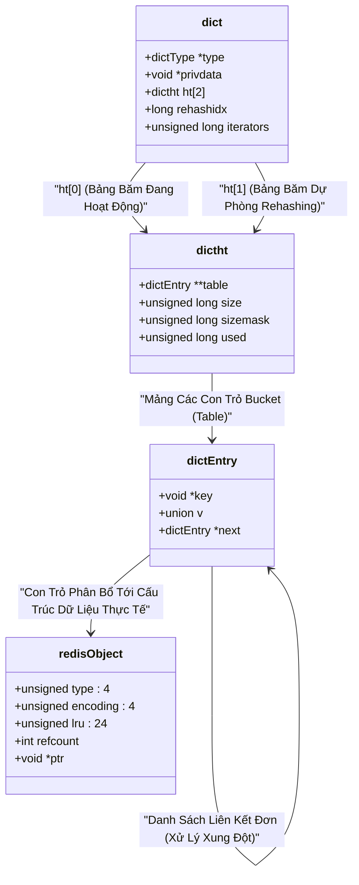

## 16: Kiến trúc Đơn luồng của Redis: Tại sao lại nhanh và khi nào thì nghẽn?

### Phân tích Vi kiến trúc và Mô hình I/O Đa hợp của Redis
Redis được thiết kế với một triết lý vô cùng tối giản nhưng mang lại hiệu năng tối đa dựa trên việc tận dụng triệt để bộ nhớ chính và một mô hình thực thi đơn luồng (single-threaded) cốt lõi cho các lệnh thao tác dữ liệu. Kiến trúc này đi ngược lại với xu hướng đa luồng phổ biến trong các hệ thống cơ sở dữ liệu hiện đại, nơi mà số lượng luồng thực thi thường tỷ lệ thuận với số lượng lõi xử lý vật lý của hệ thống phân tán. Tuy nhiên, quyết định kiến trúc này không hề mang tính ngẫu nhiên; nó được đưa ra dựa trên những đo lường vi kiến trúc cực kỳ khắt khe của cha đẻ dự án. Nguyên nhân cốt lõi khiến Redis đạt được thông lượng lên tới hàng triệu thao tác mỗi giây (operations per second - OPS) nằm ở việc hệ thống loại bỏ hoàn toàn các chi phí phát sinh (overhead) liên quan đến việc chuyển đổi ngữ cảnh (context switching) giữa các luồng cấp hệ điều hành (OS threads) và sự phức tạp của các cơ chế đồng bộ hóa như khóa loại trừ lẫn nhau (mutex locks, semaphores). Khảo sát ở cấp độ vi kiến trúc, một tác vụ chuyển đổi ngữ cảnh trên kiến trúc x86_64 thông thường tiêu tốn khoảng từ $1000$ đến $2000$ chu kỳ đồng hồ (clock cycles). Thêm vào đó, nó gây ra hiện tượng ô nhiễm bộ nhớ đệm (cache pollution) làm suy giảm nghiêm trọng tỷ lệ trúng bộ nhớ đệm (cache hit rate) ở các tầng L1 và L2, buộc vi xử lý phải tìm nạp dữ liệu (fetch) lại từ bộ nhớ chính (RAM) với độ trễ cỡ $100$ nanoseconds thay vì $1$ nanosecond. Căn cứ theo định luật Amdahl (Amdahl's Law) liên quan đến cải thiện thông lượng của các hệ thống đa luồng song song, giới hạn tăng tốc lý thuyết được định nghĩa bởi biểu thức toán học $S_{latency} = \frac{1}{(1-p) + \frac{p}{N}}$, trong đó $p$ là phần hệ thống có thể song song hóa và $N$ là số lượng bộ xử lý. Nếu áp dụng việc khóa (locking) cho từng cấu trúc dữ liệu vi mô trong Redis, tỷ lệ tuần tự hóa $(1-p)$ sẽ trở nên cực lớn do tranh chấp cấu trúc, khiến $S_{latency}$ giảm mạnh. Việc loại bỏ các khóa bằng kiến trúc đơn luồng khiến độ phức tạp đồng bộ hóa rơi về số không hoàn hảo.

Thay vì phụ thuộc vào việc phân luồng, Redis triển khai một mô hình I/O đa hợp (I/O multiplexing) hoàn toàn phi đồng bộ, dựa trên mẫu thiết kế Reactor (Reactor pattern) nổi tiếng. Sự tích hợp sâu sắc với các cơ chế polling hiệu năng cao của hạt nhân hệ điều hành như `epoll` trên hệ điều hành Linux, `kqueue` trên FreeBSD, hoặc `evport` trên môi trường Solaris cho phép tiến trình Redis quản lý hàng chục ngàn kết nối mạng đồng thời chỉ với một tiến trình không gian người dùng duy nhất. Khác biệt cơ bản giữa `epoll` và các cấu trúc đa hợp cổ điển như `select` hay `poll` nằm ở độ phức tạp thuật toán để truy vấn trạng thái socket. Trong khi `select` hoặc `poll` yêu cầu quét toàn bộ danh sách bộ mô tả tệp (file descriptors) với độ phức tạp tuyến tính $\mathcal{O}(N)$, thì `epoll` cấu trúc lại mô hình lưu trữ bên trong không gian hạt nhân bằng cách sử dụng cấu trúc cây đỏ-đen (Red-Black tree) để quản lý các file descriptor và một danh sách liên kết kép (doubly linked list) để lưu trữ các sự kiện đã sẵn sàng. Khi một socket mạng có dữ liệu được truyền đến phần cứng thẻ giao diện mạng (NIC), ngắt phần cứng (hardware interrupt) được kích hoạt, gọi trình xử lý giao thức TCP/IP của hạt nhân hệ điều hành. Dữ liệu được đưa vào TCP receive buffer và hệ thống tự động đẩy file descriptor tương ứng vào danh sách sẵn sàng (ready list) của `epoll` với thời gian $\mathcal{O}(1)$. Do vậy, việc kiểm tra sự kiện trả về lập tức danh sách các kết nối có thể tương tác mà không cần lặp qua các kết nối rảnh rỗi. Khi vòng lặp sự kiện (event loop) của Redis kiểm tra thông qua lời gọi hàm `epoll_wait`, nó ngay lập tức tiếp nhận mảng các trạng thái đã sẵn sàng thao tác từ hạt nhân.

Sự vận hành của vòng lặp sự kiện trong Redis có thể được mô hình hóa toán học một cách hình thức thông qua lý thuyết của hệ thống hàng đợi. Giả sử tốc độ đến của các yêu cầu từ nhiều máy khách (clients) tuân theo phân phối Poisson với tham số cường độ $\lambda$ và thời gian phục vụ của mỗi yêu cầu bên trong CPU được phân phối theo quy luật mũ với tham số $\mu$. Theo mô hình hàng đợi $M/M/1$, thời gian đáp ứng trung bình (average response time) của hệ thống được tính bằng công thức toán học cơ bản $R = \frac{1}{\mu - \lambda}$. Đối với Redis, do hầu hết các thao tác đều thực hiện trên bộ nhớ chính (RAM) với thời gian trễ cực thấp, $\mu$ (năng lực xử lý tối đa) có giá trị vô cùng lớn (ví dụ: thao tác độ phức tạp $\mathcal{O}(1)$ mất khoảng $1-2$ microsecond). Điều này giữ cho thời gian trễ $R$ luôn ở mức thấp đáng kể, ngay cả khi tải hệ thống $\lambda$ tiến sát đến giới hạn khả năng phục vụ $\mu$. Sự cố thực sự duy nhất có thể phá vỡ mô hình này là khi tồn tại các lệnh có thời gian thực thi làm suy giảm tỷ lệ phục vụ $\mu$ trên đơn vị thời gian. Mọi sự gián đoạn trong vòng lặp sự kiện đều có thể dẫn đến sự gia tăng phi tuyến tính và thảm khốc của thông lượng toàn cục cũng như gia tăng hàng đợi kết nối tồn đọng ở không gian hệ điều hành. Do đó, mã nguồn của vòng lặp này được các kỹ sư phần mềm tối ưu hóa đến mức cực đoan để giữ cho chu kỳ CPU ở mức cực tiểu. Đoạn mã giả phân tích vòng lặp sự kiện chính của hệ thống lõi Redis, thường được gói gọn trong thư viện nội bộ `ae` (A simple event-driven programming library), mô tả quá trình lặp vô hạn, trong đó tiến trình không ngừng chờ đợi sự kiện I/O, sự kiện định thời hoặc các ngắt báo hiệu dừng tiến trình. Trong ngữ cảnh của C/C++, cấu trúc hàm thực thi cốt lõi có dạng như sau:

```c
void aeMain(aeEventLoop *eventLoop) {
    eventLoop->stop = 0;
    while (!eventLoop->stop) {
        /* Xử lý các logic tiền vòng lặp trước khi thực hiện gọi sleep vào hạt nhân */
        if (eventLoop->beforesleep != NULL) {
            eventLoop->beforesleep(eventLoop);
        }
        /* Thực hiện I/O Multiplexing (epoll_wait) và xử lý sự kiện bắn về */
        aeProcessEvents(eventLoop, AE_ALL_EVENTS | AE_CALL_AFTER_SLEEP);
    }
}
```

Hàm nội sinh `aeProcessEvents` đóng vai trò là trung tâm đa hợp của sự sống cơ sở dữ liệu, thực thi hàm hạt nhân hệ điều hành thông qua API `aeApiPoll` để cấu trúc việc lấy về mảng các sự kiện đang hoạt động từ danh sách đã khai báo. Ngay sau khi lệnh gọi hệ thống trả về với chi phí bộ nhớ tối thiểu, Redis tự động và tuần tự tiến hành việc đọc luồng byte từ các socket, phân tích cú pháp (parsing) các khung giao thức RESP (REdis Serialization Protocol), và sau đó trực tiếp định tuyến hàm gọi thực thi các lệnh tương ứng (command dispatching) trên không gian cấu trúc dữ liệu in-memory. Giai đoạn cuối cùng là ghi mảng kết quả phân định vào bộ đệm đầu ra logic của socket đó. Việc mọi thao tác này xảy ra hoàn toàn đồng bộ (synchronous) và tuần tự (sequential) bên trong một ngữ cảnh luồng duy nhất đảm bảo tính nguyên tử (atomicity) của các câu lệnh sửa đổi biến đổi bộ nhớ. Toàn bộ cơ sở dữ liệu từ quan điểm của các máy khách song song đều cư xử như một tập hợp tài nguyên an toàn mà không tồn tại các điều kiện chạy đua (race conditions).

Biểu đồ kiến trúc dưới đây minh họa sự tương tác đồng vị giữa vòng lặp sự kiện đơn luồng nguyên khối và hệ thống mạng tương tác bên ngoài không gian hạt nhân:

```mermaid
graph TD
    Client1[Network Client 1] -->|TCP / RESP Payload| Kernel[OS Kernel / TCP/IP Protocol Stack]
    Client2[Network Client 2] -->|TCP / RESP Payload| Kernel
    ClientN[Network Client N] -->|TCP / RESP Payload| Kernel
    Kernel -->|epoll_wait / kqueue notification| EventLoop[AE Event Loop Reactor]
    subgraph "Redis User Space: Single-Threaded Core"
        EventLoop -->|Read Ready Event| ReadHandler[AE Read Event Handler]
        ReadHandler --> Parser[Command Parser & Lexer]
        Parser --> Executor[Command Dispatcher & Executor]
        Executor --> DataStructures[In-Memory Data Structures Dictionary]
        Executor -->|Append Write Payload| Buffer[Client Logical Output Buffer]
        Buffer -->|Write Ready Event| WriteHandler[AE Write Event Handler]
        WriteHandler -->|Socket write()| Kernel
    end
    DataStructures -.->|Ultra Low Latency Cache Miss Mitigation| L1[Hardware L1/L2/L3 Cache]
```

Cấu trúc luồng sự kiện đa hợp trên chỉ ra rõ ràng rằng, mặc dù toàn bộ chuỗi quá trình đọc, phân tích cấu trúc, thực thi chỉ thị và phản hồi mạng được xử lý qua lăng kính đơn luồng, nút thắt (bottleneck) thực sự của kiến trúc này cực kỳ hiếm khi nằm ở năng lực tính toán toán học (ALU) hay chu kỳ luồng (cycles) của CPU hiện đại. Ngược lại, những bài kiểm thử thực tế khắt khe và các phân tích cấu hình hệ thống bằng các công cụ đo lường hiệu năng như `perf` và `eBPF` chỉ ra rằng giới hạn băng thông bộ nhớ và thông lượng gói tin của thẻ giao diện mạng (NIC) mới chính là những yếu tố định đoạt giới hạn tới hạn (hardware limiting factors). Theo phân tích định lượng học thuật, khi một truy vấn thao tác `GET` nội bộ với kích thước payload cỡ 64 bytes được truyền qua môi trường kết nối mạng, quá trình kích hoạt ngắt cứng vật lý (hardware interrupts), xử lý phân lớp giao thức TCP/IP nhiều tầng của hệ điều hành và việc sao chép nội dung bộ nhớ qua ranh giới kernel-user space chiếm dụng hơn 80% phần lớn thời gian trễ của câu lệnh. Về mặt phân tích toán học thông lượng học thuật, nếu tốc độ xử lý I/O mạng phần cứng là $B$ bytes/second, và kích thước trung bình cộng của một yêu cầu (bao gồm mảng lệnh và siêu dữ liệu) là $S$ bytes, thì giới hạn lý thuyết tối đa về thông lượng $T_{max}$ được xấp xỉ bởi tiệm cận $T_{max} \approx \frac{B}{S}$ (yêu cầu/giây). Nếu khả năng xử lý lệnh thực thi của CPU đơn luồng trong không gian người dùng là $P$ (thao tác/giây), thì chừng nào bất đẳng thức $P > \frac{B}{S}$ vẫn còn hiệu lực (và trong lịch sử của Redis điều này luôn đúng), toàn thể hệ thống sẽ bị thắt cổ chai trực tiếp ở tầng I/O mạng chứ không phải CPU logic. Đó là định lý nền tảng giải thích vì sao triết lý đơn luồng lại thống trị và tối ưu một cách cực đoan cho dạng ứng dụng I/O Bound như nền tảng lưu trữ In-Memory.

### Cơ chế Quản lý Bộ nhớ, Cấu trúc Dữ liệu và Tối ưu hóa Truy cập
Sự vượt trội tuyệt đối về mặt độ trễ vi mô và năng suất thực thi của thiết kế khối đơn luồng không thể được biện luận đầy đủ nếu thiếu đi việc phân tích cực sâu sắc các quyết định kiến trúc tại tầng phân bổ vùng bộ nhớ và tổ chức định tuyến cấu trúc dữ liệu. Trong môi trường lập trình bậc thấp C/C++, bộ cấp phát khối nhớ mặc định của thư viện tiêu chuẩn libc như hàm `malloc()` thường nhanh chóng sa lầy vào hiện tượng phân mảnh bộ nhớ (memory fragmentation) cực kỳ nghiêm trọng. Điều này xảy ra đối với các dạng tải lưu lượng cơ sở dữ liệu đòi hỏi việc cấp phát và giải phóng (allocation and deallocation) liên tục hàng triệu các khối bộ nhớ nhỏ gọn (small chunks). Redis giải quyết hoàn toàn điểm yếu này thông qua tích hợp bắt buộc các bộ cấp phát bộ nhớ vi mô tinh vi hơn hẳn như Jemalloc hoặc thư viện TCMalloc (Thread-Caching Malloc do Google phát triển). Dù về mặt bản chất các trình cấp phát này được tối ưu hóa cho ứng dụng đa luồng (bằng cách thiết lập các không gian arena biệt lập cho từng luồng nhằm dập tắt tình trạng khóa tranh chấp toàn cục), Redis một cách trớ trêu lại lợi dụng hoàn toàn ưu thế về thuật toán cấp phát kích thước theo từng lớp (size classes thuật toán logarithmic) và chiến lược định hình gom rác phi tập trung của cấu trúc Jemalloc để bóp nghẹt hiện tượng phân mảnh vùng ngoài (external fragmentation). Tỷ lệ phân mảnh trong cấu trúc theo dõi của Redis (hiển thị thông qua lệnh `INFO memory`) được biểu diễn thông qua tỷ số toán học $F = \frac{RSS}{Allocated}$, trong đó hằng số $RSS$ (Resident Set Size) là tổng dung lượng các trang bộ nhớ vật lý hệ điều hành ánh xạ xuống tiến trình, còn tham số $Allocated$ chính là dung lượng lượng dữ liệu logic thực sự của mã C. Các thuật toán như Jemalloc luôn duy trì hệ số này tiệm cận ngưỡng hoàn hảo $1.0 - 1.05$ thông qua cơ chế phân vùng khối theo run (chunk/page/run/region) linh hoạt.

Từ góc nhìn trực diện của vi kiến trúc dữ liệu, mọi loại giá trị lưu trữ trong vùng nhớ toàn cục cơ sở dữ liệu đều được bao bọc thông qua một cấu trúc điều khiển thống nhất ngôn ngữ C có tên gọi là `redisObject`. Đối tượng siêu cấu trúc này, được trỏ tới và phân tách đồng nhất cho mọi dạng biến thể kiểu dữ liệu bề mặt (từ cấu trúc chuỗi giản đơn String, danh sách List, cho tới cấu trúc tập hợp Set, Sorted Set hay cấu trúc từ điển Hash), đồng thời mang theo phần thông tin siêu dữ liệu (metadata header) cốt lõi cần thiết chuyên phục vụ cho quá trình cơ sở dữ liệu tự động thay đổi cấu trúc bộ nhớ bên dưới bề mặt (internal encoding mutation). Sự linh hoạt siêu việt của kiến trúc tự chuyển đổi cấu trúc (polymorphic object mapping) này tạo ra khả năng giúp Redis uyển chuyển dịch chuyển trạng thái từ một cấu trúc tối ưu biểu diễn về mặt không gian vật lý (memory-optimized density) sang dạng cấu trúc thuật toán tối ưu hoàn toàn về chi phí thời gian tuyến tính (time-optimized operations) một khi khối lượng dữ liệu phát triển vượt qua các ngưỡng tới hạn xác định trước. Phân tích cụ thể ở quy mô byte-level, khi lưu trữ một Hash map có chứa số lượng phần tử cặp key-value tương đối nhỏ gọn, Redis từ chối sử dụng cơ cấu bảng băm (hash table) theo hình thức con trỏ truyền thống. Thay vào đó, toàn bộ tổ hợp được nén thành một cấu trúc `listpack` độc đáo (trong các hệ thống mới, `listpack` đã thay thế hoàn toàn dạng `ziplist` cổ điển nhiều nhược điểm). Khối nhớ liền kề `listpack` tồn tại dưới định dạng một mảng byte thuần túy, ở đó các thành phần khoá, giá trị và độ dài chuỗi được sắp xếp tuần tự liên miên sát cạnh nhau. Sự thiết kế này tuyệt diệt mọi chi phí kích thước cố định của các con trỏ quản lý bộ nhớ 64-bit (overhead pointers), nhưng quan trọng hơn là sinh ra một khái niệm vật lý gọi là tính địa phương không gian (spatial locality). Khi xung nhịp CPU lướt qua để tìm kiếm dữ liệu trên cấu trúc `listpack`, khả năng trúng bộ nhớ đệm nhiều lớp siêu nhanh (từ vùng L1 Cache lên tới vùng L3 Cache) của vi xử lý sẽ ở mức cực đại do bộ dự đoán trước dữ liệu (hardware prefetcher) nạp trước chuỗi vùng nhớ vào thanh ghi. Mặc dù cấu trúc này sở hữu độ phức tạp tiệm cận tuyến tính $\mathcal{O}(N)$, các hệ số hằng số vi mô lại nhỏ gọn đến mức các chỉ số thời gian truy xuất luôn vượt qua mọi bảng băm có sự phân tán bộ nhớ. Tuy nhiên, một khi khối lượng lớn dần và giới hạn $\mathcal{O}(N)$ bóp nghẹt độ lợi của bộ nhớ đệm, sự biến hình xảy ra và hệ thống tự dịch thành cấu trúc `dict` (dictionary) mở rộng song song đầy đủ dựa trên cấu trúc SipHash mã hóa.

Mô tả vi mô về cấu trúc `dict` toàn vẹn ở tầng lõi Redis và cách định vị đối tượng `redisObject` được vẽ lại thông qua biểu đồ phân tích kiến trúc vật lý sau:



Quá trình cấp phát lại bộ nhớ theo từng phần chia nhỏ (incremental rehashing) thực sự là đỉnh cao nghệ thuật về mặt kỹ thuật phần mềm, thể hiện tinh hoa tư duy để bảo vệ sự liên tục của mô hình đơn luồng trước các tính toán chi phí khổng lồ. Về mặt lý thuyết cấu trúc, quá trình nới rộng (expand) hoặc co cụm (shrink) một khối lượng khổng lồ bảng băm thông thường là lúc hệ số tải cơ sở (load factor) $\alpha = \frac{used}{size}$ vượt ngưỡng quy ước tối đa (thường là $1.0$). Quá trình tái cấp phát này đòi hỏi một thuật toán có chi phí tỷ lệ thuận khổng lồ $\mathcal{O}(N)$, thường bắt buộc hệ thống phải khóa toàn bộ cấu trúc cơ sở dữ liệu và dừng đáp ứng máy khách, hiện tượng được biết đến dưới tên gọi stop-the-world cực kỳ đau đớn cho các hệ thống Real-Time. Vì Redis duy trì đặc quyền đơn luồng toàn vẹn, hiện tượng dừng xử lý đột ngột này sẽ làm tắc nghẽn vô phương cứu chữa vòng lặp sự kiện hạt nhân, khiến chỉ số độ trễ tăng từ vùng nano-giây lên vùng mili-giây, dẫn đến hệ thống mạng quá tải thảm khốc. Cấu trúc khắc phục được thiết kế dựa trên mảng hai phần tử bảng băm trong mỗi cấu trúc `dict` logic: `ht[0]` và `ht[1]`. Ngay khi chỉ báo nới rộng chạm mức độ kiện toàn, hạt nhân cấp phát một vùng nhớ khổng lồ riêng cho `ht[1]` nhưng hoàn toàn không trực tiếp chuyển dịch bất cứ khối dữ liệu nào. Bắt đầu từ chu kỳ I/O kế tiếp trở đi, với mỗi một phép toán CRUD đơn lẻ của khách hàng đánh xuống vào bất kỳ điểm nào của hệ thống cơ sở, Redis lợi dụng thời cơ này để "âm thầm, nhẹ nhàng" sao chép một cụm entry với hệ số hằng số vi mô (thông thường chỉ là một bucket đơn thuần) từ khu vực `ht[0]` bứng sang khu vực không gian `ht[1]`. Cơ chế phân mảnh $\mathcal{O}(1)$ khấu hao liên tục theo thời gian (amortized over time) này chặt nát chi phí thực thi đồ sộ $\mathcal{O}(N)$ thành hàng chục triệu mảnh thao tác vi mô nhỏ gọn trong khoảnh khắc cực ngắn $\Delta t$. Biểu thức cấu trúc chi phí thời gian tuyệt đối cho từng truy vấn tại giai đoạn dịch chuyển này mang dạng $C = c_{query} + k \cdot c_{rehash}$ (trong đó $k$ là một lượng tác vụ cực tiểu hữu hạn không đổi). Lời giải này chứng minh cách sự đồng bộ đơn giản mà không đòi hỏi bất cứ mã lock mutex nào ở vùng vi kiến trúc, cho phép Redis giữ thông lượng mạng luôn luôn bình ổn hoàn mỹ bất chấp khối lượng dữ liệu phình to dữ dội bên dưới lòng hệ thống.

### Giới hạn Phần cứng, Tình trạng Thắt cổ chai và Giải pháp Giảm thiểu
Dù sở hữu vẻ đẹp thiết kế toán học tối giản xuất sắc đến mức vô tiền khoáng hậu, mọi cơ cấu kiến trúc phần mềm đều rốt cuộc phải đối mặt với các vách đá cản trở của định luật vật lý về năng lượng tính toán bán dẫn silic và độ trễ cực đại của xung nhịp tín hiệu bo mạch. Tình trạng sụp đổ thông lượng cục bộ và tắc nghẽn (bottleneck) diễn ra thảm khốc khi hệ thống vô tình vướng phải hai thảm họa chính: sự vi phạm độ phức tạp thuật toán tại trung tâm vòng lặp sự kiện do cấu trúc câu lệnh tốn kém, hoặc thảm họa băng thông thiết bị mạng quá tải ở chiều không gian người dùng. Đối với vấn đề thuật toán CPU, các chóp đột biến độ trễ (latency spikes) triền miên xảy ra khi người kỹ sư thiếu thận trọng vô ý thực thi trên cụm các câu lệnh có cấu trúc mã vi phạm thời gian tuyến tính hay đa thức. Điển hình tiêu cực nhất là lệnh kết xuất nguyên mẫu `KEYS *`. Đây là một cấu trúc mã lặp qua toàn thể các node của cây bảng băm với chi phí chuẩn xác là $\mathcal{O}(N)$ trên đại lượng tổng số khóa hiện diện. Khi cụm server tồn trữ tới kích cỡ lớn như $10^8$ hoặc $10^9$ chuỗi khóa phức hợp, thao tác duyệt tuần tự sẽ chôn vùi tiến trình đơn luồng luẩn quẩn trong một hàm tính toán hàng chục giây. Hậu quả tức thì là luồng đa hợp I/O vĩnh viễn bị chốt chặn, hàng triệu gói tin đến sau đều nghẹn cứng lại dưới khu vực bộ đệm nhận của TCP hạt nhân (kernel TCP receive buffer), gây cạn kiệt tài nguyên file descriptor trên diện rộng. Các báo động đỏ kỹ thuật tương tự cũng liên tục bị vi phạm khi người lập trình thực thi cơ chế tính toán tập hợp chồng chéo mảng khổng lồ hoặc gọi tham chiếu sắp xếp cây phức hợp như `ZREVRANGE` với tham số số lượng vượt ngoài không gian trần thuật toán. Về phương diện ngăn ngừa phòng thủ, nguyên tắc vàng của quản trị kiến trúc yêu cầu cấm tiệt mã độc hại này và chỉ thiết lập sử dụng cơ cấu vòng lặp phát sinh ngắt quãng dựa trên khóa chuỗi con trỏ (cursor-based iteration) điển hình như `SCAN` (hoặc `HSCAN`, `ZSCAN`). Cơ chế phi trạng thái này chia nhỏ chu kỳ $\mathcal{O}(N)$ thành vô số nhịp xung điện truy xuất nhỏ có thời lượng tiệm cận hằng số, thông qua đó trả lại nhịp thở sinh tồn đều đặn của vòng lặp sự kiện.

Tuy nhiên, mối đe dọa mang tính kỹ thuật sâu rộng khủng khiếp nhất đối với toàn bộ hệ thống đơn luồng không phải là do lệnh thao tác, mà bắt nguồn từ quy trình quản lý khối bộ nhớ ảo của hạt nhân hệ điều hành. Cụ thể hơn, đó là thảm họa vi kiến trúc mang tên phân ly tiến trình thông qua hàm gọi OS `fork()`. Khi hệ thống cấu hình duy trì định kỳ các tệp kết xuất RDB (Redis Database Snapshot) hay khi file ghi chú cập nhật cơ sở dữ liệu (AOF - Append Only File) đạt ngưỡng bắt buộc thực thi chu kỳ viết lại nén (rewrite sequence), quy trình cơ sở Redis bắt buộc thi hành hàm hệ thống `fork()` nhằm tách rời một nhân bản không gian ảo chính xác (virtual memory clone). Phương pháp này mục tiêu kích hoạt một nhân bản tiến trình con độc lập trích xuất dữ liệu ghi tuần tự xuống hạ tầng vật lý lưu trữ khối (SSD disks) và giải phóng tiến trình lõi. May mắn thay, hạt nhân thiết kế Linux hỗ trợ quy trình lật trang thông minh COW (Copy-On-Write), theo đó các trang vật lý cực đoan trên bo mạch chỉ thật sự chịu tải nhân bản tín hiệu khi (và chỉ khi) có bất kỳ hoạt động thao tác thay đổi (write operation). Thế nhưng bản thân hoạt động khởi tạo tiến trình con này (quá trình nhân bản cấu trúc quản lý Page Table khổng lồ) lại trở thành cỗ máy nghiền bộ nhớ tai hại. Thử tưởng tượng trong thực tế với cụm máy chủ trang bị bộ nhớ vật lý nội tại lên tới con số 256GB RAM, một bảng quản lý phân trang với kích thước node khối chuẩn hạt nhân là 4KB có dung lượng vượt ngoài vài GB không gian. Thao tác sao chép khối quản trị khổng lồ của cấp hạt nhân này sẽ khóa cứng tiến trình cha đơn luồng trong con số độ trễ hàng vạn mili-giây. Công thức kinh nghiệm mô tả hàm số thảm họa độ trễ của sự kiện COW được đo đếm theo $\Delta T_{fork} \propto \frac{Size_{RAM}}{PTE_{bandwidth}}$. Phương pháp triệt tiêu khủng hoảng vi mô này nằm ở việc triệt để vô hiệu hóa bằng tay tính năng Transparent Huge Pages (THP) ở lõi hệ điều hành; bởi vì khi tính năng chết chóc THP được bật, vùng phân trang cơ sở tự phình to khủng khiếp lên mức 2MB mỗi khối. Kết quả là chỉ với một lệnh biến đổi vài byte của người dùng sau khi fork, hệ điều hành sẽ cưỡng ép sao chép cả cụm lượng nhớ 2MB khổng lồ rác rưởi vào dung lượng máy chủ, nuốt trọn năng lực băng thông phần cứng vào một lỗ đen tài nguyên vô nghĩa và giáng đòn chí mạng vào độ phản ứng trễ pha của hệ thống thời gian thực.

Xuyên suốt chuỗi thời gian tiến hóa lịch sử của hạ tầng dữ liệu và thẻ tiếp hợp mạng vật lý lên tới kích cỡ khủng khiếp 10Gbps, 25Gbps, cho đến chuẩn không tưởng 100Gbps trên nền tảng đám mây lõi, tốc độ dòng chảy mạng rốt cuộc đã phá tan băng thông tối đa mà bộ phân giải I/O đơn luồng cục bộ bên trong Redis có khả năng thẩm thấu bằng mã máy thuật toán. Tại bước ngoặt này, Redis từ phiên bản thế hệ 6.0 đã đưa ra đòn kiến trúc xoay chiều vô tiền khoáng hậu: Triển khai mô hình luồng đa hợp cho bộ phận xử lý mạng (Threaded I/O Mode) kết nối trực tiếp với nhân não đơn luồng tĩnh. Kiến trúc lai phức hợp này khai sinh hàng loạt luồng hệ điều hành phụ (I/O threads) với nhiệm vụ phân tán duy nhất là đọc dữ liệu mã byte từ cấu trúc socket mạng dưới dạng thô, vận hành cơ chế giải phẫu giao thức (protocol lexical parsing) nặng nề về chi phí CPU, rồi đóng hộp đưa kết quả sang những cấu trúc hàng đợi vòng đặc thù không cần dùng ổ khóa (lock-free rings queue). Luồng nhân sự kiện trung tâm đơn độc, thay vì phải cõng khối công việc mạng cồng kềnh, chỉ việc trực tiếp với tay chộp lấy chuỗi thao tác sạch và phóng điện tính toán vào vùng biến đổi bộ nhớ trung tâm với tốc độ sấm sét. 

Mô hình luồng lai phân ly mạng - tính toán song hành độc nhất vô nhị này được phản chiếu chân thực thông qua biểu đồ kiến trúc khối bên dưới:

```mermaid
graph LR
    subgraph "Clients"
        C1(Máy Khách Kết Nối 1)
        C2(Máy Khách Kết Nối 2)
        CN(Máy Khách Kết Nối N)
    end
    subgraph "Redis 6+ Multi-threaded I/O Hybrid Architecture"
        subgraph "I/O Threads Pool (Hệ Sinh Thái Mạng & Phân Giải Protocol)"
            IO1[I/O Phân Giải Luồng 1]
            IO2[I/O Phân Giải Luồng 2]
            IOK[I/O Phân Giải Luồng K]
        end
        Main[Luồng Xử Lý Lõi Đơn Nguyên (Duy Trì Thuật Toán Nguyên Tử Lockless)]
    end
    
    C1 <-->|Song Song TCP Read/Write Byte Stream| IO1
    C2 <-->|Song Song TCP Read/Write Byte Stream| IO2
    CN <-->|Song Song TCP Read/Write Byte Stream| IOK
    
    IO1 -->|Hàng Đợi Không Khóa Lệnh Cấu Trúc Hóa| Main
    IO2 -->|Hàng Đợi Không Khóa Lệnh Cấu Trúc Hóa| Main
    IOK -->|Hàng Đợi Không Khóa Lệnh Cấu Trúc Hóa| Main
    
    Main -->|Chuỗi Phản Hồi Dữ Liệu Logic| IO1
    Main -->|Chuỗi Phản Hồi Dữ Liệu Logic| IO2
    Main -->|Chuỗi Phản Hồi Dữ Logic| IOK
```

Ngay sau khi thao tác chuyển dịch bộ nhớ hoàn tất tại tâm đơn luồng, mảng kết quả hoàn trả lại được đẩy ngược về bệ phóng của các I/O threads. Đội ngũ luồng vật lý này một lần nữa hứng chịu phần chi phí chuyển hóa dữ liệu logic thành các mảng giao thức RESP vật lý nặng nề và đưa thẳng vào đường truyền mạng của hệ thống. Nhờ cấu trúc phân tách khối lượng tính toán, kiến trúc bảo lưu nguyên vẹn độ an toàn và sự tối giản trong khâu đồng bộ hóa bộ nhớ trong in-memory mà vẫn tạo đà nhảy vọt tăng tốc băng thông thông lượng (throughput) lên ngưỡng cực đại, đạt độ cải thiện hơn $\sim 2.5$ lần khối lượng phản hồi đối với những tập tin tĩnh có mật độ mạng cao trên cấu trúc thiết bị nguyên trạng. Từ lăng kính quan sát của giới học giả về mặt khoa học lý thuyết máy tính, Redis minh chứng hoàn toàn khái niệm về một sự thực chứng của phần mềm được điêu khắc hoàn hảo. Thông qua quy trình chưng cất hệ số phức tạp, cấu trúc cấp phát cực nhỏ và phân luồng I/O độc lập thông minh, một tâm luồng cơ sở đơn lập có năng lượng siêu việt đủ sức đánh bại hoặc đứng vững ngang hàng với tầng lớp các cơ sở dữ liệu cấu trúc song song cổ điển trang bị khóa mã (locks) vô cùng rườm rà.

### SEO Meta Data
- **Keywords**: Redis single-threaded architecture, Redis I/O multiplexing, Redis reactor pattern, Redis performance optimization, Threaded I/O Redis 6.0, Redis memory management, Jemalloc, epoll, hardware bottleneck, Redis latency spikes, COW latency, Redis scalability.
- **Meta Description**: Phân tích nghiên cứu khoa học chuyên sâu về vi kiến trúc đơn luồng nguyên thủy của Redis. Giải phẫu cấu trúc I/O đa hợp (multiplexing), quản trị bộ nhớ nội sinh qua Jemalloc, cơ chế giảm thiểu phân mảnh, và giải pháp kỹ thuật Threaded I/O hóa giải thắt cổ chai nút thắt mạng CPU hiệu năng cao.
- **Slug**: redis-single-threaded-architecture-micro-analysis-whitepaper
