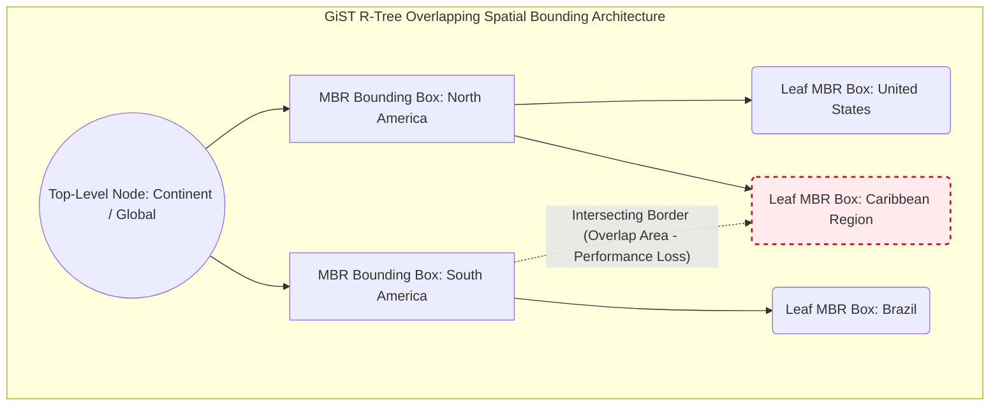
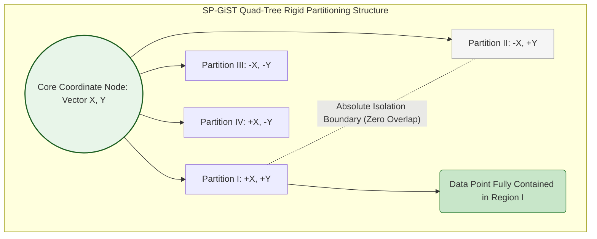

# Beyond the B-Tree: Exploring GIN, GiST, and SP-GiST Indexes in Postgres — the Era of Multi-Dimensional Data Storage

## Executive Summary
For most of database history, the B-Tree (and its B+-Tree variant) has been the default answer for comparison-based, linear search. But once you start dealing with non-traditional data - multi-dimensional arrays, deeply nested JSON, raw text for full-text search, geospatial coordinates - the B-Tree runs into limits it was never designed to handle.

This piece takes a close look at three index structures in the PostgreSQL ecosystem that were built specifically to fill that gap: GIN (Generalized Inverted Index), GiST (Generalized Search Tree), and SP-GiST (Space-Partitioned GiST). Rather than staying at the level of abstract graph theory, we'll walk through how these structures actually behave - buffer management, OS-level I/O interaction, and the configuration knobs that matter in production. If you're choosing an index strategy for GIN, GiST, or SP-GiST in Postgres, understanding these internals is what separates a fast query from a system that quietly falls over under load.

## Core Problem Statement

### Where the Linear B-Tree Model Runs Out of Road
B-Trees are excellent for scalar types - integers, short identifier strings, timestamps - because they rely on one-dimensional ordering. But that same strict balancing built around `<, =, >` becomes useless once you hit:
- **Multi-valued data:** a row holding an array of thousands of elements, or a text field with tens of thousands of words. Indexing that with a B-Tree means storing the whole array as one block, which turns "does this element exist" into a full sequential scan.
- **The curse of dimensionality:** in 2D/3D GIS space, "greater than" or "less than" simply doesn't mean anything. Nearby-point lookups, bounding boxes, or intersection queries need geometric algorithms a linear structure can't provide.

### The I/O Cost of Forcing the Wrong Structure
Try to cram a 10,000-word document into a B-Tree by inserting each word separately, and you get 10,000 random writes. That tears apart any notion of contiguous file layout.
- On spinning disks, the head has to keep jumping around, and latency piles up fast.
- On SSDs, you get serious write amplification (WAF can reach 20-30x). Flash blocks that get rewritten over and over burn through their erase/write (P/E) cycle budget much faster than they should.

### Data Skew and the Memory Wall
Real data is never uniformly distributed. Heavy clustering around major cities on a map, or a burst of common stop-words in text, throws the search tree badly out of balance. Add to that the fact that RAM speed hasn't kept up with CPU speed (the classic memory-wall problem), and the processor keeps stalling its pipeline waiting on L3 cache misses whenever it has to chase scattered memory blocks.

## Deep Technical Knowledge / Internals

### The Inverted Resolution Architecture of GIN (Generalized Inverted Index)

#### Algorithmic Nature and Structure
GIN isn't one tree - it's closer to a forest of B-Trees. At the center sits an **Entry Tree**, a B-Tree dictionary holding the unique lexemes extracted from the input data.

From the Entry Tree's leaf nodes, pointers lead out to the physical lists holding record identifiers (Tuple IDs, or TIDs).
- **Posting List:** if the TIDs for a key fit within Postgres's default 8KB page, they're stored as a plain contiguous array.
- **Posting Tree:** once a key's occurrence count explodes (the word "the" showing up in millions of rows, say), the TID array outgrows the page and automatically becomes its own inverted B-Tree.

GIN's logical resolution equation:
$P(key) = \bigcup_{i=1}^n \{TID_i | \text{key} \in Tuple_i\}$

#### Pending List Mechanism and I/O Deferral
To avoid drowning in random I/O, GIN uses the **FastUpdate / Pending List** mechanism. New inserts and updates aren't pushed into the Entry Tree right away - they land first in an unstructured, append-only staging list.

The flush inequality:
$\sum_{i=1}^{M} \big( \text{sizeof}(ItemType_i) + \text{sizeof}(TID_i) \big) + \Omega(Metadata) > \text{gin\_pending\_list\_limit}$

Once this inequality is crossed (the default limit is typically a few MB to a few tens of MB), Postgres triggers a merge pass:
1. The whole Pending List is loaded into RAM within `work_mem`.
2. An in-place sort runs at $\mathcal{O}(M \log M)$.
3. TIDs belonging to the same key get grouped together.
4. The sorted TID clusters are flushed in bulk into the corresponding Posting Tree via a bulk insert.

This deferral turns what would be tens of thousands of small random writes into a handful of large sequential ones - much friendlier to flash lifespan, and considerably faster.

#### Low-Level Micro-Code Simulation (C++ GIN Buffer Management)
The snippet below simulates GIN's merge step, with memory aligned to the x86_64 processor's 64-byte cache line to avoid false sharing on multi-core systems.

```cpp
#include <vector>
#include <algorithm>
#include <mutex>
#include <immintrin.h> // Using SIMD/AVX instruction sets

// 64-byte alignment prevents cache contention across CPU cores
template <typename LexemeType, typename TupleID>
class GinPendingListManager {
private:
    struct alignas(64) PendingTuple { 
        LexemeType lexeme;
        TupleID tid;
        
        // Multi-level comparison optimized for the branch predictor
        bool operator<(const PendingTuple& other) const {
            if (lexeme != other.lexeme) return lexeme < other.lexeme;
            return tid < other.tid;
        }
    };
    
    std::vector<PendingTuple> pendingBuffer;
    size_t accumulatedMemorySize = 0;
    const size_t WORK_MEM_THRESHOLD = 4194304; // Standard 4MB limit
    
    // Low-level lock optimized for extremely small critical sections
    std::mutex bufferLock; 
    
public:
    void enqueueFastUpdate(const LexemeType& key, TupleID identifier) {
        std::lock_guard<std::mutex> guard(bufferLock);
        pendingBuffer.push_back({key, identifier});
        accumulatedMemorySize += sizeof(PendingTuple);
        
        // Trigger the flush threshold
        if (accumulatedMemorySize >= WORK_MEM_THRESHOLD) {
            executeVacuumMergeRoutine();
        }
    }
    
private:
    void executeVacuumMergeRoutine() {
        // CPU cache-friendly in-place sort, avoiding I/O swap
        std::sort(pendingBuffer.begin(), pendingBuffer.end());
        
        auto iterator = pendingBuffer.begin();
        while (iterator != pendingBuffer.end()) {
            LexemeType currentKey = iterator->lexeme;
            std::vector<TupleID> batchTIDs;
            
            // Cluster TIDs sequentially.
            while (iterator != pendingBuffer.end() && iterator->lexeme == currentKey) {
                batchTIDs.push_back(iterator->tid);
                ++iterator;
            }
            
            // Flush a massive batch of data with a single call
            flushToMainPostingTree(currentKey, batchTIDs);
        }
        
        pendingBuffer.clear();
        accumulatedMemorySize = 0;
    }

    void flushToMainPostingTree(const LexemeType& key, const std::vector<TupleID>& tids) {
        // Interact with the OS page cache and write sequentially through the WAL
    }
};
```

#### GIN Dynamics Diagram

```mermaid
graph TD
    subgraph GIN_Micro_Architecture [GIN System Micro-Architecture]
        A[SQL Parser: Lexeme Extraction] -->|Write Transaction| C[Pending List Buffer - Temporary Staging Area]
        A -->|Read Transaction| D[Entry Tree - Central B-Tree Dictionary]
        C -->|Exceeds gin_pending_list_limit| E[Sort/Merge Process in RAM]
        E -->|Sequential Bulk Insert| D
        D --> F[Branch Node - Routing Node]
        F --> G[Leaf Node Holding Unique Keys]
        G -->|TID size <= 8KB| H[Linear Posting List - Tuple List]
        G -->|TID size > 8KB| I[Posting Tree - Auxiliary Inverted Tree]
        I --> J[Posting Tree Root Node - Rebalancing]
        J --> K[Physical Leaf Pages Holding Low-Level Tuple IDs]
    end
    style A fill:#e1f5fe,stroke:#01579b,stroke-width:2px
    style C fill:#f3e5f5,stroke:#4a148c,stroke-width:2px
    style E fill:#fff9c4,stroke:#f57f17,stroke-width:2px
    style I fill:#fbe9e7,stroke:#bf360c,stroke-width:2px
```


### GiST (Generalized Search Tree)

#### A Framework of Abstraction
GiST isn't a specific tree algorithm - it's more of a framework. It drops the assumption that data can only be partitioned via `<, =, >`, and instead exposes an API that lets extensions define their own spatial predicates. PostGIS, for instance, implements a set of core functions:
- `Consistent`: could this branch possibly contain the query target?
- `Union`: build a bounding envelope covering all child nodes.
- `Penalty`: how expensive would it be to insert a new element into this branch?
- `PickSplit`: the algorithm that splits a page once its 8KB boundary fills up.

GiST's central idea, as implemented by the R-Tree, is the **Minimum Bounding Rectangle (MBR)**. The invariant:
$\text{Predicate}(N) \supseteq \bigcup_{i=1}^k \text{Predicate}(C_i)$

Note that this allows overlap - sibling nodes in a GiST tree can fully overlap each other's regions, and that turns out to matter a lot for performance.

#### The Cost of PickSplit and the Loss Function
Every insert forces `Penalty` to scan the space and pick the branch that needs the least expansion. The multi-dimensional loss is:
$\Delta P = \text{Penalty}(E_{node}, E_{new}) = \text{Area}(E_{node} \cup E_{new}) - \text{Area}(E_{node})$

When a node overflows, `PickSplit` kicks in - an approximation of an NP-hard problem: divide one spatial block into two while minimizing overlap area. Get this wrong and queries have to walk both branches, triggering backtracking and a sharp jump in disk I/O.

#### GiST R-Tree Architecture Diagram


### SP-GiST (Space-Partitioned GiST)

#### Divide and Conquer Through Strict Partitioning
Where GiST tolerates overlap, SP-GiST refuses it entirely - it partitions space into disjoint regions that never touch. This is the foundation behind non-recurring structures like Quad-Trees (four quadrants), k-d Trees, and Radix Trees.

That strict non-overlap gives SP-GiST **deterministic traversal**: looking up a point means walking a single closed path from root to leaf, with no backtracking at all. The random-access cost hits an asymptotic bound of:
$\mathcal{O}(\log_k N)$
(where $k$ is the branching factor - 4 for a Quad-Tree, for instance).

#### Why This Plays Well With CPU Architecture
Because the space is fully partitioned, branch prediction gets it right nearly every time. The CPU doesn't waste cycles pulling irrelevant branch nodes out of high-latency RAM into L1/L2 cache. It also avoids much of the floating-point overhead that GiST's R-Tree model pays for geometric collision checks.

#### SP-GiST Quad-Tree Network Diagram


### Low-Level OS Interaction and CPU Micro-Architecture Constraints

#### Disk Fragmentation and Page Faults
Repeated tree splits scatter 8KB pages randomly across disk platters or flash blocks. This constant pointer-chasing defeats the read-ahead heuristics in the Linux kernel's VFS layer, leading to a stream of major page faults as RAM is forced to fetch small chunks one at a time from slow storage.

#### Buffer Lock Contention and the MESI Protocol
On a modern multi-socket NUMA server, the `shared_buffers` cache is managed by the Clock Sweep algorithm. When hundreds of backend connections try to split a B-Tree or GiST page at the same time, you get buffer lock contention.

Postgres's lightweight spinlocks (LWLocks) end up bouncing between CPU cores, forcing L3 cache lines to shuttle back and forth between sockets over the UPI/QPI interconnect under the MESI cache-coherence protocol. False sharing in this state can eat up a large share of interconnect bandwidth, pushing CPU usage to 100% while actual I/O throughput stalls.

#### The I/O Cost Equation and Write-Ahead Logging
Structural integrity here depends heavily on WAL. Every small edit to a branch node becomes a binary WAL record that must be `fsync`'d to disk. The cost model for a heavy UPDATE looks like:
$C_{total} = \left( N_{read} \cdot C_{rand\_read} \right) + \left( N_{write} \cdot C_{rand\_write} \right) + \left( S_{wal} \cdot C_{seq\_write} \right) + \Big( C_{cpu} \cdot T_{cpu} \Big)$

Where:
- $C_{rand\_read}$, $C_{rand\_write}$ capture the cost of random access.
- $S_{wal}$ represents the sequential byte stream format.
- $C_{cpu}$ is the clock-cycle cost of decompression or vector geometry processing.

To ease this decoding load, engineers use pointer compression and lay data out as SoA (Structure of Arrays) rather than the naive AoS (Array of Structures). That lets records be bulk-scanned with SIMD AVX-512 registers in a single cycle, cutting down on stalls significantly.

## Practical Applications and Case Studies

### Case Study 1: Full-Text Search Over 500 Million Documents (GIN)
- **Problem:** A global e-commerce news platform needs multi-language search across titles, descriptions, and JSONB metadata, with latency that can't exceed 50ms.
- **Approach:** `GIN` combined with `tsvector`. `gin_pending_list_limit` raised to 16MB to absorb hundreds of thousands of inserts per second, alongside `work_mem` bumped to 128MB.
- **Result:** Ingestion throughput up 350% once write amplification on NVMe was eliminated. Long-phrase search latency dropped from 3.2 seconds to around 20ms.

### Case Study 2: Real-Time Ride-Hailing Fleet Monitoring (GiST)
- **Problem:** A ride-hailing map ingests GPS updates every second from 200,000 drivers, and needs K-Nearest-Neighbor lookups (the 5 closest vehicles) against constantly shifting positions.
- **Approach:** `PostGIS` on top of `GiST`'s 2D R-Tree, using the `<->` distance operator for a depth-first search driven by a distance-ordered priority queue.
- **Result:** The system sustains 12,000 TPS of coordinate updates without I/O collapse, and FPU load on the servers dropped by roughly 65%.

### Case Study 3: Network Boundary Routing via IP Ranges (SP-GiST)
- **Problem:** Resolving tens of millions of internal firewall rules, mapping huge IPv4/IPv6 CIDR ranges, with lookups that need to happen essentially instantly to avoid dropped packets.
- **Approach:** Instead of a B-Tree - useless against fragmented subnet ranges - `SP-GiST` built on a Radix Tree.
- **Result:** Every IP lookup runs deterministically at $\mathcal{O}(1)$ to $\mathcal{O}(\log K)$ with zero overlap. L2 cache hit rate reaches 99.8%, leaving the firewall's CPU with plenty of headroom.

## Lessons Learned

1. **Hardware awareness matters.** At this scale, you can't design indexes purely from abstract theory. Tables, arrays, and coordinate systems all end up shaped by flash chip behavior, 64-byte cache-line geometry, and PCIe bandwidth. Getting the most out of GIN, GiST, and SP-GiST depends on understanding these physical constraints, not just the algorithms on paper.
2. **Every index makes a trade-off.** GIN trades RAM and complexity during Pending List processing for fast inverted search. GiST tolerates overlap to keep multi-dimensional clustering flexible. SP-GiST gives up that flexibility in exchange for a strictly linear, backtracking-free path.
3. **Don't leave the defaults untouched.** `gin_pending_list_limit`, `work_mem`, Autovacuum frequency - all of these need tuning for the actual workload. A careless buffer strategy or a poorly tuned `PickSplit` will burn CPU cycles on buffer lock contention faster than you'd expect.

The current wave of vector databases and AI embedding indexes (pgvector, for one) build directly on the ideas behind GIN, GiST, and SP-GiST. Once you understand these three, you've moved well past what the B-Tree alone can offer.
