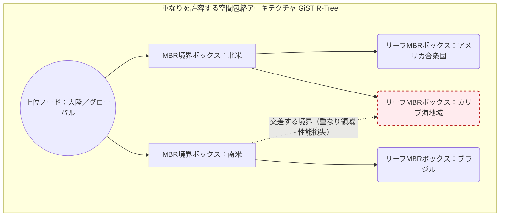
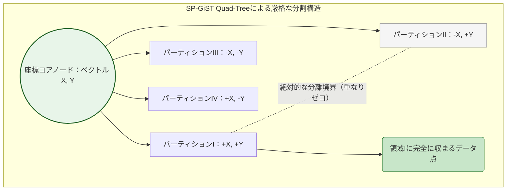

# B-Treeを超えて：PostgreSQLにおけるGIN、GiST、SP-GiSTインデックスの探求 — 多次元データストレージの時代

## エグゼクティブサマリー

データベース管理システム(DBMS)の歴史を振り返ると、B-Tree(とその派生であるB+-Tree)は比較演算に基づく線形探索の定番であり続けてきた。しかし多次元配列、深くネストしたJSONドキュメント、全文検索向けの生テキスト、地理空間データといった非伝統的なデータ形式が広がるにつれ、B-Treeアーキテクチャはその物理的・アルゴリズム的な限界にぶつかるようになった。

この記事では、PostgreSQLエコシステムの中でもとりわけ精巧な三つのインデックス構造 — GIN(Generalized Inverted Index)、GiST(Generalized Search Tree)、SP-GiST(Space-Partitioned GiST) — を掘り下げる。抽象的なグラフ理論の説明にとどまらず、バッファ管理、OSレベルのI/Oとのやり取り、実運用での設定調整まで含めて、これらの構造が実際にどう動くのかを見ていく。GIN、GiST、SP-GiSTというインデックスの内部を理解することが、速いクエリと本番環境で詰まるクエリの分かれ目になる。

## 核心となる問題

### 線形B-Treeモデルの限界
B-Treeは一次元的な順序性(one-dimensional ordering)のおかげで、整数、短い識別子文字列、タイムスタンプといったスカラー型に対して非常によく最適化されている。しかし`<, =, >`という演算に基づくB-Treeの厳密な平衡原理は、以下のようなケースには対応できない。
- **多値データ:** 数千の要素を持つ配列、あるいは数万語のテキストを含む1行のレコード。B-Treeでインデックスを張るには配列全体を一枚のブロックとして保存するしかなく、その中の特定要素を探す作業はすぐに全件シーケンシャルスキャンになってしまう。
- **次元の呪い:** 2D/3DのGIS座標のような多次元空間では、「より大きい」「より小さい」という概念自体が意味をなさない。近傍点、境界矩形、交差判定といったクエリには幾何学的なアルゴリズムが必要で、線形構造では手に負えない。

### 無理にB-Treeへ押し込んだ場合のI/Oコスト
1万語のテキスト文書を単語ごとに分割してB-Treeへ挿入しようとすると、1万回のランダム書き込みが発生する。これはファイルシステムの連続的な構造を壊してしまう。
- 機械式ハードディスク(HDD)では、ヘッドが絶えず移動を強いられ、レイテンシが急激に悪化する。
- SSDでは深刻な書き込み増幅(Write Amplification Factor、WAFは20〜30倍に達することもある)が起きる。繰り返し上書きされるフラッシュブロックは、NANDフラッシュの消去/書き込み(P/E)サイクルの寿命を通常より早く消耗させる。

### データの偏りとメモリの壁
現実のデータは一様には分布しない。GISマップ上で大都市に集中するデータや、テキスト中に偏在するストップワードは、検索木のバランスを大きく崩す。加えてRAMの速度はCPUの速度に追いついていない(いわゆるメモリの壁)ため、断片化したメモリブロックを読みに行くたびにL3キャッシュミスが起き、プロセッサのパイプラインが頻繁に止まってしまう。

## 詳細な技術知識・内部構造

### GIN(Generalized Inverted Index)の転置解決アーキテクチャ

#### アルゴリズムの本質と構造
GINは単一の木というより、B-Treeの森に近い構造をしている。中心にあるのは**Entry Tree**で、入力データから抽出された一意の語彙(lexeme)を保持するB-Tree辞書だ。

Entry Treeのリーフノードからは、レコード識別子(Tuple ID、TID)を保持する物理リストへポインタが伸びている。
- **Posting List:** TIDの数がPostgresデフォルトの8KBページに収まるくらい少なければ、単純な連続配列として保存される。
- **Posting Tree:** あるキーの出現回数が膨れ上がると(例えば"the"が数百万件のレコードに出現する場合)、TID配列がページに収まらなくなり、自動的に独立した転置B-Treeへと変わる。

GINの論理解決方程式:
$P(key) = \bigcup_{i=1}^n \{TID_i | \text{key} \in Tuple_i\}$

#### Pending Listメカニズムによる I/Oの先送り
ランダムI/Oの洪水を避けるため、GINは**FastUpdate / Pending List**という仕組みを使う。新しいInsert/Updateはすぐにはentry treeへ書き込まれず、まず非構造化の追記専用リストに一時的に置かれる。

フラッシュの不等式:
$\sum_{i=1}^{M} \big( \text{sizeof}(ItemType_i) + \text{sizeof}(TID_i) \big) + \Omega(Metadata) > \text{gin\_pending\_list\_limit}$

この不等式を超えると(デフォルトの上限はおおむね数MBから数十MB程度)、PostgreSQLはマージ処理を起動する。
1. Pending List全体を`work_mem`の範囲でRAMにロードする。
2. $\mathcal{O}(M \log M)$のインプレースソートを実行する。
3. 同じキーに属するTIDをまとめてグループ化する。
4. ソート済みのTIDクラスタを一括挿入で対応するPosting Treeへ書き込む。

この先送り処理によって、本来なら数万回に及ぶランダム書き込みが、数回の大きなシーケンシャル書き込みに置き換わる。フラッシュの寿命を守りつつ、スループットも大きく向上する。

#### 低レベルの動作をC++で疑似的に再現(GINバッファ管理)
以下のコードはGINのマージ処理を模したもので、x86_64の64バイトキャッシュラインに合わせてメモリを整列させ、マルチコア環境での偽共有(False Sharing)を避けている。

```cpp
#include <vector>
#include <algorithm>
#include <mutex>
#include <immintrin.h> // SIMD/AVX命令セットを使用

// 64バイトアラインメントによりCPUコア間のキャッシュ競合を防止する
template <typename LexemeType, typename TupleID>
class GinPendingListManager {
private:
    struct alignas(64) PendingTuple { 
        LexemeType lexeme;
        TupleID tid;
        
        // ブランチプレディクタに最適化された多段階比較条件
        bool operator<(const PendingTuple& other) const {
            if (lexeme != other.lexeme) return lexeme < other.lexeme;
            return tid < other.tid;
        }
    };
    
    std::vector<PendingTuple> pendingBuffer;
    size_t accumulatedMemorySize = 0;
    const size_t WORK_MEM_THRESHOLD = 4194304; // 標準的な4MBの上限
    
    // 極めて小さいクリティカルセクションに最適化された低レベルロック
    std::mutex bufferLock; 
    
public:
    void enqueueFastUpdate(const LexemeType& key, TupleID identifier) {
        std::lock_guard<std::mutex> guard(bufferLock);
        pendingBuffer.push_back({key, identifier});
        accumulatedMemorySize += sizeof(PendingTuple);
        
        // オーバーフロー閾値に達したらフラッシュを起動
        if (accumulatedMemorySize >= WORK_MEM_THRESHOLD) {
            executeVacuumMergeRoutine();
        }
    }
    
private:
    void executeVacuumMergeRoutine() {
        // I/Oスワップを回避する、CPUキャッシュに優しいインプレースソート
        std::sort(pendingBuffer.begin(), pendingBuffer.end());
        
        auto iterator = pendingBuffer.begin();
        while (iterator != pendingBuffer.end()) {
            LexemeType currentKey = iterator->lexeme;
            std::vector<TupleID> batchTIDs;
            
            // TIDを順番にクラスタリングする
            while (iterator != pendingBuffer.end() && iterator->lexeme == currentKey) {
                batchTIDs.push_back(iterator->tid);
                ++iterator;
            }
            
            // 1回の呼び出しで大量のデータを一括フラッシュする
            flushToMainPostingTree(currentKey, batchTIDs);
        }
        
        pendingBuffer.clear();
        accumulatedMemorySize = 0;
    }

    void flushToMainPostingTree(const LexemeType& key, const std::vector<TupleID>& tids) {
        // OSのページキャッシュとやり取りし、WALを通じて順次書き込む
    }
};
```

#### GIN動作フロー図


### GiST(Generalized Search Tree、汎用探索木)

#### 抽象化のフレームワークとして
GiSTは特定の木構造アルゴリズムというより、一種のフレームワークだ。データが`<, =, >`だけでしか分割できないという前提を外し、代わりに空間述語(predicate)を自由に定義できるAPIを提供する。PostGISのような拡張機能は、次のような関数を実装する。
- `Consistent`: あるブランチがクエリ対象を含みうるかどうかを判定する。
- `Union`: すべての子ノードの空間を包む境界包絡線(Bounding Envelope)を作る。
- `Penalty`: 新しい要素をあるブランチに挿入した場合の空間的コストを見積もる。
- `PickSplit`: 8KBページが満杯になったときにページを分割するアルゴリズム。

GiSTの中心にある考え方は、R-Treeの実装で使われる**最小境界矩形(Minimum Bounding Rectangle、MBR)**だ。不変条件は次のように書ける。
$\text{Predicate}(N) \supseteq \bigcup_{i=1}^k \text{Predicate}(C_i)$

この包含関係は空間の重なり(Overlap)を許す。GiSTの兄弟ノードは互いの領域を完全に重ね合わせることができ、これが後々パフォーマンスに大きく効いてくる。

#### PickSplitのコストと損失関数
新しいレコードが挿入されるたびに、`Penalty`関数は空間をスキャンして、最も拡張の少ないブランチを選ばなければならない。多次元の損失は次のように計算される。
$\Delta P = \text{Penalty}(E_{node}, E_{new}) = \text{Area}(E_{node} \cup E_{new}) - \text{Area}(E_{node})$

ノードがメモリ境界を超えると`PickSplit`が起動する。これはNP困難な問題の近似で、1つの空間ブロックを2つに分けつつ重なり領域(Overlap Area)を最小化しようとする。ここでの分割が甘いと、クエリは木の両方のブランチを走査せねばならず、バックトラッキングが発生し、ディスクI/Oが一気に増える。

#### GiST R-Treeアーキテクチャ図


### SP-GiST(Space-Partitioned GiST、空間分割GiST)

#### 徹底した分割による分割統治
GiSTが重なりを許容するのに対し、SP-GiSTは空間を無数の完全に独立したパーティションへと分割し、互いに重ならないことを絶対条件とする。Quad-Tree(4分木)、k-d Tree、Radix Treeといった、重複のない木構造の基礎になっている。

この厳密な非重複性が、**決定論的な走査(Deterministic Traversal)**という強みを生む。SP-GiSTで点を探すのは、ルートからリーフへとまっすぐ進む一本道であり、バックトラックは一切発生しない。ランダムアクセスのコストは次の漸近限界に達する。
$\mathcal{O}(\log_k N)$
($k$は構造の分岐数で、Quad-Treeなら$k=4$)

#### CPUアーキテクチャとの相性
空間が完全に分離されているため、CPUの分岐予測はほぼ常に的中する。高レイテンシのRAMから無駄な分岐ノードをL1/L2キャッシュへ読み込む無駄がない。またGiSTのR-Treeモデルが必要とする重い幾何学的な衝突判定に比べ、浮動小数点演算装置(FPU)の負荷もかなり抑えられる。

#### SP-GiST Quad-Treeネットワーク図


### OSとの低レベルなやり取りとCPUマイクロアーキテクチャの制約

#### ディスク断片化とページフォールト
インデックスツリーが分割を繰り返すたびに、物理的な8KBページはディスクプラッタやフラッシュブロック上にランダムに散らばっていく。この絶え間ないポインタジャンプは、Linuxカーネルの VFS(Virtual File System)層にある先読み処理を無力化し、大量のメジャーページフォールトを引き起こす。結果としてRAMは遅いディスクから小さなデータの塊を一つずつ読み込むはめになる。

#### バッファロック競合とMESIプロトコル
複数ソケットのNUMAサーバーでは、`shared_buffers`キャッシュはClock Sweepアルゴリズムで管理されている。数百のバックエンド接続が同時にB-TreeやGiSTのページを分割しようとすると、バッファロック競合が生じる。

Postgresの軽量スピンロック(LWLocks)はCPUコア間で奪い合われ、L3キャッシュの内容はUPI/QPIインターコネクトを介してソケット間を行き来する羽目になる。これはMESIキャッシュコヒーレンシプロトコルの裁定によるものだ。偽共有(False Sharing)が起きると、インターコネクト帯域の大きな割合を消費してしまい、CPU使用率が100%に張り付く一方でI/Oのスループットはほぼ止まる。

#### I/Oコスト方程式とWrite-Ahead Logging
構造の整合性はWALに大きく依存している。分岐ノードへのわずかな変更もバイナリのWALレコードに変換され、`fsync`によってディスクへ書き込まれる。重いUPDATE文のI/Oコストモデルは次のようになる。
$C_{total} = \left( N_{read} \cdot C_{rand\_read} \right) + \left( N_{write} \cdot C_{rand\_write} \right) + \left( S_{wal} \cdot C_{seq\_write} \right) + \Big( C_{cpu} \cdot T_{cpu} \Big)$

ここで:
- $C_{rand\_read}$、$C_{rand\_write}$ はランダムアクセスのコストを表す。
- $S_{wal}$ は連続したバイトストリームの形式を表す。
- $C_{cpu}$ は解凍処理やベクトル幾何計算にかかるクロックサイクルのコストだ。

この負荷を和らげるため、エンジニアはポインタ圧縮を使ったり、レイアウトを素朴なAoS(Array of Structures)からSoA(Structure of Arrays)へ切り替えたりする。こうしておくとSIMD(AVX-512)レジスタで一括スキャンでき、パイプラインの停滞をかなり減らせる。

## 実践的応用とケーススタディ

### ケーススタディ1: 5億件の文書に対する全文検索(GIN)
- **課題:** グローバルなEコマースニュース配信システムが、タイトル、説明文、JSONBメタデータにまたがる多言語検索を必要としており、レイテンシは50msを超えられない。
- **対応:** `GIN`を`tsvector`と組み合わせて使用。`gin_pending_list_limit`を16MBまで引き上げ、毎秒数十万件のInsertを吸収できるようにし、`work_mem`も128MBに設定した。
- **結果:** NVMe SSD上の書き込み増幅がなくなったことで取り込み速度が350%向上。長いフレーズの検索クエリのレイテンシは3.2秒からおよそ20msまで縮まった。

### ケーススタディ2: 配車サービスの車両群リアルタイム監視(GiST)
- **課題:** 配車アプリの地図が20万人のドライバーから毎秒GPS更新を受け取り、常に変化する位置情報の中でK近傍探索(最寄りの5台)を行う必要がある。
- **対応:** `GiST`の2D R-Treeを基盤とする`PostGIS`を利用。距離演算子`<->`を使い、距離順の優先度付きキューによる深さ優先探索を行った。
- **結果:** ディスク輻輳を起こすことなく、座標更新で12,000 TPSを維持。サーバーのFPU負荷はおよそ65%削減された。

### ケーススタディ3: IPアドレス範囲によるネットワーク経路解決(SP-GiST)
- **課題:** 数千万件の社内ファイアウォールルールに対する経路解決。膨大なIPv4/IPv6のCIDR範囲を、パケットロスを避けるためほぼ瞬時にマッピングする必要がある。
- **対応:** 断片化したサブネット範囲に無力なB-Treeの代わりに、Radix Treeを基盤とする`SP-GiST`を採用した。
- **結果:** すべてのIP検索が$\mathcal{O}(1)$から$\mathcal{O}(\log K)$のレイテンシで、重なりゼロのまま決定論的に完了する。L2キャッシュヒット率は99.8%に達し、ファイアウォールサーバーのCPUに十分な余裕が生まれた。

## 学び取るべき教訓

1. **ハードウェアへの理解が欠かせない。** ビッグデータの時代では、抽象的な理論だけでインデックスを設計することはできない。テーブル、配列、座標系はいずれも、フラッシュチップの挙動、64バイトのキャッシュライン、PCIeバスの帯域幅といった物理的な制約の影響を受ける。GIN、GiST、SP-GiSTを使いこなせるかどうかは、こうした制約への理解に大きく左右される。
2. **すべてのインデックスにはトレードオフがある。** GINはPending Listの処理でRAMと複雑さを費やす代わりに高速な転置検索を得る。GiSTは重なりを許容することで多次元クラスタリングの柔軟性を保つ。SP-GiSTはその柔軟性を捨てる代わりに、バックトラックのない厳密な線形経路を手に入れる。
3. **デフォルト設定のままにしない。** `gin_pending_list_limit`、`work_mem`、Autovacuumの頻度など、これらはすべて実際のワークロードに合わせて調整すべきものだ。バッファ戦略が甘かったり`PickSplit`の調整が不十分だったりすると、バッファロック競合であっという間にCPUを消耗させてしまう。

今日のベクトルデータベースやAI埋め込みモデル(pgvectorなど)の隆盛は、GIN、GiST、SP-GiSTのマイクロレベルの発想の上に成り立っている。この三つを理解すれば、B-Treeだけでは届かない領域まで踏み込めるようになる。
