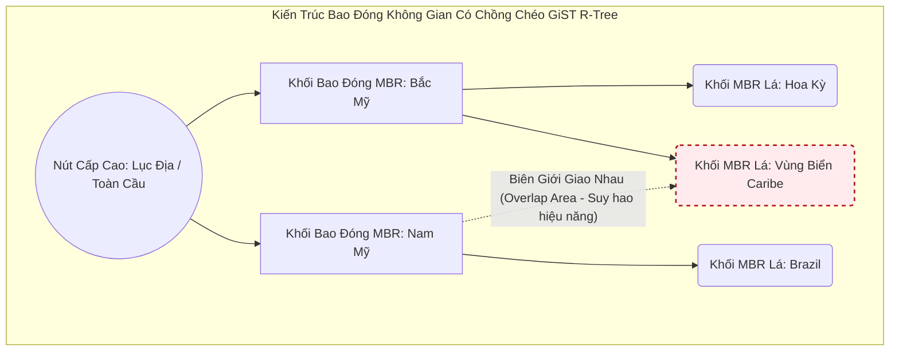
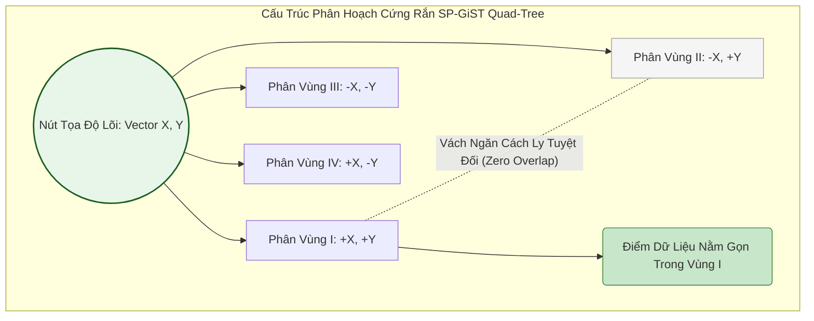

# 17: Vượt ra khỏi B-Tree: Khám phá GIN, GiST, và SP-GiST Indexes trong Postgres - Kỷ Nguyên Lưu Trữ Dữ Liệu Đa Chiều

## Tóm Tắt Chuyên Sâu

Trong suốt lịch sử phát triển của các hệ quản trị cơ sở dữ liệu, mô hình B-Tree (và biến thể B+-Tree) gần như luôn là lựa chọn mặc định cho các phép tìm kiếm dựa trên so sánh tuyến tính. Nhưng khi các dạng dữ liệu phi truyền thống ngày càng phổ biến - mảng đa chiều, JSON lồng ghép sâu, văn bản thô cho full-text search, dữ liệu không gian địa lý - B-Tree bắt đầu chạm giới hạn cả về vật lý lẫn thuật toán.

Bài viết này đi sâu vào ba cấu trúc chỉ mục trong hệ sinh thái PostgreSQL được thiết kế riêng để lấp đầy khoảng trống đó: GIN (Generalized Inverted Index), GiST (Generalized Search Tree), và SP-GiST (Space-Partitioned GiST). Thay vì dừng ở lý thuyết đồ thị trừu tượng, chúng ta sẽ xem cách các cấu trúc này vận hành thực tế - cách quản lý buffer, cách tương tác I/O ở tầng hệ điều hành, và những cấu hình thực sự ảnh hưởng đến hiệu năng khi chạy production. Hiểu rõ GIN, GiST, SP-GiST là điều phân biệt một truy vấn nhanh với một hệ thống âm thầm sập dưới tải.

## Vấn Đề Cốt Lõi

### Giới Hạn Của Mô Hình B-Tree Tuyến Tính
B-Tree tối ưu rất tốt cho các kiểu dữ liệu vô hướng như số nguyên, chuỗi định danh ngắn, hay timestamp, nhờ tính sắp thứ tự một chiều. Nhưng nguyên lý cân bằng chặt chẽ dựa trên `<, =, >` lại hoàn toàn bất lực trước:
- **Dữ liệu đa trị:** một bản ghi chứa mảng hàng nghìn phần tử, hoặc một văn bản hàng chục nghìn từ. Đánh chỉ mục bằng B-Tree buộc phải lưu nguyên khối mảng đó, khiến việc tìm một phần tử bên trong biến thành một lượt quét tuần tự toàn bộ.
- **Hiện tượng bùng nổ chiều không gian:** trong không gian đa chiều (tọa độ GIS 2D/3D), khái niệm "lớn hơn" hay "nhỏ hơn" không còn ý nghĩa. Truy vấn điểm lân cận, đường bao hình chữ nhật, hay giao điểm cần các thuật toán hình học mà cấu trúc tuyến tính không đáp ứng được.

### Chi Phí I/O Khi Ép Sai Cấu Trúc
Nếu cố nhét một văn bản 10.000 từ vào B-Tree bằng cách insert từng từ riêng lẻ, hệ thống sẽ phải thực hiện 10.000 lượt ghi ngẫu nhiên, phá vỡ tính liên tục của hệ thống tệp.
- Trên ổ HDD cơ học, đầu từ phải di chuyển liên tục, kéo độ trễ lên rất cao.
- Trên SSD, hiện tượng khuếch đại ghi (Write Amplification Factor - WAF có thể lên tới 20-30 lần) xảy ra. Các khối flash bị ghi đè lặp lại sẽ bào mòn chu kỳ xóa/ghi (P/E cycle) nhanh hơn bình thường rất nhiều.

### Lệch Trục Dữ Liệu và Bức Tường Bộ Nhớ
Dữ liệu thực tế hiếm khi phân bố đều. Việc dồn cụm quá mức quanh các đô thị lớn trên bản đồ GIS, hay các stop-word xuất hiện dày đặc trong văn bản, làm mất cân bằng cây tìm kiếm đáng kể. Cộng thêm việc tốc độ RAM không theo kịp tốc độ CPU (hiện tượng memory wall), vi xử lý thường xuyên phải dừng pipeline vì L3 cache miss mỗi khi phải đọc các khối bộ nhớ phân mảnh.

## Kiến Thức Kỹ Thuật Chuyên Sâu

### Kiến Trúc Phân Giải Nghịch Đảo Của GIN (Generalized Inverted Index)

#### Bản Chất Thuật Toán và Cấu Trúc
GIN không phải một cây đơn lẻ mà giống một "khu rừng" gồm nhiều B-Tree. Cấu trúc trung tâm là Entry Tree - một cây B-Tree đóng vai trò từ điển, chứa các lexeme (khóa từ) duy nhất được trích ra từ dữ liệu đầu vào.

Từ các nút lá của Entry Tree, con trỏ dẫn tới các danh sách vật lý chứa định danh bản ghi (Tuple ID - TID).
- **Posting List:** nếu số lượng TID đủ nhỏ để vừa trong một trang 8KB mặc định của Postgres, nó được lưu như một mảng liên tục đơn giản.
- **Posting Tree:** khi số lần xuất hiện của một khóa phình to (ví dụ từ "the" xuất hiện ở hàng triệu bản ghi), mảng TID vượt quá kích thước trang và tự động trở thành một cây B-Tree đảo ngược riêng.

Phương trình phân giải logic của GIN:
$P(key) = \bigcup_{i=1}^n \{TID_i | \text{key} \in Tuple_i\}$

#### Cơ Chế Pending List và Chiến Lược Trì Hoãn I/O
Để tránh bị nhấn chìm bởi I/O ngẫu nhiên, GIN dùng cơ chế FastUpdate / Pending List. Các thao tác insert/update mới không được đẩy ngay vào Entry Tree, mà tạm thời nằm ở một danh sách phi cấu trúc, chỉ ghi thêm (append-only) ở tầng trên.

Bất đẳng thức kích hoạt xả dữ liệu:
$\sum_{i=1}^{M} \big( \text{sizeof}(ItemType_i) + \text{sizeof}(TID_i) \big) + \Omega(Metadata) > \text{gin\_pending\_list\_limit}$

Khi bất đẳng thức này bị vượt qua (giới hạn mặc định thường vài MB đến vài chục MB), PostgreSQL kích hoạt một lượt hợp nhất:
1. Toàn bộ Pending List được nạp vào RAM trong phạm vi `work_mem`.
2. Một thuật toán sắp xếp tại chỗ chạy với độ phức tạp $\mathcal{O}(M \log M)$.
3. Các TID cùng khóa được gom nhóm lại với nhau.
4. Các cụm TID đã sắp xếp được xả hàng loạt vào Posting Tree tương ứng thông qua một lượt bulk insert.

Việc trì hoãn này biến hàng chục nghìn lượt ghi ngẫu nhiên nhỏ lẻ thành một vài lượt ghi tuần tự lớn - tốt hơn nhiều cho tuổi thọ ổ flash, và nhanh hơn đáng kể.

#### Mô Phỏng Vi Mã Cấp Thấp (C++ Quản Lý Buffer Của GIN)
Đoạn mã dưới đây mô phỏng bước hợp nhất của GIN, với bộ nhớ được căn chỉnh theo cache line 64-byte của vi xử lý x86_64 để tránh false sharing trên hệ thống nhiều nhân.

```cpp
#include <vector>
#include <algorithm>
#include <mutex>
#include <immintrin.h> // Sử dụng tập lệnh SIMD/AVX 

// Căn chỉnh 64-byte ngăn ngừa tranh chấp Cache giữa các lõi CPU
template <typename LexemeType, typename TupleID>
class GinPendingListManager {
private:
    struct alignas(64) PendingTuple { 
        LexemeType lexeme;
        TupleID tid;
        
        // Điều kiện so sánh đa cấp tối ưu cho Branch Predictor
        bool operator<(const PendingTuple& other) const {
            if (lexeme != other.lexeme) return lexeme < other.lexeme;
            return tid < other.tid;
        }
    };
    
    std::vector<PendingTuple> pendingBuffer;
    size_t accumulatedMemorySize = 0;
    const size_t WORK_MEM_THRESHOLD = 4194304; // Limit 4MB tiêu chuẩn
    
    // Spinlock cấp thấp tối ưu cho khoảng tranh chấp vùng găng cực nhỏ
    std::mutex bufferLock; 
    
public:
    void enqueueFastUpdate(const LexemeType& key, TupleID identifier) {
        std::lock_guard<std::mutex> guard(bufferLock);
        pendingBuffer.push_back({key, identifier});
        accumulatedMemorySize += sizeof(PendingTuple);
        
        // Kích hoạt ngưỡng tràn flush
        if (accumulatedMemorySize >= WORK_MEM_THRESHOLD) {
            executeVacuumMergeRoutine();
        }
    }
    
private:
    void executeVacuumMergeRoutine() {
        // CPU Cache-friendly In-place Sort tránh I/O Swap
        std::sort(pendingBuffer.begin(), pendingBuffer.end());
        
        auto iterator = pendingBuffer.begin();
        while (iterator != pendingBuffer.end()) {
            LexemeType currentKey = iterator->lexeme;
            std::vector<TupleID> batchTIDs;
            
            // Gom cụm TID tuần tự.
            while (iterator != pendingBuffer.end() && iterator->lexeme == currentKey) {
                batchTIDs.push_back(iterator->tid);
                ++iterator;
            }
            
            // Xả tải một khối lượng khổng lồ dữ liệu bằng một lệnh duy nhất
            flushToMainPostingTree(currentKey, batchTIDs);
        }
        
        pendingBuffer.clear();
        accumulatedMemorySize = 0;
    }

    void flushToMainPostingTree(const LexemeType& key, const std::vector<TupleID>& tids) {
        // Giao tiếp với Page Cache của OS và ghi đè tuần tự qua WAL
    }
};
```

#### Sơ Đồ Động Học GIN
```mermaid
graph TD
    subgraph GIN_Micro_Architecture [Kiến Trúc Vi Mô Hệ Thống GIN]
        A[SQL Parser: Trích Xuất Lexemes] -->|Giao Dịch Ghi| C[Pending List Buffer - Vùng Nhớ Đệm Tạm Thời]
        A -->|Giao Dịch Đọc| D[Entry Tree - Cây B-Tree Từ Điển Trung Tâm]
        C -->|Vượt Ngưỡng gin_pending_list_limit| E[Tiến Trình Sort/Merge Trên RAM]
        E -->|Bulk Insert Tuần Tự| D
        D --> F[Nút Nhánh Điều Phối (Branch Node)]
        F --> G[Nút Lá Chứa Khóa Duy Nhất (Leaf Node)]
        G -->|Kích thước TID <= 8KB| H[Posting List Tuyến Tính - Danh Sách Tuples]
        G -->|Kích thước TID > 8KB| I[Posting Tree - Cây Đảo Ngược Phụ Trợ]
        I --> J[Nút Gốc Posting Tree Tái Cân Bằng]
        J --> K[Các Trang Lá Vật Lý Chứa Tuple IDs Cấp Thấp]
    end
    style A fill:#e1f5fe,stroke:#01579b,stroke-width:2px
    style C fill:#f3e5f5,stroke:#4a148c,stroke-width:2px
    style E fill:#fff9c4,stroke:#f57f17,stroke-width:2px
    style I fill:#fbe9e7,stroke:#bf360c,stroke-width:2px
```

### GiST (Generalized Search Tree)

#### Một Framework Trừu Tượng
GiST không phải một thuật toán cây cụ thể, mà giống một framework hơn. Nó bỏ giả định rằng dữ liệu chỉ có thể phân chia bằng `<, =, >`, thay vào đó cung cấp một API cho phép các extension tự định nghĩa vị từ không gian (predicate) riêng. PostGIS, chẳng hạn, khai báo các hàm cốt lõi sau:
- `Consistent`: liệu một nhánh có khả năng chứa mục tiêu truy vấn hay không.
- `Union`: tạo ra một khối bao đóng (bounding envelope) trùm toàn bộ không gian của các nút con.
- `Penalty`: chi phí không gian phải trả nếu chèn thêm một phần tử mới vào nhánh này.
- `PickSplit`: thuật toán chia trang khi ranh giới 8KB đã đầy.

Ý tưởng trung tâm của GiST, theo cách R-Tree triển khai, là Minimum Bounding Rectangle (MBR). Bất biến ràng buộc:
$\text{Predicate}(N) \supseteq \bigcup_{i=1}^k \text{Predicate}(C_i)$

Điều này cho phép các vùng chồng lấn (overlap) - các nút anh em trong GiST hoàn toàn có thể đè lên không gian của nhau, và đây chính là điểm ảnh hưởng lớn đến hiệu năng sau này.

#### Chi Phí Của PickSplit và Hàm Tổn Thất
Mỗi lần chèn bản ghi mới, hàm `Penalty` phải quét không gian để chọn nhánh cần mở rộng ít nhất. Tổn thất đa chiều được tính bằng:
$\Delta P = \text{Penalty}(E_{node}, E_{new}) = \text{Area}(E_{node} \cup E_{new}) - \text{Area}(E_{node})$

Khi một nút tràn ranh giới bộ nhớ, `PickSplit` được kích hoạt - một dạng xấp xỉ cho bài toán NP-hard: chia một khối không gian thành hai phần sao cho vùng chồng lấn (overlap area) là nhỏ nhất. Nếu chia không tốt, truy vấn phải duyệt cả hai nhánh, kích hoạt cơ chế quay lui (backtracking) và khiến số lệnh gọi I/O tăng vọt.

#### Sơ Đồ Kiến Trúc GiST R-Tree


### SP-GiST (Space-Partitioned GiST)

#### Chia Để Trị Bằng Phân Hoạch Triệt Để
Trong khi GiST chấp nhận chồng lấn, SP-GiST chia không gian thành vô số phân vùng hoàn toàn tách biệt, đảm bảo loại trừ lẫn nhau tuyệt đối. Đây là nền tảng cho các cấu trúc cây không lặp lại: Quad-Tree (4 góc phần tư), k-d Tree, Radix Tree.

Tính không chồng lấn tuyệt đối này mang lại khả năng duyệt xác định (Deterministic Traversal). Tìm một điểm trong SP-GiST là đi theo một đường thẳng khép kín từ gốc tới lá, không có bước quay lui nào. Chi phí truy cập ngẫu nhiên đạt mức tiệm cận:
$\mathcal{O}(\log_k N)$
(với $k$ là bậc phân nhánh của cấu trúc, ví dụ $k=4$ với Quad-Tree).

#### Sự Phù Hợp Với Kiến Trúc CPU
Nhờ không gian được cô lập hoàn toàn, dự đoán nhánh (branch prediction) của CPU gần như luôn chính xác. CPU không lãng phí chu kỳ tải các nút nhánh vô nghĩa từ RAM có độ trễ cao vào L1/L2 cache. Nó cũng tránh được phần lớn chi phí tính toán dấu phẩy động mà GiST R-Tree phải trả cho các phép kiểm tra va chạm hình học.

#### Sơ Đồ Mạng Lưới SP-GiST Quad-Tree


### Tương Tác Cấp Thấp Với Hệ Điều Hành và Giới Hạn Vi Kiến Trúc CPU

#### Phân Mảnh Đĩa và Khủng Hoảng Page Fault
Việc cây chỉ mục liên tục phân rã khiến các trang vật lý 8KB nằm rải rác ngẫu nhiên trên đĩa cơ học hoặc các khối flash. Hành vi nhảy con trỏ liên tục này vô hiệu hóa cơ chế đọc trước (read-ahead) ở tầng VFS của Linux kernel, dẫn tới hàng loạt major page fault, buộc RAM phải tải từng cụm dữ liệu nhỏ từ ổ đĩa chậm.

#### Buffer Lock Contention và Giao Thức MESI
Trên một máy chủ NUMA nhiều socket hiện đại, cấu trúc buffer `shared_buffers` được duy trì bởi thuật toán Clock Sweep. Khi hàng trăm kết nối backend cùng lúc cố chia một trang B-Tree hay GiST, tình trạng buffer lock contention xuất hiện.

Các spinlock nhẹ (LWLocks) của Postgres bị giành giật giữa các lõi CPU, buộc các dòng cache L3 phải di chuyển qua lại giữa các socket qua kết nối UPI/QPI dưới sự phân xử của giao thức MESI. Tình trạng false sharing khi đó có thể chiếm một phần lớn băng thông liên kết, đẩy CPU lên gần 100% trong khi thông lượng I/O thực tế gần như đứng yên.

#### Phương Trình Chi Phí I/O và Write-Ahead Logging
Tính toàn vẹn cấu trúc phụ thuộc rất nhiều vào WAL. Mỗi chỉnh sửa nhỏ ở nút nhánh được chuyển thành một bản ghi WAL nhị phân và buộc phải fsync xuống đĩa. Mô hình chi phí cho một lệnh UPDATE nặng có dạng:
$C_{total} = \left( N_{read} \cdot C_{rand\_read} \right) + \left( N_{write} \cdot C_{rand\_write} \right) + \left( S_{wal} \cdot C_{seq\_write} \right) + \Big( C_{cpu} \cdot T_{cpu} \Big)$

Trong đó:
- $C_{rand\_read}$, $C_{rand\_write}$ phản ánh chi phí truy cập ngẫu nhiên.
- $S_{wal}$ là định dạng luồng byte tuần tự.
- $C_{cpu}$ là chi phí chu kỳ xung nhịp cho việc giải nén hoặc xử lý hình học vector.

Để giảm áp lực này, kỹ sư thường dùng nén con trỏ và chuyển cách bố trí dữ liệu từ AoS (Array of Structures) sang SoA (Structure of Arrays). Cách này cho phép quét hàng loạt bằng các thanh ghi SIMD AVX-512 trong một chu kỳ, giảm đáng kể số lần pipeline bị dừng.

## Ứng Dụng Thực Tế

### Case Study 1: Full-Text Search Trên 500 Triệu Tài Liệu (Dùng GIN)
- **Bài toán:** Một hệ thống xuất bản tin tức thương mại điện tử toàn cầu cần tra cứu đa ngôn ngữ trên tiêu đề, mô tả và metadata JSONB, với độ trễ không được vượt 50ms.
- **Cách xử lý:** Dùng `GIN` kết hợp với `tsvector`. Nâng `gin_pending_list_limit` lên 16MB để chịu được hàng trăm nghìn lượt insert mỗi giây, cùng `work_mem` nâng lên 128MB.
- **Kết quả:** Tốc độ ingest tăng 350% sau khi loại bỏ write amplification trên NVMe SSD. Độ trễ tìm kiếm cụm từ dài giảm từ 3.2 giây xuống còn khoảng 20ms.

### Case Study 2: Giám Sát Real-Time Đội Xe Công Nghệ (Dùng GiST)
- **Bài toán:** Bản đồ ứng dụng gọi xe nhận cập nhật GPS mỗi giây từ 200.000 tài xế, cần tra cứu K-Nearest Neighbor (5 xe gần nhất) với vị trí liên tục thay đổi.
- **Cách xử lý:** Dùng `PostGIS` trên nền R-Tree 2D của `GiST`, với toán tử khoảng cách `<->` cho phép tìm kiếm depth-first theo hàng đợi ưu tiên khoảng cách.
- **Kết quả:** Hệ thống duy trì 12.000 TPS cập nhật tọa độ mà không xảy ra nghẽn I/O. Tải tính toán FPU trên server giảm khoảng 65%.

### Case Study 3: Định Tuyến Ranh Giới Mạng Qua Dải IP (Dùng SP-GiST)
- **Bài toán:** Phân giải hàng chục triệu quy tắc tường lửa nội bộ, ánh xạ các dải địa chỉ IPv4/IPv6 khổng lồ theo CIDR, cần thực hiện gần như tức thời để tránh rớt gói tin.
- **Cách xử lý:** Thay vì B-Tree - vốn vô dụng với dữ liệu dải mạng phân mảnh - dùng `SP-GiST` xây trên Radix Tree.
- **Kết quả:** Mọi truy vấn tra IP đều chạy xác định với độ trễ $\mathcal{O}(1)$ đến $\mathcal{O}(\log K)$, không có chồng lấn. Tỷ lệ trúng L2 cache đạt 99.8%, để lại nhiều dư địa CPU cho server tường lửa.

## Bài Học Rút Ra

1. **Hiểu rõ ràng buộc phần cứng.** Ở quy mô lớn, bạn không thể thiết kế chỉ mục chỉ dựa trên lý thuyết trừu tượng. Bảng, mảng, hệ tọa độ đều bị chi phối bởi hành vi của chip flash, hình học cache line 64-byte, và băng thông PCIe. Khai thác tốt GIN, GiST, SP-GiST phụ thuộc nhiều vào việc hiểu các ràng buộc vật lý này, chứ không chỉ thuật toán trên giấy.
2. **Mỗi chỉ mục đều có sự đánh đổi riêng.** GIN đánh đổi RAM và độ phức tạp khi xử lý Pending List để lấy tốc độ tìm kiếm đảo ngược nhanh. GiST chấp nhận chồng lấn để giữ khả năng phân nhóm đa chiều linh hoạt. SP-GiST từ bỏ sự linh hoạt đó để đổi lấy một đường đi tuyến tính, không cần quay lui.
3. **Đừng dùng cấu hình mặc định.** `gin_pending_list_limit`, `work_mem`, tần suất Autovacuum - tất cả cần được điều chỉnh theo tải thực tế. Một chiến lược buffer thiếu cẩn thận hoặc `PickSplit` chưa tối ưu có thể khiến CPU bị đốt cháy vì buffer lock contention nhanh hơn bạn tưởng.

Làn sóng vector database và mô hình embedding AI hiện nay (như pgvector) đều dựa trên nền tảng ý tưởng của GIN, GiST và SP-GiST. Hiểu rõ ba cấu trúc này nghĩa là bạn đã vượt xa những gì B-Tree một mình có thể làm được.
