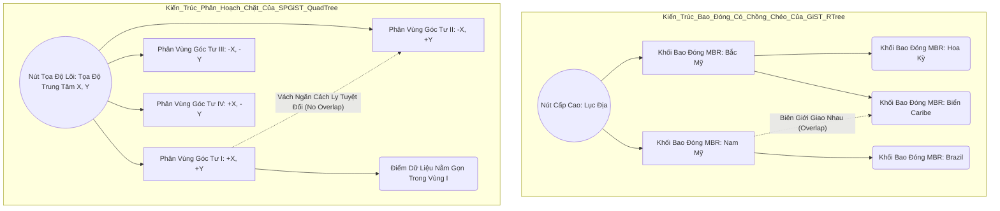

# 17: Vượt ra khỏi B-Tree: Khám phá GIN, GiST, và SP-GiST Indexes trong Postgres

Trong lĩnh vực quản trị cơ sở dữ liệu quan hệ và lý thuyết lưu trữ, mô hình cây B-Tree (cụ thể là B+-Tree) từ lâu đã thiết lập vị thế độc tôn như một tiêu chuẩn vàng cấu trúc cho các phép toán tìm kiếm dựa trên định lý so sánh tuyến tính thuần túy. Những nền tảng cốt lõi của cấu trúc này dựa trên việc duy trì tính thứ tự và sự cân bằng cây ngặt nghèo nhằm đảm bảo thời gian truy xuất luôn dao động ở giới hạn logarit phức tạp. Tuy nhiên, khi các hệ quản trị cơ sở dữ liệu hiện đại tiến hóa vượt xa khỏi nhu cầu lưu trữ những dạng dữ liệu vô hướng (scalar types) cơ bản để hướng tới các định dạng cấu trúc phức hợp vô cùng lớn—như mảng đa chiều ngẫu nhiên, tài liệu JSONB lồng ghép sâu, văn bản nguyên dạng phục vụ phân tích tìm kiếm toàn văn (full-text search) hay các dạng hình học định tuyến không gian đa vector—mô hình cấu trúc tuyến tính của B-Tree nhanh chóng bộc lộ những hạn chế vật lý cực hạn và bế tắc thuật toán không thể khỏa lấp. Hiện tượng bùng nổ không gian chiều (curse of dimensionality) và sự cần thiết phải phân tách cấu trúc đa trị (multi-valued decomposition) đòi hỏi sự can thiệp của các mô hình lý thuyết thông tin và khoa học máy tính sâu sắc hơn. Đó là tiền đề cho sự xuất hiện của các cấu trúc chỉ mục phi truyền thống tinh vi trong hệ sinh thái lõi của PostgreSQL, bao gồm Generalized Inverted Index (GIN), Generalized Search Tree (GiST) và Space-Partitioned Generalized Search Tree (SP-GiST). Việc đi sâu phân tích và thiết kế hệ thống vận hành xung quanh những bộ chỉ mục này không chỉ đơn thuần là việc áp dụng một góc nhìn toán học rời rạc vào trong thực tiễn lập trình, mà còn bắt buộc một sự mổ xẻ toàn diện về cơ chế tương tác ở tầng hệ điều hành, quản trị bộ đệm đĩa (page cache buffers), kiến trúc phân cấp bộ nhớ đệm đa tầng (L1/L2/L3 cache hierarchy) của bộ vi xử lý và thậm chí là những tính toán xung đột trên các bus dữ liệu phần cứng. Bài viết nghiên cứu kỹ thuật chuyên sâu này sẽ khai phẫu một cách cặn kẽ nhất vào các đặc tính vi kiến trúc (micro-architecture), đi liền với những mô phỏng toán học ngặt nghèo và định lượng thuật toán phức tạp của ba cơ chế lập chỉ mục nâng cao nói trên, từ đó định hình một tầm nhìn vĩ mô về cách hệ quản trị cơ sở dữ liệu giao tiếp với những rào cản vật lý của kỹ thuật máy tính.

## Kiến Trúc Phân Giải Nghịch Đảo (GIN) Tích Hợp Cơ Chế Phân Bổ Ký Ức Động Và Đảo Ngược Chỉ Mục

Cấu trúc Generalized Inverted Index (GIN) được thiết kế đặc hữu nhằm mục tiêu giải quyết những trường hợp lưu trữ đa giá trị trên cùng một bản ghi, trong đó các truy vấn thực thi cần phải đối mặt với các bài toán xác minh sự tồn tại tập hợp, kiểm tra mức độ bao hàm hoặc giải quyết các hàm giao hội của một lượng lớn các phân tử không liên tục. Từ lăng kính của lý thuyết đồ thị mở rộng và lý thuyết tập hợp, GIN không phải là một cây đơn lẻ mà bản chất là một cấu trúc dữ liệu đồ thị phức tạp dưới hình thái một rừng các cây B-Tree kết nối đa phân mảnh. Khối kiến trúc này bao gồm một cây từ điển trung tâm (được định danh là entry tree) chịu trách nhiệm lưu trữ các phần tử duy nhất (unique elements) được trích xuất từ các giá trị phức hợp. Từ mỗi nút lá của cây B-Tree nhập liệu này, cấu trúc bộ nhớ vươn ra các con trỏ dẫn đến những cấu trúc dữ liệu lưu trữ trực tiếp các định danh bản ghi vật lý (Tuple ID hay TID) mang các giá trị đó, được giới hàn lâm gọi là danh sách đăng (posting list) nếu kích thước dữ liệu vừa vặn trong ngưỡng vật lý cố định, hoặc sẽ tự động tiến hóa thành cây đăng phân nhánh (posting tree) nếu vượt quá ngưỡng dung lượng giới hạn của trang OS. Phương trình ánh xạ logic của GIN có thể được diễn đạt toán học qua một hàm thặng dư $f(V) \rightarrow \mathcal{P}(TID)$, trong đó tập hợp $V$ biểu thị cho kho từ vựng toàn cục bao hàm toàn bộ các phần tử cấu thành đơn nhất, và tập lũy thừa $\mathcal{P}(TID)$ biểu diễn hệ thống lưu trữ định vị bản ghi vật lý của cơ sở dữ liệu. Bằng việc định nghĩa tập hợp các chỉ mục nghịch đảo, với một khóa bất kỳ mang giá trị $key$, ta có thể trích xuất hàm phân bổ: $P(key) = \bigcup_{i=1}^n \{TID_i | \text{key} \in Tuple_i\}$. Vấn đề thảm họa kỹ thuật xuất hiện khi một bản ghi văn bản cực lớn bao gồm hàng vạn ký tự độc lập được đưa vào hệ thống, quá trình thao tác phân tích dữ liệu (parsing) và trích xuất (extractValue) bẻ nhỏ dữ liệu này thành hàng vạn từ vựng. Nếu hệ thống buộc phải đẩy trực tiếp dữ liệu này xuống đĩa cứng, nó sẽ kích hoạt hàng vạn lệnh ghi ngẫu nhiên (random writes) phân tán ở khắp mọi nơi trên vùng lưu trữ vật lý, băm nát cấu trúc liên tục của hệ thống tệp và gây ra hiện tượng khuếch đại ghi (Write Amplification) thảm khốc lên tới hàng chục lần trên các thiết bị Solid State Drive (SSD), hủy hoại trực tiếp giới hạn chu kỳ ghi/xóa (P/E cycles) của chip nhớ NAND Flash.

Nhận thức được hiện tượng suy thoái dữ dội này, kiến trúc nội vi của GIN tích hợp một mô hình trì hoãn I/O cực kỳ tinh xảo có tên gọi là danh sách chờ (Pending List), được khởi tạo và cấu hình thông qua thông số vi mô `gin_pending_list_limit`. Khi hàng loạt khối dữ liệu mới được thao tác chèn (insert/update), thuật toán của bộ quản trị PostgreSQL tạm thời từ chối hành vi tích hợp tức thời vào Entry Tree. Thay vào đó, dữ liệu thô bao gồm cặp (Khóa, TID) được nối chuỗi tuần tự vào một danh sách các trang nhớ không định cấu trúc nằm chồng chất ở tầng trên cùng của file vật lý. Phương trình bất đẳng thức điều phối tính năng xả bộ nhớ đệm (buffer flush) được biểu thị dưới dạng $\sum_{i=1}^{M} \big( \text{sizeof}(ItemType_i) + \text{sizeof}(TID_i) \big) + \Omega(Metadata) > \text{Limit}$, với $M$ là số lượng các phần tử tích lũy tạm thời. Tại điểm gián đoạn của bất đẳng thức này, hệ thống sẽ kích hoạt một tiến trình quét rác hoặc một tín hiệu ngầm báo động từ các tác vụ Autovacuum nhằm kích hoạt thuật toán hợp nhất hàng loạt (bulk insert merge algorithm). Khâu hợp nhất này được thực hiện trong không gian RAM tốc độ cao: bộ cấp phát bộ nhớ sẽ tải toàn vẹn danh sách chờ vào không gian địa chỉ ảo, áp dụng thuật toán sắp xếp tại chỗ (in-place sort) với độ phức tạp $\mathcal{O}(M \log M)$ qua một cây tìm kiếm nhị phân hoặc Red-Black tree tạm thời, nhóm gom tất cả các định danh TID thuộc về cùng một khóa từ vựng vào một cụm. Chỉ sau khi dữ liệu đã được tinh giản cấu trúc một cách gọn gàng, hệ thống mới quét một đường duy nhất từ trên xuống dưới qua B-Tree trung tâm, xả tải toàn bộ cụm dữ liệu TID khổng lồ vào Posting Tree dưới hình thức nhập tuần tự, biến hàng vạn thao tác I/O ngẫu nhiên (random I/O) trở thành một vài khối ghi tuần tự cực lớn (sequential writes). Độ phức tạp thời gian tiệm cận của quá trình tìm kiếm (search time complexity) trên một truy vấn đa từ khóa $Q = \{q_1, q_2, \dots, q_k\}$ được mô tả qua định mức $\mathcal{O}\left( \sum_{j=1}^k \log(|V|) + f_{intersect}(|T_{q_1}|, \dots, |T_{q_k}|) \right)$, trong đó hàm $f_{intersect}$ phụ thuộc chặt chẽ vào kích thước vật lý của các posting list và thường được đẩy nhanh thông qua kỹ thuật giải nén từng phần (partial decompression). Sự dịch chuyển dữ liệu qua lại giữa danh sách mảng tuyến tính và cấu trúc phân nhánh Posting Tree sinh ra một thách thức rất lớn về dự đoán rẽ nhánh (branch prediction) bên trong 파ipeline xử lý của CPU. Khi Posting Tree phát triển quá kích thước giới hạn của L2/L3 CPU Cache, hiện tượng Translation Lookaside Buffer (TLB) miss bắt đầu tăng đột biến vì mỗi phép nhảy con trỏ giữa các nút của cây B-Tree đòi hỏi việc dịch ngược một địa chỉ ảo mới, buộc phần cứng phải tạm ngưng hoạt động (pipeline stall) hàng trăm xung nhịp đồng hồ chỉ để thực hiện quy trình Page Table Walk trong bộ nhớ chính. Hệ thống được kiến trúc để cân bằng các xung đột này, như được minh họa qua sơ đồ kiến trúc động học dưới đây.

```mermaid
graph TD
    subgraph Kiến_Trúc_Vi_Mô_Của_Hệ_Thống_Chỉ_Mục_GIN
        A[Luồng Xử Lý Truy Vấn SQL - Parser] -->|Trích Xuất Lexemes| B{Mô Hình Định Tuyến Khóa Cấp Thấp}
        B -->|Khởi Tạo Giao Dịch Ghi| C[Vùng Bộ Đệm Chờ - Pending List Buffer]
        B -->|Khởi Tạo Giao Dịch Đọc| D[Cây Chỉ Mục Từ Điển B-Tree Mức Hệ Thống]
        C -->|Đạt Ngưỡng Kích Hoạt FastUpdate Limit| E[Tiến Trình In-Memory Sort/Merge]
        E -->|Duyệt Tuần Tự Bộ Nhớ| D
        D --> F[Nút Nhánh Điều Phối Khóa (Branch Node)]
        F --> G[Nút Lá Entry Chứa Siêu Dữ Liệu]
        G -->|Payload Kích Thước Nhỏ <= 8KB| H[Danh Sách Các Tuple IDs Tuyến Tính - Posting List]
        G -->|Payload Kích Thước Lớn Kích Hoạt Split| I[Cây Đảo Ngược Phụ Trợ - Posting Tree]
        I --> J[Nút Gốc Posting Tree Tái Cân Bằng]
        J --> K[Các Nút Lá Chứa Dữ Liệu Trang BlockId/Offset Thực Sự]
    end
    style A fill:#e1f5fe,stroke:#01579b,stroke-width:2px
    style E fill:#fff9c4,stroke:#f57f17,stroke-width:2px
    style I fill:#fbe9e7,stroke:#bf360c,stroke-width:2px
```

Để mô tả cụ thể về cơ chế hoạt động hợp nhất và bảo vệ phần cứng, chúng ta có thể áp dụng một góc nhìn sát với lập trình hệ thống (system programming) thông qua đoạn mã giả lập ngôn ngữ C++ với cú pháp hàm ý quá trình xả dữ liệu từ Pending List. Các cấu trúc cấp phát được căn chỉnh (aligned memory allocation) để tối ưu hóa sự vận chuyển dữ liệu trên bus PCI-e.

```cpp
#include <vector>
#include <algorithm>
#include <mutex>
#include <immintrin.h> // Sử dụng tập lệnh AVX cho tối ưu hóa sau này

template <typename LexemeType, typename TupleID>
class GinPendingListManager {
private:
    struct alignas(64) PendingTuple { // Căn chỉnh bộ nhớ trùng khớp với Cache Line 64-bytes của CPU x86_64
        LexemeType lexeme;
        TupleID tid;
        
        bool operator<(const PendingTuple& other) const {
            if (lexeme != other.lexeme) return lexeme < other.lexeme;
            return tid < other.tid;
        }
    };
    
    std::vector<PendingTuple> pendingBuffer;
    size_t accumulatedMemorySize = 0;
    const size_t WORK_MEM_THRESHOLD = 4194304; // Ngưỡng 4MB tiêu chuẩn cấu hình hệ điều hành
    std::mutex bufferLock; // Khóa quay vi mô (Spinlock) chống phân mảnh bộ nhớ đa luồng
    
public:
    void enqueueFastUpdate(const LexemeType& key, TupleID identifier) {
        std::lock_guard<std::mutex> guard(bufferLock);
        pendingBuffer.push_back({key, identifier});
        accumulatedMemorySize += sizeof(PendingTuple);
        
        if (accumulatedMemorySize >= WORK_MEM_THRESHOLD) {
            executeVacuumMergeRoutine();
        }
    }
    
private:
    void executeVacuumMergeRoutine() {
        // Tối ưu hóa việc sắp xếp trong bộ nhớ nội bộ nhằm triệt tiêu I/O ngẫu nhiên xuống ổ cứng
        std::sort(pendingBuffer.begin(), pendingBuffer.end());
        
        auto iterator = pendingBuffer.begin();
        while (iterator != pendingBuffer.end()) {
            LexemeType currentKey = iterator->lexeme;
            std::vector<TupleID> batchTIDs;
            
            // Gom nhóm tất cả định danh TID thuộc về một khóa từ vựng duy nhất
            while (iterator != pendingBuffer.end() && iterator->lexeme == currentKey) {
                batchTIDs.push_back(iterator->tid);
                ++iterator;
            }
            
            // Xả dữ liệu theo cụm lớn (Bulk Insert Pipeline) xuống B-Tree trung tâm
            // Phương thức này hoạt động đồng bộ hóa với hệ thống quản lý OS Page Cache
            flushToMainPostingTree(currentKey, batchTIDs);
        }
        
        pendingBuffer.clear();
        accumulatedMemorySize = 0;
    }

    void flushToMainPostingTree(const LexemeType& key, const std::vector<TupleID>& tids) {
        // ... (Gọi hàm giao tiếp cấp thấp với cấu trúc quản lý đệm Shared_Buffers của PostgreSQL) ...
    }
};
```

## Cây Tìm Kiếm Tổng Quát (GiST) Và Cây Phân Hoạch Không Gian (SP-GiST): Nền Tảng Lý Thuyết Và Cơ Chế Phân Định Hình Học

Nếu GIN là đáp án tuyệt mỹ cho bài toán phần tử mảng và từ vựng lặp lại, thì Generalized Search Tree (GiST) lại là một cuộc cách mạng mang tính trừu tượng hóa kiến trúc đỉnh cao trong lịch sử thiết kế bộ máy cơ sở dữ liệu. GiST hoàn toàn gạt bỏ giả định rằng dữ liệu có thể được phân loại thông qua các phép toán so sánh đẳng thức (nhỏ hơn, lớn hơn, bằng nhau) vốn là nền tảng của mọi B-Tree. Thay vào đó, GiST cung cấp một giao diện trừu tượng, một bộ khung (framework) tổng quát cho phép người dùng khai báo trực tiếp các hành vi phân chia vị từ (predicate splitting) và quan hệ không gian thông qua các phương thức do chính lập trình viên định nghĩa: Consistent, Union, Compress, Decompress, Penalty, PickSplit, và Same. Thuật toán phân nhánh trung tâm của GiST phụ thuộc vào khái niệm cấu trúc bao đóng (Bounding Envelope), điển hình như Minimum Bounding Rectangle (MBR) trong cấu hình địa lý. Mỗi nút cha trong mạng lưới cây GiST luôn ôm trọn hoàn toàn không gian khái niệm của mọi nút con. Từ một hệ quy chiếu lý thuyết mô hình hình học, giả sử nút vật lý $N$ có chứa các con trỏ trỏ tới các nút con $C_1, C_2, \dots, C_k$, ta có thể thiết lập phương trình ràng buộc bất biến như sau: $\text{Predicate}(N) \supseteq \bigcup_{i=1}^k \text{Predicate}(C_i)$. Khả năng trừu tượng vô song này là hạt nhân động lực đứng đằng sau hệ mở rộng nổi tiếng PostGIS dùng để lập chỉ mục các tọa độ vệ tinh, quỹ đạo giao thông, và phạm vi hình ảnh kỹ thuật số nhiều chiều. Khi một bản ghi (tuple) mới đi vào hệ thống và bắt buộc phải chọn một đường dẫn tối ưu từ gốc để chèn xuống lá, GiST sử dụng hàm Penalty để định lượng hàm tổn thất không gian. Hàm Penalty sẽ liên tục quét qua không gian của các nút hiện hành nhằm chọn ra một nhánh mà tại đó lượng không gian bị ép buộc phải mở rộng thêm là tối thiểu nhất có thể. Tổn thất tích phân đa chiều $\Delta P$ giữa một bao đóng hiện tại $E_{node}$ và một đối tượng địa lý mới $E_{new}$ được đo lường dưới nguyên lý: $\text{Penalty}(E_{node}, E_{new}) = \text{Area}(E_{node} \cup E_{new}) - \text{Area}(E_{node})$. Khi không gian chứa của một trang nhớ 8KB đạt đến giới hạn vật lý (page overflow), GiST sử dụng thuật toán PickSplit—một dạng biến thể xấp xỉ thuật toán Heuristic giải quyết bài toán khó NP-Hard—nhằm bẻ gãy trang dữ liệu làm hai phần sao cho vùng diện tích giao thoa (overlap space) giữa hai nút mới tạo ra tiệm cận tới mức số 0. Sự chồng chéo càng lớn thì khả năng các thao tác tìm kiếm phải duyệt qua cả hai nhánh cây càng cao, kéo theo sự bùng nổ hàm số mũ của các hoạt động truy vấn ổ đĩa vật lý (disk fetches).

Trái ngược với cơ chế chấp nhận diện tích chồng chéo của GiST, Space-Partitioned Generalized Search Tree (SP-GiST) tận dụng các thuật toán chia để trị (divide and conquer) một cách phân hoạch tuyệt đối, thông qua các mô hình cấu trúc cây không lặp lại (non-overlapping recursive partitioning) như k-d tree, quad-tree, radix tree, hay suffix tree. Liên kết hình thái học của SP-GiST chém đứt không gian thành vô số những phân vùng hình học hay logic độc lập, tính loại trừ lẫn nhau được đảm bảo bằng mọi giá. Mô hình cấu trúc này được sinh ra nhằm triệt tiêu hiện tượng bất đối xứng dữ dội trong phân bố xác suất của những bộ dữ liệu thưa thớt (high sparsity dataset) hoặc lệch trục (skewed data). Bởi vì không gian vật lý được cắt gọt vĩnh viễn và không bao giờ chồng lấn, việc duyệt cây trong SP-GiST để tra cứu một điểm dữ liệu là quá trình tuyến tính khép kín và mang tính quyết định (deterministic), không đòi hỏi hiện tượng quay lui (backtracking) phức tạp vốn tốn vô vàn chu kỳ của bộ vi xử lý khi sử dụng GiST R-Tree. Biểu thức thời gian truy xuất đối với thuật toán định vị không gian tiến sát tới ranh giới tiệm cận tối ưu nhất của toán học ứng dụng: $\mathcal{O}(\log_k N)$ cho chi phí truy cập ngẫu nhiên dữ liệu, nơi mà $k$ chính là bậc chia nhỏ của không gian (như $k=4$ đối với quad-tree) hoặc là kích thước bảng chữ cái hệ cơ số (radix alphabet). Nhờ việc cô lập triệt để không gian nhánh, CPU không cần phải tải thừa thãi các trang dữ liệu sai lệch xuống bộ đệm L1/L2 từ hệ thống RAM băng thông trễ, qua đó triệt tiêu đáng kể sự lãng phí tính toán năng lượng liên quan đến các vi lệnh số thực dấu phẩy động (Floating-Point Arithmetic) thường được kích hoạt trong các thanh ghi AVX-512 khi thực thi các hàm hình học phức tạp. Hệ thống cấu trúc trừu tượng của GiST và mô hình phân hoạch cứng rắng của SP-GiST được minh họa dưới dạng biểu đồ cấu trúc mạng tĩnh bên dưới để phân định rạch ròi biên giới thiết kế.



Mỗi thao tác quét dữ liệu dọc theo chiều sâu của GiST hoặc SP-GiST bắt buộc lõi vi xử lý phải liên tục thực thi việc dịch địa chỉ logic sang địa chỉ trang vật lý (logical to physical block translation). Việc phân rã cây nội bộ không có cấu trúc tuần tự khiến cho các nút nhánh có xu hướng nằm ngẫu nhiên rải rác trên khay phiến đĩa (platter fragmentation) hoặc các khối ô nhớ flash. Sự phân bổ rời rạc điên cuồng này gây ra vô số các lỗi thiếu trang trầm trọng (major page faults) khi bộ nhớ thực (RAM) thiếu dung lượng để đệm dữ liệu. Thuật toán dự đoán đọc trước (Read-Ahead Heuristics) nằm sâu trong nhân hệ điều hành Linux (Virtual File System VFS layer) vốn được thiết kế để đoán trước dòng dữ liệu tuần tự, giờ đây bị hoàn toàn vô hiệu hóa bởi hành vi nhảy ngẫu nhiên của các con trỏ cây chỉ mục. Sự giới hạn dải thông ngặt nghèo của chuẩn giao tiếp PCIe nối đến bộ kiểm soát I/O (NVMe Controllers) tạo nên tình trạng thắt nút cổ chai (bottleneck) khốc liệt. Các nhà thiết kế cơ sở dữ liệu đã phải sử dụng các thuật toán thiết kế cấp thấp cấu trúc đệm như mảng dữ liệu (Structure of Arrays) nội bộ để ép dữ liệu IndexTupleData tuân thủ các ranh giới bộ nhớ, sử dụng kỹ thuật khóa vi mô (lightweight spinlocks / lwlocks) của hệ điều hành để tránh sự tranh chấp dữ dội của các tiến trình CPU đang cố gắng đọc và sửa đổi cùng một nút nhánh không gian.

## Tương Tác Cấp Thấp Với Quản Trị Hệ Thống Và Sự Thách Thức Của Rào Cản Vi Kiến Trúc CPU

Để thấu hiểu tại sao các mô hình thuật toán phức tạp như GIN, GiST, hay SP-GiST lại có thể hoạt động hiệu quả trong thế giới thực thay vì sụp đổ dưới sức nặng của hàng terabyte dữ liệu, chúng ta buộc phải xem xét cách thức chúng đan xen khăng khít với sự quản lý của hệ điều hành và vượt qua các bức tường phần cứng. Cơ sở dữ liệu PostgreSQL duy trì một không gian khổng lồ trong RAM gọi là `shared_buffers`, một hệ thống bộ đệm hoạt động như tuyến phòng thủ đầu tiên, đánh chặn các lệnh truy xuất từ hệ quản lý bộ đệm trang đĩa (Page Cache) của hạt nhân hệ điều hành. Cơ chế thay thế trang đệm của Postgres sử dụng biến thể vô cùng tối ưu của thuật toán Clock Sweep, hay còn gọi là LRU (Least Recently Used) thế hệ hai. Vấn đề rắc rối nhất ở mức độ vi mô xuất hiện khi hàng trăm tiến trình truy vấn (concurrent backends) cùng lúc cố gắng thực thi việc tra cứu và chèn dữ liệu vào một thân cây GiST hay phân khu mảng SP-GiST duy nhất. Tại thời điểm một hệ thống chuẩn bị chẻ đôi (split) một khối bộ nhớ trang B-Tree 8KB do đầy ứ, quy trình này bắt buộc phải xin một tín hiệu chiếm hữu vùng đệm (buffer pin) và một ổ khóa cấp cao nhất mức độ độc quyền (exclusive buffer lock). Tác vụ cực đoan này tạo ra một cuộc giao tranh tàn khốc trên vi mạch CPU nhiều lõi đa đế (multi-socket NUMA system) được gọi là sự kiện Buffer Lock Contention. Dữ liệu trạng thái của chiếc khóa bộ nhớ này phải liên tục dịch chuyển vòng quanh các bộ đệm trung tâm (L3 Cache) của các thanh CPU ở những bo mạch khác nhau thông qua giao thức liên kết QPI/UPI, chịu sự kiểm soát của cơ chế gắn kết bộ đệm vi xử lý phân tán (Cache Coherence Protocol - tiêu biểu là mô hình MESI). Sự đánh ping-pong của các chuỗi dòng lệnh nhớ 64-byte này có thể triệt tiêu băng thông truy xuất nội vi của hệ thống tới hơn 40%, gây hiện tượng CPU treo đứng mà hệ điều hành hoàn toàn bó tay bất lực.

Sự sinh tồn của dữ liệu an toàn dựa trên giao thức viết nhật ký trước (Write-Ahead Logging - WAL). Sự toàn vẹn cấu trúc này đồng nghĩa với việc mọi vi chỉnh sửa lẻ tẻ nhất trên các siêu dữ liệu cấu trúc trang, từ sự thêm mới phần tử trong Posting Tree của GIN cho tới việc tính lại đường bao đóng hình học trong GiST, tất cả phải được định dạng nhị phân thành các dòng nhật ký thao tác và áp đặt cưỡng bức xuống hệ thống đĩa bằng những lệnh fsync khắt khe của OS. Dựa trên mô hình định mức cấu trúc vật lý, phương trình hạch toán chi phí đầu vào/đầu ra (I/O Cost Model) cho một thao tác hoán cải chỉ mục hạng nặng có thể được phác thảo dưới biểu thức tích phân phức hợp: $C_{total} = \left( N_{read} \cdot C_{rand\_read} \right) + \left( N_{write} \cdot C_{rand\_write} \right) + \left( S_{wal} \cdot C_{seq\_write} \right) + \Big( C_{cpu} \cdot T_{cpu} \Big)$. Trong đó, $C_{rand\_read}$ và $C_{rand\_write}$ phản ánh mức độ đắt đỏ của việc kéo dãn đầu đọc từ hệ cơ để đọc/ghi ngẫu nhiên một mảng đơn nguyên vật lý 8KB, $S_{wal}$ định dạng khối lượng byte nhật ký tuần tự bị ép trút ra ngoài, trong khi đó $C_{cpu}$ là mức tiêu thụ xung nhịp tàn sát vi xử lý khi phải liên tục giải nén chuỗi mảng TID của GIN bằng tập lệnh máy, hoặc khi tính toán sai số hình học giao cắt của SP-GiST sử dụng bộ đồng xử lý (Coprocessor). Trong bối cảnh vật lý hiện tại, chi phí chênh lệch giữa $C_{rand\_read}$ so với $C_{seq\_write}$ trên các máy từ tính HDD truyền thống và cả các thế hệ SSD NAND TLC/QLC nằm ở biên độ lớn gấp 100 đến 10.000 lần. Hệ số khuếch đại ghi khổng lồ (Write Amplification Factor - WAF, được đo lường bằng tỷ lệ $WAF = \frac{\text{Tổng Bytes ghi lên chip Flash}}{\text{Tổng Bytes nhận từ cổng máy chủ Host}}$) chứng minh vì sao kiến trúc danh sách chờ Pending List của GIN lại là vị cứu tinh sinh tử để kéo dài tuổi thọ cụm máy chủ, khi nó mạnh tay chuyển đổi hàng vạn bản sao ghi ngẫu nhiên hủy hoại (destructive random updates) biến thành một luồng dữ liệu trôi chảy chậm rãi và dồn dập trong một phiên tích cực trì hoãn.

Phần cứng tối tân đang va chạm khốc liệt với giới hạn rào cản Bức Tường Bộ Nhớ (Memory Wall), nơi tốc độ xung nhịp đơn lõi của vi xử lý ALU (Arithmetic Logic Unit) cải tiến cực nhanh nhưng độ trễ truy xuất tới từng thanh RAM (CAS Latency) qua hàng thập kỷ chỉ giảm không đáng kể. Chính vì lẽ đó, sự mã hóa cấu trúc cấp thấp của các nút cây như SP-GiST buộc các kỹ sư hệ thống phải áp dụng các chiến thuật nén con trỏ nhị phân (pointer compression techniques) và xoay chuyển bố cục bộ nhớ chuyển từ cách tiếp cận cấu trúc mảng đối tượng (Array of Structures - AoS) nguyên thủy của PostgreSQL truyền thống sang kỹ nghệ dữ liệu hướng mảng (Structure of Arrays - SoA). Việc nén ép này tối ưu hóa việc sử dụng các luồng lệnh máy vectơ SIMD (Single Instruction, Multiple Data) để quét dọc nhiều nút dữ liệu cùng một nhịp xung. Sự thu nhỏ cực đoan thông số siêu dữ liệu (metadata) trên mỗi nút không chỉ giúp gia tăng mật độ dữ liệu thực tế đóng gói vào trang nhớ 8KB, mà còn tạo cú huých đưa tỷ lệ đánh trúng bộ đệm (L2 cache hit ratio) tăng vọt. Sự gia tăng này đẩy lùi trực tiếp hàng nghìn chu kỳ chết đứng (pipeline stall cycles), minh chứng rõ ràng một chân lý học thuật: Việc xây dựng các cấu trúc chỉ mục tinh hoa trong một cỗ máy cơ sở dữ liệu khổng lồ không chỉ là việc vẽ ra những lý thuyết thuật toán toán học trên giấy, mà là sự thấu hiểu khắc nghiệt và bẻ cong những giới hạn phần cứng điện tử vật lý vi mô tàn khốc của một chiếc máy vi tính.

### Tối Ưu Hóa Tìm Kiếm (SEO)

- **Meta Title**: Phân Tích Vi Kiến Trúc Chuyên Sâu GIN, GiST Và SP-GiST Indexes Trong PostgreSQL
- **Meta Description**: Tài liệu nghiên cứu kỹ thuật học thuật toàn diện về cấu trúc đa chiều, thuật toán đảo ngược chỉ mục (Inverted Index), cơ chế phân hoạch không gian và giới hạn tương tác cấp thấp với hệ điều hành của các chỉ mục GIN, GiST, SP-GiST.
- **Focus Keywords**: PostgreSQL, GIN index, GiST index, SP-GiST, B-Tree, Inverted Index, R-Tree, PostGIS, Hệ thống quản trị bộ đệm, Vi kiến trúc CPU, Tối ưu hóa I/O, Database Internals.
- **Slug URL**: `17-gin-gist-spgist-postgres-micro-architecture`
- **Canonical URL**: `https://landingpage.example.com/blogs/part-3/17-gin-gist-spgist-postgres`
- **Target Audience**: Staff Engineers, Database Architects, Systems Programmers.
