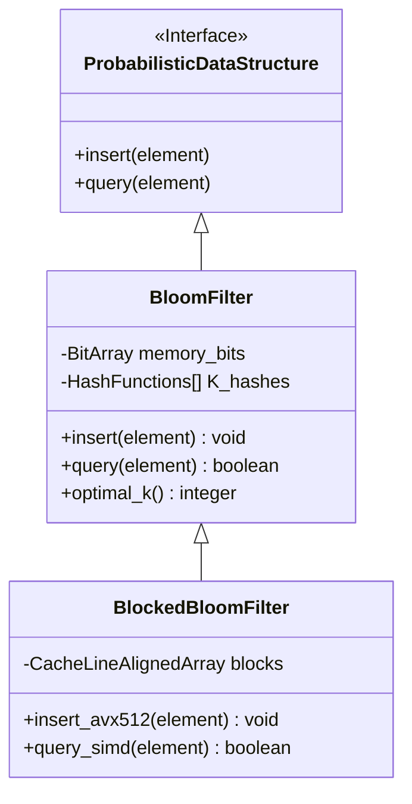

# Probabilistic Data Structures: Bloom Filters, HyperLogLog, and Count-Min Sketch

## Executive Summary
Once a system has to process millions of events per second, storing everything exactly stops being an option - not because it's impossible, but because the memory and bandwidth cost stops making sense. That's the gap **probabilistic data structures (PDS)** fill: they accept a small, mathematically bounded error rate in exchange for space that grows far slower than the data itself.

This piece walks through three of the field's workhorses - **Bloom Filters**, **HyperLogLog**, and **Count-Min Sketch**. Rather than stopping at the math, we'll look at how these structures actually behave against CPU caches, TLBs, SIMD instructions, and Linux memory paging, and what it takes to configure them well in a real production system.

## Core Problem Statement
Traditional deterministic structures start showing real strain once the sample space ($N$) reaches billions or trillions of elements.
- **Linear space complexity.** B-Trees, hash tables, red-black trees all need $O(N)$ memory. A billion IPv6 addresses alone need tens of gigabytes just for the raw values, before counting pointer overhead, node metadata, and fragmentation.
- **Cache thrashing.** Once the working set outgrows L3, cache-miss rates spike, and the processor ends up fetching from main memory constantly - hundreds of cycles per access, which wrecks throughput on a superscalar pipeline.
- **Multicore bandwidth limits.** When thousands of threads hit one shared hash table, locks become a bottleneck fast, and false sharing across cache lines makes it worse.
- **A basic information-theory point.** If all a system needs is a yes/no membership answer, or a rough cardinality/frequency estimate, storing the entire raw dataset to answer that is simply more than the question requires.

Probabilistic data structures exist to break that link between storage size and raw input volume, with asymptotic space complexity closer to $O(1)$ or $O(\log \log N)$ - which is what makes them a natural fit for distributed systems that need to scale without bound.

## Deep Technical Knowledge / Internals

### Bloom Filters: Answering "Does This Exist?"
A Bloom Filter is a bit array paired with $k$ independent hash functions, built to test set membership at scale. It only ever gives two kinds of answers: "definitely not in the set" or "probably in the set." False positives are allowed, at a controllable rate - but false negatives never happen.

**The math behind tuning it:**
The false-positive probability $\epsilon$ depends on the array size $m$, the number of hash functions $k$, and the expected number of inserted elements $n$:
$\epsilon \approx (1 - e^{-kn/m})^k$
Taking the derivative with respect to $k$ and setting it to zero gives the optimal number of hashes: $k = \frac{m}{n} \ln 2$. From there you can solve for the memory you need: $m = -\frac{n \ln \epsilon}{(\ln 2)^2}$.
Running $k$ separate hash computations (SHA-1, MurmurHash3) on every operation is expensive in practice, so most implementations use "double hashing" - deriving every hash beyond the first two by recombining them linearly:
$h_i(x) = (h_1(x) + i \cdot h_2(x)) \pmod m$

**Where hardware gets involved: the Blocked Bloom Filter.**
The classic Bloom Filter's biggest weakness is that it destroys spatial locality. A query with $k=7$ scatters across a gigabyte-sized bit array, generating 7 independent L3 cache misses per lookup - a real problem for HFT or core telecom workloads. The fix is the **Blocked Bloom Filter**: split the array into blocks, each sized to fit exactly one x86 cache line (64 bytes, 512 bits). The first hash picks a block, and only the remaining $k-1$ hashes flip bits within that single cache line.
This slightly raises the false-positive rate (the classic "balls into bins" effect), but retrieval speed jumps by 10-20x, because each lookup now costs at most one cache miss instead of several. AVX-512 lets the CPU compare all 512 bits of a block in a single cycle.



### HyperLogLog (HLL): Estimating How Many Unique Things There Are
Counting unique visitors across 100 billion web requests, with only a few kilobytes of RAM to spare, sounds like it shouldn't be possible with a traditional hash-set approach. HyperLogLog gets it done anyway.

**Flajolet-Martin, and correcting for variance:**
The core observation: for a uniformly random hash function, the probability that a hash value starts with exactly $k$ leading zero bits decays as $2^{-(k+1)}$. So tracking the longest run of leading zeros seen ($\rho_{max}$) gives a rough estimate of set size, around $2^{\rho_{max}}$.
A single observation is noisy, so HLL splits the stream across $m = 2^b$ independent registers and combines them with a harmonic mean - which naturally discounts outliers - multiplied by a correction constant $\alpha_m$:
$E = \alpha_m m^2 \left( \sum_{j=1}^m 2^{-M[j]} \right)^{-1}$
Each register only needs 6 bits to track up to $2^{64}$ distinct elements. With $m=16384$ registers, the whole structure fits in about 12KB of RAM, with a standard error around $\frac{1.04}{\sqrt{m}} \approx 0.81\%$.

**Tuning at the OS level:**
In highly distributed setups where millions of HLL instances get created and merged constantly, the OS's virtual paging comes under real pressure. The TLB will thrash if everything sits on standard 4KB pages. Enabling Transparent Huge Pages (2MB or 1GB) lets HLL register arrays sit in contiguous physical memory, cutting TLB misses dramatically and avoiding expensive page table walks.

### Count-Min Sketch (CMS): Estimating Frequencies in Noisy Streams
Count-Min Sketch answers a different question - not "does this exist," but "roughly how often has this occurred" - across streams with enormous cardinality and noise.

**The matrix, and why its dimensions come from Markov's inequality:**
CMS is a $d \times w$ matrix of counters. Both dimensions come directly from Markov's inequality: the width $w = \lceil e / \epsilon \rceil$ bounds the size of the overestimation error, and the depth $d = \lceil \ln(1 / \delta) \rceil$ bounds the probability that the error exceeds that bound. Estimating a count means running $d$ hash functions - one per row - and taking the minimum across them. The estimate is always biased upward, but the bound on that bias is precise.

**Conservative Update, and doing this without locks:**
Zipfian-distributed traffic - where a tiny number of keys account for most of the volume - makes naive counting overestimate badly. Conservative Update handles this: instead of incrementing every counter blindly, CMS first computes the minimum across the relevant cells, then only bumps cells that are still below that minimum. This keeps the overestimation bias in check.
On the concurrency side, putting a coarse mutex around a hot shared matrix would destroy throughput at scale. Real implementations lean on atomics, CAS loops, or thread-local replicas merged later via a map-reduce style background pass.

```rust
// Sample source code illustrating an enterprise-grade Count-Min Sketch (Rust)
// Using Conservative Update and memory ordering optimized for cache locality (linearized 2D array)
use std::sync::atomic::{AtomicU64, Ordering};

pub struct CountMinSketch {
    counters: Vec<AtomicU64>,
    d_rows: usize,
    w_cols: usize,
}

impl CountMinSketch {
    pub fn new(epsilon: f64, delta: f64) -> Self {
        let w_cols = (std::f64::consts::E / epsilon).ceil() as usize;
        let d_rows = (1.0 / delta).ln().ceil() as usize;
        let size = w_cols * d_rows;
        
        // Pre-allocate contiguous space in the buffer
        let mut counters = Vec::with_capacity(size);
        for _ in 0..size {
            counters.push(AtomicU64::new(0));
        }
        
        CountMinSketch { counters, d_rows, w_cols }
    }

    pub fn insert_conservative(&self, hash_key: u64, count: u64) {
        let mut min_val = u64::MAX;
        let mut positions = Vec::with_capacity(self.d_rows);
        
        // Phase 1: Query to extract the Min value using Relaxed memory ordering (no thread barrier)
        for i in 0..self.d_rows {
            let col = self.hash_family(hash_key, i) % self.w_cols;
            let idx = i * self.w_cols + col; // Flatten the matrix to improve cache locality
            positions.push(idx);
            
            let current_val = self.counters[idx].load(Ordering::Relaxed);
            if current_val < min_val {
                min_val = current_val;
            }
        }
        
        // Phase 2: Conservative Update executed via a Compare-And-Swap (CAS) atomic instruction chain
        let target_val = min_val.saturating_add(count);
        for &idx in &positions {
            let mut current = self.counters[idx].load(Ordering::Relaxed);
            while current < target_val {
                match self.counters[idx].compare_exchange_weak(
                    current, target_val,
                    Ordering::Release, Ordering::Relaxed // Standard Release-Acquire memory semantics
                ) {
                    Ok(_) => break, // Atomic update succeeded
                    Err(actual) => current = actual, // Data was overwritten by another thread, reload and retry
                }
            }
        }
    }
    
    #[inline(always)] // Force inlining to boost ALU instruction-level throughput
    fn hash_family(&self, base_hash: u64, seed_index: usize) -> usize {
        // Reuse ALU bandwidth via Linear Double Hashing, avoiding repeated SHA/Murmur calls
        (base_hash.wrapping_add((seed_index as u64).wrapping_mul(0x9E3779B97F4A7C15))) as usize
    }
}
```

```mermaid
graph TD
    A[Data Stream / Network Packets] --> B[MurmurHash3 64-bit Core Engine]
    B --> C(Row 1: Simulated Hash 1)
    B --> D(Row 2: Simulated Hash 2)
    B --> E(Row d: Simulated Hash d)
    C --> F[Counter Array 1]
    D --> G[Counter Array 2]
    E --> H[Counter Array d]
    F -. Read .-> I{Conservative Min() Filter}
    G -. Read .-> I
    H -. Read .-> I
    I --> J[Estimated Frequency]
    J -- CAS Update --> F
    J -- CAS Update --> G
    J -- CAS Update --> H
```

## Practical Applications & Case Studies

### Preventing CDN Cache Pollution (Cloudflare, Akamai)
"One-hit wonders" - static assets requested exactly once in their entire lifetime - pollute cache space and push out genuinely hot content. Cloudflare places a Bloom Filter in front of its cache tier: a resource only gets copied into the expensive SSD cache once the filter reports it's been seen before (i.e., this is at least the second request). That one design choice cuts cache write traffic by around 60% and extends the life of the NVMe cache fleet.

### Speeding Up Disk Reads in LSM-Tree Engines (Cassandra, RocksDB, LevelDB)
LSM-Tree databases persist data across many SSTable files. Without help, a point lookup would have to check every file for a key that might not even exist. Attaching a small in-memory Bloom Filter to each SSTable lets the engine skip the ~99.9% of files that definitely don't contain the key, turning what would be an $O(N)$ file scan into something close to $O(1)$.

### Real-Time Analytics at Scale (Redis, Presto, BigQuery)
Redis exposes HyperLogLog natively through `PFADD` and `PFCOUNT`. Ad-tech platforms use it to track unique views across trillions of impressions with sub-millisecond latency. Compared to `COUNT(DISTINCT user_id)`, which needs a full sort-and-dedupe pass that can blow past available memory, BigQuery's HLL sketching gets over 99% accuracy at a fraction of the compute cost - often cents instead of a bill running into the thousands.

### DDoS Detection on Core Routers (Cisco, Juniper)
Core routers need to spot heavy-hitter traffic - IP ranges sending far more packets than normal, an early sign of a DDoS attack - at terabit-per-second line rates. RAM simply isn't fast enough to keep up at that speed. Count-Min Sketch gets implemented directly in ASIC/FPGA logic, tracking billions of IPs using a few megabytes of on-chip SRAM, with no dynamic memory allocation involved at all.

## Lessons Learned
1. **Exact answers aren't always worth the cost.** Once your data stream is effectively unbounded, insisting on perfectly accurate counts is often a losing trade. A small, well-understood error rate can unlock scale that brute-force accuracy never will.
2. **Cache locality matters as much as the algorithm.** An $O(1)$-space PDS that hashes randomly across all of RAM will still get crushed by cache misses. The Blocked Bloom Filter is a good example of how much performance is sitting in cache-line-aware design, often more than any further improvement to the underlying Big-O.
3. **Avoid shared mutexes on hot paths.** In a highly parallel system, a shared counter behind a single mutex is a bandwidth bottleneck waiting to happen. Atomics, CAS loops, thread-local replicas, and map-reduce style merges are what actually scale.
4. **Tuning spans hardware and OS, not just algorithms.** Getting the most out of these structures means also tuning things like Transparent Huge Pages, NUMA pinning, and cache alignment. A systems architect working with probabilistic data structures needs to be comfortable with both the math and the memory subsystem underneath it.

This combination - Bloom Filters, HyperLogLog, and Count-Min Sketch - shows up constantly in core banking systems, cloud edge networking, and high-frequency trading infrastructure, wherever exact answers cost more than the problem is worth.
