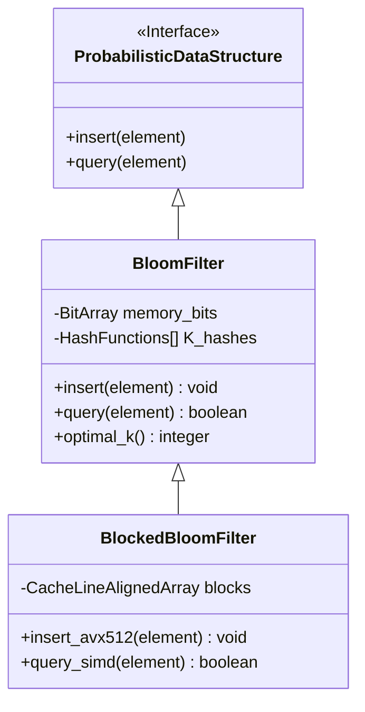

# 確率的データ構造:ブルームフィルタ(Bloom Filters)、HyperLogLog、Count-Min Sketch

## エグゼクティブサマリー(概要)

秒間数百万件のイベントを捌く必要が出てきたとき、多くのチームが最初にぶつかる壁はCPUでもネットワークでもなく、単純にメモリが足りないという現実だ。データ量と流入速度が桁違いに増えると、物理メモリ・処理スループット・ネットワークレイテンシのすべてに無理がかかる。確率的データ構造(Probabilistic Data Structures — PDS)は、この問題に対して一風変わった答えを出す。ごくわずかな誤差率を数学的に制御しながら受け入れる代わりに、ストレージ消費を指数関数的・対数的なオーダーまで削り落とすというアプローチだ。

このドキュメントでは、現代のシステム設計を支える三つの確率的データ構造——**ブルームフィルタ(Bloom Filters)**、**HyperLogLog**、**Count-Min Sketch**——を掘り下げる。数式の話だけでは実務の役に立たないので、これらの構造がCPUキャッシュ・TLB・SIMD命令、そしてLinuxカーネルのページング機構とどう噛み合うのか、また実際のシステムでどう設定すれば性能を引き出せるのかまで踏み込んで書いていく。

## 核心となる問題

標本空間($N$)が数十億から数兆件という規模に達すると、従来の決定論的データ構造(Deterministic Data Structures)は素直に破綻し始める。

- **線形空間計算量:** B-Tree、ハッシュテーブル、赤黒木といった古典的な構造は、$O(N)$でメモリを消費する。10億件のIPv6アドレス(128ビット)を単純に保存するだけでも生データで数十ギガバイトのRAMが必要になり、ポインタやノードメタデータ、フラグメンテーションのオーバーヘッドはまだ含まれていない。
- **キャッシュスラッシングと局所性の喪失:** 作業データがCPUのL3キャッシュ容量を超えると、キャッシュミス率は急上昇する。プロセッサはメインメモリから直接データを取りに行くしかなくなり、1回のアクセスに数百クロックサイクルを費やし、スーパースカラーパイプラインの恩恵をほぼ消し去ってしまう。
- **マルチコア環境での帯域幅の限界:** 数千スレッドが一つの巨大な共有ハッシュテーブルを同時に更新しようとすると、ロックやミューテックスが即座にボトルネックになる。運が悪ければ、独立したコア同士がキャッシュラインを奪い合う偽共有(False Sharing)まで発生する。
- **シャノンの情報理論が示す限界:** システムが本当に必要としているのが二値的な問い(その要素は存在するか)や、集合レベルの統計量(ユニーク数はいくつか、出現頻度はどうか)だけなら、生データをそのまま全部保持し続けるのは単なる資源の浪費でしかない。

確率的データ構造は、この問題への回答として設計された。$O(1)$あるいは$O(\log \log N)$という空間計算量で動くため、ストレージ容量が入力データ量に引きずられることがなく、事実上無制限にスケールする分散システムを組みやすくなる。

## 詳細な技術知識・内部構造

### ブルームフィルタ:存在の有無だけを答える機械

ブルームフィルタ(Bloom Filter)は、$k$個の独立したハッシュ関数と組み合わせた線形ビット配列であり、巨大な集合に対する要素の所属判定に特化している。クエリの答えは常に二択に絞られる。「確実に存在しない」か「存在する可能性がある」かのどちらかだ。つまりこのモデルは一定確率での偽陽性(False Positives)は許すが、偽陰性(False Negatives)は原理的に発生しないよう設計されている。

**数学的基礎と最適パラメータの導出:**

偽陽性が発生する確率$\epsilon$は、配列サイズ$m$、ハッシュ関数の数$k$、想定挿入要素数$n$に依存し、次の式でモデル化できる。

$\epsilon \approx (1 - e^{-kn/m})^k$

固定の空間制約のもとで$\epsilon$を最小化したいなら、$k$について一階微分を取りゼロと置けばよい。そこから最適値$k = \frac{m}{n} \ln 2$が得られ、必要なメモリ量も$m = -\frac{n \ln \epsilon}{(\ln 2)^2}$として逆算できる。
実務上は、$k$個のハッシュ(SHA-1やMurmurHash3など)を毎回律儀に計算するのはALUサイクルの無駄が大きい。そこで使われるのが「二重ハッシュ(Double Hashing)」で、3番目以降のハッシュ関数は元の2つのハッシュ値を組み合わせるだけで安く生成できる。

$h_i(x) = (h_1(x) + i \cdot h_2(x)) \pmod m$

**ハードウェアとの相性とBlocked Bloom Filter:**

従来型ブルームフィルタの弱点は、空間的局所性を台無しにすることだ。$k=7$のクエリはギガバイト規模のビット配列上にランダムに散らばり、7回の独立したL3キャッシュミスを引き起こす。HFT(高頻度取引)やコア通信システムではこれは致命的だ。そこで生まれたのが**Blocked Bloom Filter**(分割型フィルタ)である。
一枚岩の線形配列を独立したブロックに分割し、各ブロックをx86の物理キャッシュライン1本(通常64バイト=512ビット)にきっちり収める。最初のハッシュ関数がどのブロックを使うかだけを決め、残る$k-1$個のハッシュ関数はその512ビットの中でしかビットを立てない。
不均一な分布(ボール・イン・ビン現象)のせいで偽陽性率はわずかに上がるものの、キャッシュミスが最大1回のRAMアクセスで済むようになるため、検索速度は10~20倍向上する。さらにAVX-512を使えば、512ビットを1クロックサイクルで比較できる。



### HyperLogLog(HLL):集合の規模を数キロバイトで見積もる

1,000億件のWebリクエストからユニーク訪問者数を数えたいが、使えるRAMは数キロバイトしかない——こう聞くと従来のハッシュセット方式では不可能に思えるが、HyperLogLogはこれを実際にやってのける。

**Flajolet-Martinアルゴリズムと調和平均による補正:**

核となる発想はシンプルで、完全に一様なハッシュ列においては、あるハッシュコードがちょうど$k$個の先頭ゼロビットで始まる確率は$2^{-(k+1)}$として減衰していく、という性質を使う。観測された先頭ゼロビットの最大連続長($\rho_{max}$)を記録すれば、標本空間の規模を$2^{\rho_{max}}$前後と見積もれる。
ただし単一の観測値では外れ値による分散が大きすぎるので、HLLはデータストリームを$m = 2^b$個のレジスタに分解する。各レジスタの値を集約する際には、異常値の重みを抑える調和平均(Harmonic Mean)を使い、さらにマクローリン補正係数$\alpha_m$を掛ける。

$E = \alpha_m m^2 \left( \sum_{j=1}^m 2^{-M[j]} \right)^{-1}$

1つのレジスタはわずか6ビットで最大$2^{64}$個の要素を追跡できる。$m=16384$個のレジスタを使えば、システム全体でわずか12KBのRAMしか使わないのに、標準誤差は$\frac{1.04}{\sqrt{m}} \approx 0.81\%$程度に収まる。

**Linuxカーネルの設定とHuge Pages:**

分散環境で数百万個のHLL構造体を絶えず生成・マージしていると、OSの仮想ページング機構に相応の負荷がかかる。デフォルトの4KBページのままでは、TLB(Translation Lookaside Buffer)のミスが頻発しがちだ。*Transparent Huge Pages*(THP)を2MBや1GB単位で有効にしておくと、HLLレジスタ配列を連続した物理アドレス空間にまとめやすくなり、TLBミスをほぼ解消して、ページテーブルウォークに余計なサイクルを取られずに済む。

### Count-Min Sketch(CMS):ノイズの中から出現頻度を取り出す

Count-Min Sketch(CMS)は、単に「存在するか」だけでなく、ノイズの多い大規模なストリームの中で「どれくらいの頻度で出現するか」を知りたいときに使う道具だ。

**行列構造とマルコフの不等式:**

CMSは$d$行$w$列の整数セルからなる行列として実装される。この2つの定数はマルコフの不等式から導かれる。列数$w = \lceil e / \epsilon \rceil$は誤差の大きさを抑え、行数$d = \lceil \ln(1 / \delta) \rceil$は誤り確率($\delta$)を抑える役割を持つ。クエリ時には$d$個のハッシュ関数でそれぞれの行のセルを引き、その最小値(Min())を返す。この設計は常に過大評価(Overestimation)の方向にバイアスがかかるが、その大きさは数学的に押さえ込まれている。

**Conservative Updateとロックフリーな並行処理:**

Zipf分布のような偏ったデータ(一部のIDにトラフィックが集中する)を扱う場合、*Conservative Update*(保守的更新)というテクニックが欠かせない。まず対象となる全ての行の最小値を調べ、その最小値の閾値を下回るセルにだけ加算を適用する。これにより、外れ値によって過大評価が際限なく膨らむのを防げる。

マルチコア環境では、頻繁にアクセスされる共有行列に粗粒度のミューテックスを噛ませると帯域幅がすぐに頭打ちになる。CMSはアトミック操作や、スレッドローカルな配列レプリカ+Map-Reduce的なバックグラウンドマージによって、テラビット級のスループットを実現している。

```rust
// Count-Min Sketch(Rust)実装例
// Conservative Updateとキャッシュ局所性を意識した線形化2次元配列を使用
use std::sync::atomic::{AtomicU64, Ordering};

pub struct CountMinSketch {
    counters: Vec<AtomicU64>,
    d_rows: usize,
    w_cols: usize,
}

impl CountMinSketch {
    pub fn new(epsilon: f64, delta: f64) -> Self {
        let w_cols = (std::f64::consts::E / epsilon).ceil() as usize;
        let d_rows = (1.0 / delta).ln().ceil() as usize;
        let size = w_cols * d_rows;
        
        // バッファ上に連続した空間を事前確保する
        let mut counters = Vec::with_capacity(size);
        for _ in 0..size {
            counters.push(AtomicU64::new(0));
        }
        
        CountMinSketch { counters, d_rows, w_cols }
    }

    pub fn insert_conservative(&self, hash_key: u64, count: u64) {
        let mut min_val = u64::MAX;
        let mut positions = Vec::with_capacity(self.d_rows);
        
        // フェーズ1:Relaxedメモリ順序(スレッド間の障壁なし)でMin値を抽出するクエリ
        for i in 0..self.d_rows {
            let col = self.hash_family(hash_key, i) % self.w_cols;
            let idx = i * self.w_cols + col; // キャッシュ局所性を高めるため行列を平坦化する
            positions.push(idx);
            
            let current_val = self.counters[idx].load(Ordering::Relaxed);
            if current_val < min_val {
                min_val = current_val;
            }
        }
        
        // フェーズ2:Compare-And-Swap(CAS)アトミック命令の連鎖によって実行されるConservative Update
        let target_val = min_val.saturating_add(count);
        for &idx in &positions {
            let mut current = self.counters[idx].load(Ordering::Relaxed);
            while current < target_val {
                match self.counters[idx].compare_exchange_weak(
                    current, target_val,
                    Ordering::Release, Ordering::Relaxed // 標準的なRelease-Acquireメモリセマンティクス
                ) {
                    Ok(_) => break, // アトミック更新に成功
                    Err(actual) => current = actual, // 他のスレッドによってデータが上書きされたため、再読み込みして再試行
                }
            }
        }
    }
    
    #[inline(always)] // ALU命令レベルのスループットを高めるため強制インライン化
    fn hash_family(&self, base_hash: u64, seed_index: usize) -> usize {
        // 線形二重ハッシュによりALU帯域幅を再利用し、SHA/Murmurの繰り返し呼び出しを回避する
        (base_hash.wrapping_add((seed_index as u64).wrapping_mul(0x9E3779B97F4A7C15))) as usize
    }
}
```

```mermaid
graph TD
    A[Data Stream / Network Packets] --> B[MurmurHash3 64-bit Core Engine]
    B --> C(Row 1: Simulated Hash 1)
    B --> D(Row 2: Simulated Hash 2)
    B --> E(Row d: Simulated Hash d)
    C --> F[Counter Array 1]
    D --> G[Counter Array 2]
    E --> H[Counter Array d]
    F -. Read .-> I{Conservative Min() Filter}
    G -. Read .-> I
    H -. Read .-> I
    I --> J[Estimated Frequency]
    J -- CAS Update --> F
    J -- CAS Update --> G
    J -- CAS Update --> H
```

## 実践的応用とケーススタディ

### グローバルCDNのキャッシュ汚染対策(Cloudflare & Akamai)

「ワンヒットワンダー(one-hit wonders)」とは、数十億もの静的URLがライフサイクルを通じてちょうど一度だけアクセスされるという現象で、これがキャッシュ汚染(Cache Pollution)を引き起こし、本当に価値のある高トラフィック資産をRAMから追い出してしまう。Cloudflareは、CDNの入口にブルームフィルタを門番として置いている。ある静的リソースが高価なSSDキャッシュ層にコピーされるのは、ブルームフィルタが「ヒット」を返した場合——つまり少なくとも2回目のリクエストである場合——に限られる。この単純な仕組みだけで、書き込みトラフィックを60%削減し、NVMe SSDクラスタの寿命を延ばしている。

### ディスク書き込み層の最適化(Cassandra、RocksDB、LevelDB)

LSM-Tree型データベースは、SSTableファイルを通じてディスク上にデータを永続化する。キー検索のリクエストが来るたびに、素朴な実装では大量のファイルを総当たりで走査することになる。各SSTableファイルに小さなインメモリブルームフィルタを付けておけば、そのキーを含まないことが確実なファイルの99.9%を即座にスキップでき、ディスクI/Oのコストは線形の$O(N)$からほぼ$O(1)$にまで落ちる。

### リアルタイムビッグデータ分析(Redis、Presto、BigQuery)

Redisには`PFADD`と`PFCOUNT`というHyperLogLogのネイティブコマンドが用意されている。AdTech企業はこれを使い、数兆件のインプレッションからマイクロ秒単位でユニークビュー数を集計している。従来の`COUNT(DISTINCT user_id)`——RAMを圧迫するソートと重複排除が必要になる——と比べると、Google BigQueryのHLLスケッチングは99%を超える精度を維持しながら、計算コストを数千ドル規模から数セント程度まで圧縮する。

### DDoS耐性を持つコアネットワークルーター(Cisco、Juniper)

コアルーターは、Tbps(テラビット毎秒)というライン速度でHeavy Hitterトラフィック(閾値を超える量のパケットを送るIP群で、DDoSの初期兆候になりやすい)を分析しなければならない。この速度域ではRAMのサイクルタイムがそもそも間に合わない。Count-Min Sketchの行列構造は専用のASIC/FPGAに直接組み込まれ、わずか数MB未満のオンチップSRAMだけで数十億のIPの頻度を追跡でき、OSへの動的メモリ確保を一切必要としない。

## 学び取るべき教訓

1. **完全性への固執は非現実的なコストを生む:** 無限に流れ続けるビッグデータストリームを前に、生データを完全かつ正確に保存し続けようとするのは、多くの場合コストに見合わない。許容できる誤差率を見極めて近似を受け入れることが、スケールする設計への近道になる。ブルートフォースのRAM増強では、確率分布の力には勝てない。
2. **空間的局所性は理論上のBig-Oより効く:** どれだけ$O(1)$の空間効率を謳うアルゴリズムでも、メモリ上をランダムに飛び回るアクセスパターンでは、CPUキャッシュミスが性能を食い潰してしまう。Blocked Bloom Filterのような設計が示しているのは、L1/L2キャッシュラインの境界を意識した実装が、机上の計算量改善よりずっと実効性能に効くという事実だ。
3. **ロックフリーな結果整合性モデルを選ぶ:** 大規模な並行環境で共有カウンタをミューテックスで守ろうとすると、帯域幅はすぐに頭打ちになる。アトミック操作、CASループ、スレッドローカルストレージ、Map-Reduce的なバックグラウンドマージといった手法を組み合わせ、ロックなしで結果整合性を保てる設計にすることが重要だ。
4. **ハードウェアからOSまで縦に見る:** Transparent Huge Pages、NUMAピニング、キャッシュアラインメントといったLinuxカーネルの設定に手を入れずに、こうしたデータ構造の性能を最大限引き出すことはできない。分散システムを扱うエンジニアには、確率・微分の数学と、OSの仮想メモリ機構の両方への理解が求められる。

---
*分散システムアーキテクチャエンジニア向け参考資料*
*コアバンキングシステム、クラウドエッジネットワーキング、高頻度取引(HFT)プラットフォームへの応用を想定した、階層型メモリシステム最適化に関する技術解説。*
