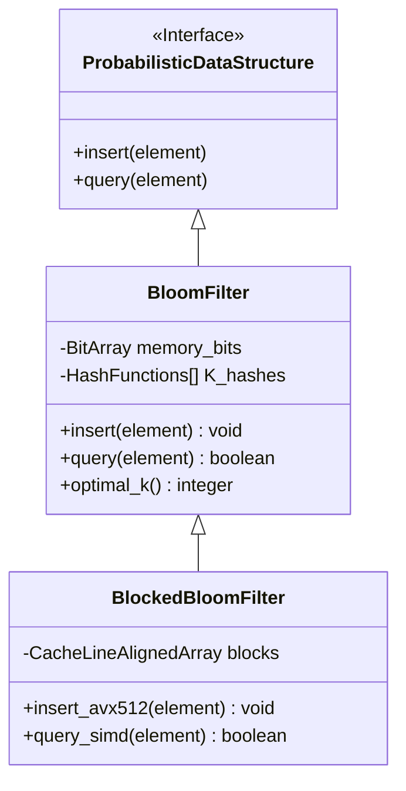

# Cấu trúc dữ liệu xác suất: Bloom Filters, HyperLogLog và Count-Min Sketch

## Executive Summary (Tóm tắt)

Khi một hệ thống phải xử lý hàng triệu sự kiện mỗi giây, điều đầu tiên hết chịu áp lực thường không phải CPU mà là RAM. Khối lượng dữ liệu và tốc độ dòng chảy tăng vọt đặt ra bài toán khó cho bộ nhớ vật lý, thông lượng xử lý lẫn độ trễ mạng. Cấu trúc dữ liệu xác suất (Probabilistic Data Structures - PDS) trả lời bài toán này theo một hướng khác hẳn: chấp nhận một tỷ lệ sai số nhỏ, được kiểm soát chặt bằng toán xác suất, để đổi lấy mức tiêu thụ bộ nhớ giảm theo cấp số nhân hoặc logarit.

Bài viết này đi sâu vào ba cấu trúc dữ liệu xác suất phổ biến nhất trong hệ thống hiện đại: **Bloom Filter**, **HyperLogLog** và **Count-Min Sketch**. Ngoài phần toán học nền tảng, chúng ta sẽ xem các cấu trúc này tương tác thế nào với phần cứng (CPU cache, TLB, SIMD) và hệ điều hành (cơ chế phân trang của Linux kernel), cũng như cách cấu hình chúng để đạt hiệu năng tốt trong hệ thống thời gian thực.

## Core Problem Statement (Vấn đề cốt lõi)

Các cấu trúc dữ liệu tất định (Deterministic Data Structures) truyền thống bắt đầu bộc lộ giới hạn rõ rệt khi tập hợp dữ liệu ($N$) tiệm cận mức hàng tỷ đến hàng nghìn tỷ phần tử.

- **Chi phí không gian tuyến tính:** B-Tree, Hash Table hay Red-Black Tree đều cần dung lượng bộ nhớ tăng theo $O(N)$. Lưu 1 tỷ địa chỉ IPv6 (128-bit) đã cần hàng chục GB RAM chỉ cho dữ liệu thô, chưa tính overhead của con trỏ, metadata node và phân mảnh bộ nhớ.
- **Cache thrashing và mất tính cục bộ:** Khi vùng làm việc vượt quá dung lượng L3 cache, tỷ lệ cache miss tăng vọt. CPU buộc phải truy xuất RAM trực tiếp, tốn hàng trăm chu kỳ xung nhịp mỗi lần, và làm giảm hẳn hiệu quả của pipeline lệnh superscalar.
- **Giới hạn băng thông đa lõi:** Khi hàng nghìn thread cùng cập nhật một hash table dùng chung, cơ chế khóa (mutex/semaphore) nhanh chóng trở thành nút thắt cổ chai - hoặc tệ hơn, gây ra false sharing giữa các cache line của những lõi vật lý độc lập.
- **Giới hạn từ lý thuyết thông tin Shannon:** Nếu hệ thống chỉ cần trả lời câu hỏi nhị phân (phần tử này có tồn tại không?) hay ước lượng thống kê tổng thể (có bao nhiêu phần tử duy nhất, tần suất ra sao?), thì việc lưu trọn vẹn dữ liệu gốc là lãng phí không cần thiết.

Cấu trúc dữ liệu xác suất ra đời để giải quyết đúng vấn đề này. Với độ phức tạp không gian tiệm cận $O(1)$ hoặc $O(\log \log N)$, chúng cắt đứt mối liên hệ giữa dung lượng lưu trữ và khối lượng dữ liệu đầu vào, mở đường cho các hệ thống phân tán có thể mở rộng gần như vô hạn.

## Deep Technical Knowledge / Internals (Kiến thức kỹ thuật chuyên sâu)

### Bloom Filter: cỗ máy chỉ trả lời có hay không

Bloom Filter là một mảng bit tuyến tính kết hợp với $k$ hàm băm độc lập, dùng để kiểm tra một phần tử có thuộc một tập hợp cực lớn hay không. Câu trả lời luôn chỉ có hai dạng: "chắc chắn không tồn tại" hoặc "có khả năng tồn tại". Nói cách khác, mô hình này chấp nhận một tỷ lệ dương tính giả (false positive) nhất định, nhưng về mặt thiết kế sẽ không bao giờ cho ra âm tính giả (false negative).

**Cơ sở toán học và cách chọn tham số tối ưu:**

Xác suất dương tính giả $\epsilon$ phụ thuộc vào kích thước mảng $m$, số hàm băm $k$ và số phần tử dự kiến chèn vào $n$, theo công thức:

$\epsilon \approx (1 - e^{-kn/m})^k$

Muốn cực tiểu hóa $\epsilon$ với không gian cố định, ta lấy đạo hàm bậc nhất theo $k$ rồi cho bằng 0, thu được giá trị tối ưu $k = \frac{m}{n} \ln 2$. Từ đó suy ra dung lượng bộ nhớ cần thiết: $m = -\frac{n \ln \epsilon}{(\ln 2)^2}$.
Trong thực tế, việc tính đủ $k$ hàm băm (kiểu SHA-1 hay MurmurHash3) mỗi lần là khá tốn ALU cycle. Kỹ thuật "băm kép" (Double Hashing) giải quyết việc này: từ hàm băm thứ ba trở đi, ta chỉ cần tổ hợp tuyến tính hai giá trị băm gốc để tạo ra kết quả mới:

$h_i(x) = (h_1(x) + i \cdot h_2(x)) \pmod m$

**Tương tác với phần cứng và kiến trúc Blocked Bloom Filter:**

Điểm yếu của Bloom Filter truyền thống là phá vỡ tính cục bộ không gian (spatial locality). Một truy vấn với $k=7$ sẽ rải ngẫu nhiên trên một mảng bit cỡ gigabyte, gây ra 7 lần cache miss L3 độc lập - điều tối kỵ trong các hệ thống HFT hay viễn thông lõi. Giải pháp là **Blocked Bloom Filter**.
Ý tưởng là chia mảng tuyến tính lớn thành các block nhỏ, mỗi block vừa khít một cache line vật lý của kiến trúc x86 (thường 64 byte, tức 512 bit). Hàm băm đầu tiên chỉ chọn ra một block duy nhất, còn $k-1$ hàm băm còn lại chỉ được bật bit bên trong ranh giới 512 bit đó.
Tỷ lệ dương tính giả có tăng nhẹ do phân phối không đều (hiện tượng "balls into bins"), nhưng vì cache miss giờ chỉ còn tối đa một lần chạm RAM, tốc độ truy vấn tăng 10-20 lần. Với AVX-512, CPU còn có thể so sánh cả 512 bit chỉ trong một chu kỳ xung nhịp.



### HyperLogLog (HLL): ước lượng số lượng phần tử duy nhất chỉ với vài KB

Đếm số lượng người dùng duy nhất (unique visitors) từ 100 tỷ request web, trong khi chỉ có vài KB RAM để dùng - nghe qua thì các kỹ thuật đếm bằng hash-set truyền thống chịu thua. HyperLogLog lại làm được điều này.

**Thuật toán Flajolet-Martin và hiệu chỉnh bằng trung bình điều hòa:**

Ý tưởng cốt lõi dựa trên một tính chất của phân phối ngẫu nhiên: với chuỗi hash lý tưởng, xác suất một mã băm bắt đầu bằng đúng $k$ bit 0 liên tiếp giảm theo $2^{-(k+1)}$. Ghi lại độ dài chuỗi bit 0 dẫn đầu lớn nhất từng quan sát được (ký hiệu $\rho_{max}$), ta có thể ước lượng kích thước tập hợp vào khoảng $2^{\rho_{max}}$.
Vì một quan sát đơn lẻ có phương sai quá lớn do các giá trị ngoại lai ngẫu nhiên, HLL chia luồng dữ liệu thành $m = 2^b$ thanh ghi (register) độc lập. Giá trị tổng hợp được tính bằng trung bình điều hòa (Harmonic Mean) - giúp giảm ảnh hưởng của các giá trị bất thường - rồi nhân thêm hệ số hiệu chỉnh Maclaurin $\alpha_m$:

$E = \alpha_m m^2 \left( \sum_{j=1}^m 2^{-M[j]} \right)^{-1}$

Một thanh ghi chỉ cần 6 bit đã có thể theo dõi tới $2^{64}$ phần tử. Với $m=16384$ thanh ghi, cả hệ thống HLL chỉ tốn 12KB RAM mà sai số chuẩn vẫn giữ ở mức $\frac{1.04}{\sqrt{m}} \approx 0.81\%$.

**Cấu hình Linux kernel và Huge Pages:**

Trong môi trường phân tán, việc liên tục tạo mới và merge hàng triệu cấu trúc HLL gây áp lực đáng kể lên cơ chế phân trang ảo của hệ điều hành. Nếu vẫn dùng trang 4KB mặc định, TLB (Translation Lookaside Buffer) sẽ liên tục bị miss. Bật *Transparent Huge Pages* (THP) ở mức 2MB hoặc 1GB giúp gom các mảng thanh ghi HLL vào vùng địa chỉ vật lý liên tục, gần như loại bỏ hoàn toàn TLB miss và tránh lãng phí chu kỳ CPU cho việc page table walk.

### Count-Min Sketch (CMS): đo tần suất giữa nhiễu loạn

Count-Min Sketch (CMS) là công cụ dùng khi bài toán không chỉ dừng ở "có tồn tại hay không" mà cần biết chính xác tần suất xuất hiện (frequency) của các sự kiện trong một luồng dữ liệu nhiễu và khổng lồ.

**Thiết kế ma trận trực giao và bất đẳng thức Markov:**

CMS được cài đặt như một ma trận $d$ hàng, $w$ cột gồm các ô số nguyên. Hai hằng số này bắt nguồn từ bất đẳng thức Markov: số cột $w = \lceil e / \epsilon \rceil$ kiểm soát độ lớn của sai số, còn số hàng $d = \lceil \ln(1 / \delta) \rceil$ kiểm soát xác suất lỗi ($\delta$). Khi truy vấn, CMS chạy $d$ hàm băm tương ứng với từng hàng rồi lấy giá trị Min() nhỏ nhất trong số đó. Thiết kế này luôn thiên về ước lượng cao hơn thực tế (overestimation), nhưng mức chênh lệch được ràng buộc chặt về mặt toán học.

**Tối ưu Conservative Update và xử lý đa luồng lock-free:**

Với dữ liệu phân phối lệch kiểu Zipf (phần lớn traffic tập trung vào một số ít ID), kỹ thuật *Conservative Update* gần như là bắt buộc. Thay vì cộng dồn một cách mù quáng, CMS trước tiên quét lấy Min của toàn bộ các hàng liên quan, rồi chỉ cập nhật những ô có giá trị nhỏ hơn ngưỡng Min đó. Nhờ vậy, sai số dương do các phần tử ngoại lai gây ra không bị cộng dồn vô tội vạ.

Về mặt kiến trúc đa lõi, nếu dùng mutex thô (coarse-grained lock) để bảo vệ một ma trận bị truy cập liên tục thì băng thông sẽ sập ngay. CMS đạt tốc độ xử lý cấp terabit nhờ các thao tác atomic, hoặc kiến trúc thread-local array kết hợp merge nền theo kiểu Map-Reduce.

```rust
// Mã nguồn minh họa Count-Min Sketch (Rust) thiết kế cấp doanh nghiệp
// Sử dụng Conservative Update và Memory Ordering tối ưu cho Cache Locality (Linearized 2D Array)
use std::sync::atomic::{AtomicU64, Ordering};

pub struct CountMinSketch {
    counters: Vec<AtomicU64>,
    d_rows: usize,
    w_cols: usize,
}

impl CountMinSketch {
    pub fn new(epsilon: f64, delta: f64) -> Self {
        let w_cols = (std::f64::consts::E / epsilon).ceil() as usize;
        let d_rows = (1.0 / delta).ln().ceil() as usize;
        let size = w_cols * d_rows;
        
        // Tiền cấp phát (Pre-allocate) không gian tuyến tính trên bộ nhớ đệm
        let mut counters = Vec::with_capacity(size);
        for _ in 0..size {
            counters.push(AtomicU64::new(0));
        }
        
        CountMinSketch { counters, d_rows, w_cols }
    }

    pub fn insert_conservative(&self, hash_key: u64, count: u64) {
        let mut min_val = u64::MAX;
        let mut positions = Vec::with_capacity(self.d_rows);
        
        // Phase 1: Truy vấn trích xuất giá trị Min bằng chỉ thị bộ nhớ Relaxed (Không gây rào cản luồng)
        for i in 0..self.d_rows {
            let col = self.hash_family(hash_key, i) % self.w_cols;
            let idx = i * self.w_cols + col; // Kỹ thuật làm phẳng ma trận để tăng Cache Locality
            positions.push(idx);
            
            let current_val = self.counters[idx].load(Ordering::Relaxed);
            if current_val < min_val {
                min_val = current_val;
            }
        }
        
        // Phase 2: Conservative Update thực thi bằng chuỗi chỉ thị nguyên tử Compare-And-Swap (CAS)
        let target_val = min_val.saturating_add(count);
        for &idx in &positions {
            let mut current = self.counters[idx].load(Ordering::Relaxed);
            while current < target_val {
                match self.counters[idx].compare_exchange_weak(
                    current, target_val,
                    Ordering::Release, Ordering::Relaxed // Kiến trúc chuẩn Release-Acquire Memory Semantics
                ) {
                    Ok(_) => break, // Cập nhật nguyên tử thành công
                    Err(actual) => current = actual, // Dữ liệu bị luồng khác ghi đè, nạp lại retry
                }
            }
        }
    }
    
    #[inline(always)] // Cưỡng ép nội tuyến để tăng hiệu suất cấp lệnh ALU
    fn hash_family(&self, base_hash: u64, seed_index: usize) -> usize {
        // Tái sử dụng băng thông ALU bằng Linear Double Hashing, tránh gọi SHA/Murmur nhiều lần
        (base_hash.wrapping_add((seed_index as u64).wrapping_mul(0x9E3779B97F4A7C15))) as usize
    }
}
```

```mermaid
graph TD
    A[Data Stream / Network Packets] --> B[MurmurHash3 64-bit Core Engine]
    B --> C(Row 1: Simulated Hash 1)
    B --> D(Row 2: Simulated Hash 2)
    B --> E(Row d: Simulated Hash d)
    C --> F[Counter Array 1]
    D --> G[Counter Array 2]
    E --> H[Counter Array d]
    F -. Read .-> I{Conservative Min() Filter}
    G -. Read .-> I
    H -. Read .-> I
    I --> J[Estimated Frequency]
    J -- CAS Update --> F
    J -- CAS Update --> G
    J -- CAS Update --> H
```

## Practical Applications & Case Studies (Ứng dụng thực tế)

### Chống nghẽn cache CDN toàn cầu (Cloudflare & Akamai)

"One-hit wonder" là hiện tượng hàng tỷ tài nguyên URL tĩnh chỉ được truy cập đúng một lần trong toàn bộ vòng đời của chúng, gây ra cache pollution và đẩy những tài nguyên có giá trị cao ra khỏi vùng RAM đắt đỏ. Cloudflare đặt một Bloom Filter làm người gác cổng trước hệ thống CDN: một tài nguyên tĩnh chỉ được phép sao chép vào tầng cache SSD khi Bloom Filter báo "hit" - tức đây là lần yêu cầu thứ hai trở đi. Cơ chế đơn giản này giúp giảm tới 60% lưu lượng ghi và kéo dài tuổi thọ của cả cụm SSD NVMe.

### Tối ưu tầng ghi đĩa (Cassandra, RocksDB, LevelDB)

Cơ sở dữ liệu kiểu LSM-Tree lưu dữ liệu bền vững trên đĩa thông qua các tệp SSTable. Khi có một truy vấn tìm khóa, cách làm ngây thơ là quét qua toàn bộ các tệp. Nếu mỗi SSTable được gắn kèm một Bloom Filter nhỏ nằm trong RAM, engine có thể loại bỏ ngay 99,9% số tệp chắc chắn không chứa khóa cần tìm, kéo chi phí Disk I/O từ $O(N)$ tuyến tính xuống gần như $O(1)$.

### Phân tích Big Data thời gian thực (Redis, Presto, BigQuery)

Redis cung cấp sẵn cặp lệnh `PFADD` và `PFCOUNT` dựa trên HyperLogLog. Các nền tảng AdTech dùng nó để đếm unique views từ hàng nghìn tỷ lượt hiển thị (impression) với độ trễ cỡ micro giây. So với `COUNT(DISTINCT user_id)` truyền thống - vốn cần dựng ma trận sắp xếp và loại trùng rất tốn RAM - BigQuery dùng HLL sketching để đạt độ chính xác trên 99% mà chi phí tính toán giảm từ hàng nghìn USD xuống chỉ còn vài xu.

### Router mạng lõi chống DDoS (Cisco, Juniper)

Router viễn thông lõi phải phân tích Heavy Hitter traffic (những dải IP gửi lượng gói tin vượt ngưỡng - dấu hiệu sớm của tấn công DDoS) ở tốc độ đường truyền hàng Tbps. Ở tốc độ này, chu kỳ RAM thông thường không thể theo kịp. Ma trận Count-Min Sketch được khắc trực tiếp vào chip ASIC/FPGA chuyên dụng, theo dõi tần suất của hàng tỷ IP chỉ với vài MB SRAM trên chip, không cần gọi đến cấp phát bộ nhớ động của hệ điều hành.

## Lessons Learned (Bài học rút ra)

1. **Theo đuổi sự chính xác tuyệt đối thường không đáng giá:** Với các luồng dữ liệu lớn và vô tận, cố giữ toàn bộ thông tin đầy đủ và chính xác là một khoản đầu tư không tương xứng với lợi ích. Chấp nhận sai số ở mức có thể kiểm soát là chìa khóa để hệ thống mở rộng được. Tăng RAM một cách thô bạo không bao giờ thắng được sức mạnh của phân phối xác suất.
2. **Tính cục bộ không gian quan trọng hơn Big-O trên giấy:** Một thuật toán PDS dù tiết kiệm bộ nhớ $O(1)$ đến đâu, nếu truy cập bộ nhớ theo kiểu ngẫu nhiên rải rác thì hiệu năng thực tế vẫn sẽ bị cache miss của CPU bào mòn. Blocked Bloom Filter là minh chứng rằng hiểu rõ ranh giới vật lý của cache line L1/L2 mang lại giá trị thực tiễn lớn hơn nhiều so với việc tối ưu độ phức tạp thuật toán trên lý thuyết.
3. **Ưu tiên mô hình lock-free, eventual consistency:** Trong môi trường đồng thời quy mô lớn, bảo vệ một bộ đếm dùng chung bằng mutex gần như chắc chắn dẫn đến nghẽn băng thông. Kỹ sư nên nắm vững atomic operations, vòng lặp CAS, thread-local storage hay kiến trúc Map-Reduce nền để xây dựng pipeline PDS phân tán không bị tắc nghẽn.
4. **Cần hiểu cả tầng phần cứng lẫn hệ điều hành:** Không thể khai thác hết tiềm năng của các cấu trúc dữ liệu này nếu bỏ qua việc cấu hình kernel Linux - Transparent Huge Pages, NUMA pinning, cache alignment. Một kỹ sư hệ thống phân tán giỏi cần nắm cả nền tảng toán xác suất lẫn cơ chế quản lý bộ nhớ ảo của hệ điều hành.

---
*Tài liệu tham khảo dành cho kỹ sư kiến trúc hệ thống phân tán.*
*Áp dụng thực tế cho hệ thống ngân hàng lõi, hạ tầng mạng biên trên cloud, và các nền tảng giao dịch tần suất cao (HFT).*
