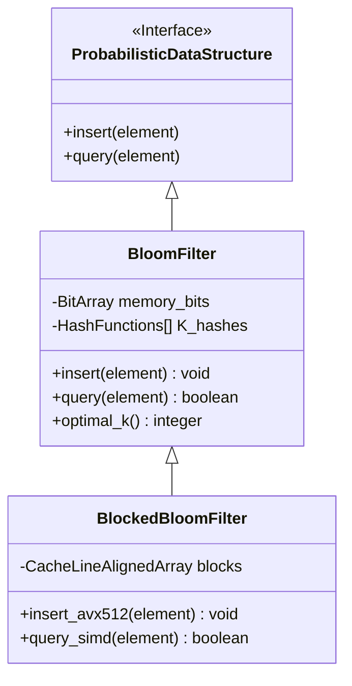

# Bloom Filter, HyperLogLog và Count-Min Sketch: khi gần đúng đủ tốt

## Executive Summary (Tóm tắt)

Có một ngưỡng lưu lượng mà ở đó cấu trúc dữ liệu chính xác tuyệt đối bắt đầu trở thành gánh nặng thay vì lợi thế. Khi hệ thống phải xử lý hàng triệu sự kiện mỗi giây, bài toán không còn nằm ở tốc độ CPU mà nằm ở dung lượng bộ nhớ, thông lượng và độ trễ mạng cần để chứa và truy vấn toàn bộ dữ liệu đó. Cấu trúc dữ liệu xác suất (Probabilistic Data Structures - PDS) giải quyết vấn đề này bằng một sự đánh đổi rõ ràng: chấp nhận một tỷ lệ sai số nhỏ, được tính toán và kiểm soát bằng toán xác suất, để đổi lấy mức tiêu thụ bộ nhớ giảm theo cấp số nhân hoặc logarit so với cách lưu trữ truyền thống.

Bài viết này phân tích ba cấu trúc dữ liệu xác suất được dùng phổ biến nhất hiện nay: Bloom Filter, HyperLogLog và Count-Min Sketch. Bên cạnh phần lý thuyết, chúng ta sẽ xem cách các cấu trúc này khai thác đặc điểm phần cứng - CPU cache, TLB, tập lệnh SIMD - và cách hệ điều hành Linux quản lý bộ nhớ ảo cho chúng, cùng những lựa chọn cấu hình thực tế để đạt hiệu năng tốt trong hệ thống doanh nghiệp thời gian thực.

## Core Problem Statement (Vấn đề cốt lõi)

Các cấu trúc dữ liệu tất định quen thuộc - B-Tree, hash table, red-black tree - hoạt động tốt cho tới khi tập hợp dữ liệu ($N$) chạm ngưỡng hàng tỷ hoặc hàng nghìn tỷ phần tử, lúc đó một loạt vấn đề bắt đầu lộ ra:

- **Không gian tăng tuyến tính theo $O(N)$:** Lưu 1 tỷ địa chỉ IPv6 (128-bit) cần hàng chục GB RAM chỉ riêng cho dữ liệu thô, chưa kể overhead của con trỏ, metadata mỗi node và phân mảnh bộ nhớ theo thời gian.
- **Cache thrashing:** Một khi vùng dữ liệu làm việc vượt quá L3 cache của CPU, tỷ lệ cache miss tăng mạnh, buộc CPU phải lấy dữ liệu trực tiếp từ RAM với chi phí hàng trăm chu kỳ xung nhịp mỗi lần - đủ để phá hỏng lợi ích của pipeline lệnh superscalar.
- **Tranh chấp trên nhiều lõi:** Hàng nghìn thread cùng ghi vào một hash table dùng chung sẽ khiến cơ chế khóa trở thành nút thắt, hoặc gây false sharing giữa các cache line thuộc những lõi CPU khác nhau.
- **Giới hạn tự nhiên theo lý thuyết thông tin:** Nếu ứng dụng chỉ cần trả lời "phần tử này có tồn tại không" hoặc các câu hỏi thống kê tổng hợp (đếm số lượng duy nhất, tần suất), thì giữ lại toàn bộ dữ liệu gốc là dùng dư thừa tài nguyên so với nhu cầu thực.

Đây chính là khoảng trống mà cấu trúc dữ liệu xác suất lấp vào. Với độ phức tạp không gian ở mức $O(1)$ hoặc $O(\log \log N)$, chúng tách rời dung lượng lưu trữ khỏi kích thước dữ liệu đầu vào, cho phép xây dựng hệ thống phân tán có khả năng mở rộng gần như không giới hạn.

## Deep Technical Knowledge / Internals (Kiến thức kỹ thuật chuyên sâu)

### Bloom Filter: chỉ trả lời "chắc chắn không" hoặc "có thể có"

Bloom Filter là một mảng bit kết hợp với $k$ hàm băm độc lập, dùng để kiểm tra một phần tử có nằm trong một tập hợp lớn hay không. Nó chỉ trả về hai loại kết quả: "chắc chắn không tồn tại" hoặc "có khả năng tồn tại". Điều này có nghĩa Bloom Filter chấp nhận một tỷ lệ dương tính giả nhất định, nhưng không bao giờ cho ra âm tính giả - đây là ràng buộc thiết kế cốt lõi của cấu trúc.

**Nền tảng toán học và việc chọn tham số:**

Xác suất dương tính giả $\epsilon$ liên quan tới kích thước mảng bit $m$, số hàm băm $k$, và số phần tử dự kiến $n$ theo công thức:

$\epsilon \approx (1 - e^{-kn/m})^k$

Lấy đạo hàm theo $k$ và cho bằng 0 sẽ tìm được số hàm băm tối ưu $k = \frac{m}{n} \ln 2$, từ đó suy ra kích thước mảng bit cần thiết $m = -\frac{n \ln \epsilon}{(\ln 2)^2}$.
Tính $k$ hàm băm độc lập (như SHA-1 hay MurmurHash3) cho mỗi lần chèn khá tốn ALU cycle trong thực tế. Kỹ thuật băm kép (Double Hashing) khắc phục điều này: từ hàm băm thứ ba trở đi, chỉ cần tổ hợp hai giá trị băm gốc theo công thức tuyến tính:

$h_i(x) = (h_1(x) + i \cdot h_2(x)) \pmod m$

**Tương tác phần cứng và Blocked Bloom Filter:**

Bloom Filter kiểu cổ điển có một nhược điểm: phá vỡ tính cục bộ không gian. Một truy vấn dùng $k=7$ hàm băm sẽ chạm vào 7 vị trí ngẫu nhiên trên một mảng bit cỡ gigabyte, gây ra 7 lần cache miss L3 riêng biệt - điều không thể chấp nhận trong hệ thống HFT hay hạ tầng viễn thông lõi. Blocked Bloom Filter giải quyết vấn đề này bằng cách chia mảng bit thành các block nhỏ, mỗi block vừa đúng kích thước một cache line vật lý (thường 64 byte, tức 512 bit) trên kiến trúc x86.
Hàm băm đầu tiên chọn ra một block duy nhất; $k-1$ hàm băm còn lại chỉ được phép bật bit trong phạm vi 512 bit của block đó. Tỷ lệ dương tính giả có nhích lên chút ít do phân phối không đều (hiệu ứng "balls into bins"), nhưng đổi lại tốc độ truy vấn tăng 10-20 lần vì cache miss giờ chỉ còn tối đa một lần cho mỗi truy vấn. Kết hợp thêm tập lệnh AVX-512, CPU có thể so sánh cả 512 bit trong đúng một chu kỳ xung nhịp.



### HyperLogLog (HLL): đếm số lượng phần tử duy nhất mà gần như không tốn RAM

Thử tưởng tượng cần đếm số người dùng duy nhất trong 100 tỷ request web, nhưng chỉ có vài KB bộ nhớ để làm việc đó. Với hash-set truyền thống thì bất khả thi, nhưng HyperLogLog xử lý được bài toán này một cách gọn gàng.

**Thuật toán Flajolet-Martin và phép hiệu chỉnh bằng trung bình điều hòa:**

Cơ sở của thuật toán nằm ở một tính chất thống kê đơn giản: trong một chuỗi hash phân phối đều, xác suất một mã băm bắt đầu bằng đúng $k$ bit 0 liên tiếp giảm theo hàm $2^{-(k+1)}$. Ghi lại độ dài chuỗi 0 dẫn đầu lớn nhất từng gặp (ký hiệu $\rho_{max}$), ta có thể suy ra quy mô tập hợp xấp xỉ $2^{\rho_{max}}$.
Vì một phép đo đơn lẻ có phương sai lớn do nhiễu ngẫu nhiên, HLL chia dữ liệu vào $m = 2^b$ thanh ghi độc lập, sau đó tổng hợp bằng trung bình điều hòa (giúp hạn chế ảnh hưởng của các giá trị bất thường) nhân với hệ số hiệu chỉnh Maclaurin $\alpha_m$:

$E = \alpha_m m^2 \left( \sum_{j=1}^m 2^{-M[j]} \right)^{-1}$

Mỗi thanh ghi chỉ cần 6 bit là đủ theo dõi tới $2^{64}$ phần tử. Với $m=16384$ thanh ghi, toàn bộ cấu trúc HLL chỉ tốn 12KB RAM, trong khi sai số chuẩn vẫn ở mức thấp: $\frac{1.04}{\sqrt{m}} \approx 0.81\%$.

**Cấu hình Linux kernel và Huge Pages:**

Khi hệ thống liên tục tạo và merge hàng triệu cấu trúc HLL, cơ chế phân trang ảo của hệ điều hành chịu áp lực đáng kể. Dùng trang bộ nhớ mặc định 4KB sẽ khiến TLB (Translation Lookaside Buffer) liên tục bị miss. Bật *Transparent Huge Pages* (THP) ở mức 2MB hay 1GB giúp các mảng thanh ghi HLL nằm gọn trong vùng địa chỉ vật lý liên tục, giảm mạnh TLB miss và tránh lãng phí chu kỳ CPU cho việc duyệt page table.

### Count-Min Sketch (CMS): ước lượng tần suất trong dòng dữ liệu nhiễu

Count-Min Sketch (CMS) hữu ích khi bài toán không chỉ là "có tồn tại hay không" mà cần biết tần suất xuất hiện của từng phần tử trong một luồng dữ liệu lớn và nhiễu.

**Ma trận trực giao và bất đẳng thức Markov:**

CMS được cài đặt dưới dạng ma trận $d$ hàng, $w$ cột. Hai tham số này bắt nguồn từ bất đẳng thức Markov: số cột $w = \lceil e / \epsilon \rceil$ kiểm soát biên độ sai số, số hàng $d = \lceil \ln(1 / \delta) \rceil$ kiểm soát xác suất lỗi $\delta$. Khi truy vấn, CMS tính $d$ hàm băm ứng với $d$ hàng rồi lấy giá trị nhỏ nhất (Min) trong số các ô tương ứng. Thiết kế này luôn cho kết quả thiên cao hơn thực tế (overestimation), nhưng độ lệch đó bị chặn trên một cách chặt chẽ về mặt toán học.

**Conservative Update và xử lý đa luồng không khóa:**

Với dữ liệu phân phối lệch kiểu Zipf - phần lớn traffic dồn vào một số ít ID - kỹ thuật Conservative Update gần như là điều bắt buộc. Thay vì cộng dồn ngay lập tức, CMS quét lấy giá trị Min của các hàng liên quan trước, rồi chỉ cập nhật những ô đang thấp hơn ngưỡng đó. Cách làm này ngăn sai số dương tăng vọt do các phần tử ngoại lai.

Ở tầng kiến trúc đa lõi, dùng mutex thô để bảo vệ một ma trận bị truy cập dồn dập sẽ giết chết băng thông ngay lập tức. CMS đạt được tốc độ cấp terabit nhờ các thao tác atomic, hoặc kiến trúc bản sao mảng theo từng thread kết hợp gộp nền kiểu Map-Reduce.

```rust
// Mã nguồn minh họa Count-Min Sketch (Rust) thiết kế cấp doanh nghiệp
// Sử dụng Conservative Update và Memory Ordering tối ưu cho Cache Locality (Linearized 2D Array)
use std::sync::atomic::{AtomicU64, Ordering};

pub struct CountMinSketch {
    counters: Vec<AtomicU64>,
    d_rows: usize,
    w_cols: usize,
}

impl CountMinSketch {
    pub fn new(epsilon: f64, delta: f64) -> Self {
        let w_cols = (std::f64::consts::E / epsilon).ceil() as usize;
        let d_rows = (1.0 / delta).ln().ceil() as usize;
        let size = w_cols * d_rows;
        
        // Tiền cấp phát (Pre-allocate) không gian tuyến tính trên bộ nhớ đệm
        let mut counters = Vec::with_capacity(size);
        for _ in 0..size {
            counters.push(AtomicU64::new(0));
        }
        
        CountMinSketch { counters, d_rows, w_cols }
    }

    pub fn insert_conservative(&self, hash_key: u64, count: u64) {
        let mut min_val = u64::MAX;
        let mut positions = Vec::with_capacity(self.d_rows);
        
        // Phase 1: Truy vấn trích xuất giá trị Min bằng chỉ thị bộ nhớ Relaxed (Không gây rào cản luồng)
        for i in 0..self.d_rows {
            let col = self.hash_family(hash_key, i) % self.w_cols;
            let idx = i * self.w_cols + col; // Kỹ thuật làm phẳng ma trận để tăng Cache Locality
            positions.push(idx);
            
            let current_val = self.counters[idx].load(Ordering::Relaxed);
            if current_val < min_val {
                min_val = current_val;
            }
        }
        
        // Phase 2: Conservative Update thực thi bằng chuỗi chỉ thị nguyên tử Compare-And-Swap (CAS)
        let target_val = min_val.saturating_add(count);
        for &idx in &positions {
            let mut current = self.counters[idx].load(Ordering::Relaxed);
            while current < target_val {
                match self.counters[idx].compare_exchange_weak(
                    current, target_val,
                    Ordering::Release, Ordering::Relaxed // Kiến trúc chuẩn Release-Acquire Memory Semantics
                ) {
                    Ok(_) => break, // Cập nhật nguyên tử thành công
                    Err(actual) => current = actual, // Dữ liệu bị luồng khác ghi đè, nạp lại retry
                }
            }
        }
    }
    
    #[inline(always)] // Cưỡng ép nội tuyến để tăng hiệu suất cấp lệnh ALU
    fn hash_family(&self, base_hash: u64, seed_index: usize) -> usize {
        // Tái sử dụng băng thông ALU bằng Linear Double Hashing, tránh gọi SHA/Murmur nhiều lần
        (base_hash.wrapping_add((seed_index as u64).wrapping_mul(0x9E3779B97F4A7C15))) as usize
    }
}
```

```mermaid
graph TD
    A[Data Stream / Network Packets] --> B[MurmurHash3 64-bit Core Engine]
    B --> C(Row 1: Simulated Hash 1)
    B --> D(Row 2: Simulated Hash 2)
    B --> E(Row d: Simulated Hash d)
    C --> F[Counter Array 1]
    D --> G[Counter Array 2]
    E --> H[Counter Array d]
    F -. Read .-> I{Conservative Min() Filter}
    G -. Read .-> I
    H -. Read .-> I
    I --> J[Estimated Frequency]
    J -- CAS Update --> F
    J -- CAS Update --> G
    J -- CAS Update --> H
```

## Practical Applications & Case Studies (Ứng dụng thực tế)

### Chống cache pollution ở quy mô CDN toàn cầu (Cloudflare & Akamai)

"One-hit wonder" mô tả hiện tượng hàng tỷ tài nguyên URL tĩnh chỉ được truy cập đúng một lần trong toàn bộ vòng đời, gây ra cache pollution và đẩy các tài nguyên có traffic cao ra khỏi vùng RAM quý giá. Cloudflare xử lý vấn đề này bằng cách đặt một Bloom Filter ở cửa ngõ hệ thống CDN: một tài nguyên tĩnh chỉ được sao chép vào tầng cache SSD khi Bloom Filter báo hit, nghĩa là đây đã là lần yêu cầu thứ hai trở lên. Cơ chế phòng thủ đơn giản này giảm được khoảng 60% lưu lượng ghi và kéo dài tuổi thọ cụm SSD NVMe.

### Tối ưu tầng ghi đĩa trong LSM-Tree (Cassandra, RocksDB, LevelDB)

Cơ sở dữ liệu kiểu LSM-Tree lưu dữ liệu bền vững qua các tệp SSTable trên đĩa. Khi có truy vấn tìm khóa, cách làm đơn giản là quét lần lượt qua các tệp - rất tốn kém khi số tệp lớn. Gắn một Bloom Filter nhỏ trong RAM cho mỗi SSTable cho phép engine loại bỏ ngay 99,9% số tệp chắc chắn không chứa khóa cần tìm, đưa chi phí Disk I/O từ $O(N)$ về gần $O(1)$.

### Phân tích Big Data thời gian thực (Redis, Presto, BigQuery)

Redis có sẵn cặp lệnh `PFADD` và `PFCOUNT` dựa trên HyperLogLog. Các nền tảng quảng cáo dùng chúng để đếm unique views từ hàng nghìn tỷ lượt hiển thị với độ trễ cỡ micro giây. So với `COUNT(DISTINCT user_id)` truyền thống - cần dựng ma trận sắp xếp và loại trùng rất tốn RAM - BigQuery dùng HLL sketching để đạt độ chính xác trên 99% với chi phí tính toán giảm từ hàng nghìn USD xuống chỉ còn vài xu.

### Router mạng lõi chống DDoS (Cisco, Juniper)

Router viễn thông lõi phải phân tích Heavy Hitter traffic - những dải IP gửi lượng gói tin bất thường, dấu hiệu sớm của một cuộc tấn công DDoS - ở tốc độ đường truyền hàng Tbps. Ở tốc độ này, RAM thông thường không đủ nhanh để theo kịp. Ma trận Count-Min Sketch được khắc trực tiếp vào chip ASIC/FPGA chuyên dụng, theo dõi tần suất hàng tỷ địa chỉ IP chỉ với vài MB SRAM trên chip, không cần gọi tới cấp phát bộ nhớ động của hệ điều hành.

## Lessons Learned (Bài học rút ra)

1. **Chính xác tuyệt đối không phải lúc nào cũng đáng giá:** Với các luồng Big Data gần như vô tận, cố lưu giữ dữ liệu đầy đủ và chính xác tuyệt đối thường là một khoản chi phí không cần thiết. Chấp nhận sai số ở một ngưỡng đã được tính toán kỹ là cách để hệ thống mở rộng bền vững. Tăng RAM một cách máy móc không bao giờ thắng được lợi thế của phân phối xác suất.
2. **Tính cục bộ không gian quan trọng hơn Big-O trên giấy:** Một cấu trúc PDS dù đạt $O(1)$ về không gian, nếu truy cập bộ nhớ theo kiểu rải rác ngẫu nhiên thì hiệu năng thực tế vẫn bị cache miss ăn mòn. Blocked Bloom Filter cho thấy: hiểu rõ ranh giới vật lý cache line L1/L2 mang lại lợi ích thực tế lớn hơn nhiều so với chỉ tối ưu độ phức tạp thuật toán trên giấy.
3. **Ưu tiên thiết kế lock-free, eventual consistency:** Trong môi trường đồng thời quy mô lớn, bảo vệ bộ đếm dùng chung bằng mutex gần như chắc chắn dẫn tới nghẽn băng thông. Nắm vững atomic operations, vòng lặp CAS, thread-local storage, hay kiến trúc Map-Reduce nền là điều kiện cần để xây dựng pipeline PDS phân tán không bị tắc nghẽn.
4. **Cần nhìn xuyên suốt từ phần cứng tới hệ điều hành:** Không thể khai thác hết tiềm năng các cấu trúc dữ liệu này nếu bỏ qua việc cấu hình kernel Linux - Transparent Huge Pages, NUMA pinning, cache alignment. Kỹ sư hệ thống phân tán giỏi cần hiểu cả nền tảng xác suất lẫn cơ chế quản lý bộ nhớ ảo của hệ điều hành.

---
*Tài liệu tham khảo dành cho kỹ sư kiến trúc hệ thống phân tán.*
*Áp dụng thực tế cho hệ thống ngân hàng lõi, hạ tầng mạng biên trên cloud, và các nền tảng giao dịch tần suất cao (HFT).*
