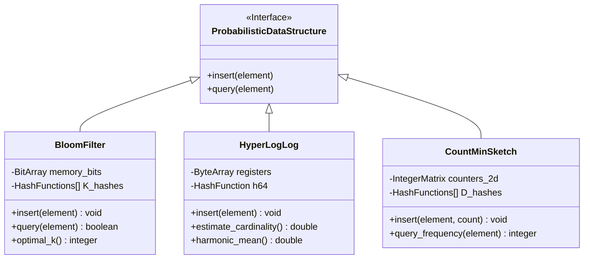

# 18: Probabilistic Data Structures: Bloom Filters, HyperLogLog và Count-Min Sketch

## Kiến trúc Nền tảng Toán học và Phân tích Thuật toán: Bloom Filters, HyperLogLog, Count-Min Sketch

Trong bối cảnh của hệ thống phân tán quy mô lớn và xử lý luồng dữ liệu thời gian thực, các cấu trúc dữ liệu truyền thống như cây nhị phân tìm kiếm, bảng băm hay đồ thị từ lâu đã bộc lộ những giới hạn cực kỳ nghiêm trọng về độ phức tạp không gian bộ nhớ khi phải đối mặt với các dòng chảy dữ liệu khổng lồ. Khi không gian mẫu của dữ liệu đầu vào vượt qua ngưỡng hàng tỷ hoặc hàng nghìn tỷ phần tử—chẳng hạn như địa chỉ IP quét qua một thiết bị chuyển mạch mạng cốt lõi hay các định danh truy cập web phân tán toàn cầu—việc cố gắng duy trì và lưu trữ một trạng thái dữ liệu chính xác tuyệt đối sẽ luôn đòi hỏi dung lượng bộ nhớ ở mức tuyến tính $O(N)$. Sự bùng nổ tuyến tính này không chỉ gây tốn kém về mặt lưu trữ vật lý mà quan trọng hơn là dẫn đến hiện tượng trượt bộ đệm thường xuyên ở các cấp độ kiến trúc phần cứng vi mô, cuối cùng làm cạn kiệt tài nguyên cấp phát hệ thống và kéo giảm thông lượng tính toán thời gian thực xuống mức không thể chấp nhận được. Các cấu trúc dữ liệu xác suất đã được hình thành như một lối thoát toán học tinh vi để giải quyết triệt để nghịch lý chi phí này bằng cách cố ý đánh đổi một mức độ chính xác tuyệt đối lấy một sự suy giảm khổng lồ của không gian bộ nhớ xuống mức thứ tuyến tính, logarit, hoặc thậm chí là một hằng số giới hạn. Động lực học nền tảng dựa trên nguyên lý cơ bản của lý thuyết thông tin Shannon, chỉ ra rằng hệ thống không bao giờ cần thiết phải tái tạo lại toàn bộ chuỗi thông tin chi tiết của tập hợp gốc nếu mục tiêu duy nhất chỉ là trả lời các lớp truy vấn nhị phân hoặc ước lượng thống kê cụ thể. Một cấu trúc bảo toàn dữ liệu hoàn hảo yêu cầu một biên giới Shannon tối thiểu lên tới $\log_2 \binom{N}{n}$ bit, tiệm cận giá trị $n \log_2(eN/n)$ khi $N \gg n$. Trái ngược hoàn toàn với sự lãng phí đó, một bộ xử lý truy vấn xác suất cho mục đích xác nhận tính thành viên với ngưỡng dương tính giả $\epsilon$ được cho phép sẽ chỉ cần cấu trúc không gian vi mô có kích thước lớn hơn hoặc bằng giới hạn lý thuyết dưới cùng là $n \log_2(1/\epsilon)$ bit. Việc triệt tiêu hoàn toàn biến số kích thước vũ trụ dữ liệu $N$ khỏi phương trình độ phức tạp tài nguyên chính là yếu tố làm nên tính năng vô hạn của cấu trúc dữ liệu xác suất, cho phép các tiến trình vận hành bền bỉ bất chấp khối lượng tập hợp tăng lên đến bao nhiêu. Toàn bộ thiết kế này được neo giữ vững chắc trên nguyên lý băm dữ liệu đồng nhất. Thông qua việc sử dụng các hệ thống hàm băm đa thức biến đổi, không gian đầu vào hỗn loạn sẽ được ánh xạ trực tiếp thành một dải băng thông phân phối ngẫu nhiên đồng nhất tuyệt đối, từ đó cho phép ứng dụng các định lý giới hạn trung tâm và bất đẳng thức thống kê để thiết lập các ngưỡng sai số bảo đảm. Các nhà khoa học máy tính có thể định lượng cấu hình của những hệ thống này thông qua các hàm vi tích phân nhằm tìm ra những điểm cực tiểu hóa lý tưởng, đạt được tỷ lệ tối ưu giữa khả năng tiêu thụ bộ nhớ, số lượng thuật toán băm cần tính toán và sai số chấp nhận theo hợp đồng mức dịch vụ. 

Bộ lọc Bloom (Bloom Filter) từ lâu đã nổi lên như một trong những kiến trúc thuật toán dữ liệu xác suất cổ điển và tinh vi nhất, được định hướng thiết kế chuyên biệt để kiểm tra tính thành viên của một phần tử trong một tập hợp khổng lồ với đặc tính bảo đảm tuyệt đối không bao giờ xuất hiện các trường hợp âm tính giả (false negatives), mặc dù nó chấp nhận một tần suất xác định của các trường hợp dương tính giả (false positives). Về mặt vi cấu trúc nhị phân, bộ lọc Bloom là một mảng bit tuyến tính đơn sắc duy nhất có kích thước $m$ được khởi tạo nguyên thủy toàn số không, song hành với một tập hợp toán học gồm $k$ hàm băm hoàn toàn độc lập với nhau, ký hiệu là $\{h_1, h_2, \dots, h_k\}$. Từng hàm băm trong hệ thống này đóng vai trò như một bộ tạo ánh xạ tự nhiên chiếu một phần tử đầu vào bất kỳ tới một tọa độ số nguyên phân phối ngẫu nhiên đều trong dải phổ từ $0$ đến $m-1$. Quá trình ghi hay chèn một phần tử $x$ vào hệ thống đòi hỏi vi xử lý phải thực hiện tính toán đồng thời $k$ phương trình giá trị băm độc lập, và theo sau đó là tiến hành khởi động chuỗi lệnh song song thiết lập các thao tác nhị phân OR, biến mọi bit tại các vị trí tương ứng $h_i(x)$ thành trạng thái kích hoạt $1$. Một đặc tính cố hữu của quá trình này là sự phá hủy thông tin không thể đảo ngược chiều, bởi vì sự chồng chéo ngẫu nhiên của các mẫu bit từ vô số các phần tử riêng biệt hoàn toàn xóa bỏ mọi khả năng khôi phục lại cấu trúc phần tử nguyên bản. Khi giao thức mạng yêu cầu truy vấn thông tin tồn tại của một cá thể mục tiêu $y$, quy trình hoạt động sẽ truy xuất song song tất cả $k$ vị trí bit tương ứng $h_i(y)$. Nếu một phép thử vi mô phát hiện dù chỉ một bit đơn lẻ mang giá trị $0$, cơ chế suy luận toán học đơn điệu lập tức khẳng định chắc chắn tuyệt đối rằng phần tử $y$ chưa từng bao giờ tồn tại trong tập hợp. Ngược lại, trong tình huống toàn bộ $k$ vị trí truy vấn đều mang trạng thái số $1$, hệ thống không thể đưa ra một mệnh đề khẳng định tuyệt đối mà chỉ có thể kết luận rằng phần tử $y$ có xác suất vô cùng lớn trực thuộc tập hợp. Trạng thái không chắc chắn này phát sinh bởi vì các bit trạng thái $1$ đó hoàn toàn có khả năng đã được thắp sáng một cách ngẫu nhiên từ sự chồng lấn băm của vô vàn các phần tử chèn vào trước đó, từ đó dẫn hệ thống đến một kết luận sai lầm về mặt logic gọi là sự kiện dương tính giả. Phương trình toán học chi phối hiện tượng dương tính giả này có thể được diễn giải thông qua một phương pháp luận xác suất quy nạp khắt khe. Tại bất kỳ thời điểm nào trong chu kỳ sống của hệ thống, xác suất mà một bit vật lý chưa từng bị một hàm băm vô tình chạm đến trong một lần chèn là chính xác $1 - \frac{1}{m}$. Căn cứ vào giả định tính ngẫu nhiên độc lập tuyệt đối của cơ chế băm phổ quát, xác suất để bit đó vẫn duy trì được trạng thái khiết tịnh $0$ sau khi tập hợp đã dung nạp $n$ phần tử đi qua $k$ bước sóng băm là $(1 - \frac{1}{m})^{kn}$. Thông qua phép phân tích tiệm cận giới hạn hàm số mũ trong lý thuyết chuỗi vi phân Calculus, khi kích thước không gian $m$ tiến đến vùng vô cực cực đại, biểu thức này sẽ hội tụ mượt mà thành $e^{-kn/m}$. Tương ứng từ đó, xác suất để phần tử vật lý mang giá trị $1$ là $1 - e^{-kn/m}$. Tỷ lệ dương tính giả tổng thể mô phỏng một sự kiện giao hoán đồng thời nơi toàn bộ $k$ bit của một phần tử hoàn toàn xa lạ đều không may mắn trùng khớp với trạng thái $1$. Ký hiệu tỷ lệ này là $\epsilon$, chúng ta thu được phương trình hạt nhân vĩ đại của bộ lọc Bloom: $\epsilon \approx (1 - e^{-kn/m})^k$. Tính đa thức phi tuyến của hàm số này mở ra một cơ hội cho kỹ thuật tối ưu hóa đạo hàm riêng. Để có thể tìm ra giá trị cực tiểu của tỷ lệ lỗi $\epsilon$ với giới hạn bộ nhớ cố định $m$ và kỳ vọng phần tử dung nạp $n$, các kỹ sư hệ thống thiết lập một phép lấy vi phân bậc nhất theo $k$ và đặt tiệm cận không, từ đó thu được cấu hình tối ưu $k = \frac{m}{n} \ln 2$. Quay ngược thay thế tham số tối ưu này vào gốc biểu thức, thể tích không gian vật lý tối thiểu bắt buộc sinh ra phương trình $m = -\frac{n \ln \epsilon}{(\ln 2)^2}$. Khối lượng toán học khổng lồ ẩn sau cấu hình này phơi bày mối liên kết biện chứng giữa toán học lý thuyết và phần cứng, từ đó giúp kiến trúc sư phần mềm thiết lập lượng bộ nhớ RAM hoàn hảo nhằm vận hành thỏa thuận dịch vụ nghiêm ngặt cho cơ sở dữ liệu. Để cực đại hóa băng thông siêu phân luồng, người ta sử dụng thủ thuật băm kép (Double Hashing) thông qua phương trình $h_i(x) = (h_1(x) + i \cdot h_2(x)) \pmod m$, giúp mô phỏng ảo hóa $k$ hàm băm độc lập chỉ với hai thuật toán mã hóa MurmurHash ban đầu nhằm giải cứu bộ xử lý trung tâm khỏi cuộc khủng hoảng điện toán.



Dịch chuyển từ không gian đánh giá tồn tại nhị phân sang lãnh địa của các bài toán đếm tập hợp, HyperLogLog tỏa sáng rực rỡ như một kiệt tác thuật toán giải quyết nghịch lý đếm các phần tử duy nhất (cardinality estimation) trong những dòng hải lưu dữ liệu khổng lồ bằng cách nén không gian lưu trữ xuống các con số vi mô chỉ khoảng vài kilobyte. Linh hồn triết học của HyperLogLog bám rễ sâu vào một hiện tượng toán học tự nhiên xuất hiện trong chuỗi phân phối bit được tạo ra từ hàm băm đồng nhất hoàn hảo: Trong một chuỗi vô hạn các giá trị băm ngẫu nhiên phân phối đều, xác suất để quan sát thấy một giá trị khởi đầu bằng chính xác một tiền tố chứa $k$ bit số không liên tiếp giảm dần theo quy luật hàm mũ $2^{-(k+1)}$. Nhận thức được chân lý này, Flajolet và Martin đã thiết lập nền móng tiên phong bằng cách đề xuất rằng, nếu chúng ta liên tục quan sát độ dài dài nhất của các chuỗi bit số không dẫn đầu, ký hiệu toán học là $\rho_{max}$, trong khắp toàn bộ tập dữ liệu đã qua xử lý băm, hệ thống hoàn toàn có thể tái cấu trúc và đưa ra ước lượng vĩ mô quy mô của không gian mẫu xấp xỉ giá trị hàm số $2^{\rho_{max}}$. Dẫu vậy, một mô hình phỏng đoán đơn lẻ nguyên thủy sẽ phải hứng chịu sự nhiễu loạn phân tán cực độ từ những cá thể xác suất dị thường ngoại lai (outliers), tạo ra phương sai thống kê khổng lồ vô nghĩa cho vận hành thực tiễn. Để dập tắt sự dao động điên rồ này, thuật toán HyperLogLog kiến tạo cơ chế phân tán lấy mẫu trung bình ngẫu nhiên bằng cách cắt lát hệ thống luồng dữ liệu khổng lồ đó thành $m = 2^b$ luồng phụ nhỏ giọt hoạt động biệt lập song song song, được chia luồng dựa trên $b$ bit định tuyến đầu tiên của chuỗi giá trị băm. Mỗi dòng chảy vi mô này sẽ đổ dồn vào một không gian lưu trữ tối giản chuyên biệt gọi là "thanh ghi" (registers). Tại địa hạt của mỗi thanh ghi $j$, mã máy chỉ ghi nhớ độc nhất một giá trị cực đại của số lượng số không dẫn đầu, bảo toàn tham chiếu $M[j]$. Khi hệ thống kích hoạt thủ tục hội tụ truy vấn, một công thức trung bình điều hòa (harmonic mean) tinh vi sẽ được thiết lập để kết hợp ma trận thanh ghi này lại với nhau, cung cấp một lá chắn toán học kháng nhiễu siêu phàm nhằm hạ gục triệt để mọi trọng số thiên lệch bất thường. Công thức chuẩn hóa siêu việt này tạo nên giá trị ước lượng $E = \alpha_m m^2 \left( \sum_{j=1}^m 2^{-M[j]} \right)^{-1}$, nơi hằng số tích hợp $\alpha_m$ là hệ số hiệu chuẩn được tính toán thông qua giải tích hàm Maclaurin phức hợp, nhằm trực tiếp loại bỏ các thiên lệch phi chuẩn ở dải kích thước tập hợp cỡ vi mô. Một phát hiện đáng kinh ngạc từ cấu trúc này nằm ở quy mô bộ nhớ cực tiểu bé nhỏ của từng ô thanh ghi, nơi chúng chỉ đòi hỏi dung lượng tuyệt đối giới hạn ở hàm số $\log_2(\log_2(N))$ bit vật lý. Để minh họa, ngay cả khi tham vọng đếm một dải lượng vô biên khổng lồ chạm tới giới hạn vũ trụ phần mềm là $2^{64}$ phần tử, độ dài cực đại của $\rho$ tuyệt nhiên không thể vượt mốc 64, dẫn đến yêu cầu phần cứng thảm khốc chỉ là một đơn vị lưu trữ nguyên tử độ rộng 6-bit. Do đó, một ma trận cấu thành bởi hàng vạn thanh ghi vật lý cũng chỉ đòi hỏi chưa tới 1.5 KB dung lượng bộ nhớ RAM, trong khi vẫn xuất sắc duy trì tỷ lệ sai số tiệm cận vô hạn ở mức biên phân phối $\frac{1.04}{\sqrt{m}}$. Đặc tính này mở ra kỷ nguyên theo dõi siêu dữ liệu liên tục không nghỉ (real-time stream tracking) ngay trên trung tâm các vi xử lý định tuyến mà hoàn toàn không kích hoạt nguy cơ tràn bộ nhớ L1 đệm tốc độ siêu cao. Google đã nâng tầm kiến trúc này lên cực độ qua thuật toán HyperLogLog++ mở rộng nền tảng cấu trúc băm thành không gian 64-bit toàn diện và nhúng bảng mã sửa lỗi thống kê trực tiếp vào bộ đệm cấu trúc tĩnh để bù trừ cho cấu trúc tập hợp mẫu rỗng. 

Đối mặt với bài toán truy xuất tần suất xuất hiện nặng tính bất đối xứng từ các tập dữ liệu nhiễu loạn, Count-Min Sketch đề xuất một bộ công cụ giải pháp kiến trúc ma trận hai chiều (2D array architecture) cực kỳ thanh lịch dựa trên sự bảo đảm về lý thuyết đồ thị và hàm toán học tập hợp đa chiều. Vượt lên trên khả năng giới hạn chỉ phát hiện sự tồn tại nhị phân của anh em nhà Bloom, cấu trúc vật lý của Count-Min Sketch hiện hình là một mạng lưới ô số nguyên giao thoa cấu thành từ $d$ hàng và $w$ cột độc lập, với mỗi tọa độ là một bộ đếm số lượng nguyên tử quy mô lớn. Các hằng số $d$ và $w$ quyết định không gian vật lý này không hề được phát sinh ngẫu nhiên theo ý muốn lập trình viên, mà chúng phải tuân phục tuyệt đối hệ thống bảo đảm toán học sinh ra từ bất đẳng thức phân phối Markov kinh điển. Rõ ràng, chiều ngang số lượng cột $w = \lceil e / \epsilon \rceil$ chịu trách nhiệm chế ngự độ lớn của độ lệch biên sai số dương tính, trong khi số lớp phủ song song $d = \lceil \ln(1 / \delta) \rceil$ trực tiếp quyết định khả năng triệt tiêu xác suất xảy ra những lỗi sai vi phạm ngoài biên độ sai số mục tiêu. Thuật toán xử lý mỗi cá thể đầu vào đòi hỏi máy tính kích hoạt vòng lặp độc lập $d$ hàm băm mã hóa không tương quan từng cặp (pairwise independent hash functions). Mỗi thủ tục băm theo phân lớp riêng biệt sẽ ánh xạ phần tử vật lý đến một tọa độ nằm trên một cột bất kỳ thuộc hàng định dạng của mình, lập tức tiến hành cộng gộp giá trị tần suất bổ sung vào ô đếm. Hiện tượng chồng lấn băm nội tại là hệ quả không thể né tránh trong các hệ quy chiếu bộ nhớ hữu hạn, có nghĩa là một bộ đếm tại một vị trí ô nhớ cụ thể luôn có khả năng đã thu nhận lầm vô số các cập nhật đan xen từ những phần tử ngoại lai khác, khiến nền tảng Count-Min Sketch trở thành một cấu hình mô phỏng thiên lệch dương liên tục vượt mức (biased overestimation). Quy trình phỏng đoán số liệu để truy hồi tần suất một sự kiện sẽ rà soát tuần tự giá trị tích lũy toàn bộ $d$ bộ đếm liên đới với thuật toán băm của phần tử được hỏi. Một hàm tối thiểu hóa (Min function) lập tức trích xuất giá trị thấp nhất và trả về không gian người dùng, dựa trên một mệnh đề toán học cực kỳ thuyết phục rằng con số bé nhất chính là chiếc phễu lọc chứa ít tạp âm tín hiệu nhất từ ma trận nhiễu loạn. Các chứng minh phân tích nghiêm ngặt nhất dựa trên sự thiết lập hàm kỳ vọng toán học chỉ ra rằng mức độ gia tăng thiên lệch trung bình cưỡng ép lên một bộ đếm từ chuỗi tạp nhiễu luôn xấp xỉ $\frac{N}{w}$, với $N$ là số lượng thể tích các phần tử vô định chạy qua. Tương tác với bất đẳng thức Markov cổ điển, không gian mẫu của xác suất mà một giá trị nhiễu vô tình đè nén mạnh lên ngưỡng ranh giới độ lệch $\epsilon N$ trong không gian độc lập của một hàng duy nhất sẽ bị phong tỏa chặt chẽ dưới hằng số tự nhiên $1/e$. Do thiết kế cách ly hoàn toàn $d$ không gian chiều hàm băm này để tạo ra hàng lớp tấm khiên cấu trúc phòng ngự ngẫu nhiên đa cấp độ, xác suất sụp đổ toàn hệ thống để tất cả $d$ hàng cùng đồng thời bị sai số ngất ngưởng vượt rào $\epsilon N$ là sự khuếch đại hàm lượng mũ tiệm cận $(1/e)^d = \delta$. Để khắc phục giới hạn vượt định mức thô bạo trên các dòng phân phối dữ liệu phân cực Zipfian, kỹ thuật Tối ưu Hóa Cập nhật Bảo thủ (Conservative Update) ra đời như một vị cứu tinh, yêu cầu kiến trúc phần mềm phải truy vấn hàm cực tiểu trước khi chèn bất kỳ dòng dữ liệu nào, và sau đó chỉ đồng bộ hóa giới hạn phép cộng nâng cao lên cho những ô bộ nhớ thật sự nằm dưới giá trị kỳ vọng mới, tàn phá đặc tính phép cộng tuyến tính cổ điển nhưng giải cứu không gian kết quả thực thi khỏi sự ô nhiễm của những hiện tượng cực đoan, giúp thuật toán vươn lên thành một cấu trúc giám sát dị thường luồng mạng cốt lõi hiệu suất vô song.

```rust
// Mô hình thiết kế vi mô mã nguồn hệ thống Count-Min Sketch với kỹ thuật chèn tối ưu bảo thủ
struct CountMinSketch {
    counters: Vec<Vec<u64>>, // Ma trận hai chiều cấp phát liền kề cho tính locality
    d_rows: usize,
    w_cols: usize,
}

impl CountMinSketch {
    // Phương pháp tạo hệ thống từ tham số sai số lý thuyết toán học (epsilon, delta)
    pub fn new(epsilon: f64, delta: f64) -> Self {
        let w_cols = (std::f64::consts::E / epsilon).ceil() as usize;
        let d_rows = (1.0 / delta).ln().ceil() as usize;
        let counters = vec![vec![0; w_cols]; d_rows];
        CountMinSketch { counters, d_rows, w_cols }
    }

    // Thủ tục chèn áp dụng tối ưu hóa hệ thống "Conservative Update" chuyên sâu
    pub fn insert_conservative(&mut self, element_hash: u64, count: u64) {
        let mut min_val = u64::MAX;
        let mut positions = Vec::with_capacity(self.d_rows);
        
        // Khảo sát mức độ thấp nhất từ mọi lưới lọc hàm băm trực giao
        for i in 0..self.d_rows {
            // Biến hóa hàm băm tuyến tính qua cấp độ hạt giống (seeds)
            let col_idx = self.hash_family(element_hash, i) % self.w_cols;
            positions.push(col_idx);
            if self.counters[i][col_idx] < min_val {
                min_val = self.counters[i][col_idx];
            }
        }
        
        // Chỉ kích hoạt cập nhật đồng bộ các ô đang ở dưới mức ngưỡng yêu cầu cần phải lên tới
        let target_val = min_val + count;
        for i in 0..self.d_rows {
            let col = positions[i];
            if self.counters[i][col] < target_val {
                self.counters[i][col] = target_val;
            }
        }
    }
    
    fn hash_family(&self, base_hash: u64, seed_index: usize) -> usize {
        // Thiết kế mô phỏng double hashing để tái sử dụng băng thông lệnh vi xử lý (ALU)
        // Thay vì phải tính toán lại hệ thống mã hóa mật mã đắt đỏ từ ban đầu.
        (base_hash.wrapping_add((seed_index as u64).wrapping_mul(0x9E3779B97F4A7C15))) as usize
    }
}
```

## Tác động Vi kiến trúc Phần cứng và Quản lý Bộ nhớ Hệ điều hành

Dù sở hữu vẻ đẹp thuần khiết hoàn hảo về mặt lý thuyết mô hình toán học giải tích, một khi các kiến trúc sư hệ thống dấn thân vào việc tích hợp rèn đúc các cấu trúc dữ liệu xác suất vào sâu bên trong các tầng lõi trung gian giao tiếp bộ nhớ (middleware caching storage) hoặc trên bề mặt tiếp xúc của các nút vi dịch vụ phân tán biên chịu tải dị thường, cơ chế động lực học vật lý khốc liệt ẩn mình trong hệ thống vi kiến trúc CPU và cấu trúc phân trang bộ nhớ của nền tảng hệ điều hành (Operating System Memory Paging) lập tức trỗi dậy, đóng vai trò là những thế lực rào cản thao túng toàn bộ thông lượng thực thi cuối cùng. Trở ngại nghiêm trọng và khủng khiếp nhất đe dọa sự sống còn của kiến trúc Bộ lọc Bloom truyền thống ở quy mô phân bổ khổng lồ chính là tính ngẫu nhiên hỗn loạn đa cấp sinh ra theo chính kịch bản thiết kế hoàn hảo của toán học lại quay lưng tàn phá hoàn toàn nguyên lý định vị không gian (spatial locality) của bộ nhớ đệm đa tầng CPU (CPU Cache Hierarchy L1/L2/L3). Với định mức $k$ phép băm chỉ định bắt buộc máy ảo rải rác sự hiện diện bit một cách hoàn toàn ngẫu nhiên trên khắp lãnh hải không gian dữ liệu khổng lồ đạt ngưỡng gigabyte, mỗi lệnh truy vấn hệ thống từ không gian người dùng hầu như nắm chắc một trăm phần trăm xác suất tạo ra chuỗi $k$ lần trượt bộ đệm độc lập kinh hoàng liên tục. Mỗi một lần bộ xử lý trung tâm đối mặt với lỗi trượt (cache miss) sẽ lập tức kích hoạt sự trừng phạt về chu kỳ xung nhịp điện toán thê thảm, kéo theo một độ trễ nạp dữ liệu nặng nề từ các khe thẻ RAM vật lý xa xôi nằm bên kia cầu nối bus vi xử lý, tiêu tốn đến mức độ hàng trăm chu kỳ xung nhịp trễ không sinh công năng thay vì ngưỡng vài chu kỳ hoạt động trơn tru nếu dữ liệu vẫn ngoan ngoãn nằm ở bộ nhớ L1 tĩnh. Sự đình trệ chết chóc do lệ thuộc chu kỳ trễ nhớ này đã làm sụp đổ hoàn toàn thông lượng băng thông phân giải và đập nát sức mạnh thực thi rẽ nhánh của các luồng lệnh đường ống siêu vô hướng (superscalar pipelines) một cách tàn bạo, buộc vi xử lý phải tạm dừng và chờ đợi một cách vô hồn.

Để lật ngược tình thế và khuất phục sự kháng cự từ giới hạn vật lý phần cứng, một tầng lớp các hệ thống kỹ thuật tối tân đã tiến hành tái thiết kế hoàn toàn mô hình kiến trúc thành nền tảng Bộ lọc Bloom theo Khối (Blocked Bloom Filters), nơi cấu hình phân bổ mảng tuyến tính nguyên khối bị đập bỏ và cấu trúc lại theo từng lô phân ngăn độc lập, tương đương với kích thước chính xác tuyệt đối của một đường địa chỉ vật lý bộ nhớ đệm (cache line sizes), phổ biến tại biên giới 64 byte hoặc giới hạn cấu trúc khối 512 bit nhị phân liên tục. Khi một tiến trình cố gắng nhúng băm định dạng một phần tử bất kỳ vào bộ lọc mới, thuật toán hàm băm gốc rễ tiên phong đầu tiên sẽ thi hành nhiệm vụ định tuyến mục tiêu duy nhất lao thẳng vào một khối không gian phân lập của một dòng bộ đệm đơn nhất. Cực kỳ quan trọng ở khâu vận hành nối tiếp, toàn bộ quần thể các thao tác hàm băm phụ thuộc nội vi tiếp theo chỉ được phép vận động sinh lý chọc vào các chỉ mục không gian bit nằm ngoan ngoãn bên trong lằn ranh biên giới cô lập 512 bit đó. Quá trình cơ cấu phân phối đồng nhất hóa này củng cố một nguyên tắc bảo đảm không thể phá vỡ rằng toàn bộ các dải phổ $k$ thao tác truy xuất bit diễn ra trọn vẹn hoàn toàn một trăm phần trăm bên trong một khoang tàu đệm điện toán tốc độ cao L1 duy nhất ngay sau phát đạn đánh thức kéo thông tin từ RAM nguyên sinh đầu tiên và duy nhất. Mặc dù phải chấp nhận một vết nhơ cục bộ về mặt lý thuyết với sự tăng đột biến có thể đo lường được của tỷ lệ dương tính giả theo nguyên tắc giới hạn phân bố thống kê của rổ và bi (balls and bins configurations), ngưỡng cường độ khai thác vận hành thời gian thực có thể được khuyếch đại lên một gia tốc điên cuồng theo cấp số nhân, dễ dàng cán mốc hàng trăm triệu thao tác xác nhận chèn/tách nhị phân trong vòng một giây ngay trên lưng một phần cứng lõi điện toán x86 vật lý đơn độc sử dụng chỉ thị xử lý song song vector AVX-512 (Advanced Vector Extensions).

Hơn nữa, nếu quan sát thông qua hệ quy chiếu kiến trúc phân trang của hạt nhân hệ điều hành Linux hiện đại, sự hình thành các không gian phân bổ bộ nhớ cấp nguyên khối có thể đo bằng đơn vị hàng ngàn Megabyte riêng rẽ dành cho hệ thống phân tán vi mô HyperLogLog hay các thiết kế lưới rào cản Count-Min Sketch tạo ra sự xung đột cạnh tranh cạn kiệt trực tiếp đối với cơ chế truy vấn của cấu trúc bộ đệm dịch địa chỉ phân giải nhanh (Translation Lookaside Buffer - TLB). Khối cấu trúc mạch logic TLB gánh vác sứ mệnh tối cao chuyển đổi ánh xạ tức thời giữa dải phổ không gian thế giới ảo tuyến tính sang định dạng bộ khung trang truy cập vật lý thật sự nhưng lại mắc phải khuyết điểm bẩm sinh chỉ có sức chứa hữu hạn gói gọn trong vài ngàn chỉ mục địa chỉ ít ỏi. Ngay khi các ma trận không gian Bloom filter khổng lồ bắt đầu xả súng không kiêng dè các tia cập nhật thông tin chớp nhoáng theo phân bố ngẫu nhiên dàn trải ra khắp một khối RAM bao la, mảng logic phần cứng giới hạn TLB thường xuyên rơi vào thảm kịch sụp đổ mất khả năng phục vụ được gọi là hiện tượng trượt thảm khốc dây chuyền (TLB shootdown / thrashing cascade). Lúc bấy giờ, quyền kiểm soát bộ đệm sẽ bị tước đoạt thô bạo và giao nộp cho bộ Quản lý Bộ nhớ phần cứng (MMU) của hệ điều hành để tiến hành lặn ngụp thiết lập các vòng xoáy duyệt bảng cây trang bộ nhớ đa cấp tốn kém chu kỳ cực hạn (Page table walks) cho mọi thao tác bộ nhớ. Khắc phục lỗ hổng đắt đỏ này luôn luôn đòi hỏi các nhà phát triển cơ sở hạ tầng cấp thấp phải triển khai thay đổi cấu hình lõi hệ thống nhân Linux thông qua can thiệp bằng cờ tham số cơ chế Trang Khổng Lồ (Huge Pages and Transparent Huge Pages), cho phép triệt tiêu cơ chế cấu trúc kích thước khối trang mỏng 4KB lịch sử truyền thống để hóa phép thành những kiến trúc phân trang khối lớn khổng lồ nguyên khối đo lường ở mức 2MB hoặc tiến hóa tối đa lên định dạng 1GB. Can thiệp phẫu thuật này sẽ ép toàn bộ vũ trụ bản đồ định vị bề mặt vùng bộ nhớ dữ liệu xác suất cuộn tròn nằm ngoan ngoãn nằm chặt gọn bên trong số lượng vi mô tối thiểu các khe mục lưu trữ đắt đỏ trong lõi cứng TLB, tạo ra sự tối ưu hoàn toàn cho những trung tâm máy chủ khai thác mạng mật độ lớn. Ở chiều hướng không gian khác, khi phần mềm tiến hóa vươn vào kiến trúc kết nối lưới phần cứng đa máy ảo NUMA (Non-Uniform Memory Access architecture), bức tường lửa đồng bộ hóa tranh chấp tiến trình tại những cực dữ liệu nóng bỏng (data race condition and cache concurrency invalidations) nổi lên thành yếu tố đánh sập mọi chỉ tiêu tối ưu băng thông nút nghẽn (bottleneck execution bandwidth). Giao thức kiểm soát các điểm ghi chép bit dữ liệu dùng chung nhạy cảm ở cấp độ siêu phân luồng đồng quy trong nội thất Bloom Filter hay Count-Min Sketch bằng chiến thuật khóa bảo vệ mutex thô bạo khóa chặn cứng (coarse-grained locks overheads) được chứng minh sẽ đè bẹp phá nát băng thông xử lý đa lõi không thương tiếc bởi nó tạo ra sự tranh chấp vô cớ trên cùng một dòng ranh giới cache bị vô hiệu hóa liên tục. Giải pháp kỹ thuật hoàn mỹ hiện tại trong kiến trúc mã nguồn đương đại nghiêm cấm hoàn toàn sự hiện diện của các khối ngăn khóa thô bạo trên cấp ứng dụng user-space. Thay vào đó, tất cả hệ sinh thái phải kết xuất trực tiếp các chỉ thị ngôn ngữ phần cứng nguyên tử cấp vi mô x86 (atomic level instructions hardware operations), chẳng hạn như thiết lập tập lệnh chuyên biệt `LOCK BTS` (Bit Test and Set Atomic Flags), hoặc điều phối thông qua hệ thống quy tắc lập trình Rào cản Bộ nhớ Tập hợp (Memory Fences Load/Store pipelines kết hợp với vòng lặp Compare-and-Swap primitives) tuân thủ cực kỳ khắt khe quy trình mô hình bộ nhớ đồng nhất hóa phát hành và nhận dạng vi mô (Release-Acquire memory semantics). Đối phó với mảng đa chiều Count-Min Sketch, trước kịch bản tranh chấp ghi chép liên hoàn tàn khốc trên các tọa độ chung bị giam cầm cùng chung cấu trúc dòng chia sẻ (false sharing cache line bounces do chúng vô tình nằm trên cùng băng ghi bộ đệm giữa nhiều bộ xử lý vi mạch độc lập vật lý), kỹ sư phân tán ưu tiên sử dụng cấu trúc kỹ thuật hệ điều hành bản sao chia tách độc lập cấp độ luồng phân luồng (Thread-local storage array replicas). Các kiến trúc này giấu kín bảng xử lý đằng sau vùng an toàn của luồng riêng tư và rồi chỉ kích hoạt cơ chế hợp nhất gộp giảm thiểu định kỳ (merge-reduce background amalgamation procedures) như các bóng ma đằng sau cánh gà sân khấu, rũ bỏ toàn bộ gánh nặng mọi rào cản ngăn ngừa xung đột cốt lõi liên quan (lock-free eventual consistency paradigm) để kiến tạo sức chịu tải vĩnh cửu siêu thực, định chuẩn mực một thế hệ siêu nền tảng đo đếm dữ liệu luồng mạng thời gian thực đẳng cấp thế giới.

## Tối ưu hóa Công cụ Tìm kiếm (SEO)

* Tiêu đề: Cấu trúc Dữ liệu Xác suất Chuyên sâu: Bloom Filters, HyperLogLog và Count-Min Sketch.
* Khóa từ chính: Cấu trúc dữ liệu xác suất, Bloom Filter, thuật toán HyperLogLog, Count-Min Sketch, đếm luồng dữ liệu thời gian thực, dương tính giả, thuật toán hàm băm đa thức MurmurHash, tối ưu hóa vi kiến trúc bộ nhớ đệm CPU, quản lý cấu trúc trang bộ nhớ hệ điều hành Linux Huge Pages.
* Tóm tắt Nội dung: Tài liệu phân tích chuyên môn hệ thống ở cấp độ cực sâu bao quát các nền tảng cơ chế chứng minh toán học thống kê, ranh giới định mức lý thuyết thông tin cấu trúc vi mô bộ nhớ, và thiết kế can thiệp phần cứng định vị song song phức tạp liên quan mật thiết đến ba mô hình tập hợp dữ liệu ngẫu nhiên tiên tiến nhất bao gồm Bloom Filters, HyperLogLog, và cấu trúc Count-Min Sketch.
* Mô tả Meta Đề xuất: Khám phá sâu nguyên lý lý thuyết thông tin Shannon về cấu trúc dữ liệu xác suất, phương trình tối ưu tỷ lệ dương tính giả phi tuyến, thuật toán ước lượng lượng cardinality của hệ thống HyperLogLog, cùng các thao tác atom vô khóa cực biên tại biên giới phần cứng cho môi trường xử lý phân tán dữ liệu quy mô khổng lồ.
