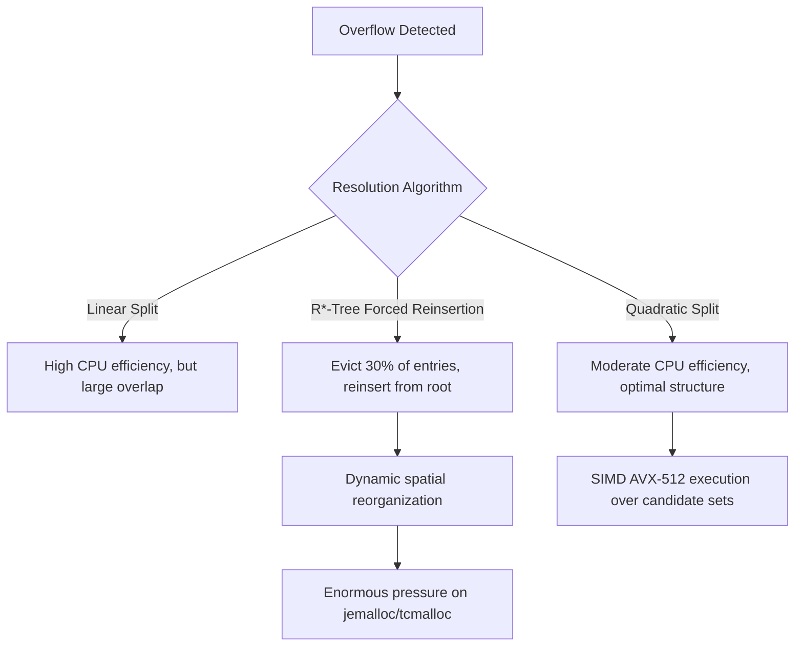

# R-Trees and Geohashes: How Spatial Data Structures Actually Work Under the Load

## Executive Summary (Overview)

Ten years ago spatial indexing was mostly a GIS specialty. Now it's a core requirement for anything from ride-hailing dispatch to IoT fleets to ad-tech targeting, and the data itself has gotten more complicated along the way — not just lat/lon pairs anymore, but trajectories, boundary polygons, and radius queries that need an answer in milliseconds. A plain B-Tree or LSM-Tree index simply doesn't have an answer for "what's near this point," and that gap is where spatial data structures earn their keep.

This piece looks closely at the two approaches that dominate production systems today: **R-Trees**, which build a nested hierarchy of bounding boxes, and **Geohashes**, which impose a static grid on the world using a space-filling curve. Rather than staying at the algorithm level, we'll trace how each interacts with CPU branch prediction and SIMD, with the L1/L2/L3 cache hierarchy, and with OS-level memory management — TLB misses, page faults, MVCC. We'll close with a hybrid pattern that shows up repeatedly in cloud data warehouses.

## Core Problem Statement

### Why a Single Ordering Doesn't Work

Relational databases like MySQL or PostgreSQL are built around one core assumption: you can put all your data into a single linear, lexicographic order. Spatial data breaks that assumption immediately. Points in $\mathbb{R}^n$ (2D or 3D space, typically) are inherently multi-dimensional and continuous, and there's no continuous bijective mapping from $\mathbb{R}^n$ down to $\mathbb{R}$ that preserves relative Euclidean distance. Try to flatten multi-dimensional coordinates into a single sortable key using a naive mapping, and spatial proximity falls apart — two points that are next to each other in the real world can end up far apart in your index.

### Where the CPU Starts to Struggle

Without a usable linear ordering, the system falls back on real geometric computation — ray-casting, winding-number tests, that kind of thing. At the CPU level this means a lot of matrix multiplication, slope calculations, and branch evaluation over double-precision floats, and none of it is free:

- **Branch mispredictions**: random datasets defeat the CPU's branch predictor often enough that pipeline flushes become routine, and each one costs 15-20 clock cycles.
- **Cache misses and the memory wall**: geometric data rarely fits neatly in cache, so random tree traversals rack up misses at every level — L1, L2, L3.
- **OS paging and TLB misses**: touching data that isn't resident forces a context switch from user space to kernel space, and execution speed drops off a cliff.

This is the actual reason spatial partitioning techniques exist — not academic elegance, but the fact that geometric computation at scale is genuinely expensive on real hardware.

## Deep Technical Knowledge / Internals

### R-Trees: Bounding Boxes and OS-Level Tuning

At its core, an R-Tree is a B-Tree adapted for spatial bounding. Every non-leaf node holds a list of $(I, \text{child\_pointer})$ tuples, where $I$ is a bounding box — the MBR, or Minimum Bounding Rectangle.

#### SIMD Pre-filtering and Dead Space

Intersection tests between two complex polygons get reduced to a much cheaper MBR intersection test, and that test is a natural fit for SIMD — AVX-2 or AVX-512 on Intel/AMD hardware compares batches of coordinates in a single clock cycle using YMM/ZMM registers.

The catch is "dead space": the empty area inside an MBR that doesn't actually belong to the enclosed shape. The bigger that dead space, the more false positives you get during the coarse filter pass, and each false positive means pulling the real underlying geometry back from an NVMe SSD via demand paging — which in turn means more TLB misses than you'd like.

#### Memory Alignment and OS Page Size

To keep I/O latency in check, R-Tree nodes are typically aligned to the OS page size (4KB is common, though 2MB or 1GB huge pages show up too), and node size is kept as a multiple of the cache-line size (64 bytes). A 2D MBR made of four doubles (32 bytes) plus an 8-byte pointer comes to 40 bytes, so a 4KB page holds roughly $M=100$ child entries. That kind of fan-out keeps the tree shallow — a billion records need only 4-5 levels, which caps you at about 5 random SSD I/Os per lookup.

#### Node Splits and Allocation Pressure

R*-Tree's defining feature is its Quadratic Split algorithm ($\mathcal{O}(M^2)$) combined with forced reinsertion. Forced reinsertion works something like a defragmentation pass: it pulls the 30% of entries farthest from the node's centroid and pushes them back up toward the root to be reinserted elsewhere. At the OS level this generates a steady churn of malloc/free calls, which is why production R-Tree implementations usually lean on allocators like `jemalloc` or `tcmalloc` rather than the system default — they handle short-lived heap allocations without fragmenting physical memory as badly.



```cpp
// Pseudocode for Hardware-Optimized R-Tree Node Split Evaluation in Modern C++
// Focuses on contiguous memory layouts, AVX alignment, and cache-line straddling avoidance.
#include <vector>
#include <algorithm>
#include <immintrin.h> // Intel AVX-512 Intrinsics

// Force strict alignment to 64-byte L1 Cache Line boundary to prevent false sharing
struct alignas(64) BoundingBox {
    double xmin, ymin, xmax, ymax;
};

class RTreeNode {
private:
    // Utilizing Structure-of-Arrays (SoA) for Data-Oriented Design (DoD)
    std::vector<BoundingBox> entries;
    std::vector<uint64_t> physical_pointers;
    bool is_leaf_node;

public:
    // SIMD-ready overlapping area determination
    inline double calculateGeometricOverlapCost(const BoundingBox& b1, const BoundingBox& b2) const {
        double dx = std::max(0.0, std::min(b1.xmax, b2.xmax) - std::max(b1.xmin, b2.xmin));
        double dy = std::max(0.0, std::min(b1.ymax, b2.ymax) - std::max(b1.ymin, b2.ymin));
        return dx * dy;
    }

    std::pair<RTreeNode, RTreeNode> splitNodeQuadratic(const BoundingBox& new_entry, uint64_t new_ptr) {
        constexpr int MAX_CAPACITY = 101; 
        
        // Matrix allocated contiguously within thread stack, bypassing heap lock
        alignas(64) double overlap_matrix[MAX_CAPACITY][MAX_CAPACITY];
        
        // Phase: Identifying the two most mutually disruptive seeds using loop unrolling
        // ... (Algorithmic implementation omitted for brevity)
        RTreeNode left_branch, right_branch;
        return {left_branch, right_branch};
    }
};
```

### Geohashes: Space-Filling Curves and the BMI2 Advantage

Where R-Trees restructure themselves dynamically, Geohashes commit to a static grid up front. Space gets carved into a hierarchical grid, and each cell's latitude/longitude is encoded as a Base32 string or a plain uint64.

#### Morton Encoding and Hardware Intrinsics

Geohashes rely on the Z-order (Peano-Morton) curve, which interleaves the bits of latitude and longitude. On modern hardware you don't even need to write the bit-interleaving loop yourself: the `PDEP` (Parallel Bits Deposit) instruction from Intel/AMD's BMI2 instruction set does the whole thing in hardware for roughly 3 clock cycles, with no branching at all.

```rust
// Advanced Rust Implementation for SIMD/BMI2 Optimized Geohash Morton Encoding
use std::arch::x86_64::_pdep_u64;

#[inline(always)] // Force compiler inlining
pub fn morton_encode_wgs84_bmi2(lat_normalized_bits: u32, lon_normalized_bits: u32) -> u64 {
    #[cfg(target_arch = "x86_64")]
    unsafe {
        // Parallel Bits Deposit: Scatter contiguous bits to masked destination 
        // 0x5555555555555555 = Odd bit placement mask
        let lon_scattered = _pdep_u64(lon_normalized_bits as u64, 0x5555555555555555);
        
        // 0xAAAAAAAAAAAAAAAA = Even bit placement mask
        let lat_scattered = _pdep_u64(lat_normalized_bits as u64, 0xAAAAAAAAAAAAAAAA);
        
        // Single cycle bitwise OR combines the interleaved components
        lon_scattered | lat_scattered
    }
}
```

#### Memory Locality and the Edge-Boundary Problem

The nice property of a Z-curve is that neighboring cells sharing a common Geohash prefix end up stored right next to each other — same DRAM page, or the same disk region in an LSM-Tree like Cassandra or RocksDB. What would otherwise be random I/O turns into a sequential scan, which means you actually get to use the 7000 MB/s an NVMe drive is capable of.

The tradeoff is what's usually called an edge-boundary anomaly. Two points a few centimeters apart, sitting right on either side of a grid line, can get completely different Geohash codes starting from the very first character. Working around this means querying a "9-box grid" around the target cell instead of a single prefix — what amounts to a multi-prefix resolution engine firing nine parallel lookups into the B+Tree. Get the prefix length wrong in one direction and false positives pile up; get it wrong in the other and the number of intersecting cells climbs into the tens of thousands, which then hammers the database's page-latch contention.

## Practical Applications & Case Studies

### Ride-Hailing Dispatch

Uber (whose H3 hexagonal grid is a well-known variant of this idea) and Lyft both pair Redis with Geohashes for driver matching. Millions of drivers push location updates every second, and storing the uint64 Geohash in a Redis Sorted Set (ZSET) lets a K-nearest-neighbor query interpolate every driver within a 5km radius in under 2 milliseconds.

### Cloud Data Warehouses

Snowflake and ClickHouse both lean on Geohash for sharding decisions. Instead of hashing rows randomly across nodes, they use Geohash combined with consistent hashing to keep geographically co-located data on the same cluster node — which cuts down on cross-NUMA and cross-switch network hops considerably.

### Concurrency in PostGIS

PostGIS builds its R-Tree support on top of GiST (Generalized Search Tree). Using read-copy-update and shadow paging, a write thread updating the MBR of a moving vehicle doesn't need to lock out concurrent readers — MVCC stays intact and ACID guarantees hold without read/write threads fighting each other.

## Lessons Learned

1. **Hardware constraints matter more than the textbook Big-O.** No spatial data structure performs well in production if you ignore cache-line size, OS page size, and what instruction sets like AVX-512 or BMI2 can actually do for you.
2. **R-Trees and Geohashes trade off precision against simplicity differently.** R-Trees spend real CPU and memory keeping themselves balanced, in exchange for tight bounding boxes and good I/O locality. Geohashes give up precision at grid boundaries but turn geometric computation into cheap string prefix matching.
3. **The hybrid approach keeps winning.** Modern cloud-native systems rarely commit to one structure end to end — Geohash for cluster-level sharding, R-Tree for local filtering inside each node's storage layer, is a pattern that shows up again and again at exabyte scale.

---
