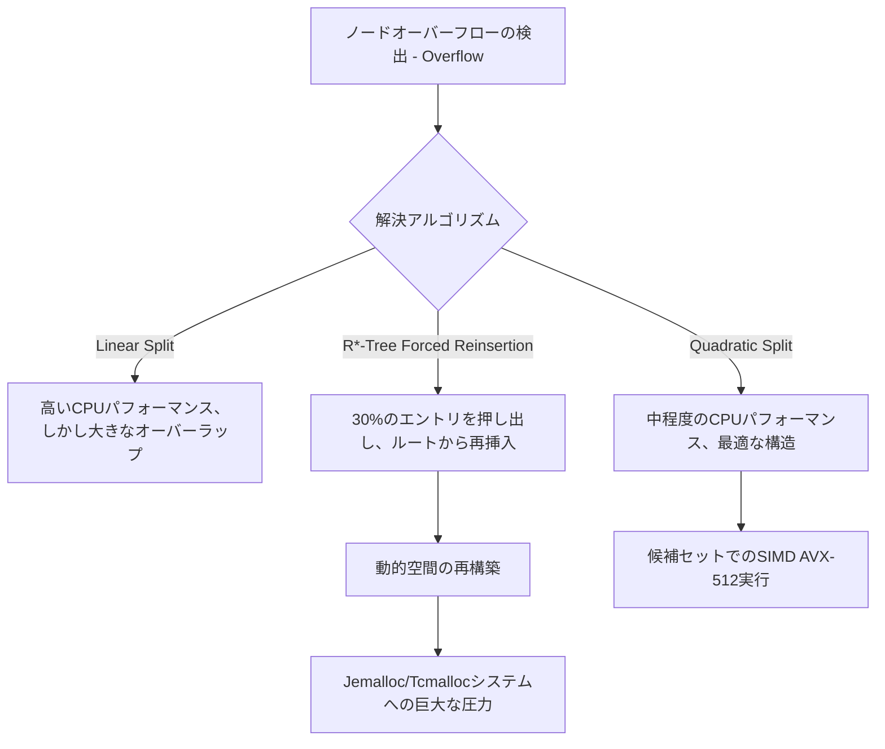

# R-TreeとGeohash:空間データ構造は実際どう動いているのか

## Executive Summary (概要)

10年前まで、位置情報インデックスはGIS界隈だけの話だった。今では配車アプリのディスパッチからIoTフリート管理、広告のターゲティングまで、あらゆる場面で必要になっている。しかも扱うデータ自体も複雑になっていて、単なる緯度経度のペアではなく、移動軌跡や境界ポリゴン、動的な半径検索まで求められる。従来のB-TreeやLSM-Treeのインデックスでは「この地点の近くに何があるか」という問いにそもそも答えられない。空間データ構造が必要になるのはまさにここだ。

このドキュメントでは、実運用で広く使われている二つのアプローチ——ネストした境界ボックスの階層で表現する**R-Tree**と、空間充填曲線で静的なグリッドを敷く**Geohash**——を詳しく見ていく。アルゴリズムの説明にとどまらず、それぞれがCPUの分岐予測やSIMD命令、L1/L2/L3キャッシュ階層、そしてTLBミスやページフォールト、MVCCといったOSレベルのメモリ管理とどう関わるかまで踏み込む。最後に、クラウドデータウェアハウスで繰り返し登場するハイブリッド構成についても触れる。

## Core Problem Statement (核心的な問題の提起)

### なぜ単一の順序付けでは足りないのか

MySQLやPostgreSQLのようなリレーショナルデータベースは、「全データを1次元の辞書式順序に並べられる」という前提の上に成り立っている。空間データはこの前提を根本から崩す。$\mathbb{R}^n$(通常は2Dまたは3D空間)上の点は本質的に多次元かつ連続であり、相対的なユークリッド距離を保ったまま$\mathbb{R}^n$から$\mathbb{R}$へ写す連続な全単射は存在しない。単純な写像で多次元座標を1つのソート可能なキーに押し込めば、現実世界では隣り合っている2点がインデックス上ではまったく離れた場所に置かれてしまう——空間的な近接性が壊れるということだ。

### CPUが苦しくなるポイント

使える線形順序がない以上、システムはレイキャストや巻き数判定のような本物の幾何計算に頼らざるを得ない。CPUレベルではこれは大量の行列演算、傾きの計算、倍精度浮動小数点での分岐評価を意味し、どれもタダでは済まない。

- **分岐予測ミス:** ランダムなデータセットではCPUの分岐予測器がしばしば外れ、パイプラインフラッシュが日常的に発生する。1回あたり15〜20クロックサイクルのコストがかかる。
- **キャッシュミスとメモリウォール:** 幾何データはキャッシュにきれいに収まらないことが多く、ランダムな木の走査はL1/L2/L3のあらゆる階層でミスを積み重ねる。
- **OSのページングとTLBミス:** メモリに常駐していないデータに触れると、ユーザー空間からカーネル空間へのコンテキストスイッチが発生し、実行速度は一気に落ち込む。

空間分割の技術が存在する理由は、学術的な洗練さのためではなく、大規模な幾何計算が実際のハードウェア上で本当にコストがかかるからだ。

## Deep Technical Knowledge / Internals (詳細な技術知識)

### R-Tree:境界ボックスとOSレベルのチューニング

R-Treeの本質は、空間的な境界を扱えるように拡張されたB-Treeだ。すべての非リーフノードは$(I, \text{child\_pointer})$というタプルのリストを持ち、$I$はMBR(Minimum Bounding Rectangle、最小外接矩形)と呼ばれる境界ボックスである。

**SIMDによる事前フィルタリングとデッドスペース:**

複雑な二つのポリゴン同士の交差判定は、もっと安価なMBR同士の交差判定に置き換えられる。この判定はSIMDと相性がよく、Intel/AMDのAVX-2やAVX-512を使えば、YMM/ZMMレジスタで複数の座標を1クロックサイクルでまとめて比較できる。

問題は「デッドスペース」だ。MBRの内側にあるが実際の図形には属さない空白領域のことで、これが大きいほど粗いフィルタ段階での偽陽性が増える。偽陽性が出るたびに、デマンドページングでNVMe SSDから実際の幾何データを引っ張ってくる必要があり、それがTLBミスを増やす原因になる。

**メモリアライメントとOSページサイズ:**

I/Oレイテンシを抑えるため、R-Treeのノードは通常OSページサイズ(4KBが一般的、2MBや1GBのHuge Pagesも使われる)に合わせて調整され、ノードサイズはキャッシュラインサイズ(64バイト)の倍数に保たれる。2DのMBRはdouble4つ(32バイト)+8バイトのポインタで40バイトになるので、4KBページには約$M=100$個の子エントリが収まる。このファンアウトの大きさのおかげで木は非常に浅くなり、10億件のレコードでも4〜5層で済み、1回の検索で必要なランダムSSD I/Oは最大でも5回程度に抑えられる。

**ノード分割と動的割り当ての負荷:**

R*-Treeの特徴は、Quadratic Split($\mathcal{O}(M^2)$)アルゴリズムと「強制再挿入」だ。強制再挿入は一種のデフラグ処理のようなもので、重心から最も遠い30%のエントリを取り出し、ルートまで押し戻して再挿入する。OSレベルではこれが激しいmalloc/freeの繰り返しを生むため、実運用のR-Tree実装では`jemalloc`や`tcmalloc`のような、短命なヒープ割り当てを物理的な断片化を抑えつつ処理できるアロケータが選ばれることが多い。



```cpp
// Pseudocode for Hardware-Optimized R-Tree Node Split Evaluation in Modern C++
// Focuses on contiguous memory layouts, AVX alignment, and cache-line straddling avoidance.
#include <vector>
#include <algorithm>
#include <immintrin.h> // Intel AVX-512 Intrinsics

// Force strict alignment to 64-byte L1 Cache Line boundary to prevent false sharing
struct alignas(64) BoundingBox {
    double xmin, ymin, xmax, ymax;
};

class RTreeNode {
private:
    // Utilizing Structure-of-Arrays (SoA) for Data-Oriented Design (DoD)
    std::vector<BoundingBox> entries;
    std::vector<uint64_t> physical_pointers;
    bool is_leaf_node;

public:
    // SIMD-ready overlapping area determination
    inline double calculateGeometricOverlapCost(const BoundingBox& b1, const BoundingBox& b2) const {
        double dx = std::max(0.0, std::min(b1.xmax, b2.xmax) - std::max(b1.xmin, b2.xmin));
        double dy = std::max(0.0, std::min(b1.ymax, b2.ymax) - std::max(b1.ymin, b2.ymin));
        return dx * dy;
    }

    std::pair<RTreeNode, RTreeNode> splitNodeQuadratic(const BoundingBox& new_entry, uint64_t new_ptr) {
        constexpr int MAX_CAPACITY = 101; 
        
        // Matrix allocated contiguously within thread stack, bypassing heap lock
        alignas(64) double overlap_matrix[MAX_CAPACITY][MAX_CAPACITY];
        
        // Phase: Identifying the two most mutually disruptive seeds using loop unrolling
        // ... (Algorithmic implementation omitted for brevity)
        RTreeNode left_branch, right_branch;
        return {left_branch, right_branch};
    }
};
```

### Geohash:空間充填曲線とBMI2の恩恵

R-Treeが自身を動的に再構成し続けるのに対し、Geohashは最初から静的なグリッドにコミットする。空間は階層的なグリッドに分割され、各セルの緯度経度はBase32文字列か単純なuint64として符号化される。

**Morton符号化とハードウェア組み込み関数:**

Geohashは緯度と経度のビットを交互に並べるZ-order曲線(Peano-Morton曲線)を使う。最近のハードウェアでは、このビットインターリーブのループを自分で書く必要すらない。Intel/AMDのBMI2命令セットにある`PDEP`(Parallel Bits Deposit)命令が、分岐を一切使わずハードウェア上でおよそ3クロックサイクルで処理してくれる。

```rust
// Advanced Rust Implementation for SIMD/BMI2 Optimized Geohash Morton Encoding
use std::arch::x86_64::_pdep_u64;

#[inline(always)] // Force compiler inlining
pub fn morton_encode_wgs84_bmi2(lat_normalized_bits: u32, lon_normalized_bits: u32) -> u64 {
    #[cfg(target_arch = "x86_64")]
    unsafe {
        // Parallel Bits Deposit: Scatter contiguous bits to masked destination 
        // 0x5555555555555555 = Odd bit placement mask
        let lon_scattered = _pdep_u64(lon_normalized_bits as u64, 0x5555555555555555);
        
        // 0xAAAAAAAAAAAAAAAA = Even bit placement mask
        let lat_scattered = _pdep_u64(lat_normalized_bits as u64, 0xAAAAAAAAAAAAAAAA);
        
        // Single cycle bitwise OR combines the interleaved components
        lon_scattered | lat_scattered
    }
}
```

**メモリ局所性と境界問題:**

Z曲線の良いところは、同じGeohashプレフィックスを共有する近隣セルが物理的にも隣接して保存されることだ——同じDRAMページ、あるいはCassandraやRocksDBのようなLSM-Treeの同じディスク領域に収まる。本来ならランダムI/Oになるはずのアクセスがシーケンシャルスキャンに変わり、NVMeドライブの7000MB/sという帯域を実際に使い切れるようになる。

その代償が「境界異常」と呼ばれる問題だ。グリッド境界を挟んで数センチしか離れていない2点が、最初の文字から全く異なるGeohashコードになってしまう。これに対処するには、単一のプレフィックスではなく対象セルの周囲「9マス」をまとめてクエリする必要がある。いわゆるMulti-Prefix Resolution Engineが、B+Treeに対して9つの並列ルックアップを同時に発行する仕組みだ。プレフィックスを短く取りすぎれば偽陽性が増え、長く取りすぎれば交差するセル数が数万に達し、データベースのページラッチ競合を悪化させる。

## Practical Applications & Case Studies (実際の応用とケーススタディ)

### 配車サービスのディスパッチ

Uber(H3という六角形グリッドで知られる)やLyftは、RedisとGeohashを組み合わせてドライバーのマッチングを行っている。数百万人のドライバーが毎秒位置情報を送信し、uint64のGeohashをRedisのSorted Set(ZSET)に格納することで、半径5km以内のドライバーを2ミリ秒未満でK近傍検索できる。

### クラウドデータウェアハウス

SnowflakeやClickHouseは、シャーディングの判断にGeohashを活用している。行をランダムにハッシュ分散させる代わりに、Geohashとコンシステントハッシングを組み合わせて地理的に近いデータを同じクラスターノードにまとめ、NUMAをまたぐ、あるいはスイッチをまたぐネットワークホップを大幅に減らしている。

### PostGISでの並行性制御

PostGISはGiST(Generalized Search Tree)の上にR-Treeのサポートを構築している。Read-Copy-Updateとシャドウページングを使うことで、移動中の車両のMBRを更新する書き込みスレッドが、同時に走る読み取りスレッドをブロックする必要がなくなり、MVCCとACID特性を両立させている。

## Lessons Learned (得られた教訓)

1. **理論上のBig-Oよりハードウェアの制約の方が効く:** キャッシュラインのサイズ、OSのページサイズ、AVX-512やBMI2のような命令セットが実際に何をしてくれるかを無視した空間データ構造は、本番環境ではまず性能が出ない。
2. **R-TreeとGeohashはトレードオフの方向性が違う:** R-Treeは自身のバランスを保つためにCPUとメモリを実際に消費するが、その代わりタイトな境界ボックスと良好なI/O局所性が得られる。Geohashはグリッド境界での精度を犠牲にする代わりに、幾何計算を安価な文字列プレフィックスマッチングに変えてしまう。
3. **ハイブリッド構成が結局勝つ:** クラウドネイティブなシステムは、最初から最後まで単一の構造に頼ることは少ない。クラスター全体のシャーディングにはGeohash、各ノードのストレージ層でのローカルフィルタリングにはR-Treeという組み合わせは、エクサバイト級のシステムで何度も見られるパターンだ。

---
