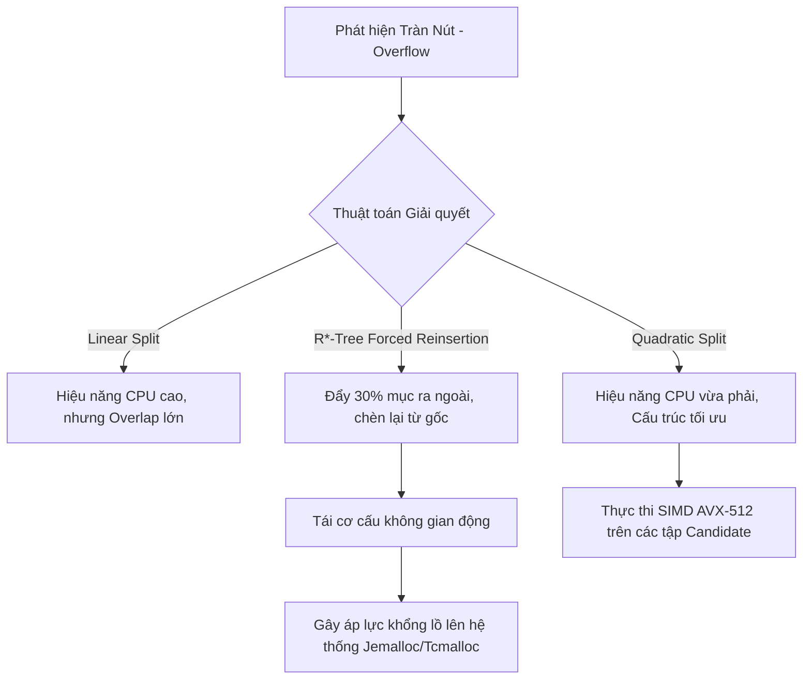

# R-Tree và Geohash: Cấu trúc dữ liệu không gian vận hành thế nào trong thực tế

## Executive Summary (Tóm tắt)

Mười năm trước, lập chỉ mục không gian gần như chỉ là chuyện của dân GIS. Giờ đây nó là yêu cầu cốt lõi cho đủ loại hệ thống, từ điều phối xe công nghệ đến quản lý đội thiết bị IoT hay nhắm mục tiêu quảng cáo, và bản thân dữ liệu cũng phức tạp hơn nhiều - không chỉ còn là cặp vĩ độ/kinh độ mà còn có quỹ đạo di chuyển, đa giác ranh giới, và truy vấn bán kính cần trả lời trong vài mili giây. Một chỉ mục B-Tree hay LSM-Tree thông thường không trả lời được câu hỏi "cái gì gần điểm này", và đó chính là khoảng trống mà cấu trúc dữ liệu không gian lấp đầy.

Bài viết này tập trung vào hai cách tiếp cận phổ biến nhất trong các hệ thống thực tế hiện nay: **R-Tree**, xây dựng một cây phân cấp lồng nhau của các hộp bao (bounding box), và **Geohash**, áp một lưới tĩnh lên bề mặt không gian bằng đường cong lấp đầy không gian. Thay vì chỉ dừng ở mức thuật toán, chúng ta sẽ xem mỗi cấu trúc tương tác thế nào với dự đoán rẽ nhánh và SIMD của CPU, với hệ thống cache L1/L2/L3, và với cơ chế quản lý bộ nhớ của hệ điều hành - TLB miss, page fault, MVCC. Phần cuối sẽ nói về mô hình lai vẫn thường xuất hiện trong các kho dữ liệu đám mây.

## Core Problem Statement (Vấn đề cốt lõi)

### Vì sao một thứ tự tuyến tính duy nhất không đủ dùng

Các cơ sở dữ liệu quan hệ như MySQL hay PostgreSQL được xây dựng dựa trên một giả định cốt lõi: có thể sắp toàn bộ dữ liệu vào một thứ tự tuyến tính, kiểu từ điển. Dữ liệu không gian phá vỡ giả định đó ngay lập tức. Các điểm trong $\mathbb{R}^n$ (thường là không gian 2D hoặc 3D) vốn đa chiều và liên tục, và không tồn tại ánh xạ song ánh liên tục nào từ $\mathbb{R}^n$ xuống $\mathbb{R}$ mà vẫn giữ nguyên khoảng cách Euclidean tương đối. Nếu cố ép tọa độ đa chiều vào một khóa sắp xếp được bằng một phép ánh xạ ngây thơ, tính lân cận không gian sẽ vỡ vụn - hai điểm gần nhau ngoài đời có thể nằm cách xa nhau trong chỉ mục.

### CPU bắt đầu gặp khó ở đâu

Không có thứ tự tuyến tính khả dụng, hệ thống buộc phải quay về các phép tính hình học thực sự - ray-casting, kiểm tra winding number, và tương tự. Ở cấp CPU, điều này kéo theo rất nhiều phép nhân ma trận, tính độ dốc, và đánh giá rẽ nhánh trên số thực dấu phẩy động độ chính xác kép - và không cái nào miễn phí cả.

- **Dự đoán rẽ nhánh sai:** với dữ liệu ngẫu nhiên, bộ dự đoán rẽ nhánh của CPU đoán sai đủ thường xuyên để việc xả pipeline trở thành chuyện thường ngày, mỗi lần tốn 15-20 chu kỳ xung nhịp.
- **Cache miss và bức tường bộ nhớ:** dữ liệu hình học hiếm khi vừa gọn trong cache, nên việc duyệt cây một cách ngẫu nhiên tích lũy miss ở mọi tầng - L1, L2, L3.
- **Page fault và TLB miss của hệ điều hành:** chạm vào dữ liệu không nằm sẵn trong bộ nhớ buộc phải chuyển ngữ cảnh từ user space sang kernel space, và tốc độ thực thi giảm mạnh.

Đây mới là lý do thực sự khiến các kỹ thuật phân hoạch không gian ra đời - không phải vì sự tinh tế học thuật, mà vì tính toán hình học ở quy mô lớn thực sự tốn kém trên phần cứng thật.

## Deep Technical Knowledge / Internals (Kiến thức kỹ thuật chuyên sâu)

### R-Tree: hộp bao và tinh chỉnh ở tầng hệ điều hành

Về bản chất, R-Tree là một B-Tree được điều chỉnh để phù hợp với việc bao đóng không gian. Mỗi nút không phải lá quản lý một danh sách các tuple $(I, \text{child\_pointer})$, trong đó $I$ là MBR (Minimum Bounding Rectangle) - hộp bao nhỏ nhất.

**Lọc trước bằng SIMD và vấn đề không gian chết:**

Phép kiểm tra giao cắt giữa hai đa giác phức tạp được rút gọn thành phép kiểm tra giao cắt MBR rẻ hơn nhiều, và phép kiểm tra này rất hợp với SIMD - AVX-2 hay AVX-512 trên phần cứng Intel/AMD có thể so sánh hàng loạt tọa độ trong một chu kỳ xung nhịp bằng thanh ghi YMM/ZMM.

Vấn đề nằm ở "không gian chết" - phần diện tích rỗng bên trong MBR nhưng không thuộc về hình dạng thực sự bên trong. Không gian chết càng lớn, số dương tính giả ở bước lọc thô càng nhiều, và mỗi dương tính giả đồng nghĩa với việc phải kéo dữ liệu hình học thật từ SSD NVMe qua demand paging - kéo theo nhiều TLB miss hơn mức mong muốn.

**Căn chỉnh bộ nhớ và kích thước trang của hệ điều hành:**

Để giữ độ trễ I/O trong tầm kiểm soát, các nút R-Tree thường được căn theo kích thước trang của hệ điều hành (phổ biến là 4KB, dù 2MB hay 1GB huge page cũng được dùng), và kích thước nút được giữ là bội số của kích thước cache line (64 byte). Một MBR 2D gồm bốn số double (32 byte) cộng một con trỏ 8 byte là 40 byte, nên một trang 4KB chứa được khoảng $M=100$ mục con. Fan-out lớn như vậy giữ cho cây rất nông - một tỷ bản ghi chỉ cần 4-5 tầng, tức tối đa khoảng 5 lần I/O ngẫu nhiên trên SSD cho mỗi lần tra cứu.

**Tách nút và áp lực cấp phát bộ nhớ:**

Đặc trưng của R*-Tree là thuật toán Quadratic Split ($\mathcal{O}(M^2)$) kết hợp với "tái chèn ép buộc". Tái chèn ép buộc hoạt động giống một tiến trình dọn dẹp phân mảnh: lấy ra 30% các mục xa trọng tâm nhất của nút và đẩy chúng ngược lên gốc để chèn lại ở nơi khác. Ở tầng hệ điều hành, việc này tạo ra một chu kỳ malloc/free liên tục, đó là lý do các triển khai R-Tree trong thực tế thường dùng bộ cấp phát như `jemalloc` hay `tcmalloc` thay vì bộ cấp phát mặc định - chúng xử lý tốt các lần cấp phát heap ngắn hạn mà không gây phân mảnh vật lý nghiêm trọng.



```cpp
// Pseudocode for Hardware-Optimized R-Tree Node Split Evaluation in Modern C++
// Focuses on contiguous memory layouts, AVX alignment, and cache-line straddling avoidance.
#include <vector>
#include <algorithm>
#include <immintrin.h> // Intel AVX-512 Intrinsics

// Force strict alignment to 64-byte L1 Cache Line boundary to prevent false sharing
struct alignas(64) BoundingBox {
    double xmin, ymin, xmax, ymax;
};

class RTreeNode {
private:
    // Utilizing Structure-of-Arrays (SoA) for Data-Oriented Design (DoD)
    std::vector<BoundingBox> entries;
    std::vector<uint64_t> physical_pointers;
    bool is_leaf_node;

public:
    // SIMD-ready overlapping area determination
    inline double calculateGeometricOverlapCost(const BoundingBox& b1, const BoundingBox& b2) const {
        double dx = std::max(0.0, std::min(b1.xmax, b2.xmax) - std::max(b1.xmin, b2.xmin));
        double dy = std::max(0.0, std::min(b1.ymax, b2.ymax) - std::max(b1.ymin, b2.ymin));
        return dx * dy;
    }

    std::pair<RTreeNode, RTreeNode> splitNodeQuadratic(const BoundingBox& new_entry, uint64_t new_ptr) {
        constexpr int MAX_CAPACITY = 101; 
        
        // Matrix allocated contiguously within thread stack, bypassing heap lock
        alignas(64) double overlap_matrix[MAX_CAPACITY][MAX_CAPACITY];
        
        // Phase: Identifying the two most mutually disruptive seeds using loop unrolling
        // ... (Algorithmic implementation omitted for brevity)
        RTreeNode left_branch, right_branch;
        return {left_branch, right_branch};
    }
};
```

### Geohash: đường cong lấp đầy không gian và lợi thế từ BMI2

Nếu R-Tree liên tục tự tái cấu trúc, Geohash lại cam kết với một lưới tĩnh ngay từ đầu. Không gian được chia thành lưới phân cấp, và mỗi ô được mã hóa vĩ độ/kinh độ thành chuỗi Base32 hoặc đơn giản là một uint64.

**Mã hóa Morton và các chỉ thị phần cứng chuyên dụng:**

Geohash dựa vào đường cong Z-order (Peano-Morton), xen kẽ các bit của vĩ độ và kinh độ. Trên phần cứng hiện đại, ta thậm chí không cần tự viết vòng lặp xen bit: chỉ thị `PDEP` (Parallel Bits Deposit) trong tập lệnh BMI2 của Intel/AMD làm toàn bộ việc này bằng phần cứng chỉ trong khoảng 3 chu kỳ xung nhịp, không cần rẽ nhánh.

```rust
// Advanced Rust Implementation for SIMD/BMI2 Optimized Geohash Morton Encoding
use std::arch::x86_64::_pdep_u64;

#[inline(always)] // Force compiler inlining
pub fn morton_encode_wgs84_bmi2(lat_normalized_bits: u32, lon_normalized_bits: u32) -> u64 {
    #[cfg(target_arch = "x86_64")]
    unsafe {
        // Parallel Bits Deposit: Scatter contiguous bits to masked destination 
        // 0x5555555555555555 = Odd bit placement mask
        let lon_scattered = _pdep_u64(lon_normalized_bits as u64, 0x5555555555555555);
        
        // 0xAAAAAAAAAAAAAAAA = Even bit placement mask
        let lat_scattered = _pdep_u64(lat_normalized_bits as u64, 0xAAAAAAAAAAAAAAAA);
        
        // Single cycle bitwise OR combines the interleaved components
        lon_scattered | lat_scattered
    }
}
```

**Tính cục bộ bộ nhớ và vấn đề ranh giới ô lưới:**

Điểm hay của đường cong Z là các ô lân cận có chung tiền tố Geohash sẽ được lưu ngay cạnh nhau về mặt vật lý - cùng trang DRAM, hoặc cùng vùng đĩa trong một LSM-Tree như Cassandra hay RocksDB. Thứ đáng lẽ là I/O ngẫu nhiên trở thành quét tuần tự, cho phép tận dụng thực sự băng thông 7000 MB/s mà một ổ NVMe có thể cung cấp.

Cái giá phải trả là hiện tượng thường gọi là "dị thường ranh giới". Hai điểm cách nhau vài centimet, nằm ngay hai bên của một đường ranh giới lưới, có thể nhận mã Geohash hoàn toàn khác nhau ngay từ ký tự đầu tiên. Cách xử lý là truy vấn cả "khung 9 ô" xung quanh ô mục tiêu thay vì chỉ một tiền tố duy nhất - về bản chất là một engine đa tiền tố bắn ra chín truy vấn song song vào B+Tree. Chọn tiền tố quá ngắn thì dương tính giả tràn lan; chọn quá dài thì số ô giao nhau lên tới hàng chục nghìn, gây áp lực nặng lên tranh chấp page-latch của cơ sở dữ liệu.

## Practical Applications & Case Studies (Ứng dụng thực tế)

### Điều phối xe công nghệ

Uber (nổi tiếng với lưới lục giác H3, một biến thể của ý tưởng này) và Lyft đều kết hợp Redis với Geohash để ghép tài xế với khách. Hàng triệu tài xế gửi cập nhật vị trí mỗi giây, và việc lưu Geohash dạng uint64 trong Redis Sorted Set (ZSET) cho phép truy vấn K-láng-giềng-gần-nhất nội suy toàn bộ tài xế trong bán kính 5km chỉ trong chưa đầy 2 mili giây.

### Kho dữ liệu đám mây

Snowflake và ClickHouse đều dựa vào Geohash cho quyết định sharding. Thay vì băm ngẫu nhiên các dòng dữ liệu ra các node, họ dùng Geohash kết hợp consistent hashing để giữ dữ liệu cùng khu vực địa lý trên cùng một node cụm, giảm đáng kể số lần nhảy mạng xuyên NUMA hoặc xuyên switch.

### Xử lý đồng thời trong PostGIS

PostGIS xây dựng phần hỗ trợ R-Tree trên nền GiST (Generalized Search Tree). Bằng cách dùng read-copy-update và shadow paging, một thread ghi cập nhật MBR của một chiếc xe đang di chuyển không cần khóa các thread đọc đang chạy song song - MVCC vẫn nguyên vẹn và các đảm bảo ACID vẫn được giữ mà không có tranh chấp đọc/ghi.

## Lessons Learned (Bài học rút ra)

1. **Giới hạn phần cứng quan trọng hơn Big-O trên lý thuyết:** không cấu trúc dữ liệu không gian nào hoạt động tốt trong thực tế nếu bỏ qua kích thước cache line, kích thước trang bộ nhớ của hệ điều hành, và những gì tập lệnh như AVX-512 hay BMI2 thực sự có thể làm.
2. **R-Tree và Geohash đánh đổi độ chính xác theo hai hướng khác nhau:** R-Tree tốn CPU và bộ nhớ thật để tự cân bằng, đổi lại có hộp bao chặt và tính cục bộ I/O tốt. Geohash hy sinh độ chính xác ở ranh giới ô lưới, nhưng biến phép tính hình học thành so khớp tiền tố chuỗi rẻ tiền.
3. **Mô hình lai vẫn luôn thắng thế:** các hệ thống cloud-native hiện đại hiếm khi chỉ dùng một cấu trúc từ đầu đến cuối - Geohash cho việc sharding ở cấp cụm, R-Tree cho lọc cục bộ trong tầng lưu trữ của từng node, là mô hình xuất hiện lặp đi lặp lại ở quy mô exabyte.

---
