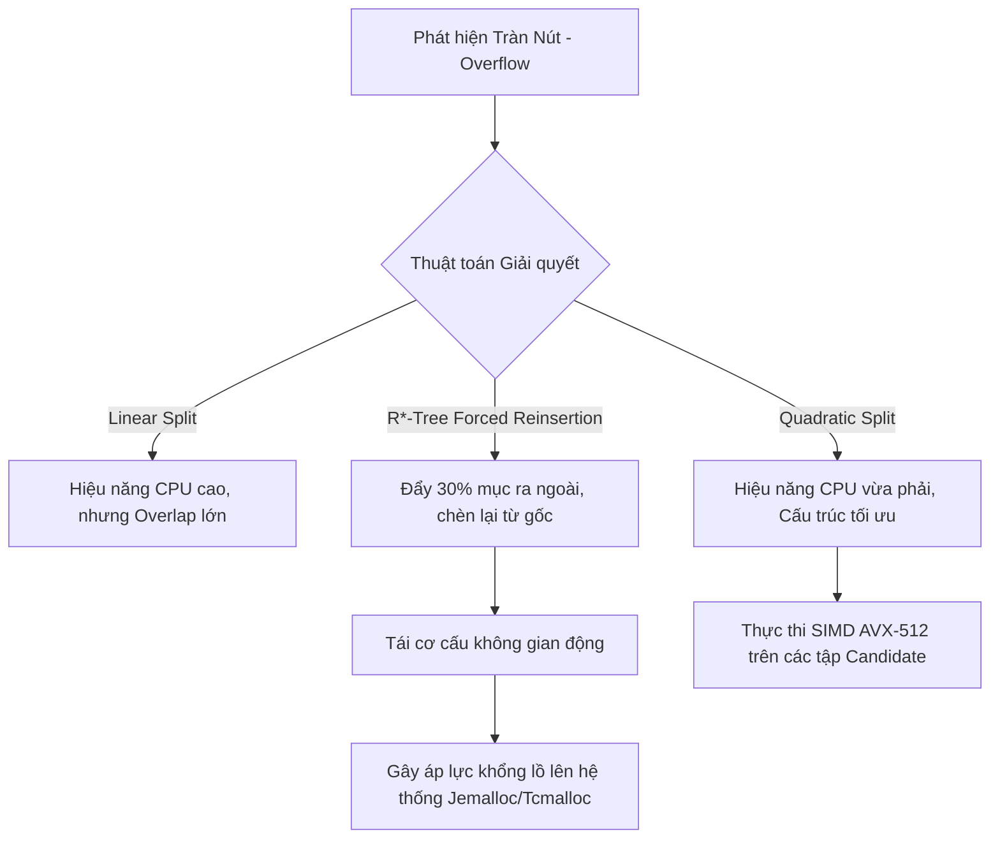

# Chỉ mục không gian trong thực tế: R-Tree, Geohash và bài toán tìm kiếm theo vị trí

## Executive Summary (Tóm tắt)

Không lâu trước đây, việc lập chỉ mục không gian gần như chỉ nằm trong phạm vi các hệ thống GIS chuyên dụng. Giờ nó đã trở thành một phần bắt buộc của rất nhiều hệ thống - từ điều phối xe công nghệ, quản lý thiết bị IoT, cho tới nhắm mục tiêu quảng cáo theo vị trí. Dữ liệu vị trí bây giờ cũng phức tạp hơn nhiều so với một cặp tọa độ đơn giản: nó bao gồm cả chuỗi quỹ đạo theo thời gian, đa giác mô tả ranh giới khu vực, và các truy vấn bán kính cần trả lời gần như tức thì. Một chỉ mục B-Tree hay LSM-Tree tiêu chuẩn không giải quyết được câu hỏi "cái gì đang ở gần điểm này" - và đó là lý do các cấu trúc chỉ mục không gian tồn tại.

Bài viết này đi sâu vào hai cách tiếp cận phổ biến nhất cho bài toán này: **R-Tree**, dựa trên một cây phân cấp các hộp bao lồng nhau, và **Geohash**, áp đặt một lưới tĩnh lên không gian bằng đường cong lấp đầy không gian. Thay vì chỉ dừng ở góc độ thuật toán, chúng ta sẽ xem xét cách mỗi cấu trúc tương tác với dự đoán rẽ nhánh và tập lệnh SIMD của CPU, với phân cấp cache L1/L2/L3, và với cơ chế quản lý bộ nhớ của hệ điều hành như TLB miss, page fault, hay MVCC. Phần cuối sẽ giới thiệu mô hình lai vẫn thường xuất hiện trong các kho dữ liệu đám mây hiện đại.

## Core Problem Statement (Vấn đề cốt lõi)

### Vì sao thứ tự tuyến tính không giải quyết được bài toán không gian

Các hệ quản trị cơ sở dữ liệu quan hệ như MySQL hay PostgreSQL được tối ưu dựa trên một tiền đề: có thể sắp toàn bộ dữ liệu theo một thứ tự từ điển, tuyến tính, một chiều. Dữ liệu không gian phá vỡ tiền đề này ngay từ đầu. Các điểm trong không gian $\mathbb{R}^n$ (thường là 2D hoặc 3D) mang bản chất đa chiều và liên tục, và không hề tồn tại một ánh xạ song ánh liên tục nào từ $\mathbb{R}^n$ sang $\mathbb{R}$ có thể giữ nguyên khoảng cách Euclidean tương đối. Khi cố gắng ép dữ liệu đa chiều vào một cấu trúc một chiều bằng ánh xạ đơn giản, tính lân cận không gian sẽ bị phá vỡ hoàn toàn - hai điểm gần nhau trong thực tế có thể nằm cách xa nhau trong chỉ mục.

### Những điểm khiến CPU chậm lại

Thiếu một thứ tự tuyến tính khả dụng, hệ thống buộc phải dựa vào các phép toán hình học thực sự như ray-casting hay kiểm tra winding number. Ở tầng CPU, điều này đồng nghĩa với khối lượng lớn phép nhân ma trận, tính độ dốc, và đánh giá rẽ nhánh trên số dấu phẩy động độ chính xác kép.

- **Dự đoán rẽ nhánh sai:** với dữ liệu ngẫu nhiên, bộ dự đoán rẽ nhánh của CPU thường xuyên đoán trật, khiến việc xả pipeline diễn ra liên tục, mỗi lần tốn 15-20 chu kỳ xung nhịp.
- **Cache miss và bức tường bộ nhớ:** dữ liệu hình học phức tạp hiếm khi vừa gọn trong cache, nên việc duyệt cây theo kiểu ngẫu nhiên gây ra cache miss dồn dập ở mọi tầng L1, L2, L3.
- **Page fault và TLB miss:** truy cập dữ liệu không nằm sẵn trong bộ nhớ buộc CPU chuyển ngữ cảnh từ user space sang kernel space, kéo tốc độ thực thi giảm mạnh.

Đây chính là lý do thực sự các kỹ thuật phân hoạch không gian ra đời, chứ không phải vì lý thuyết đẹp đẽ trên giấy - tính toán hình học ở quy mô lớn thực sự tốn kém trên phần cứng thật.

## Deep Technical Knowledge / Internals (Kiến thức kỹ thuật chuyên sâu)

### R-Tree: nghệ thuật bao đóng và tinh chỉnh ở tầng hệ điều hành

R-Tree về bản chất là một B-Tree được điều chỉnh cho phù hợp với nguyên lý bao đóng không gian. Mỗi nút không phải nút lá quản lý một danh sách các tuple $(I, \text{child\_pointer})$, trong đó $I$ là MBR (Minimum Bounding Rectangle) - hộp bao nhỏ nhất chứa dữ liệu.

**Lọc trước bằng SIMD và vấn đề không gian chết:**

Phép kiểm tra giao cắt giữa hai đa giác lớn được rút gọn thành phép kiểm tra giao cắt MBR đơn giản hơn nhiều. Bước này tận dụng rất tốt các tập lệnh SIMD như AVX-2 hay AVX-512 trên Intel/AMD, cho phép CPU so sánh song song hàng loạt tọa độ chỉ trong một chu kỳ xung nhịp bằng thanh ghi YMM/ZMM.

Điểm bất lợi là "không gian chết" - phần diện tích rỗng nằm trong MBR nhưng không thuộc về hình dạng thực. Không gian chết càng lớn, tỷ lệ dương tính giả ở bước lọc càng cao, và mỗi lần dương tính giả nghĩa là phải kéo dữ liệu hình học gốc từ SSD NVMe qua cơ chế demand paging, kéo theo số lần TLB miss tăng lên.

**Căn chỉnh bộ nhớ và kích thước trang hệ điều hành:**

Để hạn chế độ trễ I/O, các nút của R-Tree thường được căn chỉnh theo kích thước trang bộ nhớ của hệ điều hành (phổ biến nhất là 4KB, dù huge page 2MB hay 1GB cũng được dùng), và kích thước nút được giữ là bội số của kích thước cache line (64 byte). Một MBR 2D gồm bốn số double (32 byte) cộng thêm một con trỏ 8 byte, tổng cộng 40 byte - nghĩa là một trang 4KB chứa được khoảng $M=100$ mục con. Fan-out lớn như vậy giữ cho cây rất nông: một tỷ bản ghi chỉ cần 4-5 tầng, tương ứng với tối đa khoảng 5 lần truy cập ngẫu nhiên trên SSD cho mỗi lần tra cứu.

**Tách nút và áp lực cấp phát bộ nhớ động:**

Điểm khác biệt của R*-Tree nằm ở thuật toán Quadratic Split ($\mathcal{O}(M^2)$) kết hợp với kỹ thuật "tái chèn ép buộc". Tái chèn ép buộc hoạt động tương tự một tiến trình dọn dẹp phân mảnh: nó lấy ra 30% các mục xa trọng tâm nhất trong nút và đẩy ngược chúng lên gốc để chèn lại ở vị trí khác. Ở tầng hệ điều hành, việc này tạo ra một chu kỳ malloc/free liên tục, đó là lý do các bản triển khai R-Tree trong thực tế thường ưu tiên các bộ cấp phát như `jemalloc` hay `tcmalloc` thay vì bộ cấp phát mặc định - chúng xử lý tốt hơn các lần cấp phát heap ngắn hạn mà không gây phân mảnh vật lý nghiêm trọng theo thời gian.



```cpp
// Pseudocode for Hardware-Optimized R-Tree Node Split Evaluation in Modern C++
// Focuses on contiguous memory layouts, AVX alignment, and cache-line straddling avoidance.
#include <vector>
#include <algorithm>
#include <immintrin.h> // Intel AVX-512 Intrinsics

// Force strict alignment to 64-byte L1 Cache Line boundary to prevent false sharing
struct alignas(64) BoundingBox {
    double xmin, ymin, xmax, ymax;
};

class RTreeNode {
private:
    // Utilizing Structure-of-Arrays (SoA) for Data-Oriented Design (DoD)
    std::vector<BoundingBox> entries;
    std::vector<uint64_t> physical_pointers;
    bool is_leaf_node;

public:
    // SIMD-ready overlapping area determination
    inline double calculateGeometricOverlapCost(const BoundingBox& b1, const BoundingBox& b2) const {
        double dx = std::max(0.0, std::min(b1.xmax, b2.xmax) - std::max(b1.xmin, b2.xmin));
        double dy = std::max(0.0, std::min(b1.ymax, b2.ymax) - std::max(b1.ymin, b2.ymin));
        return dx * dy;
    }

    std::pair<RTreeNode, RTreeNode> splitNodeQuadratic(const BoundingBox& new_entry, uint64_t new_ptr) {
        constexpr int MAX_CAPACITY = 101; 
        
        // Matrix allocated contiguously within thread stack, bypassing heap lock
        alignas(64) double overlap_matrix[MAX_CAPACITY][MAX_CAPACITY];
        
        // Phase: Identifying the two most mutually disruptive seeds using loop unrolling
        // ... (Algorithmic implementation omitted for brevity)
        RTreeNode left_branch, right_branch;
        return {left_branch, right_branch};
    }
};
```

### Geohash: đường cong lấp đầy không gian và lợi thế của BMI2

Nếu R-Tree đại diện cho việc liên tục tự tái cấu trúc, Geohash lại chọn cách cam kết với một lưới tĩnh ngay từ đầu. Không gian được chia thành một lưới phân cấp, trong đó vĩ độ và kinh độ của mỗi ô được biểu diễn dưới dạng chuỗi Base32 hoặc một số uint64.

**Mã hóa Morton và các chỉ thị phần cứng chuyên biệt:**

Geohash dựa trên đường cong Z-order (còn gọi là đường cong Peano-Morton), xen kẽ các bit của vĩ độ và kinh độ với nhau. Trên phần cứng hiện đại, việc xen bit này thậm chí không cần viết vòng lặp thủ công: chỉ thị `PDEP` (Parallel Bits Deposit) trong tập lệnh BMI2 của Intel/AMD thực hiện toàn bộ công việc bằng phần cứng, chỉ tốn khoảng 3 chu kỳ xung nhịp và không có bất kỳ rẽ nhánh nào.

```rust
// Advanced Rust Implementation for SIMD/BMI2 Optimized Geohash Morton Encoding
use std::arch::x86_64::_pdep_u64;

#[inline(always)] // Force compiler inlining
pub fn morton_encode_wgs84_bmi2(lat_normalized_bits: u32, lon_normalized_bits: u32) -> u64 {
    #[cfg(target_arch = "x86_64")]
    unsafe {
        // Parallel Bits Deposit: Scatter contiguous bits to masked destination 
        // 0x5555555555555555 = Odd bit placement mask
        let lon_scattered = _pdep_u64(lon_normalized_bits as u64, 0x5555555555555555);
        
        // 0xAAAAAAAAAAAAAAAA = Even bit placement mask
        let lat_scattered = _pdep_u64(lat_normalized_bits as u64, 0xAAAAAAAAAAAAAAAA);
        
        // Single cycle bitwise OR combines the interleaved components
        lon_scattered | lat_scattered
    }
}
```

**Tính cục bộ bộ nhớ và vấn đề dị thường ở ranh giới ô:**

Ưu điểm của đường cong Z là các ô lân cận có chung tiền tố Geohash sẽ được lưu trữ ngay cạnh nhau về mặt vật lý - cùng một trang DRAM, hoặc cùng vùng đĩa trong một LSM-Tree như Cassandra hay RocksDB. Nhờ đó, thứ vốn dĩ là I/O ngẫu nhiên biến thành quét tuần tự, giúp khai thác trọn vẹn băng thông 7000 MB/s mà một ổ NVMe có thể đạt được.

Cái giá phải trả là hiện tượng dị thường ranh giới. Hai điểm cách nhau chỉ vài centimet nhưng nằm ở hai bên của một đường ranh giới lưới có thể nhận được mã Geohash hoàn toàn khác biệt ngay từ ký tự đầu tiên. Cách khắc phục là truy vấn cả "khung 9 ô" xung quanh ô mục tiêu thay vì chỉ một tiền tố duy nhất - về cơ bản là một engine đa tiền tố, bắn chín truy vấn song song vào cây B+Tree. Chọn tiền tố quá ngắn thì dương tính giả tràn lan; chọn quá dài thì số ô giao nhau tăng lên tới hàng chục nghìn, gây áp lực đáng kể lên tranh chấp page-latch của cơ sở dữ liệu.

## Practical Applications & Case Studies (Ứng dụng thực tế)

### Điều phối xe công nghệ

Uber (được biết đến với lưới lục giác H3, một biến thể của ý tưởng này) và Lyft đều kết hợp Redis với Geohash để ghép tài xế với hành khách. Hàng triệu tài xế gửi cập nhật vị trí mỗi giây, và việc lưu Geohash dạng uint64 trong Redis Sorted Set (ZSET) cho phép truy vấn K-láng-giềng-gần-nhất tìm ra toàn bộ tài xế trong bán kính 5km chỉ trong chưa tới 2 mili giây.

### Kho dữ liệu đám mây

Snowflake và ClickHouse đều dựa vào Geohash để đưa ra quyết định sharding. Thay vì băm ngẫu nhiên các dòng dữ liệu ra các node khác nhau, hệ thống dùng Geohash kết hợp với consistent hashing để giữ dữ liệu thuộc cùng khu vực địa lý trên cùng một node cụm, từ đó giảm đáng kể số lần nhảy mạng xuyên NUMA hoặc xuyên switch quang.

### Xử lý đồng thời trong PostGIS

PostGIS xây dựng phần hỗ trợ R-Tree trên nền kiến trúc GiST (Generalized Search Tree). Bằng cách áp dụng read-copy-update và shadow paging, một thread ghi đang cập nhật MBR của một chiếc xe di chuyển không cần khóa các thread đọc đang chạy song song, giúp giữ nguyên vẹn MVCC và các đảm bảo ACID mà không xảy ra tranh chấp đọc/ghi.

## Lessons Learned (Bài học rút ra)

1. **Giới hạn phần cứng quan trọng hơn độ phức tạp Big-O trên lý thuyết:** không có cấu trúc chỉ mục không gian nào hoạt động tốt trong thực tế nếu bỏ qua kích thước cache line, kích thước trang bộ nhớ hệ điều hành, và những gì các tập lệnh như AVX-512 hay BMI2 thực sự mang lại.
2. **R-Tree và Geohash đánh đổi độ chính xác theo hai hướng khác nhau:** R-Tree tốn thực sự CPU và bộ nhớ để tự cân bằng cấu trúc, đổi lại có hộp bao chặt chẽ và tính cục bộ I/O tốt. Geohash chấp nhận hy sinh độ chính xác ở ranh giới ô lưới, nhưng đổi lại biến phép tính hình học phức tạp thành thao tác so khớp tiền tố chuỗi rất rẻ.
3. **Mô hình lai vẫn là lựa chọn thắng thế:** các hệ thống cloud-native hiện đại hiếm khi phụ thuộc hoàn toàn vào một cấu trúc duy nhất. Dùng Geohash cho việc sharding ở cấp toàn cụm, và R-Tree cho việc lọc cục bộ trong tầng lưu trữ của từng node, là mô hình lặp lại nhiều lần ở các hệ thống quy mô exabyte.

---
