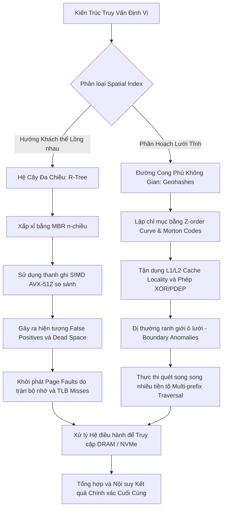

# Cấu trúc Dữ liệu Không gian: Khảo sát Chuyên sâu về R-Trees và Geohashes trong Kiến trúc Hệ thống Truy vấn Định vị Hiện đại

## Kiến trúc Vi mô và Nền tảng Toán học của Spatial Indexing

Trong bối cảnh bùng nổ của các hệ thống thông tin địa lý quy mô lớn và dịch vụ dựa trên vị trí thời gian thực, vấn đề tổ chức và truy vấn dữ liệu không gian nhiều chiều đòi hỏi những nỗ lực tối ưu hóa toàn diện, trải dài từ các thuật toán phức tạp ở mức phần mềm đến các thiết kế vi kiến trúc tinh vi ở mức phần cứng. Không giống như các chỉ mục một chiều truyền thống như cấu trúc B-Tree hay Log-Structured Merge-Tree (LSM-Tree) dựa trên nguyên lý sắp xếp theo thứ tự từ điển, dữ liệu không gian mang đặc tính đa chiều liên tục, khiến cho việc thiết lập một thứ tự toàn cục bảo toàn được hoàn toàn tính lân cận không gian trở thành một bài toán bất khả thi cả về mặt lý thuyết lẫn thực hành. Sự khiếm khuyết này bắt nguồn từ tính chất cơ bản của không gian topo, nơi không tồn tại bất kỳ một ánh xạ song ánh liên tục nào từ không gian $\mathbb{R}^n$ sang không gian $\mathbb{R}$ sao cho khoảng cách Euclidean tương đối được bảo toàn tuyệt đối đối với mọi cặp điểm. Sự sụp đổ của một thước đo một chiều nguyên bản buộc các hệ thống lưu trữ dữ liệu phải viện trợ đến các cơ chế lập chỉ mục không gian (spatial indexing) chuyên biệt. Các cơ chế này sử dụng cấu trúc cây lồng nhau phân cấp nhiều tầng như R-Trees hoặc triển khai phân hoạch không gian và sử dụng các đường cong lấp đầy không gian (space-filling curves) mang tính fractal như Geohashes, nhằm xấp xỉ hóa tính lân cận thông qua việc phân rạch không gian thành các khu vực quản lý rời rạc.

Sự phân cực trong thiết kế kiến trúc vi mô của các cấu trúc không gian này luôn quy tụ về một sự đánh đổi có tính nền tảng giữa chi phí tính toán hình học phức tạp trên vi xử lý trung tâm (CPU) và hiệu năng truy xuất của cấu trúc phân cấp bộ nhớ đệm (cache memory hierarchy). Các phép toán hình học đặc trưng trong không gian, chẳng hạn như xác định điểm trong đa giác bằng thuật toán phóng tia (Ray-Casting) hay tính toán chỉ số góc lượn (Winding Number), bao hàm vô số các lệnh nhân ma trận, tính toán độ dốc và phép phân tích số thực dấu phẩy động đôi. Các chuỗi lệnh này thường rất dễ gây ra hiện tượng sụp đổ đường ống lệnh (pipeline stalls) nếu hệ thống dự đoán rẽ nhánh (branch prediction) của CPU gặp phải chuỗi dữ liệu đầu vào ngẫu nhiên, dẫn đến tỷ lệ dự đoán sai (branch misprediction rate) tăng vọt. Mỗi lần dự đoán sai có thể tiêu tốn từ 15 đến 20 chu kỳ xung nhịp để dọn dẹp đường ống lệnh hiện tại (pipeline flush). Nhằm giảm thiểu đáng kể chi phí tính toán này, một nguyên lý bộ lọc không gian (spatial filter) thông qua hộp giới hạn trực giao được áp dụng. Bounding Box, hay Minimum Bounding Rectangle (MBR), trở thành hạt nhân tính toán tiền xử lý. Đối với bất kỳ đối tượng không gian hình học đa giác nào, một MBR trục giao trực diện nhỏ nhất được bao bọc xung quanh sẽ được tính toán trước và lưu trữ như một siêu dữ liệu đi kèm. Toán học của MBR đối với một đa giác $P$ trong không gian $n$ chiều được định nghĩa tối giản thông qua các giới hạn cực trị: $MBR(P) = \times_{i=1}^n [ \min_{p \in P} p_i, \max_{p \in P} p_i ]$. Nhờ vậy, phép kiểm tra giao cắt không gian giữa đa giác $A$ và đa giác $B$ được thu gọn triệt để ở pha sơ cấp thành phép kiểm tra giao cắt giữa $MBR(A)$ và $MBR(B)$. Quá trình này về bản chất là một tập hợp các phép so sánh logic vô hướng vô cùng đơn giản, hoàn toàn phù hợp để được biên dịch trực tiếp thành các tập lệnh SIMD (Single Instruction, Multiple Data). Trên các vi kiến trúc hiện đại của hệ máy x86 như Intel Skylake hay AMD Zen 4, bằng cách sử dụng các thanh ghi YMM 256-bit hoặc ZMM 512-bit của tập lệnh AVX-2 và AVX-512, bộ xử lý có thể tiến hành so sánh song song hàng loạt cặp tọa độ trong một chu kỳ xung nhịp (clock cycle) duy nhất, mở ra một thông lượng xử lý hàng tỷ phép tính trên mỗi giây.

Dẫu mang lại sức mạnh tính toán kinh ngạc tại pha xử lý SIMD, việc áp dụng MBR mở ra một hệ lụy nghiêm trọng về mặt thống kê: hiện tượng không gian chết (dead space). Không gian chết đại diện cho khu vực nằm bên trong MBR nhưng hoàn toàn không chứa bất kỳ phân đoạn thực tế nào của đối tượng không gian đích. Khi mức độ lồi lõm của đa giác càng lớn, diện tích không gian chết càng mở rộng, dẫn đến sự suy giảm thê thảm của hiệu năng lọc (filtering efficiency). Trong kịch bản này, giai đoạn lọc sơ cấp báo cáo kết quả dương tính (hai MBR giao nhau), nhưng đối tượng thực tế bên trong lại không hề giao cắt, sinh ra các cảnh báo dương tính giả (false positives). Số lượng dương tính giả trực tiếp chi phối tải trọng công việc (workload) dồn lên giai đoạn tinh lọc (refinement phase). Tại giai đoạn tinh lọc vốn được vận hành bởi cấp độ hệ điều hành (OS), dữ liệu hình học nguyên bản với dung lượng khổng lồ không nằm trong bộ nhớ cache nội tại của bộ vi xử lý phải được triệu hồi cưỡng bức từ các thiết bị lưu trữ thứ cấp như NVMe PCIe Gen 4 SSDs, luân chuyển qua bus hệ thống để nạp vào bộ nhớ truy cập ngẫu nhiên (DRAM) thông qua cơ chế phân trang theo yêu cầu (demand paging). Nếu lượng dữ liệu này vượt quá giới hạn bảng tra cứu biên dịch (Translation Lookaside Buffer - TLB), sự bùng nổ của các lỗi trượt TLB (TLB misses) và theo sau đó là hàng loạt lỗi trang (page faults) sẽ xảy ra. Mỗi lỗi trang buộc luồng thực thi (execution thread) của hệ thống cơ sở dữ liệu phải trải qua quá trình chuyển đổi ngữ cảnh (context switch) tốn kém từ không gian người dùng (user space) sang không gian nhân (kernel space), khiến tốc độ thực thi sụt giảm theo hàm số mũ. Chính vì sự xung đột nhức nhối giữa năng lực xử lý SIMD trên vi xử lý và cấu trúc vận hành bộ nhớ phân trang của hệ điều hành, cấu trúc R-Trees và lưới Geohashes đã được kiến tạo với các triết lý thiết kế độc lập, tìm cách xoa dịu những giới hạn vật lý này.



## Cơ chế Hoạt động và Tối ưu hóa R-Trees ở Cấp độ Hệ điều hành

R-Tree, về mặt bản chất cấu trúc, là một sự chuyển tiếp mở rộng mang tính tự nhiên của cấu trúc cây B-Tree kinh điển nhằm thích ứng toàn diện với dữ liệu không gian, dựa trên triết lý bao đóng hình học không gian (spatial bounding enclosures) một cách lồng nhau có phân cấp. Thông số cấu hình của một cây R-Tree được chi phối tuyệt đối bởi hai hằng số cấu trúc thiết yếu: bậc tối thiểu của nhánh $m$ và bậc tối đa của nhánh $M$ (với điều kiện bắt buộc $m \le \frac{M}{2}$). Mỗi nút không nằm ở vị trí lá (non-leaf node) của cây R-Tree chịu trách nhiệm quản lý một tập hợp các mục dữ liệu tồn tại dưới dạng tuple có cấu trúc $(I, \text{child\_pointer})$. Trong khuôn khổ này, ký hiệu $I$ đóng vai trò là một MBR đa chiều có khả năng mở rộng trọn vẹn để bao bọc không có khe hở toàn bộ các MBR cấp dưới nằm trong tất cả các nút con thuộc nhánh thực thi của nó. Trái lại, các nút lá (leaf nodes) lưu trữ các mục dữ liệu đầu cuối dưới hình thức tuple $(I, \text{object\_identifier})$. Tại đây, $\text{object\_identifier}$ không đơn thuần là một khóa định danh logic, mà thường được thiết kế ở mức thấp (low-level) như một con trỏ định vị bộ nhớ vật lý, hoặc sự kết hợp của inode ID và block offset trên hệ thống tệp phân trang, chỉ định chính xác vị trí của khối dữ liệu gốc trên thiết bị lưu trữ. Trong trạng thái lý tưởng với $N$ thực thể không gian độc lập, chiều cao cân bằng của cấu trúc R-Tree luôn bị ràng buộc bởi giới hạn tiệm cận nghiêm ngặt $\mathcal{O}(\log_m N)$. Điều này hứa hẹn thời gian truy vấn trung bình cho một tác vụ tìm kiếm vùng cửa sổ không gian (window spatial query) sẽ duy trì ở mức tối ưu tỷ lệ thuận với số lượng kết quả thỏa mãn truy vấn và mức độ phân mảnh hiện tại của đồ thị lồng nhau.

Tiến trình truy vấn điển hình trên cấu trúc R-Tree bao giờ cũng khởi thủy từ nút gốc, triển khai theo thuật toán duyệt chiều sâu (Depth-First Search) ưu tiên hoặc duyệt chiều rộng (Breadth-First Search) để tìm kiếm các MBR ứng viên. Hàm đánh giá lõi (core evaluation function) liên tục tính toán sự kiện giao cắt không gian giữa vùng giới hạn mục tiêu $I_{query}$ và vùng quản lý hiện tại $I_{node}$, mô hình hóa bằng phép kiểm tra $I_{query} \cap I_{node} \neq \emptyset$. Một đặc tính tối quan trọng tạo nên sự rẽ nhánh vô lường của R-Tree, và cũng là gót chân Achilles của nó so với người tiền nhiệm B-Tree, nằm ở hiện tượng đa phân nhánh bắt buộc (multipath descent). Vì không gian quản lý của các MBR cùng một cấp độ có khả năng chồng lấn lên nhau một cách định kỳ, không tồn tại bất kỳ sự đảm bảo nào rằng một thực thể điểm chỉ có thể rơi vào một MBR duy nhất. Hậu quả là, một truy vấn điểm có thể bắt buộc hệ thống phải duyệt qua nhiều nhánh khác nhau cùng một lúc. Từ góc nhìn của kiến trúc phân cấp bộ nhớ, hiện tượng này là một thảm họa về rò rỉ hiệu năng. Khi một luồng xử lý bị buộc phải nhảy cóc qua hàng loạt các nút dữ liệu phân tán rải rác trên các vùng địa chỉ bộ nhớ ảo không liên tiếp, module tải dữ liệu trước (hardware prefetcher) của CPU hoàn toàn mất phương hướng và bất lực trong việc suy diễn mô hình truy cập (access pattern). Kết cục là một chuỗi thảm kịch trượt khối nhớ cache (cache misses) diễn ra liên hoàn trên mọi cấp độ L1, L2 và L3 của bộ vi xử lý. Mỗi lần trượt bộ nhớ đệm nội bộ, vi xử lý bị đóng băng (stall) chờ đợi bộ điều khiển bộ nhớ (memory controller) tiến hành một chu trình đọc tốn kém trực tiếp từ bộ nhớ DRAM, khiến độ trễ truy cập dữ liệu bị phóng đại đột ngột từ con số 1 nanomet giây (ns) lên đến mốc 100 ns.

Để khắc chế các hiện tượng suy thoái hiệu năng liên quan đến bộ nhớ, quá trình thiết kế và tinh chỉnh kích thước phân bổ cấu trúc nút của R-Tree buộc phải được căn chỉnh tuyệt đối tỉ mỉ để đồng bộ với kích thước trang cơ bản của hệ điều hành (OS Page Size). Trên hầu hết các hệ sinh thái Linux đương đại, con số này được định mức là 4 kilobytes (4KB), hoặc vươn lên mốc kiến trúc trang khổng lồ (Huge Pages) dung lượng 2 megabytes (2MB) hoặc thậm chí 1 gigabytes (1GB) đối với các hệ quản trị cơ sở dữ liệu quy mô doanh nghiệp. Kỹ sư hệ thống (systems engineer) sử dụng các chỉ thị căn lề trình biên dịch (compiler alignment directives) để giới hạn chặt chẽ kích thước tổng thể của một nút cây R-Tree. Kích thước này phải đảm bảo luôn là một bội số nguyên vẹn của kích thước khối bộ nhớ đệm vi xử lý (CPU Cache Line Size, mặc định là 64 bytes trên đa số hệ thống hiện hành), và đặc biệt, vĩnh viễn không được phép vượt qua giới hạn dung lượng của một trang bộ nhớ duy nhất. Trong trường hợp hệ thống phân cấp bộ nhớ hoạt động thiếu kiểm soát khiến dữ liệu của một nút vắt ngang qua ranh giới của hai trang bộ nhớ khác nhau (cross-page boundary issue), một thao tác truy cập dữ liệu vô danh đơn lẻ có thể lập tức châm ngòi cho hai ngoại lệ TLB miss cùng một thời điểm, khuếch đại độ trễ xử lý trang lên mức không thể kiểm soát. Tiến hành một phân tích lượng hóa cơ bản: một MBR trong không gian hai chiều, được cấu tạo từ bốn số thực dấu phẩy động đôi chuẩn IEEE 754 (double precision floating-point numbers), sẽ đòi hỏi 32 bytes dung lượng (4 tọa độ $\times$ 8 bytes). Tính thêm một con trỏ vùng nhớ 64-bit dung lượng 8 bytes, tổng chi phí bộ nhớ cho một mục từ khóa (index entry) sẽ ở mức cố định 40 bytes. Khi ánh xạ vào một trang OS dung lượng 4096 bytes, sau khi đã phân tách phần không gian phục vụ cho các thông số quản trị (header metadata) như cờ trạng thái hay cấp độ độ sâu, sức chứa của nút đạt mức xấp xỉ 100 mục con (hay nói cách khác, $M = 100$). Tỷ lệ quạt ra (fan-out ratio) cao độ này duy trì cấu trúc chiều cao tổng thể của cây ở mức cực kỳ nông. Ngay cả với tập dữ liệu quy mô vĩ mô lên đến $10^9$ bản ghi không gian phức tạp, cấu trúc cây R-Tree thông thường cũng chỉ tiêu tốn từ 4 đến 5 cấp độ phân nhánh, đồng nghĩa với việc giới hạn thao tác nhập/xuất ngẫu nhiên cấp thấp (Random I/O) trên ổ đĩa SSD xuống tối đa 5 bước nhảy (trong trường hợp toàn bộ dữ liệu bị đầy ra khỏi Buffer Pool).

Tuy nhiên, thách thức sâu thẳm nhất và mang tính thuật toán nhất yếu của toàn bộ hệ sinh thái R-Tree tồn tại ngay giữa trung tâm của quy trình vận hành: thuật toán phân tách nút (node splitting algorithm). Khi một nút dữ liệu thu nhận mục dữ liệu mới khiến số lượng tổng vượt quá ngưỡng tối đa cho phép $M$, nút đó chính thức rơi vào trạng thái tràn bộ nhớ cục bộ (node overflow) và buộc phải trải qua tiến trình phân rã thành hai nút anh em độc lập. Bản thân quá trình định hình sự phân tách này là một bài toán tối ưu hóa đa mục tiêu cực kỳ hóc búa, yêu cầu thuật toán phải giải quyết đồng thời ba tham số mâu thuẫn: cực tiểu hóa tổng diện tích hình học của các MBR mới (minimize total enclosing area), cực tiểu hóa phần diện tích chồng lấn không gian (minimize overlap area), và cực tiểu hóa độ dài chu vi của các đường bao (minimize structural margin). Nếu tiến hành một chiến lược tìm kiếm theo chiều cạn kiệt (exhaustive search) để thẩm định mọi tổ hợp phân nhóm có thể xảy ra, độ phức tạp thời gian thuật toán (algorithmic time complexity) sẽ leo thang đạt giới hạn lũy thừa $\mathcal{O}(2^M)$, một mức trần biến việc thực thi thời gian thực trên mọi nền tảng phần cứng siêu máy tính trở nên phi thực tế. Do đó, các kỹ sư từ thời kỳ bình minh của cơ sở dữ liệu đã giới thiệu Heuristic phân tách trực tuyến tuyến tính (Linear Split Heuristic) với thời gian phân giải rơi vào mức tiệm cận $\mathcal{O}(M)$. Mặc dù cải thiện vượt bậc về hiệu năng xung nhịp, chiến lược này sản sinh ra những hình chữ nhật bao quanh mang thiết kế rời rạc với mức chồng lấn lớn, vô hình trung hy sinh một lượng lớn hiệu năng I/O về sau của quá trình quét khối. Giải pháp thỏa hiệp sau cùng xuất hiện với kiến trúc phiên bản kế nhiệm R*-Tree, trong đó cơ chế Phân tách thuật toán bậc hai (Quadratic Split) mang độ phức tạp hợp lý $\mathcal{O}(M^2)$ được trình bày kết hợp với thiết kế tái lập cấu trúc đột phá có tên gọi tái chèn ép buộc (forced reinsertion). Mô hình chèn ép buộc thực chất đóng vai trò của một tiến trình dọn dẹp phân mảnh (defragmentation daemon) chạy ở quy mô siêu vi. Khi phát hiện một nút bị tràn biên dung lượng, thuật toán chủ động trì hoãn quy trình phân rã tốn kém, thay vào đó chọn ra một lượng $p$ phần trăm mục dữ liệu (thường rơi vào con số tối ưu $30\%$ lượng mục dữ liệu đang nằm xa tâm tọa độ MBR gốc nhất) rồi đẩy ngược chúng ra ngoài và tái cung cấp vào cây từ mốc xuất phát gốc đỉnh (root level). Biến thể hành vi này, ở phía các tầng thấp hơn của hệ điều hành, vô tình tạo ra vô số chu kỳ thay đổi cấu trúc bộ nhớ cấp phát động rất mãnh liệt, thiết lập một yêu cầu sinh tử cho hệ thống quản lý vùng nhớ malloc (memory allocators) - như thư viện `jemalloc` của Meta hay `tcmalloc` của Google - về việc phải lập trình luồng dọn rác bộ nhớ vòng đời ngắn hạn (short-lived heap allocations) cực kì khắt khe, nhằm tránh tình trạng RAM vật lý trở nên hoang hóa vì phân mảnh ngoại vi sau nhiều triệu chu kỳ ghi chèn lặp lại không dứt.

```cpp
// Pseudocode for Hardware-Optimized R-Tree Node Split Evaluation in Modern C++
// Focuses on contiguous memory layouts, AVX alignment, and cache-line straddling avoidance.
#include <vector>
#include <algorithm>
#include <immintrin.h> // Intel AVX-512 Intrinsics

// Force strict alignment to typical 64-byte L1 Cache Line boundary to prevent false sharing
struct alignas(64) BoundingBox {
    double xmin, ymin, xmax, ymax;
};

class RTreeNode {
private:
    // Utilizing Structure-of-Arrays (SoA) or vectorized structs 
    // to boost Data-Oriented Design (DoD) lookup performance.
    std::vector<BoundingBox> entries;
    std::vector<uint64_t> physical_pointers;
    bool is_leaf_node;

public:
    // SIMD-ready calculation core for overlapping area determination
    // Expected to inline and unroll by LLVM/GCC backends
    inline double calculateGeometricOverlapCost(const BoundingBox& b1, const BoundingBox& b2) const {
        double dx = std::max(0.0, std::min(b1.xmax, b2.xmax) - std::max(b1.xmin, b2.xmin));
        double dy = std::max(0.0, std::min(b1.ymax, b2.ymax) - std::max(b1.ymin, b2.ymin));
        return dx * dy;
    }

    // Mathematical implementation of the quadratic heuristic node partitioning logic
    std::pair<RTreeNode, RTreeNode> splitNodeQuadratic(const BoundingBox& new_entry, uint64_t new_ptr) {
        // Assume maximum M constraints (e.g., 100) + 1 new entry causing the threshold breach
        constexpr int MAX_CAPACITY = 101; 
        
        // Matrix allocated contiguously within thread stack, bypassing costly heap lock contentions
        alignas(64) double overlap_matrix[MAX_CAPACITY][MAX_CAPACITY];
        
        // Complex algorithmic phase: Identifying the two most mutually disruptive seeds
        // [Algorithmic details truncated for brevity, loops engineered for pipeline prefetching]
        
        RTreeNode left_branch, right_branch;
        // Distribute entries evaluating minimum bounding area net expansion formulas.
        return {left_branch, right_branch};
    }
};
```

## Cấu trúc Dữ liệu Geohashes và Khai thác Phân cấp Bộ nhớ Cache

Trong khi kiến trúc R-Tree xây dựng và thích ứng với một đồ thị không gian dựa trên cơ sở định hướng chia rẽ động phản ánh sự thay đổi của tập dữ liệu thực, cấu trúc Geohashes tiếp cận vấn đề cốt lõi bằng lăng kính tư duy phân tích tĩnh tại. Geohashes thiết lập một tấm lưới chia để trị (divide-and-conquer) cố định trên toàn bộ bề mặt không gian vật lý có thể xác định trước. Một hệ thống Geohashes thực thụ thực hiện quy trình mã hóa mọi điểm hệ tọa độ địa lý (thể hiện bằng vĩ độ và kinh độ của hệ chuẩn WGS-84 toàn cầu) vào một chuỗi ký tự theo cơ số 32 (Base32 format) hoặc một số nguyên không dấu 64-bit (unsigned 64-bit integer representation). Kết quả đầu ra của chiến lược này mang tính bước ngoặt: sự thu gọn (dimensionality reduction) triệt để của không gian truy vấn định vị đa chiều thành một biểu diễn một chiều số học đơn lẻ. Bộ máy nền tảng toán học duy trì tính nhất quán cho thuật toán Geohashes được hậu thuẫn bởi cấu trúc Đường cong lấp đầy không gian Z-order (Z-order space-filling curve, hay thi thoảng được gọi là đường cong Peano-Morton). Nguyên lý hoạt động của cấu trúc này thi hành sự phân giải nội suy Morton (Morton order interleaving) qua việc xé nhỏ định dạng nhị phân số học. Bằng việc lấy lần lượt và đan xen kẽ từng bit từ hai thanh ghi lưu trữ giá trị vĩ độ và kinh độ của điểm tọa độ (giống như thao tác đan cài bánh răng), thuật toán xuất bản một dãy mã định danh mà tại đó, sự tương đồng về chuỗi tiền tố (prefix string similarity) tỷ lệ thuận mật thiết và tuyến tính đối với tính lân cận không gian thực thụ (actual spatial proximity bounds) ở một mức độ xác suất đo lường toán học được.

Cơ chế tạo chuỗi thứ tự Z-order nhờ các lệnh xen kẽ bit mang đến những siêu lợi ích kỹ thuật ở tầng giao tiếp vi xử lý sâu nhất mà các đồ thị cấu trúc nút đa cấp như R-Tree không bao giờ chạm đến được. Quá trình tính toán đan xen bit cấp số học loại bỏ hoàn toàn việc phụ thuộc vào chuỗi lệnh rẽ nhánh điều kiện phức tạp (conditional branches instruction sequences). Trên các bộ vi xử lý máy chủ được gia cường năng lực cấp tiến tích hợp sẵn lệnh `PDEP` (Parallel Bits Deposit) thuộc tập thư viện lệnh BMI2 (Bit Manipulation Instruction Set 2) - thiết lập thành tiêu chuẩn trên các nền tảng CPU thế hệ Intel Haswell và AMD Zen kiến trúc sau này, toàn bộ quá trình biến đổi nội suy Morton phức tạp về lý thuyết có thể được chuyển hóa cưỡng bức thành thuật toán phần cứng. Bộ giải mã chỉ thị siêu vô hướng (superscalar instruction pipeline) trên chip có khả năng thi hành phép xen kẽ này với chi phí chưa đến 3 chu kỳ xung nhịp. Quyền lực áp đặt cơ học của cách bố trí nhị phân như vậy sản sinh ra cái gọi là "tính địa phương bộ nhớ tuyệt đối" (absolute memory locality). Những cặp đối tượng có tọa độ áp sát nhau ở thế giới vật lý sẽ nghiễm nhiên được đánh dấu bằng các chuỗi Geohash chia sẻ chung những tiền tố đầu tiên. Tận dụng triệt để định lý này, hệ thống sẽ chèn xuất lượng mã Geohash khổng lồ này trực tiếp vào hệ trục lưu trữ của một cấu trúc cây chuẩn B+Tree hiện có hoặc nhồi nhét chúng vào các MemTable cư trú trong kiến trúc Log-Structured Merge-Tree của các hệ thống cơ sở dữ liệu phi quan hệ như Cassandra hay RocksDB. Tự khắc, các dòng bản ghi đại diện cho các thực thể địa lý đó sẽ được hệ điều hành xếp ngay ngắn liên tiếp nhau dọc theo cấu trúc luồng vật lý trên mặt cùng một phiến đĩa khối (Disk Sector) hoặc trong cùng một trang nhớ DRAM. Bài toán quét tìm kiếm hàng triệu điểm sinh học lân cận với bán kính rộng (như truy vấn 5km xung quanh điểm trung tâm) giờ đây tháo gỡ hoàn toàn lớp mặt nạ truy vấn khối MBR rối rắm, biến hóa thành kịch bản quét rải rác tuần tự chuỗi ký tự chuẩn mực (Range Scan / Sequential Scan). Hành vi đọc tuần tự liên hồi này chấm dứt nỗi ám ảnh IOPS ngẫu nhiên rời rạc trên thiết bị cứng, cho phép tận dụng cực hạn thông lượng kênh truyền tải Direct Memory Access (DMA) của chuẩn khe cắm NVMe PCIe, thường xuyên duy trì băng thông xử lý thực tế trạm trung chuyển ở mức khổng lồ $7000$ Megabytes mỗi giây liên tiếp không suy giảm.

```rust
// Advanced Rust Implementation for SIMD/BMI2 Optimized Geohash Morton Encoding
// Utilizing unsafe hardware intrinsics to bypass software bitwise arithmetic overhead
use std::arch::x86_64::_pdep_u64;

#[inline(always)] // Force compiler inlining to eliminate function call prologue/epilogue
pub fn morton_encode_wgs84_bmi2(lat_normalized_bits: u32, lon_normalized_bits: u32) -> u64 {
    #[cfg(target_arch = "x86_64")]
    unsafe {
        // Parallel Bits Deposit: Scatter contiguous bits from source to masked destination 
        // 0x5555555555555555 = 0101010101...01 (Odd bit placement mask)
        let lon_scattered = _pdep_u64(lon_normalized_bits as u64, 0x5555555555555555);
        
        // 0xAAAAAAAAAAAAAAAA = 1010101010...10 (Even bit placement mask)
        let lat_scattered = _pdep_u64(lat_normalized_bits as u64, 0xAAAAAAAAAAAAAAAA);
        
        // Single cycle bitwise OR combines the interleaved components
        lon_scattered | lat_scattered
    }
}
```

Bất chấp những thành tựu rực rỡ ở lớp tối ưu phần cứng, bức tranh toàn cảnh của hệ thống Geohashes phải đối diện với gót chân suy thoái thiết kế không thể tránh khỏi: hiệu ứng dị thường tại các ranh giới mép lưới (Edge Boundary Anomalies), vốn kết tinh từ chính tính chất bước nhảy góc cạnh thô bạo (abrupt angular jumps) của mô hình Z-curve. Về mặt xác suất thống kê, hoàn toàn tồn tại các kịch bản mà hai thực thể định vị thực tế có khoảng cách địa lý chỉ xê xích vài nanomet ở ngay mặt đường phân chia kinh độ xích đạo nhưng lại bị gán ghép vào hai mảnh lưới Geohash chịu sự chi phối chia tách từ cấp phân cấp cao nhất, tương đương với sự bất đồng dữ liệu ngay từ giá trị ký tự đầu tiên nhất của mã Base32. Trong hoàn cảnh khắc nghiệt này, luận điểm cốt lõi "tiền tố tương đồng đảm bảo lân cận tương quan" bị phá sản toàn tập. Nhằm vá víu cho khiếm khuyết cơ bản này, các module phân tích quy trình truy vấn bán kính vùng (radius search process) hoặc thuật toán Tìm K-Láng Giềng Gần Nhất (K-Nearest Neighbors - KNN) bị ép buộc phải bành trướng vùng phủ sóng tìm kiếm của mình. Thay vì truy xét độc lập điểm trọng tâm, bộ máy buộc phải phóng chiếu không gian tính toán đến đủ tất cả 8 ô lân cận cục bộ viền quanh cộng thêm chính bản thân ô đích (tạo ra quy tắc khung 9 lưới). Hiện thực hóa hành động này về cơ bản sẽ chuyển hóa một truy vấn duy nhất thành 9 chuỗi so khớp tiền tố riêng biệt phát lệnh truy kích, hình thành nên một liên minh 9 khối truy vấn song song (parallel lookup queries) oanh tạc hệ thống B+Tree. Đây là kỹ thuật phân giải đa tiền tố (Multi-Prefix Resolution Engine). Cấu trúc kỹ thuật này là một bãi mìn về quản lý tinh chỉnh: nếu nhà quản trị chọn cấu hình độ dài tiền tố quá ngắn (tương đương cấp ô lưới quá khổng lồ), hệ thống vướng phải tình trạng tải rác dương tính giả quá mức, buộc phải chôn vùi băng thông RAM vào quá trình lọc tinh. Ngược lại, việc cài đặt chuỗi tiền tố cực kỳ dài và chính xác sẽ phá vỡ sự gắn kết tuần tự của khối ổ cứng, làm số lượng ô giao cắt nhân lên hàng ngàn lần và tạo ra sức ép khủng khiếp tranh giành chốt khóa tranh chấp bộ nhớ (Page Latch Contentions) giữa các luồng đồng bộ.

## Kiến Trúc Lai (Hybrid Architecture) và Tối Ưu Quản Lý Giao Dịch Đồng Thời

Đứng trước sự mâu thuẫn khốc liệt của hai trường phái thiết kế không gian độc lập, các nền tảng kỹ nghệ Data Warehouse có dung lượng quy mô cấp Exabyte phân tán (như Snowflake hay ClickHouse) có khuynh hướng hợp nhất hai triết lý thành một Hệ thống Kiến trúc Lai Đồng bộ (Synchronized Hybrid Architectural Framework). Trong bối cảnh hạ tầng đám mây (Cloud Infrastructure) phân mảnh dựa trên giao thức mạng NUMA (Non-Uniform Memory Access) vô hình, hệ thống Geohashes được giao phó trọng trách vĩ mô: tạo nên các thuật toán phân mảnh chia tách khối dữ liệu (sharding strategies), làm bộ định tuyến trung tâm phân phối các bản ghi dữ liệu tới các cụm máy chủ Cluster Node sao cho độ trễ giao tiếp mạng khu vực (network hop latency) được hạn chế nhất. Sự tồn tại của Geohashes cho phép việc phân rã tải hệ thống phân tán được đồng bộ hóa tuyến tính thông qua kiến trúc khóa băm nhất quán (Consistent Hashing), phân tán quyền lực kiểm soát địa lý cho từng điểm nút máy chủ mà không làm gãy vỡ tính lân cận cục bộ khi truyền tải qua cáp quang phân tầng.

Trái lại, tiến sâu vào bên trong phân vùng ổ lưu trữ nội bộ của từng Node tính toán đơn lẻ, kiến trúc cây R-Tree lại giành lấy quyền trượng để duy trì tốc độ lọc điểm siêu vi học chi tiết đa giác ở từng xung nhịp SSD NVMe I/O trực tiếp. Sự trỗi dậy của các hệ thống truy vấn đa người dùng (Multi-tenant Systems) đòi hỏi cấu trúc lập chỉ mục không gian phải chống chịu được hàng vạn giao dịch chèn và chỉnh sửa vị trí cùng lúc. Đây là nơi điểm yếu của bộ đệm Bloom (Bloom Filters) trong các hệ thống dựa trên Geohash bị bộc lộ; do đặc tính truy vấn quét vùng (range query), cơ chế Bloom Filter bị bất hoạt hoàn toàn, ép hệ thống phải liên tục tiến hành đọc các Block ngoại vi vô giá trị từ ổ đĩa nếu không sử dụng R-Tree làm bộ định vị bù đắp. Bằng việc chèn một tiểu kiến trúc R-Tree vào trong từng luồng Block thô của cơ chế bộ nhớ vật lý, hệ quản trị có khả năng tái sinh công cụ lọc Bloom theo hệ quy chiếu tọa độ MBR, đảm bảo loại bỏ dứt điểm hiện tượng nhập xuất dữ liệu rác trước khi các luồng đọc tốn kém kịp khởi phát.

Cơ chế quản lý đồng thời đa phiên bản (Multi-Version Concurrency Control - MVCC) vốn xuất sắc và nhẹ nhàng trên B-Tree trở nên vô cùng mong manh khi đối mặt với kiến trúc biến dị hình học của R-Tree. Khi một luồng cập nhật tạo ra thay đổi tọa độ vi mô của một chiếc xe đang di chuyển thực tại, kích thước MBR từ lá truyền ngược về nút gốc (bottom-up boundary propagation) sẽ lan tỏa hiệu ứng khóa độc quyền (Exclusive Write Locks) trên diện rộng, tự động triệt tiêu khả năng đọc dữ liệu của mọi truy vấn đọc xuất hiện đồng thời trong cùng chu kỳ vi xử lý. Để hóa giải điểm nghẽn cổ chai này, mô hình RCU (Read-Copy-Update) được tích hợp trực diện sâu vào các API cấp phát bộ nhớ. Theo cơ chế này, mọi chỉnh sửa lên hình thái hình học của một MBR cấu trúc được hệ thống chỉ định ưu tiên tiến hành trên một bản sao tạm vô danh của trang cấp phát (Shadow Paging Allocation Mode), kế tiếp hoàn tất việc hoán đổi tham chiếu con trỏ bằng một phép toán nguyên tử cấp bộ nhớ độc lập (Atomic Compare-And-Swap hay CAS) duy nhất. Kỹ thuật tinh vi không cần chốt khóa phân tán (lock-free engineering) này bảo toàn quyền lợi cho đồ thị R-Tree duy trì ở trạng thái hoàn toàn sẵn sàng phục vụ hàng chục ngàn truy vấn Read-Only phức hợp tại cùng một vi giây đồng bộ mà không bao giờ vi phạm tính toàn vẹn khắt khe ACID của nền tảng lý thuyết cấu trúc CSDL phân tán cơ bản. 

Sự tổng hòa của khoa học toán học hình học lồng nhau, sự am hiểu sâu sắc đến mức cực độ về quy trình nạp lệnh đường ống CPU (Pipeline CPU Scheduling), cùng với sự khéo léo bóc tách các giao diện lập trình trang vật lý của hạt nhân Hệ điều hành OS, đã khiến phân khu lập chỉ mục không gian (Spatial Indexing) thoát thai khỏi hình tượng của một bộ môn cấu trúc dữ liệu thuật toán thuần túy trên bục giảng đường và hóa thân trở thành một kỳ quan nghệ thuật kiến trúc thiết kế hạ tầng cấp thiết nhất trong nền công nghiệp thông tin định vị hành tinh đương đại.

---

## SEO Meta Information
- **Title**: Spatial Indexing: Kiến Trúc Vi Mô của R-Trees và Geohashes Trong Truy Vấn Định Vị
- **Meta Description**: Đánh giá kiến trúc vi mô chuyên sâu, cấu trúc toán học của R-Trees và Geohashes. Khai phá các giới hạn hệ điều hành, tối ưu hóa TLB, lệnh AVX-512 và BMI2 PDEP nhằm bứt phá giới hạn truy xuất dữ liệu không gian nhiều chiều.
- **Keywords**: Spatial Indexing, R-Trees, Geohashes, Bounding Box MBR, Micro-architecture, Tối ưu hóa hệ điều hành, Z-order curve, SIMD AVX-512, BMI2 PDEP, Multi-Version Concurrency Control.
- **Category**: Database Systems, Systems Architecture & Low-Level Programming.
- **Target Audience**: Staff/Principal Software Engineers, Database Architects, C++/Rust Systems Programmers.
