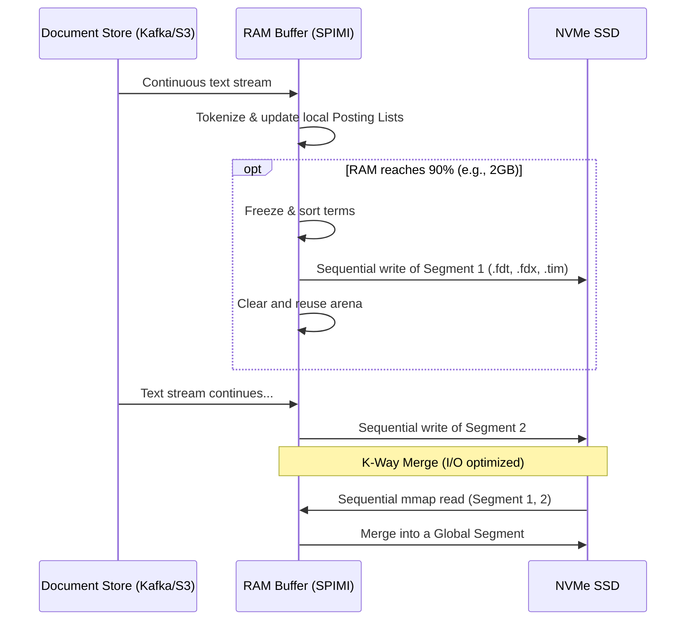

# The Architecture and Engineering of Inverted Indexes, From the Ground Up in Micro-architecture

## Executive Summary

Search engines, log platforms, and most modern databases all lean on the same piece of machinery under the hood: the **inverted index**. Whether it's Google ranking web pages, Elasticsearch aggregating billions of JSON logs, or Splunk hunting through terabytes of application traces, the inverted index is what turns "find every document containing this word" from a linear scan into a millisecond-scale lookup.

This piece walks through inverted index architecture from the math up through the bare-metal implementation details. The goal isn't just to explain what an inverted index is — plenty of textbooks do that — but to show how systems engineers work around the physical limits of the hardware they're running on: I/O latency, the memory wall, and the quirks of modern CPU instruction pipelines. Getting a query to return in single-digit milliseconds over a corpus of a billion documents is as much a hardware problem as an algorithms one.

It's aimed at systems engineers, database developers, and architects who need to build or reason about search infrastructure at scale.

---

## Core Problem Statement

Building an inverted index system means confronting three physical and computational constraints head-on:

1. **Space explosion.** Heaps' Law ($|\mathcal{V}| = k N^\beta$, where $\mathcal{V}$ is the vocabulary and $N$ is the total token count) and Zipf's Law (word frequency is inversely proportional to rank) together mean a handful of common terms — stop-words, or domain-specific jargon — show up in nearly every document. Left uncompressed, the resulting posting lists can blow past what fits in RAM and start eating disk bandwidth just to read.
2. **I/O and memory bottlenecks.** Even a fast NVMe Gen 5 SSD has latency measured in tens to hundreds of microseconds, versus a few nanoseconds for an L1/L2 cache hit. Without careful exploitation of locality of reference, the CPU spends most of its time stalled waiting on disk.
3. **Instruction-level overhead.** Decompressing billions of document IDs and running Boolean intersections involves a lot of branching. On deeply pipelined modern CPUs, branch mispredictions trigger pipeline flushes that quietly erode the performance of ranking algorithms.

---

## Deep Technical Knowledge / Internals

### Mathematical Foundations and Multi-Tier Data Structures

Formally, an inverted index is a mapping $I: \mathcal{V} \to 2^{\mathcal{D}}$, where $\mathcal{V}$ is the vocabulary and $\mathcal{D}$ is the document space. For each term $t \in \mathcal{V}$, the system returns an array of document IDs — the posting list $P(t) = \langle d_1, d_2, \dots, d_k \rangle$ with $d_i \in \mathcal{D}$, kept in strict ascending order: $d_1 < d_2 < \dots < d_k$. That ordering isn't an implementation detail — it's what makes intersecting two posting lists a two-pointer walk in $\mathcal{O}(|P(t_1)| + |P(t_2)|)$ time instead of the $\mathcal{O}(|P(t_1)| \times |P(t_2)|)$ you'd get from a naive nested loop.

The system's memory layout is almost always split into two pieces, each optimized for a different I/O profile:
- **Term dictionary:** small enough to live entirely in RAM, giving $\mathcal{O}(1)$ or $\mathcal{O}(\log |\mathcal{V}|)$ lookups.
- **Postings file:** too large for RAM, so it sits on secondary storage (SSD/HDD), with only the blocks a query actually touches paged in via memory-mapped files.

```mermaid
graph TD
    subgraph RAM_Space [Main Memory Space (RAM)]
        FST[Finite State Transducer / Term Dictionary]
        Cache[Page Cache / LRU Block Cache]
        Accumulators[Query Accumulators]
    end
    
    subgraph Disk_Space [Secondary Storage Space (NVMe SSD)]
        Segment1[Index Segment 1]
        Segment2[Index Segment 2]
        
        subgraph Segment_Internal [Structure Inside a Segment]
            TermIndex[Term Index / Metadata]
            Posting1[Posting List: "database"]
            Posting2[Posting List: "architecture"]
            Pos1[Positions / Offsets]
        end
    end
    
    FST -->|Points to Offset on Disk| TermIndex
    TermIndex -->|Pointer| Posting1
    TermIndex -->|Pointer| Posting2
    Posting1 -->|Linked DocID| Pos1
    Segment1 -. Equivalent Structure .-> Segment_Internal
    Cache -. Memory Mapping (mmap) .-> Segment1
```

### Term Dictionary: The Power of FST

A plain hash map doesn't cut it for the term dictionary — it burns too much RAM and can't answer prefix queries like `compu*`. A B-tree fixes the range-query problem but compresses poorly.

This is why real-world systems like Apache Lucene reach for a **Finite State Transducer (FST)** instead — engineers who've worked with it tend to call it the holy grail of term dictionaries. An FST is a directed acyclic graph that behaves like a finite state machine, sharing common prefixes and suffixes across the entire vocabulary. `moth`, `mother`, `motel`, and `brother`, for instance, all share the nodes `m-o-t` and `o-t-h-e-r`.

The FST turns an input string into an integer that points to the posting list's location in memory or on disk. Run the entropy numbers and you'll find an FST can compress the average English term from 15-20 bytes down to 2-3. That's the difference between a billion-term vocabulary needing terabytes versus fitting comfortably in a few gigabytes of RAM.

### Posting Lists and the Art of Compression

Taming a posting list of hundreds of millions of entries takes two steps, applied in sequence:
1. **Delta encoding.** Instead of storing raw DocIDs like $\langle 10, 15, 22, 105 \rangle$, store the gaps between them: $\Delta = \langle 10, 5, 7, 83 \rangle$. Since the list only ever increases, these gaps tend to be small — usually somewhere between 1 and 255 — so they pack into far fewer bits than a 32-bit integer would need.
2. **Bit-aligned integer encoding**, of which there are a few competing schemes:
    - **Variable-byte (VByte):** simple to implement, but the continuous bit-logic branching makes decoding relatively expensive in CPU cycles.
    - **PForDelta (Patched Frame-of-Reference Delta):** groups deltas into fixed-size blocks — say, 128 values — then scans each block to find the smallest bit-width $b$ that covers most of the values (e.g., $b=4$ bits covers anything up to 15). Outliers beyond that get pulled out and stored separately in a small patch area.
    - **Elias-Fano (EF):** splits each integer into high bits and low bits, storing the high bits with unary coding and the low bits as raw binary. EF gets you O(1) random access, and it's fast in practice because it leans on hardware `popcnt` and `tzcnt` instructions.

**C++ SIMD PForDelta decoding example:**
Group deltas into blocks of 128 DocIDs and you can lean on AVX2/AVX-512 to decompress a whole vector in a single clock cycle, with no `if-else` in sight.

```cpp
#include <immintrin.h>

// Function to reconstruct DocIDs from a compressed Delta array using SIMD
void simd_prefix_sum_avx2(uint32_t* deltas, uint32_t* doc_ids, size_t count) {
    __m256i offset = _mm256_setzero_si256();
    for (size_t i = 0; i < count; i += 8) {
        // Load 8 32-bit delta values into the AVX register
        __m256i x = _mm256_loadu_si256((__m256i*)&deltas[i]);
        
        // Parallel Prefix Sum within the 256-bit register
        x = _mm256_add_epi32(x, _mm256_slli_si256(x, 4));
        x = _mm256_add_epi32(x, _mm256_slli_si256(x, 8));
        
        // Propagate the offset carried from the previous iteration
        x = _mm256_add_epi32(x, offset);
        
        // Store 8 decoded DocIDs into the result array
        _mm256_storeu_si256((__m256i*)&doc_ids[i], x);
        
        // Update the offset for the next block of 8 elements by broadcasting the last element
        offset = _mm256_broadcastd_epi32(_mm_castsi128_si32(_mm256_extractf128_si256(x, 1)));
    }
}
```

### Operating System Memory Management Architecture and Tuning

A production index can run into the hundreds of terabytes. No serious search engine tries to manage that with manual `fread`/`fwrite` load-unload logic. Instead, the whole thing is built on `mmap()`.

- **Page cache & zero-copy:** `mmap()` maps disk space directly into the process's virtual address space. The kernel then uses whatever RAM is free as page cache, and reads move from SSD into that cache via DMA without touching the CPU at all.
- **MADV_WILLNEED & prefetching:** calling `madvise()` with `MADV_SEQUENTIAL` or `MADV_WILLNEED` tells the OS to spin up read-ahead threads, which keeps NVMe PCIe bandwidth saturated near its peak GB/s instead of idling between requests.
- **Avoiding TLB misses:** aligning compressed posting-list blocks to 4KB page boundaries — or using 2MB huge pages — speeds up virtual-to-physical address translation and sidesteps the costly page-table walk, which can otherwise cost hundreds of CPU cycles per miss.
- **NUMA awareness:** on multi-socket boxes, memory attached to the local CPU has noticeably more bandwidth than memory across the interconnect. Query threads get pinned to specific cores and told to allocate only local RAM with `numactl --localalloc`, avoiding cross-socket hops over Intel UPI or AMD Infinity Fabric.

### Index Construction: SPIMI and LSM-Tree Techniques

You can't build an index by dumping every document into a giant `<Term, DocID>` array and calling `sort()` on it — that needs $\mathcal{O}(N \log N)$ RAM you don't have, and once it starts swapping, the random I/O pattern will bring the machine to its knees.

The industry-standard fix is **Single-Pass In-Memory Indexing (SPIMI)**:
1. Allocate a large in-memory arena.
2. Parse documents and build posting lists directly in that arena.
3. Once the arena hits roughly 90% capacity, freeze the dictionary, sort by TermID, and flush the whole thing to disk as one segment via sequential I/O.
4. Repeat until the corpus is exhausted.
5. Finally, run a k-way merge to combine all the segments into a single global index.



To support near-real-time indexing, Elasticsearch and Lucene combine SPIMI with an **LSM-Tree**-style structure. New segments get created continuously and become queryable right away, while background threads run compaction — merging small segments into larger ones and garbage-collecting documents marked as deleted (tombstones).

### Query Processing and Ranking Evaluation

At query time, evaluating something like `q = "system architecture optimization"` means walking posting lists either **Document-at-a-Time (DAAT)** or **Term-at-a-Time (TAAT)**. DAAT tends to win out in distributed systems: it walks DocIDs horizontally and computes a complete BM25 score for each document before moving on.

The trouble is that walking millions of DocIDs one by one won't hit a 50ms latency budget. That's the gap **Block-Max WAND (BMW)** fills, using a bounding strategy:
- Each posting list is split into blocks.
- Every block carries metadata recording the upper-bound score ($U_{t,b}$) any document inside it could possibly achieve for a given term.
- The algorithm keeps a Top-K list (backed by a min-heap) and a running score threshold $\theta$.
- If the sum of upper-bound scores across the current blocks, $\sum U_{t,b}$, falls below $\theta$, the whole block gets skipped outright — no decoding, no SIMD decompression, just a jump straight to the next relevant DocID via skip pointers. This one trick alone can eliminate up to 95% of the CPU work a naive scan would do, and it's a big part of why production query engines feel instant.

---

## Practical Applications and Case Studies

### Case Study 1: Apache Lucene and Elasticsearch

Apache Lucene — the engine underneath both Elasticsearch and Solr — is about as clean an FST implementation as you'll find for a term dictionary. Rather than plain VByte, Lucene uses block-based `FOR` integer compression with tight bit-packing, and leans on Roaring Bitmaps (a hybrid of array compression and run-length encoding) to speed up filter caches. The payoff: Elasticsearch clusters built from commodity hardware can query and aggregate billions of JSON log documents without breaking a sweat.

### Case Study 2: ClickHouse and Columnar Databases

Inverted indexes were born for text retrieval, but columnar OLAP databases like ClickHouse borrow the idea inside their granule blocks too. By building local inverted indexes over `string` columns holding JSON or tags, ClickHouse skips full-table scans and narrows the search space up front using Bloom filters and data-skipping indexes.

---

## Lessons Learned

Pull apart the architecture of an inverted index and a few durable engineering lessons fall out:

1. **Software-hardware co-design matters.** An algorithm that looks optimal on paper — $\mathcal{O}(N)$, clean and elegant — can lose to an $\mathcal{O}(N \log N)$ approach that's cache-friendly, SIMD-optimized, and avoids branch mispredictions. Getting the most out of an inverted index means actually understanding L1/L2 cache-line behavior, the TLB, and AVX registers, not just the algorithm on the whiteboard.
2. **Don't fight the OS.** Rather than reinventing a custom caching layer at the application level, leaning on the Linux page cache through `mmap` and `madvise()` is safer, uses physical RAM more fully, and keeps the codebase simpler to maintain.
3. **The space-time tradeoff has flipped.** It used to be assumed that compression traded space for time — smaller on disk, slower to decode. PForDelta and Elias-Fano break that assumption: less data moves across memory bandwidth, and SIMD decoding is fast enough that compressed formats often end up quicker overall, not slower. Compression and speed aren't opposed anymore.
4. **Locality still wins.** Keeping DocIDs in strict ascending order is really just an application of spatial locality. That single design choice is what makes efficient iteration, skip pointers, and parallel evaluation possible — and it's the foundation this whole style of inverted index architecture has been built on for decades, with no sign of that changing.

*(Further reading: SIGIR papers on WAND/BMW, and the SIMD integer-compression literature coming out of the Apache Software Foundation ecosystem.)*
