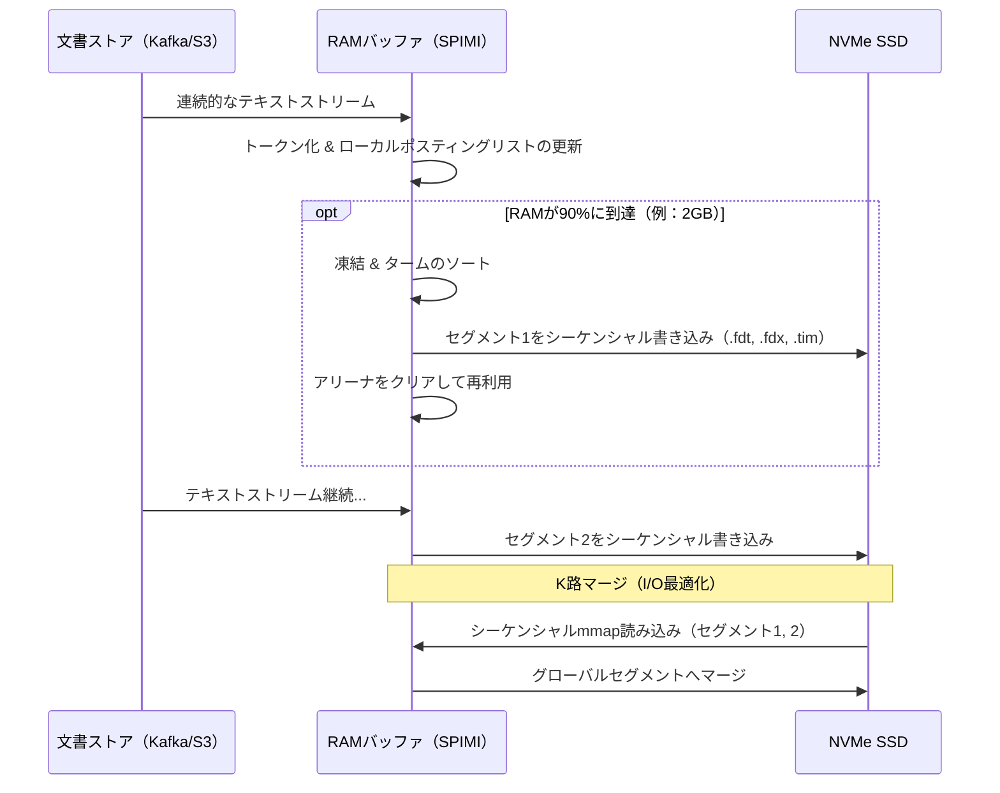

# マイクロアーキテクチャの基盤から見る転置インデックス（Inverted Index）の構築技術

## エグゼクティブサマリー

検索エンジンもログ基盤も、そして今どきのデータベースの大半も、裏側では同じ仕組みに頼っている。それが**転置インデックス（Inverted Index）**だ。Googleが数十億ページをランク付けするときも、Elasticsearchが大量のJSONログを集計するときも、Splunkがテラバイト級のトレースを掘り返すときも、「この単語を含む文書を全部見つけろ」という要求を線形スキャンからミリ秒単位の検索に変えているのは、この構造である。

本稿では、転置インデックスの数式レベルの基盤から、ハードウェアに近い実装の細部までを一気通貫で見ていく。目的は「転置インデックスとは何か」を説明することだけではない――それなら教科書で十分だ。ここで扱いたいのは、システムエンジニアがどうやって稼働中のハードウェアの物理的な限界、つまりI/Oレイテンシ、メモリウォール、そして現代CPUの命令パイプラインの癖を回避しているか、という点である。数十億文書のコーパスに対してクエリを一桁ミリ秒で返すというのは、アルゴリズムの問題であると同時に、ハードウェアをどう使い倒すかの問題でもある。

想定読者は、大規模な検索基盤を構築あるいは検討する必要のあるシステムエンジニア、データベース開発者、アーキテクトである。

---

## コア問題提起

転置インデックスシステムを構築するということは、三つの物理的・計算上の制約に正面から向き合うことを意味する。

1. **記憶容量の爆発。** Heapsの法則（$|\mathcal{V}| = k N^\beta$、$\mathcal{V}$は語彙集合、$N$はトークン総数）とZipfの法則（単語の出現頻度は順位に反比例する）が組み合わさると、ストップワードやドメイン固有の頻出語といった一握りの単語がほぼすべての文書に現れることになる。圧縮しないままだと、対応するポスティングリストはRAMに収まりきらず、読み込むだけでディスク帯域を食いつぶしかねない。
2. **I/Oとメモリのボトルネック。** 高速なNVMe Gen 5 SSDであっても、レイテンシは数十〜数百マイクロ秒のオーダーだ。L1/L2キャッシュヒットが数ナノ秒であることを思えば、桁違いに遅い。参照の局所性（locality of reference）をうまく活用できなければ、CPUはディスクからのデータを待ってストールし続けることになる。
3. **命令レベルのオーバーヘッド。** 数十億個のDocIDを解凍し、ブール演算による交差処理を行うには大量の分岐が伴う。深いパイプラインを持つ現代CPUでは、分岐予測ミスがパイプラインフラッシュを引き起こし、ランキングアルゴリズムの性能をじわじわと削っていく。

---

## 深層技術知識 / 内部構造

### 数学的基盤と多層データ構造

形式的に言えば、転置インデックスは写像 $I: \mathcal{V} \to 2^{\mathcal{D}}$ である。ここで $\mathcal{V}$ は語彙、$\mathcal{D}$ は文書空間だ。各語 $t \in \mathcal{V}$ に対して、システムは文書ID の配列――ポスティングリスト $P(t) = \langle d_1, d_2, \dots, d_k \rangle$（$d_i \in \mathcal{D}$）を返す。これは厳密な昇順で保持される：$d_1 < d_2 < \dots < d_k$。この順序は単なる実装上の都合ではない。二つのポスティングリストの交差処理を、ナイーブな二重ループなら $\mathcal{O}(|P(t_1)| \times |P(t_2)|)$ かかるところを、ツーポインタ走査で $\mathcal{O}(|P(t_1)| + |P(t_2)|)$ に落とし込めるのは、この単調増加という性質があってこそだ。

システムのメモリレイアウトは、ほぼ常に二つの部分に分けられる。それぞれ異なるI/O特性に合わせて最適化されている。
- **タームディクショナリ（Term Dictionary）:** RAMに完全に収まる程度の大きさに抑え、$\mathcal{O}(1)$ または $\mathcal{O}(\log |\mathcal{V}|)$ のルックアップを実現する。
- **ポスティングファイル（Postings File）:** RAMには大きすぎるため二次記憶（SSD/HDD）に置き、クエリが実際に触れるブロックだけをメモリマップドファイル経由でページインする。

```mermaid
graph TD
    subgraph RAM_Space [主記憶空間（RAM）]
        FST[有限状態トランスデューサ / タームディクショナリ]
        Cache[ページキャッシュ / LRUブロックキャッシュ]
        Accumulators[クエリアキュムレータ]
    end
    
    subgraph Disk_Space [二次記憶空間（NVMe SSD）]
        Segment1[インデックスセグメント1]
        Segment2[インデックスセグメント2]
        
        subgraph Segment_Internal [セグメント内部構造]
            TermIndex[タームインデックス / メタデータ]
            Posting1[ポスティングリスト: "database"]
            Posting2[ポスティングリスト: "architecture"]
            Pos1[位置 / オフセット]
        end
    end
    
    FST -->|ディスク上のオフセットを指す| TermIndex
    TermIndex -->|ポインタ| Posting1
    TermIndex -->|ポインタ| Posting2
    Posting1 -->|連結DocID| Pos1
    Segment1 -. 同等構造 .-> Segment_Internal
    Cache -. メモリマッピング（mmap） .-> Segment1
```

### タームディクショナリ: FSTの威力

タームディクショナリに単純なハッシュマップを使うのは現実的ではない。RAMを食いすぎるし、`compu*`のような前方一致検索にも対応できない。B-Treeなら範囲検索は解決できるが、今度は圧縮効率が悪い。

そこでApache Luceneのような実運用システムが頼るのが**有限状態トランスデューサ（FST）**だ――実際に使ったことのあるエンジニアの間では、タームディクショナリの「聖杯」と呼ばれることも珍しくない。FSTは有限状態機械として振る舞う有向非巡回グラフ（DAG）であり、語彙全体にわたって共通のプレフィックスとサフィックスを共有する。たとえば`moth`、`mother`、`motel`、`brother`は、いずれも`m-o-t`と`o-t-h-e-r`というノードを共有している。

FSTは入力文字列を、ポスティングリストのメモリ上またはディスク上の位置を指す整数値に変換する。エントロピーを計算してみると、FSTは平均的な英単語を15〜20バイトから2〜3バイトにまで圧縮できることがわかる。この差が、10億語規模の語彙集合がテラバイト単位を必要とするか、それとも数ギガバイトのRAMに余裕で収まるかを分けるポイントになる。

### ポスティングリストと圧縮の技法

数億件規模のポスティングリストを手なずけるには、二段階の工程が必要になる。
1. **差分符号化（Delta Encoding）。** 生のDocIDを $\langle 10, 15, 22, 105 \rangle$ のようにそのまま保存する代わりに、要素間のギャップを保存する：$\Delta = \langle 10, 5, 7, 83 \rangle$。リストは増加し続けるだけなので、こうしたギャップは小さくなりやすい――たいてい1から255の範囲に収まる――ので、32ビット整数よりはるかに少ないビット数で詰め込める。
2. **ビット整列された整数符号化。** ここにはいくつか競合する方式がある。
    - **可変長バイト（VByte）:** 実装は簡単だが、連続するビット論理分岐のせいでデコードに比較的CPUコストがかかる。
    - **PForDelta（Patched Frame-of-Reference Delta）:** 差分を固定サイズのブロック――たとえば128個単位――にまとめ、各ブロックをスキャンして大多数の値をカバーできる最小のビット幅 $b$ を求める（$b=4$ ビットなら最大15までカバーできる）。それを超える外れ値は別途取り出し、小さなパッチ領域に格納する。
    - **Elias-Fano（EF）:** 各整数を上位ビットと下位ビットに分割し、上位ビットは単項符号で、下位ビットは生のバイナリで保存する。EFはO(1)のランダムアクセスを実現でき、`popcnt`や`tzcnt`といったハードウェア命令をうまく活用するので実用上も高速だ。

**C++によるSIMD PForDeltaデコードの例:**
差分を128個のDocID単位のブロックにまとめれば、AVX2/AVX-512を使ってベクトル全体を1クロックサイクルで解凍でき、しかも`if-else`は一切登場しない。

```cpp
#include <immintrin.h>

// SIMDを用いて圧縮されたDelta配列からDocIDを復元する関数
void simd_prefix_sum_avx2(uint32_t* deltas, uint32_t* doc_ids, size_t count) {
    __m256i offset = _mm256_setzero_si256();
    for (size_t i = 0; i < count; i += 8) {
        // 8個の32ビットdelta値をAVXレジスタにロード
        __m256i x = _mm256_loadu_si256((__m256i*)&deltas[i]);
        
        // 256ビットレジスタ内での並列プレフィックスサム
        x = _mm256_add_epi32(x, _mm256_slli_si256(x, 4));
        x = _mm256_add_epi32(x, _mm256_slli_si256(x, 8));
        
        // 前回のイテレーションからのオフセットを伝播
        x = _mm256_add_epi32(x, offset);
        
        // デコードした8個のDocIDを結果配列に保存
        _mm256_storeu_si256((__m256i*)&doc_ids[i], x);
        
        // 最後の要素をブロードキャストして次の8要素分のオフセットを更新
        offset = _mm256_broadcastd_epi32(_mm_castsi128_si32(_mm256_extractf128_si256(x, 1)));
    }
}
```

### OSメモリ管理アーキテクチャとチューニング

実運用のインデックスは数百テラバイトに達することもある。まともな検索エンジンなら、`fread`/`fwrite`で自前のロード・アンロードロジックを書いたりはしない。代わりに、アーキテクチャ全体が`mmap()`の上に組み上げられている。

- **ページキャッシュとゼロコピー。** `mmap()`はディスク空間をプロセスの仮想アドレス空間に直接マッピングする。カーネルは空いているRAMをページキャッシュとして使い、読み込みはCPUに触れることなくDMA経由でSSDからそのキャッシュへ流れ込む。
- **MADV_WILLNEEDとプリフェッチ。** `madvise()`を`MADV_SEQUENTIAL`や`MADV_WILLNEED`フラグ付きで呼ぶと、OSに先読みスレッドを起動させることができ、リクエストの合間に帯域が遊んでしまうことなく、NVMeのPCIe帯域幅をピークGB/s近くまで飽和させ続けられる。
- **TLBミスの回避。** 圧縮済みポスティングリストのブロックを4KBのページ境界に揃える、あるいは2MBのHuge Pageを使うことで、仮想アドレスから物理アドレスへの変換が速くなり、ミス1回あたり数百CPUサイクルもかかりかねない高コストなページテーブルウォークを避けられる。
- **NUMA対応。** マルチソケット構成のマシンでは、ローカルCPUに直結したメモリのほうがインターコネクト越しのメモリよりも明らかに帯域が広い。クエリスレッドは特定のコアに固定され、`numactl --localalloc`でローカルRAMのみを割り当てるよう指示されることで、Intel UPIやAMD Infinity Fabricを介したクロスソケットのホップを避ける。

### インデックス構築: SPIMIとLSM-Treeの技法

すべての文書をかき集めて巨大な`<Term, DocID>`配列を作り、それに`sort()`をかける――というやり方ではインデックスは構築できない。これには $\mathcal{O}(N \log N)$ 規模のRAMが必要になり、しかもスワップが始まった瞬間、ランダムI/Oのパターンがマシンを膝から崩れさせる。

業界標準の解決策が**SPIMI（Single-Pass In-Memory Indexing）**である。
1. RAM上に大きなアリーナ（メモリ領域）を確保する。
2. 文書を解析し、そのアリーナの中で直接ポスティングリストを構築する。
3. アリーナがおおよそ90%の容量に達したら辞書を凍結し、TermID順にソートしたうえで、シーケンシャルI/Oで丸ごと1つのセグメントとしてディスクへフラッシュする。
4. コーパスを使い切るまでこれを繰り返す。
5. 最後にk路マージを実行し、すべてのセグメントを1つのグローバルインデックスへと統合する。



ほぼリアルタイムでの索引更新を実現するため、ElasticsearchとLuceneはSPIMIと**LSM-Tree**風の構造を組み合わせている。新しいセグメントは次々と作られてすぐにクエリ対象となり、その裏でバックグラウンドスレッドがコンパクションを実行して小さなセグメントを大きくまとめ、削除マーク（トゥームストーン）の付いた文書をガベージコレクトしていく。

### クエリ処理とランキング評価

クエリ評価の段階で、たとえば`q = "system architecture optimization"`のようなクエリを処理する場合、ポスティングリストの走査は**Document-at-a-Time（DAAT）**または**Term-at-a-Time（TAAT）**のいずれかで行われる。分散システムではDAATが優勢になりやすい。DocIDを横断的に走査しながら、各文書についてBM25スコアを最後まで計算し終えてから次に進むためだ。

とはいえ、数百万のDocIDを一つずつ律儀に走査していては、50msのレイテンシ予算にはとても間に合わない。この隙間を埋めるのが**Block-Max WAND（BMW）**であり、境界（bounding）という考え方を使う。
- 各ポスティングリストはブロックに分割される。
- 各ブロックには、そのブロック内のどの文書であっても、ある語に対して到達しうる上限スコア（$U_{t,b}$）がメタデータとして記録される。
- アルゴリズムはミンヒープに支えられたTop-Kリストと、現在のスコア閾値 $\theta$ を保持し続ける。
- 現行ブロックの上限スコアの合計 $\sum U_{t,b}$ が $\theta$ を下回った場合、そのブロックはまるごとスキップされる――デコードもSIMD展開も行わず、スキップポインタを使って次に関係するDocIDへ直接ジャンプするだけだ。この一手だけで、ナイーブなスキャンが本来行うはずのCPU処理の95%程度を削減できることもあり、実運用のクエリエンジンが体感として「即座に」返ってくる大きな理由の一つになっている。

---

## 実践的応用とケーススタディ

### ケーススタディ1: Apache LuceneとElasticsearch

ElasticsearchとSolrの両方を支えているApache Luceneは、タームディクショナリ向けのFST実装として、かなり洗練された部類に入る。素朴なVByteの代わりに、Luceneはブロック単位の`FOR`整数圧縮と緻密なビットパッキングを組み合わせ、さらにRoaring Bitmaps（配列圧縮とランレングス符号化のハイブリッド）でフィルタキャッシュを高速化している。その結果、コモディティサーバーだけで組んだElasticsearchクラスタでも、数十億件のJSONログ文書のクエリと集約を難なくこなせる。

### ケーススタディ2: ClickHouseと列指向データベース

転置インデックスはもともとテキスト検索のために生まれたものだが、ClickHouseのような列指向OLAPデータベースも、粒度ブロック（Granule）の中にこの発想を借りて組み込んでいる。JSONやタグを保持する`string`型カラムに対してローカルな転置インデックスを構築することで、ClickHouseは全表スキャンを避け、Bloom FilterとData Skippingインデックスによって検索範囲をあらかじめ絞り込んでいる。

---

## 得られた教訓

転置インデックスのアーキテクチャを分解していくと、いくつかの息の長い教訓が見えてくる。

1. **ソフトウェアとハードウェアの協調設計は避けて通れない。** 紙の上では $\mathcal{O}(N)$ で美しく見えるアルゴリズムでも、キャッシュフレンドリーでSIMD最適化され、分岐予測ミスを避けられる $\mathcal{O}(N \log N)$ のアプローチに負けることがある。転置インデックスから最大限の性能を引き出すには、ホワイトボード上のアルゴリズムだけでなく、L1/L2キャッシュラインの挙動やTLB、AVXレジスタを実際に理解している必要がある。
2. **OSに逆らわない。** アプリケーション層に独自のキャッシュ機構を作り込むより、`mmap`と`madvise()`を通じてLinuxのページキャッシュに任せてしまうほうが安全で、物理RAMをより余さず活用でき、保守すべきコードもシンプルに保てる。
3. **空間と時間のトレードオフは逆転した。** かつては、圧縮は空間を節約する代わりにデコードの時間コストを払うものだと思われていた。PForDeltaとElias-Fanoはその前提を覆す。メモリ帯域を通過するデータ量が減り、SIMDデコードが十分に速いため、圧縮された形式のほうがむしろ全体として速くなることも多い。圧縮と速度は、もはや対立する概念ではない。
4. **局所性は今でも効く。** DocIDを厳密な昇順に保つというのは、結局のところ空間的局所性を実践しているに過ぎない。この一つの設計判断こそが、効率的な反復処理、スキップポインタ、並列評価を可能にしており、転置インデックスというアーキテクチャが何十年も支えられてきた土台であり、その状況が変わる気配は今のところない。

*(参考文献: WAND/BMWに関するSIGIR論文、およびApache Software Foundationのエコシステムから出ているSIMD整数圧縮に関する研究。)*
