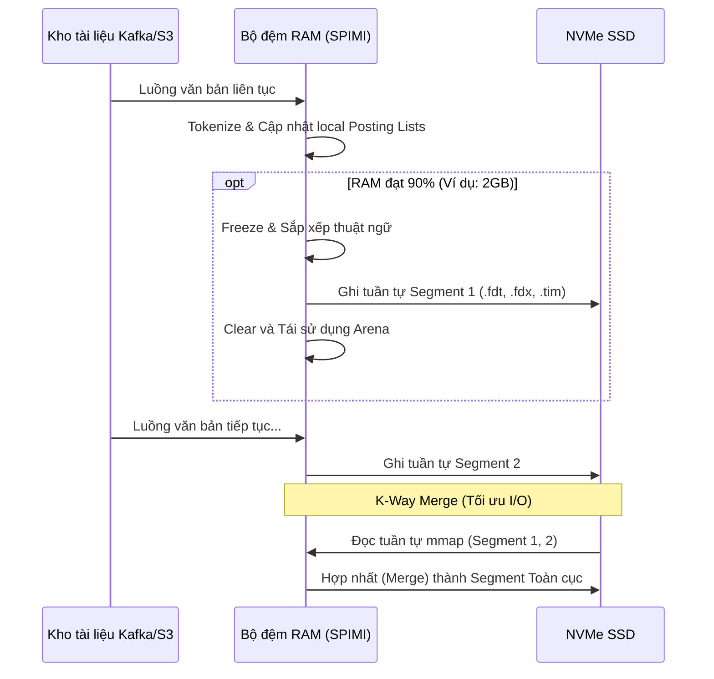

# Kiến trúc và Kỹ thuật Xây dựng Inverted Index (Chỉ mục đảo ngược) Từ Nền tảng Vi kiến trúc

## Tóm tắt điều hành

Gần như mọi công cụ tìm kiếm, nền tảng phân tích log, và phần lớn cơ sở dữ liệu hiện đại đều dựa vào cùng một cỗ máy phía sau hậu trường: **inverted index (chỉ mục đảo ngược)**. Dù là Google xếp hạng hàng tỷ trang web, Elasticsearch gom nhóm log JSON, hay Splunk lùng tìm trong hàng terabyte dấu vết ứng dụng, inverted index chính là thứ biến bài toán "tìm mọi tài liệu chứa từ này" từ một phép quét tuyến tính thành một truy vấn có độ trễ tính bằng mili-giây.

Bài viết này đi từ nền tảng toán học của inverted index cho tới các chi tiết triển khai sát phần cứng nhất. Mục tiêu không chỉ dừng ở việc giải thích inverted index là gì — điều mà rất nhiều giáo trình đã làm — mà là chỉ ra cách các kỹ sư hệ thống lách qua giới hạn vật lý của phần cứng họ đang chạy: độ trễ I/O, bức tường bộ nhớ (memory wall), và những đặc thù khó chịu của pipeline lệnh CPU hiện đại. Để một truy vấn trả về trong vài mili-giây trên kho ngữ liệu hàng tỷ tài liệu, bài toán không chỉ nằm ở thuật toán mà còn nằm ở cách khai thác phần cứng.

Nội dung phù hợp với kỹ sư hệ thống, người phát triển cơ sở dữ liệu, và kiến trúc sư phần mềm cần xây dựng hoặc suy luận về hạ tầng tìm kiếm ở quy mô lớn.

---

## Vấn đề cốt lõi

Xây dựng một hệ thống inverted index đồng nghĩa với việc đối mặt trực diện ba ràng buộc vật lý và tính toán:

1. **Bùng nổ không gian lưu trữ.** Định luật Heaps ($|\mathcal{V}| = k N^\beta$, với $\mathcal{V}$ là tập từ vựng, $N$ là tổng số token) kết hợp với định luật Zipf (tần suất một từ tỷ lệ nghịch với thứ hạng của nó) khiến một nhóm nhỏ các từ phổ biến — stop-words, hoặc thuật ngữ chuyên ngành — xuất hiện trong gần như mọi tài liệu. Nếu không được nén, các posting list tương ứng có thể vượt quá dung lượng RAM và ngốn sạch băng thông đĩa chỉ để đọc.
2. **Nút thắt I/O và bộ nhớ.** Ngay cả một ổ NVMe Gen 5 nhanh cũng có độ trễ tính bằng hàng chục đến hàng trăm micro-giây, so với vài nano-giây khi trúng L1/L2 cache. Nếu không khai thác kỹ nguyên lý locality of reference, CPU sẽ dành phần lớn thời gian chờ đợi dữ liệu từ đĩa.
3. **Chi phí ở cấp độ lệnh CPU.** Giải nén hàng tỷ document ID và thực hiện phép giao (intersection) Boolean kéo theo rất nhiều rẽ nhánh. Trên các CPU hiện đại với pipeline sâu, việc dự đoán rẽ nhánh sai (branch misprediction) kích hoạt xả ống lệnh (pipeline flush), âm thầm bào mòn hiệu năng của thuật toán xếp hạng.

---

## Kiến thức kỹ thuật chuyên sâu

### Cơ sở toán học và cấu trúc dữ liệu đa tầng

Về mặt hình thức, inverted index là một ánh xạ $I: \mathcal{V} \to 2^{\mathcal{D}}$, trong đó $\mathcal{V}$ là từ vựng và $\mathcal{D}$ là không gian tài liệu. Với mỗi thuật ngữ $t \in \mathcal{V}$, hệ thống trả về một mảng document ID — posting list $P(t) = \langle d_1, d_2, \dots, d_k \rangle$ với $d_i \in \mathcal{D}$, được giữ theo thứ tự tăng dần nghiêm ngặt: $d_1 < d_2 < \dots < d_k$. Thứ tự này không đơn thuần là chi tiết cài đặt — nó là thứ biến phép giao hai posting list thành một lượt duyệt hai con trỏ với độ phức tạp $\mathcal{O}(|P(t_1)| + |P(t_2)|)$, thay vì $\mathcal{O}(|P(t_1)| \times |P(t_2)|)$ như một vòng lặp lồng ngây thơ sẽ tạo ra.

Bộ nhớ của hệ thống gần như luôn được tách thành hai phần, mỗi phần tối ưu cho một dạng I/O khác nhau:
- **Từ điển thuật ngữ (Term Dictionary):** đủ nhỏ để nằm trọn trong RAM, cho phép tra cứu $\mathcal{O}(1)$ hoặc $\mathcal{O}(\log |\mathcal{V}|)$.
- **Tệp posting (Postings File):** quá lớn để chứa trong RAM, nên nằm trên bộ nhớ thứ cấp (SSD/HDD), chỉ nạp (page-in) những khối mà truy vấn thực sự cần thông qua memory-mapped files.

```mermaid
graph TD
    subgraph RAM_Space [Không gian Bộ nhớ Chính (RAM)]
        FST[Finite State Transducer / Term Dictionary]
        Cache[Page Cache / LRU Block Cache]
        Accumulators[Query Accumulators]
    end
    
    subgraph Disk_Space [Không gian Lưu trữ Thứ cấp (NVMe SSD)]
        Segment1[Index Segment 1]
        Segment2[Index Segment 2]
        
        subgraph Segment_Internal [Cấu trúc bên trong một Segment]
            TermIndex[Term Index / Metadata]
            Posting1[Posting List: "database"]
            Posting2[Posting List: "architecture"]
            Pos1[Positions / Offsets]
        end
    end
    
    FST -->|Chỉ ra Offset trên đĩa| TermIndex
    TermIndex -->|Pointer| Posting1
    TermIndex -->|Pointer| Posting2
    Posting1 -->|DocID liên kết| Pos1
    Segment1 -. Cấu trúc tương đương .-> Segment_Internal
    Cache -. Memory Mapping (mmap) .-> Segment1
```

### Từ điển thuật ngữ: sức mạnh của FST

Hash map thuần túy không phù hợp cho từ điển thuật ngữ — nó tốn quá nhiều RAM và không trả lời được truy vấn tiền tố kiểu `compu*`. B-Tree giải quyết được bài toán range query nhưng lại nén kém.

Đây là lý do vì sao các hệ thống thực tế như Apache Lucene chọn **Finite State Transducer (FST)** — dân kỹ sư từng làm việc với nó thường gọi đây là "chén thánh" của từ điển thuật ngữ. FST là một đồ thị có hướng phi chu trình (DAG) hoạt động như một máy trạng thái hữu hạn, chia sẻ tối đa tiền tố và hậu tố chung trên toàn bộ từ vựng. Ví dụ, các từ `moth`, `mother`, `motel`, `brother` đều dùng chung node `m-o-t` và `o-t-h-e-r`.

FST chuyển một chuỗi ký tự đầu vào thành một số nguyên trỏ tới vị trí của posting list trong bộ nhớ hoặc trên đĩa. Tính toán entropy cho thấy FST có thể nén một từ tiếng Anh trung bình từ 15-20 byte xuống còn 2-3 byte. Khác biệt đó chính là ranh giới giữa một từ điển tỷ từ cần tới hàng terabyte và một từ điển gọn gàng trong vài gigabyte RAM.

### Posting list và nghệ thuật nén dữ liệu

Xử lý một posting list hàng trăm triệu phần tử cần hai bước, thực hiện tuần tự:
1. **Mã hóa chênh lệch (Delta Encoding):** thay vì lưu DocID nguyên bản như $\langle 10, 15, 22, 105 \rangle$, ta lưu khoảng cách giữa chúng: $\Delta = \langle 10, 5, 7, 83 \rangle$. Vì danh sách chỉ tăng dần, các khoảng cách này thường nhỏ — phần lớn rơi vào khoảng 1 đến 255 — nên có thể đóng gói bằng số bit ít hơn nhiều so với một số nguyên 32-bit.
2. **Mã hóa số nguyên bit-aligned**, với vài phương án cạnh tranh nhau:
    - **Variable-Byte (VByte):** dễ triển khai, nhưng việc rẽ nhánh bit-logic liên tục khiến giải mã tốn khá nhiều chu kỳ CPU.
    - **PForDelta (Patched Frame-of-Reference Delta):** nhóm các delta thành khối cố định — chẳng hạn 128 giá trị — rồi quét từng khối để tìm số bit $b$ nhỏ nhất đủ bao phủ phần lớn giá trị (ví dụ $b=4$ bit bao phủ mọi giá trị tới 15). Các giá trị ngoại lai vượt ngưỡng đó được tách riêng và lưu trong một vùng patch nhỏ.
    - **Elias-Fano (EF):** tách mỗi số nguyên thành phần bit cao và bit thấp, lưu bit cao bằng mã unary và bit thấp dưới dạng nhị phân thô. EF cho truy cập ngẫu nhiên O(1), và trên thực tế chạy nhanh vì tận dụng lệnh phần cứng `popcnt` và `tzcnt`.

**Ví dụ giải mã PForDelta bằng SIMD trong C++:**
Nhóm delta thành các khối 128 DocID, ta có thể tận dụng AVX2/AVX-512 để giải nén cả một vector trong một chu kỳ xung nhịp, không cần một câu `if-else` nào.

```cpp
#include <immintrin.h>

// Hàm khôi phục lại DocIDs từ mảng Delta nén bằng SIMD
void simd_prefix_sum_avx2(uint32_t* deltas, uint32_t* doc_ids, size_t count) {
    __m256i offset = _mm256_setzero_si256();
    for (size_t i = 0; i < count; i += 8) {
        // Load 8 giá trị delta 32-bit vào thanh ghi AVX
        __m256i x = _mm256_loadu_si256((__m256i*)&deltas[i]);
        
        // Parallel Prefix Sum trong thanh ghi 256-bit
        x = _mm256_add_epi32(x, _mm256_slli_si256(x, 4));
        x = _mm256_add_epi32(x, _mm256_slli_si256(x, 8));
        
        // Lan truyền bù offset từ lần lặp trước
        x = _mm256_add_epi32(x, offset);
        
        // Lưu 8 DocIDs đã giải mã ra mảng kết quả
        _mm256_storeu_si256((__m256i*)&doc_ids[i], x);
        
        // Cập nhật offset cho khối 8 phần tử tiếp theo bằng broadcast phần tử cuối
        offset = _mm256_broadcastd_epi32(_mm_castsi128_si32(_mm256_extractf128_si256(x, 1)));
    }
}
```

### Kiến trúc quản lý bộ nhớ hệ điều hành và tinh chỉnh

Một chỉ mục thực tế có thể lên tới hàng trăm terabyte. Không hệ thống tìm kiếm nghiêm túc nào tự quản lý việc nạp/nhả file thủ công bằng `fread`/`fwrite`. Thay vào đó, toàn bộ kiến trúc dựa trên `mmap()`.

- **Page cache & zero-copy:** `mmap()` ánh xạ trực tiếp không gian đĩa vào địa chỉ ảo của tiến trình. Kernel sau đó dùng RAM còn trống làm page cache, và dữ liệu di chuyển từ SSD vào cache đó qua DMA mà không chạm tới CPU.
- **MADV_WILLNEED & prefetching:** gọi `madvise()` với cờ `MADV_SEQUENTIAL` hoặc `MADV_WILLNEED` báo cho OS khởi động các luồng đọc trước (read-ahead), giữ băng thông PCIe của NVMe luôn ở gần mức đỉnh GB/s thay vì để nó rảnh rỗi giữa các lượt đọc.
- **Tránh trượt TLB:** căn chỉnh các khối posting list đã nén theo ranh giới trang 4KB — hoặc dùng huge page 2MB — giúp tăng tốc việc dịch địa chỉ ảo sang vật lý, tránh phải đi qua page-table walk vốn có thể tốn hàng trăm chu kỳ CPU mỗi lần trượt.
- **NUMA awareness:** trên máy chủ đa socket, bộ nhớ gắn trực tiếp với CPU cục bộ có băng thông cao hơn hẳn so với bộ nhớ ở xa qua interconnect. Các luồng xử lý truy vấn được ghim (pin) vào những core cụ thể và chỉ được phép cấp phát RAM cục bộ qua `numactl --localalloc`, tránh việc truy cập chéo socket qua Intel UPI hay AMD Infinity Fabric.

### Xây dựng chỉ mục: SPIMI và kỹ thuật LSM-Tree

Không thể xây dựng chỉ mục bằng cách gom mọi tài liệu vào một mảng `<Term, DocID>` khổng lồ rồi gọi `sort()` — cách này cần lượng RAM $\mathcal{O}(N \log N)$ mà thực tế không có, và một khi phải swap, kiểu truy cập ngẫu nhiên đó sẽ khiến máy chủ quỵ gối.

Cách khắc phục theo chuẩn ngành là thuật toán **Single-Pass In-Memory Indexing (SPIMI)**:
1. Cấp phát một vùng nhớ lớn (memory arena) trong RAM.
2. Phân tích tài liệu và xây dựng posting list trực tiếp trong vùng nhớ đó.
3. Khi vùng nhớ đạt khoảng 90% dung lượng, đóng băng từ điển, sắp xếp theo TermID, rồi ghi toàn bộ xuống đĩa thành một segment duy nhất qua sequential I/O.
4. Lặp lại cho tới khi hết ngữ liệu.
5. Cuối cùng, chạy k-way merge để gộp toàn bộ các segment thành một chỉ mục toàn cục.


Để hỗ trợ lập chỉ mục gần thời gian thực, Elasticsearch và Lucene kết hợp SPIMI với một cấu trúc kiểu **LSM-Tree**. Các segment mới liên tục được tạo ra và có thể truy vấn ngay lập tức, trong khi các luồng nền chạy compaction — gộp các segment nhỏ thành segment lớn hơn và dọn rác những tài liệu đã bị đánh dấu xóa (tombstone).

### Xử lý truy vấn và đánh giá xếp hạng

Tại thời điểm truy vấn, đánh giá một câu như `q = "system architecture optimization"` nghĩa là duyệt posting list theo một trong hai cách: **Document-at-a-Time (DAAT)** hoặc **Term-at-a-Time (TAAT)**. DAAT thường thắng thế trong các hệ thống phân tán: nó duyệt theo chiều ngang qua từng DocID và tính trọn điểm BM25 cho mỗi tài liệu trước khi chuyển sang tài liệu tiếp theo.

Vấn đề là duyệt từng cái trong hàng triệu DocID sẽ không bao giờ đạt ngân sách độ trễ 50ms. Đây chính là khoảng trống mà **Block-Max WAND (BMW)** lấp đầy, bằng một chiến lược đặt giới hạn (bounding):
- Mỗi posting list được chia thành các khối.
- Mỗi khối mang theo metadata ghi lại điểm giới hạn trên ($U_{t,b}$) mà bất kỳ tài liệu nào trong khối đó có thể đạt được với một thuật ngữ cho trước.
- Thuật toán duy trì một danh sách Top-K (dựa trên min-heap) cùng một ngưỡng điểm $\theta$ đang chạy.
- Nếu tổng các điểm giới hạn trên của các khối hiện tại, $\sum U_{t,b}$, thấp hơn $\theta$, toàn bộ khối đó bị bỏ qua hoàn toàn — không giải mã, không chạy SIMD, chỉ nhảy thẳng tới DocID liên quan tiếp theo qua skip pointer. Một mẹo nhỏ này có thể loại bỏ tới 95% khối lượng tính toán CPU mà một phép quét ngây thơ sẽ phải làm, và đó là một phần lớn lý do các engine truy vấn thực tế cảm giác nhanh gần như tức thì.

---

## Ứng dụng thực tế và nghiên cứu tình huống

### Case Study 1: Apache Lucene và Elasticsearch

Apache Lucene — engine đứng sau cả Elasticsearch lẫn Solr — là một trong những triển khai FST sạch sẽ nhất cho từ điển thuật ngữ mà bạn có thể tìm thấy. Thay vì VByte thông thường, Lucene dùng nén số nguyên theo khối kiểu `FOR` kết hợp bit-packing chặt chẽ, và tận dụng Roaring Bitmaps (lai giữa nén mảng và run-length encoding) để tăng tốc filter cache. Kết quả là các cụm Elasticsearch dựng từ phần cứng phổ thông vẫn có thể truy vấn và gom nhóm hàng tỷ tài liệu log JSON mà không hề hụt hơi.

### Case Study 2: ClickHouse và các cơ sở dữ liệu columnar

Inverted index sinh ra cho bài toán truy xuất văn bản, nhưng các cơ sở dữ liệu OLAP dạng cột như ClickHouse cũng mượn ý tưởng này để nhúng vào các khối granule của mình. Bằng cách xây inverted index cục bộ cho các cột `string` chứa JSON hoặc tag, ClickHouse bỏ qua được việc quét toàn bảng, thu hẹp không gian tìm kiếm ngay từ đầu nhờ Bloom filter và data-skipping index.

---

## Bài học rút ra

Bóc tách kiến trúc của một inverted index, một vài bài học kỹ thuật bền vững hiện ra rõ ràng:

1. **Thiết kế phần mềm phải song hành với phần cứng.** Một thuật toán trông tối ưu trên giấy — $\mathcal{O}(N)$, gọn gàng và đẹp đẽ — vẫn có thể thua một cách tiếp cận $\mathcal{O}(N \log N)$ nhưng thân thiện với cache, tối ưu SIMD, và tránh được trượt dự đoán rẽ nhánh. Muốn khai thác tối đa một inverted index, người viết phải hiểu thực sự cách L1/L2 cache-line hoạt động, TLB là gì, và thanh ghi AVX ra sao — không chỉ dừng ở thuật toán trên bảng trắng.
2. **Đừng chống lại hệ điều hành.** Thay vì tự dựng một tầng cache riêng ở mức ứng dụng, việc tin tưởng vào page cache của Linux thông qua `mmap` và `madvise()` an toàn hơn, tận dụng RAM vật lý triệt để hơn, và giữ cho mã nguồn dễ bảo trì hơn.
3. **Đánh đổi không gian-thời gian đã đảo chiều.** Người ta từng mặc định rằng nén dữ liệu là đánh đổi thời gian giải mã lấy không gian lưu trữ nhỏ hơn. PForDelta và Elias-Fano phá vỡ giả định đó: ít dữ liệu di chuyển qua băng thông bộ nhớ hơn, và giải mã SIMD đủ nhanh để định dạng nén thường nhanh hơn chứ không chậm hơn. Nén dữ liệu và tốc độ không còn đối nghịch nhau nữa.
4. **Locality vẫn luôn thắng.** Giữ DocID theo thứ tự tăng dần nghiêm ngặt về bản chất chỉ là một ứng dụng của locality không gian. Chính lựa chọn thiết kế đơn giản đó lại là thứ cho phép duyệt hiệu quả, dùng skip pointer, và tính toán song song — nền móng mà kiến trúc inverted index đã dựa vào suốt nhiều thập kỷ, và chưa có dấu hiệu gì sẽ thay đổi.

*(Tài liệu tham khảo thêm: các bài báo SIGIR về WAND/BMW, và các nghiên cứu nén số nguyên bằng SIMD trong hệ sinh thái Apache Software Foundation.)*
