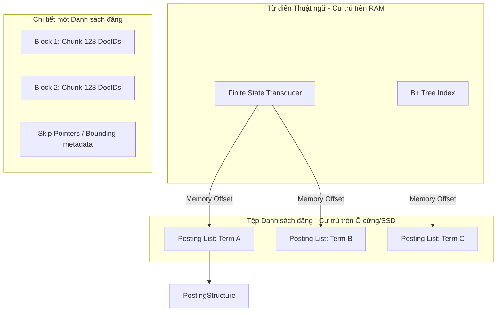
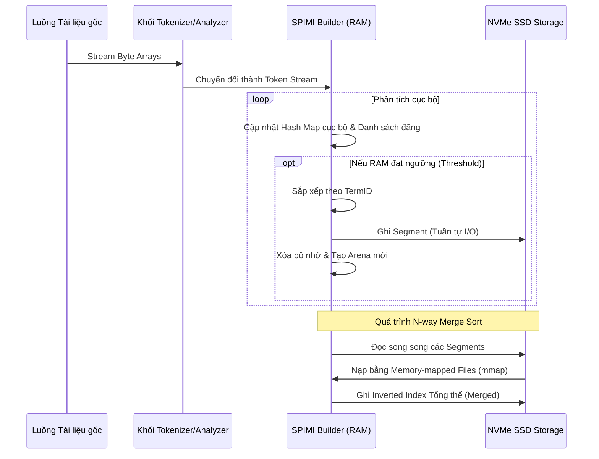

# Phân tích Chuyên sâu: Kiến trúc và Kỹ thuật Xây dựng Inverted Indexes (Chỉ mục đảo ngược) Từ Nền tảng Vi kiến trúc

## Cơ sở Lý thuyết Toán học và Cấu trúc Dữ liệu Cốt lõi

Trong lĩnh vực truy xuất thông tin (Information Retrieval) và hệ quản trị cơ sở dữ liệu văn bản, chỉ mục đảo ngược (inverted index) đại diện cho một cấu trúc dữ liệu cơ bản nhưng mang tính quyết định đến hiệu năng hệ thống. Dưới góc độ toán học, một chỉ mục đảo ngược có thể được định nghĩa là một ánh xạ $I: \mathcal{V} \to 2^{\mathcal{D}}$, trong đó $\mathcal{V}$ là tập hợp từ vựng (vocabulary) bao gồm tất cả các token phân biệt, và $\mathcal{D}$ là không gian tài liệu (document space). Đối với mỗi thuật ngữ $t \in \mathcal{V}$, hàm ánh xạ trả về một danh sách các định danh tài liệu (document identifiers - DocIDs), được gọi là danh sách đăng (posting list), ký hiệu là $P(t) = \langle d_1, d_2, \dots, d_k \rangle$ với $d_i \in \mathcal{D}$ và $d_1 < d_2 < \dots < d_k$. Sự sắp xếp đơn điệu tăng ngặt này của DocIDs trong danh sách đăng là điều kiện tiên quyết bắt buộc để tối ưu hóa thuật toán giao cắt (intersection) và hợp (union) trong quá trình xử lý truy vấn Boolean hoặc xếp hạng tài liệu. Việc lưu trữ cấu trúc dữ liệu này đòi hỏi sự phân tách rạch ròi thành hai thành phần vật lý: từ điển thuật ngữ (Term Dictionary) và tệp chứa danh sách đăng (Postings File). Từ điển thuật ngữ hoạt động như một cấu trúc chỉ mục cấp một để định vị điểm bắt đầu của danh sách đăng trên bộ nhớ thứ cấp. Để đạt được độ trễ tra cứu tiệm cận $\mathcal{O}(1)$ hoặc $\mathcal{O}(\log |\mathcal{V}|)$, các kỹ sư hệ thống thường triển khai cấu trúc Finite State Transducer (FST) hoặc B-Tree. FST là một đồ thị có hướng phi chu trình (DAG) cho phép nén tối đa các tiền tố (prefix) và hậu tố (suffix) chung của các thuật ngữ, giảm không gian lưu trữ từ điển xuống mức có thể cư trú hoàn toàn trong bộ nhớ chính (RAM) ngay cả với kho ngữ liệu lên tới hàng tỷ tài liệu. FST chuyển đổi chuỗi ký tự đầu vào thành một con trỏ địa chỉ bộ nhớ trỏ đến offset của danh sách đăng. Công thức toán học cho mức độ nén của FST phụ thuộc vào khoảng cách Levenshtein giữa các khóa, nhưng trong thực tế, tỷ lệ nén có thể đạt $1:10$ so với việc lưu trữ chuỗi thô.



Vấn đề nan giải nhất trong việc xây dựng chỉ mục đảo ngược là sự bùng nổ không gian lưu trữ của danh sách đăng, do tuân theo định luật Heaps' Law ($|\mathcal{V}| = k N^\beta$ với $N$ là số lượng token trong kho ngữ liệu) và định luật Zipf's Law (tần suất xuất hiện của từ tỷ lệ nghịch với thứ hạng của nó). Những từ có tần suất cao (stop words hoặc domain-specific common terms) tạo ra các danh sách đăng khổng lồ, tiêu thụ băng thông I/O và làm tràn bộ nhớ đệm (cache thrashing) trong phân cấp bộ nhớ của CPU. Để giải quyết vấn đề này, mã hóa chênh lệch (Delta Encoding) được áp dụng một cách nhất quán. Thay vì lưu trữ $d_i$, hệ thống chỉ lưu trữ khoảng cách $\Delta_i = d_i - d_{i-1}$, với $d_0 = 0$. Vì chuỗi DocID tăng dần, tập hợp $\Delta_i$ sẽ chứa các số nguyên dương có giá trị trung bình nhỏ, đặc biệt đối với các từ có tần suất cao. Khái niệm entropy Shannon $H(X) = - \sum p(x) \log_2 p(x)$ chỉ ra rằng các giá trị chênh lệch nhỏ này có thể được mã hóa với số bit ít hơn rất nhiều so với định dạng 32-bit hoặc 64-bit tiêu chuẩn. Các thuật toán nén số nguyên được chia thành hai trường phái chính: mã hóa mức byte/word (như Variable Byte Encoding, Simple9) và mã hóa mức bit (như Elias-Fano, PForDelta). Elias-Fano là một cấu trúc nén thanh lịch, phân chia dãy số nguyên tăng ngặt thành các bit cao (high bits) và bit thấp (low bits). Số lượng bit thấp được xác định bằng công thức $l = \lfloor \log_2(\frac{U}{n}) \rfloor$, trong đó $U$ là giá trị lớn nhất trong dãy (maximum DocID) và $n$ là số lượng phần tử. Phần bit cao được mã hóa bằng mã unary, cấu trúc này không chỉ mang lại tỷ lệ nén tiệm cận entropy lý thuyết mà còn cho phép truy cập ngẫu nhiên vào phần tử thứ $i$ trong thời gian $\mathcal{O}(1)$ thông qua các lệnh phần cứng popcount và tzcnt, hoàn toàn vượt trội so với các kỹ thuật nén yêu cầu giải mã tuần tự.

Hơn nữa, khi xem xét kiến trúc của danh sách đăng ở mức vi mô, mỗi danh sách không phải là một luồng dữ liệu phẳng mà được chia thành các khối (blocks) có kích thước cố định, thường là 128 hoặc 256 DocIDs. Mỗi khối được nén độc lập bằng PForDelta (Patched Frame-Of-Reference Delta), một biến thể của Frame-of-Reference (FOR) cho phép mã hóa hầu hết các phần tử (ví dụ: 90%) trong một khối bằng một số lượng bit cố định cực nhỏ $b$, và các giá trị ngoại lai (exceptions) lớn hơn $2^b - 1$ sẽ được lưu trong một vùng đệm riêng biệt. Kỹ thuật này triệt để khai thác tính năng thực thi song song của bộ xử lý (Instruction-Level Parallelism - ILP) và các tập lệnh SIMD (Single Instruction Multiple Data) như AVX-2 và AVX-512 trên vi kiến trúc hiện đại. Mã giải mã bằng SIMD nạp toàn bộ một thanh ghi 512-bit (chứa hàng chục giá trị DocID chênh lệch) và giải nén chúng trong vòng vài chu kỳ xung nhịp (clock cycles), đẩy tốc độ giải mã lên hàng tỷ số nguyên mỗi giây. Sự phụ thuộc dữ liệu trong quá trình khôi phục tổng tiền tố (prefix sum) từ các giá trị $\Delta$ cũng được giải quyết bằng các lệnh hoán vị (shuffle) và cộng song song trong thanh ghi SIMD, loại bỏ hoàn toàn các rẽ nhánh điều kiện (branch predictions) vốn là nguyên nhân chính gây ra hiện tượng xả ống lệnh (pipeline flush) tốn kém trong kiến trúc superscalar.

## Kiến trúc Quản lý Bộ nhớ Hệ điều hành và Thuật toán Xây dựng Chỉ mục

Quá trình xây dựng chỉ mục đảo ngược từ con số không (index construction) từ một tập ngữ liệu đồ sộ là một bài toán ràng buộc nghiêm ngặt về bộ nhớ I/O (I/O-bound problem). Thuật toán ngây thơ nhất, tạo các cặp $\langle \text{term}, \text{docID} \rangle$ và sắp xếp chúng trên toàn cục, yêu cầu không gian bộ nhớ tạm thời $\mathcal{O}(N \log N)$ và tạo ra một lượng truy cập đĩa ngẫu nhiên thảm khốc nếu dữ liệu vượt quá dung lượng RAM vật lý. Để vượt qua rào cản phần cứng này, thuật toán Block Sort-Based Indexing (BSBI) và Single-Pass In-Memory Indexing (SPIMI) được áp dụng rộng rãi. Mọi thiết kế hệ thống tối ưu đều ưu tiên SPIMI nhờ khả năng tránh duy trì một từ điển thuật ngữ toàn cục trong bộ nhớ trong quá trình duyệt tài liệu cục bộ. Thay vào đó, bộ cấp phát vùng nhớ (memory arena allocator) sẽ cấp phát các khối bộ nhớ liền kề khổng lồ. SPIMI lặp qua kho ngữ liệu, phân tích cú pháp (tokenize) và trực tiếp chèn định danh tài liệu vào các danh sách đăng mở rộng động (dynamically expanding posting lists) trong không gian bộ nhớ bị giới hạn này. Khi vùng nhớ pre-allocated đạt đến ngưỡng giới hạn (ví dụ: 90% dung lượng RAM cấu hình), SPIMI sẽ tiến hành sắp xếp từ điển cục bộ này theo thứ tự từ vựng và ghi xả (flush) toàn bộ khối cấu trúc chỉ mục ra đĩa dưới dạng một phân đoạn chỉ mục độc lập (segment). Quá trình này được lặp lại cho đến khi toàn bộ kho ngữ liệu được xử lý, tạo ra $k$ phân đoạn chỉ mục đã được sắp xếp.



Giai đoạn cuối cùng và phức tạp nhất của quy trình là hợp nhất (merge) $k$ phân đoạn này thành một chỉ mục đảo ngược toàn cục duy nhất. Quá trình hợp nhất đa đường (multi-way merge) thường sử dụng một hàng đợi ưu tiên (priority queue / min-heap) có kích thước $\mathcal{O}(k)$ để lấy ra từ vựng nhỏ nhất trên tất cả các luồng đọc. Dưới góc độ hệ điều hành (OS), việc quản lý bộ nhớ trong giai đoạn này là cực kỳ tinh tế. Thay vì sử dụng các lời gọi hệ thống chuẩn như `read()` và `write()` (dẫn đến việc sao chép dữ liệu lãng phí giữa không gian nhân (kernel space) và không gian người dùng (user space)), hệ thống sử dụng `mmap()` (memory-mapped files). Kỹ thuật `mmap()` ánh xạ nội dung tệp trên đĩa trực tiếp vào không gian địa chỉ ảo của tiến trình. Kernel thông qua bộ vi xử lý quản lý bộ nhớ (MMU) sẽ bắt lỗi thiếu trang (page faults) khi tiến trình truy cập vào một địa chỉ chưa được nạp vào bộ nhớ vật lý, từ đó kích hoạt quá trình DMA (Direct Memory Access) để kéo trang dữ liệu từ NVMe SSD vào Page Cache. Công thức xác định thông lượng I/O tổng thể phụ thuộc vào kích thước hàng đợi truy xuất (Queue Depth) và khả năng Prefetching của kernel. Bằng cách thông báo cho kernel về mẫu truy cập tuần tự thông qua `madvise(addr, length, MADV_SEQUENTIAL)`, hệ điều hành sẽ kích hoạt các luồng đọc trước (read-ahead threads) quyết liệt, làm bão hòa băng thông I/O của giao thức PCIe Gen4/Gen5 lên đến ngưỡng gigabyte mỗi giây mà không làm tắc nghẽn CPU. Ngoài ra, việc căn chỉnh cấu trúc dữ liệu theo kích thước của Cache Line (64 bytes) và Page Size (4KB hoặc Huge Pages 2MB) đóng vai trò then chốt trong việc giảm thiểu hiện tượng trượt TLB (Translation Lookaside Buffer misses). Khi bộ đệm dịch địa chỉ bị trễ, CPU phải thực hiện việc duyệt bảng trang bộ nhớ (page table walk) gồm nhiều cấp độ $\mathcal{O}(\text{Page Table Levels})$, làm tăng độ trễ truy cập lên hàng trăm chu kỳ xung nhịp. Việc cấp phát các khối danh sách đăng theo bội số của kích thước trang loại bỏ hoàn toàn rủi ro băng qua ranh giới trang (page-crossing boundary), tối đa hóa tỷ lệ trúng bộ nhớ đệm L1/L2.

Trong một hệ thống được phân tán theo thiết kế NUMA (Non-Uniform Memory Access), việc gán (pin) các tiểu trình hợp nhất chỉ mục vào các lõi CPU cụ thể và cấp phát bộ nhớ trên cùng một node NUMA cục bộ là điều kiện bắt buộc để tránh truy cập chéo qua bus liên kết (như Intel QPI hoặc AMD Infinity Fabric). Băng thông liên kết NUMA thường chỉ bằng một phần nhỏ băng thông bộ nhớ cục bộ và có độ trễ lớn hơn đáng kể. Mã nguồn ở mức hệ thống viết bằng C++ hoặc Rust sẽ sử dụng thư viện `libnuma` để đảm bảo không gian địa chỉ bộ nhớ được ánh xạ từ `mmap` thực sự được cấp phát vật lý trên ngân hàng RAM thuộc cùng zone của CPU đang tính toán giải mã nén và hợp nhất các danh sách đăng. 

## Thuật toán Xử lý Truy vấn, Vi kiến trúc và Xếp hạng Hệ thống

Khi chỉ mục đảo ngược đã được xây dựng và đóng băng thành một khối cấu trúc bất biến (immutable segments), hệ thống chuyển sang trạng thái phục vụ truy vấn (query serving). Khác biệt căn bản giữa một hệ thống học thuật và một bộ máy tìm kiếm ở cấp độ doanh nghiệp nằm ở sự xuất sắc trong khâu thực thi truy vấn. Có hai mô hình đánh giá truy vấn thống trị: Document-at-a-time (DAAT) và Term-at-a-time (TAAT). Trong DAAT, hệ thống duy trì các con trỏ (iterators) song song trên tất cả các danh sách đăng của truy vấn, tịnh tiến dần các con trỏ theo thứ tự DocID và tính toán điểm số (scoring) hoàn chỉnh cho từng tài liệu trước khi chuyển sang tài liệu tiếp theo. Ngược lại, TAAT duyệt qua toàn bộ danh sách đăng của một từ, tích lũy điểm số vào một mảng toàn cục trước khi xử lý danh sách đăng của từ tiếp theo. TAAT tối ưu hóa tính cục bộ tham chiếu trong không gian chỉ mục (spatial locality) nhưng đòi hỏi một bộ nhớ đệm cực lớn để duy trì các bộ tích lũy điểm số (accumulators), thường gây ra trượt L3 cache khi tổng số tài liệu vượt mốc hàng trăm triệu. DAAT, kết hợp với hàng đợi ưu tiên kích thước $k$ (min-heap) để theo dõi top-K tài liệu có điểm số cao nhất, tiết kiệm bộ nhớ nghiêm ngặt và là chuẩn mực trong hệ thống thực tế. Sự tinh vi của DAAT nằm ở khả năng bỏ qua (skip) các khối tài liệu khổng lồ mà không cần giải mã. Để kích hoạt tính năng này, siêu dữ liệu bỏ qua (skip pointers) được nội suy vào cấu trúc danh sách đăng. Khoảng cách lý tưởng giữa các con trỏ bỏ qua theo lý thuyết là $\sqrt{P}$ (với $P$ là độ dài danh sách đăng), cho phép hệ thống nhảy cóc từ DocID $d_a$ đến DocID $d_b \gg d_a$ trong độ phức tạp $\mathcal{O}(\sqrt{P})$ thay vì duyệt tuyến tính $\mathcal{O}(P)$.

```cpp
// Pseudocode: Cấu trúc cơ bản của Block-Max WAND (BMW) Iterator
struct BlockMaxPostingIterator {
    uint32_t current_doc;
    float max_score_in_block; // U_b: Điểm đóng góp cực đại của block
    uint32_t block_end_doc;   // DocID lớn nhất trong block hiện tại
    
    // Nạp khối mới bằng SIMD Instruction nếu cần
    void next_block() {
        // ... (SIMD PForDelta Decoding Logic) ...
    }
    
    // Kỹ thuật nhảy vọt (Skipping) tới tài liệu tiềm năng
    void advance_to_doc(uint32_t target_doc) {
        while (this->block_end_doc < target_doc) {
            next_block();
        }
        // Giải mã tuần tự bên trong khối
        decode_within_block(target_doc);
    }
};
```

Tuy nhiên, cuộc cách mạng thực sự trong xử lý truy vấn DAAT được khởi xướng bởi thuật toán Weak AND (WAND) và biến thể cấp cao của nó, Block-Max WAND (BMW). WAND là một thuật toán lấy ý tưởng từ đánh giá ngắn mạch (short-circuit evaluation), tận dụng một giới hạn trên cực đại (Upper Bound - $U_t$) của sự đóng góp điểm số mà mỗi thuật ngữ $t$ có thể mang lại cho mọi tài liệu. Trong thuật toán xếp hạng BM25 (được định nghĩa bằng phương trình toán học $S(D, Q) = \sum_{t \in Q} IDF(t) \cdot \frac{TF(t, D) \cdot (k_1 + 1)}{TF(t, D) + k_1 \cdot (1 - b + b \cdot \frac{|D|}{avgdl})}$), giá trị $U_t$ có thể được tính toán ngoại tuyến. Hàng đợi ưu tiên duy trì một giá trị ngưỡng $\theta$, đại diện cho điểm số tối thiểu để lọt vào top-K. WAND sắp xếp các con trỏ danh sách đăng hiện tại theo DocID tăng dần. Nếu tổng các giới hạn trên $U_t$ của các từ xuất hiện trong tài liệu hiện tại không vượt qua ngưỡng $\theta$ ($\sum U_t < \theta$), hệ thống kết luận chắc chắn rằng tài liệu này không bao giờ lọt vào top-K. Bằng một loạt các bước nhảy vọt (pivot selection), hệ thống trực tiếp bỏ qua việc tính toán BM25 hạng nặng và ngay lập tức advance con trỏ của các danh sách đăng đến một tài liệu tiềm năng mới. Block-Max WAND đẩy tính chất này đi xa hơn bằng cách phân chia danh sách đăng thành các khối và duy trì một giới hạn trên phụ $U_{t,b}$ cho từng khối. Do $U_{t,b} \le U_t$, khả năng tỉa bỏ (pruning) các tài liệu và giải mã khối danh sách đăng của BMW cao hơn đáng kể. Khi điều kiện Block-Max được thoả mãn, hàng loạt các lệnh I/O từ đĩa NVMe và lệnh giải mã CPU cho toàn bộ khối DocID bị ngăn chặn hoàn toàn, tiết kiệm vô số chu kỳ đồng hồ và chu kỳ năng lượng (power cycles).

Tại ngưỡng giới hạn vi kiến trúc (microarchitectural limits), nút thắt cổ chai không còn nằm ở thuật toán cấp vĩ mô mà ở mật độ rẽ nhánh điều kiện và sự thất bại dự đoán rẽ nhánh (branch misprediction penalty). Sự phân tách rõ ràng giữa giai đoạn giao cắt DAAT và giai đoạn tính toán hàm xếp hạng được trừu tượng hóa bằng mã thực thi vô hướng (scalar logic) trong các máy ảo hoặc ngôn ngữ cấp cao thường phải chịu hình phạt lên tới 15-20 chu kỳ máy cho mỗi lần trượt dự đoán rẽ nhánh trong vòng lặp `while` cực kỳ nóng của thuật toán WAND. Kỹ thuật viết lại (rewriting) logic giao cắt thành các chuỗi biểu thức logic bitwise hoặc sử dụng trực tiếp các tập lệnh vector phần cứng nhúng (intrinsic hardware vectors) như `_mm256_cmpgt_epi32` và `_mm256_movemask_ps` trong tập lệnh C/C++ AVX cho phép thực thi phép so sánh giao cắt DocIDs hoàn toàn không có lệnh rẽ nhánh điều kiện (branchless execution). Khối lượng tài liệu được tính toán không những chính xác theo nguyên tắc toán học của không gian vector thông tin mà còn đẩy hiệu suất xử lý lên tiệm cận băng thông lý thuyết tối đa của hệ thống phụ cấp phát bộ nhớ từ L1 cache của bộ vi xử lý (trên 100GB/s cho một luồng đơn), đánh dấu đỉnh cao của kỹ thuật lập trình hệ thống trong phát triển Search Engine.

## Tối ưu hóa SEO & Khám phá Kỹ thuật Bổ sung
*   **Kiến trúc Search Engine**: Tìm hiểu cách thiết kế máy chủ tìm kiếm phân tán, mở rộng quy mô với cơ sở dữ liệu NoSQL, Sharding và Replication để đáp ứng hệ thống lớn.
*   **Thuật toán nén dữ liệu**: Khám phá các định dạng nén như PForDelta, Elias-Fano, Roaring Bitmaps và cách chúng cải thiện đáng kể không gian lưu trữ và truy xuất bộ nhớ.
*   **Thuật toán xếp hạng BM25 & WAND**: Giải thích cách kỹ thuật xếp hạng top-K, tối ưu hóa quá trình duyệt truy vấn TAAT/DAAT và giảm tải CPU thông qua đánh giá Block-Max WAND.
*   **Quản lý bộ nhớ mmap & NUMA**: Cách hệ điều hành tối ưu hóa truy cập I/O thông qua Page Cache, Zero-copy I/O và sự hiểu biết về kiến trúc Non-Uniform Memory Access.
*   **SIMD Vectorization trong C++/Rust**: Tìm hiểu về tập lệnh vi kiến trúc (AVX-512) để song song hóa mã giải mã chênh lệch và tăng tốc thuật toán giao cắt không dùng rẽ nhánh.
