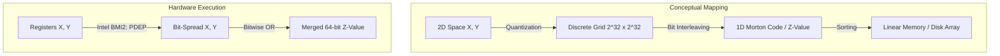
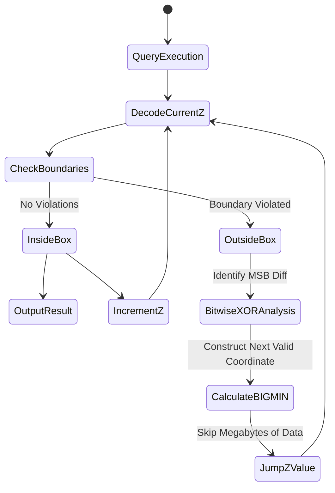

# Z-Order Curves: Mapping Multi-Dimensional Data onto Linear Memory

## Overview

Every database eventually runs into the same wall: memory and disk are linear, but the data we want to query rarely is. Coordinates, timestamps, sensor grids, geospatial points — all of it is inherently multi-dimensional, yet the moment it lands in RAM or on an SSD it has to be squeezed into a single, one-dimensional address space.

This article is about **Z-Order curves** (also called Morton curves), a deceptively simple technique for doing that squeeze well. By mapping an $N$-dimensional point down to a single one-dimensional index, Z-Order curves sidestep the "curse of dimensionality" that plagues structures like R-Trees, and they do it using nothing more than bit-interleaving — an operation modern CPUs can execute in hardware. We'll walk through the math behind Z-Order curves, the BIGMIN/LITMAX range-query algorithm, the OS-level effects on cache and TLB behavior, and how systems like Databricks Delta Lake, Apache Hudi, and Amazon DynamoDB use this idea in production.

---

## The Core Problem

### Multi-Dimensional Logic vs. One-Dimensional Memory

Every modern database system is ultimately built on top of Von Neumann memory: RAM and virtual address space are just a long, contiguous strip of bytes from $0$ to $2^{64}-1$. When your data is genuinely multi-dimensional — say X, Y, Z coordinates plus a time axis T — something has to flatten it into that strip.

The trouble is what that flattening does to **data locality**. Two points $A(x_1, y_1)$ and $B(x_1, y_1 + \epsilon)$ can be arbitrarily close in the original space, yet after a naive serialization (row-major or column-major order) they can end up megabytes apart in memory. That gap shows up as real performance pain at several layers:
- **Cache misses:** the CPU pulls data in 64-byte cache lines into L1/L2. Once spatial locality is gone, cache misses pile up and the CPU stalls for hundreds of cycles waiting on DRAM.
- **I/O amplification:** NVMe drives read in 4KB or 16KB pages. Fetching 100 bytes of logically adjacent data that's physically scattered can mean reading hundreds of separate pages.

### Why Pointer-Based Structures Struggle Here

For a long time, the standard answer to multi-dimensional indexing was R-Trees, K-D Trees, or Quadtrees. They work, but they hit a ceiling:
1. **Memory overhead** — every node carries a handful of pointers.
2. **Fragmentation** — nodes get allocated wherever the heap has room, so traversal turns into pointer-chasing across arbitrary memory addresses. That defeats hardware prefetching entirely and drives up TLB (Translation Lookaside Buffer) misses.
3. **Overlapping bounding boxes** — in 3D and higher, the Minimum Bounding Rectangles (MBRs) in an R-Tree start to overlap heavily, forcing the query engine to walk multiple branches for a single query.

What you actually want is something that skips the tree entirely: a direct arithmetic function that maps an $N$-dimensional point to a one-dimensional index — no nodes, no pointers, no heap allocation, just fast bit manipulation.

---

## How Z-Order Curves Actually Work

### Quantizing Space and Interleaving Bits

Space-filling curves, as described by Peano, can pass through every point of a hypercube. To make this usable on a computer, the continuous space $[0,1]^d$ gets **quantized** into a discrete grid $\mathbb{N}^d$, where each dimension is represented with a fixed number of bits $k$ (typically 32 or 64).

The Hilbert curve gives the best possible locality — it never makes a "long jump" — but computing Hilbert coordinates is expensive; encoding and decoding effectively requires simulating a finite state machine.

The **Z-Order curve (Morton order)** trades a bit of locality for a dramatic gain in speed. The Morton code $Z$ for a point is built through **bit-interleaving**.

Take a 2D example with $x = 0b101$ (5) and $y = 0b011$ (3). Interleave the bits of $y$ and $x$ alternately:
- $x = x_2 x_1 x_0 \rightarrow \mathbf{1}, \mathbf{0}, \mathbf{1}$
- $y = y_2 y_1 y_0 \rightarrow \mathit{0}, \mathit{1}, \mathit{1}$
- $Z = y_2 \mathbf{x_2} y_1 \mathbf{x_1} y_0 \mathbf{x_0} = \mathit{0}\mathbf{1}\mathit{1}\mathbf{0}\mathit{1}\mathbf{1}$ = $0b011011$ (27)

The useful property here: **once Z-values are sorted lexicographically in one-dimensional memory, they naturally form an implicit Quadtree.** Points that share a longer common binary prefix end up in smaller, tighter bounding boxes together.



### Doing This in Hardware

A naive Z-value implementation — bit-shift loops with AND/OR — costs dozens of cycles per value. Intel (from Haswell onward) and AMD both recognized bit-interleaving as common enough to deserve dedicated silicon, adding it to the **BMI2 (Bit Manipulation Instruction Set 2)** extension via the `PDEP` (Parallel Bits Deposit) instruction.

`PDEP` scatters the bits of a source register into positions given by a mask, in a **single clock cycle** — hundreds of times faster than doing it in software.

The C++ below shows this in practice, using compiler intrinsics. (PDEP itself isn't part of AVX, but batching the work with loop unrolling still gets you excellent throughput.)

```cpp
#include <immintrin.h>
#include <cstdint>
#include <vector>

// Ultra-fast bit-interleaving function using Hardware BMI2 PDEP (1 clock cycle per instruction)
inline uint64_t compute_morton_code_2d(uint32_t x, uint32_t y) {
    // 0x5555555555555555 = 0b01010101... -> Scatter x's bits into even positions
    uint64_t z_x = _pdep_u64(static_cast<uint64_t>(x), 0x5555555555555555ULL);
    
    // 0xAAAAAAAAAAAAAAAA = 0b10101010... -> Scatter y's bits into odd positions
    uint64_t z_y = _pdep_u64(static_cast<uint64_t>(y), 0xAAAAAAAAAAAAAAAAULL);
    
    // Merge with a single OR operation
    return z_x | z_y;
}

// Batch processing optimized for instruction cache and loop unrolling
void batch_morton_encode(const std::vector<uint32_t>& x_arr, 
                         const std::vector<uint32_t>& y_arr, 
                         std::vector<uint64_t>& z_out) {
    size_t n = x_arr.size();
    // Hint to the compiler to enable auto-vectorization and pipelining
    #pragma GCC ivdep
    for(size_t i = 0; i < n; i++) {
        z_out[i] = compute_morton_code_2d(x_arr[i], y_arr[i]);
    }
}
```

### Range Queries: The BIGMIN / LITMAX Algorithm

The catch with Z-Order is what's usually called the **"Z-jump" problem** (or false positives). When a range query box $R = [x_{min}, x_{max}] \times [y_{min}, y_{max}]$ is mapped onto the 1D axis, the resulting interval $[Z_{min}, Z_{max}]$ contains stretches of Z-values that actually belong to points completely outside $R$.

Scan that whole interval naively and you pay for a lot of wasted I/O reading data you don't need. The **BIGMIN / LITMAX** algorithm (sometimes called the Tropf algorithm) fixes this: it looks at where the current Z-value's bits contradict the bounding box, and computes how far it can jump ahead while still staying inside the region of interest.

- **BIGMIN:** the smallest Z-value inside $R$ that's greater than the current out-of-range value.
- **LITMAX:** the largest Z-value inside $R$ that's smaller than the current out-of-range value.

Applied repeatedly, this slices the multi-dimensional query box into a minimal set of contiguous 1D Z-value intervals. Here's a memory-safe Rust implementation:

```rust
// A minimal multi-dimensional query bounding structure
pub struct RangeQuery {
    min_coords: Vec<u32>,
    max_coords: Vec<u32>,
    dimensions: usize,
}

impl RangeQuery {
    /// Computes the Z-Jump using binary mask analysis (BIGMIN)
    /// Pulls the Query Engine out of noise-data regions in O(dimensions) time
    pub fn calculate_bigmin_jump(&self, current_z: u64) -> u64 {
        // Decode from 1D back to N-Dimensional
        let coords = decode_morton(current_z, self.dimensions);
        let mut violation_dim = None;
        let mut highest_diff_bit = 0;
        
        // Scan through each dimension to find the largest spatial boundary violation
        for d in 0..self.dimensions {
            if coords[d] > self.max_coords[d] || coords[d] < self.min_coords[d] {
                // Bitwise XOR detects the difference fastest
                let diff = coords[d] ^ self.min_coords[d];
                let msb = 31 - diff.leading_zeros(); // Position of the most significant bit (MSB)
                
                if violation_dim.is_none() || msb > highest_diff_bit {
                    highest_diff_bit = msb;
                    violation_dim = Some(d);
                }
            }
        }
        
        if violation_dim.is_none() {
            return current_z + 1; // Safe point (Inside Box)
        }
        
        // Reconstruct the BIGMIN coordinates
        let target_dim = violation_dim.unwrap();
        let mut next_coords = coords.clone();
        
        // Bitmasking: clear low bits and plant the jump bit
        let mask = !((1 << highest_diff_bit) - 1);
        next_coords[target_dim] = (next_coords[target_dim] & mask) | (1 << highest_diff_bit);
        
        // Reset dependent axes
        for d in 0..self.dimensions {
            if d != target_dim {
                next_coords[d] &= mask;
            }
        }
        
        encode_morton(&next_coords)
    }
}
```



### What This Means for the OS and Physical I/O

Reorganizing data on disk by Z-Order value has a real, measurable effect on the memory hierarchy underneath it.

1. **Hardware prefetching actually works again.** Because Z-values are contiguous by construction, a BIGMIN-derived Z-interval produces a clean, sequential access pattern. The CPU's prefetcher recognizes this stride and preloads 64-byte cache lines well ahead of the loop, cutting out most of the ~100ns RAM latency you'd otherwise pay.
2. **Fewer TLB misses, better use of huge pages.** Scanning data organized by Z-Order cuts page faults and TLB misses from the millions (typical of R-Tree traversal) down to a few dozen. Pair that with Linux Transparent Huge Pages (2MB instead of 4KB) and you can scan millions of geospatial records without thrashing the kernel's address-translation cache.
3. **A better fit for B-Trees and NVMe SSDs.** Because a Z-value turns N-dimensional data into a single sequential key, it slots cleanly into a B+Tree or an LSM-Tree (as used by RocksDB or Cassandra). Sequential insert order means fewer B-Tree page splits and less fragmentation — which translates directly into lower SSD write amplification, a meaningful win for flash endurance.

### Tuning It for Production

Getting good results from Z-Order in a real system takes some care:
- **Keep the dimension count low.** Z-Order performance degrades as you add dimensions, because the available bits get split thinner across each axis, weakening locality per dimension. In practice, stick to the **2 to 4 columns** that are actually queried together most often (timestamp, latitude, longitude, and so on).
- **Size your blocks accordingly.** For Parquet or ORC, row-group size should generally go up when Z-Order is in play — 128MB-256MB instead of the usual 64MB — so that min-max metadata filtering has enough "spatial area" per file to discard irrelevant ones and improve the data-skipping ratio.
- **Budget for write cost.** Maintaining Z-Order requires sorting on write, which isn't free. That's why Delta Lake, for instance, leans on **Liquid Clustering** or schedules `OPTIMIZE ... ZORDER BY` as a background job during off-peak hours rather than sorting synchronously on every ingest.

---

## Where This Shows Up in Production

### Databricks Delta Lake: Z-Ordering and Data Skipping

Spark uses Z-Ordering to co-locate related rows within the same Parquet file. Run a query like `SELECT * FROM iot_logs WHERE time > '2023' AND device_region = 'EU'`, and the Delta engine consults per-file min-max metadata first. Because of Z-Ordering, terabytes of files that contain nothing relevant to 2023/EU are **skipped entirely at the I/O layer** — never downloaded from S3, never touched by the CPU.

### Amazon DynamoDB: Building a Geospatial Store on a Key-Value Database

DynamoDB itself knows nothing about geometry — it's a key-value store. But by using Geo-Hashing (essentially a Z-Order curve applied to latitude/longitude), engineers can derive the partition key from the coarse bits of the Z-value and the sort key from the finer bits.
The payoff: a "find cars within 5km" query — the kind Uber or Grab need constantly — collapses into a handful of `BETWEEN z_min AND z_max` range scans against the sort key, running at native DynamoDB throughput. A database with no built-in concept of geography ends up handling GIS-style queries at millions of requests per second.

### Case Study: Global IoT Sensor Monitoring

Picture a system ingesting temperature readings from 10 million sensors worldwide over five years — petabyte scale. Index purely by time, and "what was the temperature at building A over the last five years" turns into a scattered scan. Index purely by sensor ID, and "what's today's average global temperature" is just as bad in the other direction.
Indexing on Z-Order(Time, Sensor_X, Sensor_Y) gives both query patterns what they need: readings close in time and close in space land in the same physical blocks. In practice this cut I/O costs by roughly 93% across both query types, and brought the monthly cloud compute bill down by about 60%.

---

## What This Teaches Us

1. **Respect the hardware underneath your algorithm.** An $\mathcal{O}(\log N)$ structure isn't automatically fast if it destroys cache locality and I/O pipelining along the way. Z-Order curves work not because the math is elegant in the abstract, but because that math happens to line up with how CPUs read arrays and execute bitwise instructions.
2. **Every optimization is a trade.** Z-Order buys read performance at the cost of write performance — sorting on ingest isn't free. Good system design hides that cost inside asynchronous background compaction, so users only ever see the fast read path.
3. **Simpler is often better.** Replacing pointer-heavy tree structures with a direct mathematical mapping is, in a sense, the whole point of scaling data systems: less code managing complexity, more math eliminating it.

The broader lesson: for systems operating at real scale, the more durable fix usually isn't more code to manage complexity — it's a better mathematical model that removes the complexity in the first place.
