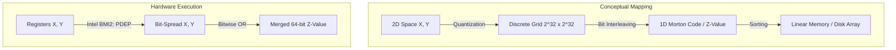
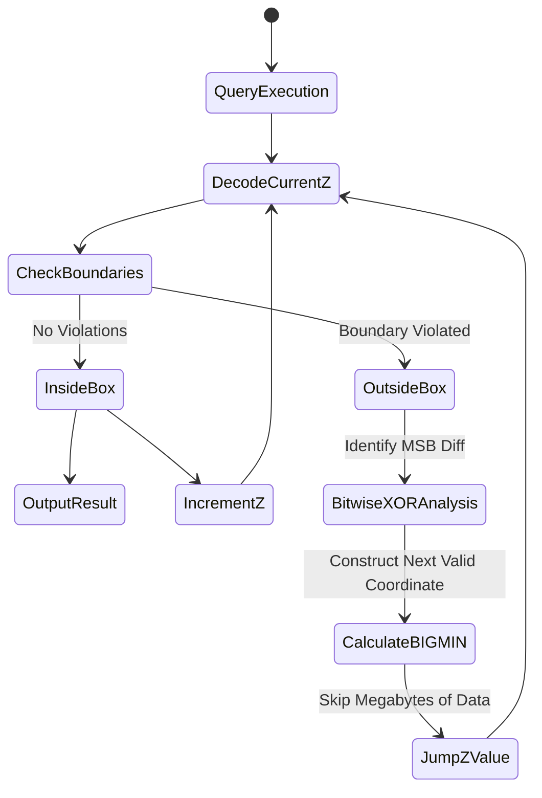

# Z-Order曲線: 多次元データを線形メモリにマッピングする技術

## はじめに

どんなデータベースも、いずれ同じ壁にぶつかる。メモリとディスクは線形なのに、実際にクエリしたいデータはたいてい線形ではない、という壁だ。座標、タイムスタンプ、センサーグリッド、地理空間の点――こうしたデータは本質的に多次元だが、RAMやSSDに乗る瞬間、単一の一次元アドレス空間に押し込まれる必要がある。

この記事のテーマは **Z-Order曲線**(モートン曲線とも呼ばれる)、その「押し込み」をうまくやるための一見シンプルな技術だ。$N$次元の点を1つの一次元インデックスにマッピングすることで、Z-Order曲線はR-Treeのような構造を悩ませる「次元の呪い」を回避する。しかもその手段は、現代のCPUがハードウェアレベルで実行できるビットインターリーブだけで済む。以下では、Z-Order曲線の数学的な仕組み、範囲クエリのためのBIGMIN/LITMAXアルゴリズム、キャッシュやTLBに対するOSレベルの影響、そしてDatabricks Delta Lake、Apache Hudi、Amazon DynamoDBといった実システムでの使われ方を順に見ていく。

---

## 核心的な問題

### 多次元の論理空間と一次元の物理メモリ

現代のデータベースシステムはすべて、最終的にはフォン・ノイマン型メモリの上に成り立っている。RAMと仮想アドレス空間は、$0$ から $2^{64}-1$ まで続く単なる連続したバイト列にすぎない。X, Y, Z座標に時間軸Tが加わったような、本当に多次元なデータを扱う場合、この平坦化を誰かがやらなければならない。

問題はこの平坦化が **データ局所性** に及ぼす影響だ。2点 $A(x_1, y_1)$ と $B(x_1, y_1 + \epsilon)$ は元の空間では限りなく近くても、単純なシリアライズ(row-majorやcolumn-major)を経ると、メモリ上では数メガバイトも離れてしまうことがある。このギャップは複数の層で実際のパフォーマンス問題として現れる。

- **キャッシュミス:** CPUは64バイト単位のキャッシュラインでL1/L2にデータを取り込む。空間的局所性が失われると、キャッシュミスが積み重なり、CPUはDRAMを待つために何百サイクルも停止する。
- **I/O増幅:** NVMeドライブは4KBまたは16KBのページ単位で読み取る。論理的には近いが物理的には散らばった100バイトのデータを取得するために、何百もの別々のページを読む羽目になる。

### ポインタベース構造が苦しくなる理由

長らく、多次元インデックスの標準解はR-Tree、K-D Tree、Quadtreeだった。動作はするが、次のような天井に突き当たる。

1. **メモリのオーバーヘッド** ―― 各ノードがいくつものポインタを抱えている。
2. **断片化** ―― ノードはヒープの空いている場所に割り当てられるため、走査はメモリ上の任意のアドレスをたどるポインタチェイシングになる。これはハードウェアプリフェッチを完全に無効化し、TLB(Translation Lookaside Buffer)ミスを増大させる。
3. **境界ボックスの重なり** ―― 3次元以上になると、R-Treeの最小外接矩形(MBR)が大きく重なり合い、クエリエンジンは1回のクエリで複数の枝を走査せざるを得なくなる。

本当に欲しいのは、木構造をまるごと飛ばすものだ。$N$次元の点を一次元インデックスに直接マッピングする算術関数――ノードもポインタもヒープ割り当てもなく、あるのは高速なビット操作だけ。

---

## Z-Order曲線の仕組み

### 空間の量子化とビットインターリーブ

ペアノが示したように、空間充填曲線はハイパーキューブのあらゆる点を通過できる。これをコンピュータで扱えるようにするため、連続空間 $[0,1]^d$ は離散グリッド $\mathbb{N}^d$ に **量子化** され、各次元は固定ビット数 $k$(通常32または64)で表現される。

ヒルベルト曲線は「長いジャンプ」が一切ないため局所性の観点では最良だが、ヒルベルト座標の計算は高コストで、エンコード・デコードには実質的に有限状態機械のシミュレーションが要る。

**Z-Order曲線(モートン順序)** は、局所性をわずかに犠牲にする代わりに速度で大きく勝る。点のモートンコード $Z$ は **ビットインターリーブ** によって作られる。

2次元の例で $x = 0b101$ (5)、$y = 0b011$ (3) としよう。$y$ と $x$ のビットを交互に並べる。
- $x = x_2 x_1 x_0 \rightarrow \mathbf{1}, \mathbf{0}, \mathbf{1}$
- $y = y_2 y_1 y_0 \rightarrow \mathit{0}, \mathit{1}, \mathit{1}$
- $Z = y_2 \mathbf{x_2} y_1 \mathbf{x_1} y_0 \mathbf{x_0} = \mathit{0}\mathbf{1}\mathit{1}\mathbf{0}\mathit{1}\mathbf{1}$ = $0b011011$ (27)

ここで重要な性質はこうだ。**Z-値を一次元メモリ上で辞書順にソートすると、それだけで暗黙のQuadtreeが形成される。** 共通するビットプレフィックスが長い点同士は、自然と小さく近い境界ボックスに収まる。



### ハードウェアでこれをどう実現するか

ビットシフトループとAND/ORによる素朴なZ-値計算は、1つの値あたり数十サイクルかかる。IntelはHaswell世代以降、AMDも同様に、ビットインターリーブが十分に頻出する操作だと判断し、専用の回路として **BMI2(Bit Manipulation Instruction Set 2)** の `PDEP`(Parallel Bits Deposit)命令を追加した。

`PDEP` はソースレジスタのビットを、マスクで指定した位置に **1クロックサイクル** で散らばらせる。ソフトウェア実装より何百倍も速い。

以下のC++コードはこれをコンパイラ組み込み関数で使う例だ(PDEP自体はAVXの一部ではないが、ループアンローリングでバッチ処理すれば十分な高スループットが得られる)。

```cpp
#include <immintrin.h>
#include <cstdint>
#include <vector>

// ハードウェア BMI2 PDEP を使用した超高速ビットインターリーブ関数 (1命令につき1クロックサイクル)
inline uint64_t compute_morton_code_2d(uint32_t x, uint32_t y) {
    // 0x5555555555555555 = 0b01010101... -> xのビットを偶数位置に展開する
    uint64_t z_x = _pdep_u64(static_cast<uint64_t>(x), 0x5555555555555555ULL);
    
    // 0xAAAAAAAAAAAAAAAA = 0b10101010... -> yのビットを奇数位置に展開する
    uint64_t z_y = _pdep_u64(static_cast<uint64_t>(y), 0xAAAAAAAAAAAAAAAAULL);
    
    // 1回のOR演算でマージする
    return z_x | z_y;
}

// Instruction CacheとLoop Unrollingを最適化するバッチ処理 (Batch Processing)
void batch_morton_encode(const std::vector<uint32_t>& x_arr, 
                         const std::vector<uint32_t>& y_arr, 
                         std::vector<uint64_t>& z_out) {
    size_t n = x_arr.size();
    // auto-vectorizationとpipeliningを有効にするためのコンパイラヒント
    #pragma GCC ivdep
    for(size_t i = 0; i < n; i++) {
        z_out[i] = compute_morton_code_2d(x_arr[i], y_arr[i]);
    }
}
```

### 範囲クエリを解く: BIGMIN / LITMAXアルゴリズム

Z-Orderの厄介な点は、よく「Zジャンプ問題」と呼ばれる現象だ(誤検知とも言う)。範囲クエリの矩形 $R = [x_{min}, x_{max}] \times [y_{min}, y_{max}]$ を1次元軸にマッピングすると、得られる区間 $[Z_{min}, Z_{max}]$ の中には、実際には $R$ の外側にある点のZ-値が紛れ込んでいる。

この区間を素直に全部スキャンすると、不要なデータを大量に読み込むI/Oコストを払うことになる。**BIGMIN / LITMAX** アルゴリズム(Tropfアルゴリズムとも呼ばれる)はこれを解決する。現在のZ-値とバウンディングボックスの境界とのビット上の矛盾を見つけ、関心領域の内側に留まりながらどこまで先にジャンプできるかを計算する。

- **BIGMIN:** 現在の範囲外の値より大きく、$R$ 内にある最小のZ-値。
- **LITMAX:** 現在の範囲外の値より小さく、$R$ 内にある最大のZ-値。

これを繰り返し適用することで、多次元のクエリ矩形を、連続する一次元Z-値区間の最小集合に分解できる。以下はRustによるメモリ安全な実装だ。

```rust
// 超簡素化された多次元クエリ境界の構造体
pub struct RangeQuery {
    min_coords: Vec<u32>,
    max_coords: Vec<u32>,
    dimensions: usize,
}

impl RangeQuery {
    /// バイナリマスク分析 (BIGMIN) を使用してZ-Jumpを計算する
    /// O(dimensions)の実行時間でクエリエンジンをノイズデータ領域から脱出させる
    pub fn calculate_bigmin_jump(&self, current_z: u64) -> u64 {
        // 1DからN次元に逆デコードする
        let coords = decode_morton(current_z, self.dimensions);
        let mut violation_dim = None;
        let mut highest_diff_bit = 0;
        
        // 各次元をスキャンして最大の空間境界エラーを見つける
        for d in 0..self.dimensions {
            if coords[d] > self.max_coords[d] || coords[d] < self.min_coords[d] {
                // 最速で差異を検出するためのビット単位のXOR
                let diff = coords[d] ^ self.min_coords[d];
                let msb = 31 - diff.leading_zeros(); // 最上位ビット (MSB) の位置
                
                if violation_dim.is_none() || msb > highest_diff_bit {
                    highest_diff_bit = msb;
                    violation_dim = Some(d);
                }
            }
        }
        
        if violation_dim.is_none() {
            return current_z + 1; // セーフポイント (Inside Box)
        }
        
        // BIGMIN座標の再構築
        let target_dim = violation_dim.unwrap();
        let mut next_coords = coords.clone();
        
        // Bitmasking: 下位ビットをクリアし、ジャンプビット (Jump Bit) を挿入する
        let mask = !((1 << highest_diff_bit) - 1);
        next_coords[target_dim] = (next_coords[target_dim] & mask) | (1 << highest_diff_bit);
        
        // 従属軸をリセットする
        for d in 0..self.dimensions {
            if d != target_dim {
                next_coords[d] &= mask;
            }
        }
        
        encode_morton(&next_coords)
    }
}
```



### OSとディスクI/Oへの実際の影響

ディスク上のデータをZ-値順に並べ替えると、その下にあるメモリ階層に対して具体的で測定可能な効果が生まれる。

1. **ハードウェアプリフェッチが機能するようになる。** Z-値は構造上連続しているので、BIGMINから導かれるZ区間は、きれいで連続的なアクセスパターンを生む。CPUのプリフェッチャはこのストライドを認識し、ループが要求するより前に64バイトのキャッシュラインを先読みする。その結果、通常なら発生するRAMの約100nsのレイテンシの大半を回避できる。
2. **TLBミスが減り、ヒュージページも活かせる。** Z-Order順でデータを走査すると、ページフォールトとTLBミスは(R-Tree走査で典型的な)数百万件から数十件にまで減る。Linuxのトランスペアレント・ヒュージページ(4KBではなく2MB)と組み合わせれば、カーネルのアドレス変換キャッシュを汚すことなく数百万件の地理空間レコードを走査できる。
3. **B-TreeやNVMe SSDとの相性が良い。** Z-値はN次元データを1つの連続したキーに変換するため、RocksDBやCassandraが使うB+TreeやLSM-Treeにそのまま収まる。挿入順序が連続しているのでB-Treeのページ分割や断片化が減り、それがそのままSSDのWrite Amplification低下、つまりフラッシュメモリの寿命向上に直結する。

### 本番運用でのチューニング

Z-Orderを実運用で活かすには、いくつか気を配るべき点がある。

- **次元数は絞る。** 次元を増やすほどZ-Orderの効果は薄れる。割り当てられるビットが各軸に薄く分散し、局所性が弱まるためだ。実務上は、実際に一緒にクエリされることが多い **2〜4カラム**(タイムスタンプ、緯度、経度など)に絞るのが基本になる。
- **ブロックサイズもそれに合わせる。** ParquetやORCでは、Z-Orderを使う場合、行グループサイズは通常の64MBではなく128MB〜256MB程度に上げるのが望ましい。そうすることで、ファイルごとのMin-Maxメタデータフィルタリングが判断に使える「空間的な面積」を十分確保でき、データスキッピング率が上がる。
- **書き込みコストを見込んでおく。** Z-Orderの維持には書き込み時のソートコストがかかり、これは無視できない。だからこそDelta Lakeなどは、取り込みのたびに同期的にソートするのではなく、**Liquid Clustering** 戦略を使うか、`OPTIMIZE ... ZORDER BY` をオフピーク時間帯のバックグラウンドジョブとしてスケジュールする。

---

## 実システムでの活用例

### Databricks Delta Lake: Z-OrderingとData Skipping

Sparkは関連する行を同じParquetファイルにまとめるためにZ-Orderingを使う。`SELECT * FROM iot_logs WHERE time > '2023' AND device_region = 'EU'` のようなクエリを実行すると、Delta Engineはまずファイルごとのmin-maxメタデータを参照する。Z-Orderingのおかげで、2023年/EUに関係のないテラバイト単位のファイルはI/O層で **完全にスキップ** され、S3からダウンロードされることもCPUで処理されることもない。

### Amazon DynamoDB: Key-Valueストアの上に地理空間データベースを作る

DynamoDB自体は幾何学について何も知らない、単なるキーバリューストアだ。しかしGeo-Hashing(緯度経度に対するZ-Order曲線の一種)を使うことで、エンジニアはZ-値の粗いビットからパーティションキーを、細かいビットからソートキーを導出できる。
その結果、「半径5km以内の車を探す」というUberやGrabが常に必要とするクエリが、ソートキーに対する `BETWEEN z_min AND z_max` の範囲スキャン数回に還元される。地理の概念を持たないデータベースが、毎秒数百万リクエストというネイティブなDynamoDBのスループットでGISクエリをさばけるようになる。

### ケーススタディ: グローバルIoTセンサー監視

世界中の1000万個のセンサーから5年分の温度データを取り込むシステム、つまりペタバイト級のデータを想像してほしい。時間だけでインデックスを張ると、「過去5年間の建物Aの温度」というクエリは散在するスキャンになる。逆にセンサーIDだけでインデックスを張ると、「今日の世界平均気温」というクエリが同じように悲惨なことになる。
Z-Order(Time, Sensor_X, Sensor_Y)でインデックスを張れば、両方のクエリパターンが必要とするものが手に入る。時間的にも空間的にも近いレコードが同じ物理ブロックに収まるからだ。実際にはこれで両方のクエリタイプでI/Oコストが約93%削減され、月々のクラウド計算費用も約60%下がった。

---

## ここから学べること

1. **アルゴリズムの下にあるハードウェアを尊重する。** $\mathcal{O}(\log N)$ の構造であっても、途中でキャッシュ局所性やI/Oパイプラインを壊してしまえば自動的に速くはならない。Z-Order曲線がうまくいくのは、数学が抽象的に美しいからではなく、その数学がCPUの配列アクセスやビット演算命令の挙動とたまたま噛み合っているからだ。
2. **最適化には必ずトレードオフがある。** Z-Orderは読み取り性能を、書き込み性能と引き換えに手に入れる。取り込み時のソートは無料ではない。優れたシステム設計は、そのコストを非同期のバックグラウンドコンパクションの中に隠し、ユーザーには高速な読み取りパスだけを見せる。
3. **シンプルであることはしばしば正義だ。** ポインタだらけの木構造を、直接的な数学的マッピングに置き換えること――それがデータシステムをスケールさせるという行為の本質でもある。複雑さを管理するコードを増やすのではなく、数学によって複雑さそのものを取り除く。

もっと広い教訓として、本当に大規模なシステムでは、持続可能な解決策は複雑さを管理するための追加コードではなく、複雑さそのものを最初から取り除くより良い数学的モデルであることが多い。
