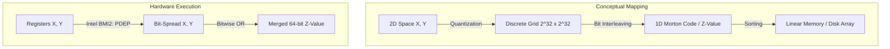
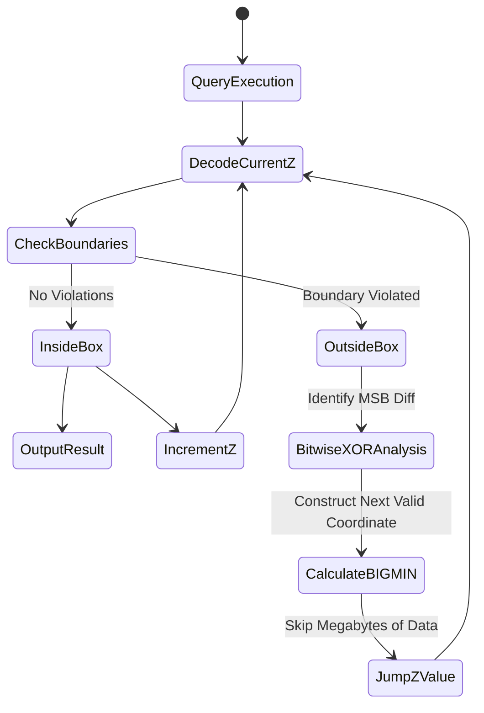

# Z-Order Curves và Kiến Trúc Bộ Nhớ Trong Quản Lý Truy Vấn Đa Chiều

## Tóm tắt điều hành

Bất kể dữ liệu được biểu diễn dưới dạng đồ thị, ma trận đa chiều, hay tọa độ địa lý, một khi nó được nạp vào RAM hoặc ghi xuống SSD/HDD, nó buộc phải bị ép thành một dải bộ nhớ tuyến tính một chiều. Đó là giới hạn vật lý mà mọi hệ thống lưu trữ hiện đại phải đối mặt, và cách bạn giải quyết bài toán này quyết định phần lớn hiệu năng truy vấn đa chiều ở quy mô lớn.

Bài viết này đi sâu vào **Z-Order Curves (đường cong Morton)** — một dạng đường cong lấp đầy không gian (space-filling curve) đã định hình lại cách các hệ thống lưu trữ phân tán tổ chức dữ liệu đa chiều. Bằng cách ánh xạ không gian $N$ chiều về một trục số một chiều, Z-Order Curves né được phần lớn "lời nguyền đa chiều" (curse of dimensionality) vốn làm khổ các cấu trúc dữ liệu truyền thống như R-Tree, đồng thời khai thác triệt để băng thông bộ nhớ ở mức vi kiến trúc thông qua thao tác bit-interleaving chạy thẳng trên phần cứng. Nội dung đi từ nền tảng toán học, cơ chế tối ưu hóa hệ điều hành, thuật toán BIGMIN/LITMAX, cho tới các case study thực tế trên Databricks Delta Lake, Apache Hudi và Amazon DynamoDB.

---

## Vấn đề cốt lõi

### Nghịch lý giữa không gian luận lý đa chiều và bộ nhớ vật lý đơn chiều

Giới hạn gốc rễ của mọi hệ cơ sở dữ liệu hiện đại nằm ở kiến trúc bộ nhớ Von Neumann. RAM và không gian địa chỉ ảo là một dải byte liên tiếp trải từ địa chỉ $0$ đến $2^{64}-1$. Khi cần xử lý dữ liệu đa chiều — chẳng hạn tọa độ X, Y, Z kết hợp với trục thời gian T — hệ thống buộc phải tuần tự hóa chúng theo cách nào đó.

Việc tuần tự hóa này gây ra **mất tính cục bộ dữ liệu**. Trong không gian đa chiều, hai điểm $A(x_1, y_1)$ và $B(x_1, y_1 + \epsilon)$ có thể gần nhau đến mức không đáng kể, nhưng khi ánh xạ tuần tự kiểu row-major hay column-major, khoảng cách vật lý giữa chúng trong bộ nhớ có thể bị kéo dãn ra hàng megabyte. Hậu quả xuất hiện ở nhiều tầng khác nhau:
- **Cache miss:** CPU nạp dữ liệu vào L1/L2 cache theo từng cache line 64 byte. Khi tính cục bộ không gian biến mất, CPU liên tục gặp cache miss, tốn hàng trăm chu kỳ đồng hồ chờ DRAM phản hồi.
- **I/O amplification:** trên ổ NVMe, dữ liệu được đọc theo trang 4KB hoặc 16KB. Để lấy 100 byte dữ liệu gần nhau về mặt không gian nhưng nằm rải rác về mặt vật lý, hệ thống buộc phải đọc hàng trăm trang khác nhau.

### Sự đổ vỡ của các cấu trúc dữ liệu dựa trên con trỏ

Trong nhiều thập kỷ, cơ sở dữ liệu xử lý không gian đa chiều bằng R-Tree, K-D Tree hoặc Quadtree. Nhưng các cấu trúc này đều vấp phải những nút thắt khó gỡ:
1. **Lãng phí bộ nhớ:** mỗi node trên cây phải giữ hàng loạt con trỏ.
2. **Phân mảnh bộ nhớ (memory fragmentation):** các node được cấp phát ngẫu nhiên trên heap, biến việc duyệt cây thành chuỗi thao tác "pointer-chasing" ngẫu nhiên khắp bộ nhớ, làm mất tác dụng của hardware prefetching và kéo theo tỷ lệ TLB miss rất cao.
3. **MBR chồng lấn:** ở số chiều lớn — từ 3 chiều trở lên — các vùng bao tối thiểu (Minimum Bounding Rectangle) trong R-Tree chồng lấn lên nhau đáng kể, buộc query engine phải duyệt qua nhiều nhánh cây cùng lúc.

Để thoát khỏi giới hạn này, điều cần thiết là một hàm ánh xạ thuần túy toán học: không node, không con trỏ, không cấp phát bộ nhớ động — chỉ là các phép toán số học cực nhanh, biến điểm $N$ chiều thành một chỉ mục một chiều.

---

## Kiến thức kỹ thuật chuyên sâu

### Rời rạc hóa không gian và toán học của Z-Order Curves

Dựa trên nền tảng định lý Peano, một đường cong lấp đầy không gian có thể trải qua và phủ kín mọi điểm của một khối siêu lập phương. Để máy tính xử lý được, không gian liên tục $[0,1]^d$ được **lượng tử hóa** thành một lưới rời rạc $\mathbb{N}^d$, với mỗi chiều bị giới hạn bởi một số bit cố định $k$ (thường là 32-bit hoặc 64-bit).

Đường cong Hilbert bảo toàn tính cục bộ không gian tốt hơn — vì nó không có những "bước nhảy dài" — nhưng việc mã hóa/giải mã tọa độ Hilbert lại tốn kém đáng kể về CPU, đòi hỏi mô phỏng máy trạng thái hữu hạn khá phức tạp.

**Z-Order Curve (Morton Order)** đi theo hướng khác: đánh đổi một chút tính cục bộ để lấy tốc độ mã hóa gần như tức thì. Mã Morton $Z$ của một điểm được tạo ra bằng phép **xen kẽ bit (bit-interleaving)** đơn giản đến mức có thể thực hiện tĩnh.

Ví dụ trong không gian 2D, với $x = 0b101$ (5) và $y = 0b011$ (3):
Z-value được tạo bằng cách xen kẽ lần lượt bit của $y$ và $x$:
- $x = x_2 x_1 x_0 \rightarrow \mathbf{1}, \mathbf{0}, \mathbf{1}$
- $y = y_2 y_1 y_0 \rightarrow \mathit{0}, \mathit{1}, \mathit{1}$
- $Z = y_2 \mathbf{x_2} y_1 \mathbf{x_1} y_0 \mathbf{x_0} = \mathit{0}\mathbf{1}\mathit{1}\mathbf{0}\mathit{1}\mathbf{1}$ = $0b011011$ (27)

Thuộc tính hình học đáng chú ý của Z-value là: **khi các Z-value được sắp xếp theo thứ tự từ điển trong bộ nhớ một chiều, chúng tự động dựng lên một cây Quadtree ngầm định.** Các điểm có tiền tố nhị phân chung càng dài thì càng nằm trong những ô không gian nhỏ hơn, gần nhau hơn.



### Chuyển đổi mã ở mức vi kiến trúc

Mã hóa Z-value bằng vòng lặp dịch bit thủ công cùng AND/OR tốn hàng chục chu kỳ clock. Nhận ra tầm quan trọng của bit-interleaving, Intel (từ thế hệ Haswell) và AMD đã đưa tập lệnh **BMI2 (Bit Manipulation Instruction Set 2)** vào vi kiến trúc lõi, với lệnh `PDEP` (Parallel Bits Deposit) là trung tâm.

Lệnh `PDEP` rải các bit của thanh ghi nguồn vào các vị trí do một mask nhị phân quy định, chỉ trong một chu kỳ xung nhịp — nhanh hơn cách làm bằng phần mềm tới hàng trăm lần.

Đoạn C++ dưới đây tận dụng intrinsics của trình biên dịch kết hợp với kỹ thuật xử lý theo lô (dù `PDEP` không nằm trong tập AVX, việc unroll vòng lặp vẫn mang lại hiệu năng đáng kể):

```cpp
#include <immintrin.h>
#include <cstdint>
#include <vector>

// Hàm xen kẽ bit siêu tốc sử dụng Hardware BMI2 PDEP (1 chu kỳ xung nhịp mỗi lệnh)
inline uint64_t compute_morton_code_2d(uint32_t x, uint32_t y) {
    // 0x5555555555555555 = 0b01010101... -> Rải bit của x vào vị trí chẵn
    uint64_t z_x = _pdep_u64(static_cast<uint64_t>(x), 0x5555555555555555ULL);
    
    // 0xAAAAAAAAAAAAAAAA = 0b10101010... -> Rải bit của y vào vị trí lẻ
    uint64_t z_y = _pdep_u64(static_cast<uint64_t>(y), 0xAAAAAAAAAAAAAAAAULL);
    
    // Hợp nhất trong 1 phép toán OR duy nhất
    return z_x | z_y;
}

// Xử lý hàng loạt (Batch Processing) tối ưu hóa Instruction Cache và Loop Unrolling
void batch_morton_encode(const std::vector<uint32_t>& x_arr, 
                         const std::vector<uint32_t>& y_arr, 
                         std::vector<uint64_t>& z_out) {
    size_t n = x_arr.size();
    // Hint cho compiler để kích hoạt auto-vectorization và pipelining
    #pragma GCC ivdep
    for(size_t i = 0; i < n; i++) {
        z_out[i] = compute_morton_code_2d(x_arr[i], y_arr[i]);
    }
}
```

### Tối ưu hóa truy vấn đa chiều bằng thuật toán BIGMIN / LITMAX

Vấn đề lớn nhất của Z-Order là **bước nhảy sai (Z-jump)**. Khi một truy vấn dạng hộp $R = [x_{min}, x_{max}] \times [y_{min}, y_{max}]$ được ánh xạ xuống trục một chiều từ $Z_{min}$ đến $Z_{max}$, sẽ có những đoạn Z-value nằm giữa khoảng đó nhưng thực tế lại thuộc một vùng không gian hoàn toàn khác, nằm ngoài $R$.

Nếu quét trọn vẹn đoạn $[Z_{min}, Z_{max}]$, hệ thống sẽ phải đọc rất nhiều dữ liệu vô ích. Thuật toán **BIGMIN / LITMAX** (hay thuật toán Tropf) giải quyết đúng vấn đề này — nó phân tích sự sai lệch bit giữa Z-value hiện tại và giới hạn bounding box để tính ra điểm nhảy xa nhất có thể, bỏ qua toàn bộ dữ liệu dư thừa.

- **BIGMIN:** Z-value nhỏ nhất nằm trong $R$ mà vẫn lớn hơn Z-value ngoại lai hiện tại.
- **LITMAX:** Z-value lớn nhất nằm trong $R$ mà vẫn nhỏ hơn Z-value ngoại lai hiện tại.

Về bản chất, thuật toán này cắt một hình chữ nhật đa chiều thành một tập hợp tối thiểu các dải Z-value một chiều liên tục. Dưới đây là một cách hiện thực bằng Rust:

```rust
// Cấu trúc giới hạn truy vấn đa chiều siêu tinh giản
pub struct RangeQuery {
    min_coords: Vec<u32>,
    max_coords: Vec<u32>,
    dimensions: usize,
}

impl RangeQuery {
    /// Tính toán Z-Jump sử dụng phân tích Mask nhị phân (BIGMIN)
    /// Đưa Query Engine thoát khỏi vùng nhiễu (noise data) trong thời gian O(dimensions)
    pub fn calculate_bigmin_jump(&self, current_z: u64) -> u64 {
        // Decode từ 1D ngược về N-Dimensional
        let coords = decode_morton(current_z, self.dimensions);
        let mut violation_dim = None;
        let mut highest_diff_bit = 0;
        
        // Càn quét qua từng chiều để tìm lỗi biên không gian lớn nhất
        for d in 0..self.dimensions {
            if coords[d] > self.max_coords[d] || coords[d] < self.min_coords[d] {
                // Bitwise XOR phát hiện sự khác biệt nhanh nhất
                let diff = coords[d] ^ self.min_coords[d];
                let msb = 31 - diff.leading_zeros(); // Vị trí bit trọng số cao nhất (MSB)
                
                if violation_dim.is_none() || msb > highest_diff_bit {
                    highest_diff_bit = msb;
                    violation_dim = Some(d);
                }
            }
        }
        
        if violation_dim.is_none() {
            return current_z + 1; // Điểm an toàn (Inside Box)
        }
        
        // Tái tạo tọa độ BIGMIN
        let target_dim = violation_dim.unwrap();
        let mut next_coords = coords.clone();
        
        // Bitmasking: Xóa bit thấp và cấy bit nhảy (Jump Bit)
        let mask = !((1 << highest_diff_bit) - 1);
        next_coords[target_dim] = (next_coords[target_dim] & mask) | (1 << highest_diff_bit);
        
        // Reset các trục phụ thuộc
        for d in 0..self.dimensions {
            if d != target_dim {
                next_coords[d] &= mask;
            }
        }
        
        encode_morton(&next_coords)
    }
}
```



### Quản lý bộ nhớ hạt nhân và I/O vật lý của hệ điều hành

Việc dùng Z-Order để sắp xếp lại dữ liệu trên đĩa tác động mạnh tới toàn bộ **memory hierarchy** của hệ điều hành.

1. **Hardware prefetching phát huy tối đa:** nhờ Z-value liên tục, mỗi khi thuật toán BIGMIN đẩy ra một khoảng Z-interval, hệ thống tạo ra một luồng truy cập tuần tự rất sạch. Bộ hardware prefetcher của vi xử lý nhận diện dễ dàng kiểu truy cập tuyến tính này (stride prediction) và nạp trước hàng loạt khối 64 byte vào L1/L2 cache trước cả khi vòng lặp yêu cầu tới, gần như xóa sổ độ trễ bộ nhớ từ RAM (thường quanh 100ns).
2. **Huge Pages & giảm TLB miss:** cấu trúc Z-Order lướt ngang trên bộ nhớ khiến page fault và TLB miss giảm từ mức hàng triệu (như ở R-Tree) xuống chỉ còn vài chục. Kết hợp với Linux Transparent Huge Pages (trang 2MB thay vì 4KB), engine dữ liệu có thể trích xuất hàng triệu bản ghi không gian địa lý mà không làm ô nhiễm bộ đệm dịch địa chỉ ảo của kernel.
3. **Căn chỉnh B-Tree & NVMe SSD:** Z-value biến dữ liệu N chiều thành một chuỗi primary key một chiều rất phù hợp để chèn vào B+Tree hoặc LSM-Tree của RocksDB/Cassandra. Vì không gian khóa đã tuần tự, thao tác insert tránh được hiện tượng phân mảnh node (page split), kéo theo **write amplification trên SSD giảm đáng kể** — điều quan trọng với tuổi thọ của bộ nhớ flash.

### Cấu hình và tối ưu tham số

Triển khai Z-Order trong production đòi hỏi cân bằng tham số khá tinh tế:
- **Giới hạn số cột (cardinality):** Z-Order sẽ loãng hiệu năng nếu dùng quá nhiều chiều, vì số bit bị chia nhỏ khiến tính cục bộ của từng chiều yếu đi. Thực tế nên chỉ áp dụng Z-Order cho **2 đến 4 cột** được truy vấn thường xuyên nhất — ví dụ timestamp, latitude, longitude.
- **Kích thước khối (block size):** với các định dạng như Parquet hay ORC, row group size nên được scale lên khi dùng Z-Order. Thay vì 64MB tiêu chuẩn, cấu hình 128MB-256MB giúp cơ chế Min-Max Metadata Filtering của Parquet có đủ "diện tích" không gian để loại bỏ các tệp không hợp lệ, tăng tỷ lệ data skipping.
- **Chi phí bảo trì:** duy trì trạng thái Z-Order kéo theo chi phí sắp xếp (sorting) không nhỏ ở pha ghi. Vì vậy các hệ thống như Delta Lake dùng chiến lược **Liquid Clustering**, hoặc lên lịch chạy `OPTIMIZE ... ZORDER BY` như một tác vụ nền vào giờ thấp điểm, thay vì sắp xếp ngay khi ingest dữ liệu.

---

## Ứng dụng thực tế

### Databricks Delta Lake: Z-Ordering & Data Skipping

Apache Spark dùng Z-Ordering để gom các dữ liệu liên quan vào cùng một tệp Parquet. Khi một truy vấn SQL như `SELECT * FROM iot_logs WHERE time > '2023' AND device_region = 'EU'` chạy, Delta Engine sẽ đọc metadata chứa khoảng giá trị của từng tệp. Nhờ Z-Ordering, hàng terabyte tệp không chứa dữ liệu khu vực EU và năm 2023 sẽ bị **bỏ qua hoàn toàn ở mức I/O từ Amazon S3**, không tốn một chu kỳ mạng hay CPU nào để tải xuống.

### Amazon DynamoDB: hệ thống dữ liệu không gian địa lý từ nền tảng NoSQL phẳng

Về bản chất DynamoDB chỉ là cơ sở dữ liệu key-value. Nhưng bằng cách dùng Geo-Hashing (một dạng Z-Order Curve áp dụng riêng cho latitude/longitude), kỹ sư có thể tạo Primary Partition Key từ độ phân giải thấp của Z-value, và Sort Key từ độ phân giải cao hơn.
Kết quả là các truy vấn tìm xe Uber/Grab trong bán kính 5km được dịch thành vài truy vấn `BETWEEN z_min AND z_max` chạy quét tuần tự cực nhanh trên Sort Key của DynamoDB — biến một cơ sở dữ liệu phi không gian thành kho dữ liệu GIS xử lý được hàng triệu request mỗi giây.

### Case study: hệ thống giám sát cảm biến IoT (spatio-temporal)

Hình dung một hệ thống lưu nhiệt độ của 10 triệu cảm biến toàn cầu trong 5 năm — dữ liệu quy mô petabyte. Nếu đánh index theo thời gian, truy vấn "tìm nhiệt độ ở tòa nhà A trong 5 năm" sẽ phải duyệt rải rác khắp đĩa. Nếu đánh index theo Sensor_ID, truy vấn "tìm nhiệt độ trung bình toàn cầu hôm nay" lại trở thành thảm họa.
Với Z-Order(Time, Sensor_X, Sensor_Y), hệ thống đạt được điểm cân bằng khá lý tưởng. Dữ liệu gần nhau về thời gian và không gian được gom vào cùng khối vật lý, giảm 93% chi phí I/O đọc cho cả hai loại truy vấn, đồng thời cắt khoảng 60% hóa đơn điện toán đám mây hàng tháng.

---

## Bài học rút ra

1. **Thuật toán phải hiểu rõ giới hạn phần cứng.** Một thuật toán O(log N) không có nhiều giá trị nếu nó phá vỡ cache hierarchy và làm sập I/O pipelining. Điểm mạnh thực sự của Z-Order Curves không nằm ở vẻ đẹp toán học topology thuần túy, mà ở chỗ nó "khớp" gần như hoàn hảo với cấu trúc bộ nhớ vật lý dạng mảng và các tập lệnh bitwise của CPU.
2. **Không có bữa trưa miễn phí — chỉ có đánh đổi hợp lý.** Z-Order tối ưu cực mạnh ở khâu đọc/truy vấn, nhưng bắt hệ thống trả giá đáng kể ở khâu ghi/bảo trì. Thiết kế hệ thống dữ liệu hiện đại phần lớn là nghệ thuật giấu độ trễ ghi vào các tiến trình chạy nền bất đồng bộ, để người dùng cuối chỉ cảm nhận được tốc độ đọc gần như tức thì.
3. **Tinh giản thắng phức tạp.** Từ bỏ các cấu trúc dữ liệu nặng con trỏ để chuyển sang những hàm toán học ánh xạ trực tiếp là hướng đi mà kỷ nguyên Big Data đang dần đi tới.

Z-Order Curves minh chứng cho một điều khá cơ bản trong kỹ thuật phần mềm: giải pháp bền vững nhất cho một hệ thống quy mô siêu lớn thường không phải là viết thêm code để quản lý sự phức tạp, mà là dùng nền tảng toán học đủ sâu để loại bỏ phần lớn sự phức tạp đó ngay từ gốc.
