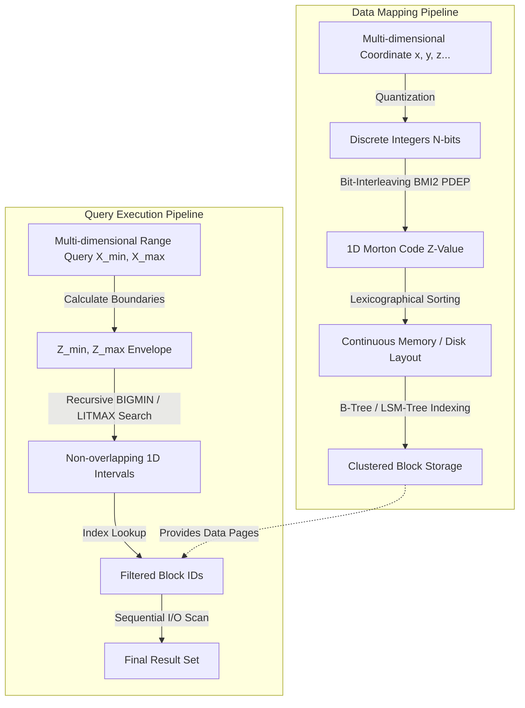
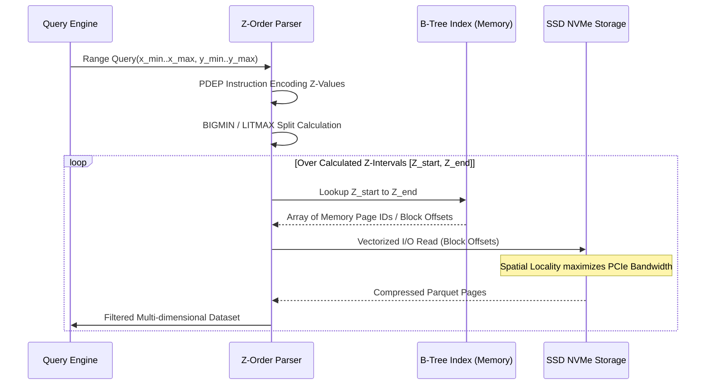

# Z-Order Curves và Kiến Trúc Bộ Nhớ Trong Quản Lý Truy Vấn Đa Chiều

Việc lưu trữ và truy xuất dữ liệu đa chiều luôn tồn tại một giới hạn vật lý căn bản bắt nguồn từ cấu trúc tuyến tính của bộ nhớ máy tính. Bất kể dữ liệu được mô hình hóa trong không gian toán học có số chiều là bao nhiêu, khi được nạp vào bộ nhớ động (RAM) hoặc ghi xuống các thiết bị lưu trữ phi biến đổi (SSD, HDD), chúng bắt buộc phải được tuần tự hóa thành một chuỗi byte tuyến tính một chiều. Sự sai lệch giữa cấu trúc luận lý đa chiều của dữ liệu và cấu trúc vật lý một chiều của bộ nhớ gây ra hiện tượng mất cục bộ dữ liệu (loss of data locality), từ đó làm tăng đáng kể các thao tác truy cập bộ nhớ không liền kề và gây trượt bộ nhớ cache (cache miss) ở mọi cấp độ của hệ thống phân cấp bộ nhớ. Trong bối cảnh các hệ quản trị cơ sở dữ liệu xử lý lượng dữ liệu khổng lồ, việc tối ưu hóa truy vấn đa chiều như truy vấn khoảng (range queries) hoặc truy vấn điểm gần nhất (nearest neighbor queries) không chỉ dừng lại ở các cấu trúc dữ liệu dạng cây như R-Tree hay K-D Tree, mà còn đòi hỏi các kỹ thuật ánh xạ trực tiếp và bảo toàn tính liền kề không gian. Space-filling curves, đặc biệt là Z-Order Curves (đường cong Morton), cung cấp một nền tảng toán học vững chắc để thực hiện phép biến đổi toàn ánh từ không gian đa chiều về không gian một chiều trong khi vẫn duy trì tối đa khoảng cách địa lý tương đối giữa các điểm dữ liệu. Việc ứng dụng các đường cong lấp đầy không gian này giúp giảm thiểu chi phí tìm kiếm, thu hẹp không gian duyệt dữ liệu, và khai thác triệt để băng thông của phần cứng thông qua các tập lệnh hỗ trợ xử lý bit mức vi kiến trúc.

## Cơ Sở Toán Học và Kiến Trúc Của Space-Filling Curves

Một đường cong lấp đầy không gian (space-filling curve) là một hàm liên tục từ đoạn thẳng một chiều $[0, 1]$ lên một siêu khối đa chiều không gian liên tục $[0, 1]^d$, trong đó $d$ là số chiều của không gian. Theo định lý Peano, tồn tại một hàm toàn ánh và liên tục ánh xạ từ đoạn thẳng đơn vị lên một hình vuông đơn vị, phá vỡ trực giác thông thường về tính bảo toàn số chiều trong cấu trúc tô-pô. Để áp dụng lý thuyết này vào cấu trúc dữ liệu rời rạc trên máy tính, không gian liên tục được rời rạc hóa thành một mạng lưới tọa độ hữu hạn với độ phân giải cụ thể, thường được giới hạn bởi độ dài từ ngữ của vi xử lý như 32-bit hoặc 64-bit cho mỗi chiều dữ liệu. Một hàm rời rạc ánh xạ tọa độ điểm trong không gian $d$ chiều $\mathbb{N}^d$ sang một chỉ số một chiều $\mathbb{N}$ được biểu diễn toán học dưới dạng $f: (x_1, x_2, \dots, x_d) \mapsto z$. Mục tiêu thiết yếu của hàm ánh xạ này là cực tiểu hóa độ dịch chuyển trong không gian một chiều cho các điểm gần nhau trong không gian $d$ chiều, hay nói cách khác là bảo toàn tính cục bộ không gian (spatial locality). Trong họ các đường cong lấp đầy không gian, đường cong Hilbert cung cấp tính bảo toàn cục bộ không gian tốt nhất vì nó hoàn toàn tránh được các bước nhảy xa nhờ vào cơ chế xây dựng dựa trên phép xoay và lật hình. Mặc dù đường cong Hilbert được sử dụng rộng rãi trong các hệ thống thông tin địa lý (GIS) và đồ họa máy tính, quá trình mã hóa tọa độ $d$ chiều thành chỉ số Hilbert và quá trình giải mã ngược lại cực kỳ tốn kém về mặt tài nguyên xử lý trung tâm (CPU). Thuật toán chuyển đổi Hilbert đòi hỏi các phép toán điều kiện phức tạp, các thao tác mô phỏng máy trạng thái hữu hạn, và sự phụ thuộc dữ liệu tuần tự làm cản trở quá trình thực thi song song của hệ thống ống lệnh (pipeline) bên trong vi xử lý hiện đại.

Để giải quyết nút thắt cổ chai về mặt tính toán của đường cong Hilbert, hệ thống cơ sở dữ liệu quy mô lớn thiên về việc sử dụng Z-Order Curves, còn được gọi là thứ tự Morton. Phương pháp Z-Order curve đạt được sự cân bằng hoàn hảo giữa tính bảo toàn không gian và tốc độ mã hóa cực cao ở mức vi kiến trúc. Thay vì sử dụng các cỗ máy trạng thái phức tạp, giá trị Morton (Z-value) của một điểm dữ liệu trong hệ tọa độ $d$ chiều được tính toán trực tiếp bằng cách xen kẽ các bit (bit-interleaving) của các thành phần tọa độ. Cụ thể, giả sử chúng ta có một điểm trong không gian hai chiều $(x, y)$, trong đó tọa độ $x$ và $y$ được biểu diễn bằng các số nguyên $k$-bit. Nếu biểu diễn nhị phân của $x$ là $x_{k-1}x_{k-2}\dots x_0$ và $y$ là $y_{k-1}y_{k-2}\dots y_0$, thì giá trị Z-Order tương ứng sẽ là một số nguyên $2k$-bit có dạng $z = y_{k-1}x_{k-1}y_{k-2}x_{k-2}\dots y_0x_0$. Cơ chế xen kẽ bit này chuyển đổi mọi phép so sánh đa chiều phức tạp thành một phép so sánh số học tuyến tính đơn giản trên giá trị $z$. Khi hai điểm có phần tiền tố nhị phân (binary prefix) của Z-value càng dài giống nhau, chúng càng nằm chung trong một siêu khối nhỏ hơn của không gian phân hoạch không gian đệ quy. Quá trình tính toán Z-value có thể được thực thi bằng mã giả mã hóa bit thủ công sử dụng các phép dịch bit (bit shift) và phép logic (bitwise AND/OR), tuy nhiên kỹ thuật này tiêu tốn nhiều chu kỳ máy (clock cycles) đối với không gian có độ phân giải lớn. Do đó, các kiến trúc phần cứng máy chủ hiện đại, như kiến trúc tập lệnh Intel x86-64 BMI2 (Bit Manipulation Instruction Set 2), cung cấp các lệnh vi kiến trúc phần cứng chuyên biệt để thực hiện trực tiếp xen kẽ bit. Lệnh `PDEP` (Parallel Bits Deposit) cho phép sắp xếp lại các bit của một thanh ghi theo một mặt nạ bit bất kỳ chỉ trong một chu kỳ xung nhịp duy nhất. Bằng cách sử dụng hai lệnh `PDEP` cho tọa độ $x$ và $y$ với các mặt nạ xen kẽ tương ứng như `0x55555555` và `0xAAAAAAAA`, và kết hợp kết quả bằng lệnh bitwise OR, quá trình tính toán Z-value diễn ra nhanh hơn hàng trăm lần so với thuật toán Hilbert truyền thống. Mức độ hiệu quả này biến Z-Order Curves trở thành xương sống của các giải pháp lập chỉ mục dữ liệu trong kho dữ liệu đám mây lớn như Amazon Redshift, Databricks Delta Lake, và Apache Hudi.

Dưới đây là một đoạn mã C++ minh họa cách sử dụng phần cứng BMI2 của bộ vi xử lý để tính toán Morton Code cực nhanh. Mã nguồn này khai thác tính năng nội tại (intrinsic function) `_pdep_u32` do trình biên dịch GCC hoặc Clang cung cấp, trực tiếp ánh xạ xuống các lệnh mã máy tối ưu.

```cpp
#include <immintrin.h>
#include <cstdint>

// Hàm xen kẽ các bit của hai số nguyên 32-bit (x, y) để tạo ra Z-value 64-bit.
// Yêu cầu phần cứng CPU hỗ trợ kiến trúc BMI2 (như vi kiến trúc Intel Haswell trở lên).
inline uint64_t compute_morton_code_2d(uint32_t x, uint32_t y) {
    // Sử dụng lệnh PDEP (Parallel Deposit) với các mặt nạ (mask) xen kẽ nhau.
    // Mặt nạ cho trục x: chỉ phân tách các bit vào các vị trí chẵn (bit 0, 2, 4...)
    uint64_t z_x = _pdep_u64(static_cast<uint64_t>(x), 0x5555555555555555ULL);
    
    // Mặt nạ cho trục y: chỉ phân tách các bit vào các vị trí lẻ (bit 1, 3, 5...)
    uint64_t z_y = _pdep_u64(static_cast<uint64_t>(y), 0xAAAAAAAAAAAAAAAAULL);
    
    // Kết hợp các bit đã được dàn đều bằng toán tử OR để tạo chuỗi Z-Order 64-bit hoàn chỉnh.
    return z_x | z_y;
}
```

Kiến trúc cây phân hoạch không gian mà Z-Order Curves tạo ra có hình thái của một Quad-tree (cho không gian hai chiều) hoặc Octree (cho không gian ba chiều), được triền khai ngầm định thông qua biểu diễn nhị phân. Mỗi bit chẵn lẻ xen kẽ trên Z-value tương ứng với một lần chia đôi không gian theo một chiều tuần tự. Không giống như các cấu trúc dữ liệu con trỏ phân cấp vốn tiêu thụ lượng lớn bộ nhớ để lưu trữ liên kết giữa các nút, Z-Order curve cho phép hệ thống biểu diễn không gian mà không cần cấu trúc cây tường minh, gọi là kỹ thuật trỏ lấp đầy (pointerless trees). Các đối tượng đa chiều trong không gian được biểu diễn dưới dạng các điểm hoặc các hộp bao cơ sở (Minimum Bounding Boxes - MBB). Trong trường hợp các đối tượng có hình dạng phức tạp và chiếm thể tích lớn, việc gán cho đối tượng một Z-value duy nhất thuộc tâm điểm có thể gây ra hiện tượng giảm sút tính cục bộ, do đó hệ thống có xu hướng phân rã đối tượng thành nhiều phân đoạn nhỏ hơn, mỗi phân đoạn tương ứng với một Z-value của độ phân giải chi tiết hơn. Đổi lại, việc phân rã này làm gia tăng sự trùng lặp dữ liệu trên các nút lá. Mặc dù tồn tại hiện tượng nhảy Z-curve (bước nhảy dài trong không gian một chiều đối với các điểm gần nhau nhưng cách biệt qua ranh giới phân hoạch vĩ mô), tính hiệu quả tính toán nội tại vượt trội của Z-value vẫn bù đắp dư thừa sự tiêu tốn chu kỳ cho việc giải quyết các bước nhảy này bằng phương pháp duyệt qua điểm cận kề.



## Tối Ưu Hóa Truy Vấn Đa Chiều Bằng Z-Order Curves

Thách thức tối thượng trong các hệ quản trị dữ liệu quy mô hàng petabyte (như Apache Spark SQL kết hợp với cơ sở dữ liệu cột) là giải quyết bài toán bỏ qua dữ liệu (data skipping). Việc đọc toàn bộ bảng dữ liệu không được phân cụm từ lưu trữ đám mây Amazon S3 luôn dẫn đến chi phí I/O và chi phí mạng không thể chấp nhận được. Kỹ thuật chia vùng dữ liệu cơ bản (partitioning) như phân hoạch theo năm, tháng, ngày chỉ giải quyết được các truy vấn có độ chọn lọc cao dọc theo trục thời gian, và hoàn toàn vô hiệu đối với các truy vấn kết hợp (conjunction queries) lọc trên nhiều thuộc tính khác nhau, ví dụ lọc theo cả thời gian và không gian địa lý. Nếu dữ liệu chỉ được sắp xếp trên đĩa dựa trên duy nhất một thuộc tính, các truy vấn trên các thuộc tính còn lại sẽ phải duyệt toàn bộ (full table scan) vì không có độ bảo toàn thứ tự nào cho các cột thứ cấp. Đây là nơi kỹ thuật lập cụm bằng Z-Order Curves (Z-Ordering clustering) phát huy uy lực. Thông qua việc ánh xạ tất cả các thuộc tính dùng trong phép lọc thành các trục của một siêu khối không gian ảo đa chiều, sau đó sắp xếp vật lý toàn bộ các bản ghi theo Z-value tổng hợp, hệ thống tạo ra một sơ đồ phân bổ dữ liệu bảo vệ tính quần thể cho mọi thuộc tính liên quan đồng thời. Kỹ thuật này dẫn đến một sự thỏa hiệp bình đẳng về mặt toán học: không có thuộc tính nào được sắp xếp hoàn hảo một cách độc lập, nhưng mọi thuộc tính đều duy trì mức độ cục bộ tuyến tính cực cao, cho phép bộ lọc tệp tin như Parquet hoặc ORC tận dụng các khối siêu dữ liệu (min-max metadata blocks) để loại trừ triệt để hàng loạt gigabyte dữ liệu trước khi chúng được đưa vào bộ nhớ.

Khi thực hiện một truy vấn khoảng (range query) có dạng $R = [x_{min}, x_{max}] \times [y_{min}, y_{max}]$, động cơ truy vấn không tìm kiếm bằng cách thực thi hai phép duyệt cây độc lập và thực hiện phép giao tập hợp (set intersection) như trong kỹ thuật lập chỉ mục thứ cấp truyền thống. Thay vào đó, bộ tối ưu hóa truy vấn biến đổi trực tiếp siêu hình chữ nhật (hyper-rectangle) truy vấn $R$ thành một tập hợp các đoạn tuyến tính một chiều dọc theo Z-Order curve. Hàm bao lồi của các Z-value giới hạn không gian truy vấn luôn trải dài từ điểm $Z_{min}$ tương ứng với $(x_{min}, y_{min})$ đến điểm $Z_{max}$ tương ứng với $(x_{max}, y_{max})$. Tuy nhiên, bên trong đoạn tuyến tính $[Z_{min}, Z_{max}]$ có vô số các "điểm ngoại lai" nằm ngoài vùng không gian $R$ thuộc các nhánh khác của Z-curve xâm nhập vào. Để giải quyết vấn đề lọc thô dư thừa này, hệ thống áp dụng các thuật toán tính toán bước nhảy phức tạp, tiêu biểu nhất là thuật toán "BIGMIN / LITMAX" (hoặc thuật toán Tropf). Giải thuật này hoạt động dựa trên cơ chế tìm kiếm nhị phân thông minh trên không gian Z-value để xác định chính xác các điểm rời rạc của đường cong cắt ngang ra khỏi và quay trở lại vào trong vùng chữ nhật $R$. Tại bất kỳ Z-value nào đang xét, thuật toán phân tích sự mâu thuẫn bit giữa giới hạn truy vấn và Z-value hiện tại, xác định bit trọng số cao nhất gây ra sự vi phạm không gian, và từ đó tính toán ngay lập tức điểm nhảy xa nhất (LITMAX cho phía trên, BIGMIN cho phía dưới) để bỏ qua hoàn toàn chuỗi dài các điểm không hợp lệ mà không cần kiểm tra từng tọa độ. Sự can thiệp toán học này thu hẹp kích thước tập kết quả ứng viên theo cấp số nhân, biên dịch một truy vấn không gian $d$ chiều thành một nhóm tối thiểu các truy vấn khoảng 1 chiều liên tục.

Cấu trúc logic của thuật toán BIGMIN/LITMAX để phân hoạch không gian và tính toán khoảng bỏ qua trên Z-Order Curve đòi hỏi xử lý sâu vào cấp độ phân tích từ ngữ nhị phân. Các hàm đánh giá được triển khai theo ngôn ngữ Rust như dưới đây minh họa quá trình tính toán giá trị tiếp theo vượt qua khoảng nhiễu, khai thác triệt để toán tử bitwise an toàn về kiểu dữ liệu. Sự an toàn bộ nhớ tĩnh của Rust ngăn ngừa hiện tượng rò rỉ bộ nhớ hoặc lỗi off-by-one trong quá trình phân tích Z-curve đệ quy vô hạn trên các khung dữ liệu mảng byte.

```rust
// Định nghĩa một ranh giới khoảng truy vấn đa chiều bằng tọa độ cực hạn
pub struct RangeQuery {
    min_coords: Vec<u32>,
    max_coords: Vec<u32>,
    dimensions: usize,
}

impl RangeQuery {
    /// Tính toán bước nhảy Z-value (BIGMIN) tiếp theo hợp lệ bên trong vùng truy vấn, 
    /// nhằm bỏ qua hàng triệu bản ghi không nằm trong RangeQuery mà không cần quét tuần tự.
    pub fn calculate_next_z_jump(&self, current_z: u64) -> u64 {
        let mut next_z = current_z;
        // Bóc tách Z-value một chiều thành các thành phần tọa độ đa chiều
        let coords = decode_morton_code(current_z, self.dimensions);
        
        let mut violation_dim = None;
        let mut max_diff_bit = 0;
        
        // Xác định chiều dữ liệu gây ra sự sai lệch không gian và vị trí bit vi phạm cao nhất
        for d in 0..self.dimensions {
            if coords[d] > self.max_coords[d] || coords[d] < self.min_coords[d] {
                // Tính toán sự khác biệt bit sử dụng toán tử XOR
                let diff = coords[d] ^ self.min_coords[d];
                let msb = 31 - diff.leading_zeros(); // Vị trí bit trọng số cao nhất (MSB)
                if violation_dim.is_none() || msb > max_diff_bit {
                    max_diff_bit = msb;
                    violation_dim = Some(d);
                }
            }
        }
        
        // Nếu điểm hiện tại hoàn toàn nằm trong khung truy vấn, tiến tới điểm liền kề.
        if violation_dim.is_none() {
            return current_z + 1;
        }
        
        // Tái tạo lại Z-value mới bằng cách thay đổi bit trọng số cao nhất của chiều vi phạm, 
        // buộc đường cong lấp đầy không gian quay trở lại vùng chứa hình hộp bao.
        let target_dim = violation_dim.unwrap();
        let mut new_coords = coords.clone();
        
        // Xóa tất cả các bit thấp hơn bit vi phạm và thiết lập điểm đầu vào mới
        let mask = !((1 << max_diff_bit) - 1);
        new_coords[target_dim] = (new_coords[target_dim] & mask) | (1 << max_diff_bit);
        for d in 0..self.dimensions {
            if d != target_dim {
                new_coords[d] &= mask;
            }
        }
        
        encode_morton_code(&new_coords)
    }
}
```

Các bộ tạo truy vấn hiện đại (query generators) sử dụng chuỗi phân đoạn 1 chiều được xuất ra từ thuật toán trên để tương tác trực tiếp với các định dạng tệp lưu trữ hoặc với tầng lưu trữ Key-Value (chẳng hạn như RocksDB lưu trữ siêu dữ liệu Z-value dưới dạng khóa nhị phân sắp xếp theo từ điển). Phương pháp tiếp cận này làm cho các hệ thống như DynamoDB của Amazon hoặc Apache Cassandra có khả năng phục vụ dữ liệu địa lý mặc dù chúng không hề cung cấp tính năng bản đồ dữ liệu không gian nguyên sinh. Chỉ bằng cách cung cấp chuỗi truy vấn khóa theo phạm vi từ Z-min đến Z-max, kỹ sư hoàn toàn có thể biến một cấu trúc dữ liệu NoSQL phẳng thành một siêu hệ thống phân tích không gian phân tán. Điều này đã cách mạng hóa thiết kế vi dịch vụ về mảng lưu trữ khi sự tách biệt giữa thuật toán lập chỉ mục (ở tầng ứng dụng) và lưu trữ gốc (ở tầng hạ tầng) đem lại khả năng mở rộng đàn hồi hoàn hảo. Mọi bộ xử lý phân tán có thể tải riêng rẽ các khối tập tin dữ liệu và chạy cơ chế sàng lọc vector (vectorized filtering) trên Z-order nhờ vào các lệnh xử lý dữ liệu đơn lệnh đa luồng (SIMD). Việc tính toán khoảng nhảy và truy hồi khối bộ nhớ đều được thực thi phân tán cực độ.

## Tương Tác Giữa Thuật Toán và Bộ Nhớ Vật Lý Trong Quản Lý Dữ Liệu

Nghiên cứu về cơ chế vi cấu trúc của Z-order Curves tiết lộ cách mạng trong phương thức phân bổ bộ nhớ động tại tầng lõi của hệ điều hành (Operating System Kernel). Trong kiến trúc phần cứng Von Neumann cổ điển, bộ xử lý trung tâm (CPU) thường xuyên gặp phải giới hạn bức tường bộ nhớ (memory wall). Các chu kỳ truy cập bộ nhớ truy cập ngẫu nhiên (RAM) chậm hơn hàng trăm lần so với tốc độ xử lý của mạch logic số bên trong CPU. Mức độ hiệu quả của mọi cấu trúc dữ liệu đều được quyết định bởi cách thức chúng điều tiết tính toàn vẹn của hệ thống phân cấp bộ nhớ đệm ẩn (Cache Hierarchy) từ L1, L2 đến L3 Cache, cũng như cấu trúc trang bộ nhớ ảo (Virtual Memory Paging) trong bộ đệm dịch vụ địa chỉ chuyển đổi (TLB - Translation Lookaside Buffer). Không giống như việc phân mảnh dữ liệu của các cấu trúc dạng biểu đồ phân tán hoặc các danh sách liên kết không đồng nhất, Z-Order curve tạo ra sự kết nối mật thiết giữa không gian toán học trừu tượng và không gian bộ nhớ vật lý tệp máy thông qua một quá trình cơ giới hóa quy mô lớn. Khi các bản ghi thuộc về không gian gần nhau (ví dụ: các sự kiện log mạng xảy ra cùng một thời điểm và phát sinh tại cùng một cụm trung tâm dữ liệu), chúng có Z-value lân cận nhau theo thứ tự từ điển, và qua quy trình tạo chỉ mục cụm (clustered indexing), hệ quản trị dữ liệu sẽ ép buộc đẩy toàn bộ những bản ghi đó vào bên trong cùng một khối phần cứng (hardware block) hoặc cùng một trang bộ nhớ kích thước cố định (ví dụ 4KB hoặc bộ nhớ khối khổng lồ 2MB Huge Pages).

Quá trình ép buộc định vị vật lý này (physical co-location) định hình lại hành vi của cơ chế đệm bộ nhớ đệm dòng (cache line). Khi thuật toán truy vấn không gian quét qua khối dữ liệu cần tìm, lệnh tìm nạp bộ nhớ vi kiến trúc (hardware prefetcher) sẽ quan sát mô hình truy cập tuần tự ở mức khối Z-value và tự động tải trước các dòng bộ nhớ cache (thường có kích thước 64 bytes) liền kề vào L1 Cache ngay cả trước khi lệnh tính toán phân mảnh dữ liệu kịp yêu cầu, do đó hoàn toàn loại bỏ được độ trễ phát sinh của bộ nhớ DRAM. Thêm vào đó, bằng cách sử dụng các chỉ mục có trật tự nhị phân dày đặc như Z-order curve, các cây tìm kiếm đa hướng (như B+ Tree) được xây dựng trên khóa một chiều này có được tính ổn định và tốc độ cập nhật vô đối. Ở tầng hệ điều hành, tỷ lệ trượt TLB (TLB miss rate) suy giảm nghiêm trọng do các phép truy xuất không liên tục đa chiều nay đã được tập trung vào duy nhất một tập nhỏ của các trang bộ nhớ vật lý đang mở (active physical pages), thu nhỏ đáng kể độ phân mảnh bộ nhớ ngoài (external fragmentation) của lõi phân bổ bộ nhớ, và nâng cấp độ tin cậy của thuật toán thay thế trang bộ nhớ LRU (Least Recently Used page replacement algorithm). Các ứng dụng cơ sở dữ liệu thời gian thực có yêu cầu khắt khe về băng thông truy xuất đồng thời (high concurrent read throughput) đều chứng kiến hiệu suất I/O tổng thể tăng mạnh mẽ và giảm hao mòn chu kỳ ghi của các thiết bị thể rắn (SSD write amplification) nhờ vào hành vi nối dài liên tiếp chuỗi lệnh ghi vật lý dựa trên đồ thị Z-Order. 



Sự phụ thuộc toàn cục vào Z-Order Curves không chỉ giải phóng phần cứng khỏi những ràng buộc vật lý, mà còn là bước tiến hóa triết học mang tính định mệnh trong khoa học máy tính khi biến một bài toán hình học bất khả thi với đa không gian chiều kích thành một chuỗi tìm kiếm số nguyên đơn tuyến thuần túy. Những cơ sở toán học về sự xen kẽ các bit rời rạc được trang bị bởi các kiến trúc kỹ thuật số chuyên dụng của phần cứng kết hợp cùng khả năng phân mảnh bộ nhớ tự động đã củng cố vị thế tuyệt đối của thuật toán Space-Filling Curves. Nhờ những lợi điểm kỹ thuật sâu rộng từ sự tối ưu hóa của các dòng lưu trữ cache L1 vi mô, cho tới cấu trúc sắp xếp dữ liệu khối lưu trữ quy mô đám mây vĩ mô, Z-Order curve đã, đang, và sẽ tiếp tục là hạt nhân công nghệ bất khả xâm phạm phục vụ kiến trúc nền tảng cho mọi cấu trúc kho dữ liệu dữ liệu phân tích thế hệ mới. Hệ thống quản trị dữ liệu lớn đòi hỏi kiến trúc nền móng có khả năng điều tiết siêu quy mô nhưng không thể tiêu thụ nhiều năng lượng lãng phí cho độ phức tạp thuật toán dư thừa, và chính những đường cong điền kín không gian đã đưa ra câu trả lời vật lý hoàn chỉnh nhất cho sự mâu thuẫn khốc liệt này.

### SEO Meta Information
*   **Tiêu đề bài viết:** Z-Order Curves và Kiến Trúc Bộ Nhớ Trong Quản Lý Truy Vấn Đa Chiều (Technical Whitepaper)
*   **Meta Description:** Khám phá chi tiết cấu trúc vi kiến trúc, toán học và quản lý bộ nhớ của Z-Order Curves và Space-filling curves. Bài viết nghiên cứu thuật toán BIGMIN/LITMAX, lệnh BMI2 PDEP phần cứng x86 và ứng dụng của Morton Codes trong tối ưu hóa I/O bộ nhớ và hệ cơ sở dữ liệu quy mô lớn, từ góc nhìn kỹ thuật Staff Engineer.
*   **Từ khóa (Keywords):** 
    *   Z-Order Curves
    *   Space-Filling Curves
    *   Truy Vấn Đa Chiều (Multi-dimensional Queries)
    *   Morton Codes
    *   Tối Ưu Hóa Bộ Nhớ Cache L1
    *   Thuật Toán BIGMIN LITMAX
    *   BMI2 PDEP x86 Architecture
    *   Kỹ Thuật Phân Cụm Dữ Liệu Lớn (Big Data Clustering)
    *   B-Tree Indexing I/O Optimization
    *   R-Tree vs Z-order
