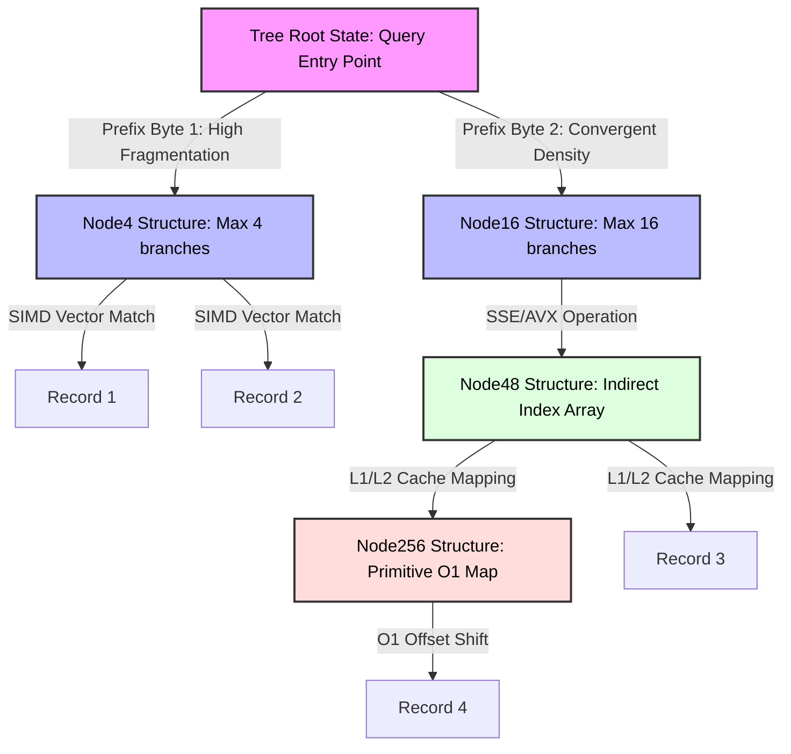

# Adaptive Radix Trees (ART): The Index Structure Behind Fast In-Memory Databases

## Executive Summary (Overview)

Once a database keeps its working set entirely in RAM, the old bottlenecks disappear and new ones take their place. Disk seek time and rotational latency stop mattering; what matters instead is memory bandwidth and how many cache misses your index generates per lookup. That shift in constraints is why in-memory database systems (IMDBs) have had to rethink indexing from the ground up.

This piece takes a close look at the **Adaptive Radix Tree (ART)**, a data structure that was designed specifically around modern hardware rather than around disk I/O. ART borrows the range-query support of a B-Tree, gets close to the constant-time lookups of a hash table, and on top of that tunes itself to CPU micro-architecture — cache-line alignment, SIMD instructions, the works. The result is a structure that solves the classic space-wastage problem of plain radix trees through dynamic node sizing, while keeping cache misses and TLB misses low enough to serve as the primary index in serious OLTP/OLAP systems.

## Core Problem Statement

### Why the Old Standards Break Down in Memory

1. **B+-Trees carry disk-era assumptions that don't help you in RAM.** A B+-Tree node sized for a disk block — 4KB to 16KB — spans dozens of cache lines (64 bytes each on x86-64). Walking through one internal node means a binary search with $\mathcal{O}(\log_2(\mathcal{B}))$ complexity, which translates into a lot of conditional branches. Those branches trip up the CPU's branch predictor often enough that mispredictions alone cost dozens of clock cycles each.

2. **Hash tables give up range queries entirely.** They offer $\mathcal{O}(1)$ lookups, sure, but they scatter data randomly across the address space, which kills any ability to do a range scan — something analytics and reporting workloads depend on constantly. And once the load factor climbs, collisions start eating into that $\mathcal{O}(1)$ promise anyway.

3. **Plain radix tries (Tries) force an ugly tradeoff between depth and space.** Tree depth follows $\mathcal{D} = \lceil \frac{\mathcal{K}}{s} \rceil$, where $\mathcal{K}$ is key length in bits and $s$ is the span consumed per hop. Pick $s=1$ and the tree gets absurdly deep — a 64-bit key means up to 64 pointer-chasing jumps, each one a chance at a cache miss or TLB miss. Pick $s=8$ instead and the tree flattens to just 8 levels for the same key, but now every node statically allocates 256 pointer slots, and in sparse data over 99% of that array sits empty — a huge waste of physical memory.

ART exists to get out of this tradeoff entirely. Its starting observation is simple: key density in a real index is never uniform, so forcing every node to be the same fixed size is wasteful by construction. ART instead builds a hybrid structure that adapts its own node sizes to whatever the data actually looks like at runtime.

## Deep Technical Knowledge / Internals

### A Node Ecosystem That Changes Shape as It Grows

Rather than one uniform node type, ART defines four node families with different capacities — **Node4**, **Node16**, **Node48**, and **Node256** — and lets a node silently promote or demote itself as the number of actual children changes.



#### What Each Node Type Actually Looks Like

- **Node4 (40 bytes)**: the sparsest case — up to 4 single-byte sub-keys plus 4 pointers (8 bytes each), plus metadata. The whole thing fits inside one 64-byte cache line, so accessing a Node4 never stalls waiting on memory.
- **Node16 (144 bytes)**: once a Node4 gets its 5th child, it's promoted here. It holds 16 contiguous sub-keys and 16 pointers, and the real win is that those 16 keys map cleanly into an XMM/YMM register for SIMD comparison.
- **Node48 (600 bytes)**: past 16 branches, shifting a parallel array on every insert gets expensive, so Node48 switches to an indirection scheme — a 256-byte index map where the byte value is the array index, and the stored value points into a 48-slot pointer array. That removes the need for a linear search entirely.
- **Node256 (2048 bytes)**: the ceiling. A flat array of 256 pointers, accessed by unconditional offset computation — $\mathcal{O}(1)$, no exceptions.

### Making the Instruction Stream Branchless

To avoid paying the branch-misprediction tax, ART leans on branchless techniques built on standard SSE2/AVX2 SIMD instructions — and Node16 is where this pays off most clearly.

```cpp
// Core structure of the ART algorithm's micro-architecture (C++20-style representation)
#include <immintrin.h>
#include <cstdint>

struct alignas(64) ARTNode {
    uint8_t type_descriptor;
    uint32_t active_children_count;
    uint32_t compression_prefix_length;
    uint8_t compressed_prefix[8]; // Small prefix limit
};

struct alignas(64) Node16 : public ARTNode {
    uint8_t vector_keys[16];      // Contiguous byte array for keys
    ARTNode* memory_pointers[16]; // Parallel array of memory pointers
};

// ... Node4, Node48, Node256 definitions ...

ARTNode* ART_Microkernel_Lookup(ARTNode* current_node, const uint8_t* query_key, uint32_t max_key_len, uint32_t current_depth) {
    while (current_node != nullptr) {
        // [1] Resolve Path Compression
        if (current_node->compression_prefix_length > 0) {
            uint32_t prefix_matched_bytes = Check_Optimized_Prefix(current_node, query_key, current_depth);
            if (prefix_matched_bytes != current_node->compression_prefix_length) return nullptr;
            current_depth += current_node->compression_prefix_length;
        }
        if (current_depth == max_key_len) return current_node; 
        
        uint8_t active_byte = query_key[current_depth];
        
        // Branch logic based on Type Descriptor
        switch (current_node->type_descriptor) {
            case NODE16_TYPE: {
                Node16* specialized_node = static_cast<Node16*>(current_node);
                
                // Load the target byte into all 16 bytes of the XMM register (broadcast)
                __m128i target_byte_vector = _mm_set1_epi8(active_byte);
                
                // Load the array of 16 keys from memory into the register
                __m128i stored_keys_vector = _mm_loadu_si128(reinterpret_cast<const __m128i*>(specialized_node->vector_keys));
                
                // Perform a batch equality comparison in a single clock cycle (SIMD Eq)
                __m128i comparison_result = _mm_cmpeq_epi8(target_byte_vector, stored_keys_vector);
                
                // Extract the comparison result into a 16-bit bitmask
                unsigned matched_bitmask = _mm_movemask_epi8(comparison_result) & ((1 << specialized_node->active_children_count) - 1);
                
                if (matched_bitmask) {
                    // __builtin_ctz counts trailing zero bits, instantly finding the exact index of the child node
                    current_node = specialized_node->memory_pointers[__builtin_ctz(matched_bitmask)];
                } else {
                    return nullptr; // Miss, not found
                }
                break;
            }
            // Micro-level branching logic for Node4, Node48, Node256 (omitted for brevity)
        }
        current_depth++;
    }
    return nullptr;
}
```

Combining `_mm_cmpeq_epi8` with `__builtin_ctz` means finding a child among 16 branches happens with no loop and no `if` statement at all, which keeps the CPU's IPC (instructions per cycle) close to its ceiling.

### Path Compression and Lazy Expansion

ART attacks the "long chain of single-child nodes" problem — the thing that makes plain tries so deep — with two complementary tricks:

1. **Lazy Expansion**: a leaf holding just one value doesn't get expanded into a full chain of branch nodes. It's stored as a direct pointer to the data, and the tree only branches out once an actual collision forces it to.
2. **Path Compression**: a run of nodes that each have exactly one child gets folded into a single prefix stored on the node below. Instead of hopping through 5 separate nodes to confirm the sequence "A-B-C-D-E," ART stores "ABCDE" directly in that node's `compressed_prefix` array and checks it with a fast block memory comparison (essentially `memcmp`).

### OS Interaction, NUMA, and Memory Management

Leaning on the standard POSIX `malloc` leads to virtual-memory fragmentation, which both hurts the hardware prefetcher and drives up TLB thrashing — not what you want for a structure this latency-sensitive.

In practice ART needs a custom **hierarchical slab allocator**:
- The virtual address space is carved into dedicated chunks.
- Each chunk is specialized — one region for `Node4` allocations, another for `Node16`, and so on.
- **NUMA awareness** matters on multi-socket machines: the allocator ties a newly-created node's memory to the socket that's actually operating on it, avoiding cross-domain transfer latency over the QPI/UPI bus.

### Multi-Core Concurrency: OLC and ROWEX

Protecting nodes with heavyweight latches or read-write locks in a highly parallel system causes cache-line bouncing that saturates the system bus fast.

ART instead uses **Optimistic Lock Coupling (OLC)** paired with a **ROWEX (Read-Optimized Write EXclusive)** protocol:
- Every node keeps an atomic version counter.
- **Reads never acquire a lock.** A reading thread records the version $V_{pre}$, reads the data, issues an `mfence` to stop the compiler or CPU from reordering things, then rechecks $V_{post}$. If $V_{pre} == V_{post}$ and the lock bit isn't set, the read is safe. Any mismatch and the thread just retries.
- **Writes use an out-of-place atomic swap.** Instead of mutating a node in place — which would corrupt any read in flight — the writer copies the node, applies the update to the copy, and then swaps the parent's pointer with a single `lock cmpxchg` (compare-and-swap). Readers still on the old version never even notice.

## Practical Applications & Case Studies

### In-Memory Databases at Scale (OLTP/OLAP)

Systems like **HyPer** (TUM/Tableau) and **SAP HANA** build their primary index — and their dictionary-encoding storage — on a radix-tree foundation close to ART. HyPer's numbers are notable: over 50 million point queries per second per core, beating B+-Tree variants like Masstree or Bw-Tree by anywhere from 20% to 150%.

### IP Routing and Prefix Matching

Telecom routing uses Longest Prefix Match (LPM) to look up IP addresses, and with IPv6 address sizes, that lookup needs to happen at line rate on hardware switches. ART's node-scaling behavior shrinks a BGP forwarding table (FIB) down to a few megabytes — small enough to sit comfortably in L3 cache.

### Tuning It in Practice

Getting ART to perform well means tuning the max prefix length in the metadata carefully. Too long and the base `ARTNode` size bloats; too short and path compression stops paying for itself. In practice, 8-16 bytes for `compressed_prefix` tends to be the sweet spot, keeping the metadata footprint in the 16-32 byte range.

## Lessons Learned

1. **Hardware awareness decides whether an algorithm actually survives contact with production.** Textbook Big-O complexity stops telling the whole story once you ignore cache-miss rates, TLB thrashing, and IPC. The best algorithm is the one that works with the silicon, not just on paper.
2. **Branchless beats branching, even when it means extra work.** Paying for a few redundant loads and doing blind SIMD comparison is consistently cheaper than eating a branch misprediction. Node16 is ART's clearest demonstration of that principle.
3. **A fixed node shape is a bad fit for skewed real-world data.** Letting a structure change its own shape based on actual density buys real advantages in both time and memory, and ART's four node types show what that looks like in practice.
4. **Persistent memory and CXL are pushing this idea further.** As NVDIMM (Intel Optane and similar) and CXL make physical write bandwidth expensive again, variants like **FPTree** and **REC-ART** are adapting ART's core structure with storage-barrier instructions like $\mathcal{CLFLUSHOPT}$ to fit the constraints of persistent memory.

---
