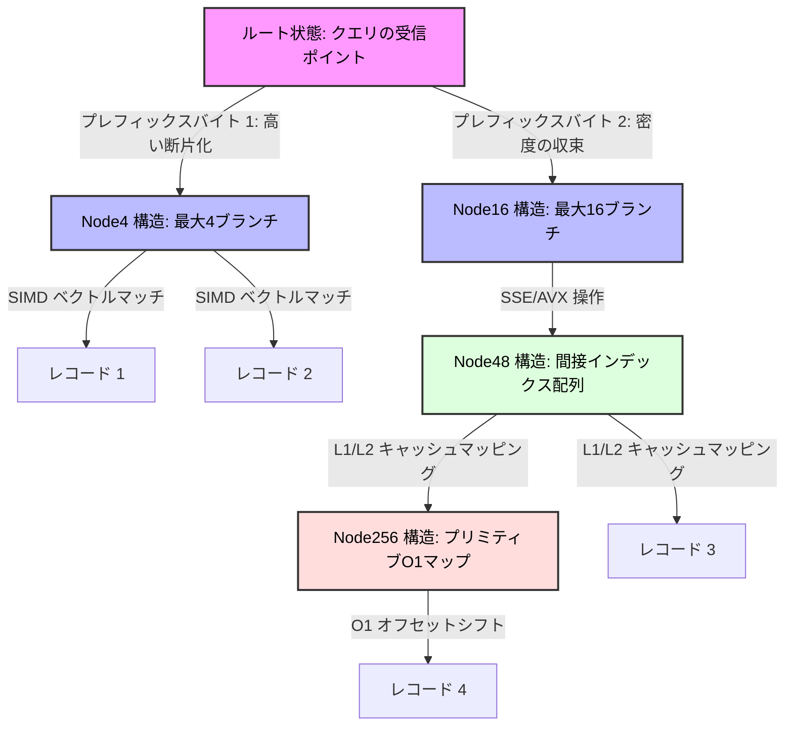

# Adaptive Radix Tree(ART):インメモリDBを支えるインデックス構造

## Executive Summary (概要 / Overview)

データベースの作業データセットが完全にRAMに収まるようになると、それまでのボトルネックは消え、代わりに別の課題が顔を出す。ディスクのシーク時間や回転遅延はもう問題ではなく、メモリ帯域幅と、1回のルックアップで何回キャッシュミスが起きるかが勝負になる。この制約の変化こそが、インメモリデータベースシステム(IMDB)がインデックス設計をゼロから見直さざるを得なかった理由だ。

このドキュメントでは、ディスクI/Oではなく現代のハードウェアそのものを前提に設計されたデータ構造、**Adaptive Radix Tree(ART)**を詳しく見ていく。ARTはB-Treeの範囲クエリ対応力を受け継ぎ、ハッシュテーブルに近い定数時間のルックアップを実現しながら、キャッシュラインアライメントやSIMD命令といったCPUマイクロアーキテクチャに自らを合わせ込む。その結果、動的なノードサイズ変更によって従来のRadix Treeが抱えていた空間の無駄を解消しつつ、キャッシュミスとTLBミスを低く抑え、本格的なOLTP/OLAPシステムの主要インデックスとして使えるだけの性能を出す。

## Core Problem Statement (中核となる課題)

### インメモリ環境で従来の常識が崩れる理由

1. **B+-Treeはディスク時代の前提を引きずっている。** ディスクブロック(4KB〜16KB)に合わせて設計されたB+-Treeのノードは、メインメモリ上ではx86-64の64バイトキャッシュラインを何十本も占有する。1つの内部ノードを走査するには$\mathcal{O}(\log_2(\mathcal{B}))$の二分探索が必要で、条件分岐が大量に発生する。これらの分岐はCPUの分岐予測器を頻繁に外させ、予測ミスだけで数十クロックサイクルのコストが積み上がる。

2. **ハッシュテーブルは範囲クエリを完全に諦めている。** $\mathcal{O}(1)$のルックアップは魅力的だが、データをアドレス空間全体にランダムに散らすため、分析やレポート処理で常に必要になる範囲スキャンができない。しかもロードファクターが上がれば、衝突によってその$\mathcal{O}(1)$という約束自体も怪しくなる。

3. **素朴なRadix Trie(基数木)は深さと空間のどちらかを犠牲にせざるを得ない。** 木の深さは$\mathcal{D} = \lceil \frac{\mathcal{K}}{s} \rceil$で決まる($\mathcal{K}$はキー長のビット数、$s$は1ステップで消費するビット幅)。$s=1$を選べば木は途方もなく深くなり、64ビットキーで最大64回のポインタジャンプが発生する。ジャンプ1回ごとにキャッシュミスやTLBミスのリスクがある。逆に$s=8$を選べば同じキーでもわずか8層に収まるが、各ノードが静的に256個のポインタスロットを確保することになり、疎なデータでは配列の99%以上が空のまま——物理メモリの大きな無駄になる。

ARTはこのトレードオフそのものから抜け出すために生まれた。出発点はシンプルだ。実際のインデックスにおけるキーの密度は決して均一ではないのだから、すべてのノードを同じ固定サイズに強制すること自体が構造的な無駄である、という認識だ。ARTはその代わりに、実行時のデータの実態に応じて自分自身のノードサイズを調整するハイブリッド構造を組み立てる。

## Deep Technical Knowledge / Internals (詳細な技術知識 / 内部構造)

### 成長に応じて形を変えるノードの生態系

ARTは単一の均一なノード型ではなく、容量の異なる4種類のノードファミリー——**Node4**、**Node16**、**Node48**、**Node256**——を定義し、実際の子ノード数の変化に応じてノードが静かに昇格・降格できるようにしている。



#### 各ノード型の中身

- **Node4(40バイト)**:最も疎な状態。1バイトのサブキーと8バイトのポインタを最大4組、メタデータと合わせて格納する。全体で64バイトのキャッシュライン1本に収まるため、Node4へのアクセスでメモリ待ちのストールは発生しない。
- **Node16(144バイト)**:Node4に5個目の子が追加されるとここに昇格する。連続した16個のサブキーと16個のポインタを持ち、この16個のキーがXMM/YMMレジスタにきれいにマップされてSIMD比較できる点が最大の利点だ。
- **Node48(600バイト)**:16ブランチを超えると、挿入のたびに並列配列をシフトするコストが無視できなくなる。そこでNode48は間接参照方式に切り替える——256バイトのインデックスマップを持ち、バイト値がそのまま配列のインデックスになり、格納されている値が48スロットのポインタ配列を指す。これで線形探索が完全に不要になる。
- **Node256(2048バイト)**:上限。256個のポインタをそのまま並べたフラットな配列で、アクセスは無条件のオフセット計算だけ——例外なく$\mathcal{O}(1)$だ。

### 命令ストリームを分岐なしにする

分岐予測ミスのコストを避けるため、ARTは標準的なSSE2/AVX2 SIMD命令をベースにしたブランチレスな手法に頼っている。これが最も分かりやすく効いてくるのがNode16だ。

```cpp
// ARTアルゴリズムのマイクロアーキテクチャのコア構造 (標準C++20表現)
#include <immintrin.h>
#include <cstdint>

struct alignas(64) ARTNode {
    uint8_t type_descriptor;
    uint32_t active_children_count;
    uint32_t compression_prefix_length;
    uint8_t compressed_prefix[8]; // 小さなプレフィックスの制限
};

struct alignas(64) Node16 : public ARTNode {
    uint8_t vector_keys[16];      // キーの連続バイト配列
    ARTNode* memory_pointers[16]; // 並列メモリポインタ配列
};

// ... Node4, Node48, Node256 の定義 ...

ARTNode* ART_Microkernel_Lookup(ARTNode* current_node, const uint8_t* query_key, uint32_t max_key_len, uint32_t current_depth) {
    while (current_node != nullptr) {
        // [1] パス圧縮 (Path Compression) の解決
        if (current_node->compression_prefix_length > 0) {
            uint32_t prefix_matched_bytes = Check_Optimized_Prefix(current_node, query_key, current_depth);
            if (prefix_matched_bytes != current_node->compression_prefix_length) return nullptr;
            current_depth += current_node->compression_prefix_length;
        }
        if (current_depth == max_key_len) return current_node; 
        
        uint8_t active_byte = query_key[current_depth];
        
        // Type Descriptor に基づく分岐ロジック
        switch (current_node->type_descriptor) {
            case NODE16_TYPE: {
                Node16* specialized_node = static_cast<Node16*>(current_node);
                
                // 検索対象のバイトをXMMレジスタの全16バイトにロード (broadcast)
                __m128i target_byte_vector = _mm_set1_epi8(active_byte);
                
                // メモリから16キーの配列をレジスタにロード
                __m128i stored_keys_vector = _mm_loadu_si128(reinterpret_cast<const __m128i*>(specialized_node->vector_keys));
                
                // 1クロックサイクルで同時に等価比較を実行 (SIMD Eq)
                __m128i comparison_result = _mm_cmpeq_epi8(target_byte_vector, stored_keys_vector);
                
                // 比較結果を16ビットのビットマスクとして抽出
                unsigned matched_bitmask = _mm_movemask_epi8(comparison_result) & ((1 << specialized_node->active_children_count) - 1);
                
                if (matched_bitmask) {
                    // __builtin_ctz は末尾のゼロの数を数え、子ノードのインデックスを瞬時に見つけ出します
                    current_node = specialized_node->memory_pointers[__builtin_ctz(matched_bitmask)];
                } else {
                    return nullptr; // ミス、見つからない
                }
                break;
            }
            // Node4, Node48, Node256サブクラスのマイクロ分岐ロジック (省略)
        }
        current_depth++;
    }
    return nullptr;
}
```

`_mm_cmpeq_epi8`と`__builtin_ctz`を組み合わせることで、16個のブランチから子ノードを探す処理はループも`if`文もなしに完結する。これによりCPUのIPC(1クロックあたりの命令数)を常に上限近くに保てる。

### パス圧縮と遅延展開

素朴なTrieを深くしてしまう「単一子ノードの連鎖」問題に対して、ARTは二つの補完的な工夫で対処する。

1. **Lazy Expansion(遅延展開)**:値を1つしか持たないリーフは、わざわざ分岐ノードの連鎖に展開されない。データへの直接ポインタとして保存され、実際に衝突が起きて初めて分岐が発生する。
2. **Path Compression(パス圧縮)**:子が1つしかないノードが連続している区間は、下のノードに格納された1本のプレフィックスにまとめられる。「A-B-C-D-E」という並びを確認するために5つのノードを渡り歩く代わりに、ARTは「ABCDE」をそのノードの`compressed_prefix`配列に格納し、高速なブロックメモリ比較(実質的には`memcmp`)で照合する。

### OSとの連携、NUMA、メモリ管理

標準のPOSIX `malloc`に頼ると仮想メモリの断片化が起き、ハードウェアプリフェッチャの効率を下げるだけでなくTLBスラッシングも招く——レイテンシに敏感なこの構造にとっては望ましくない。

実運用のARTは専用の**階層型スラブアロケータ**を必要とする。

- 仮想アドレス空間は用途ごとの専用チャンクに分割される。
- 各チャンクは特化していて、あるリージョンは`Node4`専用、別のリージョンは`Node16`専用、という具合だ。
- **NUMAを意識する**ことがマルチソケット機では重要になる。アロケータは新しく作られたノードのメモリを、実際にそれを操作するソケットに紐づけ、QPI/UPIバスを介したドメイン間転送のレイテンシを避ける。

### マルチコアでの並行性制御:OLCとROWEX

高度に並列なシステムでノードを重いラッチやリードライトロックで保護すると、キャッシュラインバウンシングが発生してシステムバスがすぐに飽和してしまう。

そこでARTは**Optimistic Lock Coupling(OLC)**と**ROWEX(Read-Optimized Write EXclusive)**プロトコルを組み合わせて使う。

- 各ノードはアトミックなバージョンカウンタを保持する。
- **読み取りは一切ロックを取得しない。** 読み取りスレッドはバージョン$V_{pre}$を記録し、データを読み、コンパイラやCPUによる並べ替えを防ぐ`mfence`を発行してから$V_{post}$を再確認する。$V_{pre} == V_{post}$でロックビットが立っていなければ読み取りは安全と判断される。不一致があればスレッドは単純にリトライする。
- **書き込みはコピーによるアトミックな置き換えを使う。** ノードをその場で書き換えると進行中の読み取りを壊しかねないので、書き込み側はノードをコピーし、コピーの方に変更を加えてから、親ノードのポインタを1回の`lock cmpxchg`(Compare-And-Swap)で入れ替える。古いバージョンを読んでいるスレッドはこの変化にまったく気づかない。

## Practical Applications & Case Studies (実用的なアプリケーションとケーススタディ)

### 大規模インメモリDB(OLTP/OLAP)

**HyPer Database**(TUM/Tableau)や**SAP HANA**は、ARTに近いRadix Tree基盤を主インデックスとして、また辞書エンコーディングのストレージとして採用している。HyPerでの数字は印象的で、コアスレッド1本あたり毎秒5000万件を超えるポイントクエリを処理し、MasstreeやBw-TreeといったB+-Tree系の変種を20%から150%の差で上回っている。

### IPルーティングとプレフィックスマッチング

通信業界のIPアドレス検索はLongest Prefix Match(LPM)モデルに従い、IPv6のアドレス長を考えるとハードウェアスイッチのライン速度でこれを処理する必要がある。ARTのノードスケーリングの仕組みは、BGPのルーティングテーブル(FIB)のサイズを数メガバイトまで縮小し、L3キャッシュに収まる大きさに抑えてくれる。

### 実運用でのチューニング

ARTの性能を引き出すには、メタデータの最大プレフィックス長を丁寧に調整する必要がある。長すぎると`ARTNode`の基本サイズが膨らみ、短すぎるとパス圧縮の効果が薄れる。実務上は`compressed_prefix`を8〜16バイトにするのが落としどころで、メタデータ全体を16〜32バイトの範囲に収めやすい。

## Lessons Learned (得られた教訓)

1. **アルゴリズムが本番で生き残るかどうかは、ハードウェアへの理解次第だ。** キャッシュミス率やTLBスラッシング、IPCを無視すれば、教科書通りのBig-Oは実際の性能をもう説明できなくなる。最良のアルゴリズムとは、机上だけでなくシリコンの上でもうまく動くものだ。
2. **多少の無駄を払ってでもブランチレスの方が勝つ。** 冗長な読み込みとブラインドなSIMD比較のコストは、分岐予測ミス1回のコストより一貫して安い。Node16の設計はこの原則を最もわかりやすく体現している。
3. **偏った実データに対して固定のノード形状は相性が悪い。** 実際のデータ密度に応じて自分の形を変えられる構造は、時間・メモリの両面で明確な優位性をもたらす。ARTの4種類のノードはその実例だ。
4. **不揮発性メモリとCXLがこの発想をさらに押し進めている。** Intel Optaneのようなnvdimmや CXL(Compute Express Link)によって物理的な書き込み帯域幅が再び高価になる中、**FPTree**や**REC-ART**といった派生構造は、$\mathcal{CLFLUSHOPT}$のようなストレージバリア命令を組み込みながら、ARTのコア構造を不揮発性メモリの制約に合わせて適応させている。

---
