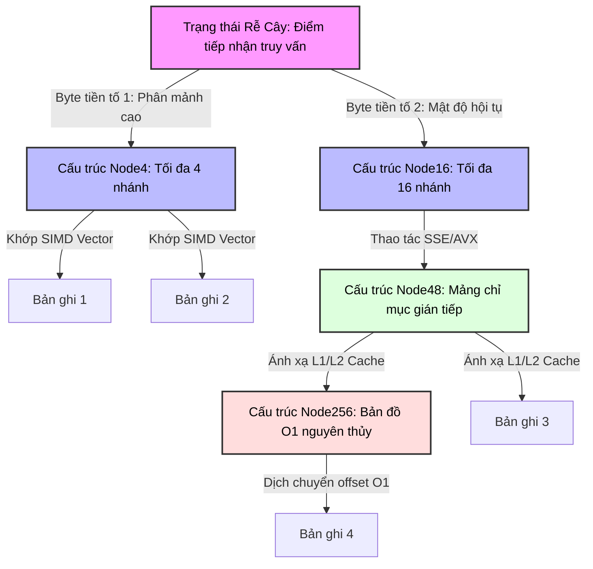

# Adaptive Radix Tree (ART): cấu trúc chỉ mục đứng sau các database in-memory tốc độ cao

## Executive Summary (Tóm tắt / Overview)

Khi một cơ sở dữ liệu giữ toàn bộ tập dữ liệu làm việc trong RAM, những nút thắt cổ chai quen thuộc biến mất và nhường chỗ cho những nút thắt khác. Thời gian seek đĩa hay độ trễ xoay không còn quan trọng nữa; thứ quan trọng bây giờ là băng thông bộ nhớ và số lần cache miss mà chỉ mục gây ra cho mỗi lần tra cứu. Chính sự thay đổi ràng buộc này buộc các hệ quản trị cơ sở dữ liệu in-memory (IMDB) phải thiết kế lại chỉ mục từ đầu.

Bài viết này đi sâu vào **Adaptive Radix Tree (ART)**, một cấu trúc dữ liệu được thiết kế xoay quanh phần cứng hiện đại chứ không phải xoay quanh I/O đĩa. ART kế thừa khả năng truy vấn phạm vi của B-Tree, đạt tốc độ tra cứu gần như hằng số của hash table, và trên hết còn tự điều chỉnh theo vi kiến trúc CPU - căn chỉnh cache line, tận dụng tập lệnh SIMD. Kết quả là một cấu trúc giải quyết được vấn đề lãng phí không gian kinh điển của radix tree thông thường bằng cách tự thay đổi kích thước node linh hoạt, trong khi vẫn giữ cache miss và TLB miss đủ thấp để làm chỉ mục chính cho các hệ thống OLTP/OLAP nghiêm túc.

## Core Problem Statement (Vấn đề cốt lõi)

### Vì sao các chuẩn cũ không còn phù hợp khi mọi thứ nằm trong RAM

1. **B+-Tree mang theo những giả định của thời đại đĩa cứng, vốn không giúp ích gì khi dữ liệu đã nằm trong RAM.** Một node B+-Tree được thiết kế cho kích thước block đĩa - 4KB đến 16KB - chiếm tới hàng chục cache line (mỗi cache line 64 byte trên x86-64). Duyệt qua một node nội bộ nghĩa là thực hiện tìm kiếm nhị phân với độ phức tạp $\mathcal{O}(\log_2(\mathcal{B}))$, kéo theo rất nhiều lệnh rẽ nhánh có điều kiện. Những lệnh rẽ nhánh này khiến bộ dự đoán rẽ nhánh của CPU đoán sai đủ thường xuyên để riêng phần chi phí dự đoán sai đã ngốn hàng chục chu kỳ xung nhịp mỗi lần.

2. **Hash table từ bỏ hoàn toàn truy vấn phạm vi.** Đúng là chúng cho tốc độ tra cứu $\mathcal{O}(1)$, nhưng lại rải dữ liệu ngẫu nhiên khắp không gian địa chỉ, khiến việc quét theo phạm vi - thứ mà khối lượng công việc phân tích và báo cáo phụ thuộc liên tục - trở nên bất khả thi. Và một khi load factor tăng cao, va chạm (collision) bắt đầu ăn mòn ngay cả lời hứa $\mathcal{O}(1)$ đó.

3. **Radix trie (basic trie) buộc phải đánh đổi giữa độ sâu và không gian.** Độ sâu của cây tuân theo công thức $\mathcal{D} = \lceil \frac{\mathcal{K}}{s} \rceil$, trong đó $\mathcal{K}$ là độ dài khóa tính theo bit và $s$ là số bit tiêu thụ mỗi bước nhảy. Chọn $s=1$, cây trở nên sâu một cách phi lý - một khóa 64-bit cần tới 64 lần nhảy con trỏ, mỗi lần là một cơ hội cho cache miss hoặc TLB miss. Chọn $s=8$ thay vào đó, cây phẳng lại chỉ còn 8 tầng cho cùng một khóa, nhưng giờ mỗi node lại cấp phát tĩnh 256 vị trí con trỏ, và với dữ liệu thưa, hơn 99% mảng đó nằm trống - một sự lãng phí bộ nhớ vật lý đáng kể.

ART ra đời để thoát hẳn khỏi sự đánh đổi này. Điểm xuất phát của nó khá đơn giản: mật độ khóa trong một chỉ mục thực tế không bao giờ đồng đều, nên việc ép mọi node phải có cùng kích thước cố định vốn đã là lãng phí ngay từ thiết kế. Thay vào đó, ART xây dựng một cấu trúc lai, tự điều chỉnh kích thước node của chính nó theo dữ liệu thực tế tại thời điểm chạy.

## Deep Technical Knowledge / Internals (Kiến thức kỹ thuật chuyên sâu)

### Một hệ sinh thái node thay đổi hình dạng khi lớn lên

Thay vì chỉ có một loại node đồng nhất, ART định nghĩa bốn họ node với sức chứa khác nhau - **Node4**, **Node16**, **Node48**, và **Node256** - và cho phép một node âm thầm tự thăng cấp hoặc giáng cấp khi số lượng con thực tế thay đổi.



#### Bên trong từng loại node

- **Node4 (40 byte)**: trạng thái thưa nhất. Lưu tối đa 4 sub-key 1 byte cùng 4 con trỏ (8 byte mỗi con trỏ), cộng metadata. Toàn bộ vừa gọn trong một cache line 64 byte, nên việc truy cập Node4 không bao giờ phải chờ bộ nhớ.
- **Node16 (144 byte)**: khi Node4 nhận thêm phần tử con thứ 5, nó được thăng cấp lên đây. Chứa 16 sub-key liên tiếp và 16 con trỏ, và điểm hay nhất là 16 khóa này ánh xạ gọn gàng vào thanh ghi XMM/YMM để so sánh bằng SIMD.
- **Node48 (600 byte)**: vượt quá 16 nhánh, việc dịch chuyển một mảng song song mỗi lần chèn trở nên đắt đỏ, nên Node48 chuyển sang mô hình gián tiếp - một mảng chỉ mục 256 byte, trong đó giá trị byte chính là chỉ số mảng, còn giá trị lưu trữ trỏ vào một mảng 48 con trỏ. Cách này loại bỏ hoàn toàn nhu cầu tìm kiếm tuyến tính.
- **Node256 (2048 byte)**: giới hạn trên cùng. Một mảng phẳng gồm 256 con trỏ, truy cập bằng phép tính offset vô điều kiện - luôn là $\mathcal{O}(1)$, không ngoại lệ.

### Biến chuỗi lệnh thành branchless

Để tránh phải trả giá cho lỗi dự đoán rẽ nhánh, ART dựa vào các kỹ thuật branchless xây dựng trên tập lệnh SIMD chuẩn SSE2/AVX2 - và Node16 là nơi điều này phát huy tác dụng rõ ràng nhất.

```cpp
// Cấu trúc cốt lõi của vi kiến trúc thuật toán ART (Biểu diễn C++ chuẩn C++20)
#include <immintrin.h>
#include <cstdint>

struct alignas(64) ARTNode {
    uint8_t type_descriptor;
    uint32_t active_children_count;
    uint32_t compression_prefix_length;
    uint8_t compressed_prefix[8]; // Giới hạn prefix nhỏ
};

struct alignas(64) Node16 : public ARTNode {
    uint8_t vector_keys[16];      // Mảng byte liên tiếp cho khóa
    ARTNode* memory_pointers[16]; // Mảng con trỏ bộ nhớ song song
};

// ... Node4, Node48, Node256 definitions ...

ARTNode* ART_Microkernel_Lookup(ARTNode* current_node, const uint8_t* query_key, uint32_t max_key_len, uint32_t current_depth) {
    while (current_node != nullptr) {
        // [1] Giải quyết Nén tiền tố (Path Compression)
        if (current_node->compression_prefix_length > 0) {
            uint32_t prefix_matched_bytes = Check_Optimized_Prefix(current_node, query_key, current_depth);
            if (prefix_matched_bytes != current_node->compression_prefix_length) return nullptr;
            current_depth += current_node->compression_prefix_length;
        }
        if (current_depth == max_key_len) return current_node; 
        
        uint8_t active_byte = query_key[current_depth];
        
        // Phân nhánh logic dựa trên Type Descriptor
        switch (current_node->type_descriptor) {
            case NODE16_TYPE: {
                Node16* specialized_node = static_cast<Node16*>(current_node);
                
                // Nạp byte cần tìm vào toàn bộ 16 byte của thanh ghi XMM (broadcast)
                __m128i target_byte_vector = _mm_set1_epi8(active_byte);
                
                // Nạp mảng 16 khóa từ bộ nhớ vào thanh ghi
                __m128i stored_keys_vector = _mm_loadu_si128(reinterpret_cast<const __m128i*>(specialized_node->vector_keys));
                
                // Thực thi phép so sánh bằng đồng loạt trong 1 chu kỳ xung nhịp (SIMD Eq)
                __m128i comparison_result = _mm_cmpeq_epi8(target_byte_vector, stored_keys_vector);
                
                // Trích xuất kết quả so sánh thành bitmask 16-bit
                unsigned matched_bitmask = _mm_movemask_epi8(comparison_result) & ((1 << specialized_node->active_children_count) - 1);
                
                if (matched_bitmask) {
                    // __builtin_ctz tính số số 0 ở đuôi, tìm ra chính xác index của node con một cách tức thì
                    current_node = specialized_node->memory_pointers[__builtin_ctz(matched_bitmask)];
                } else {
                    return nullptr; // Lỗi trượt, không tìm thấy
                }
                break;
            }
            // Logic vi mô phân nhánh cho phân lớp Node4, Node48, Node256 (Tĩnh lược)
        }
        current_depth++;
    }
    return nullptr;
}
```

Kết hợp `_mm_cmpeq_epi8` với `__builtin_ctz`, việc tìm nhánh con trong số 16 nhánh diễn ra mà không cần vòng lặp lẫn câu lệnh `if` nào cả, giúp IPC (số lệnh mỗi chu kỳ) của CPU luôn giữ gần mức trần.

### Nén đường dẫn và mở rộng lười

ART giải quyết vấn đề "chuỗi node chỉ có một con nối tiếp nhau" - thứ khiến trie thông thường trở nên quá sâu - bằng hai kỹ thuật bổ trợ nhau:

1. **Lazy Expansion (mở rộng lười)**: một lá chỉ chứa đúng một giá trị sẽ không bị triển khai thành cả một chuỗi node nhánh. Nó được lưu như một con trỏ trực tiếp tới dữ liệu, và cây chỉ thực sự phân nhánh khi có va chạm xảy ra.
2. **Path Compression (nén đường dẫn)**: một chuỗi các node mà mỗi node chỉ có đúng một con sẽ được gộp lại thành một tiền tố duy nhất, lưu ở node bên dưới. Thay vì phải nhảy qua 5 node riêng biệt để xác nhận chuỗi "A-B-C-D-E", ART lưu thẳng "ABCDE" vào mảng `compressed_prefix` của node đó và kiểm tra bằng một phép so sánh khối bộ nhớ nhanh (về bản chất là `memcmp`).

### Tương tác với hệ điều hành, NUMA và quản lý bộ nhớ

Dựa vào `malloc` chuẩn của POSIX dẫn tới phân mảnh bộ nhớ ảo, vừa làm giảm hiệu quả của bộ prefetch phần cứng vừa gây ra TLB thrashing - điều không mong muốn với một cấu trúc nhạy cảm với độ trễ như thế này.

Trong thực tế, ART cần một **bộ cấp phát slab phân cấp** (hierarchical slab allocator) riêng:

- Không gian địa chỉ ảo được chia thành các vùng chuyên dụng.
- Mỗi vùng được chuyên biệt hóa - một vùng dành cho `Node4`, một vùng khác dành cho `Node16`, và cứ thế.
- **Nhận biết NUMA** trở nên quan trọng trên máy nhiều socket: bộ cấp phát gắn bộ nhớ của một node mới tạo với đúng socket đang thao tác trên nó, tránh độ trễ truyền dữ liệu xuyên miền qua bus QPI/UPI.

### Kiểm soát đồng thời đa lõi: OLC và ROWEX

Bảo vệ node bằng latch nặng hoặc read-write lock trong một hệ thống song song mạnh sẽ nhanh chóng gây ra hiện tượng cache-line bouncing làm bão hòa bus hệ thống.

Thay vào đó, ART dùng **Optimistic Lock Coupling (OLC)** kết hợp giao thức **ROWEX (Read-Optimized Write EXclusive)**:

- Mỗi node giữ một bộ đếm phiên bản nguyên tử.
- **Đọc không bao giờ giữ khóa.** Thread đọc ghi lại phiên bản $V_{pre}$, đọc dữ liệu, phát lệnh `mfence` để ngăn compiler hoặc CPU sắp xếp lại thứ tự, rồi kiểm tra lại $V_{post}$. Nếu $V_{pre} == V_{post}$ và bit khóa chưa được bật, lần đọc đó được coi là an toàn. Nếu có sai lệch, thread chỉ đơn giản là thử lại.
- **Ghi dùng cơ chế thay thế nguyên tử ngoài chỗ (out-of-place).** Thay vì sửa trực tiếp trên node - việc có thể làm hỏng một lần đọc đang diễn ra - thread ghi sao chép node, áp dụng thay đổi lên bản sao, rồi hoán đổi con trỏ của node cha bằng một lệnh `lock cmpxchg` (Compare-And-Swap) duy nhất. Các thread đang đọc phiên bản cũ hoàn toàn không nhận ra sự thay đổi này.

## Practical Applications & Case Studies (Ứng dụng thực tế)

### Database in-memory quy mô lớn (OLTP/OLAP)

Các hệ thống như **HyPer Database** (TUM/Tableau) và **SAP HANA** xây dựng chỉ mục chính - cùng với storage cho dictionary encoding - trên một nền tảng radix tree gần giống ART. Con số tại HyPer khá ấn tượng: hơn 50 triệu truy vấn điểm mỗi giây trên mỗi core, vượt qua các biến thể B+-Tree như Masstree hay Bw-Tree với biên độ từ 20% đến 150%.

### Định tuyến IP và khớp tiền tố

Định tuyến viễn thông dùng mô hình Longest Prefix Match (LPM) để tra cứu địa chỉ IP, và với kích thước địa chỉ IPv6, việc tra cứu này cần diễn ra ở tốc độ đường truyền trên các switch phần cứng. Khả năng co giãn node của ART thu nhỏ bảng định tuyến BGP (FIB) xuống chỉ còn vài megabyte - đủ nhỏ để nằm gọn trong L3 cache.

### Tinh chỉnh trong thực tế

Để ART hoạt động tốt, cần tinh chỉnh cẩn thận độ dài tiền tố tối đa trong metadata. Quá dài sẽ làm phình kích thước cơ bản của `ARTNode`; quá ngắn sẽ khiến path compression không còn đáng giá. Trong thực tế, giá trị 8-16 byte cho `compressed_prefix` thường là điểm cân bằng tốt, giữ cho metadata nằm trong khoảng 16-32 byte.

## Lessons Learned (Bài học rút ra)

1. **Hiểu biết về phần cứng quyết định một thuật toán có sống sót được trong thực tế hay không.** Độ phức tạp Big-O trên sách vở không còn kể hết câu chuyện một khi bỏ qua tỷ lệ cache miss, TLB thrashing và IPC. Thuật toán tốt nhất là thuật toán hoạt động tốt trên silicon thật, chứ không chỉ trên giấy.
2. **Branchless thắng branching, kể cả khi phải làm thêm việc.** Chấp nhận vài lần tải dữ liệu dư thừa và so sánh SIMD một cách "mù" luôn rẻ hơn việc chịu một lần dự đoán rẽ nhánh sai. Node16 là minh chứng rõ ràng nhất cho nguyên tắc này trong ART.
3. **Một hình dạng node cố định không hợp với dữ liệu thực tế vốn lệch.** Cho phép cấu trúc tự thay đổi hình dạng theo mật độ dữ liệu thực mang lại lợi thế rõ rệt cả về thời gian lẫn bộ nhớ, và bốn loại node của ART chính là minh họa cho điều đó.
4. **Bộ nhớ bền vững (persistent memory) và CXL đang đẩy ý tưởng này đi xa hơn.** Khi NVDIMM (như Intel Optane) và CXL (Compute Express Link) khiến băng thông ghi vật lý trở nên đắt đỏ trở lại, các biến thể như **FPTree** và **REC-ART** đang điều chỉnh cấu trúc lõi của ART, bổ sung các lệnh rào chắn lưu trữ như $\mathcal{CLFLUSHOPT}$ để phù hợp với ràng buộc của bộ nhớ bền vững.

---
