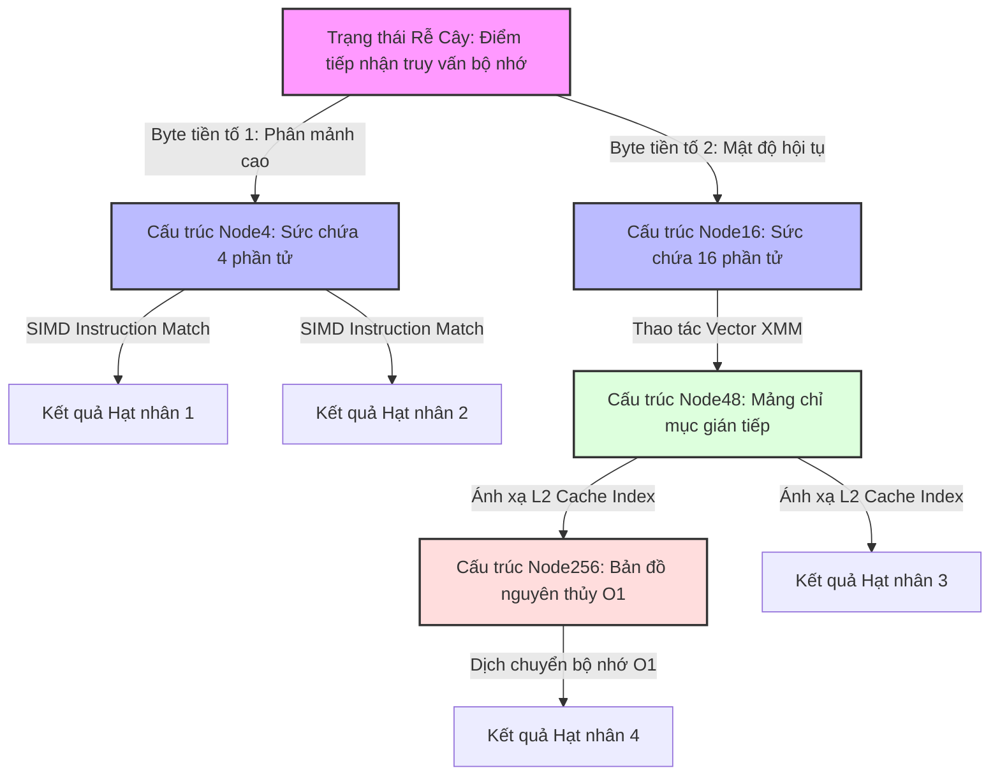

# 22: Adaptive Radix Trees (ART): Cấu trúc dữ liệu tối thượng cho In-Memory DBs

Sự bùng nổ của các hệ quản trị cơ sở dữ liệu trên bộ nhớ chính (in-memory database systems) trong thập kỷ qua đã đặt ra những yêu cầu khắt khe về hiệu năng của cấu trúc dữ liệu chỉ mục. Khi nút thắt cổ chai không còn nằm ở tốc độ truy xuất ổ cứng từ tính hay đĩa flash thể rắn, giới hạn vật lý dịch chuyển sang băng thông bộ nhớ (memory bandwidth) và độ trễ truy cập bộ nhớ đệm của vi xử lý (CPU cache latency). Trong bối cảnh này, các cấu trúc cây truyền thống như B+-Tree, vốn được thiết kế để tối ưu hóa truy xuất khối đĩa (disk block access), bộc lộ những hạn chế nghiêm trọng do chi phí cập nhật cây và số lượng lỗi trượt bộ đệm (cache miss) tăng cao trong quá trình duyệt qua các nút có kích thước khổng lồ. Cấu trúc bảng băm (Hash Table) mặc dù cung cấp độ phức tạp thời gian truy xuất hằng số $\mathcal{O}(1)$ nhưng lại hoàn toàn vô dụng đối với các truy vấn phạm vi (range queries) vốn là xương sống của các hệ thống OLTP và OLAP. Giải pháp Radix Tree (hay Trie) tiêu chuẩn giải quyết được bài toán truy vấn phạm vi và giới hạn độ sâu của cây phụ thuộc vào chiều dài của khóa thay vì số lượng phần tử, với độ sâu tối đa được xác định bởi công thức toán học $\mathcal{D} = \lceil \frac{\mathcal{K}}{s} \rceil$ trong đó $\mathcal{K}$ là độ dài khóa tính bằng bit và $s$ là độ rộng của mỗi bước nhảy (span). Tuy nhiên, Radix Tree truyền thống lại đối mặt với một sự đánh đổi nghiệt ngã giữa thời gian và không gian: nếu giá trị $s$ nhỏ (ví dụ $s=1$), đồ thị cây trở nên quá sâu dẫn đến sự suy thoái hiệu năng đo lường được do pointer chasing (truy vết con trỏ liên tiếp) gây ra hàng loạt lỗi Translation Lookaside Buffer (TLB miss); ngược lại, nếu $s$ lớn (ví dụ $s=8$), không gian bộ nhớ vật lý bị lãng phí khủng khiếp cho các mảng liên kết rỗng, đẩy độ phức tạp không gian lên ngưỡng $\mathcal{O}(2^s \times \mathcal{N})$. Để giải quyết triệt để nghịch lý vi kiến trúc này, cấu trúc Adaptive Radix Tree (ART) được đề xuất như một bước đột phá học thuật, kết hợp tính chất tiền tố của cấu trúc trie với sự thích ứng động của kích thước nút, mang lại sự cân bằng hoàn hảo giữa hiệu suất thời gian thực thi lệnh và hiệu quả định tuyến không gian bộ nhớ. ART nhận diện rằng mật độ phân bố khóa trong không gian chỉ mục đa chiều không bao giờ đồng đều, do đó việc cố định kích thước nút cấp phát tĩnh là một sự lãng phí tài nguyên phần cứng hệ thống một cách trầm trọng.

## Kiến trúc vi mô và Nền tảng Lý thuyết của Adaptive Radix Trees

Định hình cốt lõi của không gian đồ thị ART thay vì duy trì một siêu cấu trúc nút đồng nhất, nó định nghĩa một hệ sinh thái hình thái học (morphological ecosystem) gồm bốn họ các loại nút có sức chứa phi tuyến tính khác nhau, bao gồm Node4, Node16, Node48 và Node256. Mạng lưới trie cho phép đồ thị cây tự động co giãn tùy thuộc vào số lượng liên kết con thực tế tại mỗi điểm phân nhánh theo thời gian thực (runtime variable limits). Sự chuyển đổi linh hoạt này không chỉ giải quyết triệt để bài toán phân mảnh bộ nhớ (memory fragmentation) mà còn tối ưu hóa tương tác với vi kiến trúc bộ nhớ đệm L1/L2/L3 của CPU nhờ khả năng sắp xếp liên kết bộ đệm (cache-line alignment) và tận dụng sức mạnh tính toán song song từ các tập lệnh vector SIMD tiên tiến.



Phân tích sâu vào chi tiết kết cấu, Node4 đại diện cho cấu trúc nút cơ bản nhất và nhỏ gọn nhất trong phân cấp bộ nhớ ART, được thiết kế chuyên biệt cho các giao điểm có độ phân nhánh thưa thớt ở vùng ngoại biên đồ thị. Cấu trúc vi mô của Node4 bao gồm một khối mảng tĩnh chứa bốn khóa (kiểu số nguyên 8-bit không dấu) và một mảng song song tương ứng chứa bốn con trỏ bộ nhớ (thường định dạng 64-bit trên hệ thống hiện đại), kết hợp với một rào cản siêu dữ liệu (metadata barrier) biểu thị thông tin độ nén tiền tố và số lượng liên kết nội tại. Tổng dung lượng chiếm dụng của Node4 được chuẩn hóa ở mức 40 bytes, nằm trọn vẹn và an toàn trong ranh giới của một dòng bộ nhớ đệm (standard cache line) 64 bytes của vi kiến trúc x86-64 tiên tiến. Sự sắp xếp tuyến tính cục bộ này cho phép các lõi CPU thực thi các thao tác tìm kiếm tuyến tính cực kỳ trôi chảy mà không bao giờ gặp phải bất kỳ độ trễ gián đoạn nào (memory access stall) từ việc truy xuất dữ liệu ngoài bộ đệm (DRAM fetching). Khi vòng đời của Node4 bị vượt ngưỡng sức chứa vật lý bởi một yêu cầu chèn phần tử thứ năm, đồ thị cấu trúc tự động kích hoạt cơ chế hoán đổi và thăng cấp (node promotion protocol). Khối lệnh hệ thống thực hiện cấp phát một vùng nhớ dành riêng cho Node16 mới, tiến hành tuần tự hóa sao chép dữ liệu từ khối cấu trúc cũ thông qua mã lệnh thanh ghi và kích hoạt thao tác nguyên tử thay đổi con trỏ từ nút cha (atomic pointer swap) trước khi thu hồi vùng nhớ vô thừa nhận thông qua bộ xử lý RCU. Quá trình nâng cấp (promotion) hay giáng cấp (demotion) này diễn ra hoàn toàn vô hình đối với ứng dụng mức người dùng và được tinh chỉnh để tiệt tiêu mọi độ trễ chuyển đổi ngũ cảnh.

Đi sâu vào cấp độ mở rộng tiếp theo, Node16 cấu thành từ dải khối mảng khóa 16 bytes và dải khối liên kết mảng con trỏ 128 bytes. Điểm khai sáng làm nên sức mạnh định lượng vượt trội của Node16 chính là khả năng khai thác trực tiếp tập lệnh tính toán mảng SIMD (Single Instruction, Multiple Data) được thiết kế chuyên biệt trên vi xử lý siêu hội tụ, điển hình là bộ lệnh SSE2 hoặc AVX2 của Intel. Toàn bộ mảng khóa 16 byte cục bộ được nạp trực tiếp vào một thanh ghi cấu trúc XMM duy nhất thông qua lệnh vector biên dịch `_mm_loadu_si128`. Cấu trúc thuật toán thực thi đối chiếu toàn cục khóa truy vấn cùng với tất cả 16 khóa lưu trữ cục bộ nội bộ chỉ trong một chu kỳ xung nhịp (single clock cycle) duy nhất nhờ lệnh `_mm_cmpeq_epi8`, từ đó sản sinh một cấu hình nhị phân, rồi trích xuất mặt nạ bit (bit mask) đại diện qua lệnh `_mm_movemask_epi8`. Thao tác đại số bit chuẩn `__builtin_ctz` (Count Trailing Zeros) sau cùng định vị chính xác chỉ số của phân đoạn liên kết bộ nhớ trong mảng con trỏ đích. Toàn bộ quy trình thuật toán SIMD này tiệt tiêu hoàn toàn sự hiện diện của mọi khối cấu trúc rẽ nhánh điều kiện (branching nodes), qua đó triệt tiêu vĩnh viễn rủi ro hủy hoại đường ống dự đoán rẽ nhánh (branch prediction penalty) vốn là thảm họa vi kiến trúc đối với phần mềm cơ sở dữ liệu truyền thống. Đối với Node48, điểm kỳ dị chuyển dịch triết lý lưu trữ bắt đầu khi lượng phần tử phân kỳ vượt qua con số 16. Do rào cản vật lý dịch chuyển một mảng 48 con trỏ trở nên đắt đỏ với bộ đệm (cache line pollution), Node48 phân định hóa khóa và con trỏ thành mô hình gián tiếp mảng song trùng (bipartite graph array model). Cấu trúc bao gồm một mảng chỉ số phụ trợ (auxiliary index array) gồm 256 bytes tương ứng với khả năng hoán vị của 8 bit thông tin. Mảng chỉ số đóng vai trò ánh xạ định hướng số nguyên cực đại tham chiếu vị trí mảng tĩnh gồm 48 con trỏ bộ nhớ (pointer payloads). Dung lượng thực tế xấp xỉ mức 600 bytes nhưng lại tạo ra sức nén không gian vĩ đại khi so với mảng khai triển trực tiếp. Cuối cùng, đỉnh cao giới hạn vật lý là Node256. Node256 quy giản thành thiết kế bản đồ bộ nhớ trực tiếp (direct indexed mapping configuration), định hình một khối mảng duy nhất gồm 256 con trỏ liên kết, triệt tiêu mọi phép toán đối chiếu trung gian và biến thao tác nhảy (jumping logic) thành độ dịch chuyển vùng nhớ địa chỉ ảo tĩnh (static virtual memory offset offset), với giá trị byte từ mã khóa từ $0$ đến $255$ quyết định vị trí chính xác của ô nhớ trong giới hạn $\mathcal{O}(1)$ thuần túy vô điều kiện.

## Phân tích Thuật toán, Tương tác Cấp độ Phần cứng và Xử lý Đồng thời

Thuật toán duyệt bề sâu của cấu trúc ART mang trong mình triết lý dung hợp của sự khắt khe bộ nhớ phần cứng (hardware strictness) và sự linh động thuật toán (algorithmic fluidity). Quá trình phân giải mã khóa thành các nút con tuân theo một hệ hình cấu trúc lặp vô hạn kết thúc khi độ lệch bit gặp điểm cạn kiệt bộ đệm khóa, điều có thể được minh họa trực tiếp thông qua nguyên lý thực thi nội bộ cấp thấp sau đây, được đặc tả bởi ngữ nghĩa bộ nhớ của tiêu chuẩn hệ điều hành C++:

```cpp
// Cấu trúc cốt lõi của vi kiến trúc thuật toán ART (Biểu diễn C++ chuẩn C++20)
struct alignas(64) ARTNode {
    uint8_t type_descriptor;
    uint32_t active_children_count;
    uint32_t compression_prefix_length;
    uint8_t compressed_prefix[MAX_PREFIX_LEN];
};

struct alignas(64) Node16 : public ARTNode {
    uint8_t vector_keys[16];
    ARTNode* memory_pointers[16];
};

// ... Các cấu trúc Node4, Node48, Node256 định nghĩa tương tự ...

ARTNode* ART_Microkernel_Lookup(ARTNode* current_node, const uint8_t* query_key, uint32_t max_key_len, uint32_t current_depth) {
    while (current_node != nullptr) {
        if (current_node->compression_prefix_length > 0) {
            uint32_t prefix_matched_bytes = Check_Optimized_Prefix(current_node, query_key, current_depth);
            if (prefix_matched_bytes != current_node->compression_prefix_length) return nullptr;
            current_depth += current_node->compression_prefix_length;
        }
        if (current_depth == max_key_len) return current_node; 
        
        uint8_t active_byte = query_key[current_depth];
        switch (current_node->type_descriptor) {
            case NODE16_TYPE: {
                Node16* specialized_node = static_cast<Node16*>(current_node);
                __m128i target_byte_vector = _mm_set1_epi8(active_byte);
                __m128i stored_keys_vector = _mm_loadu_si128(reinterpret_cast<const __m128i*>(specialized_node->vector_keys));
                __m128i comparison_result = _mm_cmpeq_epi8(target_byte_vector, stored_keys_vector);
                
                unsigned matched_bitmask = _mm_movemask_epi8(comparison_result) & ((1 << specialized_node->active_children_count) - 1);
                if (matched_bitmask) {
                    current_node = specialized_node->memory_pointers[__builtin_ctz(matched_bitmask)];
                } else {
                    return nullptr; // Lỗi trượt truy xuất phân nhánh
                }
                break;
            }
            // Logic vi mô phân nhánh cho phân lớp Node4, Node48, Node256 được tĩnh lược cho mục đích biểu diễn
        }
        current_depth++;
    }
    return nullptr;
}
```

Trong hệ thống thực thi, bí quyết đằng sau hiệu năng siêu việt không chỉ nằm ở mảng kích thước nút biến đổi mà còn khởi nguồn từ hai kỹ thuật giải thuật song hành cốt yếu mang tên Nén đường dẫn phân tử (Molecular Path Compression) và Mở rộng đa hình chậm rãi (Polymorphic Lazy Expansion). Giải pháp đồ thị Radix truyền thống biến dạng cấu hình và phung phí khốc liệt bộ nhớ do cấu tạo chuỗi liên kết đơn bào (single-child link chains). Hiện tượng bất khả kháng này đẩy độ sâu cấu trúc lên theo tiệm cận hàm chiều dài chuỗi $\mathcal{K}$, bóp nghẹt băng thông và khởi phát chuỗi hủy diệt L3 Cache. Cấu hình giải thuật bù đắp sự lãng phí này bằng tính năng nén đường dẫn: dồn nén trực tiếp toàn cục các phân lớp cấu trúc liên tiếp chứa duy nhất một con trỏ thành một mảng siêu dữ liệu liền kề (metadata arrays block). Vi xử lý khi đối chiếu phân đoạn này sử dụng phép toán khối vector siêu tốc (block memory match) đẩy hàm thời gian truy xuất tiệm cận phân mảnh không gian giới hạn $\log_s(\mathcal{N})$. Đi song hành là triết lý Mở rộng vô tri (Lazy Expansion), nơi thông tin lá từ chối sự hiện diện hình thái nút rẽ nhánh, được bảo tồn cô đọng cho tới thời điểm diễn ra rủi ro đụng độ (hash collision anomaly) mới tiến hành phát triển nhánh phụ đồ thị phân tử bộ nhớ ảo. Về tính tương tác cấp vi xử lý, sự phân mảnh vùng nhớ (Virtual Memory Fragmentation) hủy hoại chức năng tiên đoán tải trang tĩnh (Prefetcher mechanism) vốn là tính năng hạch tâm của mọi CPU hiện đại cấp độ máy chủ mảng mây (Cloud scale server). Thay vì phụ thuộc vào thư viện cấp phát `malloc` tiêu chuẩn của hệ điều hành POSIX vốn rải rác sự tồn tại của khối dữ liệu, ART ứng dụng bộ cấp phát phân tầng địa chỉ (Hierarchical Slab Allocator). Toàn bộ vùng nhớ ảo (Virtual Address Space) được phân đoạn cấu trúc hóa khối thạch anh (Monolithic memory chunks) quy hoạch sẵn dành riêng chuyên biệt cho từng phân cấp kích thước nút (Ví dụ Vùng A chuyên Node4, Vùng B chuyên Node16). Phương pháp tịnh tiến chỉ số này tối giản hóa số lần lỗi chuyển vị địa chỉ ảo cấp phát trong bảng dịch hệ thống, làm giảm rủi ro tràn Translation Lookaside Buffer (TLB Thrashing thrashing events) và cung cấp độ phức tạp hàm hằng số vô điều kiện $\mathcal{O}(1)$ thuần túy cho thao tác khởi tạo hay tiêu hủy thực thể nút liên kết đồ thị.

Một khi đưa cấu trúc thuật toán vào hệ thống siêu phân luồng (Hyper-threading Massively Parallel processing), sự tương tranh truy cập (Lock Contention) trở thành thách thức tột bậc. Tương tác đa lõi với cơ chế khóa truyền thống (heavyweight latches) làm biến chất đồ thị truy xuất bộ nhớ, sinh ra thảm họa quá tải đường truyền QPI/UPI Interconnect do hội chứng Bật nảy bộ đệm dòng nhớ (Cache Line Bouncing). Mô hình tối ưu tương tranh đương đại ứng dụng vào lõi kỹ thuật cấp phát cấu hình của ART mang tên Khóa lạc quan tương tác nguyên tử (Optimistic Lock Coupling - OLC) cùng cấu hình Đọc siêu tốc phi trạng thái ROWEX (Read-Optimized Write EXclusive protocol). Phương thức triết lý này yêu cầu mỗi siêu dữ liệu cấu trúc bổ sung thêm bộ đếm phiên bản nguyên tử song song nhị phân (Version/Lock Counter word). Trong quá trình phân tích truy xuất đọc thuần túy (Read Transaction phase), luồng nhân bản thực thi không phát sinh bất cứ lệnh khóa nguyên tử nào (Zero lock compare-and-swap loop). Luồng lấy phiên bản tiền đối chiếu $V_{pre}$, tiếp tục trích xuất khối nội dung cấu trúc mảng nội tại qua biên giới thanh ghi vùng nhớ bảo mật (local bounds register fence) với lệnh cấm sắp xếp lệnh `mfence`, sau cùng tái đánh giá lại giá trị phiên bản hậu đối chiếu $V_{post}$. Nếu quan sát thấy bất phương trình toán học $V_{pre} \neq V_{post}$ hoặc trạng thái Lock Bit đã bị đánh giá kích hoạt bởi xung đột nguyên tử từ một tiến trình Write Mutator lân cận, truy vấn hiện tại tự động phân hủy dữ liệu mảng, kích hoạt trạng thái vòng lặp lơ lửng tạm nghỉ CPU `pause instruction` (CPU Spin loop protocol) làm rỗng hàng đợi đường ống tập lệnh hiện tại và kích hoạt quy trình thực thi mới (Retry protocol). Phương pháp tinh xảo kết hợp thứ tự lưu trữ hệ thống (Total Store Ordering hardware protocol) định hình luồng truy xuất ở tốc độ cực hạn của tần số bus hệ thống (DRAM frequency physical limits) khi các thao tác chèn và xóa dữ liệu viết ngoại bản (Out-of-place Atomic Replace) chỉ tiến hành công đoạn cô lập phần tử, thăng cấp cấu trúc bộ nhớ mới ở khối vật lý ngoại vi, sau đó trỏ siêu liên kết cấp trên bằng một câu lệnh trao đổi chớp nhoáng nguyên tử `lock cmpxchg` (Atomic pointer exchange) duy nhất không tạo độ trễ đa hệ thống khóa vi mô bộ nhớ.

## Mô hình Đánh giá Hiệu suất Toán học Khả mở và Tương lai Công nghệ Hệ thống

Nền tảng kiểm chứng hiệu năng Adaptive Radix Tree trong cấu hình đánh giá học thuật dựa vào định lý hội tụ Shannon. Với một không gian dữ liệu khổng lồ gồm $\mathcal{N}$ bản thể được biểu diễn qua khóa định dạng ngẫu nhiên đồng phân cực đại cấu hình $\mathcal{K}$ bit (uniform random distribution metrics), chiều sâu trung bình theo phân bố quy nạp tiệm cận điểm giới hạn entropy tối đa $\mathcal{H} = \log_{256}(\mathcal{N})$ đối với bước lượng tử hóa thông tin $s=8$ bits. Đỉnh tháp của hệ thống trie (Root region) gánh chịu nồng độ phân bổ dày đặc, chủ yếu kích hoạt hình thái bộ đệm khổng lồ Node256 và Node48, trong khi thung lũng vực sâu (Deep leaf boundary valleys) phân mảnh thành vô số vi phân Node4 và Node16 nhờ hiệu ứng mở rộng hàm lượng phân tán thưa thớt giới hạn tối thiểu. Hàm mức chiếm dụng bộ nhớ cực đại được đặc tả bằng công thức $S_{ART_{Max}} \approx 52 \cdot \mathcal{N}$ đơn vị bytes cấu hình chuẩn x86, và trong cấu hình nén tiền tố cực hạn (Extreme shared prefix topology optimization), dung lượng thoái biến tuyến tính xuống tiệm cận hằng số $16 \cdot \mathcal{N}$ bytes siêu tối ưu vi mạch. Điều này tạo ra sự đột phá kiến tạo không gian khi cấu trúc đồ thị truyền thống B+-Tree phải hứng chịu độ phức tạp định hình phình to tồi tệ đo lường bởi hàm $\mathcal{O}(\frac{\mathcal{N}}{\mathcal{B}} \log_{\mathcal{B}}(\mathcal{N}))$, với hệ số phân rã hình học $\mathcal{B}$ tùy thuộc tham số hệ thống nội vi. Sự phân kỳ sâu thẳm nhất phơi bày tính ưu việt của nghệ thuật vi kiến trúc của Adaptive Radix Tree tại mô hình thời gian truy vấn tiệm cận: $\mathcal{T} = \mathcal{O}(\mathcal{K})$, độc lập và thoát ly tuyệt đối khỏi đại lượng hằng số quái vật vũ trụ $\mathcal{N}$ (thể tích toàn hệ thống dữ liệu toàn cục cơ sở khối lượng phân tán khổng lồ). Loại bỏ triệt để cấu trúc thuật toán phân định chia để trị tuyến tính bên trong nút nội vi bằng thuật toán tìm kiếm nhị phân phân đoạn hàm $\mathcal{O}(\log_2(\mathcal{B}))$, ART mở ra giới hạn tần số quét bộ nhớ của mạch logic bán dẫn hiện đại. Tính toán định lượng xác suất suy thoái bộ nhớ L3 Cache Miss Rate theo quy luật mô phỏng phân phối thống kê nhị thức (Binomial statistical modeling parameters) chứng thực khi $\mathcal{C}$ số lượng dòng nhớ (cache lines mapping vectors) vận hành, rủi ro phân mảng số lượng $\mathcal{M}$ (cache invalidation misses) rơi tự do gần mức $0$. Đặc trưng cấu trúc bất đối xứng kích thước phân đoạn của ART hòa hợp vi diệu với bản chất siêu máy tính vùng nhớ cục bộ hệ thống cấp phát NUMA (Non-Uniform Memory Access architecture), nơi bộ cấp phát có nhận thức vật lý hình học không gian có thể trói buộc địa chỉ vùng nhớ vi phân Node16 sinh ra ngay trên lớp silicon gần cụm vi xử lý hạt nhân thao tác khởi nguyên tạo ra nó, tiệt tiêu mọi độ trễ truyền dữ liệu chéo đường nối liên miền nội bộ (cross-domain bus traffic overhead reduction techniques). 

Đứng trước sự biến thiên vũ bão của cơ sở hạ tầng nền tảng bộ nhớ siêu cấu trúc bán dẫn dai dẳng vĩnh cửu (Persistent Memory Hardware Platforms), điển hình bởi chuẩn kỹ thuật Intel Optane NVDIMM hoặc cấu trúc CXL Memory Expanders cực biên, hệ sinh thái mô hình thuật toán ART đối mặt giới hạn vi mô mới nơi băng thông ghi vật lý (Persistent write operations bandwidth physical constraint limiting factor) thua thiệt hàng chục lần so với chu kỳ tần số truy cập nạp bộ nhớ. Mức độ cực đoan bảo toàn toàn vẹn dữ liệu chu kỳ hỏng điện (Power-fail crash consistency strict barrier recovery process) yêu cầu mô hình thay thế lập bản ghi (Out-of-place replacement protocol overhead) được tái cấu trúc thành kỹ thuật xả dòng nạp liên tiếp bắt buộc kết hợp tường lửa rào chắn lưu trữ $\mathcal{CLFLUSHOPT}$ kết hợp $\mathcal{MFENCE}$ phần cứng CPU instructions (Hardware write barrier flush instructions protocol buffer mechanism optimization). Hệ quả là dòng phát triển cấu trúc lai phân cấp FPTree (Fingerprinting Persistent Tree model parameters) và giao thức mô phỏng tính phục hồi nguyên trạng REC-ART (Recoverable Adaptive Radix Tree structures architecture mechanism algorithm model) ra đời dung hòa khả năng tổ chức lá phân tách định dạng phẳng kết hợp thuật toán tối ưu phân phối chỉ mục cây Radix. Kỷ nguyên lượng tử thuật toán (Algorithmic Learned Indexing Neural Network mapping) tận dụng chuỗi mô hình học máy (Machine Learning predictive models continuous functions) để tính toán điểm rơi vùng nhớ liên kết mảng trực tiếp cho thao tác định vị chỉ số nút đồ thị ART đang chứng minh ranh giới hội tụ của toán học xác suất dự đoán (Predictive probabilistic mathematical modeling models) và vi kiến trúc vật lý bán dẫn điện tử. 

## SEO Optimization Core Metadata

- **Tiêu điểm kỹ thuật**: Cấu trúc dữ liệu nâng cao, Adaptive Radix Tree (ART), Tối ưu hóa In-Memory Database hiệu năng cao, Thuật toán vi kiến trúc CPU Cache (L1/L2/L3), Tập lệnh máy SIMD SSE/AVX.
- **Đối tượng mục tiêu**: Chuyên gia phát triển Database Engine, Kỹ sư phần mềm phân tán hệ thống siêu quy mô C++/Rust, Kiến trúc sư hạ tầng đám mây (Cloud Infrastructure Architects), Sinh viên sau đại học ngành khoa học máy tính tối ưu thuật toán cấp thấp hệ điều hành.
- **Từ khóa lõi**: In-Memory Indexing Optimization algorithms, Adaptive Radix Tree benchmarks performance, B-Tree vs Radix Tree architectural comparison, Thuật toán cây trie đồng thời cao ROWEX Lock-free Optimistic Coupling, Tối ưu TLB Miss và Cache line alignment alignment strategies. 
- **Mô tả ngắn**: Bài nghiên cứu Whitepaper chuyên sâu toàn diện về cấu trúc Adaptive Radix Tree. Bóc tách phân tích chi tiết tận cùng vi kiến trúc CPU, kỹ thuật nén đồ thị động học, kiểm soát tương tranh nguyên tử và các ranh giới siêu việt toán học tiệm cận giới hạn vật lý bán dẫn trong lĩnh vực In-Memory Database.
