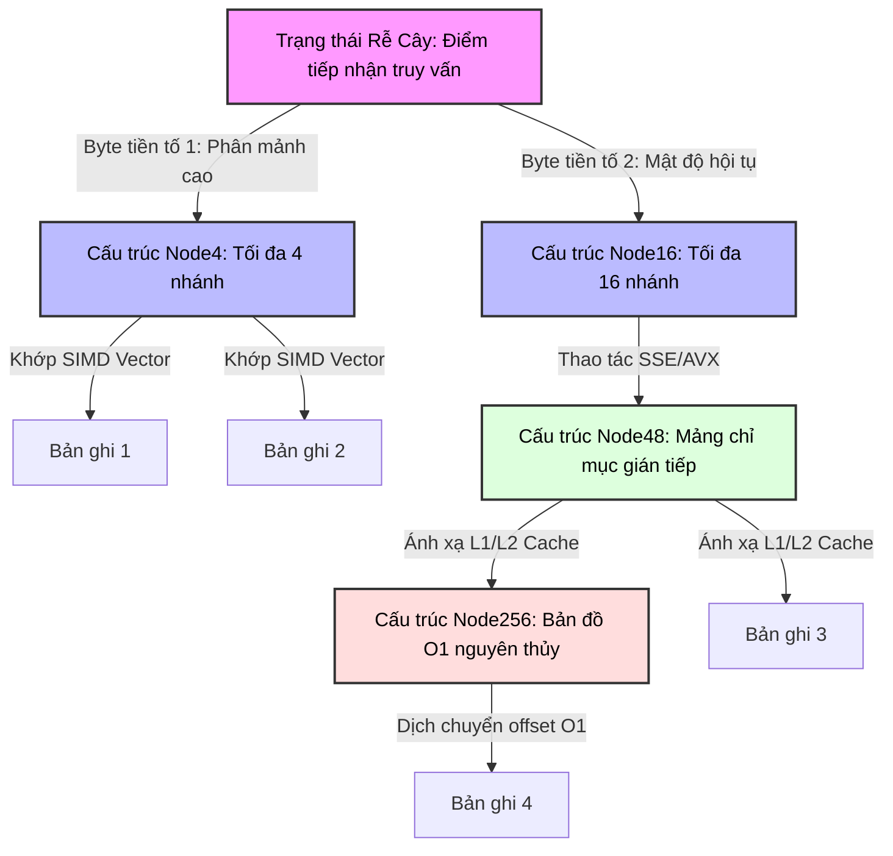

# Vì sao Adaptive Radix Tree (ART) trở thành chỉ mục mặc định của database in-memory

## Executive Summary (Tóm tắt / Overview)

Có một điểm chuyển đổi rõ rệt trong thiết kế chỉ mục database: ngay khi toàn bộ tập dữ liệu làm việc chuyển hẳn vào RAM, những giới hạn quen thuộc của đĩa cứng - thời gian seek, độ trễ xoay - không còn ý nghĩa gì nữa, và thứ thay thế chúng là băng thông bộ nhớ cùng số lần cache miss phát sinh trên mỗi lần tra cứu. Chính sự thay đổi ràng buộc đó buộc các hệ quản trị cơ sở dữ liệu in-memory (IMDB) phải suy nghĩ lại toàn bộ cách lập chỉ mục.

Bài viết này phân tích **Adaptive Radix Tree (ART)** - một cấu trúc dữ liệu được thiết kế ngay từ đầu để phù hợp với phần cứng hiện đại, chứ không phải để tối ưu cho I/O đĩa. ART lấy được khả năng truy vấn phạm vi của B-Tree, đạt tốc độ tra cứu gần hằng số như hash table, và đồng thời tự điều chỉnh theo vi kiến trúc CPU - căn chỉnh cache line, khai thác tập lệnh SIMD. Kết quả cuối cùng là một cấu trúc giải quyết dứt điểm vấn đề lãng phí không gian của radix tree cổ điển thông qua cơ chế co giãn kích thước node linh hoạt, đồng thời giữ cache miss và TLB miss ở mức đủ thấp để đóng vai trò chỉ mục chính trong các hệ thống OLTP/OLAP nghiêm túc.

## Core Problem Statement (Vấn đề cốt lõi)

### Vì sao các tiêu chuẩn cũ sụp đổ trong kỷ nguyên in-memory

1. **B+-Tree vẫn mang theo những giả định từ thời đại lưu trữ trên đĩa, vốn không còn phù hợp khi dữ liệu đã ở trong RAM.** Một node B+-Tree được thiết kế theo kích thước block đĩa - từ 4KB đến 16KB - sẽ trải rộng qua hàng chục cache line (mỗi cache line 64 byte trên x86-64). Duyệt một node nội bộ đòi hỏi tìm kiếm nhị phân với độ phức tạp $\mathcal{O}(\log_2(\mathcal{B}))$, kéo theo hàng loạt lệnh rẽ nhánh có điều kiện. Những lệnh này khiến bộ dự đoán rẽ nhánh của CPU đoán sai đủ thường xuyên để riêng phần dự đoán sai đã tiêu tốn hàng chục chu kỳ xung nhịp mỗi lần.

2. **Hash table đánh đổi hoàn toàn khả năng truy vấn phạm vi.** Tốc độ tra cứu $\mathcal{O}(1)$ nghe rất hấp dẫn, nhưng đổi lại dữ liệu bị rải ngẫu nhiên khắp không gian địa chỉ, khiến việc quét theo phạm vi - vốn là nhu cầu thường trực của xử lý phân tích và báo cáo - trở nên không thể thực hiện được. Và một khi load factor tăng cao, va chạm bắt đầu bào mòn ngay cả lời hứa $\mathcal{O}(1)$ đó.

3. **Radix trie thông thường buộc phải chọn giữa độ sâu và không gian.** Độ sâu cây tuân theo công thức $\mathcal{D} = \lceil \frac{\mathcal{K}}{s} \rceil$, với $\mathcal{K}$ là độ dài khóa theo bit và $s$ là số bit tiêu thụ mỗi bước nhảy. Nếu chọn $s=1$, cây trở nên sâu đến mức phi lý - một khóa 64-bit cần tới 64 lần nhảy con trỏ, mỗi lần đều có nguy cơ cache miss hoặc TLB miss. Nếu chọn $s=8$, cây phẳng đi đáng kể, chỉ còn 8 tầng cho cùng khóa đó, nhưng đổi lại mỗi node phải cấp phát tĩnh 256 vị trí con trỏ, và với dữ liệu thưa, hơn 99% mảng đó bỏ trống - lãng phí bộ nhớ vật lý rất lớn.

ART sinh ra để thoát khỏi hẳn sự đánh đổi này. Xuất phát điểm của nó rất đơn giản: mật độ khóa trong một chỉ mục thực tế chưa bao giờ đồng đều, nên buộc mọi node phải có cùng kích thước cố định vốn dĩ đã là một sự lãng phí ngay từ trong thiết kế. Thay vào đó, ART xây dựng một cấu trúc đồ thị lai, tự điều chỉnh kích thước node theo đúng mật độ dữ liệu thực tế tại thời điểm chạy.

## Deep Technical Knowledge / Internals (Kiến thức kỹ thuật chuyên sâu)

### Một hệ sinh thái node biến hình theo mức độ tăng trưởng

Thay vì chỉ dùng một loại node đồng nhất, ART định nghĩa bốn họ node với sức chứa khác nhau: **Node4**, **Node16**, **Node48**, và **Node256**, cho phép một node âm thầm tự thăng cấp hoặc giáng cấp tùy theo số lượng con thực tế.



#### Cấu trúc bên trong từng loại node

- **Node4 (40 byte)**: trạng thái thưa nhất trong hệ sinh thái. Lưu tối đa 4 sub-key (mỗi sub-key 1 byte) cùng 4 con trỏ (8 byte mỗi con trỏ), cộng thêm metadata. Toàn bộ 40 byte nằm gọn trong ranh giới một cache line 64 byte, nên truy cập Node4 không bao giờ phải chờ bộ nhớ.
- **Node16 (144 byte)**: khi phần tử thứ 5 được chèn vào Node4, nó được thăng cấp lên đây. Chứa 16 sub-key liên tiếp và 16 con trỏ liên kết. Điểm mạnh nhất của Node16 là 16 khóa này ánh xạ trực tiếp vào thanh ghi XMM/YMM của CPU để xử lý song song bằng SIMD.
- **Node48 (600 byte)**: một khi vượt quá 16 nhánh, việc dịch chuyển một mảng song song mỗi lần chèn trở nên tốn kém. Node48 chuyển sang mô hình gián tiếp: sở hữu một mảng chỉ mục 256 byte, trong đó giá trị byte tương ứng chính là chỉ số mảng, và giá trị được lưu sẽ trỏ tới vị trí thực trong một mảng tĩnh 48 con trỏ. Cách này loại bỏ hoàn toàn thao tác tìm kiếm tuyến tính tốn kém.
- **Node256 (2048 byte)**: đỉnh của giới hạn vật lý. Một mảng tĩnh 256 con trỏ, truy cập bằng một phép tính offset vô điều kiện - luôn là $\mathcal{O}(1)$, không có ngoại lệ.

### Tối ưu tập lệnh xử lý theo hướng branchless

Để loại bỏ chi phí dự đoán rẽ nhánh sai, ART áp dụng kỹ thuật lập trình branchless thông qua các tập lệnh SIMD chuẩn SSE2/AVX2. Hiệu quả này thể hiện rõ nhất ở Node16.

```cpp
// Cấu trúc cốt lõi của vi kiến trúc thuật toán ART (Biểu diễn C++ chuẩn C++20)
#include <immintrin.h>
#include <cstdint>

struct alignas(64) ARTNode {
    uint8_t type_descriptor;
    uint32_t active_children_count;
    uint32_t compression_prefix_length;
    uint8_t compressed_prefix[8]; // Giới hạn prefix nhỏ
};

struct alignas(64) Node16 : public ARTNode {
    uint8_t vector_keys[16];      // Mảng byte liên tiếp cho khóa
    ARTNode* memory_pointers[16]; // Mảng con trỏ bộ nhớ song song
};

// ... Node4, Node48, Node256 definitions ...

ARTNode* ART_Microkernel_Lookup(ARTNode* current_node, const uint8_t* query_key, uint32_t max_key_len, uint32_t current_depth) {
    while (current_node != nullptr) {
        // [1] Giải quyết Nén tiền tố (Path Compression)
        if (current_node->compression_prefix_length > 0) {
            uint32_t prefix_matched_bytes = Check_Optimized_Prefix(current_node, query_key, current_depth);
            if (prefix_matched_bytes != current_node->compression_prefix_length) return nullptr;
            current_depth += current_node->compression_prefix_length;
        }
        if (current_depth == max_key_len) return current_node; 
        
        uint8_t active_byte = query_key[current_depth];
        
        // Phân nhánh logic dựa trên Type Descriptor
        switch (current_node->type_descriptor) {
            case NODE16_TYPE: {
                Node16* specialized_node = static_cast<Node16*>(current_node);
                
                // Nạp byte cần tìm vào toàn bộ 16 byte của thanh ghi XMM (broadcast)
                __m128i target_byte_vector = _mm_set1_epi8(active_byte);
                
                // Nạp mảng 16 khóa từ bộ nhớ vào thanh ghi
                __m128i stored_keys_vector = _mm_loadu_si128(reinterpret_cast<const __m128i*>(specialized_node->vector_keys));
                
                // Thực thi phép so sánh bằng đồng loạt trong 1 chu kỳ xung nhịp (SIMD Eq)
                __m128i comparison_result = _mm_cmpeq_epi8(target_byte_vector, stored_keys_vector);
                
                // Trích xuất kết quả so sánh thành bitmask 16-bit
                unsigned matched_bitmask = _mm_movemask_epi8(comparison_result) & ((1 << specialized_node->active_children_count) - 1);
                
                if (matched_bitmask) {
                    // __builtin_ctz tính số số 0 ở đuôi, tìm ra chính xác index của node con một cách tức thì
                    current_node = specialized_node->memory_pointers[__builtin_ctz(matched_bitmask)];
                } else {
                    return nullptr; // Lỗi trượt, không tìm thấy
                }
                break;
            }
            // Logic vi mô phân nhánh cho phân lớp Node4, Node48, Node256 (Tĩnh lược)
        }
        current_depth++;
    }
    return nullptr;
}
```

Kết hợp `_mm_cmpeq_epi8` với `__builtin_ctz`, thao tác tìm nhánh con trong số 16 nhánh diễn ra hoàn toàn không cần vòng lặp hay câu lệnh `if`. Nhờ vậy, IPC (số lệnh thực thi mỗi chu kỳ) của CPU luôn duy trì gần mức trần.

### Nén đường dẫn và mở rộng lười

ART xử lý hiện tượng "chuỗi node chỉ có một con nối tiếp nhau" - nguyên nhân khiến trie thông thường trở nên quá sâu - bằng hai kỹ thuật phối hợp:

1. **Lazy Expansion (mở rộng lười)**: một lá chỉ chứa duy nhất một giá trị sẽ không bị khai triển thành cả một chuỗi node nhánh, mà được lưu như một con trỏ trực tiếp tới dữ liệu. Cây chỉ thực sự phân nhánh khi xảy ra va chạm.
2. **Path Compression (nén đường dẫn)**: một dãy các node liên tiếp mà mỗi node chỉ có đúng một con sẽ được gộp lại thành một tiền tố duy nhất, lưu ở node phía dưới. Thay vì phải nhảy qua 5 node riêng biệt chỉ để xác nhận chuỗi "A-B-C-D-E", ART lưu thẳng "ABCDE" vào mảng `compressed_prefix` của node đó, rồi so sánh bằng một phép so khớp khối bộ nhớ nhanh (về bản chất là `memcmp`).

### Tương tác với hệ điều hành, NUMA và quản lý bộ nhớ

Dựa vào `malloc` chuẩn của POSIX sẽ gây ra phân mảnh bộ nhớ ảo, vừa làm giảm hiệu quả của bộ prefetch phần cứng vừa gây ra TLB thrashing - điều không mong muốn với một cấu trúc nhạy cảm với độ trễ như ART.

Trong triển khai thực tế, ART cần một **bộ cấp phát slab phân cấp** riêng:

- Toàn bộ không gian địa chỉ ảo được chia thành các vùng chuyên dụng.
- Mỗi vùng được quy hoạch riêng: một vùng dành cho `Node4`, một vùng khác cho `Node16`, và cứ thế tiếp tục.
- **Nhận biết NUMA** là điều quan trọng trên các máy chủ nhiều socket: bộ cấp phát gắn địa chỉ bộ nhớ của một node mới sinh ra với đúng socket đang xử lý nó, từ đó tránh được độ trễ truyền dữ liệu xuyên miền qua bus QPI/UPI.

### Kiểm soát đồng thời đa lõi: OLC và ROWEX

Bảo vệ node bằng latch nặng hay read-write lock trong một hệ thống xử lý song song ở quy mô lớn sẽ nhanh chóng dẫn tới hiện tượng cache-line bouncing làm bão hòa bus hệ thống.

Thay vào đó, ART áp dụng triết lý **Optimistic Lock Coupling (OLC)** kết hợp với giao thức **ROWEX (Read-Optimized Write EXclusive)**:

- Mỗi cấu trúc node duy trì một bộ đếm phiên bản nguyên tử.
- **Giao dịch đọc không bao giờ giữ khóa.** Thread đọc ghi lại giá trị phiên bản $V_{pre}$, tiến hành đọc dữ liệu, thực thi lệnh hàng rào bộ nhớ `mfence` để ngăn compiler hay CPU sắp xếp lại thứ tự, rồi kiểm tra lại $V_{post}$. Nếu $V_{pre} == V_{post}$ và bit khóa chưa được kích hoạt, phiên đọc được xem là an toàn tuyệt đối. Nếu có sai lệch, tiến trình đọc tự hủy và thử lại.
- **Giao dịch ghi dùng kỹ thuật thay thế nguyên tử ngoài chỗ.** Thay vì sửa đổi bộ nhớ ngay tại chỗ - việc có thể làm hỏng các luồng đọc đang diễn ra - hệ thống sẽ sao chép node sang một vùng nhớ mới, áp dụng cập nhật lên bản sao, rồi chỉ cần thực thi một lệnh nguyên tử `lock cmpxchg` (Compare-And-Swap) duy nhất để hoán đổi con trỏ từ node cha. Các luồng đang đọc phiên bản cũ hoàn toàn không nhận ra thao tác ghi này.

## Practical Applications & Case Studies (Ứng dụng thực tế)

### Hệ quản trị CSDL in-memory quy mô lớn (OLTP/OLAP)

Các hệ thống hàng đầu như **HyPer Database** (TUM/Tableau) và **SAP HANA** xây dựng chỉ mục chính - cùng với storage cho dictionary encoding - trên nền tảng radix tree gần giống ART. Con số tại HyPer khá ấn tượng: hơn 50 triệu truy vấn điểm mỗi giây cho mỗi luồng CPU (core thread), vượt qua các biến thể B+-Tree như Masstree hay Bw-Tree với biên độ từ 20% đến 150%.

### Định tuyến IP mạng và khớp tiền tố

Trong hạ tầng viễn thông, tra cứu địa chỉ IP tuân theo mô hình Longest Prefix Match (LPM), và với kích thước địa chỉ IPv6, việc tra cứu này cần diễn ra ở tốc độ đường truyền (line-rate) trên các switch phần cứng cao cấp. Khả năng co giãn node của ART giúp thu nhỏ bảng định tuyến BGP (Forwarding Information Base - FIB) xuống chỉ còn vài megabyte, đủ nhỏ để nằm gọn trong L3 cache.

### Tinh chỉnh cấu hình trong thực tế

Để ART vận hành tốt, cần tinh chỉnh cẩn thận độ dài nén tối đa của metadata (max prefix length). Quá dài sẽ làm phình kích thước cơ sở của `ARTNode`; quá ngắn sẽ làm giảm hiệu quả của path compression. Trong các ứng dụng thực tế, giá trị 8-16 byte cho `compressed_prefix` thường được xem là điểm cân bằng hợp lý, giữ cho cấu trúc metadata luôn nằm trong khoảng 16-32 byte.

## Lessons Learned (Bài học rút ra)

1. **Hiểu biết về phần cứng quyết định một thuật toán có sống sót được trong thực tế hay không.** Độ phức tạp $\mathcal{O}$ trên lý thuyết không còn phản ánh đúng hiệu năng thực tế nếu bỏ qua các chỉ số cache miss, TLB thrashing và IPC. Thuật toán tốt nhất là thuật toán hoạt động tốt trên silicon thật, chứ không chỉ đẹp trên giấy.
2. **Branchless thắng branching, kể cả khi phải trả thêm chi phí.** Chấp nhận một vài lần nạp dữ liệu dư thừa và so sánh SIMD một cách "mù" luôn rẻ hơn nhiều so với một lần dự đoán rẽ nhánh sai. Thiết kế Node16 của ART là minh chứng rõ ràng nhất cho nguyên tắc này.
3. **Một kích thước node cố định không phù hợp với dữ liệu thực tế vốn dĩ lệch.** Cho phép cấu trúc tự thay đổi hình thái theo mật độ dữ liệu thực mang lại lợi thế rõ rệt cả về thời gian lẫn không gian bộ nhớ, và bốn loại node của ART chính là ví dụ cụ thể cho điều đó.
4. **Bộ nhớ bền vững và CXL đang đẩy ý tưởng này đi xa hơn.** Trước kỷ nguyên của NVDIMM (như Intel Optane) và giao thức CXL (Compute Express Link), khi băng thông ghi vật lý trở nên đắt đỏ trở lại, các biến thể như **FPTree** (Fingerprinting Persistent Tree) và **REC-ART** đang học hỏi từ cấu trúc lõi của ART, bổ sung thêm các lệnh rào chắn lưu trữ như $\mathcal{CLFLUSHOPT}$ để định hình lại giới hạn của lưu trữ bền vững trong tương lai.

---
