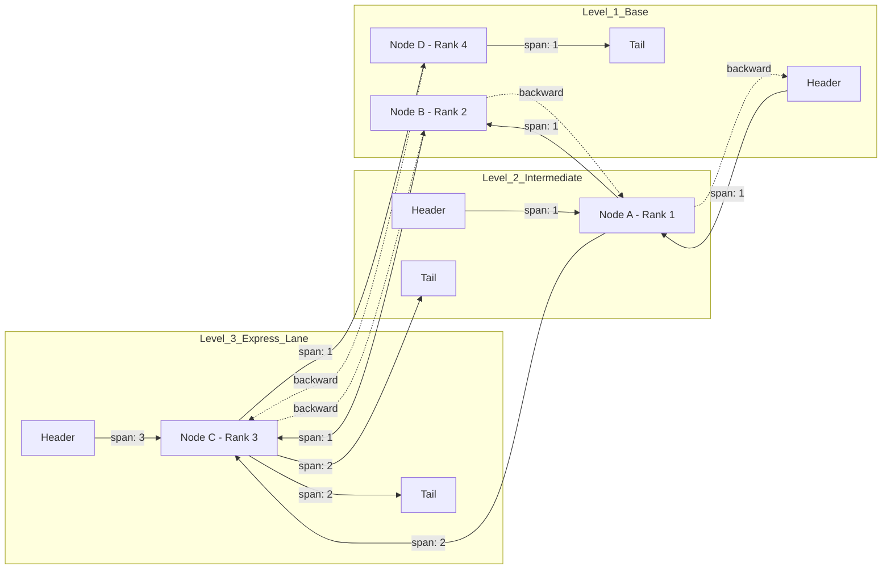

# How Redis Builds ZSET on Top of a Skip List

## Executive Summary (Overview)

Redis earned its reputation less on raw speed alone and more on how well its data structures map to real workloads. The **Sorted Set (ZSET)** is a good example: it keeps a collection of unique members, each tied to a floating-point score, and keeps them ordered automatically so that rank lookups, score-range queries, and positional retrieval all stay fast even as the set grows into the millions.

This piece walks through how Redis actually builds ZSET under the hood. The short version: a hash table paired with a tuned **skip list** variant. We'll get into why Redis passed on balanced binary trees, the math behind how a skip list decides its own shape, the `jemalloc`-based allocation strategy, how the structure interacts with CPU cache and the OS, and where it shows up in real production systems.

## Core Problem Statement

Maintaining a dynamic, ordered collection that supports search, insert, delete, and range queries in $\mathcal{O}(\log N)$ is a well-worn problem in computer science, and Redis's engineers had the usual candidates on the table when they designed ZSET:

1. **AVL trees and Red-Black trees** guarantee $\mathcal{O}(\log N)$ worst case, but keeping the tree balanced isn't free. Every insert or delete triggers rotations and recoloring. Redis is single-threaded, so lock contention isn't the issue — but all those rotations still burn CPU cycles and add latency jitter. Range queries (`ZRANGE`) need either an expensive in-order traversal or extra parent pointers that bloat every node.
2. **B-Trees and B+-Trees** are the obvious choice for disk-backed storage, tuned as they are for cache lines and OS page sizes. In an in-memory structure, though, splitting and merging nodes means constant memory copying, and the implementation complexity works against Redis's stated preference for simple, readable source.

That's where the **skip list**, introduced by William Pugh in 1990, becomes the more attractive option. Instead of enforcing strict structural balance, it settles for **probabilistic balancing** driven by a coin flip at insert time. It's simple to implement, fast in practice, naturally supports range queries through its bottom-level linked list, and is easy to tune — which is exactly why Redis built ZSET around it.

## Deep Technical Knowledge / Internals

### Two Structures Working Together: dict + Skip List

A Redis ZSET isn't just a skip list on its own — it's a synchronized pair:
- **`dict`** (a hash table) answers "what's this element's score" in $\mathcal{O}(1)$.
- **`zskiplist`** keeps the linear ordering, so rank queries and range scans run in $\mathcal{O}(\log N)$.

This is a straightforward space-time tradeoff: Redis spends extra memory maintaining the hash table so that `ZSCORE` doesn't have to walk anything.

### Inside zskiplistNode: the span Field

Pugh's original skip list design never solved rank counting — there was no cheap way to know that element $X$ sits at position 1,000,042 out of a few million. Redis's fix was to add a `span` field to each `zskiplistLevel`.

Here's the actual C structure:

```c
/* Structure defining a Skip List node */
typedef struct zskiplistNode {
    sds ele;                              // Dynamic SDS string holding the element's content
    double score;                         // Sorting score (IEEE 754 double precision)
    struct zskiplistNode *backward;       // Backward pointer (level 0) supporting ZREVRANGE
    struct zskiplistLevel {
        struct zskiplistNode *forward;    // Forward pointer (points to the next node at the same level)
        unsigned long span;               // Distance (number of physical nodes skipped)
    } level[];                            // Flexible Array Member holding the node's levels
} zskiplistNode;

/* List control block */
typedef struct zskiplist {
    struct zskiplistNode *header, *tail;
    unsigned long length;                 // Total number of elements
    int level;                            // Current highest level of the list
} zskiplist;
```

`span` records how many base-level nodes separate the current node from whatever its `forward` pointer targets. When `ZRANK` runs, it just sums up the `span` values along the path from `header` to the target node — turning what would otherwise be an $\mathcal{O}(N)$ walk into an $\mathcal{O}(\log N)$ running total.



*Mermaid diagram: the skip list's layered structure. Solid arrows are forward pointers annotated with span. Dashed arrows are backward pointers.*

### The Math Behind Random Level Generation

Whenever ZSET inserts a new element, it has to decide how tall the new node will be, and Redis does this by simulating a Bernoulli trial:
- Every node gets at least level 1.
- There's a $p = 0.25$ chance of climbing one level higher.
- The coin-flip repeats until it fails or hits `ZSKIPLIST_MAXLEVEL` (32).

The probability a node ends up at exactly $k$ levels follows a geometric distribution:
$$ P(L=k) = p^{k-1}(1-p) $$

And the expected number of levels, $\mathbb{E}[L]$, works out to:
$$ \mathbb{E}[L] = \sum_{k=1}^{32} k \cdot p^{k-1}(1-p) \approx \frac{1}{1-p} $$

Plug in $p=0.25$ and you get $\mathbb{E}[L] = 1.33$ — on average, a node carries just 1.33 levels of pointer overhead. Compare that to a binary tree's fixed 2 pointers per node, and the skip list's asymmetric design comes out well ahead on memory.

### Allocation: jemalloc and the Flexible Array Member

Redis hands heap allocation off to `jemalloc` (or `tcmalloc`), chosen specifically for how well it handles fragmented workloads.

`zskiplistNode` takes advantage of the C99 **flexible array member** trick — that `level[]` at the end of the struct — so a whole node, metadata and all its levels, gets allocated in one call:
$$ \text{Size} = \text{sizeof}(zskiplistNode) + (k) \times \text{sizeof}(zskiplistLevel) $$

That keeps each node's memory fully contiguous and eliminates internal fragmentation entirely. The tradeoff is that constant resizing of the ZSET as a whole increases external fragmentation over time — `jemalloc` handles this reasonably well, but it's still worth watching `mem_fragmentation_ratio` via `INFO MEMORY` on a busy instance.

### Where the CPU Cache Fights Back

For all its algorithmic elegance, the skip list has a real weakness on modern hardware: it depends heavily on pointer chasing, and pointer chasing is exactly what cache-friendly CPUs are bad at.

`zskiplistNode` objects end up scattered across the heap, so walking the list means jumping to essentially random addresses. Each jump wastes most of a 64-byte cache line, and the address of the next node can't be predicted ahead of time. The result is a steady stream of L1/L2/L3 cache misses and TLB misses, with the pipeline stalling for hundreds of cycles waiting on DRAM.

Redis's answer to this is a separate structure called **listpack**.

### Listpack: Trading Big-O for Cache Friendliness

Below a couple of configured thresholds — `zset-max-listpack-entries` (default 128) and `zset-max-listpack-value` (default 64 bytes) — Redis skips the hash table and skip list entirely and stores the whole ZSET as one contiguous byte blob, a **listpack** (the successor to the older `ziplist`):

`[Header] [Element_1] [Score_1] [Element_2] [Score_2] ... [End]`

Lookups against a listpack degrade to a flat $\mathcal{O}(N)$ scan instead of $\mathcal{O}(\log N)$, and yet in practice they're often tens of times faster for small sets. A few hundred contiguous bytes fits comfortably in L1/L2 cache, the hardware prefetcher does exactly what it's good at on a sequential scan, and resizing happens through `realloc`/`memmove`, which the CPU handles well with vectorized instructions. Only once the set grows past the configured threshold does Redis convert it — irreversibly — into a full skip list.

### Fighting the OS: fork() and Copy-on-Write

Redis persistence (RDB snapshots, AOF rewrite) relies on `fork()` to spin up a background process, and Linux handles the resulting memory sharing via copy-on-write at the page level.

This works fine until writes start hitting a ZSET backed by a skip list. A single insertion touches `span` and `forward` fields scattered across dozens of unrelated nodes, and because those nodes are physically dispersed, that one insertion can trigger page faults across dozens of separate 4KB pages — each one now needing a real copy. Do this enough and you get a memory usage spike large enough to invite the Linux OOM killer. This is why `overcommit_memory = 1` and a healthy RAM headroom aren't optional in production.

## Practical Applications & Case Studies

### Real-Time Leaderboards

Gaming and e-commerce platforms lean on ZSET for leaderboards that update constantly across tens of millions of users. `ZINCRBY` for score updates, `ZREVRANGE` for top-K queries, and `ZRANK` for a user's current position all run in sub-millisecond time — and `ZREVRANGE` in particular gets its speed almost entirely from the `span` metadata solving rank computation cheaply.

### Sliding-Window Rate Limiters

A common pattern for L7 rate limiting stores a microsecond timestamp as the score and a UUID as the member. `ZREMRANGEBYSCORE` purges anything outside the current window (say, older than 60 seconds), and `ZCARD` gives an instant count of what's left — a cheap, effective way to build a sliding-window limiter.

### Time-Series Indexing

IoT platforms ingesting telemetry from millions of sensors can use timestamp as the score. Pulling a device's readings between $T_1$ and $T_2$ becomes a `ZRANGEBYSCORE` query at $\mathcal{O}(\log N + M)$ — the skip list jumps straight to $T_1$, then scans linearly through the $M$ matching entries.

### Delayed Task Queues

Using score as a future execution timestamp, worker processes poll with `ZRANGEBYSCORE -inf <current_timestamp> LIMIT 0 1`. The skip list keeps that lookup at $\Theta(\log N)$ regardless of queue size, which keeps the whole worker pool responsive.

## Lessons Learned

1. **Probabilistic balance is often good enough, and simpler to live with.** Trading strict mathematical balancing for a random geometric distribution gave Redis a structure that's easier to maintain, has smoother latency, and sidesteps the coordination overhead a balanced tree would otherwise need.
2. **Cache locality beats clever asymptotics more often than people expect.** Listpack is the clearest proof: a dumb sequential $\mathcal{O}(N)$ scan over contiguous memory regularly outperforms a "smarter" $\mathcal{O}(\log N)$ walk over scattered heap nodes, right up until the data set gets big enough that the math wins back.
3. **Pointer-heavy structures carry a hidden OS-level cost.** No matter how good the in-memory algorithm is, page faults and copy-on-write during a fork are the real ceiling — worth understanding before you provision RAM for a large Redis cluster.
4. **Combining two structures can be worth the memory.** Pairing `dict` with `zskiplist` costs some memory but buys constant-time score lookups on top of ordered access — a good example of when duplicating state is the right tradeoff.

---
