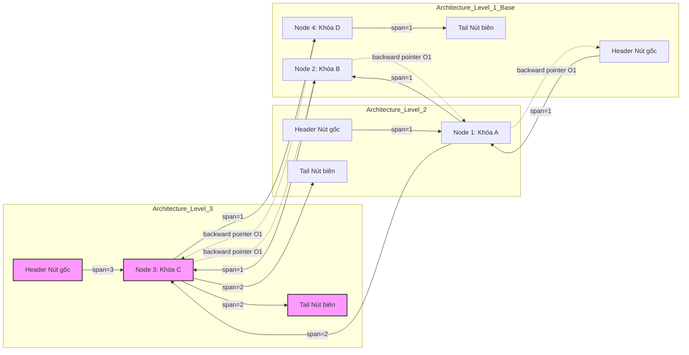

# 23: Skip Lists trong thực tế: Cách Redis cài đặt Sorted Sets (ZSET)

## Cơ sở lý thuyết và Kiến trúc cốt lõi của Skip List trong Redis

Bắt đầu bằng việc phân tích bối cảnh ra đời của cấu trúc dữ liệu Skip List và lý do tại sao Redis, một trong những hệ quản trị cơ sở dữ liệu in-memory có hiệu năng cao nhất thế giới, lại lựa chọn nó để cài đặt kiểu dữ liệu Sorted Sets (ZSET). Trong khoa học máy tính, bài toán duy trì một tập hợp các phần tử được sắp xếp thứ tự đồng thời hỗ trợ các thao tác tìm kiếm, chèn, xóa và truy vấn khoảng (range queries) với độ phức tạp thời gian tối ưu là một thách thức kinh điển. Các cấu trúc dữ liệu truyền thống như Cây nhị phân tìm kiếm cân bằng (Balanced Binary Search Trees) bao gồm AVL Tree hay Red-Black Tree đã giải quyết bài toán này với độ phức tạp thời gian tiệm cận $\mathcal{O}(\log N)$ cho các thao tác cơ bản. Tuy nhiên, việc duy trì trạng thái cân bằng nghiêm ngặt trong Red-Black Tree đòi hỏi các thao tác xoay cây (tree rotations) và cập nhật màu sắc vô cùng phức tạp sau mỗi lần chèn hoặc xóa. Các thao tác này không chỉ gây ra độ trễ tính toán đáng kể mà còn tạo ra những luồng truy cập bộ nhớ (memory access patterns) khó dự đoán, làm giảm hiệu suất của bộ nhớ đệm CPU (CPU cache). Thêm vào đó, việc thực hiện các truy vấn khoảng trên Red-Black Tree yêu cầu các phép duyệt trung thứ tự (in-order traversal) phức tạp, đòi hỏi phải duy trì con trỏ cha (parent pointers) hoặc sử dụng ngăn xếp (stack), làm tăng thêm sự rườm rà trong cài đặt và quản lý bộ nhớ Heap. Đứng trước những hạn chế cấu trúc này, William Pugh đã giới thiệu Skip List vào năm 1990 như một giải pháp thay thế thanh lịch, dựa trên nền tảng của các thuật toán ngẫu nhiên (randomized algorithms). Skip List không cố gắng duy trì sự cân bằng một cách cưỡng chế thông qua các quy tắc cấu trúc cứng nhắc; thay vào đó, nó tận dụng sức mạnh của lý thuyết xác suất để tạo ra một cấu trúc phân cấp các danh sách liên kết, trong đó sự cân bằng được đảm bảo về mặt kỳ vọng toán học (probabilistic expectation). Cụ thể, xác suất để chiều cao tối đa của một danh sách chứa $n$ phần tử vượt qua ngưỡng $c \log_{1/p} n$ sẽ suy giảm theo hàm đa thức $\mathcal{O}(1/n^{c-1})$, cung cấp một sự đảm bảo cực kỳ vững chắc về hiệu năng với xác suất cao (with high probability - w.h.p). Trong ngữ cảnh của Redis, nơi mà sự đơn giản của mã nguồn, khả năng bảo trì và hiệu năng xử lý đơn luồng được đặt lên hàng đầu, Skip List nổi lên như một sự lựa chọn hoàn hảo. Cấu trúc danh sách liên kết ở tầng cơ sở của Skip List cho phép các lệnh như `ZRANGE` hay `ZREVRANGE` được thực thi bằng cách duyệt tuần tự vô cùng tự nhiên, vượt trội hoàn toàn so với các biến thể của cây nhị phân vốn phải chịu chi phí trượt bộ nhớ đệm nặng nề khi di chuyển lên xuống giữa các nút trung gian và nút lá.

Sự tinh tế trong kiến trúc cốt lõi của Skip List trong Redis được thể hiện rõ nét qua cách định nghĩa các cấu trúc dữ liệu C nội tại. Không giống như thiết kế nguyên thủy của Pugh vốn chỉ tập trung vào thao tác tìm kiếm phần tử, Redis đã tiến hành nhiều cải tiến sâu sắc để phục vụ cho các yêu cầu khắt khe của một hệ thống cơ sở dữ liệu thực thụ yêu cầu tính toán thứ hạng (rank operations). Mỗi nút trong Skip List của Redis được biểu diễn bằng cấu trúc `zskiplistNode`. Cấu trúc này chứa một con trỏ tới đối tượng chuỗi động `sds` (Simple Dynamic String) mang giá trị của phần tử, một biến số thực dấu phẩy động `double` 64-bit theo chuẩn IEEE 754 lưu trữ điểm số (score) dùng để sắp xếp, một con trỏ `backward` trỏ về nút liền trước ở tầng thấp nhất (level 0) nhằm hỗ trợ duyệt ngược chiều, và một mảng linh hoạt (flexible array member) các cấu trúc `zskiplistLevel`. Việc sử dụng kiểu `double` mang lại dải biểu diễn số nguyên chính xác lên đến $2^{53}$, biến ZSET thành một công cụ lý tưởng cho việc đánh trọng số dựa trên nhãn thời gian thực (real-time Unix timestamps) với độ phân giải mili-giây mà không lo sợ tràn số nguyên. Đặc biệt, mỗi phần tử trong mảng `zskiplistLevel` không chỉ chứa một con trỏ `forward` trỏ đến nút tiếp theo ở tầng tương ứng, mà còn tích hợp một biến số nguyên không dấu `span` (khoảng cách nhảy). Biến `span` này là một phát kiến mang tính đột phá của Redis, ghi nhận chính xác số lượng nút vật lý bị bỏ qua bởi con trỏ `forward` tại đường dẫn của tầng đó. Nhờ có siêu dữ liệu `span` này, Redis có thể thực hiện các thao tác tính toán thứ hạng của một phần tử (ví dụ: lệnh `ZRANK`) với độ phức tạp thời gian lý thuyết $\mathcal{O}(\log N)$, thay vì phải đếm tuần tự $\mathcal{O}(N)$ như trong các danh sách liên kết đơn thuần. Việc tính toán thứ hạng từ một thành phần tìm kiếm nhị phân được thực thi bằng việc tích lũy các giá trị `span` dọc theo đường đi từ nút gốc (header) đến nút đích thông qua các bước nhảy cấp. Dưới đây là mã giả C/C++ minh họa cho cấu trúc vi mô này, thể hiện sự tối ưu hóa bố cục không gian địa chỉ bộ nhớ (memory address space layout) mà đội ngũ kỹ sư lõi của Redis đã dày công thiết kế nhằm giảm thiểu lãng phí khối lượng phân bổ (allocation overhead):

```c
/* Định nghĩa nút cơ sở của Skip List trong kiến trúc bộ nhớ Redis */
typedef struct zskiplistNode {
    sds ele;                              // Con trỏ chứa chuỗi động SDS mang giá trị định danh
    double score;                         // Trọng số đánh giá IEEE 754 Double Precision
    struct zskiplistNode *backward;       // Con trỏ trượt lùi tại Level 0 hỗ trợ ZREVRANGE
    struct zskiplistLevel {
        struct zskiplistNode *forward;    // Con trỏ hướng tiến chỉ định nút kế tiếp ở cùng cấp độ
        unsigned long span;               // Số lượng khoảng cách logic nút nhảy qua (phục vụ ZRANK)
    } level[];                            // Mảng động linh hoạt kích thước biến đổi theo cấp độ ngẫu nhiên
} zskiplistNode;

/* Cấu trúc quản trị không gian đỉnh của Skip List */
typedef struct zskiplist {
    struct zskiplistNode *header, *tail;  // Con trỏ biên quản lý hai đầu danh sách
    unsigned long length;                 // Tổng số phần tử hiện hữu (đếm số nút ở Level 0)
    int level;                            // Cấp độ cấu trúc cao nhất hiện đang được sử dụng
} zskiplist;
```

Thuật toán sinh cấp độ ngẫu nhiên (randomized level generation process) là trái tim vận hành của hệ thống Skip List, quyết định trực tiếp đến hình thái học kiến trúc và hiệu suất tiệm cận dài hạn của toàn bộ cấu trúc dữ liệu. Khi một nút mới được khởi tạo bằng `malloc` và chuẩn bị nội suy vào danh sách, hệ thống bắt buộc phải ra quyết định xem nút này sẽ tham gia vào bao nhiêu tầng đường dẫn cao tốc. Redis không sử dụng một hàm băm mật mã học đắt đỏ; thay vào đó, nó thiết kế một quy trình Bernoulli mô phỏng cấu trúc phân phối hình học (geometric distribution) thông qua thao tác thao tác bitwise cực kỳ tinh gọn. Cụ thể, mỗi nút khi ra đời luôn mặc định tồn tại ở ít nhất tầng 1. Xác suất để một nút tiếp tục được nâng lên tầng tiếp theo là $p = 0.25$ (tức là 25%). Quá trình gieo xúc xắc thuật toán này lặp lại liên tục cho đến khi nút không được thỏa mãn điều kiện nâng cấp hoặc chạm đến ngưỡng trần vật lý `ZSKIPLIST_MAXLEVEL`, hiện được thiết lập chặt chẽ là 32 (trong các phiên bản Redis thế hệ trước là 64). Về mặt diễn giải toán học, xác suất để một nút sở hữu chính xác $k$ tầng được biểu diễn bằng phương trình khối lượng xác suất $P(L=k) = p^{k-1}(1-p)$. Từ dạng phân phối rời rạc này, các kỹ sư hệ thống có thể tính toán chính xác kỳ vọng toán học của tổng số lượng con trỏ trên mỗi nút, hay nói cách khác là chiều cao bộ nhớ trung bình của một nút cấp phát động. Gọi $\mathbb{E}[L]$ là kỳ vọng hàm số tầng, ta thiết lập chuỗi vô hạn hội tụ: $\mathbb{E}[L] = \sum_{k=1}^{32} k \cdot P(L=k) \approx \sum_{k=1}^{\infty} k \cdot p^{k-1}(1-p) = \frac{1}{1-p}$. Khi thay thế hằng số cấu trúc $p = 0.25$ vào phương trình giới hạn, ta thu được kết quả $\mathbb{E}[L] = \frac{1}{0.75} \approx 1.333$. Con số 1.333 này mang một ý nghĩa thống kê kiến trúc cực kỳ to lớn: xét trên bình diện vĩ mô, trung bình mỗi nút trong Skip List của Redis chỉ tiêu thụ khoảng 1.33 con trỏ `forward` cộng với 1.33 biến `span`. Hãy thử thiết lập một hệ quy chiếu song song với Cây nhị phân tìm kiếm thông thường (Binary Search Tree) nơi mỗi nút luôn yêu cầu cố định chính xác 2 con trỏ (con trái và con phải) bất chấp vị trí topo, thiết kế của Skip List triệt tiêu đáng kể không gian bộ nhớ siêu dữ liệu cấu trúc (structural metadata overhead). Cấu trúc phân tầng xác suất bất đối xứng này tạo ra các tuyến đường liên kết cao tốc (data expressways), cho phép engine tìm kiếm lướt qua những khối lượng khổng lồ các phần tử rác với độ phức tạp truy xuất bộ nhớ tiệm cận tối thiểu.



## Tối ưu hóa Bộ nhớ và Quản lý Concurrency trong Redis ZSET

Tiến sâu vào khía cạnh tích hợp hệ thống quản lý trạng thái đồng thời (concurrency management) và các cơ chế tối ưu hóa cục bộ bộ nhớ chuyên sâu, giới hàn lâm và kỹ sư thực hành cần phải nhìn nhận rằng Sorted Set trong Redis (ZSET) trên thực tế là một cấu trúc dữ liệu lai kép (dual composite data structure) phức tạp tột độ, liên kết đồng bộ cơ sở dữ liệu nội tại giữa một bảng băm đa hình (hash table, được định danh là `dict` trong mã nguồn C) và một danh sách nhảy (`zskiplist`). Bảng băm đóng vai trò sinh tử trong việc duy trì ánh xạ định tuyến một-một từ địa chỉ con trỏ phần tử chuỗi `sds` sang điểm số `double` tương ứng của nó, cung cấp sự bảo đảm tuyệt đối rằng các thao tác tra cứu điểm số độc lập bằng chuỗi khóa nguyên thủy như lệnh `ZSCORE` luôn được thực thi trong cấu trúc thời gian $\mathcal{O}(1)$ phân bổ trung bình (amortized time). Ngược lại, thực thể `zskiplist` gánh vác trách nhiệm bảo tồn thứ tự sắp xếp hình thái học của toàn bộ không gian phần tử, dựa trên tiêu chí phân loại chính là biên độ điểm số `double` và tiêu chí gỡ rối phụ (tie-breaker) là thứ tự từ điển tuyến tính (lexicographical byte order) của chính chuỗi `sds` thông qua hàm so sánh `memcmp` trong trường hợp có nhiều phần tử đồng điểm. Cấu trúc song song kép này là một minh chứng kỹ thuật xuất sắc cho định lý đánh đổi giữa không gian lưu trữ và thời gian thực thi (space-time algorithmic tradeoff). Mặc dù kiến trúc này tiêu tốn dung lượng bộ nhớ RAM lớn hơn đáng kể để lưu trữ các cụm con trỏ đôi và bảng băm dư thừa cho cả hai hệ thống định tuyến tách biệt, thiết kế đánh đổi này lại kiến tạo ra các ranh giới độ phức tạp thuật toán tiệm cận hoàn hảo cho mọi loại đồ thị truy vấn mà Redis engine bị thách thức. Trong quá trình vận hành luồng ghi chèn phần tử mới qua API `zslInsert`, thuật toán bắt buộc phải đổ đèo bằng cách duyệt tuần tự đồ thị skip list từ đỉnh tầng cao nhất hiện hành (`zsl->level`) rơi tự do xuống nền tảng tầng 1. Trong suốt thời gian diễn ra chặng hạ cánh tính toán này, hệ thống kích hoạt hai mảng tham chiếu tĩnh cục bộ trên bộ nhớ stack của luồng: mảng định hướng `update` mang kích thước khai báo cứng bằng số tầng thiết kế tối đa (32), chuyên dụng để tóm lược địa chỉ con trỏ của nút biên cuối cùng được truy cập trúng tại mỗi cấp độ ngay trước khi vượt qua điểm rơi tọa độ chèn; và mảng vô hướng `rank`, một thanh ghi bộ nhớ lưu trữ tích lũy trọng số thứ hạng (bản chất là tổng đại số các giá trị `span`) tính từ điểm xuất phát (header) đến các nút mỏ neo đang nằm gọn trong mảng `update`. Sau khi radar thuật toán khóa mục tiêu chính xác vị trí chèn ở nền tảng vật lý tầng 1, một khối đối tượng `zskiplistNode` hoàn toàn mới được cấp phát từ heap memory allocator với một mức bậc hàm ngẫu nhiên tuân theo phân phối hình học đã trình bày. Công đoạn nối cáp các đường dẫn con trỏ `forward` tại các độ cao tầng tương thích của các nút mỏ neo trong `update` sẽ được phẫu thuật cắt dán (pointer splicing) để bẻ lái đâm xuyên qua nút phần tử mới này, một hình thức tương đồng với thủ thuật tái cấu trúc con trỏ chèn danh sách liên kết đơn (singly linked list insertion) nhưng được thi hành đa chiều trong các vùng không gian siêu cấp (hyper-dimensional spaces). Tuy nhiên, phân đoạn thuật toán đoạt giải kỹ thuật phức tạp nhất và yêu cầu tư duy lập trình sắc bén bậc nhất của Redis lại chính là quy trình đại số tính toán lại mạng lưới các biến số `span`. Đối với các ma trận tầng mà nút định danh mới thực sự tồn tại, giá trị `span` của nút sinh non này và nút liền kề trước nó trong mảng `update` sẽ bị xé lẻ và phân bổ lại nghiêm ngặt dựa trên mức chênh lệch thứ hạng tương đối được trích xuất từ dữ liệu trong mảng `rank`. Đối diện với các tầng không gian bậc cao hơn nơi mà nút hạ đẳng mới không đủ năng lượng vươn lên chạm tới, biến khoảng cách `span` của các nút liên kết bắc cầu đi ngang qua không phận đó chỉ đơn thuần được tịnh tiến tuyến tính thêm 1 đơn vị số nguyên, phản chiếu sự kiện thực tại vật lý rằng có thêm chính xác một chướng ngại vật phần tử xuất hiện ẩn mình bên dưới đường đạn bay của con trỏ `forward` siêu tốc đó. Khối lượng tính toán cập nhật đại số vi mô (micro-algebraic updating computations) này là bảo chứng cốt lõi cam kết tính toàn vẹn và nhất quán dữ liệu (data integrity) của toàn bộ đồ thị Skip List phân cấp.

Khi mổ xẻ phương diện quản trị cấp phát và thủ tiêu giải phóng bộ nhớ (memory allocation and deallocation lifecycle), Redis bộc lộ sự phụ thuộc chiến lược vào các cỗ máy cấp phát bộ nhớ động độc lập tùy chỉnh của nhân hệ điều hành, đại diện tiêu biểu là `jemalloc` trên hệ sinh thái GNU/Linux. Bởi vì mỗi nút đối tượng `zskiplistNode` mang trong mình một cấu hình số lượng tầng ngẫu nhiên không thể báo trước, khối lượng byte vật lý của mỗi cá thể thực thể được cấp phát vào không gian địa chỉ ảo Heap là hoàn toàn cá biệt. Phương pháp lập trình tiếp cận bằng cấu trúc mảng động linh hoạt (C99 flexible array member) được đính kèm ở đoạn đuôi cấu trúc dữ liệu `zskiplistNode` cho phép engine Redis chỉ phải phóng ra lời gọi hệ thống (system call) thủ tục `malloc` một lần duy nhất, duy nhất cho toàn bộ hình hài nút, với khối lượng không gian bộ nhớ cần thiết được biên dịch theo phương trình đại số: $\text{Size}_{\text{allocated}} = \text{sizeof}(zskiplistNode) + k \times \text{sizeof}(zskiplistLevel)$, với tham số $k$ đại diện cho giới hạn số tầng ngẫu nhiên được sinh ra. Cơ chế định dạng kích thước động linh hoạt này đã tiêu diệt hoàn toàn đến mức tuyệt đối hiện tượng phân mảnh bộ nhớ nội vi (internal fragmentation) tại đơn vị vi mô đối tượng. Dẫu vậy, việc thao túng hàng trăm triệu đối tượng có hình thái kích thước dị biệt trong cùng một phân vùng không gian lại vô tình chuyển dời áp lực sinh tồn khổng lồ lên các hệ thống mô-đun quản lý khối bộ nhớ lớn (superblock management) của bản thân trình `jemalloc`, làm tăng vọt xác suất gây ra thảm họa phân mảnh bộ nhớ ngoại vi (external memory fragmentation) khi các tập hợp đối tượng sở hữu vòng đời dài (long-lived) và ngắn (ephemeral) nằm xen kẽ tàn khốc trên dải không gian địa chỉ tuyến tính. Để cung cấp tầm nhìn giám sát cho hiện tượng này, Redis trang bị giao thức đo lường viễn trắc thông qua lệnh `INFO MEMORY`, cho phép quản trị viên hệ thống (sysadmins) theo dõi sát sao biểu đồ biến thiên của chỉ số `mem_fragmentation_ratio`. Tiến sâu hơn vào triết lý thiết kế vi kiến trúc, với nền tảng là một kiến trúc luồng sự kiện I/O đơn lõi (single-threaded event loop architecture) điều khiển bởi `epoll` hoặc `kqueue`, việc thao tác vạch trần trên các tập hợp cấu trúc bộ nhớ hỗn loạn này lại hoàn toàn vắng bóng các cơ chế khóa tranh chấp (mutex locks), cũng không cần đến các thuật toán dữ liệu không khóa (lock-free structures algorithms) phức tạp, hay các vòng lặp kiểm tra và cập nhật nguyên tử ở cấp độ thanh ghi CPU (atomic Compare-And-Swap spin-loops) vốn là gánh nặng khét tiếng trong lớp `ConcurrentSkipListMap` của thư viện tiêu chuẩn Java. Sự vắng mặt tĩnh lặng về mặt đa luồng (concurrency silence) này đã thủ tiêu vĩnh viễn toàn bộ chi phí hao tổn từ việc bộ điều khiển bộ nhớ (memory controller) phải liên tục vô hiệu hóa các dòng dữ liệu đệm (cache-line invalidation storms) giữa các lõi vi xử lý vật lý. Sự cô lập đơn luồng giúp CPU của hệ thống Redis liên tục bơm dữ liệu và duy trì trạng thái ống dẫn lệnh vi xử lý (instruction execution pipelines) ở giới hạn tốc độ xung nhịp nhiệt tối đa (maximum thermal clock rate), sinh ra lợi thế hiệu suất I/O theo lô (batch throughput) cực đoan trong môi trường giao dịch nối tiếp cường độ cao.

Dẫu rằng kiến trúc con trỏ kép (dual pointer architecture) cung cấp một giới hạn tiệm cận cực kỳ hấp dẫn, các Kỹ sư Hệ thống tại Redis Labs nhận thức sâu sắc về sự hoang phí tài nguyên vô nghĩa khi triển khai cấu trúc khổng lồ này lên các tập dữ liệu có quy mô siêu nhỏ. Để giải bài toán này, họ đã thiết kế một chuẩn định dạng mã hóa bộ nhớ thay thế mang tính cách mạng dành riêng cho các tập hợp ZSET sơ khai, mang tên mã là `listpack` (trong các thế hệ kiến trúc cũ được gọi là `ziplist`). Phương pháp luận này là một minh chứng hoàn hảo của khái niệm tối ưu hóa vi cấu trúc thích ứng phần cứng (hardware-adaptive data structuring). Khi quần thể phần tử của một cấu trúc ZSET nằm bên dưới vĩ tuyến cấu hình `zset-max-listpack-entries` (mặc định 128 phần tử) và quy mô kích thước byte của tất cả các chuỗi cấu thành nhỏ hơn giới hạn `zset-max-listpack-value` (mặc định 64 bytes), toàn bộ tập hợp ZSET đó sẽ tuyệt đối không được khởi tạo dưới định dạng đồ thị `dict` và `zskiplist`. Thay vì lãng phí chu kỳ hệ thống, khối dữ liệu nhỏ bé này được nén chặt và ép khuôn thành một mảng địa chỉ bộ nhớ vật lý liên tục duy nhất (a monolithic contiguous memory chunk) tuân theo giao thức `listpack`. Trong tổ chức cấu trúc dữ liệu tuyến tính phẳng này, các chuỗi phần tử định danh và dữ liệu điểm số tương quan của chúng được tuần tự hóa (serialized) và bố trí nối tiếp nhau, xen kẽ xen kẽ một cách hoàn hảo như một dải ruy băng nhị phân. Bất kỳ và mọi thao tác can thiệp như `ZADD`, `ZRANGE`, hay tra cứu `ZSCORE` trực tiếp trên một ZSET dạng `listpack` đều bị cưỡng bức giải quyết thông qua giải thuật quét tuyến tính $\mathcal{O}(N)$ (linear array scanning) chạy dọc theo chiều dài khối bộ nhớ, thay vì sử dụng giải thuật tìm kiếm nhị phân chia để trị $\mathcal{O}(\log N)$. Đứng ở góc độ phân tích thuật toán thuần túy cơ bản, sự thoái lui từ $\mathcal{O}(\log N)$ xuống $\mathcal{O}(N)$ dường như là một sự vi phạm trắng trợn các nguyên tắc nền tảng. Tuy nhiên, khi đặt vào bức tranh thực tế của kỷ nguyên kiến trúc máy tính Von Neumann hiện đại, nguyên lý tính địa phương không gian học (spatial locality of reference) của hệ thống phân cấp bộ nhớ đệm CPU nội vi L1/L2/L3 đóng vai trò bá chủ cai trị hiệu suất. Một thao tác quét mảng tuyến tính $\mathcal{O}(N)$ chạy trên một khối bộ nhớ siêu nén nằm lọt thỏm hoàn toàn bên trong ranh giới của một hoặc một số ít các dòng bộ nhớ đệm (cache lines - có kích thước tiêu chuẩn 64 bytes) sẽ ngay lập tức đánh thức cơ chế tải trước dữ liệu đệm dựa trên phần cứng (hardware data prefetcher mechanism), đẩy tốc độ truy cập dữ liệu lên cực hạn mà hoàn toàn không vấp phải bất kỳ độ trễ do lỗi trượt bộ nhớ đệm (cache misses latency) nào. Ngạc nhiên hơn nữa, thao tác bảo trì nội dung `listpack` chỉ phụ thuộc vào những lời gọi hệ thống cấp phát lại vùng nhớ `realloc` tích hợp cùng thủ tục dịch chuyển mảng bit `memmove` được tối ưu hóa bằng các lệnh hợp ngữ vector (SIMD instructions), sở hữu tốc độ thực thi nhanh hơn gấp hàng chục lần so với việc phải lặn lội qua các tầng cấp phát động ngẫu nhiên phân mảnh chậm chạp. Chỉ trong tình huống khi các tường lửa giới hạn phần tử hoặc dung lượng byte bị xuyên thủng, nền tảng Redis mới miễn cưỡng kích hoạt một quy trình rã đông tái cấu trúc (data structure refactoring workflow) một chiều không thể vãn hồi, biên dịch tập dữ liệu từ trạng thái `listpack` tiết kiệm năng lượng sang hình thái `dict` + `zskiplist` khổng lồ đa phân mảnh để duy trì tính tiệm cận logarit.

## Phân tích Độ phức tạp, Tối ưu hóa Cấp độ Phần cứng và Thực nghiệm

Bước vào phần phân tích độ phức tạp thời gian tiệm cận và các giới hạn vật lý nghiêm ngặt ở cấp độ giao diện gọi hàm hệ điều hành (OS system call boundaries), chúng ta bắt buộc phải đánh giá Skip List dưới lăng kính kết hợp của toán học giải tích và kiến trúc vi mô vi xử lý (microarchitecture). Độ dài đường dẫn tìm kiếm kỳ vọng trung bình (expected search path length) hiện diện trong một đồ thị Skip List bị chi phối bởi tham số xác suất $p$ có thể được thiết lập chính xác bằng cách đảo ngược quá trình phân tích: truy ngược quá trình duyệt từ nút đích mục tiêu (target node) quay ngược trở về nút gốc Header. Tại bất kỳ một trạm dừng tọa độ nào ở cấp độ $i$, thuật toán rà soát phải đối diện với hai trạng thái dịch chuyển không gian xác suất độc lập: lùi ngang sang trái cùng trên cùng một mặt phẳng cấp độ với xác suất cố định là $(1-p)$, hoặc rơi tự do từ một chiều không gian bậc cao hơn xuống với xác suất chính xác là $p$. Thông qua việc áp dụng hệ phương trình vi phân truy hồi phân phối kỳ vọng, tổng số lượng bước dịch chuyển trung bình bắt buộc để thuật toán có thể leo thoát ra khỏi một mê cung cấu trúc Skip List chứa tổng cộng $N$ phần tử được giới hạn tiệm cận nghiêm ngặt bởi đa thức $L(N) = \log_{1/p} N$. Cấu thành thứ hai của phương trình chỉ ra rằng, kỳ vọng số lượng bước quét di chuyển ngang tại mỗi lớp không gian cấp độ được tính toán là $1/p$. Bằng phép nhân đại số, tổng lượng chi phí toàn phần của mọi thao tác bước nhảy di chuyển có giá trị kỳ vọng xấp xỉ tương đương hàm số $\frac{1}{p} \log_{1/p} N$. Khi chúng ta thực hiện phép ánh xạ thay thế phương trình này vào bộ tham số thực tiễn của Redis với hằng số $p=0.25$, phương trình biến đổi thu gọn trở thành $4 \log_4 N = 2 \log_2 N$. Kết quả giải tích đóng kín này cung cấp một bằng chứng toán học vững như bàn thạch khẳng định rằng thời gian tìm kiếm định tuyến trung bình của Skip List trong nền tảng Redis tuân thủ một cách nghiêm ngặt sự kìm kẹp của giới hạn tiệm cận $\Theta(\log N)$. Tính chất hình học này đặc biệt tỏa sáng đối với các yêu cầu truy vấn trích xuất khoảng dữ liệu phức tạp như `ZRANGEBYSCORE`. Trong kịch bản này, thuật toán xử lý phân tách nhiệm vụ thành hai giai đoạn chiến thuật cực kỳ rõ rệt: giai đoạn khởi động sử dụng năng lực nhảy vọt lượng tử của các mạng lưới con trỏ cấp cao để xác định tọa độ phần tử ranh giới bắt đầu với chi phí thời gian chuẩn $\mathcal{O}(\log N)$; tiếp nối bằng giai đoạn thu hoạch, thuật toán hoàn toàn từ bỏ cơ chế con trỏ nhảy cấp bậc cao, chuyển sang trạng thái duyệt tuyến tính cày xới trực tiếp trên mảng danh sách liên kết kép nền tảng tại mức đáy cơ sở `level[0].forward` để liên tục thu thập tệp $M$ phần tử thỏa mãn điều kiện chuỗi. Độ phức tạp tổng hợp đo lường được là $\mathcal{O}(\log N + M)$, một biểu đồ hiệu suất lý thuyết hoàn hảo đến mức không thể tối ưu hơn, giải thích một cách triệt để nguyên nhân sâu xa vì sao kiến trúc Skip List có thể hủy diệt hoàn toàn cấu trúc B-Tree truyền thống trong các tác vụ truy xuất quét tuần tự trên nền tảng bộ nhớ chính, nơi mà thuật toán B-Tree bắt buộc phải thanh toán những hóa đơn chi phí duyệt đắt đỏ để nhảy liên tục lên xuống giữa các nút lá (leaf nodes) và các trạm định tuyến nút trung gian (internal nodes) nếu thiếu vắng hệ thống con trỏ anh em (sibling pointers).

Bỏ qua nền tảng toán học thuật toán ưu việt, cấu trúc Skip List vẫn bất đắc dĩ bộc lộ những điểm mù nội tại chí mạng khi phải giáp lá cà với kiến trúc phần cứng của máy tính silicon hiện đại, cụ thể hơn là hệ thống thiết kế bộ nhớ đệm phân cấp đa tầng. Điểm yếu cấu trúc chí mạng (Achilles' heel) của mọi dạng thiết kế cấu trúc dữ liệu dựa dẫm vào danh sách liên kết được cấp phát động qua Heap, bao gồm cả biến thể Skip List, chính là mức độ bản địa hóa không gian (spatial locality) cực kì tồi tệ và phân mảnh. Dù hai nút đối tượng `zskiplistNode` có vị trí liền kề sát nách nhau về mặt logic trên đồ thị, chúng hầu như chắc chắn được lưu trữ vật lý rải rác ở những địa chỉ vùng nhớ ngẫu nhiên hỗn loạn trên không gian bộ nhớ Heap, hoàn toàn phụ thuộc vào tính thời điểm chèn phần tử và giải thuật thu gom cấp phát của hệ thống quản lý bộ nhớ `jemalloc`. Hậu quả là, khi lõi vi xử lý CPU tiến hành kỹ thuật thao tác rượt đuổi con trỏ (pointer chasing) lần theo các chỉ dấu `forward` pointer, địa chỉ bộ nhớ vật lý mục tiêu kế tiếp là một hố đen thông tin hoàn toàn không thể tiên đoán đối với các bộ phận logic dự đoán phân nhánh phần cứng (hardware branch predictors) cũng như hệ thống vi mạch tìm nạp nạp trước dữ liệu ảo (hardware prefetchers). Hậu quả nhãn tiền không thể tránh khỏi là việc hệ thống phải gánh chịu hàng loạt các sự cố trượt bộ nhớ đệm (cache misses) với tần suất kinh hoàng ở mọi phân khúc L1, L2, L3, đi kèm với sự sụp đổ dây chuyền của bộ nhớ đệm biên dịch địa chỉ ảo (TLB misses - Translation Lookaside Buffer misses), ép buộc hệ thống đường ống CPU phải rơi vào trạng thái đóng băng chờ đợi (stall cycles) hàng trăm chu kỳ xung nhịp đồng hồ máy tính vô nghĩa chỉ để chờ đợi tín hiệu truy xuất dữ liệu từ các thanh RAM vật lý (Main Memory latency). Hãy thiết lập một phép so sánh tương phản với nền tảng kiến trúc của cấu trúc B-Tree, nơi mà hàng trăm biến khóa (keys) được đóng gói nén chặt chẽ như một khối bê tông nguyên khối bên trong một trang bộ nhớ (memory page) của hệ điều hành với kích thước tiêu chuẩn 4KB, hoặc bội số trực tiếp của dòng bộ nhớ đệm. Kiến trúc B-Tree tối đa hóa khối lượng payload dữ liệu hữu ích được bơm vào CPU cache trong một lần giao dịch gọi truy xuất địa chỉ bộ nhớ, do đó, dù chia sẻ chung mức độ phức tạp tiệm cận $\mathcal{O}(\log N)$, hệ số hằng số độ trễ (constant factor delay) của B-Tree thường xuyên thể hiện sự vượt trội trong các môi trường hệ thống lưu trữ đĩa từ tính cứng ổ đĩa. Tuy nhiên, sự trung thành của Redis đối với Skip List một lần nữa khẳng định triết lý thiết kế tối thượng hướng ngữ cảnh (context-driven paradigm). Do Redis là một hệ thống bản địa hóa hoàn toàn trong không gian In-Memory, chi phí hao tổn thuật toán cho việc bảo trì trạng thái cây cân bằng tuyệt đối của B-Tree thông qua các thao tác phẫu thuật rẽ nhánh chia tách nút (node splitting procedures) và dung hợp nút (node merging routines) sẽ tiêu tốn một lượng khổng lồ chu kỳ tài nguyên CPU đối với một hệ thống thiết kế đơn luồng (single-threaded constraint), trong khi bản tính cấu trúc xác suất lỏng lẻo của Skip List lại có khả năng hấp thụ và trung hòa các tác động dao động của luồng thao tác cập nhật đột biến với mức độ trễ hệ thống (latency jitter) thấp hơn và tính ổn định dự báo cao hơn cực kỳ nhiều.

Sự va chạm tương tác ở mức độ phân tử giữa kiến trúc Skip List và các cơ chế quản trị không gian bộ nhớ ảo ở cấp độ nhân hệ điều hành (OS kernel abstraction layer) cũng gián tiếp sinh ra những biến động hiệu năng thực nghiệm mang tính sống còn, đặc biệt nguy hiểm trong các quy trình thủ tục sao lưu dữ liệu bảo tồn định kỳ dưới nền (background persistence mechanisms) như kỹ thuật RDB Snapshotting hay cơ chế AOF Rewrite. Khi quy trình gốc Redis phát động lệnh khởi tạo một tiến trình con bóng đêm thông qua giao diện lời gọi hệ thống (POSIX system call) `fork()`, hệ điều hành Linux nhân nguyên thủy sẽ không ngốc nghếch sao chép nhân bản ngay lập tức toàn bộ hàng gigabyte không gian phân vùng bộ nhớ của tiến trình cha, mà triển khai ứng dụng kỹ thuật chia sẻ bộ nhớ lười biếng Copy-on-Write (COW). Không gian bộ nhớ vật lý sẽ được ảo hóa chia sẻ nguyên trạng giữa thực thể tiến trình cha và con cho đến khi phát sinh bất kỳ một tín hiệu sự thay đổi sửa đổi bit (write exception) nào. Đáng buồn thay, trong một kiến trúc cấu trúc dữ liệu bị chi phối bởi một khu rừng mạng lưới con trỏ chằng chịt như Skip List, một thao tác chèn hoặc xóa phần tử dù là vi mô nhất cũng sở hữu khả năng bẻ cong và ghi đè hàng loạt các biến cấu trúc `forward` và `span` nằm vương vãi trên bề mặt nhiều cấp độ tầng, trực thuộc về hàng chục nút đối tượng riêng biệt khác nhau. Do các thể thức nút này bị hệ thống phân mảnh rải rác một cách vô định hình trên các vùng phân trang bộ nhớ (memory mapping pages) vật lý độc lập (mỗi trang sở hữu kích thước mặc định 4KB), một thao tác cập nhật logic vi mô đơn giản có thể kích hoạt cơ chế ngắt bộ nhớ hệ điều hành (Page Faults) cưỡng chế sao chép hàng chục, thậm chí hàng trăm trang bộ nhớ COW, dẫn đến hiện tượng trào dâng dung lượng tiêu thụ bộ nhớ vật lý đột biến dạng lũ quét (severe memory spikes) và suy thoái cục bộ hiệu năng toàn vẹn của cả node máy chủ. Mặc dù cấu trúc này được tinh chỉnh vi mô cho các loại hình thao tác truy vấn siêu tốc độ, giới hạn trần vật lý đanh thép này thiết lập một yêu cầu sinh tử đòi hỏi các Chuyên gia Kỹ sư Hệ thống Cấp cao (Staff Systems Engineers) phải luôn lên kế hoạch duy trì các chiến lược phân bổ và dự phòng tài nguyên bộ nhớ cực đoan (aggressive memory overcommit management tuning) khi thiết kế và vận hành các siêu cụm Redis bao chứa hàng tỷ phần tử ZSET phục vụ cho các bài toán kinh điển như hệ thống bảng xếp hạng thời gian thực luồng dữ liệu (real-time streaming leaderboards), hệ thống bộ cân bằng tải phân tán chống DDoS dựa trên cửa sổ thời gian trượt (distributed sliding window rate limiters) hay mạng lưới chỉ mục dữ liệu xử lý chuỗi sự kiện thời gian siêu tốc (high-frequency time-series stream indexing). Những quyết định thiết kế đánh đổi trí tuệ sâu sắc giữa lý thuyết toán học ngẫu nhiên trừu tượng và sự thấu hiểu tường tận giới hạn kiến trúc vi mô phần cứng vật lý chính là bản hiến chương minh chứng rõ ràng nhất, giải mã triệt để lý do vì sao kiến trúc mã nguồn nội tạng của nền tảng Redis vẫn luôn chễm chệ được giới tinh hoa công nghệ tôn vinh như một trong những kỳ quan kỹ thuật vĩ đại và đáng kinh ngạc nhất của toàn bộ lịch sử tiến trình phát triển phần mềm mã nguồn mở.

## SEO
- Từ khóa trọng tâm: ZSET trong Redis, Redis Skip List implementation, Cấu trúc dữ liệu in-memory phân tán, Tối ưu hóa vi kiến trúc bộ nhớ Redis ZSET, Thuật toán Skip List phân phối xác suất hình học, Redis listpack encoding.
- Meta Description: Tài liệu chuyên sâu (Technical Whitepaper) phân tích toàn diện kiến trúc vi mô, hệ thống toán học xác suất, kỹ thuật quản lý bộ nhớ đệm CPU, OS Copy-on-Write và độ phức tạp thuật toán của cấu trúc dữ liệu Skip List trong cách Redis cài đặt Sorted Sets (ZSET).
