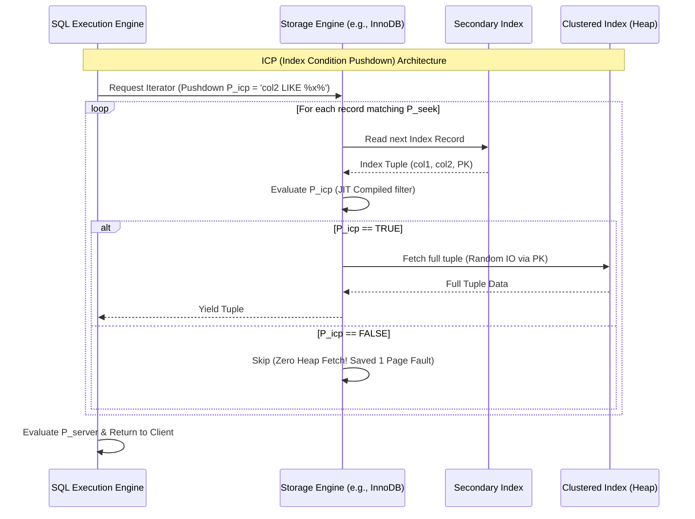

# Micro-architecture Design and Query Optimization: Covering Indexes, Index Condition Pushdown (ICP), and Index Merge in Relational Databases

## Executive Summary (Overview)

A relational database earns its reputation not just by storing data durably and honoring ACID guarantees, but by how cleverly its query optimizer avoids wasted work. The optimizer's real job is to cut memory access cycles, avoid unnecessary context switches, and — above everything else — minimize I/O, which has been the perennial bottleneck since disks entered the picture.

The gap between CPU speed (nanoseconds) and disk speed (micro- to milliseconds) creates what's often called a memory wall. To chip away at it, engineers rely on three techniques that operate right at the micro-architectural level: **covering indexes**, **Index Condition Pushdown (ICP)** — pushing filter conditions down into the storage layer — and **Index Merge**.

This article walks through the math, data structures, and hardware interactions (CPU cache, SIMD, virtual memory) behind these three techniques, with concrete examples showing how they combine to deliver low-latency queries at scale.

## Core Problem Statement

Before getting into solutions, it helps to pin down exactly what goes wrong when a naive query runs against a large table (terabyte or petabyte scale).

A typical RDBMS splits into two layers:
1. **SQL Execution Engine:** handles parsing, relational algebra planning, and predicate evaluation.
2. **Storage Engine:** manages the B+ Tree structures, buffer pool, disk I/O, and row-level locking — think InnoDB in MySQL or WiredTiger in MongoDB.

**Problem 1: Random I/O Cost**
When a query uses a secondary index, that index's B+ Tree typically stores only the key plus a pointer (usually the primary key) back to the base table. If the query needs columns that aren't in the secondary index, the engine has to perform a **bookmark lookup** — a random-access read. On spinning disks the seek-time cost is brutal; on SSDs, IOPS is much higher but heavy random I/O still causes write amplification and eats into PCIe bandwidth.

**Problem 2: Cache Pollution and Page Faults**
Every bookmark lookup that misses the buffer pool triggers a page fault. The OS suspends the thread and pulls the (typically 16KB) page from disk. If the buffer pool is already full, LRU eviction kicks in — and that can push out genuinely hot pages, polluting the cache for everyone else.

**Problem 3: Inter-layer Communication Overhead**
Under the traditional model, the storage engine only knows how to match the index key, then hands the whole tuple up to the SQL engine. Given `WHERE col_A = 1 AND col_B LIKE '%x%'`, the storage engine uses `col_A` to walk the tree, loads the full row, deserializes it, and pushes it across the API boundary just so the SQL engine can check `col_B`. That's wasted allocation, redundant copying, and a stalled instruction pipeline for rows that end up getting thrown away anyway.

The cost of the naive path looks like:
$$C_{naive} = C_{traverse\_idx} + N_{matches} \cdot (C_{page\_fault} + C_{deserialize} + C_{eval\_api})$$
where $N_{matches}$ is the number of rows the index routing step returns. Everything covering indexes, ICP, and Index Merge do is aimed at shrinking the constants inside those parentheses.

## Deep Technical Knowledge / Internals

### B+ Tree Structure and Memory System Optimization via Covering Indexes

A covering index isn't something you create with a `CREATE COVERING INDEX` statement — there's no such syntax. It's a property of the query: it happens when every column a query touches (`SELECT`, `WHERE`, `ORDER BY`, `GROUP BY`) is already sitting in the leaf nodes of a secondary index.

**The math behind it:**
Let $T$ be a relation, and let query $Q$ need an attribute set $A_{Q} = \{a_1, a_2, \dots, a_n\}$ (projection plus predicates). Index $I$ is built from keys $K_{I} = \{k_1, k_2, \dots, k_m\}$. In engines like InnoDB, the primary key $K_{PK}$ is silently appended to every secondary index entry.
So $I$ covers $Q$ exactly when:
$$A_{Q} \subseteq (K_{I} \cup K_{PK})$$

**What this means at the micro-architecture level:**
Once the covering condition holds, the bookmark lookup disappears entirely.
1. **Sequential Access:** instead of jumping between clustered index pages, the CPU just walks the doubly-linked list connecting the secondary index's leaf nodes.
2. **L1/L2/L3 cache behavior:** because a secondary index carries only a few columns, far more rows fit per 16KB page — spatial locality goes up. A single 64-byte cache line pulled into the CPU now holds many useful rows, letting the prefetcher do its job well. Cache-hit rates above 99% are common in this path.


Pseudo-C++ describing the scanning process inside the storage engine:
```cpp
// Fast path when a Covering Index is present
void ScanLeafNode(const BTreeNode* node, const QueryContext& ctx, ResultSet& result) {
    if (ctx.is_covering) {
        // Spatial Locality Optimization
        // The compiler can unroll the loop and use SIMD if the schema is fixed-length
        for (int i = 0; i < node->num_records; ++i) {
            if (EvaluatePredicates(node->records[i], ctx.predicates)) {
                result.PushBack(Project(node->records[i], ctx.projection));
            }
        }
    } else {
        // Slow Path: Bookmark lookup
        for (int i = 0; i < node->num_records; ++i) {
            RowId rid = node->records[i].GetRowId();
            // FetchFromBufferPool may block the thread if it hits an IO wait
            Tuple full_tuple = buffer_pool_manager->FetchFromClusteredIndex(rid);
            if (EvaluatePredicates(full_tuple, ctx.predicates)) {
                result.PushBack(Project(full_tuple, ctx.projection));
            }
        }
    }
}
```

### Predicate-Splitting and Index Condition Pushdown (ICP)

When a covering index isn't feasible — the query touches too many columns — you're stuck paying $N_{matches} \cdot C_{page\_fault}$. **Index Condition Pushdown (ICP)** attacks this by moving a filter step down into the storage engine itself.

**Predicate splitting:**
The optimizer breaks the predicate set $P$ into three groups:
- $P_{seek}$: used to walk the B+ Tree (e.g., `col1 = 'A'`).
- $P_{icp}$: can't be used for routing, but the column exists in the secondary index (e.g., `col2 LIKE '%xyz%'`).
- $P_{server}$: involves columns absent from the index entirely (e.g., `col3 > 100`).

Before ICP existed, $P_{icp}$ was lumped in with $P_{server}$ — the storage engine returned every row matching $P_{seek}$, and only the SQL engine checked $P_{icp}$ afterward.
With ICP, $P_{icp}$ gets pushed across the API boundary and evaluated inside the storage engine.

**What ICP buys you architecturally:**
It removes a round of communication overhead (context switches, function calls across the boundary). Some modern engines go further and use LLVM to **JIT-compile** the $P_{icp}$ predicates into native machine code, so the CPU can evaluate the condition against the raw index-record bytes without deserializing the tuple first — leaning on the processor's superscalar pipeline.



### Bitmap Data Structures and Merge Logic in Index Merge

A single B+ Tree doesn't help much when a query has multiple OR/AND conditions spread across independent columns — say `WHERE status = 'ACTIVE' OR category_id = 5`. No single index answers that efficiently, and building a composite index for every possible combination of columns would blow up your storage budget.

**Index Merge** solves this by running several index scans concurrently and combining their results. The process breaks down into a few phases:
1. **Scan & Extract:** each index scan produces a list of RowIDs (or primary keys).
2. **Bitmap representation:** rather than an array or hash table (which wastes RAM), the identifiers get mapped into a bit array. For sparse ID ranges, compressed structures like **Roaring Bitmaps** keep memory use in check.
3. **Bitwise logic:**
   - AND filtering (Index Merge Intersection): intersect the two RowID sets via `Bitwise AND` ($\land$).
   - OR filtering (Index Merge Union): union them via `Bitwise OR` ($\lor$).
4. **Table Fetch:** pull the actual rows based on the final bitmap.

**Where SIMD comes in:**
Bitwise operations on bitmaps are a textbook fit for SIMD (AVX2/AVX-512 on x86, NEON on ARM). Instead of processing bit by bit, the CPU can AND or OR 512 bits — 512 records worth — in a single clock cycle.

```rust
// Pseudo-Rust illustrating I/O and CPU optimization via SIMD
// Implements an Intersection algorithm across two Bitmaps from two indexes.
#[cfg(target_arch = "x86_64")]
use std::arch::x86_64::{__m512i, _mm512_and_si512, _mm512_loadu_si512, _mm512_storeu_si512};

#[target_feature(enable = "avx512f")]
pub unsafe fn avx512_bitmap_intersect(bitmap_idx1: &[u64], bitmap_idx2: &[u64], result: &mut [u64]) {
    let len = bitmap_idx1.len();
    // Each 512-bit vector holds 8 u64 chunks
    let chunks = len / 8;
    
    for i in 0..chunks {
        // Load 512 bits simultaneously from L1 Cache
        let ptr1 = bitmap_idx1.as_ptr().add(i * 8) as *const __m512i;
        let ptr2 = bitmap_idx2.as_ptr().add(i * 8) as *const __m512i;
        let res_ptr = result.as_mut_ptr().add(i * 8) as *mut __m512i;

        let vec1 = _mm512_loadu_si512(ptr1);
        let vec2 = _mm512_loadu_si512(ptr2);

        // Intersect 512 records in just 1 CPU cycle!
        // Completely eliminates the if-else loop, avoiding branch misprediction
        let vec_res = _mm512_and_si512(vec1, vec2);
        
        _mm512_storeu_si512(res_ptr, vec_res);
    }
}
```
*A note on cost estimation:* the optimizer's Cost-Based Optimizer (CBO) does the math before committing to this path. If the combined set bits cross roughly 20% of the table's rows, the CBO usually abandons Index Merge in favor of a full table scan — sequential I/O across the whole table beats random reads via scattered RowIDs at that point.

## Practical Applications & Case Studies

### Case Study 1: E-commerce Product Filtering (High Dimensionality)
On an e-commerce platform, users filter by `brand_id`, `color`, and `price_range`.
- **Problem:** you can't realistically index every combination — (Brand, Color), (Color, Price), (Brand, Price), and so on.
- **Solution:** create single-column indexes on `brand_id` and `color`.
- **Result:** MySQL falls back to **Index Merge Intersection**, scanning `idx_brand` and `idx_color`, intersecting the RowID bitmaps in RAM via SIMD, and only touching disk once for the final product rows.

### Case Study 2: Log Analysis & Time-series Queries
`SELECT COUNT(*) FROM access_logs WHERE user_id = 123 AND status_code = 500;`
- **Problem:** the log table has billions of rows, several KB each. A full scan is out of the question.
- **Solution:** index `idx_user_status (user_id, status_code)`.
- **Result:** this is a clean covering index. `COUNT(*)` never touches the row data — the engine just counts leaf entries on `idx_user_status`. The query finishes in a few milliseconds without the clustered index ever being touched, which also keeps the buffer pool free of unnecessary pages.

### Case Study 3: Multi-tenant SaaS Search
`SELECT * FROM transactions WHERE tenant_id = 5 AND description LIKE '%refund%';`
- **Problem:** `LIKE '%...'` can't be resolved with a B+ Tree binary search.
- **Solution:** lean on **Index Condition Pushdown** with `idx_tenant_desc (tenant_id, description)`.
- **Result:** the storage engine uses `tenant_id` to reach the right leaf nodes ($P_{seek}$), then applies a JIT-compiled pattern check for `description` right there ($P_{icp}$). Say the tenant has 10,000 transactions and only 50 mention "refund" — ICP rejects the other 9,950 at the leaf level, saving 9,950 random disk reads. `EXPLAIN` will show `Using index condition` when this kicks in.

## Lessons Learned

1. **Hardware shapes software design, whether you like it or not.** SQL's abstractions eventually collide with L1 cache sizes, disk seek times, and PCIe bandwidth. Covering indexes prove that tucking one or two extra columns into an index can be a very good trade of disk space for CPU cycles.
2. **Read the execution plan, don't guess.** `EXPLAIN FORMAT=JSON` in MySQL or `EXPLAIN ANALYZE` in PostgreSQL will tell you whether you're actually getting `Using index` (covering), `Using index condition` (ICP), or `Using intersect/union` (Index Merge).
3. **Every index has a write cost.** Adding indexes purely to enable covering or Index Merge behavior slows down `INSERT`/`UPDATE`/`DELETE`. In write-heavy OLTP systems, the index count needs to stay under tight control.
4. **The CBO isn't infallible.** Stale statistics can make the optimizer pick the wrong plan between Index Merge and a full table scan. Keeping histograms current and running periodic `ANALYZE` jobs is what makes these micro-architectural tricks pay off in practice.

Covering indexes, ICP, and Index Merge together form a pipeline that spans the whole stack. Writing correct SQL is table stakes — a strong database engineer can also picture how data actually moves: off the disk platter, across the system bus, into L1 cache, and through SIMD instructions deep in the CPU core.
