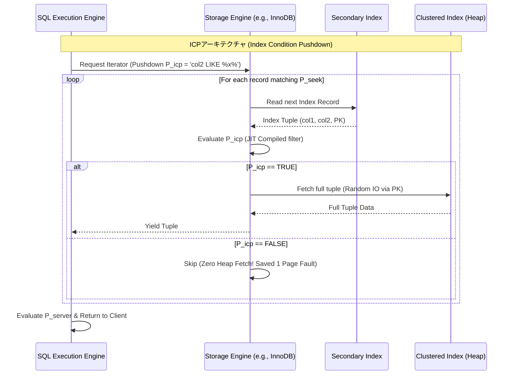

# マイクロアーキテクチャ設計とクエリオプティマイゼーション：リレーショナルデータベースにおけるCovering Indexes、Index Condition Pushdown (ICP)、およびIndex Merge

## Executive Summary (概要 / Overview)

現代のRDBMSが評価されるのは、データを永続化しACID特性を保証するからだけではない。クエリオプティマイザがどれだけ無駄な処理を削れるか、そこに実力の差が出る。オプティマイザの仕事は端的に言えば、メモリアクセスのサイクル数を減らし、コンテキストスイッチを避け、そして何よりもI/O — 昔からデータベースの足を引っ張ってきた要因 — を最小化することだ。

CPU（ナノ秒単位で動く）とディスク（マイクロ秒からミリ秒単位）の間にある速度差は、いわゆるメモリの壁を生み出す。この壁を乗り越えるためにエンジニアたちが磨いてきたのが、マイクロアーキテクチャレベルで効く3つの手法だ。**カバリングインデックス（Covering Indexes）**、ストレージ層までフィルタ条件を押し下げる**Index Condition Pushdown (ICP)**、そして**Index Merge**である。

本稿では、これら3つの技術を支える数学、データ構造、ハードウェアとの相互作用（CPUキャッシュ、SIMD、仮想メモリ）を掘り下げ、実際のケースを通して大規模システムで低レイテンシを実現する仕組みを見ていく。

## Core Problem Statement (核心的な問題の定義)

解決策に入る前に、素朴な（naive）クエリが大規模データ（テラバイト、ペタバイト級）に対して実行されたときに何が起きるのかを、まず具体的に把握しておきたい。

一般的なRDBMSは大きく2つの層に分かれる。
1. **SQL実行エンジン:** 構文解析、リレーショナル代数のプランニング、論理述語の評価を担う。
2. **ストレージエンジン:** B+ Tree構造、バッファプール、ディスクI/O、行レベルロックを管理する。MySQLのInnoDBやMongoDBのWiredTigerがその代表例だ。

**課題1: ランダムI/Oのコスト**
セカンダリインデックスを使ってデータを検索する場合、そのB+ Treeが持つのは通常インデックスキーと、元のテーブル（クラスタ化インデックス／ヒープテーブル）へのポインタ（多くは主キー）だけだ。クエリがセカンダリインデックスに含まれない列を要求すると、エンジンは**ブックマークルックアップ（Bookmark Lookup）**を行う必要がある。これはランダムアクセスそのものだ。回転ディスク（HDD）ではシークタイムのコストが重くのしかかり、SSDではIOPSは高いとはいえ、広範なランダムI/Oは依然としてWrite Amplificationを招き、PCIe帯域を消費する。

**課題2: キャッシュ汚染とページフォールト**
ブックマークルックアップが発火したとき、対象のデータページ（通常16KB）がバッファプール上になければメジャーページフォールトが発生する。OSは実行中のスレッドを一時停止し、ディスクからページをロードする。バッファプールが満杯であれば、LRUアルゴリズムが別のページを退去させる必要があり、それがたまたまホットデータであればキャッシュ全体を汚染してしまう。

**課題3: 層をまたぐ通信オーバーヘッド**
従来のアーキテクチャでは、ストレージエンジンはインデックスキーに一致するデータを見つけると、タプル全体をそのままSQLエンジンに返すだけだ。`WHERE col_A = 1 AND col_B LIKE '%x%'` のようなクエリでは、ストレージエンジンは `col_A` だけでツリーを辿り、行全体をロードしてデシリアライズし、API境界を越えてSQLエンジンに渡し、そこで初めて `col_B` が評価される。結局捨てられる行のために、無駄なメモリ確保とコピー、そしてCPUの命令パイプラインの停滞が発生するわけだ。

素朴な実行のコストはこう表せる。
$$C_{naive} = C_{traverse\_idx} + N_{matches} \cdot (C_{page\_fault} + C_{deserialize} + C_{eval\_api})$$
ここで $N_{matches}$ はインデックスのルーティング条件に一致するレコード数。カバリングインデックス、ICP、Index Mergeがやろうとしているのは、この括弧内の定数を潰すことに尽きる。

## Deep Technical Knowledge / Internals (詳細な技術知識 / 内部構造)

### B+ Tree構造とカバリングインデックスによるメモリ最適化

カバリングインデックスは `CREATE COVERING INDEX` のような文で作る物理オブジェクトではない。クエリが必要とする列（`SELECT`、`WHERE`、`ORDER BY`、`GROUP BY`）がすべて、セカンダリインデックスのリーフノードにすでに揃っている、という状態そのものを指す。

**数学的な裏付け:**
リレーションを $T$ とする。クエリ $Q$ が必要とする属性集合（射影と述語）を $A_{Q} = \{a_1, a_2, \dots, a_n\}$ とし、インデックス $I$ はキー集合 $K_{I} = \{k_1, k_2, \dots, k_m\}$ から成る。InnoDBのようなエンジンでは、主キー $K_{PK}$ が暗黙的にすべてのセカンダリインデックスエントリの末尾に付加される。
したがって $I$ が $Q$ をカバーするのは、次の条件を満たすときに限られる。
$$A_{Q} \subseteq (K_{I} \cup K_{PK})$$

**マイクロアーキテクチャへの影響:**
カバー条件が満たされると、ブックマークルックアップは丸ごと不要になる。
1. **シーケンシャルアクセス:** クラスタ化インデックスのページ間を飛び回る代わりに、CPUはセカンダリインデックスのリーフノードを繋ぐ双方向リンクリストをただ辿るだけになる。
2. **L1/L2/L3キャッシュの最適化:** セカンダリインデックスは列数が少ないぶんコンパクトなので、16KBページに収まる行数が増え、空間局所性が高まる。CPUにロードされる64バイトのキャッシュラインには有効なデータが詰まっており、ハードウェアプリフェッチャがよく働く。この経路ではキャッシュヒット率が99%を超えることも珍しくない。


ストレージエンジン内部のスキャン処理を示す疑似C++コード。
```cpp
// Covering Indexがある場合の最適化パス (Fast Path)
void ScanLeafNode(const BTreeNode* node, const QueryContext& ctx, ResultSet& result) {
    if (ctx.is_covering) {
        // Spatial Locality Optimization
        // スキーマが固定長(fixed-length)の場合、コンパイラはループをアンロールし、SIMDを使用可能
        for (int i = 0; i < node->num_records; ++i) {
            if (EvaluatePredicates(node->records[i], ctx.predicates)) {
                result.PushBack(Project(node->records[i], ctx.projection));
            }
        }
    } else {
        // Slow Path: Bookmark lookup
        for (int i = 0; i < node->num_records; ++i) {
            RowId rid = node->records[i].GetRowId();
            // FetchFromBufferPool関数はIO Waitに遭遇した場合スレッドをブロックする可能性がある
            Tuple full_tuple = buffer_pool_manager->FetchFromClusteredIndex(rid);
            if (EvaluatePredicates(full_tuple, ctx.predicates)) {
                result.PushBack(Project(full_tuple, ctx.projection));
            }
        }
    }
}
```

### 述語分割アルゴリズムとIndex Condition Pushdown (ICP)

カバリングインデックスが成立しない場合(クエリが必要とする列が多すぎる場合)、システムは $N_{matches} \cdot C_{page\_fault}$ のコストを避けられない。**Index Condition Pushdown (ICP)** は、フィルタ処理そのものをストレージエンジンの内側に持ち込むことでこの問題に対処する。

**述語分割:**
オプティマイザは条件集合 $P$ を3つに分ける。
- $P_{seek}$: B+ Treeを辿るのに使う条件（例: `col1 = 'A'`）。
- $P_{icp}$: ルーティングには使えないが、列自体はセカンダリインデックスに存在する条件（例: `col2 LIKE '%xyz%'`）。
- $P_{server}$: インデックスに含まれない列に関する条件（例: `col3 > 100`）。

ICPが登場する前は、$P_{icp}$ は $P_{server}$ とひとまとめにされていた。ストレージエンジンは $P_{seek}$ を満たすすべての行を返し、$P_{icp}$ のチェックはSQLエンジン側で後回しにされていたわけだ。
ICPでは、$P_{icp}$ がAPI境界を越えてストレージエンジン側に押し下げられる。

**ICPがもたらすアーキテクチャ上の意味:**
これによって層をまたぐ通信オーバーヘッド(コンテキストスイッチ、関数呼び出し)が消える。一部の実装ではさらに踏み込み、LLVMを使って $P_{icp}$ の述語をネイティブコードに**JITコンパイル**し、タプルをデシリアライズすることなくインデックスレコードの生バイト列に対して直接条件を評価する — プロセッサのスーパースカラーな実行を活かす形だ。



### BitmapデータとIndex Mergeの合成ロジック

単一のB+ Tree構造は、複数の独立した列にまたがるORやAND条件（例: `WHERE status = 'ACTIVE' OR category_id = 5`）を持つクエリには相性が悪い。単一のインデックスでは解決できないし、あらゆる列の組み合わせに対して複合インデックスを用意するのはストレージの観点から現実的ではない。

**Index Merge**は、複数のB+ Treeスキャンを並行して走らせ、結果を合成する仕組みだ。処理は次のような段階を踏む。
1. **スキャンと抽出:** 各インデックスのスキャンがRowID（または主キー）のリストを生成する。
2. **Bitmap表現:** RAMを食う配列やハッシュテーブルの代わりに、識別子をビット配列にマッピングする。識別子が疎(sparse)な場合には、**Roaring Bitmaps**のような圧縮構造でメモリ消費を抑える。
3. **ビット単位の演算:**
   - ANDフィルタ (Index Merge Intersection): `Bitwise AND`（$\land$）で2つのRowID集合を積集合する。
   - ORフィルタ (Index Merge Union): `Bitwise OR`（$\lor$）で和集合を取る。
4. **テーブルフェッチ:** 最終的なビットマップに基づき実データを取得する。

**SIMDが効くポイント:**
ビットマップに対するビット演算はSIMD（x86のAVX2/AVX-512、ARMのNEON）にとってまさに得意分野だ。1ビットずつ処理する代わりに、CPUは1クロックサイクルで512ビット — 512レコード分 — をAND/OR処理できる。

```rust
// SIMDによるI/OおよびCPU最適化を示すRustの疑似コード
// 2つのインデックスのBitmapに対するIntersectionアルゴリズムの統合。
#[cfg(target_arch = "x86_64")]
use std::arch::x86_64::{__m512i, _mm512_and_si512, _mm512_loadu_si512, _mm512_storeu_si512};

#[target_feature(enable = "avx512f")]
pub unsafe fn avx512_bitmap_intersect(bitmap_idx1: &[u64], bitmap_idx2: &[u64], result: &mut [u64]) {
    let len = bitmap_idx1.len();
    // 各512-bitベクタは8つのu64チャンクを含む
    let chunks = len / 8;
    
    for i in 0..chunks {
        // L1 Cacheから512 bitsを同時にロード
        let ptr1 = bitmap_idx1.as_ptr().add(i * 8) as *const __m512i;
        let ptr2 = bitmap_idx2.as_ptr().add(i * 8) as *const __m512i;
        let res_ptr = result.as_mut_ptr().add(i * 8) as *mut __m512i;

        let vec1 = _mm512_loadu_si512(ptr1);
        let vec2 = _mm512_loadu_si512(ptr2);

        // わずか1 CPU Cycleで512レコードを交差 (Intersection)！
        // if-elseループを完全に排除し、ブランチ予測の失敗(branch misprediction)を防ぐ
        let vec_res = _mm512_and_si512(vec1, vec2);
        
        _mm512_storeu_si512(res_ptr, vec_res);
    }
}
```
*コスト計算についての補足:* オプティマイザ内部のCBO（Cost-Based Optimizer）は実行前にコストを見積もる。セットされたビットの合計がテーブルサイズの概ね20%を超えると、CBOはIndex Mergeを諦めてFull Table Scanを選ぶことが多い。その規模になると、RowID経由のランダムI/Oよりテーブル全体を順に読むほうが安くつくからだ。

## Practical Applications & Case Studies (実践的なアプリケーションとケーススタディ)

### Case Study 1: Eコマースの商品フィルタリング (次元数が多いケース)
Eコマースサイトでは、ユーザーは `brand_id`、`color`、`price_range` で絞り込みたがる。
- **問題:** (Brand, Color)、(Color, Price)、(Brand, Price)といったあらゆる組み合わせにインデックスを用意するのは非現実的だ。
- **解決策:** `brand_id` と `color` にそれぞれ単一列インデックスを作る。
- **結果:** MySQLは**Index Merge Intersection**にフォールバックする。`idx_brand` と `idx_color` をスキャンし、RowIDのビットマップをSIMDで積集合してからディスクにアクセスして商品情報を取得する。

### Case Study 2: ログ分析と時系列クエリ
`SELECT COUNT(*) FROM access_logs WHERE user_id = 123 AND status_code = 500;`
- **問題:** ログテーブルは数十億行、1行数KBという規模。フルスキャンは論外だ。
- **解決策:** `idx_user_status (user_id, status_code)` というインデックスを作る。
- **結果:** これは典型的なカバリングインデックスだ。`COUNT(*)` は行データに触れる必要がなく、エンジンは `idx_user_status` のリーフエントリ数を数えるだけでよい。クエリは数ミリ秒で完了し、クラスタ化インデックスには一切触れないため、バッファプールも汚れずに済む。

### Case Study 3: マルチテナントSaaSの検索
`SELECT * FROM transactions WHERE tenant_id = 5 AND description LIKE '%refund%';`
- **問題:** `LIKE '%...'` はB+ Treeの二分探索では解決できない。
- **解決策:** `idx_tenant_desc (tenant_id, description)` を使った**Index Condition Pushdown**に頼る。
- **結果:** ストレージエンジンは `tenant_id` で該当リーフノードにたどり着き（$P_{seek}$）、そこでJITコンパイル済みのパターンマッチによって `description` を判定する（$P_{icp}$）。あるテナントに10,000件の取引があり、「refund」を含むのは50件だけだとすると、ICPはリーフレベルで残り9,950件を即座に弾き、9,950回分のランダムディスクI/Oを節約する。この経路が使われていれば `EXPLAIN` に `Using index condition` と表示される。

## Lessons Learned (得られた教訓)

1. **ハードウェアがソフトウェア設計を規定する。** SQLの抽象概念も最終的にはL1キャッシュのサイズ、ディスクの回転速度、PCIe帯域と向き合わざるを得ない。カバリングインデックスは、インデックスに列を1つ2つ余分に持たせるだけで、ディスク容量とCPUサイクルの交換として十分割に合うことを示している。
2. **実行計画を必ず確認する。** MySQLなら `EXPLAIN FORMAT=JSON`、PostgreSQLなら `EXPLAIN ANALYZE` を使い、実際に `Using index`（カバリング）、`Using index condition`（ICP）、`Using intersect/union`（Index Merge）のどれが効いているかを確かめる習慣をつけたい。
3. **書き込みコストを忘れない。** カバリングやIndex Mergeを狙って闇雲にインデックスを増やすと、`INSERT`/`UPDATE`/`DELETE` の性能が落ちる。書き込みの多いOLTP環境では、インデックス数を厳しく管理する必要がある。
4. **CBOは万能ではない。** 統計情報が古いと、CBOがIndex MergeとFull Table Scanの選択を誤ることがある。ヒストグラムを適切に維持し、定期的な統計更新を行うことが、こうしたマイクロアーキテクチャ上の工夫を実際の性能に結びつける鍵になる。

カバリングインデックス、ICP、Index Mergeを組み合わせると、ディスクからCPUコアまでを貫く一本の処理パイプラインが見えてくる。優れたデータベースエンジニアに求められるのは正しいSQLを書くことだけではない。データがディスクプラッタからシステムバスを越え、L1キャッシュに入り、CPUコア内のSIMD命令によって形を変えていく様子を、頭の中で描けることだ。
