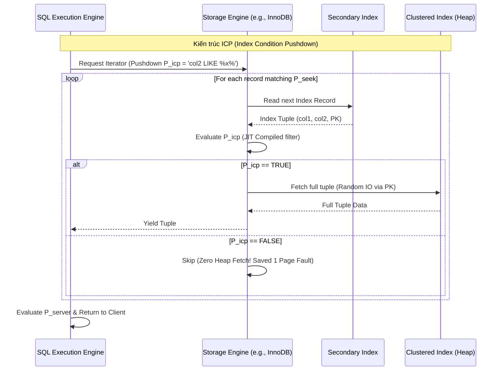

# Thiết kế Vi kiến trúc và Tối ưu hóa truy vấn: Covering Indexes, Index Condition Pushdown (ICP) và Index Merge trong Cơ sở dữ liệu Quan hệ

## Executive Summary (Tóm tắt / Overview)

Một RDBMS hiện đại không chỉ được đánh giá qua khả năng lưu trữ bền vững và đảm bảo ACID. Phần lớn sự khác biệt về hiệu năng nằm ở cách bộ tối ưu hóa truy vấn (query optimizer) tránh làm những việc không cần thiết. Nói ngắn gọn, việc của optimizer là giảm số chu kỳ truy cập bộ nhớ, hạn chế chuyển đổi ngữ cảnh, và trên hết là cắt giảm I/O — thứ vẫn luôn là nút thắt cổ chai kinh niên của mọi hệ cơ sở dữ liệu.

Khoảng cách tốc độ giữa CPU (mức nano-giây) và ổ đĩa (mức micro đến mili-giây) tạo ra cái gọi là bức tường bộ nhớ. Để vượt qua nó, giới kỹ sư đã phát triển ba kỹ thuật can thiệp trực tiếp ở cấp vi kiến trúc: **covering index** (chỉ mục bao phủ), **Index Condition Pushdown (ICP)** — đẩy điều kiện lọc xuống tận tầng lưu trữ, và **Index Merge**.

Bài viết này đi vào phần toán học, cấu trúc dữ liệu, và cách các kỹ thuật này tương tác với phần cứng (CPU cache, SIMD, bộ nhớ ảo), kèm ví dụ thực tế cho thấy chúng phối hợp ra sao để giữ độ trễ truy vấn ở mức thấp trên các hệ thống quy mô lớn.

## Core Problem Statement (Vấn đề cốt lõi)

Trước khi bàn giải pháp, cần hình dung rõ điều gì xảy ra khi một truy vấn "ngây thơ" chạy trên dữ liệu quy mô terabyte hay petabyte.

Một RDBMS điển hình chia thành hai tầng:
1. **SQL Execution Engine:** lo việc phân tích cú pháp, lập kế hoạch đại số quan hệ, và đánh giá vị từ logic.
2. **Storage Engine:** quản lý cấu trúc B+ Tree, buffer pool, I/O đĩa, và khóa ở cấp độ hàng — InnoDB của MySQL hay WiredTiger của MongoDB là ví dụ tiêu biểu.

**Bài toán 1: Chi phí I/O ngẫu nhiên**
Khi truy vấn dùng một secondary index để tìm dữ liệu, B+ Tree của index đó thường chỉ lưu khóa chỉ mục và một con trỏ (thường là primary key) trỏ về bảng gốc. Nếu truy vấn cần thêm cột không có trong secondary index, hệ thống buộc phải thực hiện **bookmark lookup** — một thao tác truy cập ngẫu nhiên thuần túy. Trên HDD, chi phí seek time rất đắt; trên SSD, IOPS cao hơn nhưng I/O ngẫu nhiên diện rộng vẫn gây write amplification và ăn vào băng thông PCIe.

**Bài toán 2: Ô nhiễm cache và page fault**
Mỗi lần bookmark lookup không tìm thấy trang dữ liệu trong buffer pool, một page fault xảy ra. Hệ điều hành phải tạm dừng luồng thực thi và nạp trang (thường 16KB) từ đĩa vào RAM. Nếu buffer pool đã đầy, thuật toán LRU sẽ đẩy một trang khác ra ngoài — và đôi khi đó lại chính là dữ liệu nóng, khiến cache bị ô nhiễm cho những truy vấn khác.

**Bài toán 3: Overhead giao tiếp giữa các tầng**
Theo mô hình truyền thống, storage engine chỉ biết tìm dữ liệu khớp khóa chỉ mục rồi trả nguyên cả tuple lên cho SQL engine. Với truy vấn `WHERE col_A = 1 AND col_B LIKE '%x%'`, storage engine dùng `col_A` để duyệt cây, nạp toàn bộ hàng, giải mã, rồi đẩy qua ranh giới API lên SQL engine chỉ để đánh giá `col_B`. Kết quả là cấp phát bộ nhớ thừa, sao chép dữ liệu dư thừa, và pipeline lệnh của CPU bị trễ — cho những hàng cuối cùng có thể bị loại bỏ ngay sau đó.

Chi phí của đường đi ngây thơ này có thể viết thành:
$$C_{naive} = C_{traverse\_idx} + N_{matches} \cdot (C_{page\_fault} + C_{deserialize} + C_{eval\_api})$$
trong đó $N_{matches}$ là số bản ghi khớp điều kiện định tuyến của index. Covering index, ICP và Index Merge, xét cho cùng, đều nhắm vào việc triệt tiêu các hằng số chi phí nằm trong ngoặc đó.

## Deep Technical Knowledge / Internals (Kiến thức kỹ thuật chuyên sâu)

### Cấu trúc B+ Tree và tối ưu hóa bộ nhớ nhờ Covering Index

Covering index không phải là một đối tượng vật lý tạo bằng lệnh `CREATE COVERING INDEX` — không có cú pháp như vậy. Đây đơn giản là một tính chất của truy vấn: nó xảy ra khi mọi cột mà truy vấn cần (`SELECT`, `WHERE`, `ORDER BY`, `GROUP BY`) đã có sẵn ngay trong các leaf node của một secondary index.

**Cơ sở toán học:**
Gọi $T$ là một quan hệ. Truy vấn $Q$ cần tập thuộc tính $A_{Q} = \{a_1, a_2, \dots, a_n\}$ (gồm cả phần chiếu và vị từ). Index $I$ được xây từ tập khóa $K_{I} = \{k_1, k_2, \dots, k_m\}$. Trong các engine như InnoDB, khóa chính $K_{PK}$ luôn được ngầm định gắn thêm vào cuối mỗi entry của secondary index.
Vậy $I$ bao phủ (cover) $Q$ khi và chỉ khi:
$$A_{Q} \subseteq (K_{I} \cup K_{PK})$$

**Ý nghĩa ở tầng vi kiến trúc:**
Khi điều kiện bao phủ được thỏa, bước bookmark lookup biến mất hoàn toàn.
1. **Truy cập tuần tự:** thay vì nhảy cóc giữa các trang của clustered index, CPU chỉ cần trượt dọc theo danh sách liên kết kép nối các leaf node của secondary index.
2. **Tối ưu L1/L2/L3 cache:** vì secondary index chỉ chứa vài cột nên gọn hơn nhiều, số hàng nhét vừa một trang 16KB tăng lên đáng kể — mật độ dữ liệu theo không gian (spatial locality) cao hơn. Một cache line 64-byte nạp vào CPU giờ chứa nhiều hàng hữu ích, giúp cơ chế prefetch phần cứng hoạt động hiệu quả. Tỷ lệ cache hit trên 99% không hiếm gặp ở đường đi này.


Mã giả C++ mô tả quá trình quét trong storage engine:
```cpp
// Lộ trình tối ưu hóa (Fast Path) khi có Covering Index
void ScanLeafNode(const BTreeNode* node, const QueryContext& ctx, ResultSet& result) {
    if (ctx.is_covering) {
        // Spatial Locality Optimization
        // Trình biên dịch có thể unroll loop và sử dụng SIMD nếu schema fixed-length
        for (int i = 0; i < node->num_records; ++i) {
            if (EvaluatePredicates(node->records[i], ctx.predicates)) {
                result.PushBack(Project(node->records[i], ctx.projection));
            }
        }
    } else {
        // Slow Path: Bookmark lookup
        for (int i = 0; i < node->num_records; ++i) {
            RowId rid = node->records[i].GetRowId();
            // Hàm FetchFromBufferPool có thể gây block thread nếu gặp IO Wait
            Tuple full_tuple = buffer_pool_manager->FetchFromClusteredIndex(rid);
            if (EvaluatePredicates(full_tuple, ctx.predicates)) {
                result.PushBack(Project(full_tuple, ctx.projection));
            }
        }
    }
}
```

### Thuật toán phân tách vị từ và Index Condition Pushdown (ICP)

Khi covering index không khả thi — truy vấn cần quá nhiều cột — hệ thống buộc phải trả giá $N_{matches} \cdot C_{page\_fault}$. **Index Condition Pushdown (ICP)** giải quyết việc này bằng cách đưa bước lọc dữ liệu vào ngay bên trong storage engine.

**Phân tách vị từ:**
Bộ tối ưu chia tập điều kiện $P$ thành ba nhóm:
- $P_{seek}$: dùng để định tuyến khi duyệt B+ Tree (ví dụ `col1 = 'A'`).
- $P_{icp}$: không dùng để định tuyến được, nhưng cột liên quan vẫn có mặt trong secondary index (ví dụ `col2 LIKE '%xyz%'`).
- $P_{server}$: liên quan đến cột hoàn toàn không có trong index (ví dụ `col3 > 100`).

Trước khi có ICP, $P_{icp}$ bị gộp chung với $P_{server}$ — storage engine trả về mọi hàng thỏa $P_{seek}$, rồi SQL engine mới kiểm tra $P_{icp}$ sau.
Với ICP, $P_{icp}$ được đẩy qua ranh giới API xuống tận storage engine.

**Ý nghĩa kiến trúc của ICP:**
Nó loại bỏ một vòng giao tiếp giữa các tầng (context switch, gọi hàm qua ranh giới API). Một số engine hiện đại còn đi xa hơn: dùng LLVM để **JIT compile** tập vị từ $P_{icp}$ thành mã máy gốc, cho phép CPU đánh giá điều kiện trực tiếp trên dãy byte thô của index record mà không cần giải mã tuple trước — tận dụng kiến trúc siêu vô hướng (superscalar) của vi xử lý.



### Cấu trúc dữ liệu Bitmap và logic hợp nhất trong Index Merge

Một B+ Tree đơn lẻ tỏ ra bất lực trước các truy vấn có nhiều điều kiện OR hoặc AND trên các cột độc lập, ví dụ `WHERE status = 'ACTIVE' OR category_id = 5`. Không index đơn nào giải được bài toán này, còn tạo composite index cho mọi hoán vị cột thì lại là thảm họa về dung lượng lưu trữ.

**Index Merge** giải quyết vấn đề bằng cách chạy song song nhiều lượt quét index rồi hợp nhất kết quả. Quy trình gồm vài bước:
1. **Quét và trích xuất:** mỗi lượt quét index tạo ra một danh sách RowID (hoặc primary key).
2. **Biểu diễn Bitmap:** thay vì dùng mảng hay hash table (tốn RAM), các định danh được ánh xạ vào một mảng bit. Với dải định danh thưa, các cấu trúc nén như **Roaring Bitmaps** giúp giữ mức tiêu thụ bộ nhớ trong tầm kiểm soát.
3. **Phép toán bitwise:**
   - Lọc AND (Index Merge Intersection): giao hai tập RowID bằng `Bitwise AND` ($\land$).
   - Lọc OR (Index Merge Union): hợp hai tập bằng `Bitwise OR` ($\lor$).
4. **Truy xuất bảng:** lấy dữ liệu thực tế dựa trên bitmap cuối cùng.

**SIMD phát huy tác dụng ở đâu:**
Các phép bitwise trên bitmap là ứng viên lý tưởng cho SIMD (AVX2/AVX-512 trên x86, NEON trên ARM). Thay vì xử lý từng bit, CPU có thể AND hoặc OR 512 bit — tương đương 512 bản ghi — chỉ trong một chu kỳ xung nhịp.

```rust
// Mã giả Rust minh họa Tối ưu hóa I/O và CPU thông qua SIMD
// Tích hợp thuật toán Intersection cho hai Bitmap của 2 Index.
#[cfg(target_arch = "x86_64")]
use std::arch::x86_64::{__m512i, _mm512_and_si512, _mm512_loadu_si512, _mm512_storeu_si512};

#[target_feature(enable = "avx512f")]
pub unsafe fn avx512_bitmap_intersect(bitmap_idx1: &[u64], bitmap_idx2: &[u64], result: &mut [u64]) {
    let len = bitmap_idx1.len();
    // Mỗi vector 512-bit chứa 8 khối u64
    let chunks = len / 8;
    
    for i in 0..chunks {
        // Load 512 bits đồng thời từ L1 Cache
        let ptr1 = bitmap_idx1.as_ptr().add(i * 8) as *const __m512i;
        let ptr2 = bitmap_idx2.as_ptr().add(i * 8) as *const __m512i;
        let res_ptr = result.as_mut_ptr().add(i * 8) as *mut __m512i;

        let vec1 = _mm512_loadu_si512(ptr1);
        let vec2 = _mm512_loadu_si512(ptr2);

        // Giao (Intersection) 512 bản ghi chỉ trong 1 CPU Cycle!
        // Triệt tiêu hoàn toàn vòng lặp if-else, loại trừ branch misprediction
        let vec_res = _mm512_and_si512(vec1, vec2);
        
        _mm512_storeu_si512(res_ptr, vec_res);
    }
}
```
*Một lưu ý về ước lượng chi phí:* CBO (Cost-Based Optimizer) của bộ tối ưu tính chi phí trước khi chọn đường đi. Nếu tổng số bit được set vượt khoảng 20% kích thước bảng, CBO thường bỏ Index Merge và chuyển sang Full Table Scan — ở quy mô đó, quét tuần tự toàn bảng rẻ hơn đọc ngẫu nhiên qua từng RowID rải rác.

## Practical Applications & Case Studies (Ứng dụng thực tế)

### Case Study 1: Lọc sản phẩm thương mại điện tử (nhiều chiều lọc)
Trên một sàn thương mại điện tử, người dùng lọc theo `brand_id`, `color`, `price_range`.
- **Vấn đề:** không thể tạo index cho mọi tổ hợp — (Brand, Color), (Color, Price), (Brand, Price), v.v.
- **Giải pháp:** tạo index đơn cột trên `brand_id` và `color`.
- **Kết quả:** MySQL chuyển sang **Index Merge Intersection**, quét `idx_brand` và `idx_color`, giao hai bitmap RowID bằng SIMD ngay trên RAM, rồi mới chạm đĩa một lần để lấy thông tin sản phẩm.

### Case Study 2: Phân tích log và dữ liệu chuỗi thời gian
`SELECT COUNT(*) FROM access_logs WHERE user_id = 123 AND status_code = 500;`
- **Vấn đề:** bảng log có hàng tỷ dòng, mỗi dòng vài KB. Quét toàn bảng là bất khả thi.
- **Giải pháp:** tạo index `idx_user_status (user_id, status_code)`.
- **Kết quả:** đây là một covering index điển hình. `COUNT(*)` không cần đọc dữ liệu hàng nào — engine chỉ đếm số leaf entry trên `idx_user_status`. Truy vấn hoàn thành trong vài mili-giây mà không hề chạm đến clustered index, giữ buffer pool sạch sẽ cho các truy vấn khác.

### Case Study 3: Tìm kiếm trong hệ thống SaaS đa khách hàng
`SELECT * FROM transactions WHERE tenant_id = 5 AND description LIKE '%refund%';`
- **Vấn đề:** `LIKE '%...'` không thể giải bằng tìm kiếm nhị phân trên B+ Tree.
- **Giải pháp:** dựa vào **Index Condition Pushdown** với index `idx_tenant_desc (tenant_id, description)`.
- **Kết quả:** storage engine dùng `tenant_id` để tìm đến các leaf node phù hợp ($P_{seek}$), rồi áp dụng kiểm tra mẫu đã JIT-compile ngay tại đó để đánh giá `description` ($P_{icp}$). Giả sử tenant có 10.000 giao dịch và chỉ 50 giao dịch chứa từ "refund" — ICP loại bỏ ngay 9.950 dòng còn lại ở tầng lá, tiết kiệm 9.950 lượt đọc đĩa ngẫu nhiên. Khi cơ chế này hoạt động, `EXPLAIN` sẽ hiện `Using index condition`.

## Lessons Learned (Bài học rút ra)

1. **Phần cứng định hình thiết kế phần mềm, dù muốn hay không.** Các khái niệm trừu tượng của SQL cuối cùng vẫn phải va chạm với kích thước L1 cache, tốc độ seek của đĩa, và băng thông PCIe. Covering index cho thấy việc nhét thêm một hai cột vào index có thể là một cuộc đổi chác rất đáng giá: dung lượng đĩa lấy tốc độ CPU.
2. **Đọc execution plan, đừng đoán mò.** `EXPLAIN FORMAT=JSON` trong MySQL hay `EXPLAIN ANALYZE` trong PostgreSQL sẽ cho biết truy vấn có thực sự đạt `Using index` (covering), `Using index condition` (ICP), hay `Using intersect/union` (Index Merge) hay không.
3. **Mỗi index đều có cái giá khi ghi.** Thêm index chỉ để phục vụ covering hay Index Merge sẽ làm chậm `INSERT`/`UPDATE`/`DELETE`. Trong các hệ OLTP ghi nhiều, số lượng index cần được kiểm soát chặt.
4. **CBO không phải lúc nào cũng đúng.** Thống kê bảng cũ có thể khiến optimizer chọn sai giữa Index Merge và Full Table Scan. Giữ histogram cập nhật và chạy phân tích dữ liệu định kỳ là điều kiện để những kỹ thuật vi kiến trúc này thực sự phát huy tác dụng.

Covering index, ICP và Index Merge kết hợp lại tạo thành một pipeline xử lý xuyên suốt cả hệ thống. Viết SQL đúng chỉ là điều kiện cần — một kỹ sư cơ sở dữ liệu giỏi còn cần hình dung được cách dữ liệu di chuyển từ đĩa, qua bus hệ thống, vào L1 cache, rồi được xử lý bởi các lệnh SIMD sâu bên trong nhân CPU.
