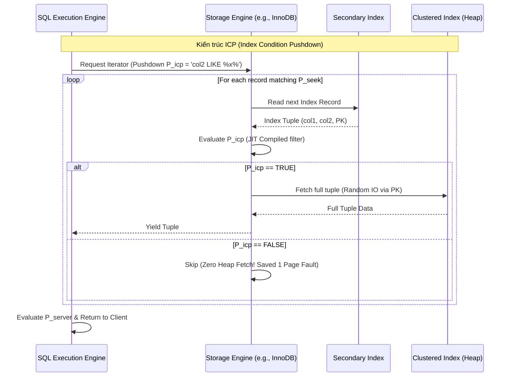

# Thiết kế Vi kiến trúc và Tối ưu hóa truy vấn: Covering Indexes, Index Condition Pushdown (ICP) và Index Merge trong Cơ sở dữ liệu Quan hệ

## Executive Summary (Tóm tắt / Overview)

Chất lượng của một RDBMS không chỉ nằm ở việc lưu dữ liệu bền vững và giữ đúng ACID. Phần lớn khác biệt về tốc độ nằm ở cách bộ tối ưu truy vấn tránh làm những việc thừa. Công việc cốt lõi của optimizer là giảm số lần truy cập bộ nhớ, hạn chế chuyển đổi ngữ cảnh của hệ điều hành, và trên hết là cắt bớt I/O — thứ vẫn luôn là điểm nghẽn kinh niên của mọi hệ quản trị dữ liệu.

Khoảng cách tốc độ giữa CPU (mức nano-giây) và ổ đĩa (mức micro đến mili-giây) tạo ra thứ người ta hay gọi là bức tường bộ nhớ. Ba kỹ thuật giúp vượt qua bức tường đó ở cấp vi kiến trúc là **covering index** (chỉ mục bao phủ), **Index Condition Pushdown (ICP)** — đẩy điều kiện lọc xuống tận tầng lưu trữ, và **Index Merge**.

Bài viết đi vào phần toán học, cấu trúc dữ liệu, cách ba kỹ thuật này chạm vào phần cứng (CPU cache, SIMD, bộ nhớ ảo), và các ví dụ thực tế cho thấy chúng phối hợp thế nào để giữ độ trễ truy vấn thấp ở quy mô lớn.

## Core Problem Statement (Vấn đề cốt lõi)

Trước khi nói giải pháp, cần hình dung rõ chuyện gì xảy ra khi một câu truy vấn thông thường chạy trên dữ liệu cỡ terabyte hoặc petabyte.

Một RDBMS tiêu chuẩn tách thành hai tầng:
1. **SQL Execution Engine:** lo phân tích cú pháp, lập kế hoạch đại số quan hệ, và đánh giá các vị từ logic.
2. **Storage Engine:** quản lý cấu trúc B+ Tree, buffer pool, I/O đĩa, khóa ở cấp hàng — InnoDB của MySQL hay WiredTiger của MongoDB là ví dụ quen thuộc.

**Vấn đề 1: chi phí I/O ngẫu nhiên**
Khi một truy vấn dùng secondary index để tìm dữ liệu, B+ Tree của index đó thường chỉ giữ khóa chỉ mục cùng một con trỏ (thường là khóa chính) trỏ về bảng gốc. Nếu truy vấn cần thêm cột chưa có trong index, engine buộc phải thực hiện **bookmark lookup** — một cú truy cập ngẫu nhiên đúng nghĩa. Trên HDD, seek time là gánh nặng thật sự; trên SSD tuy IOPS cao hơn nhiều nhưng I/O ngẫu nhiên diện rộng vẫn gây write amplification và ăn vào băng thông PCIe.

**Vấn đề 2: ô nhiễm cache và page fault**
Mỗi lần bookmark lookup không tìm thấy trang dữ liệu trong buffer pool, một page fault xảy ra: hệ điều hành tạm dừng luồng thực thi, nạp trang (thường 16KB) từ đĩa vào RAM. Nếu buffer pool đã đầy, LRU sẽ đẩy một trang khác ra ngoài — và đôi khi trang bị đẩy lại chính là dữ liệu đang nóng, khiến cache bị ô nhiễm cho các truy vấn tiếp theo.

**Vấn đề 3: chi phí giao tiếp giữa các tầng**
Theo cách làm truyền thống, storage engine chỉ biết tìm dữ liệu khớp khóa chỉ mục rồi trả nguyên tuple lên cho SQL engine. Với `WHERE col_A = 1 AND col_B LIKE '%x%'`, storage engine dùng `col_A` để duyệt cây, nạp cả hàng, giải mã, rồi đẩy qua ranh giới API lên tầng SQL chỉ để kiểm tra `col_B`. Đó là cấp phát bộ nhớ lãng phí, sao chép dữ liệu thừa, và một pipeline lệnh CPU bị trễ vì những hàng rốt cuộc bị loại bỏ ngay sau đó.

Chi phí của đường đi này viết gọn lại thành:
$$C_{naive} = C_{traverse\_idx} + N_{matches} \cdot (C_{page\_fault} + C_{deserialize} + C_{eval\_api})$$
với $N_{matches}$ là số hàng khớp điều kiện định tuyến của index. Cả ba kỹ thuật covering index, ICP, Index Merge đều nhắm đến việc triệt tiêu các hằng số chi phí bên trong ngoặc đó.

## Deep Technical Knowledge / Internals (Kiến thức kỹ thuật chuyên sâu)

### Cấu trúc B+ Tree và tối ưu bộ nhớ nhờ Covering Index

Covering index không phải một đối tượng vật lý tạo bằng câu lệnh `CREATE COVERING INDEX` — cú pháp đó không tồn tại. Đây là một tính chất của bản thân truy vấn: nó xảy ra khi mọi cột mà truy vấn cần (`SELECT`, `WHERE`, `ORDER BY`, `GROUP BY`) đã nằm sẵn trong leaf node của một secondary index.

**Cơ sở toán học:**
Gọi $T$ là một quan hệ, truy vấn $Q$ cần tập thuộc tính $A_{Q} = \{a_1, a_2, \dots, a_n\}$ (gồm cả phần chiếu lẫn vị từ). Index $I$ xây từ tập khóa $K_{I} = \{k_1, k_2, \dots, k_m\}$. Ở các engine như InnoDB, khóa chính $K_{PK}$ luôn được ngầm gắn vào cuối mỗi entry của secondary index.
Vậy $I$ bao phủ $Q$ khi và chỉ khi:
$$A_{Q} \subseteq (K_{I} \cup K_{PK})$$

**Tác động ở tầng vi kiến trúc:**
Một khi điều kiện bao phủ được thỏa, bước bookmark lookup biến mất hoàn toàn.
1. **Truy cập tuần tự:** thay vì nhảy cóc giữa các trang của clustered index, CPU chỉ việc trượt dọc theo danh sách liên kết kép nối các leaf node của secondary index.
2. **Tối ưu L1/L2/L3 cache:** vì secondary index chỉ mang vài cột nên nhỏ gọn hơn hẳn, số hàng nhét vừa một trang 16KB tăng lên rõ rệt — mật độ dữ liệu theo không gian cao hơn. Một cache line 64-byte nạp vào CPU chứa nhiều hàng hữu ích hơn, giúp cơ chế prefetch phần cứng làm việc hiệu quả. Đường đi này thường đạt tỷ lệ cache hit trên 99%.


Mã giả C++ mô tả quá trình quét trong storage engine:
```cpp
// Lộ trình tối ưu hóa (Fast Path) khi có Covering Index
void ScanLeafNode(const BTreeNode* node, const QueryContext& ctx, ResultSet& result) {
    if (ctx.is_covering) {
        // Spatial Locality Optimization
        // Trình biên dịch có thể unroll loop và sử dụng SIMD nếu schema fixed-length
        for (int i = 0; i < node->num_records; ++i) {
            if (EvaluatePredicates(node->records[i], ctx.predicates)) {
                result.PushBack(Project(node->records[i], ctx.projection));
            }
        }
    } else {
        // Slow Path: Bookmark lookup
        for (int i = 0; i < node->num_records; ++i) {
            RowId rid = node->records[i].GetRowId();
            // Hàm FetchFromBufferPool có thể gây block thread nếu gặp IO Wait
            Tuple full_tuple = buffer_pool_manager->FetchFromClusteredIndex(rid);
            if (EvaluatePredicates(full_tuple, ctx.predicates)) {
                result.PushBack(Project(full_tuple, ctx.projection));
            }
        }
    }
}
```

### Thuật toán phân tách vị từ và Index Condition Pushdown (ICP)

Khi covering index không khả thi vì truy vấn cần quá nhiều cột, hệ thống đành chịu chi phí $N_{matches} \cdot C_{page\_fault}$. **Index Condition Pushdown (ICP)** xử lý việc này bằng cách gắn một bước lọc dữ liệu ngay bên trong storage engine.

**Phân tách vị từ:**
Bộ tối ưu chia tập điều kiện $P$ ra ba nhóm:
- $P_{seek}$: dùng để định tuyến khi duyệt B+ Tree (ví dụ `col1 = 'A'`).
- $P_{icp}$: không định tuyến được nhưng cột liên quan vẫn có trong secondary index (ví dụ `col2 LIKE '%xyz%'`).
- $P_{server}$: liên quan cột hoàn toàn vắng mặt trong index (ví dụ `col3 > 100`).

Trước khi có ICP, $P_{icp}$ bị gộp chung với $P_{server}$: storage engine trả về mọi hàng thỏa $P_{seek}$, còn $P_{icp}$ chỉ được SQL engine kiểm tra sau đó.
Với ICP, $P_{icp}$ được đẩy qua ranh giới API xuống tận storage engine để xử lý sớm hơn.

**Ý nghĩa kiến trúc:**
Điều này cắt bỏ một vòng giao tiếp giữa các tầng (context switch, gọi hàm qua ranh giới API). Một số engine hiện đại còn dùng LLVM để **JIT compile** tập vị từ $P_{icp}$ thành mã máy gốc, cho phép CPU đánh giá điều kiện trực tiếp trên dãy byte thô của index record mà không cần giải mã tuple trước — tận dụng luôn kiến trúc siêu vô hướng (superscalar) của vi xử lý.



### Cấu trúc Bitmap và logic hợp nhất trong Index Merge

Một B+ Tree đơn lẻ gần như bó tay trước các truy vấn có nhiều điều kiện OR hay AND rải trên các cột độc lập, kiểu `WHERE status = 'ACTIVE' OR category_id = 5`. Không index đơn nào giải quyết trọn vẹn, mà lập composite index cho mọi tổ hợp cột thì lại là ác mộng về dung lượng.

**Index Merge** giải quyết vấn đề bằng cách chạy song song nhiều lượt quét index rồi hợp kết quả lại. Quy trình gồm vài bước:
1. **Quét và trích xuất:** mỗi lượt quét một index cho ra danh sách RowID (hoặc khóa chính).
2. **Biểu diễn Bitmap:** thay vì dùng mảng hay hash table tốn RAM, các định danh được ánh xạ vào một mảng bit. Với dải định danh thưa, các cấu trúc nén như **Roaring Bitmaps** giữ mức tiêu thụ bộ nhớ trong tầm kiểm soát.
3. **Phép toán bitwise:**
   - Lọc AND (Index Merge Intersection): giao hai tập RowID bằng `Bitwise AND` ($\land$).
   - Lọc OR (Index Merge Union): hợp hai tập bằng `Bitwise OR` ($\lor$).
4. **Truy xuất bảng:** lấy dữ liệu thật dựa trên bitmap cuối cùng.

**Chỗ SIMD phát huy tác dụng:**
Các phép bitwise trên bitmap là ứng viên lý tưởng cho SIMD (AVX2/AVX-512 trên x86, NEON trên ARM). Thay vì xử lý từng bit một, CPU AND hoặc OR được 512 bit — tương đương 512 bản ghi — chỉ trong một chu kỳ xung nhịp.

```rust
// Mã giả Rust minh họa Tối ưu hóa I/O và CPU thông qua SIMD
// Tích hợp thuật toán Intersection cho hai Bitmap của 2 Index.
#[cfg(target_arch = "x86_64")]
use std::arch::x86_64::{__m512i, _mm512_and_si512, _mm512_loadu_si512, _mm512_storeu_si512};

#[target_feature(enable = "avx512f")]
pub unsafe fn avx512_bitmap_intersect(bitmap_idx1: &[u64], bitmap_idx2: &[u64], result: &mut [u64]) {
    let len = bitmap_idx1.len();
    // Mỗi vector 512-bit chứa 8 khối u64
    let chunks = len / 8;
    
    for i in 0..chunks {
        // Load 512 bits đồng thời từ L1 Cache
        let ptr1 = bitmap_idx1.as_ptr().add(i * 8) as *const __m512i;
        let ptr2 = bitmap_idx2.as_ptr().add(i * 8) as *const __m512i;
        let res_ptr = result.as_mut_ptr().add(i * 8) as *mut __m512i;

        let vec1 = _mm512_loadu_si512(ptr1);
        let vec2 = _mm512_loadu_si512(ptr2);

        // Giao (Intersection) 512 bản ghi chỉ trong 1 CPU Cycle!
        // Triệt tiêu hoàn toàn vòng lặp if-else, loại trừ branch misprediction
        let vec_res = _mm512_and_si512(vec1, vec2);
        
        _mm512_storeu_si512(res_ptr, vec_res);
    }
}
```
*Một lưu ý về ước lượng chi phí:* CBO (Cost-Based Optimizer) tính chi phí trước khi chọn đường đi. Khi tổng số bit được set vượt khoảng 20% kích thước bảng, CBO thường bỏ Index Merge để chuyển sang Full Table Scan — ở quy mô đó, quét tuần tự toàn bảng rẻ hơn việc đọc ngẫu nhiên qua từng RowID rải rác.

## Practical Applications & Case Studies (Ứng dụng thực tế)

### Case Study 1: Lọc sản phẩm thương mại điện tử (nhiều chiều lọc)
Trên một sàn thương mại điện tử, người dùng lọc theo `brand_id`, `color`, `price_range`.
- **Vấn đề:** không thể lập index cho mọi tổ hợp — (Brand, Color), (Color, Price), (Brand, Price), v.v.
- **Giải pháp:** lập các index đơn cột trên `brand_id` và `color`.
- **Kết quả:** MySQL chuyển sang **Index Merge Intersection**, quét `idx_brand` và `idx_color`, giao hai bitmap RowID bằng SIMD ngay trên RAM, rồi mới chạm đĩa đúng một lần để lấy thông tin sản phẩm.

### Case Study 2: Phân tích log và dữ liệu chuỗi thời gian
`SELECT COUNT(*) FROM access_logs WHERE user_id = 123 AND status_code = 500;`
- **Vấn đề:** bảng log có hàng tỷ dòng, mỗi dòng vài KB. Quét toàn bảng là điều không tưởng.
- **Giải pháp:** lập index `idx_user_status (user_id, status_code)`.
- **Kết quả:** đây là covering index đúng nghĩa. `COUNT(*)` không cần đọc dữ liệu hàng nào cả — engine chỉ đếm số leaf entry trên `idx_user_status`. Truy vấn xong trong vài mili-giây mà không chạm đến clustered index, giữ buffer pool sạch cho những truy vấn khác.

### Case Study 3: Tìm kiếm trong hệ thống SaaS đa khách hàng
`SELECT * FROM transactions WHERE tenant_id = 5 AND description LIKE '%refund%';`
- **Vấn đề:** `LIKE '%...'` không thể giải bằng tìm kiếm nhị phân trên B+ Tree.
- **Giải pháp:** dựa vào **Index Condition Pushdown** với index `idx_tenant_desc (tenant_id, description)`.
- **Kết quả:** storage engine dùng `tenant_id` để tìm đến leaf node phù hợp ($P_{seek}$), rồi áp dụng kiểm tra mẫu đã JIT-compile ngay tại đó để xét `description` ($P_{icp}$). Giả sử tenant có 10.000 giao dịch, chỉ 50 giao dịch chứa từ "refund" — ICP loại ngay 9.950 dòng còn lại ở tầng lá, tiết kiệm 9.950 lượt đọc đĩa ngẫu nhiên. Khi cơ chế này hoạt động, `EXPLAIN` sẽ hiện `Using index condition`.

## Lessons Learned (Bài học rút ra)

1. **Phần cứng định hình cách phần mềm được thiết kế.** Các khái niệm trừu tượng của SQL cuối cùng vẫn phải va vào kích thước L1 cache, tốc độ seek của đĩa, và băng thông PCIe. Covering index chứng minh rằng nhét thêm một hai cột vào index có thể là một cuộc đổi chác rất đáng: dung lượng đĩa lấy tốc độ CPU.
2. **Đọc execution plan thay vì đoán.** `EXPLAIN FORMAT=JSON` trong MySQL hay `EXPLAIN ANALYZE` trong PostgreSQL sẽ cho biết truy vấn có thật sự đạt `Using index` (covering), `Using index condition` (ICP), hay `Using intersect/union` (Index Merge) hay không.
3. **Mỗi index đều có giá phải trả khi ghi.** Thêm index chỉ để phục vụ covering hay Index Merge sẽ làm chậm `INSERT`/`UPDATE`/`DELETE`. Với các hệ OLTP ghi nhiều, số lượng index cần được kiểm soát chặt chẽ.
4. **CBO không phải lúc nào cũng chọn đúng.** Thống kê bảng cũ có thể khiến optimizer chọn sai giữa Index Merge và Full Table Scan. Giữ histogram cập nhật và chạy phân tích dữ liệu định kỳ là điều kiện để những kỹ thuật vi kiến trúc này thật sự phát huy hiệu quả.

Covering index, ICP và Index Merge cộng lại tạo thành một pipeline xử lý xuyên suốt toàn hệ thống. Viết SQL đúng mới chỉ là điều kiện cần — một kỹ sư cơ sở dữ liệu giỏi còn phải hình dung được cách dữ liệu di chuyển từ đĩa, qua bus hệ thống, vào L1 cache, rồi được xử lý bởi các lệnh SIMD sâu bên trong nhân CPU.
