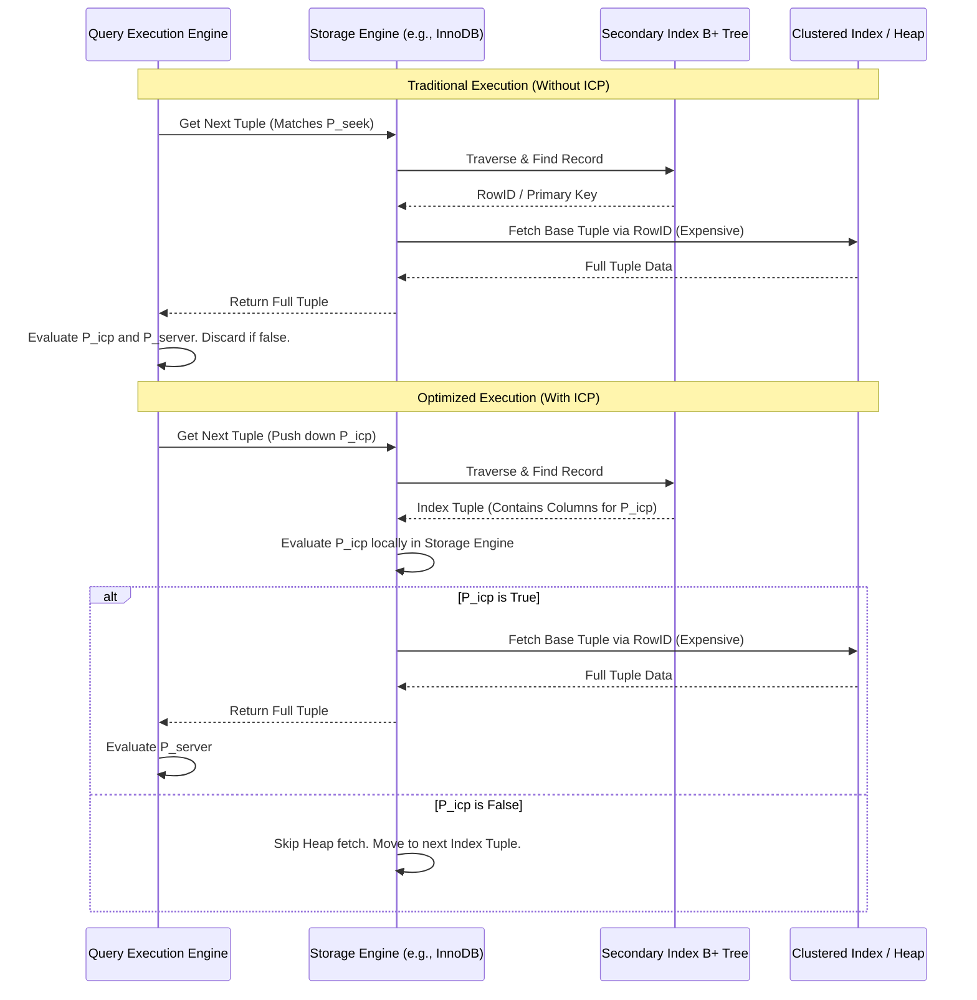

# 24: Thiết kế Vi kiến trúc và Tối ưu hóa truy vấn: Covering Indexes, Index Condition Pushdown (ICP) và Index Merge trong Cơ sở dữ liệu Quan hệ

Sự phức tạp của các hệ thống cơ sở dữ liệu quan hệ (RDBMS) hiện đại không chỉ nằm ở khả năng lưu trữ dữ liệu mà còn ở các thuật toán tối ưu hóa truy vấn phức tạp nhằm giảm thiểu số lượng chu kỳ truy cập bộ nhớ (memory access cycles) và thao tác vào/ra (I/O operations). Các cơ chế tối ưu hóa cốt lõi ở cấp độ vi kiến trúc bao gồm Covering Indexes (Chỉ mục bao phủ), Index Condition Pushdown (ICP - Đẩy điều kiện chỉ mục xuống tầng lưu trữ) và Index Merge (Hợp nhất chỉ mục). Các kỹ thuật này can thiệp trực tiếp vào cách cấu trúc dữ liệu cây B+ (B+ Tree) được duyệt qua, cách các bộ đệm (buffers) trong hệ điều hành quản lý lỗi trang (page faults), và cách các tập lệnh CPU (CPU instruction sets) xử lý dữ liệu bitmap trong quá trình đánh giá các vị từ (predicate evaluation). Việc phân tích toán học và cấu trúc dữ liệu của các kỹ thuật này cung cấp một cái nhìn sâu sắc về giới hạn phần cứng và thiết kế hệ thống.

## Tối ưu hóa Hệ thống Bộ nhớ và Cấu trúc Cây B+ thông qua Covering Indexes

Một Covering Index không phải là một loại chỉ mục cụ thể về mặt vật lý, mà là một hiện tượng vi kiến trúc xảy ra khi một truy vấn có thể được giải quyết hoàn toàn bằng cách đọc cấu trúc dữ liệu của một hoặc nhiều secondary indexes (chỉ mục phụ) mà không cần truy cập vào clustered index (chỉ mục cụm) hay heap table (bảng dữ liệu gốc). Cơ sở toán học của kỹ thuật này dựa trên việc giảm thiểu số lượng phép duyệt đồ thị có hướng trong hệ thống lưu trữ phân cấp. Gọi $T$ là tập hợp tất cả các tuple trong một bảng, một truy vấn $Q$ yêu cầu một tập hợp các thuộc tính $A_{Q} = \{a_1, a_2, \dots, a_n\}$. Một chỉ mục $I$ được định nghĩa là một cấu trúc dữ liệu ánh xạ một tập hợp các khóa $K_{I} = \{k_1, k_2, \dots, k_m\}$ tới các con trỏ trỏ đến bản ghi gốc. Nếu $A_{Q} \subseteq K_{I}$ (hoặc trong trường hợp của InnoDB, $A_{Q} \subseteq (K_{I} \cup K_{PK})$ với $K_{PK}$ là khóa chính được gắn ngầm vào mỗi entry của secondary index), thì chỉ mục $I$ được gọi là một Covering Index cho truy vấn $Q$. Sự tối ưu hóa này có tác động to lớn đến việc quản lý bộ nhớ của hệ điều hành. Khi một bộ xử lý trung tâm (CPU) thực hiện một truy vấn không bao phủ (non-covering query), nó phải thực hiện một thao tác gọi là bookmark lookup (tra cứu dấu trang) hoặc tuple reconstruction (tái cấu trúc tuple). Thao tác này đòi hỏi việc chuyển đổi từ một địa chỉ trong leaf node của secondary index sang một địa chỉ trong clustered index. Trong không gian bộ nhớ ảo (virtual memory space) của quá trình RDBMS, hai cấu trúc này thường nằm rải rác trên các trang (pages) khác nhau. Quá trình tra cứu này dẫn đến mô hình truy cập bộ nhớ ngẫu nhiên (random memory access pattern), làm vô hiệu hóa các đường dẫn nạp trước (prefetch pipelines) của CPU và gây ra tỷ lệ lỗi bộ nhớ đệm (cache miss rate) cao ở các mức L1, L2, và L3.

Hệ quả của truy cập ngẫu nhiên là hệ điều hành phải liên tục thực hiện quá trình phân giải địa chỉ thông qua Translation Lookaside Buffer (TLB), và nếu trang dữ liệu chưa có trong Buffer Pool (bộ đệm dữ liệu của RDBMS), một page fault (lỗi trang) sẽ xảy ra, buộc quá trình I/O phải chờ đợi (block) cho đến khi dữ liệu được tải từ ổ đĩa NVMe hoặc SSD lên RAM. Chi phí I/O cho một truy vấn không sử dụng Covering Index có thể được mô hình hóa bằng công thức $C_{non-covering} = C_{index\_seek} + N \cdot C_{random\_IO}$, trong đó $N$ là số lượng bản ghi thỏa mãn điều kiện lọc của chỉ mục phụ. Ngược lại, khi sử dụng Covering Index, do toàn bộ dữ liệu cần thiết đã nằm sẵn trong leaf nodes của secondary index, mô hình truy cập chuyển thành truy cập tuần tự (sequential access) theo danh sách liên kết kép (doubly-linked list) giữa các leaf nodes. Chi phí I/O giảm xuống còn $C_{covering} = C_{index\_seek} + \lceil N / R_{page} \rceil \cdot C_{sequential\_IO}$, với $R_{page}$ là số lượng bản ghi có thể lưu trữ trong một trang bộ nhớ (thường là 16KB). Độ chênh lệch giữa $C_{random\_IO}$ và $C_{sequential\_IO}$ có thể lên tới hàng trăm lần trên các hệ thống lưu trữ quay (HDD) và hàng chục lần trên các hệ thống bộ nhớ flash (SSD), do đó Covering Index cung cấp một cơ chế giải phóng hoàn toàn cổ chai I/O. Hơn nữa, việc thu hẹp tập hợp dữ liệu được tải vào L3 cache của CPU cho phép các tập lệnh SIMD (Single Instruction, Multiple Data) được áp dụng hiệu quả hơn trong quá trình vector hóa đánh giá biểu thức (vectorized expression evaluation). Sự liên kết không gian (spatial locality) của dữ liệu trong một Covering Index đảm bảo rằng các cache lines (dòng bộ nhớ đệm, thường là 64 bytes) được tận dụng tối đa, giảm thiểu chu kỳ xung nhịp CPU lãng phí.


Dưới góc độ mã trình bày vi kiến trúc, sự khác biệt giữa hai lộ trình thực thi có thể được diễn giải qua một cấu trúc giả mã C++ trong lõi của hệ thống lưu trữ. Thuật toán minh họa quá trình hệ thống trích xuất dữ liệu trực tiếp từ một Node chỉ mục mà không thực hiện con trỏ gọi tới bảng chính. Sự tối ưu hóa này tránh được lệnh nhảy (jump instruction) có thể gây gián đoạn đường ống dự đoán phân nhánh (branch prediction pipeline) của bộ vi xử lý.

```cpp
template <typename IndexType, typename TupleType>
void ExecuteQuery(const IndexType& secondary_index, 
                  const std::vector<Predicate>& predicates, 
                  const std::vector<ColumnId>& projected_columns,
                  std::vector<TupleType>& result_set) {
    bool is_covering = secondary_index.ContainsAll(projected_columns);
    Cursor cursor = secondary_index.LowerBound(predicates.GetPrimaryKey());
    
    while (cursor.IsValid() && predicates.EvaluateBoundary(cursor.GetKey())) {
        if (is_covering) {
            // Fast path: No dereferencing to clustered index.
            // High spatial locality, optimized for CPU L1/L2 cache.
            TupleType tuple = ExtractFromIndexNode(cursor.GetCurrentNode(), projected_columns);
            if (predicates.EvaluateRemaining(tuple)) {
                result_set.push_back(tuple);
            }
        } else {
            // Slow path: Bookmark lookup required.
            // Incurs TLB misses and potential storage I/O stalls.
            RowId row_id = cursor.GetRowId();
            TupleType full_tuple = clustered_index.FetchByRowId(row_id); // Expensive random access
            if (predicates.EvaluateRemaining(full_tuple)) {
                result_set.push_back(ProjectColumns(full_tuple, projected_columns));
            }
        }
        cursor.Advance();
    }
}
```

## Thuật toán Phân tách Vị từ và Index Condition Pushdown (ICP)

Index Condition Pushdown (ICP) là một mô hình kiến trúc phân tán tính toán tĩnh ngay bên trong một nút máy chủ (single-node intra-server static computation distribution), cụ thể là việc chuyển giao logic đánh giá vị từ (predicate evaluation logic) từ tầng thực thi SQL (SQL Execution Engine) xuống tầng lưu trữ (Storage Engine API). Lịch sử của việc thiết kế RDBMS thường duy trì một ranh giới tách biệt nghiêm ngặt: tầng thực thi chịu trách nhiệm phân tích cú pháp, tối ưu hóa đại số quan hệ và kiểm tra các điều kiện WHERE, trong khi tầng lưu trữ chỉ đóng vai trò như một kho chứa key-value cung cấp các hàm API cơ bản như lấy bản ghi tiếp theo. Mô hình này, tuy đảm bảo tính module hóa (modularity), nhưng lại gây ra sự suy giảm hiệu năng nghiêm trọng đối với cấu trúc bộ nhớ. Giả sử có một truy vấn với điều kiện lọc $P = p_1 \wedge p_2 \wedge \dots \wedge p_k$. Khi duyệt qua một chỉ mục phức hợp (composite index) trên các cột $(c_1, c_2, c_3)$, nếu chỉ có $c_1$ được sử dụng cho việc định tuyến cấu trúc cây B+ (index seek), các điều kiện liên quan đến $c_2$ và $c_3$ theo truyền thống sẽ không được tầng lưu trữ kiểm tra. Thay vào đó, tầng lưu trữ sẽ phải thực hiện một quá trình tra cứu dữ liệu gốc cho mọi bản ghi khớp với $c_1$, chuyển đổi luồng byte thành định dạng tuple của tầng thực thi, và trả về cho tầng thực thi để nó áp dụng phần còn lại của vị từ $P$.

Sự ra đời của ICP giải quyết vấn đề này bằng cách phân tách tập hợp các vị từ $P$ thành ba tập con rời rạc (disjoint subsets): $P_{seek}$, $P_{icp}$, và $P_{server}$. $P_{seek}$ chứa các vị từ định tuyến chính xác trong quá trình đi xuống từ gốc của B+ tree (root-to-leaf traversal). $P_{icp}$ chứa các vị từ có thể được đánh giá hoàn toàn dựa trên dữ liệu hiện diện trong leaf nodes của chỉ mục phụ, nhưng không thể được sử dụng để định tuyến cấu trúc (ví dụ: điều kiện so sánh chuỗi sử dụng toán tử LIKE trên một cột không phải là tiền tố đầu tiên của chỉ mục). $P_{server}$ chứa các vị từ yêu cầu dữ liệu không có trong chỉ mục và buộc phải đọc bảng gốc. Công thức tối ưu hóa có thể được biểu diễn như sau: Hệ thống sẽ tối thiểu hóa hàm chi phí tải dữ liệu $F_{cost} = \sum_{i=1}^{|R_{seek}|} (C_{eval}(P_{icp}, r_i) + \delta(P_{icp}, r_i) \cdot C_{fetch\_base\_tuple}(r_i))$, trong đó $R_{seek}$ là tập hợp các bản ghi được trả về bởi $P_{seek}$, và hàm chỉ thị $\delta(P_{icp}, r_i)$ trả về 1 nếu bản ghi $r_i$ thỏa mãn $P_{icp}$ và 0 nếu ngược lại. Bằng cách đẩy logic của $P_{icp}$ xuống Storage Engine, quá trình tải dữ liệu gốc (chi phí cao nhất bao gồm I/O và chép bộ nhớ) chỉ được kích hoạt khi $\delta = 1$. Việc này làm giảm đáng kể lượng dữ liệu di chuyển qua Application Binary Interface (ABI) giữa hai tầng của hệ quản trị cơ sở dữ liệu.



Tại cấp độ phần cứng, sự giảm thiểu số lần gọi hàm API (function call overhead) và tránh sao chép dữ liệu dư thừa (zero-copy overhead avoidance) giúp hệ thống đạt được băng thông bộ nhớ (memory bandwidth) lớn hơn. Khi ICP không được kích hoạt, một lượng lớn các khối dữ liệu từ bảng gốc bị tải vào L1/L2 cache của CPU chỉ để bị loại bỏ ngay sau đó bởi tầng máy chủ (server layer). Đây là hiện tượng ô nhiễm bộ nhớ đệm (cache pollution), làm đẩy các dòng dữ liệu (cache lines) hữu ích ra khỏi bộ đệm, gây suy giảm hiệu năng cho toàn bộ hệ thống đang chạy song song (concurrent threads). ICP hoạt động như một màng lọc dữ liệu sớm (early filtering mechanism), đảm bảo rằng chỉ những tuple có xác suất cao đóng góp vào kết quả cuối cùng (result set) mới được chuyển lên hệ thống cấp phát bộ nhớ động của tầng thực thi SQL. Sự phức tạp thuật toán của ICP còn được phản ánh trong thiết kế trình biên dịch truy vấn JIT (Just-In-Time query compilation), nơi các điều kiện $P_{icp}$ được biên dịch thành mã máy nguyên thủy (native machine code) và nhúng trực tiếp vào các vòng lặp quét chỉ mục (index scan loops) của Storage Engine, tối ưu hóa các lệnh phân nhánh (branch statements) và tận dụng triệt để kiến trúc siêu vô hướng (superscalar architecture) của các bộ vi xử lý hiện đại.

## Cấu trúc dữ liệu Bitmap và Logic hợp nhất trong Index Merge 

Thuật toán Index Merge giải quyết một giới hạn cố hữu của cấu trúc B+ Tree một chiều (one-dimensional B+ Tree): khả năng tối ưu hóa các truy vấn có điều kiện lọc phức tạp sử dụng các toán tử logic OR và AND trên nhiều cột phân biệt mà không có một chỉ mục phức hợp (composite index) phù hợp. Trong môi trường dữ liệu có số chiều cao (high-dimensional data environment) và các mẫu truy vấn đặc biệt (ad-hoc queries), việc duy trì mọi hoán vị của các chỉ mục phức hợp là điều bất khả thi do sự bùng nổ tổ hợp (combinatorial explosion) về không gian lưu trữ và chi phí bảo trì cấu trúc cây trong các phép toán thao tác dữ liệu (Data Manipulation Language). Index Merge xuất hiện như một cơ chế động ở thời gian thực thi (runtime dynamic mechanism), cho phép bộ tối ưu hóa (Optimizer) lập lịch quét đồng thời (concurrent scanning) trên nhiều chỉ mục phụ riêng biệt, trích xuất các tập hợp định danh hàng (RowID sets), và sử dụng các thuật toán dựa trên bitmap (bitmap-based algorithms) để tính toán phép giao (intersection), phép hợp (union) hoặc phép hợp có sắp xếp (sort-union) trước khi truy xuất dữ liệu từ bảng gốc. Quá trình này về cơ bản là một sự ánh xạ từ lý thuyết tập hợp (set theory) sang các phép toán thao tác bit mức thấp (low-level bitwise operations).

Đối với chiến lược Index Merge Intersection (áp dụng cho các điều kiện AND), hệ thống thu thập các luồng định danh (identifier streams) từ các chỉ mục khác nhau. Đặt $I_1, I_2, \dots, I_n$ là các chỉ mục được chọn. Đối với mỗi chỉ mục $I_i$, một tập hợp RowIDs $S_i$ được tạo ra. Kết quả cuối cùng là $R_{intersect} = \bigcap_{i=1}^{n} S_i$. Tại cấp độ vi kiến trúc, thay vì thực hiện thuật toán băm (hashing) truyền thống hoặc sắp xếp và trộn (sort-merge) có chi phí $\mathcal{O}(N \log N)$, các RDBMS sử dụng cấu trúc dữ liệu bitmap (bitmap data structure). Một mảng bit (bit array) được phân bổ liên tục trong bộ nhớ RAM. Nếu số lượng RowID lớn, hệ thống sẽ sử dụng các kỹ thuật nén bitmap (bitmap compression) như Roaring Bitmaps hoặc Word-Aligned Hybrid (WAH) để duy trì cấu trúc không gian cực kỳ nhỏ gọn. Giả sử tập hợp $S_1$ được chuyển đổi thành bitmap $B_1$, $S_2$ thành $B_2$, khi đó phép giao được tính thông qua phép toán AND logic bitwise: $B_{intersect} = B_1 \land B_2$. Phép toán $\land$ trên các vector boolean là một trong những phép toán rẻ nhất đối với CPU. Hàng ngàn bit có thể được xử lý trong một chu kỳ xung nhịp (clock cycle) duy nhất thông qua tập lệnh AVX-512 (Advanced Vector Extensions 512-bit) trên các vi xử lý x86, thực hiện xử lý 512 bit dữ liệu cùng một lúc. Do đó, chi phí $\mathcal{O}(N)$ của phép giao tập hợp được chia cho hệ số vector hóa (vectorization factor) $W$, đạt được hiệu suất I/O và CPU cực độ.

Đối với Index Merge Union và Sort-Union (áp dụng cho các điều kiện OR), bài toán trở nên phức tạp hơn do bản chất phân tán của kết quả. $R_{union} = \bigcup_{i=1}^{n} S_i$. Trong chiến lược Union thông thường, các tập hợp $S_i$ đã được lấy ra theo thứ tự của RowID (do thiết kế đặc thù của một số B+ Tree nơi leaf node được sắp xếp ngầm bởi khóa chính). Thuật toán mergesort nhiều luồng (multi-way mergesort) có thể được áp dụng với độ phức tạp $\mathcal{O}(N \log K)$ với $K$ là số lượng chỉ mục. Trong trường hợp Sort-Union, các bản ghi được trả về từ chỉ mục không được sắp xếp theo RowID (ví dụ khi chỉ mục chứa nhiều khóa trùng lặp). Hệ điều hành phải phân bổ các vùng nhớ làm việc (working memory areas) gọi là sort buffers. Dữ liệu từ mỗi $S_i$ được đưa vào sort buffer, sắp xếp song song, và sau đó loại bỏ dữ liệu trùng lặp (deduplication) để tạo thành một chuỗi RowID duy nhất. Quá trình này đòi hỏi băng thông bộ nhớ lớn và quản lý bộ nhớ không đồng nhất (NUMA - Non-Uniform Memory Access) tối ưu. Nếu sort buffer vượt quá dung lượng RAM được cấu hình, hiện tượng tràn ra đĩa (disk spilling) sẽ xảy ra, sử dụng các tập tin tạm thời (temporary files) được ánh xạ qua cơ chế bộ nhớ ảo, gây ra độ trễ I/O nghiêm trọng. Do đó, bộ tối ưu hóa chi phí (Cost-Based Optimizer - CBO) sử dụng một mô hình toán học dự đoán độ chọn lọc (selectivity predictive mathematical model): nó ước tính số lượng bản ghi cho mỗi $S_i$ thông qua các đồ thị phân bố dữ liệu (data distribution histograms). Gọi $Sel(P_i)$ là độ chọn lọc của điều kiện $P_i$. Nếu $\sum Sel(P_i)$ vượt qua một ngưỡng $\tau$ (thường là từ 15% đến 25% tổng số bản ghi), CBO sẽ loại bỏ hoàn toàn kế hoạch Index Merge và chuyển sang thực thi quét toàn bộ bảng (Full Table Scan) dựa trên nguyên lý rằng I/O tuần tự trên toàn bộ bảng sẽ có hiệu năng vi kiến trúc cao hơn là I/O ngẫu nhiên diện rộng do sort-union gây ra.

```rust
// Rust Pseudocode demonstrating the SIMD-accelerated Bitmap Intersection
// within a Storage Engine's Index Merge execution node.
use std::arch::x86_64::_mm512_and_si512;
use std::arch::x86_64::_mm512_loadu_si512;
use std::arch::x86_64::_mm512_storeu_si512;

pub fn simd_bitmap_intersect(b1: &[u64], b2: &[u64], out: &mut [u64]) {
    let len = b1.len();
    assert_eq!(len, b2.len());
    assert_eq!(len, out.len());

    // Assume len is a multiple of 8 (64-bit words) for 512-bit alignment
    let chunks = len / 8;
    
    for i in 0..chunks {
        unsafe {
            // Load 512 bits (8 x 64-bit words) into AVX-512 registers
            let ptr1 = b1.as_ptr().add(i * 8) as *const __m512i;
            let ptr2 = b2.as_ptr().add(i * 8) as *const __m512i;
            let out_ptr = out.as_mut_ptr().add(i * 8) as *mut __m512i;

            let vec1 = _mm512_loadu_si512(ptr1);
            let vec2 = _mm512_loadu_si512(ptr2);

            // Execute single-cycle parallel bitwise AND 
            // Extreme CPU optimization avoiding instruction loops
            let vec_res = _mm512_and_si512(vec1, vec2);

            // Store the result back to memory
            _mm512_storeu_si512(out_ptr, vec_res);
        }
    }
}
```

Sự kết hợp giữa Covering Indexes, Index Condition Pushdown, và Index Merge không mang tính loại trừ lẫn nhau (mutually exclusive) mà thực chất chúng tạo thành một hệ thống ống nước tuyến tính phức hợp (complex linear pipeline). Một truy vấn có thể sử dụng Index Merge để tìm giao của các bộ dữ liệu từ hai chỉ mục. Đối với quá trình duyệt một trong hai chỉ mục đó, nếu engine phát hiện một số điều kiện phù hợp, nó có thể áp dụng ICP để lọc bớt dữ liệu ngay trong quá trình đọc leaf nodes. Nếu cuối cùng danh sách các cột yêu cầu có thể được chiết xuất hoàn toàn từ các bitmap hoặc các thông tin metadata kết hợp, hệ thống có thể kết thúc sớm thao tác mà không cần triệu gọi quá trình tải dữ liệu gốc (fetch base tuple), hoàn tất vòng đời truy vấn dưới định dạng Covering Index toàn phần. Đây là đỉnh cao của quá trình tinh chỉnh thuật toán cơ sở dữ liệu, nơi mà sự hiểu biết từ cấp độ cổng logic phần cứng, vi kiến trúc CPU, hệ thống tệp tin (filesystem), lên đến đồ thị đại số quan hệ được hòa quyện để mang lại độ trễ (latency) tính bằng micro-giây trong một hệ thống phân tương đối lớn.

## Tối ưu hóa Công cụ Tìm kiếm (SEO)

*   **Meta Title:** Kiến trúc Cơ sở dữ liệu: Covering Indexes, ICP & Index Merge
*   **Meta Description:** Phân tích chuyên sâu về vi kiến trúc và thuật toán đằng sau Covering Indexes, Index Condition Pushdown (ICP) và Index Merge. Khám phá cách các cơ chế này giải quyết cổ chai I/O, tối ưu hóa bộ nhớ đệm CPU (L1/L2/L3), và ứng dụng phép toán SIMD vào đánh giá vị từ để đạt hiệu năng cực hạn trong RDBMS.
*   **Target Keywords:** Covering Indexes, Index Condition Pushdown, ICP MySQL, Index Merge algorithm, SIMD database optimization, B+ Tree performance, database micro-architecture, truy vấn SQL nâng cao, tối ưu hóa hệ quản trị cơ sở dữ liệu.
*   **URL Slug:** 24-covering-indexes-icp-index-merge-architecture
*   **Tags:** Database Engineering, RDBMS, Performance Tuning, Micro-architecture, Algorithms.
