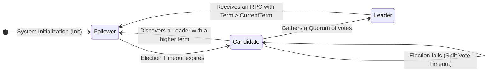
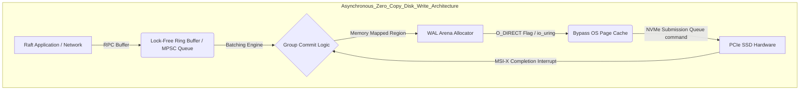

# The Raft Consensus Algorithm: The Heart of Distributed Systems and Replication (In-Depth Technical Report)

## Executive Summary

Keeping data consistent across machines that are thousands of kilometers apart is one of the harder problems you'll run into in distributed systems work. This report is a deep dive into the Raft consensus algorithm — the protocol that made this problem tractable enough for ordinary engineering teams to actually ship.

**Problem Statement:** Any distributed system has to live with the CAP theorem — consistency, availability, partition tolerance — and pick its trade-offs the moment the network splits. Before Raft, Paxos was the accepted theoretical answer, but its mathematical density and the notorious gap between "Paxos on paper" and "Paxos in production code" slowed a lot of database projects down. The open question was whether you could build a consensus protocol that is provably safe and still something a team could reason about, implement, and debug without a distributed-systems PhD on staff.

**Goal of this article:** We'll work through Raft's architecture from the ground up — the formal model behind it, the hardware and OS constraints that shape any real implementation, and finally the Multi-Raft technique used to scale it out. By the end you should have a working mental model of what's actually happening inside systems like TiKV, CockroachDB, and etcd.

**Lessons Learned:**
1. **Divide and conquer works at the protocol level too.** By splitting consensus into Leader Election, Log Replication, and Safety, Raft turns an intimidating problem into three problems you can reason about separately.
2. **Data flows one way.** Because writes only ever move from leader to followers, Raft sidesteps the peer-to-peer conflict resolution that makes other approaches so hard to get right.
3. **Physics sets the ceiling.** You can't build a fast Raft implementation without understanding NVMe SSDs, network RTT, page cache behavior, and io_uring — the theory only gets you halfway.
4. **A single leader doesn't scale, so Multi-Raft exists.** One Raft group tops out well below what a large cluster needs; sharding data into many small Raft groups (Regions) is what lets systems like TiKV scale to planet-sized datasets.

---

## Theoretical Foundations and Mathematical Specification of Raft Consensus

Formally, a Raft cluster is a set of nodes $S = \{S_1, S_2, \dots, S_n\}$, and the cluster size $n$ is chosen using the well-known relation $n = 2f + 1$ — this is what lets the system keep making progress while tolerating up to $f$ concurrent crash failures.

### Logical Clocks and Terms

Raft doesn't care about wall-clock time. Instead, it slices time into discrete, monotonically increasing terms, $T \in \mathbb{N}$, which act as the cluster's logical clock. A node can miss any number of terms while it's disconnected; the moment it reconnects and sees a message carrying a higher term, it updates its own view of time and steps back down to Follower, giving up whatever authority it thought it had.

At any given moment a node $S_i$ sits in exactly one state out of a small finite set — $State(S_i) \in \{Follower, Candidate, Leader\}$ — and transitions between them are driven by a randomized timeout and by the arrival of RPCs.



### The Quorum Mechanism and the Split-Vote Phenomenon

The core trick behind Raft's safety guarantee is simple once you see it: by the pigeonhole principle, any two quorums $Q_1, Q_2 \subset S$ that each hold a majority of nodes ($|Q_i| > \frac{n}{2}$) are guaranteed to overlap — $Q_1 \cap Q_2 \neq \emptyset$. That overlap is what makes it impossible for two leaders to be elected in the same term, which is exactly what Election Safety requires.

The trouble starts when the network gets flaky. If several nodes time out at roughly the same moment and all become candidates, votes get split three or four ways, nobody reaches a majority, and the cluster stalls with no leader.

Raft breaks this deadlock with randomness. Each node draws its election timeout independently from a uniform distribution, $T_{election} \sim \mathcal{U}(T_{min}, T_{max})$, so the odds of everyone timing out together shrink fast.

Let $T_b$ be the average network broadcast time and $MTBF$ the mean time between hardware failures. Whether the whole scheme actually works comes down to this inequality holding:

$$ T_b \ll T_{election} \ll MTBF $$

If the range $\Delta T = T_{max} - T_{min}$ is set too tight relative to how jittery the network is, the chance of a collision grows roughly as $\mathbb{P}(Collision) \approx \frac{n \times T_b}{\Delta T}$. In practice, teams running Raft at scale end up tuning these bounds continuously — sometimes with something as simple as a feedback loop, sometimes with time-series models — to keep election success rates high as network conditions drift.

---

## The Log Matching Property and the Replicated State Machine (RSM)

Raft is built around the Replicated State Machine model: every write becomes a log entry, and the Log Matching Property is the theorem that guarantees the replicas never quietly drift apart.

Let $L_i$ be the log at node $S_i$, where each entry $e \in L_i$ is a triple $(index, term, command)$. The theorem says: for any two nodes $S_i, S_j$ and any index $k$,

- if their entries at index $k$ share the same term ($L_i[k].term == L_j[k].term$), then every entry before that index must also match exactly: $\forall m \le k, L_i[m] == L_j[m]$.

This isn't just a nice property on paper — it's enforced on every single `AppendEntries` RPC. When the leader sends a command, it also includes the position of the entry right before it ($prevLogIndex$, $prevLogTerm$).

The follower then does the following:
1. If it doesn't have an entry at $prevLogIndex$ with a term matching $prevLogTerm$, it rejects the request (Reply: False).
2. That rejection makes the leader step its bookkeeping for that follower backward — decrementing $nextIndex[S_i]$ by one and trying again.
3. It keeps stepping back until it finds a point where the logs agree.
4. From that point on, the leader ships every subsequent entry, overwriting whatever conflicting entries the follower had, and the two logs are back in sync.

### Dynamic Membership Changes and Joint Consensus

Things get genuinely tricky when you need to add or remove servers without taking the cluster down. If a cluster switches from configuration $C_{old}$ to $C_{new}$ in a way that isn't atomic, you can end up with a split-brain scenario: part of the cluster still thinks $C_{old}$ is in effect and elects a leader under it, while another part running $C_{new}$ elects a different leader at the same time.

Raft avoids this with an intermediate configuration called **Joint Consensus** ($C_{old,new}$). While the cluster is in this state, any decision has to satisfy both quorums at once:
$$ Quorum_{joint} = Quorum(C_{old}) \cap Quorum(C_{new}) $$

Only once this joint configuration itself has been committed to a majority of both the old and new configurations is the leader allowed to move on and finalize $C_{new}$ — which is what keeps the Safety property intact through the whole transition.

There's a second wrinkle worth knowing about: **Pre-Vote**. A node that gets cut off from the network keeps bumping its term and calling elections it can never win. When it reconnects, its artificially high term can knock a perfectly healthy leader out of office for no good reason. Pre-Vote fixes this by having a candidate first poll other nodes at its current term, without incrementing anything — only once it's confirmed it can actually reach a majority does it bump $currentTerm$ and start a real election.

---

## Execution Micro-architecture and Operating System Memory Management

The mathematics behind Raft is clean, but getting that math to run fast on real hardware means fighting the OS and the storage stack the whole way.

### Write-Ahead Logging (WAL) and the fsync() Bottleneck

To satisfy durability, a Raft node has to make sure $currentTerm$, $votedFor$, and the log entries themselves are actually on stable storage before it acknowledges an RPC — not just handed off to some buffer.

On Linux, a plain $write()$ call just copies bytes into the kernel's page cache; nothing has actually reached disk yet. If the machine loses power or the kernel panics before those dirty pages are flushed, that data is gone, and with it Raft's durability guarantee.

So a Raft node has to call $fsync()$ or $fdatasync()$ to force the data all the way down to NAND flash. Even on a fast PCIe Gen 5 NVMe drive, that call still costs tens to hundreds of microseconds — and that cost sets a hard ceiling on how fast the system can commit writes.

### Optimization: Group Commit and io_uring

The standard fix is **Group Commit**. Instead of calling $fsync()$ once per write — which would be brutally expensive at any real throughput — the system collects log entries arriving concurrently from many connections into a single batch (often via lock-free MPSC queues) and flushes them all with one disk sync.

$$ \lim_{batch \to \infty} \frac{Latency_{sync}}{batch} \approx 0 $$

On top of that, systems like TiKV and CockroachDB use `O_DIRECT` and `io_uring` to skip the page cache entirely, moving data straight from user-space memory to the NVMe controller via zero-copy DMA.

```rust
// Illustrative Rust: Zero-Copy and Asynchronous Micro-architecture in the Raft Core
#[repr(align(64))]
pub struct RaftCore<SM: StateMachine> {
    current_term: AtomicU64,
    commit_index: AtomicU64,
    wal_store: Arc<DirectIoWalEngine>, // O_DIRECT optimization bypassing the Page Cache
    state_machine: Arc<SM>,
}

impl<SM: StateMachine> RaftCore<SM> {
    pub async fn process_append_entries_async(
        &mut self, 
        req: AppendEntriesRequest
    ) -> Result<AppendEntriesResponse, SystemError> {
        let term_snapshot = self.current_term.load(Ordering::Acquire);
        if req.term < term_snapshot {
            return Ok(AppendEntriesResponse { term: term_snapshot, success: false });
        }
        
        // Use io_uring for Zero-copy DMA from the kernel to the physical NVMe drive
        self.wal_store.async_truncate_and_append(
            req.prev_log_index + 1, 
            &req.entries
        ).await?;
        
        let local_commit = self.commit_index.load(Ordering::Acquire);
        if req.leader_commit > local_commit {
            let max_persisted = self.wal_store.get_last_index(Ordering::Acquire);
            let next_commit = std::cmp::min(req.leader_commit, max_persisted);
            
            // Release memory barrier guarding against Out-Of-Order Execution
            self.commit_index.store(next_commit, Ordering::Release);
            self.state_machine.trigger_background_apply(next_commit);
        }
        
        Ok(AppendEntriesResponse { term: req.term, success: true })
    }
}
```



### Garbage Collection Pauses and Fragmentation Management

Stop-the-world GC pauses in Go or Java are genuinely dangerous for a Raft node. A single 50ms pause can blow past the election timeout, trigger a spurious election, and set off a round of leader flapping across the cluster.

That's a big part of why GC-free languages like Rust and C++ tend to win out in this space. Common mitigations include arena allocators and object pools — pre-allocating large contiguous memory regions, often via `mmap` combined with `HugeTLB` (2MB or 1GB pages), which cuts down TLB misses and avoids the overhead of ad hoc allocation and cleanup entirely.

---

## Network Optimization and Solving Little's Law

How fast a Raft cluster can actually replicate is ultimately bounded by queueing theory. Across a wide-area network, the maximum achievable throughput $\Phi_{max}$ is capped by the bandwidth-delay product.

If the leader sends one `AppendEntries` message, waits for the ack, then sends the next, throughput will be miserable regardless of available bandwidth.
The fix is **pipelining**: the leader keeps firing off entries without waiting for each individual ack. The catch is that a single dropped packet causes head-of-line blocking, forcing the leader to figure out exactly where things went wrong. Raft handles this by tracking per-follower progress with something like a binary search over log positions, so the leader can pinpoint the divergence point and resend just the missing entries instead of replaying everything.

At the high end — inside a single rack — some systems go further and use **RDMA** and **RoCEv2**. The leader's NIC reads log data and writes it directly into the follower's memory over the wire, with the CPU barely involved. RTT at that point can get down to roughly a microsecond.

---

## Scaling Architecture: Multi-Raft and Planet-Scale Sharding

Vanilla Raft has one obvious weak point: a single leader handles all the writes. No matter how beefy that one node is, its network and I/O capacity is a hard ceiling, and meanwhile every other node in the group is sitting mostly idle.

The answer — pioneered by Google Spanner and adopted widely by CockroachDB and TiKV — is **Multi-Raft**.

The idea, in three parts:
1. **Sharding:** the keyspace is cut into a large number of fixed-size regions, typically 64MB–128MB each.
2. **Independent consensus per region:** each region runs its own small Raft group, usually with 3 replicas.
3. **Spread the load:** these thousands or millions of Raft groups get distributed across the whole fleet — a single physical server might be the leader for 10,000 regions while acting as a follower for another 20,000.

This spreads read/write load across essentially all the hardware you have, instead of concentrating it on whichever node happens to be the leader of the one group that matters.

The catch is that Multi-Raft creates heartbeat storms — if a server hosts 100,000 regions and each sends a heartbeat every 50ms, the NIC chokes on the volume alone. The fix is **message batching**: heartbeats from thousands of Raft groups get packed into a single network frame, which can cut communication overhead by something like 99%.

All of this is coordinated by a component often called a **Placement Driver (PD)**. It tracks disk and CPU load across the fleet (often via gossip), and when it sees a server getting overloaded, it issues a **Transfer Leader** command to shift leadership onto a less busy replica — a form of continuous, automated rebalancing.

---

## Conclusion and Architectural Philosophy

Raft is more than a replication algorithm — it's a case study in how much value comes from making a hard problem understandable. By insisting that consensus be explainable, not just provable, its designers handed engineers a tool solid enough to build systems that stay up.

Compared to the tangle of edge cases in classic Paxos, Raft keeps things grounded in a single leader, a linear log, and a replicated state machine you can actually trace through in your head. That combination of clean theory, hardware-aware engineering, and the Multi-Raft scaling model is why it now sits at the center of so much of today's distributed database infrastructure.

---
