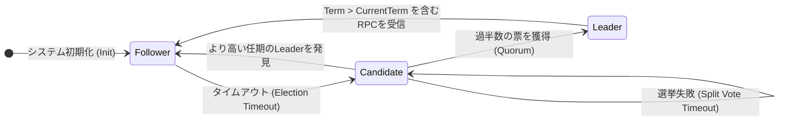
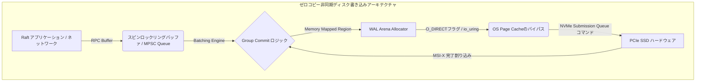

# Raftコンセンサスアルゴリズム: 分散システムとレプリケーションの心臓部

## エグゼクティブサマリー

地理的に離れたリージョン間でデータの整合性を保つことは、分散システムの設計でいちばん頭を悩ませるテーマの一つだ。この記事ではRaftコンセンサスアルゴリズムを掘り下げていく。Raftは、この問題を現場のエンジニアが実際に扱えるレベルまで持ってきてくれたプロトコルだ。

**背景にある課題:** どんな分散システムもCAP定理――一貫性、可用性、分断耐性――と向き合わざるを得ず、ネットワークが分断した瞬間にどちらを取るかを迫られる。Raft以前はPaxosが理論上の答えとされていたが、数式の難解さと「紙の上のPaxos」と「実装されたPaxos」の間のギャップが、多くのデータベースプロジェクトの足を引っ張ってきた。安全性を数学的に保証しながら、分散システムの専門家でなくても実装しデバッグできるコンセンサスプロトコルは作れるのか――これがRaftが答えようとした問いだ。

**この記事の狙い:** Raftの理論的な土台から、実装を左右するハードウェアやOSレベルの制約、そして最終的にはスケールアウトのためのMulti-Raftまでを順に見ていく。読み終える頃には、TiKV、CockroachDB、etcdといったシステムの内部で実際に何が起きているのか、具体的なイメージが持てるはずだ。

**押さえておきたいポイント:**
1. **分割統治は仕組みのレベルでも効く。** コンセンサスをリーダー選出、ログ複製、安全性という3つの要素に分けたことで、Raftは手に負えなかった問題を扱いやすい単位に変えた。
2. **データは一方向にしか流れない。** 書き込みは常にリーダーからフォロワーへしか流れないため、Raftはピアツーピア型のプロトコルが抱える競合解決の難しさを最初から回避している。
3. **物理法則が上限を決める。** NVMe SSD、ネットワークRTT、ページキャッシュ、io_uringへの理解なしに、速いRaft実装は書けない。理論だけでは半分にしか届かない。
4. **単一リーダーには限界があり、だからMulti-Raftがある。** 一つのRaftグループが処理できる量には天井があるので、データを小さなRaftグループ(Region)に分割してスケールさせるのがTiKVのようなシステムの発想だ。

---

## Raftコンセンサスの理論的基盤と数学的仕様

形式的に言えば、Raftクラスタはノード集合 $S = \{S_1, S_2, \dots, S_n\}$ としてモデル化される。クラスタサイズ $n$ には $n = 2f + 1$ という関係式がよく使われ、これにより最大 $f$ 個の同時クラッシュ障害を許容しつつシステムが動き続けられるようになっている。

### 論理クロックと任期(Terms)

Raftは壁時計の時刻には関心を持たない。代わりに時間を単調増加する離散的な単位に区切り、これを任期(term、$T \in \mathbb{N}$)と呼んで論理クロックとして使う。ノードはネットワークから切り離されている間いくつ任期が過ぎても構わない。再接続してより高い任期を含むメッセージを受け取った瞬間、自分の論理時間を更新し、それまでの権限をすべて手放してFollowerに戻る。

ある瞬間のノード $S_i$ は、$State(S_i) \in \{Follower, Candidate, Leader\}$ という小さな有限状態のどれか一つに必ずいる。状態遷移はランダムなタイムアウトとRPCの到着によって駆動される。



### クォーラムの仕組みと票の分割

Raftの安全性の核心は、一度分かってしまえばシンプルだ。鳩の巣原理により、過半数のノードを含む任意の2つのクォーラム $Q_1, Q_2 \subset S$($|Q_i| > \frac{n}{2}$)は必ず重なりを持つ――$Q_1 \cap Q_2 \neq \emptyset$。この重なりこそが、同じ任期内で2人のリーダーが選ばれることをそもそも不可能にしており、Election Safetyが成立する理由になっている。

問題が起きるのはネットワークが不安定になったときだ。複数のノードがほぼ同時にタイムアウトしてCandidateになると、票が分散してしまい、誰も過半数に届かず、クラスタはリーダー不在のまま止まってしまう。

Raftはこのデッドロックをランダム性で崩す。各ノードは選挙タイムアウトを一様分布 $T_{election} \sim \mathcal{U}(T_{min}, T_{max})$ から独立に選ぶので、全員が同時にタイムアウトする確率は急速に小さくなる。

平均的なネットワークのブロードキャスト時間を $T_b$、ハードウェア障害の平均間隔を $MTBF$ とすると、この仕組みがちゃんと機能するかどうかは次の不等式が成り立つかにかかっている。

$$ T_b \ll T_{election} \ll MTBF $$

範囲 $\Delta T = T_{max} - T_{min}$ をネットワークのジッターに対して狭く設定しすぎると、衝突が起きる確率はおおよそ $\mathbb{P}(Collision) \approx \frac{n \times T_b}{\Delta T}$ で増えていく。実運用ではこの範囲を単純なフィードバック制御で調整するチームもあれば、時系列モデルまで持ち出すチームもある――ネットワーク状況の変化に合わせて選挙成功率を保つためだ。

---

## ログマッチング特性とレプリケーテッドステートマシン(RSM)

Raftはレプリケーテッドステートマシンのモデルの上に成り立っている。すべての書き込みはログエントリになり、Log Matching Propertyはレプリカ同士が知らないうちにずれていくことがないと保証する定理だ。

ノード $S_i$ のログを $L_i$ とし、各エントリ $e \in L_i$ を $(index, term, command)$ の三つ組とする。この定理が言っているのは、任意の2ノード $S_i, S_j$ と任意のインデックス $k$ について、

- インデックス $k$ のエントリの任期が一致していれば($L_i[k].term == L_j[k].term$)、それより前のすべてのエントリも完全に一致する($\forall m \le k, L_i[m] == L_j[m]$)ということだ。

これは紙の上の話にとどまらず、`AppendEntries` RPCのたびに実際に検証される。リーダーはコマンドを送るとき、その直前のエントリの位置($prevLogIndex$、$prevLogTerm$)も一緒に送る。

Followerは次のように振る舞う。
1. $prevLogIndex$ の位置に $prevLogTerm$ と一致する任期のエントリがなければ、そのリクエストを拒否する(Reply: False)。
2. 拒否されると、リーダーはそのFollowerに対する $nextIndex[S_i]$ を一つ手前に戻し、もう一度試す。
3. これをログが一致する地点が見つかるまで繰り返す。
4. その地点からリーダーは以降のエントリをすべて送り、Follower側の食い違うエントリを上書きする。これで両者のログは再び一致する。

### 動的なメンバーシップ変更とJoint Consensus

クラスタを止めずにサーバーを追加・削除しようとすると、話は一気にややこしくなる。構成を $C_{old}$ から $C_{new}$ に切り替える処理がアトミックでないと、スプリットブレインが起きうる――クラスタの一部はまだ $C_{old}$ の下でリーダーを選び、別の部分は $C_{new}$ の下で別のリーダーを選んでしまう、という状態だ。

Raftはこれを **Joint Consensus**($C_{old,new}$)という中間構成で回避する。この状態にある間は、どんな決定も両方のクォーラムを同時に満たさなければならない。
$$ Quorum_{joint} = Quorum(C_{old}) \cap Quorum(C_{new}) $$

このJoint Consensus自体が旧構成・新構成の双方の過半数にコミットされて初めて、リーダーは $C_{new}$ への移行を完了させてよい――これがSafety特性を移行の全過程で守り抜く仕組みだ。

もう一つ知っておくと良いのが **Pre-Vote** だ。ネットワークから切り離されたノードは任期を上げ続け、勝てるはずのない選挙を繰り返し呼びかける。ネットワークが復旧すると、その不自然に高い任期のせいで、正常に動いていたリーダーが理由なく失脚させられてしまう。Pre-Voteはこれを防ぐ仕組みで、Candidateはまず任期を上げずに他のノードの意向を確認し、過半数に実際に到達できると確認できたときだけ $currentTerm$ を上げて本当の選挙を始める。

---

## 実行マイクロアーキテクチャとOSのメモリ管理

Raftの数学的な部分はきれいにまとまっているが、それを実際のハードウェアで速く動かそうとすると、OSやストレージスタックとの格闘が待っている。

### Write-Ahead Logging(WAL)とfsync()のボトルネック

耐久性を満たすために、Raftノードは $currentTerm$、$votedFor$、そしてログの内容が、RPCの応答を返す前に実際に安定したストレージへ書き込まれていることを保証しなければならない――どこかのバッファに渡しただけでは足りない。

Linuxでは、普通の $write()$ 呼び出しはバイト列をカーネルのページキャッシュにコピーするだけで、この時点ではディスクにはまだ届いていない。ダーティページがフラッシュされる前に電源が落ちたりカーネルパニックが起きたりすれば、そのデータは失われ、Raftの耐久性保証も一緒に崩れる。

だからRaftノードは $fsync()$ や $fdatasync()$ を呼んで、データを実際にNANDフラッシュまで押し込む必要がある。PCIe Gen 5の高速なNVMeドライブであっても、この呼び出しには数十から数百マイクロ秒かかり、これがシステムのコミット速度の実質的な上限になる。

### 最適化: Group Commitとio_uring

定番の対策が **Group Commit** だ。書き込みのたびに $fsync()$ を呼んでいては実運用のスループットに到底耐えられないので、複数の接続から並行して届くログエントリをひとまとめにし(多くはロックフリーのMPSCキューを使う)、一度のディスクフラッシュでまとめてコミットする。

$$ \lim_{batch \to \infty} \frac{Latency_{sync}}{batch} \approx 0 $$

さらにTiKVやCockroachDBのようなシステムでは、`O_DIRECT` や `io_uring` を使ってページキャッシュを丸ごと迂回し、ユーザー空間のメモリからNVMeコントローラへゼロコピーDMAで直接データを送っている。

```rust
// Rustのイラストコード: Raftコアにおけるゼロコピーおよび非同期マイクロアーキテクチャ
#[repr(align(64))]
pub struct RaftCore<SM: StateMachine> {
    current_term: AtomicU64,
    commit_index: AtomicU64,
    wal_store: Arc<DirectIoWalEngine>, // O_DIRECT最適化、Page Cacheをバイパス
    state_machine: Arc<SM>,
}

impl<SM: StateMachine> RaftCore<SM> {
    pub async fn process_append_entries_async(
        &mut self, 
        req: AppendEntriesRequest
    ) -> Result<AppendEntriesResponse, SystemError> {
        let term_snapshot = self.current_term.load(Ordering::Acquire);
        if req.term < term_snapshot {
            return Ok(AppendEntriesResponse { term: term_snapshot, success: false });
        }
        
        // 物理NVMeドライブへのカーネルからのゼロコピーDMAにio_uringを使用
        self.wal_store.async_truncate_and_append(
            req.prev_log_index + 1, 
            &req.entries
        ).await?;
        
        let local_commit = self.commit_index.load(Ordering::Acquire);
        if req.leader_commit > local_commit {
            let max_persisted = self.wal_store.get_last_index(Ordering::Acquire);
            let next_commit = std::cmp::min(req.leader_commit, max_persisted);
            
            // Out-Of-Order Executionを防ぐためのMemory barrier Release
            self.commit_index.store(next_commit, Ordering::Release);
            self.state_machine.trigger_background_apply(next_commit);
        }
        
        Ok(AppendEntriesResponse { term: req.term, success: true })
    }
}
```



### ガベージコレクションの停止とフラグメンテーション管理

GoやJavaのStop-The-World型GCは、Raftノードにとって本当に厄介な存在だ。50ミリ秒のGC停止一つで選挙タイムアウトを超えてしまい、不要な選挙が走り、クラスタ全体でリーダーがフラッピングする事態になりかねない。

こうした事情から、この分野ではRustやC++のようなGCのない言語がよく選ばれる。よく使われる対策はアリーナアロケータやオブジェクトプールだ。大きな連続領域を事前に確保しておく――しばしば `mmap` と `HugeTLB`(2MBや1GBページ)を組み合わせて――ことでTLBミスを減らし、動的なメモリ確保・解放のオーバーヘッドをそもそも発生させない。

---

## ネットワーク最適化とリトルの法則

Raftクラスタの実際のレプリケーション速度は、最終的には待ち行列理論によって決まる。広域ネットワーク越しでは、達成できる最大スループット $\Phi_{max}$ は帯域幅遅延積によって頭打ちになる。

リーダーが `AppendEntries` を1件送ってACKを待ち、それから次を送る、というやり方では、帯域幅がいくらあってもスループットは惨めなものになる。
そこで使われるのが **パイプライニング** だ。リーダーは個々のACKを待たずにエントリを送り続ける。ただし1パケットでも失われるとHead-of-Lineブロッキングが起き、どこでずれたのかをリーダーが特定しなければならなくなる。Raftはフォロワーごとの進捗をログ位置の二分探索のような形で追跡し、リーダーがずれた地点をピンポイントで見つけて、失われた分だけを再送できるようにしている。

さらに一段上、ラック内クラスタでは **RDMA** や **RoCEv2** を使う構成もある。リーダーのNICがログデータを読み取り、CPUをほとんど介さずにフォロワー側のメモリへ直接書き込む。ここまでいくとRTTはおよそ1マイクロ秒まで縮まる。

---

## スケーラブルなアーキテクチャ: Multi-Raftと地球規模のシャーディング

素のRaftには明確な弱点がある。書き込みをすべて1台のリーダーがさばく、という点だ。そのノードをどれだけ強力にしても、ネットワークとI/Oの容量には限りがあり、その一方でグループ内の他のノードはほとんど遊んでいる。

その答えとして――Google Spannerが先駆けとなり、CockroachDBやTiKVが広めた――**Multi-Raft** がある。

考え方は次の三つに集約される。
1. **シャーディング:** キースペースを64MBから128MB程度の固定サイズのRegionに大量に切り分ける。
2. **Region単位の独立したコンセンサス:** 各Regionは通常3レプリカの小さなRaftグループとして動く。
3. **負荷の分散配置:** これら数千・数百万のRaftグループをクラスタ全体に分散させる。1台の物理サーバーが1万のRegionのリーダーを務めつつ、別の2万のRegionのフォロワーを兼ねる、ということも普通に起きる。

こうすることで読み書きの負荷が実質すべてのハードウェアに分散し、特定のリーダーノードだけに負荷が集中する状態を避けられる。

ただしMulti-Raftにはハートビートの嵐という副作用がある。1台のサーバーが10万のRegionを抱え、それぞれが50ミリ秒ごとにハートビートを送ると、NICが単純な通信量だけで音を上げる。この対策が **メッセージのバッチ化** で、数千のRaftグループ分のハートビートを1つのフレームにまとめて送ることで、通信オーバーヘッドをおよそ99%削減できる。

これら全体の調整役が **Placement Driver(PD)** と呼ばれるコンポーネントだ。クラスタ全体のディスクやCPU負荷を(多くはゴシッププロトコルで)追跡し、特定のサーバーが過負荷になっているのを見つけると **Transfer Leader** コマンドを発行し、負荷の軽いレプリカにリーダーシップを移す。継続的で自動的な再配置と言っていい。

---

## 結論とアーキテクチャの哲学

Raftは単なるレプリケーションのアルゴリズムというより、難しい問題を理解可能な形にすることがどれほどの価値を持つかを示す事例だ。コンセンサスは証明可能なだけでなく説明可能であるべきだ、という発想が、システムを安定して動かし続けるための道具をエンジニアの手に渡した。

従来のPaxosに付きまとうエッジケースの多さと比べると、Raftは単一のリーダー、線形なログ、そして頭の中で実際に追いかけられるレプリケーテッドステートマシンという骨格に問題を落とし込んでいる。この整理された理論と、ハードウェアを意識した実装の工夫、そしてMulti-Raftによるスケーリングモデルの組み合わせこそが、今日の分散データベース基盤の中心にRaftが座っている理由だ。

---
