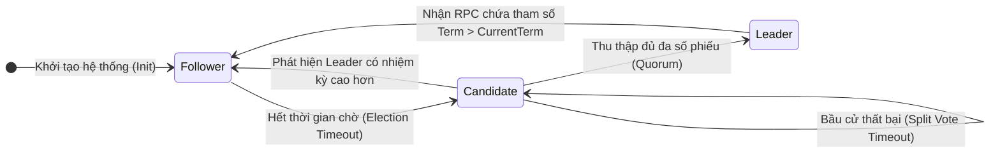
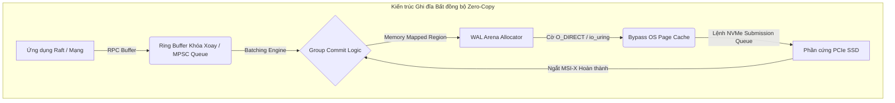

# Thuật toán Đồng thuận Raft: Trái tim của Hệ thống Phân tán và Replication (Báo cáo Kỹ thuật Chuyên sâu)

## Tóm tắt Điều hành

Giữ cho dữ liệu nhất quán trên những máy chủ cách nhau hàng nghìn cây số là một trong những bài toán khó nhằn nhất khi làm hệ thống phân tán. Bài viết này đi sâu vào thuật toán đồng thuận Raft - thuật toán đã biến bài toán này từ chỗ chỉ dành cho dân lý thuyết thành thứ mà một đội kỹ sư bình thường cũng có thể triển khai được.

**Vấn đề cốt lõi:** Bất kỳ hệ thống phân tán nào cũng phải sống chung với định lý CAP - Consistency, Availability, Partition Tolerance - và buộc phải chọn đánh đổi ngay khi mạng bị phân mảnh. Trước Raft, Paxos được xem là câu trả lời chuẩn về mặt lý thuyết, nhưng độ phức tạp toán học cùng khoảng cách khá xa giữa "Paxos trên giấy" và "Paxos chạy được trong sản xuất" đã làm chậm không ít dự án cơ sở dữ liệu. Câu hỏi đặt ra là: liệu có thể xây một giao thức đồng thuận vừa an toàn về mặt hình thức, vừa đủ dễ hiểu để một đội kỹ sư triển khai và gỡ lỗi mà không cần bằng tiến sĩ hệ phân tán?

**Mục tiêu bài viết:** Chúng ta sẽ đi từ nền tảng lý thuyết của Raft, qua các ràng buộc phần cứng và hệ điều hành định hình mọi triển khai thực tế, rồi đến kỹ thuật Multi-Raft dùng để mở rộng quy mô. Đọc xong, bạn sẽ hình dung rõ hơn điều gì thực sự diễn ra bên trong các hệ thống như TiKV, CockroachDB hay etcd.

**Những điều rút ra được:**
1. **Chia để trị cũng hiệu quả ở tầng giao thức.** Bằng cách tách đồng thuận thành ba mảnh - Bầu thủ lĩnh, Nhân bản log, và An toàn - Raft biến một bài toán khó nhằn thành ba bài toán có thể suy luận riêng rẽ.
2. **Dữ liệu chỉ chảy một chiều.** Vì ghi dữ liệu luôn đi từ thủ lĩnh xuống các follower, Raft tránh được hẳn kiểu xung đột ngang hàng vốn làm các cách tiếp cận khác khó xử lý.
3. **Vật lý mới là giới hạn thật.** Không hiểu SSD NVMe, độ trễ mạng RTT, cơ chế page cache và io_uring thì không thể xây một triển khai Raft nhanh - lý thuyết chỉ mới đi được nửa đường.
4. **Một thủ lĩnh không đủ, nên mới có Multi-Raft.** Một nhóm Raft đơn lẻ sớm chạm trần so với nhu cầu của cụm lớn; việc băm dữ liệu thành nhiều nhóm Raft nhỏ (Region) là cách các hệ thống như TiKV mở rộng tới quy mô hành tinh.

---

## Nền tảng Lý thuyết và Đặc tả Toán học của Đồng thuận Raft

Về mặt hình thức, một cụm Raft là tập hợp các nút $S = \{S_1, S_2, \dots, S_n\}$, và kích thước cụm $n$ thường được chọn theo công thức quen thuộc $n = 2f + 1$ - đây chính là điều cho phép hệ thống tiếp tục hoạt động dù chịu tối đa $f$ lỗi sụp đổ đồng thời.

### Đồng hồ Logic và Nhiệm kỳ (Terms)

Raft không quan tâm đến thời gian đồng hồ tường. Thay vào đó, nó chia thời gian thành các nhiệm kỳ (term) rời rạc, tăng đơn điệu, $T \in \mathbb{N}$, đóng vai trò đồng hồ logic của cả cụm. Một nút có thể bỏ lỡ bao nhiêu nhiệm kỳ cũng được trong lúc mất kết nối; ngay khi kết nối lại và thấy một thông điệp mang nhiệm kỳ cao hơn, nó cập nhật lại thời gian logic của mình và lùi về trạng thái Follower, từ bỏ mọi quyền hạn đang có.

Tại một thời điểm bất kỳ, nút $S_i$ luôn nằm ở đúng một trong số ít trạng thái hữu hạn: $State(S_i) \in \{Follower, Candidate, Leader\}$. Việc chuyển trạng thái được kích hoạt bởi thời gian chờ ngẫu nhiên và bởi các RPC đến.



### Cơ chế Túc số (Quorum) và Hiện tượng Chia Phiếu Bầu

Cái hay trong đảm bảo an toàn của Raft, một khi đã hiểu ra, lại khá đơn giản: theo nguyên lý Dirichlet, bất kỳ hai túc số $Q_1, Q_2 \subset S$ nào cũng chứa đa số nút ($|Q_i| > \frac{n}{2}$) đều buộc phải giao nhau - $Q_1 \cap Q_2 \neq \emptyset$. Chính sự giao nhau này khiến việc hai thủ lĩnh cùng được bầu trong một nhiệm kỳ trở nên bất khả thi, và đó chính là lý do Election Safety được đảm bảo.

Rắc rối bắt đầu khi mạng trở nên chập chờn. Nếu nhiều nút cùng hết hạn chờ gần như đồng thời và đều chuyển sang Candidate, phiếu bầu bị xé lẻ ra nhiều phía, không ai đạt đa số, và cụm bị đứng hình vì không có thủ lĩnh.

Raft phá vỡ thế bế tắc này bằng tính ngẫu nhiên. Mỗi nút chọn thời gian chờ bầu cử độc lập từ phân phối đều $T_{election} \sim \mathcal{U}(T_{min}, T_{max})$, nhờ đó xác suất mọi nút cùng hết hạn một lúc giảm nhanh.

Gọi $T_b$ là thời gian phát sóng mạng trung bình và $MTBF$ là khoảng thời gian trung bình giữa các lần hỏng phần cứng. Toàn bộ cơ chế này có chạy được hay không phụ thuộc vào bất đẳng thức sau có đúng hay không:

$$ T_b \ll T_{election} \ll MTBF $$

Nếu khoảng $\Delta T = T_{max} - T_{min}$ được chọn quá hẹp so với độ jitter của mạng, xác suất va chạm tăng xấp xỉ theo $\mathbb{P}(Collision) \approx \frac{n \times T_b}{\Delta T}$. Trong thực tế vận hành, nhiều đội kỹ sư phải liên tục điều chỉnh khoảng thời gian này - có nơi chỉ cần một vòng phản hồi đơn giản, có nơi phải dùng đến mô hình chuỗi thời gian - để giữ tỷ lệ bầu cử thành công cao khi điều kiện mạng thay đổi.

---

## Đặc tính Khớp Nhật ký (Log Matching) và Cỗ máy Trạng thái Nhân bản (RSM)

Raft được xây trên mô hình Replicated State Machine: mọi thao tác ghi trở thành một entry trong log, và Log Matching Property là định lý đảm bảo các bản sao không bao giờ âm thầm lệch pha nhau.

Gọi $L_i$ là log tại nút $S_i$, mỗi entry $e \in L_i$ là bộ ba $(index, term, command)$. Định lý phát biểu rằng: với mọi cặp nút $S_i, S_j$ và mọi chỉ số $k$,

- nếu entry tại chỉ số $k$ của hai nút có cùng nhiệm kỳ ($L_i[k].term == L_j[k].term$), thì mọi entry trước đó cũng phải khớp tuyệt đối ($\forall m \le k, L_i[m] == L_j[m]$).

Đây không chỉ là một tính chất đẹp trên giấy - nó được kiểm chứng thực tế trong từng lệnh gọi `AppendEntries` RPC. Khi gửi một lệnh, thủ lĩnh luôn kèm theo vị trí của entry ngay trước đó ($prevLogIndex$, $prevLogTerm$).

Follower sau đó xử lý như sau:
1. Nếu không có entry nào tại $prevLogIndex$ với nhiệm kỳ trùng $prevLogTerm$, nó từ chối yêu cầu (Reply: False).
2. Sự từ chối này khiến thủ lĩnh lùi con trỏ $nextIndex[S_i]$ của follower đó về một bước và thử lại.
3. Quá trình lùi tiếp tục cho đến khi tìm được điểm mà hai log khớp nhau.
4. Từ điểm đó, thủ lĩnh gửi toàn bộ các entry tiếp theo, ghi đè lên bất kỳ entry nào bị lệch ở follower, và hai log lại đồng bộ.

### Thay đổi Thành viên Động và Joint Consensus

Mọi thứ trở nên thực sự rắc rối khi cần thêm hoặc bớt máy chủ mà không được phép dừng cụm. Nếu việc chuyển từ cấu hình $C_{old}$ sang $C_{new}$ không diễn ra nguyên tử, có thể xảy ra split-brain: một phần cụm vẫn nghĩ $C_{old}$ đang hiệu lực và bầu thủ lĩnh theo đó, trong khi phần khác đã chạy $C_{new}$ lại bầu một thủ lĩnh khác cùng lúc.

Raft tránh tình huống này bằng cấu hình trung gian gọi là **Joint Consensus** ($C_{old,new}$). Trong lúc cụm ở trạng thái này, mọi quyết định phải thỏa mãn cả hai túc số cùng lúc:
$$ Quorum_{joint} = Quorum(C_{old}) \cap Quorum(C_{new}) $$

Chỉ khi bản thân cấu hình joint này đã được commit vào đa số của cả cấu hình cũ lẫn mới, thủ lĩnh mới được phép hoàn tất chuyển sang $C_{new}$ - đây chính là điều giữ cho thuộc tính Safety nguyên vẹn suốt quá trình chuyển đổi.

Có một điểm nữa đáng biết đến là **Pre-Vote**. Một nút bị cắt khỏi mạng sẽ liên tục tăng nhiệm kỳ và gọi những cuộc bầu cử mà nó không thể thắng. Khi kết nối lại, nhiệm kỳ cao bất thường của nó có thể hất cẳng một thủ lĩnh đang hoạt động bình thường một cách vô lý. Pre-Vote xử lý việc này bằng cách buộc candidate phải thăm dò ý kiến các nút khác ở nhiệm kỳ hiện tại trước, không tăng gì cả - chỉ khi xác nhận được rằng nó thực sự liên lạc được với đa số thì mới được tăng $currentTerm$ và bắt đầu một cuộc bầu cử thật.

---

## Vi kiến trúc Thực thi và Quản lý Bộ nhớ Hệ điều hành

Phần toán học của Raft khá gọn gàng, nhưng để chạy nó nhanh trên phần cứng thật lại là một cuộc vật lộn dài với hệ điều hành và tầng lưu trữ.

### Write-Ahead Logging (WAL) và Nút thắt cổ chai fsync()

Để đảm bảo tính bền, một nút Raft phải chắc chắn rằng $currentTerm$, $votedFor$ và nội dung log đã thực sự nằm trên bộ lưu trữ ổn định trước khi xác nhận một RPC - chứ không chỉ là đã được đẩy vào một bộ đệm nào đó.

Trên Linux, một lệnh $write()$ thông thường chỉ sao chép byte vào page cache của kernel; dữ liệu lúc này chưa hề chạm tới đĩa. Nếu máy mất điện hoặc kernel panic trước khi các dirty page được flush, dữ liệu đó biến mất, và cùng với nó là đảm bảo về độ bền của Raft.

Vì vậy một nút Raft buộc phải gọi $fsync()$ hoặc $fdatasync()$ để ép dữ liệu xuống tận NAND flash. Ngay cả trên ổ NVMe PCIe Gen 5 tốc độ cao, lệnh gọi này vẫn tốn từ vài chục đến vài trăm micro giây - và đó chính là mức trần thực tế cho tốc độ commit của hệ thống.

### Tối ưu hóa: Group Commit và io_uring

Cách khắc phục phổ biến là **Group Commit**. Thay vì gọi $fsync()$ cho từng lệnh ghi - điều sẽ rất tốn kém ở thông lượng thực tế - hệ thống gom các entry đến đồng thời từ nhiều kết nối vào một lô (thường qua hàng đợi MPSC không khóa), rồi flush đĩa một lần cho cả lô.

$$ \lim_{batch \to \infty} \frac{Latency_{sync}}{batch} \approx 0 $$

Ngoài ra, các hệ thống như TiKV và CockroachDB còn dùng `O_DIRECT` và `io_uring` để bỏ qua hẳn page cache, đẩy dữ liệu thẳng từ bộ nhớ user-space sang bộ điều khiển NVMe qua DMA zero-copy.

```rust
// Đoạn mã minh họa Rust: Vi kiến trúc Zero-Copy và Bất đồng bộ trong lõi Raft
#[repr(align(64))]
pub struct RaftCore<SM: StateMachine> {
    current_term: AtomicU64,
    commit_index: AtomicU64,
    wal_store: Arc<DirectIoWalEngine>, // Tối ưu O_DIRECT bypass Page Cache
    state_machine: Arc<SM>,
}

impl<SM: StateMachine> RaftCore<SM> {
    pub async fn process_append_entries_async(
        &mut self, 
        req: AppendEntriesRequest
    ) -> Result<AppendEntriesResponse, SystemError> {
        let term_snapshot = self.current_term.load(Ordering::Acquire);
        if req.term < term_snapshot {
            return Ok(AppendEntriesResponse { term: term_snapshot, success: false });
        }
        
        // Sử dụng io_uring cho Zero-copy DMA từ kernel tới ổ NVMe vật lý
        self.wal_store.async_truncate_and_append(
            req.prev_log_index + 1, 
            &req.entries
        ).await?;
        
        let local_commit = self.commit_index.load(Ordering::Acquire);
        if req.leader_commit > local_commit {
            let max_persisted = self.wal_store.get_last_index(Ordering::Acquire);
            let next_commit = std::cmp::min(req.leader_commit, max_persisted);
            
            // Memory barrier Release chống đảo lộn trật tự thực thi (Out-Of-Order Execution)
            self.commit_index.store(next_commit, Ordering::Release);
            self.state_machine.trigger_background_apply(next_commit);
        }
        
        Ok(AppendEntriesResponse { term: req.term, success: true })
    }
}
```



### Tạm dừng do Garbage Collection và Quản lý Phân mảnh

GC kiểu Stop-The-World trong Go hay Java thực sự là mối nguy với một nút Raft. Chỉ một lần tạm dừng 50ms cũng đủ vượt qua ngưỡng election timeout, kích hoạt một cuộc bầu cử không cần thiết, và kéo theo hiện tượng thủ lĩnh nhảy qua nhảy lại trong cả cụm.

Đây là một phần lý do vì sao các ngôn ngữ không có GC như Rust và C++ thường chiếm ưu thế trong lĩnh vực này. Các biện pháp hay dùng là arena allocator hoặc object pool: cấp phát sẵn những vùng nhớ liên tục lớn - thường kết hợp `mmap` với `HugeTLB` (trang 2MB hoặc 1GB) - giúp giảm số lần TLB miss và loại bỏ hoàn toàn chi phí cấp phát/dọn dẹp bộ nhớ động phát sinh ngẫu nhiên.

---

## Tối ưu hóa Mạng và Định luật Little

Tốc độ nhân bản thực tế của một cụm Raft, xét cho cùng, bị giới hạn bởi lý thuyết xếp hàng. Trên mạng diện rộng, thông lượng tối đa đạt được $\Phi_{max}$ bị chặn trần bởi tích băng thông - độ trễ (bandwidth-delay product).

Nếu thủ lĩnh gửi một `AppendEntries`, chờ ack, rồi mới gửi tiếp, thông lượng sẽ rất tệ dù băng thông có dư dả đến đâu.
Cách khắc phục là **pipelining**: thủ lĩnh liên tục gửi các entry mà không chờ từng ack riêng lẻ. Vấn đề là chỉ cần rớt một gói tin cũng gây ra head-of-line blocking, buộc thủ lĩnh phải xác định chính xác chỗ nào bị lệch. Raft xử lý việc này bằng cách theo dõi tiến độ của từng follower theo kiểu tìm kiếm nhị phân trên vị trí log, nhờ đó thủ lĩnh xác định đúng điểm lệch và chỉ gửi lại đúng phần bị thiếu thay vì phát lại toàn bộ.

Ở mức cao hơn - trong các cụm cùng rack - một số hệ thống còn dùng **RDMA** và **RoCEv2**. Card mạng của thủ lĩnh đọc dữ liệu log và ghi thẳng vào bộ nhớ của follower qua đường truyền, gần như không cần CPU can thiệp. Ở mức này, RTT có thể xuống tới khoảng một micro giây.

---

## Kiến trúc Mở rộng: Multi-Raft và Sharding Cấp Hành Tinh

Raft nguyên bản có một điểm yếu rõ ràng: mọi lệnh ghi đều phải qua một thủ lĩnh duy nhất. Dù nút đó mạnh đến đâu, năng lực mạng và I/O của nó vẫn là trần cứng, trong khi các nút còn lại trong nhóm gần như ngồi không.

Câu trả lời - do Google Spanner tiên phong và được CockroachDB, TiKV phổ biến rộng rãi - là **Multi-Raft**.

Ý tưởng gói gọn trong ba điểm:
1. **Sharding:** không gian khóa được cắt thành rất nhiều region kích thước cố định, thường 64MB-128MB mỗi region.
2. **Đồng thuận độc lập theo từng region:** mỗi region chạy một nhóm Raft nhỏ riêng, thường gồm 3 bản sao.
3. **Phân tán tải:** hàng nghìn, hàng triệu nhóm Raft này được rải đều trên toàn bộ cụm máy chủ - một máy chủ vật lý có thể vừa là thủ lĩnh của 10.000 region, vừa là follower của 20.000 region khác.

Cách này phân tán áp lực đọc/ghi ra gần như toàn bộ phần cứng sẵn có, thay vì dồn hết vào node đang giữ vai trò thủ lĩnh của nhóm duy nhất.

Cái giá phải trả là Multi-Raft tạo ra hiện tượng bão heartbeat - nếu một máy chủ giữ 100.000 region và mỗi region gửi heartbeat mỗi 50ms, card mạng sẽ ngộp chỉ vì khối lượng thuần túy. Giải pháp là **gộp thông điệp thành lô**: heartbeat của hàng nghìn nhóm Raft được đóng gói vào một khung mạng duy nhất, giúp giảm chi phí liên lạc tới khoảng 99%.

Tất cả được điều phối bởi một thành phần thường gọi là **Placement Driver (PD)**. Nó theo dõi tải đĩa và CPU trên toàn cụm (thường qua giao thức gossip), và khi phát hiện một máy chủ quá tải, nó phát lệnh **Transfer Leader** để chuyển vai trò thủ lĩnh sang một bản sao đỡ bận hơn - một dạng tái cân bằng tự động, diễn ra liên tục.

---

## Tổng kết và Triết lý Kiến trúc

Raft không chỉ là một thuật toán nhân bản dữ liệu - nó là một minh chứng cho việc làm một bài toán khó trở nên dễ hiểu có giá trị đến mức nào. Ý tưởng rằng đồng thuận không chỉ cần chứng minh được mà còn phải giải thích được đã trao cho các kỹ sư một công cụ đủ vững để xây những hệ thống không sập.

So với mớ trường hợp biên rối rắm của Paxos cổ điển, Raft giữ mọi thứ gọn trong một thủ lĩnh duy nhất, một log tuyến tính, và một cỗ máy trạng thái nhân bản mà bạn thực sự có thể lần theo trong đầu. Sự kết hợp giữa lý thuyết gọn gàng, kỹ thuật bám sát phần cứng, và mô hình mở rộng Multi-Raft là lý do Raft hiện đang nằm ở trung tâm của phần lớn hạ tầng cơ sở dữ liệu phân tán ngày nay.

---
