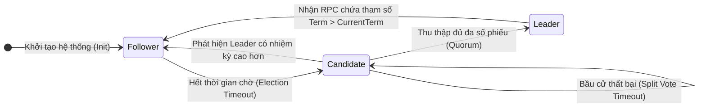
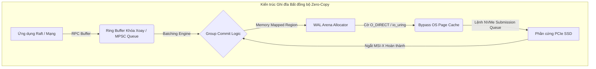

# 25: Thuật toán Đồng thuận Raft: Trái tim của Replication

Trong kỷ nguyên của điện toán đám mây và kiến trúc dữ liệu phân tán quy mô cực lớn (hyperscale distributed systems), việc duy trì tính nhất quán tuyệt đối của trạng thái dữ liệu qua các vùng địa lý cách trở là một trong những bài toán hóc búa nhất của khoa học máy tính. Vấn đề cốt lõi xoay quanh định lý CAP (Consistency, Availability, Partition Tolerance), vốn dĩ đặt ra các giới hạn toán học chặt chẽ về khả năng chịu lỗi của bất kỳ hệ thống phân tán nào. Trong nhiều thập kỷ, thuật toán Paxos do Leslie Lamport công bố đã thống trị nền tảng lý thuyết của sự đồng thuận (consensus), tuy nhiên, bản chất toán học hàn lâm và không gian trạng thái đa chiều cực kỳ khó nắm bắt của Paxos đã tạo ra vô vàn rào cản kỹ thuật trong việc chuyển đổi từ các bài báo khoa học sang mã nguồn phần mềm thực tế. Để phá vỡ điểm nghẽn này, thuật toán Đồng thuận Raft được thiết kế tại Đại học Stanford với triết lý tối thượng là khả năng thấu hiểu (understandability), nhưng không hề đánh đổi sự chặt chẽ của các bằng chứng toán học (formal proofs). Raft tái cấu trúc toàn bộ không gian bài toán bằng cách phân rã hệ thống đồng thuận thành các trục trực giao hoàn toàn tách biệt: quá trình bầu chọn thủ lĩnh (leader election), quá trình sao chép và nhân bản nhật ký (log replication), cơ chế đảm bảo tính an toàn cực đoan (safety properties), và sự thay đổi cấu trúc liên kết mạng linh hoạt (membership changes). Thuật toán này dựa trên một tiền đề kỹ thuật sắc bén: việc ép buộc dòng dữ liệu lưu chuyển theo một hướng duy nhất (unidirectional data flow) từ một nút được ủy quyền tối cao (thủ lĩnh) đến phần còn lại của cụm, triệt tiêu hoàn toàn sự cần thiết của việc đàm tương tác đa chiều và giải quyết xung đột (conflict resolution) ngang hàng trong giai đoạn sao chép. Sự lựa chọn thiết kế này thiết lập một nền tảng vững chắc để triển khai các cỗ máy trạng thái sao chép (Replicated State Machines - RSM) sở hữu khả năng chịu lỗi sụp đổ (crash-fault tolerance) mạnh mẽ, cung cấp tính nhất quán tuyến tính (linearizability) nghiêm ngặt cho những hệ thống cơ sở dữ liệu phân tán khổng lồ hiện đại, đóng vai trò như một trái tim cơ khí không bao giờ ngừng đập để bơm dữ liệu an toàn đến mọi góc khuất của kiến trúc đám mây.

## Nền tảng Lý thuyết và Đặc tả Toán học của Đồng thuận Raft

Về mặt hình thức học và đặc tả toán học, cụm Raft được mô hình hóa như một tập hợp cấu trúc rời rạc gồm các nút mạng $S = \{S_1, S_2, \dots, S_n\}$, trong đó kích thước của quần thể $n$ được xác định cẩn trọng thông qua công thức đại số $n = 2f + 1$, cho phép hệ thống duy trì tính liveness (sức sống) dưới điều kiện tồn tại song song tối đa $f$ lỗi sụp đổ không đồng bộ (asynchronous crash failures). Không gian thời gian logic của toàn bộ cụm không trôi đi theo hệ quy chiếu thời gian vật lý (wall-clock time) mà được phân chia thành các lượng tử thời gian rời rạc, gia tăng đơn điệu được gọi là các nhiệm kỳ (terms), ký hiệu tập hợp là $T \in \mathbb{N}$. Nhiệm kỳ đóng vai trò như một đồng hồ logic toàn cục (global logical clock), giúp phát hiện các thông tin lỗi thời và giải quyết mọi tranh chấp toán học một cách dứt khoát. Trong mỗi sát na thực thi, một nút cụ thể $S_i$ chỉ được phép tồn tại trong một tập hợp trạng thái chuyển đổi hữu hạn có điều kiện (Finite State Machine), được biểu diễn toán học là $State(S_i) \in \{Follower, Candidate, Leader\}$. Chuỗi xích Markov điều khiển sự tiến hóa của các trạng thái này bị chi phối bởi hàm đếm ngược ngẫu nhiên và việc xử lý bất đồng bộ các tín hiệu gọi hàm từ xa (RPC).



Đỉnh cao của sự phức tạp toán học trong Raft nằm ở sự vận hành của cơ chế túc số (quorum). Theo nguyên lý Dirichlet (Pigeonhole Principle), khi yêu cầu hai túc số bất kỳ $Q_1, Q_2 \subset S$ đều phải chứa đa số các nút (tức là $|Q_i| > \frac{n}{2}$), sự giao thoa của chúng luôn tồn tại một phần tử chung: $Q_1 \cap Q_2 \neq \emptyset$. Sự giao nhau bắt buộc này đảm bảo rằng không thể tồn tại hai thủ lĩnh được bầu chọn hợp lệ trong cùng một nhiệm kỳ, qua đó thỏa mãn một trong các tiên đề tối thượng của hệ thống: Tính an toàn bầu cử (Election Safety). Tuy nhiên, khi hệ thống trải qua sự nhiễu loạn từ sự phân mảnh mạng (network partitions), hiện tượng phân chia phiếu bầu (split votes) có thể phá hủy hoàn toàn tính liveness. Để phá vỡ các chu kỳ bế tắc lặp lại vô tận, Raft thiết kế một hệ thống phá vỡ tính đối xứng (symmetry breaking) dựa trên phân phối xác suất ngẫu nhiên liên tục. Thời gian chờ trước khi kích hoạt một cuộc bầu cử mới (election timeout) của mỗi nút được rút ngẫu nhiên từ một hàm phân phối đều đặn $T_{election} \sim \mathcal{U}(T_{min}, T_{max})$. Gọi $T_b$ là thời gian phát sóng mạng trung bình (broadcast time) và $MTBF$ là khoảng thời gian trung bình giữa các sự cố phần cứng cục bộ. Sự tồn tại của thuật toán và khả năng phục hồi được gói gọn trong bất đẳng thức kinh điển: $T_b \ll T_{election} \ll MTBF$. Nếu hằng số $\Delta T = T_{max} - T_{min}$ được chọn quá hẹp so với hệ số phân tán của độ trễ mạng (network jitter), xác suất xảy ra xung đột đồng thời sẽ phân kỳ theo tiệm cận $\mathbb{P}(Collision) \approx \frac{n \times T_b}{\Delta T}$. Điều này đòi hỏi kỹ sư hệ thống phải áp dụng các bộ lọc Kalman hoặc các thuật toán học máy phân tích chuỗi thời gian để tự động tinh chỉnh (auto-tuning) các giới hạn dải thời gian này nhằm tối ưu hóa liên tục xác suất thành công của mỗi vòng bầu cử.

Đi sâu hơn vào cấu trúc dữ liệu, Đặc tính Khớp Nhật ký (Log Matching Property) thiết lập một định lý vững chắc nhằm đảm bảo trạng thái máy nhân bản sẽ không bao giờ sai lệch. Xét $L_i$ là không gian vectơ nhật ký cục bộ tại nút $S_i$, trong đó mỗi nguyên tố (entry) $e \in L_i$ là một bộ ba $(index, term, command)$. Định lý toán học chỉ ra rằng đối với mọi cặp nút $S_i, S_j$ và mọi chỉ số không gian $k$, nếu các mục nhập chia sẻ cùng một chỉ số và nhiệm kỳ ($L_i[k].term == L_j[k].term$), thì mọi tiền tố cấu trúc của chúng phải đồng nhất tuyệt đối: $\forall m \le k, L_i[m] == L_j[m]$. Quá trình quy nạp này được thực thi cực đoan tại tầng vi xử lý thông qua mạng lưới thông điệp AppendEntries RPC. Khi phát đi mệnh lệnh, thủ lĩnh đính kèm tọa độ của mục nhập liền kề trước đó ($prevLogIndex$, $prevLogTerm$). Bộ máy logic tại nút theo dõi (Follower) thực thi phép kiểm chứng ràng buộc này; nếu phát hiện sự phân kỳ (divergence) do mạng chập chờn gây ra mất mát gói tin, Follower sẽ kịch liệt từ chối. Lệnh từ chối này kích hoạt một vòng lặp điều chỉnh suy giảm ngược (backtracking loop) tại bộ nhớ của thủ lĩnh, buộc thủ lĩnh phải đẩy lùi điểm đánh dấu $nextIndex[S_i]$ lặp đi lặp lại về quá khứ cho đến khi giao điểm đồng thuận toán học được tìm thấy, sau đó bắt đầu nghiền nát (overwrite) các mục nhập dị biệt và đồng bộ hóa khôi phục toàn bộ trạng thái chuẩn của hệ thống phân tán.

Sự phức tạp của cấu trúc liên kết mạng còn bùng nổ khi áp dụng lý thuyết Đồng thuận Kết hợp (Joint Consensus) để thay đổi số lượng máy chủ (cluster membership) mà không phải làm gián đoạn các luồng dịch vụ. Khi cụm tiến hành nâng cấp từ một ma trận cấu hình $C_{old}$ sang $C_{new}$, bất kỳ quá trình chuyển đổi trạng thái phi nguyên tử (non-atomic transition) nào cũng có thể tạo ra kịch bản ác mộng nơi hai nút khác nhau cùng đạt được túc số đa số trên hai phiên bản cấu hình khác nhau, dẫn đến hai thủ lĩnh đồng song song (split-brain). Raft hóa giải nghịch lý này bằng một cấu hình trung gian toán học $C_{old,new}$, nơi mà mọi quy tắc quyết định phải thỏa mãn phép giao túc số song phương: $Quorum_{joint} = Quorum(C_{old}) \cap Quorum(C_{new})$. Chỉ khi toàn bộ thông lượng ghi log đã cam kết chặt chẽ sự hiện diện của cấu hình đa thức này, thủ lĩnh mới có quyền hạn hợp pháp để thu nhỏ không gian quyết định về $C_{new}$, bảo toàn thuộc tính Safety trong môi trường topology biến đổi dị hướng. Hơn thế nữa, để ngăn chặn hiện tượng phá hủy thủ lĩnh do các nút bị cô lập vô tình đánh thức (disruptive servers), hệ thống bổ sung thuật toán Pre-Vote. Một nút Candidate cô lập sẽ phải đi xin tín nhiệm giả (Pre-Vote quorum) ở nhiệm kỳ hiện tại; chỉ khi nào lưới mạng vật lý chứng minh được nút này có thể tiếp cận đa số, nó mới được phép bước qua ranh giới toán học để gia tăng biến số $currentTerm$, triệt tiêu hoàn toàn các làn sóng xung kích gây nhiễu loạn thời gian logic của toàn cụm và đảm bảo sự tĩnh lặng kiến trúc (architectural quiescence).

## Vi kiến trúc Thực thi và Quản lý Bộ nhớ Hệ điều hành trong Raft

Mặc dù bề mặt toán học của Raft rất hoàn mỹ, việc ánh xạ thuật toán này xuống vi kiến trúc phần cứng máy tính và tầng hệ điều hành là một cuộc chiến khốc liệt chống lại các định luật vật lý về độ trễ, băng thông, và thiết kế phân cấp bộ nhớ. Để duy trì tính Durable (bền bỉ) trong nguyên lý ACID, một tác nhân Raft phải bảo đảm rằng không gian biến số $currentTerm$, $votedFor$, và nội dung của hàm băm $log$ phải được ghi vĩnh viễn vào phương tiện lưu trữ bất biến (như NVMe SSDs) trước khi phát ra bất kỳ tín hiệu xác nhận RPC nào. Trọng tâm của quá trình này xoay quanh cơ chế Write-Ahead Logging (WAL). Trong kiến trúc Linux kernel tiêu chuẩn, việc gọi hàm $write()$ hoặc tương tác với Virtual File System (VFS) chỉ đơn thuần là đẩy luồng byte vào vùng đệm RAM của hạt nhân (Page Cache). Trong trường hợp xảy ra lỗi NMI (Non-Maskable Interrupt) dẫn đến Kernel Panic hoặc sập nguồn điện vật lý, các khối dữ liệu (dirty pages) chưa được xả xuống ổ cứng sẽ bốc hơi vĩnh viễn, phá hủy hoàn toàn bằng chứng toán học của Raft. Do đó, nút Raft bị ép buộc phải gọi hàm hệ thống $fsync()$ hoặc $fdatasync()$ để đâm xuyên qua hệ thống phân cấp cache, ra lệnh cho bộ vi điều khiển (controller) của đĩa SSD di chuyển các khối dữ liệu SRAM tạm thời vào trong các tế bào flash NAND bền vững. Quá trình này, ngay cả trên giao tiếp PCIe Gen 5 siêu tốc, vẫn phát sinh một khoản chi phí độ trễ cứng (static delay) tính bằng hàng chục micro-giây, thiết lập nên một rào cản thông lượng tuyệt đối cho thuật toán đồng thuận.

```rust
// Đoạn mã giả Rust: Vi kiến trúc Zero-Copy và Bất đồng bộ trong lõi Raft
#[repr(align(64))]
pub struct RaftCore<SM: StateMachine> {
    current_term: AtomicU64,
    commit_index: AtomicU64,
    wal_store: Arc<DirectIoWalEngine>, // Tối ưu O_DIRECT bypass Page Cache
    state_machine: Arc<SM>,
}

impl<SM: StateMachine> RaftCore<SM> {
    pub async fn process_append_entries_async(
        &mut self, 
        req: AppendEntriesRequest
    ) -> Result<AppendEntriesResponse, SystemError> {
        let term_snapshot = self.current_term.load(Ordering::Acquire);
        if req.term < term_snapshot {
            return Ok(AppendEntriesResponse { term: term_snapshot, success: false });
        }
        
        // Sử dụng io_uring cho Zero-copy DMA từ kernel tới ổ NVMe vật lý
        self.wal_store.async_truncate_and_append(
            req.prev_log_index + 1, 
            &req.entries
        ).await?;
        
        let local_commit = self.commit_index.load(Ordering::Acquire);
        if req.leader_commit > local_commit {
            let max_persisted = self.wal_store.get_last_index(Ordering::Acquire);
            let next_commit = std::cmp::min(req.leader_commit, max_persisted);
            
            // Memory barrier Release chống đảo lộn trật tự thực thi (OoOE)
            self.commit_index.store(next_commit, Ordering::Release);
            self.state_machine.trigger_background_apply(next_commit);
        }
        
        Ok(AppendEntriesResponse { term: req.term, success: true })
    }
}
```

Để né tránh các rào cản vật lý này, các hệ quản trị cơ sở dữ liệu vĩ đại như TiKV (bằng Rust) hoặc etcd (bằng Go) từ chối triệt để phương thức I/O truyền thống. Kỹ thuật Group Commit (cam kết theo nhóm) được ứng dụng ở cường độ cao: các nút Raft tận dụng các cấu trúc hàng đợi gửi đa chiều không cần khóa (lock-free Multi-Producer Single-Consumer - MPSC queues), thu thập hàng vạn bản ghi nhật ký song song đến từ vô số luồng mạng (network threads) và nhồi nhét chúng vào một vòng đời xả (flush cycle) duy nhất. Thay vì thực hiện 10,000 lệnh $fsync()$ đắt đỏ, lõi I/O chỉ gọi một thao tác hạ tầng duy nhất, khấu hao (amortize) chi phí trễ thời gian hệ thống một cách hiệu quả theo phương trình bậc nhất $\lim_{batch \to \infty} \frac{Latency_{sync}}{batch} \approx 0$. Không dừng lại ở đó, nhân đồ họa bộ nhớ nâng cao được triển khai thông qua các cờ $O\_DIRECT$ hoặc bằng các hàm bản địa thế hệ mới như $io\_uring$ của Linux. $io\_uring$ chia sẻ các mảng vòng (ring arrays) cho Submission Queue và Completion Queue trực tiếp giữa không gian người dùng (User Space) và không gian hạt nhân (Kernel Space) mà không đòi hỏi bất kỳ lời gọi hệ thống (system call) gây lãng phí chu kỳ CPU nào. Dữ liệu từ vùng nhớ RAM (RAM Pinned Memory) được thực hiện DMA (Direct Memory Access) lao thẳng vào bộ điều khiển lưu trữ vật lý mà không cần phải thực hiện những bản sao ảo đắt đỏ thông qua Page Cache, đạt được cảnh giới Zero-Copy I/O tuyệt đối.



Chưa dừng lại ở đó, hiện tượng phân mảnh bộ nhớ (Memory Fragmentation) và các chu kỳ Dọn rác (Garbage Collection STW pauses) trong quá trình cấp phát vùng nhớ đồ sộ để lưu trữ log trong RAM sẽ gây ra thảm họa thắt cổ chai về hiệu suất. Một cú tạm dừng STW kéo dài $50ms$ trong một runtime của Golang hay Java có thể vượt quá tham số $T_{election}$, ngay lập tức gây kích hoạt nhầm cơ chế bầu cử thủ lĩnh (false election), hủy diệt sự ổn định của cụm phân tán. Đó là lý do C++ và Rust chiếm ưu thế tuyệt đối trong việc lập trình lõi Raft tối ưu. Chúng sử dụng các Arena Allocators tiên tiến, phân bổ trước (pre-allocating) một ma trận không gian nhớ liền kề khổng lồ (slab arrays) ngay lúc khởi động, sử dụng các lời gọi mmap tích hợp HugeTLB ($2MB$ hoặc $1GB$ page sizes). Chiến thuật cực đoan này tối đa hóa tỷ lệ trúng (hit rate) trong bộ đệm TLB (Translation Lookaside Buffer) của CPU, triệt tiêu mọi rủi ro nảy sinh lỗi vắng mặt trang bộ nhớ (Page Faults) trong suốt quá trình hoạt động cường độ cao. Song song với việc duy trì nhật ký tuyến tính, hệ thống lưu trữ cũng phải giải quyết bài toán nén dữ liệu (Log Compaction) nhằm ngăn chặn việc bùng nổ vô hạn của ổ cứng. Quá trình tạo điểm lấy nét cục bộ (Snapshotting) một cỗ máy trạng thái khổng lồ (vài trăm Gigabytes) mà không làm ngắt nghẽn hoạt động của Raft là một kiệt tác vi xử lý khác. Các kiến trúc sư thường tận dụng lệnh gọi $fork()$ của Unix POSIX để tạo ra một bản sao không gian nhớ sử dụng ngữ nghĩa Copy-On-Write (CoW) của MMU (Memory Management Unit), hoặc ủy thác (delegate) hoàn toàn vấn đề này cho các công cụ lưu trữ Log-Structured Merge-tree (LSM-tree) tối ưu không thể biến đổi (immutable) như RocksDB, cho phép sao lưu đĩa chạy ngầm ở chế độ background một cách vô hình đối với cụm thuật toán đồng thuận.

## Các Giới hạn Phần cứng và Tối ưu hóa Hiệu suất Ở mức Thấp

Sức mạnh tổng thể của thuật toán Raft bị định đoạt bởi sự khắc nghiệt của Định luật Little và các phương trình lý thuyết xếp hàng (Queueing Theory M/M/1). Trong một trung tâm dữ liệu vĩ mô, thông lượng hệ thống sao chép $\Phi_{max}$ luôn bị khống chế cứng nhắc bởi tích số Băng thông-Độ trễ (Bandwidth-Delay Product - BDP). Nếu thủ lĩnh gửi một lệnh AppendEntries RPC, nó không thể gửi tiếp lệnh khác nếu không nhận được ít nhất túc số các xác nhận ACK quay trở lại, đồng nghĩa với việc thông lượng tối đa hội tụ về phương trình giới hạn $\Phi \le \frac{WindowSize}{RTT \times QuorumSize}$. Ở những hệ thống phân tán xuyên lục địa với chỉ số RTT lên tới hàng chục mili-giây, cơ chế đồng bộ tĩnh đơn giản sẽ làm tê liệt toàn bộ kiến trúc lõi viễn thông, bỏ phí hàng terabit băng thông quang học. Để vô hiệu hóa định luật toán học khắc nghiệt này, cơ chế Pipelining (đường ống) khổng lồ được kích hoạt; vị thủ lĩnh phải duy trì hàng ngàn thông điệp bay lượn song song trên đường truyền vật lý, dựa dẫm vào các trường điều khiển trượt (sliding windows) cực sâu trong ngăn xếp TCP để duy trì sự bão hòa liên kết. Tuy nhiên, việc tăng cường Pipelining lại làm phức tạp hóa kịch bản các gói tin bị đánh rớt (Packet Loss) do lỗi phần cứng router mạng, gây nên hiện tượng nghẽn mạng đầu dòng (Head of Line Blocking) tại hệ thống phân giải socket, phá vỡ trình tự tuyến tính mà Đặc tính Khớp Nhật ký (Log Matching) cấu thành cốt lõi thuật toán. Thiết kế Raft đương đại giải quyết bài toán này bằng cách duy trì độc lập các máy trạng thái mảng $nextIndex$ biến thiên riêng lẻ trên nút thủ lĩnh, sử dụng các chuỗi toán học suy giảm bậc nhất (linear decrementing) hay thậm chí dò tìm nhị phân (binary search) xuyên qua các tập hợp nhiệm kỳ mâu thuẫn để vá lỗi một cách bất đồng bộ với tốc độ tiến triển tiệm cận nhanh nhất có thể.

Khi đẩy ngưỡng giới hạn truy xuất dữ liệu vào cảnh giới hàng triệu yêu cầu mỗi giây (Millions of IOPS), nhân hệ điều hành Linux nguyên bản lại trở thành rào cản chí mạng tiếp theo. Các cấu trúc mạng TCP/IP thông thường dựa trên các lệnh `recv()` hay `send()` tạo ra hằng hà sa số các ngắt phần cứng (Hardware IRQs) và bắt ép CPU thực thi quá trình lưu trữ ngữ cảnh chuyển đổi (context switching) cực kỳ lãng phí. Những dự án khung phát triển mang tính cách mạng như SPDK (Storage Performance Development Kit) và DPDK (Data Plane Development Kit) được đưa vào tích hợp sâu sát vào nền tảng mã, cho phép không gian ứng dụng người dùng chiếm quyền quản lý trực tiếp bộ điều khiển vật lý của card mạng (Network Interface Card - NIC) mà không cần giao tiếp qua VFS. Giao thức RDMA (Remote Direct Memory Access) thông qua chuẩn InfiniBand hoặc RoCEv2 (RDMA over Converged Ethernet) hoạt động với một phương thức tàn nhẫn hơn rất nhiều: phần cứng mạng NIC trên máy chủ của thủ lĩnh sẽ đọc trực tiếp dữ liệu log Raft từ RAM cục bộ thông qua PCIe, tự động mã hóa và truyền tải qua cáp quang, sau đó kích hoạt thao tác DMA nguyên thủy để đập thẳng khối bit nhị phân vào một vùng nhớ RAM đã ghim sẵn (pinned block) tại nút Follower một cách vô hình. Bộ vi xử lý trung tâm (CPU) tại nút Follower hoàn toàn mù tịt về tiến trình can thiệp này cho đến khi toàn bộ khối lượng dữ liệu đã nằm gọn gàng một cách hoàn hảo trong bộ đệm L3 Cache của chip silicon. Mức độ can thiệp bỏ qua nhân (Kernel Bypass) triệt để này giải phóng hoàn toàn luồng lệnh CPU khỏi việc tính toán tổng kiểm tra TCP/IP, giảm thiểu chu kỳ định tuyến cấu trúc và cấp phát bộ đệm socket động, đánh sập ngưỡng trễ mạng vòng (RTT) xuống dưới mức $1$ micro-giây trong kiến trúc lưới siêu hội tụ liên kết trong cùng một ngăn tủ (rack scale architecture).

Ở một phạm vi vi mô sâu thẳm bên trong chính thiết kế vi xử lý Silicon (CPU Core Layout), cuộc đụng độ của Raft diễn ra mãnh liệt xung quanh trạng thái chia sẻ của các bộ nhớ đệm đa cấp bậc (Cache Coherency) và hiện tượng Chia sẻ Sai tàn khốc (False Sharing). Việc cập nhật song song liên tục một biến số định vị trung tâm toàn cục như $commitIndex$ giữa hàng trăm luồng mạng song song (worker threads) đòi hỏi việc sử dụng các chốt khóa bảo vệ ngặt nghèo (Spinlocks hoặc Compare-And-Swap Mutexes). Nếu các biên giới cấu trúc dữ liệu trạng thái trong không gian bộ nhớ không được căn chỉnh một cách hoàn hảo theo chuẩn biên $64-byte$ vật lý của một đường cache chuẩn mực x86_64, các lõi xử lý sẽ rơi vào một cạm bẫy liên tục phát tín hiệu vô hiệu hóa đường dẫn bộ nhớ lẫn nhau thông qua hệ thống giao thức vòng kín MESI (Modified, Exclusive, Shared, Invalid protocol), dẫn đến hiện tượng trượt nhịp xung nhịp nghiêm trọng. Để thoát khỏi thảm họa này, các nhà lập trình áp dụng thủ pháp đệm rỗng (directive padding), chẳng hạn như cấu trúc ngữ pháp `#[repr(align(64))]` cực đoan trong Rust, đảm bảo mỗi lõi CPU độc chiếm và phong tỏa một đường cache vô hình riêng biệt cho các phép toán atomic. Thêm vào đó, việc tính toán đa thức toán học tổng kiểm tra (checksum) toàn vẹn CRC32C, một tác vụ vô cùng cực nhọc đối với thuật toán băm dữ liệu byte nối tiếp, được giải thoát dứt điểm bằng cách triệu gọi khẩn cấp các tập lệnh vi mã (microcode instructions) mã hóa phần cứng cực rộng. Mã nguồn tầng cực thấp sẽ trích xuất sức mạnh từ tập lệnh Vector $SSE4.2$ (chỉ thị Hardware `crc32`) hoặc bung mở các thanh ghi vector đồ sộ $AVX-512$ để tiêu hóa, nội suy song song hàng gigabyte dữ liệu đa thức mật mã mỗi giây, đảm bảo rằng việc duy trì toàn vẹn dữ liệu từ đĩa vật lý sẽ không bao giờ tước đoạt số chu kỳ xung nhịp quý giá cốt tủy của luồng Raft trung tâm. Về mặt ngữ nghĩa hàng rào cấu trúc bộ nhớ (Memory Ordering Semantics), việc thiết kế kiến trúc Raft hoàn toàn Lock-free trong các ngôn ngữ lập trình hệ thống tối tân bắt buộc các kỹ sư hệ thống phải tự tay điều hướng tỉ mỉ các thứ tự thực thi bị đảo lộn hỗn loạn (Out-Of-Order Execution pipelines) của chip silicon hiện đại. Bằng cách thiết lập tường lửa cấp mã máy `std::sync::atomic::Ordering::Acquire` và `Ordering::Release`, kiến trúc sư Raft có thể xây dựng các cấu trúc nguyên tử phi trạng thái, vượt mặt các cơ chế rào chắn `SeqCst` cồng kềnh, tối ưu hóa đến giới hạn tuyệt đối cấu trúc đường ống siêu phân luồng (superscalar pipeline architecture) của vi xử lý x86_64 hoặc ARM64.

## Kiến trúc Mở rộng: Multi-Raft và Phân mảnh Cấu trúc Liên kết Dữ liệu

Vượt lên trên toàn bộ những đột phá về tối ưu hóa mạch bán dẫn phần cứng và can thiệp sâu sắc vào hệ điều hành, thuật toán Raft nguyên bản không được thiết kế vẫn tồn tại một nhược điểm chí mạng về mặt cấu trúc luận ở bình diện vĩ mô: vị thủ lĩnh đắc cử luôn trở thành một điểm nút thắt nghẽn cổ chai duy nhất không thể né tránh (Single Point of Bottleneck). Bất kể siêu máy chủ vật lý (bare-metal server) được cấp phát cấu hình vô tiền khoáng hậu đến mức nào, năng lực điện toán tuần tự, băng thông bộ nhớ RAM nội bộ, và dung lượng thẻ mạng của một nút duy nhất luôn bị áp bức bởi đường tiệm cận vật lý của giới hạn phần cứng trục dọc (Scale-up Walls). Trong một khung thời gian cụ thể, khi vị thủ lĩnh thiêu đốt cạn kiệt đến từng gigabit tài nguyên mạng NIC và năng lượng tản nhiệt xử lý CPU chỉ để phân phát gói tin sao chép nhật ký, các hệ thống Follower chịu tang lại thường xuyên chìm đắm trong trạng thái thụ động nhàn rỗi (idle latency) và làm lãng phí hàng trăm lõi điện toán không được khai thác tối đa tiềm năng. Để phá vỡ định lý bất khả thi này và đạt tới cảnh giới mở rộng thông lượng theo hệ số tuyến tính (Linear Scale-out) của các dự án điện toán khổng lồ lưu trữ hành tinh như Spanner do Google thai nghén hay TiKV, khái niệm vi kiến trúc Multi-Raft đã được kết tinh như một quy luật tiến hóa sống còn tất yếu của ngành khoa học cơ sở dữ liệu. Toàn bộ vũ trụ không gian dữ liệu lưu trữ không còn được dung thứ dưới một hình thể nguyên khối (monolithic space) thô kệch, mà thay vào đó sẽ bị cưa xẻ, băm nhuyễn thành những miền định tuyến liên kết từ khóa (Key-Range Sharding) siêu vi mô gọi là các Vùng mảnh (Regions) hoặc Phạm vi (Ranges), trong đó mỗi phân vùng lưu trữ bị khống chế dung lượng nghiêm ngặt ở ngưỡng giới hạn chặt chẽ $96MB$ hoặc tối đa $128MB$.

Bên trong hệ sinh thái phi tuyến này, mỗi Region nhỏ bé lẻ loi đóng vai trò và vận hành tự thân như một nhóm Raft đồng thuận khép kín hoàn hảo tuyệt đối, bảo lưu cho riêng mình một bộ luật lệ độc lập, một đồng hồ đếm nhịp nhiệm kỳ tự trị hoàn toàn và lưu giữ một bộ máy cấu trúc trạng thái riêng rẽ. Thông qua phương thức luận này, hàng vạn cho đến hàng triệu nhóm thuật toán Raft tí hon phân mảng sẽ cùng sinh sôi và nảy nở đồng thời trên cùng một cơ sở hạ tầng mạng lưới hệ thống siêu máy tính (supercomputing cluster). Một máy chủ vật lý (node) đồ sộ có năng lực phân cực đồng thời đóng vai trò là một Thủ lĩnh thống trị kiêu hãnh cho hàng chục nghìn Region độc lập khác nhau, đồng thời vẫn khiêm nhường nhập vai Follower tuân thủ pháp luật cho vô vàn Region lân cận được dẫn dắt bởi các máy chủ khác. Trạng thái ma trận phân mảnh cực đoan và đa chiều này tự động xé lẻ và rải đều mọi khối lượng áp lực truy vấn I/O tải công việc (workloads), tạo nên một sự tĩnh lặng cân bằng tĩnh học và động học (static/dynamic load balancing) hoàn mỹ giải tỏa triệt để áp lực phần cứng lên toàn bộ tiết diện diện tích hệ thống cụm mạng, mở tung cánh cửa khai phá một nền tảng sức mạnh xử lý giao dịch song song siêu thực vượt mức tưởng tượng. Tuy nhiên, kiến trúc phân tán siêu phân giải này ngay lập tức sinh ra một ma trận ác mộng cực độ về khoa học truyền thông định tuyến. Bức tranh hàng triệu cụm Raft đập nhịp tim Heartbeat một cách mù quáng qua môi trường chuyển mạch Ethernet cục bộ sẽ tạo ra xung kích kích hoạt ngay lập tức các thảm họa bão hòa gói tin Broadcast khổng lồ (Network Broadcast Storms), đủ sức làm nổ tung bộ nhớ đệm và đánh sập cấu hình các thiết bị chuyển mạch lõi (core switches). Biện pháp phòng thủ sinh tồn tối ưu bắt buộc đội ngũ kỹ sư phải mã hóa và triển khai các hệ thống Ảo hóa Bộ đệm Nhắn tin Lõi (Message Batching Pipelines và Super-Packets Multiplexing): thuật toán sẽ gom tụ kết dính hàng trăm ngàn xung nhịp tim logic nhỏ lẻ yếu ớt của các cụm Raft phi tập trung thành một cấu trúc siêu gói truyền dẫn TCP/IP khổng lồ duy nhất trước khi phun chúng qua đường truyền dẫn sợi quang học, qua đó làm giảm nhẹ hệ số suy hao do độ nhiễu loạn băng thông (bandwidth congestion overhead) đi hàng vạn lần.

Khép lại cấu trúc vòng tròn hoàn mỹ của Raft, một tổ hợp đa kiến trúc phân tán khổng lồ như vậy hoàn toàn không thể duy trì sinh khí hoạt động ổn định và nhất quán nếu vắng bóng một trung tâm thần kinh trung ương kiểm soát tọa độ không gian tổng thể. Một kiến trúc Giám sát Phân bổ Vị trí tự động (Placement Driver - PD Oracle) được nhúng sâu vào lõi sử dụng các mô hình hệ thống học tập củng cố nhân tạo (Reinforcement Learning Models) và các mạng đồn thổi thông tin cục bộ (Gossip Protocols Routing) để hấp thụ và thu thập toàn cảnh trạng thái sống còn của vô vàn các cụm Raft nhỏ lẻ rải rác trên bản đồ mạng. Phân tích dựa trên các tham số telemetry chỉ số nhiệt học phát ra từ khối lượng đĩa IO vật lý và luồng CPU đang phải gánh chịu tải trọng truy xuất cực lớn, PD não bộ sẽ tự động ban hành chuỗi lệnh điều phối Di cư Thủ lĩnh (Transfer Leader Command) - một mệnh lệnh Raft nâng cao tối thượng tước đoạt quyền lực thủ lĩnh của một điểm nghẽn một cách trật tự có kiểm soát, hoặc cưỡng bức kích hoạt thuyên chuyển toàn bộ khối dữ liệu cục bộ giữa các cụm ổ cứng lân cận lạnh hơn. Hệ thống này vĩnh viễn thổi hồn mang lại sự đàn hồi liên kết siêu việt kỳ diệu và khai sinh ra một năng lực kiến trúc cơ khí tự phục hồi thông minh (Intelligent Self-Healing), đảm bảo cho sự thống trị không có điểm dừng của các trung tâm dữ liệu khổng lồ trên nền tảng đám mây vĩnh cửu toàn cầu.

## SEO Tối ưu hóa: Thuật toán Đồng thuận Raft Cơ bản đến Chuyên sâu
* Từ khóa chính: Thuật toán Raft, Hệ thống phân tán, Raft Consensus Algorithm, Replicated State Machine, Write-Ahead Logging, Tối ưu hóa hiệu suất Raft, Bầu chọn thủ lĩnh (Leader Election).
* Từ khóa mở rộng: Định lý CAP, Cơ chế Group Commit, Bypass hệ điều hành (O_DIRECT, io_uring, RDMA, DPDK), Kiến trúc Multi-Raft, TiKV, CockroachDB, Toán học hệ thống phân tán, Lỗi sụp đổ không đồng bộ.
* Tóm tắt bài viết: Bài báo cáo khoa học kỹ thuật siêu cấp này phân tích vi kiến trúc chuyên sâu của thuật toán đồng thuận Raft, bắt đầu từ các nguyên lý toán học nền tảng, mô hình không gian chuỗi xích (Markov chains), chứng minh toán học của quá trình bầu cử và sự phức tạp của cơ chế Joint Consensus. Đặc biệt, tài liệu mổ xẻ quản lý bộ nhớ ở tầng nhân hệ điều hành (Write-Ahead Logging WAL, vùng nhớ mmap, xử lý Zero-copy qua io_uring). Tài liệu còn đi sâu vào đánh giá các điểm nghẽn hiệu suất phần cứng (ổ đĩa I/O NVMe, Network RTT, BDP, định tuyến giao thức NUMA cache) và trình bày phương thức thiết kế mở rộng phi tuyến tính tiên tiến nhất bằng kiến trúc Multi-Raft sharding đa không gian ứng dụng thực tiễn trong ngành công nghiệp hiện nay.
