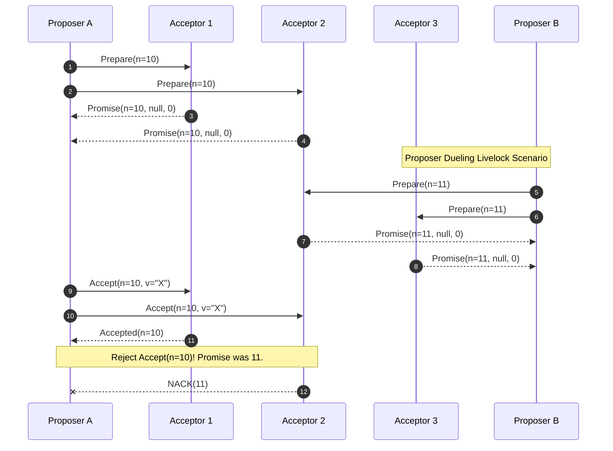

# Paxos vs. Raft: The Difference Between Academic Theory and Practical Implementation

If you've spent any time building or operating a distributed database, you've run into the consensus problem — how do independent machines agree on a single value when the network is unreliable and any of them might crash mid-conversation? The two algorithms most engineers reach for are Paxos and Raft, and comparing Paxos vs Raft is really a study in two opposite design instincts. Both exist to keep a replicated state machine consistent, but one was built by a mathematician who didn't much care whether anyone could follow the proof, and the other was built specifically because nobody could.

This post digs into that split: Paxos, which optimizes for flexibility, decentralization, and mathematical elegance, versus Raft, which optimizes for a single authoritative leader and for being teachable to a room full of engineering students.

**The problem itself:** how can nodes agree on a value or a sequence of commands when messages get dropped, delayed, or nodes crash outright? The FLP theorem (Fischer, Lynch, Paterson) tells us something uncomfortable: no deterministic algorithm can guarantee both Safety and Liveness in a fully asynchronous network if even one node can fail. Real systems dodge this by leaning on randomness and assuming partial synchrony — the network usually behaves, even if it can't be relied on to behave. Paxos and Raft are two different answers to the same dodge.

**What actually matters here, in three points:**
1. **Theory vs. practice.** Paxos is mathematically airtight but famously painful to implement correctly. Raft's whole pitch is that understandability, treated as a first-class design goal, produces systems that are more stable in production — not just easier to explain in a paper.
2. **Structural trade-offs.** Paxos allows out-of-order commits, which avoids head-of-line blocking but complicates recovery after a failure. Raft forces strictly sequential writes, giving up some throughput for a system that's much easier to reason about.
3. **Split-brain and term inflation.** Both algorithms lean on quorum intersection to stay safe. Raft, though, has a specific failure mode during network partitions — an isolated node inflating its term number — that needs a bolted-on fix (Pre-Vote) to close.

---

## Theoretical Foundations of Distributed Consensus

### 1 The FLP Theorem and Quorum Intersection

Everything in this article rests on one mathematical property: quorum intersection. If you understand why it holds, you understand why both Paxos and Raft are safe.

A quorum $\mathbb{Q}$ is usually a bare majority out of $N = 2F + 1$ nodes, where $F$ is the maximum number of failed nodes the system can tolerate and still function.

The intersection property is stated formally as:
$$ \forall Q_1, Q_2 \in \mathbb{Q}, Q_1 \cap Q_2 \neq \emptyset $$

In plain terms: any two majority groups drawn from the same set of nodes must share at least one member. That shared node acts as a witness — it remembers what was decided, and its presence in every subsequent quorum prevents the system from ratifying two contradictory decisions in the same round. This single fact is the safety backbone both Paxos and Raft build on top of.

---

## Anatomy of the Paxos Algorithm: Decentralization by Design

Paxos, introduced by Leslie Lamport through the (somewhat tongue-in-cheek) fictional Synod parliament, has no built-in notion of a leader. Instead it splits responsibility across three roles:
- **Proposers:** put forward values for the group to vote on.
- **Acceptors:** act as the system's memory, recording which proposals they've seen and accepted.
- **Learners:** find out what was decided once consensus is reached.

### 1 The Two-Phase Commit Process of Basic Paxos

Reaching consensus in Basic Paxos takes two phases.

**Phase 1 (Prepare): collecting promises**
1. A Proposer picks an identifying number $n$ — unique, and larger than any it has used before — and sends $Prepare(n)$ to a majority of Acceptors.
2. If an Acceptor receives $Prepare(n)$ and $n$ is larger than every proposal number it's seen so far, it replies with $Promise(n, v_a, n_a)$. That promise says: "I won't accept any proposal numbered below $n$ from here on." If it had previously accepted a value $v_a$ under number $n_a$, it attaches that too.

**Phase 2 (Accept): sending the acceptance request**
1. Once the Proposer has collected enough promises to form a quorum, it sends $Accept(n, v)$.
2. Here's the part that trips people up: $v$ isn't chosen freely. It has to be the value tied to the highest $n_a$ among the promises received. Only if every $v_a$ came back empty is the Proposer free to propose a brand-new value of its own.
3. An Acceptor accepts $Accept(n, v)$ only if it hasn't already promised some other proposal with a higher number.

### 2 Why It's Safe: A Quick Inductive Argument

Suppose a value $v$ was already accepted by a quorum of Acceptors under proposal number $n$. We want to show that any later proposal $n' > n$ is forced to carry that same value $v$.

Let $Q_c$ be the quorum that accepted proposal $n$, and $Q_p$ be the quorum that promises proposal $n'$. By quorum intersection, $Q_c \cap Q_p \neq \emptyset$ — there's at least one Acceptor in both sets. That Acceptor remembers $v$ from proposal $n$, and when it replies to $Prepare(n')$, it hands that value back. The new Proposer sees it and is bound to propagate exactly that value. Safety holds, permanently, no matter how many rounds follow.

### 3 The Catch: Livelock and Proposer Dueling

Decentralization has a cost, and in Paxos it shows up as **Proposer Dueling**.

Say Proposer A sends $Prepare(10)$ and the Acceptors agree. Before A can follow up with $Accept(10)$, Proposer B jumps in with $Prepare(11)$. The Acceptors, bound by their own rules, now promise B instead — abandoning A mid-flight. A's $Accept(10)$ gets rejected. A retries with $Prepare(12)$, which can trigger the same thing from B's side, and so on. Neither side ever wins outright. The system stays technically alive but never actually decides anything — a liveness failure, not a safety one.

The standard fixes are exponential backoff between retries, or moving to Multi-Paxos, where a stable leader removes the contention entirely.



---

## Anatomy of the Raft Algorithm: A Single Authority by Design

Raft (Diego Ongaro and John Ousterhout) takes the opposite bet: instead of spreading authority across proposers and acceptors, it commits fully to a strong-leader model.

Raft folds leader election and log replication into one coherent story. Within any given term $T$, there is at most one Leader — full stop.

### 1 Randomized Elections Sidestep Livelock

Where Paxos can end up in Proposer Dueling, Raft avoids the equivalent problem structurally, by randomizing election timeouts so followers don't all wake up and campaign at once.

The probability of a collision — multiple followers timing out and starting a campaign in the same window — can be estimated as:
$$ P(X) = 1 - \prod_{i=1}^{k} (1 - \frac{i-1}{W}) $$
As the randomization window $W$ grows relative to network round-trip time, the odds of two nodes triggering an election simultaneously (a split vote) fall off toward zero. In practice, a window a few multiples of RTT is enough to make split votes rare.

### 2 Leader Completeness

Paxos lets any node propagate data at any time. Raft is stricter: data only ever flows from Leader to Followers, one direction, and a Leader never rewrites or deletes its own log.

Raft also refuses to let a Candidate become Leader unless its log already contains every entry that's been committed. "More up-to-date" is decided lexicographically on the pair $(Term, Index)$:
$$ (T_{last}^A > T_{last}^B) \lor (T_{last}^A = T_{last}^B \land Index_{last}^A > Index_{last}^B) $$
Because of this constraint, a newly elected Raft Leader is guaranteed — not just likely — to already hold everything the previous Leader had. That means it can start serving reads and writes the moment it's elected, with no need to reconcile stale history first, which is exactly the step Multi-Paxos can't skip.

---

## Micro-architecture, OS I/O, and Tail Latency

None of this theory matters much until you run it on real hardware, where memory bandwidth and interrupt handling set the actual limits.

### 1 The fsync Bottleneck

One hard rule governs both algorithms: before a node can ACK a write, that state change has to be durably written to the Write-Ahead Log on disk.

Calling `fsync()` on Linux isn't free. The kernel has to push bytes out of the page cache, through DMA, down to the physical SSD — and each round costs somewhere in the 15–50 microsecond range. Call `fsync` on every single incoming request and you'll cap out at a few thousand IOPS, which is nowhere near enough for a serious workload.

**The fix** both Raft and Multi-Paxos implementations converge on is group commit batching combined with kernel-bypass I/O (`io_uring`, SPDK). The Rust sketch below shows roughly what that looks like in a zero-copy path:

```rust
/// Internal Raft state: shared atomic variables are forced onto separate cache lines.
#[repr(align(64))]
pub struct AtomicRaftState {
    pub current_term: AtomicU64,
    pub commit_index: AtomicU64,
}

pub async fn handle_append_entries_optimized(
    &mut self, 
    request: ZeroCopyAppendEntriesReq<'_>
) -> AppendEntriesResp {
    let current_term = self.state.current_term.load(Ordering::Acquire);
    
    // Safety Property 1: Reject a stale Leader
    if request.term < current_term {
        return AppendEntriesResp { term: current_term, success: false };
    }
    
    // Lock-free term evolution algorithm
    if request.term > current_term {
        self.state.current_term.store(request.term, Ordering::Release);
        self.voted_for.store(0, Ordering::Relaxed);
        // Persist metadata to WAL asynchronously
        self.wal.persist_metadata(request.term, None).await; 
    }
    
    // Cache-line barrier and I/O batching
    let batch_bytes = request.extract_payload_zero_copy();
    self.wal.submit_sqe_write(batch_bytes);
    self.wal.await_cqe_fsync().await; // Yield the thread to others while waiting on disk

    AppendEntriesResp { term: request.term, success: true }
}
```

### 2 The Stop-The-World GC Trap

Systems written in garbage-collected languages like Java or Go carry a quiet risk: a Stop-The-World pause.

A single 200ms GC pause can blow past a node's `election_timeout` window. Followers see silence and conclude, reasonably from their point of view, that the Leader is dead — and trigger an election that didn't need to happen, burning capacity in the process. It's a big part of why systems built for this domain (TiKV, Redpanda) lean on C++ or Rust: manual memory management removes GC pauses as a source of unpredictable latency entirely.

---

## When to Choose Raft, When to Choose Paxos

### 1 Out-of-Order Commits (Multi-Paxos) vs. Strict Linearity (Raft)

**Multi-Paxos (e.g., Google Spanner)**
Multi-Paxos's biggest structural advantage is that it can commit out of order. Since each log slot is effectively its own independent round of consensus, the system can commit slots 10, 11, and 13 even while slot 12 is still waiting on a retransmitted packet. There's no head-of-line blocking. Paired with a mechanism like TrueTime for ordering across regions, this makes Multi-Paxos a strong fit for multi-region, geo-distributed storage.

**Raft (e.g., TiKV, CockroachDB, etcd)**
Raft enforces strict linear order. To commit index $N$, every index from 1 to $N-1$ has to already be committed. Lose packet 12, and the whole pipeline stalls until it's retransmitted and applied.

That's a real throughput cost, but it buys something valuable: a system that's much easier to reason about end to end. Engineers spend far less time debugging edge cases in recovery logic, and that's a large part of why Raft has become the default choice across the open-source cloud-native ecosystem.

### 2 Failure Recovery: Where Paxos Struggles and Raft's Pre-Vote Fix

When a Leader goes down, the two algorithms diverge sharply:
- **Raft:** the newly elected Leader already has a complete, correct log. Recovery is $O(1)$ — there's nothing to reconstruct.
- **Multi-Paxos:** the new Leader has to run Prepare phases across every slot that wasn't fully committed, patching holes one by one. Recovery cost scales as $O(L)$ — slow, and expensive under load.

Raft has its own weak spot, though, and it shows up during network partitions. A Follower cut off from the rest of the cluster keeps failing to hear from the Leader, so it keeps incrementing its own term and trying to get elected — possibly thousands of times before the partition heals. When connectivity comes back, that inflated term number forces the legitimate, functioning Leader to step down, even though nothing was actually wrong with it.

The fix Raft's designers added is a **Pre-Vote** phase. Before bumping its term, an isolated Candidate first asks around: "Does anyone currently see a Leader?" Only if the answer is no does it proceed to increment its term and start a real election. It's a small addition, but it closes the term-inflation problem cleanly.

---

## Conclusion

Raft isn't a step down from Paxos mathematically — it's a deliberate engineering trade, and a good one. Paxos gave us the theoretical grounding for what distributed consensus actually requires; Raft gave working engineers a version of that theory they could actually implement, debug, and trust in production. The real dividing line between Paxos and Raft comes down to this: Paxos's out-of-order flexibility versus Raft's strict linear order. Understanding which trade-off fits your system is a good chunk of what separates someone who's read about consensus from someone who's operated it.

---
