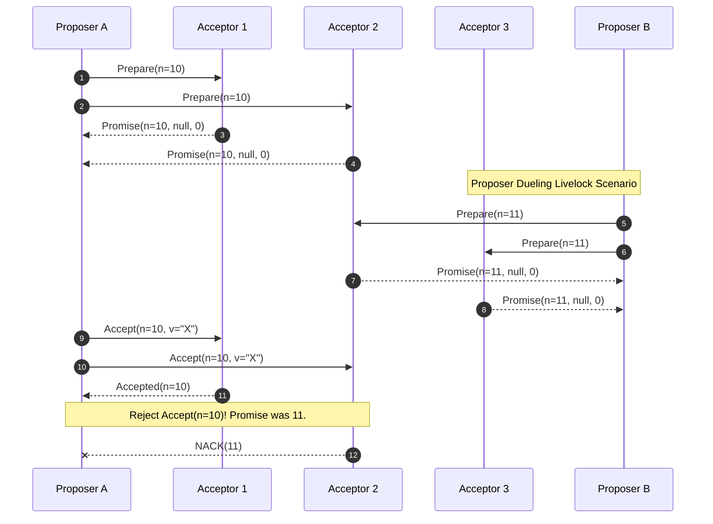

# Paxos vs. Raft - 学術理論と実践的な実装の違い (詳細レポート)

## エグゼクティブサマリー

耐障害性のある分散システムを作ろうとすると、必ずコンセンサス問題という壁にぶつかる。この壁への答えとしてもっとも広く知られているのがPaxosとRaftだ。どちらも信頼性の低いネットワークの上でレプリケーテッドステートマシンの一貫性を保つことを目指しているが、そこに至るまでの設計思想はかなり対照的だ。

この記事では、柔軟性と分散性、そして数学的な厳密さを重視するPaxosと、理解しやすさと単一リーダーによる実装のしやすさを重視するRaftを、Paxos vs Raftという切り口で並べて見ていく。

**背景にある問い:**
ネットワークが途切れたり、メッセージが失われたり、一部のノードがクラッシュしたりする状況で、独立したコンピュータの集まりはどうやって一つの値や一連のコマンドについて合意できるのか。FLP定理(Fischer, Lynch, Paterson)が示すのは、完全非同期のネットワークでノードが一つでも故障し得る場合、安全性と活性の両方を保証する決定論的なコンセンサスアルゴリズムは存在しない、という結果だ。この壁を越えるには、ランダム性や部分同期という仮定を持ち込むしかない。PaxosとRaftは、この壁への向き合い方の違いから生まれた二つの答えと言える。

**押さえておきたいポイント:**
1. **理論と実装のギャップ。** Paxosは数学的にはとても美しいが、実装するとなるとかなり手強い。Raftは、理解しやすさを最優先することでも十分に安定したシステムが作れることを証明した。
2. **構造上のトレードオフ。** Paxosは順不同のコミットを許すのでヘッドオブラインブロッキングを避けやすいが、その分障害からの回復ロジックが複雑になる。Raftは書き込みを厳密に順序付けることで分かりやすさを得る代わりに、性能面でいくらか譲歩している。
3. **スプリットブレインとその周辺。** どちらのアルゴリズムもクォーラム交差の原則に支えられているが、Raftはネットワーク分断時に「任期のインフレ」という独自の問題を抱えており、Pre-Voteのような補完的な仕組みが必要になる。

---

## 分散コンセンサスの理論的基礎

### FLP定理とクォーラム交差

コンセンサスアルゴリズムの信頼性を支える数学的な土台は、結局のところクォーラム交差の性質にほぼすべて還元される。

クォーラム $\mathbb{Q}$ は通常、$N = 2F + 1$ ノードからなる過半数グループとして定義される。ここで $F$ は、システムが動き続けられる限界となる、許容できる故障ノード数だ。

集合の交差性質は次の公理で表される。
$$ \forall Q_1, Q_2 \in \mathbb{Q}, Q_1 \cap Q_2 \neq \emptyset $$

この公理が意味するのは、任意の二つの過半数グループが必ず少なくとも一つのメンバーを共有する、ということだ。その共有ノードが一種の記憶装置として働き、システムが同じ時点で二つの矛盾した決定を承認するのを防ぐ。これがPaxosとRaftの両方が最終的に依拠している安全性の土台になっている。

---

## Paxosアルゴリズムの解剖: 分散化という発想

Leslie Lamportが架空のSynod評議会というたとえ話で示したPaxosは、単一のリーダーに頼らない。代わりに役割を三つに分ける。
- **Proposer(提案者):** 評議会に諮る値を提案する。
- **Acceptor(承認者):** 提案を記録し、システムの記憶として振る舞う。
- **Learner(学習者):** 合意が成立した最終結果を受け取る。

### Basic Paxosの2フェーズ

Basic Paxosでコンセンサスに至る流れは二つのフェーズで構成される。

**フェーズ1(Prepare): 約束を集める**
1. Proposerは一意な識別番号 $n$(これまで使ったどの番号よりも大きい必要がある)を生成し、$Prepare(n)$ をAcceptorの過半数に送る。
2. Acceptorは $Prepare(n)$ を受け取り、$n$ がそれまで見た中で最大の番号なら $Promise(n, v_a, n_a)$ で応じる。この約束は「今後 $n$ より小さい番号の提案は一切受け入れない」という意味を持つ。もし以前に何かの値を承認していれば、その値 $v_a$ と番号 $n_a$ を添えて返す。

**フェーズ2(Accept): 承認を求める**
1. Proposerが過半数から約束を得られたら、$Accept(n, v)$ を送る。
2. ここで値 $v$ は好き勝手に選べるわけではない。返ってきた $Promise$ のうち最大の $n_a$ を持つ値をそのまま使わなければならない。すべての $v_a$ が空だった場合に限り、Proposerは自分の値を提案できる。
3. Acceptorは、$n$ より大きい番号を約束済みでない限り $Accept(n, v)$ を受け入れる。

### 数学的帰納法による証明

ある値 $v$ が提案番号 $n$ ですでにAcceptorの評議会によって確定していたとする。証明したいのは、それ以降のどの提案 $n' > n$ もこの値 $v$ を持つはずだ、ということだ。

$Q_c$ を提案 $n$ を承認したAcceptorの集合、$Q_p$ を提案 $n'$ に約束したAcceptorの集合とする。
集合の性質から $Q_c \cap Q_p \neq \emptyset$ が成り立つ。
この交わりに含まれるノードは、番号 $n$ とともに値 $v$ をすでに覚えている。$Prepare(n')$ に応じるとき、そのノードは $v$ を返してくる。結果として新しいProposerは $v$ を確認せざるを得ず、同じ値 $v$ をそのまま広めることになる。安全性はこうして保たれる。

### 弱点: ライブロックとProposer Dueling

分散化には代償もある。**Proposer Dueling** と呼ばれる現象だ。
Proposer Aが $Prepare(10)$ を送り、Acceptorたちがそれに同意したとする。ところがAが $Accept(10)$ を送る前に、Proposer Bが $Prepare(11)$ を送ってしまう。Acceptorたちは今度はBに約束し(Aへの約束は反故になる)、Aが後から送る $Accept(10)$ は拒否される。腹を立てたAは $Prepare(12)$ を送り……という具合にループが続くと、システムは動き続けているのに何も決まらないというライブロック、つまり活性の喪失が起きる。
この問題への対処としては、指数バックオフを入れるか、Multi-Paxos(固定リーダーを置く方式)へ進化させるかのどちらかが必要になる。



---

## Raftアルゴリズムの解剖: 一人のリーダーに賭ける設計

対照的にRaft(Diego OngaroとJohn Ousterhoutの設計)は、権限を一人のリーダーに集中させるという、いわば逆張りの発想で組み立てられている。

Raftはリーダー選出とログ複製をうまく一体化させたプロトコルで、任期 $T$ の中でリーダーになれるのは常にただ一人だけだ。

### ランダム化された選挙とDuelingの回避

Raftはハートビートのタイムアウトをランダム化することで、Paxosを悩ませたProposer Duelingをそもそも起こさないようにしている。
複数のFollowerが同時に目を覚まして競合してしまう確率は、おおよそ次のように見積もれる。
$$ P(X) = 1 - \prod_{i=1}^{k} (1 - \frac{i-1}{W}) $$
ランダムウィンドウ $W$ をネットワークのRTTより十分に大きく取ることで、複数ノードが同時に立候補して票が割れる確率は限りなくゼロに近づく。

### リーダーの完全性(Leader Completeness)

Paxos(どのノードもいつでもデータを広められる)とは違い、Raftはデータの流れを一方向に固定する。**データはリーダーからフォロワーへとしか流れない。** リーダーが自分のログを書き換えたり削除したりすることは一切ない。

Raftは、コミット済みのログエントリをすべて持っていないCandidateがリーダーになることを許さない。
「どちらのログが新しいか」の比較は、$(Term, Index)$ の組に対する辞書式順序で決まる。
$$ (T_{last}^A > T_{last}^B) \lor (T_{last}^A = T_{last}^B \land Index_{last}^A > Index_{last}^B) $$
この制約のおかげで、新しく選ばれたリーダーは必ず旧リーダーのデータをすべて含んでいることが保証される。だから選出された直後から、Raftのリーダーは過去を掘り返す手間なしに、すぐに読み書きのリクエストをさばき始められる。

---

## マイクロアーキテクチャ、OSのI/O、そしてテールレイテンシ

理論としてはきれいでも、実際のハードウェアの上でRaftやPaxosを動かすとなると、メモリ帯域幅やハードウェア割り込みといった物理的な制約との戦いになる。

### OSとfsyncというメモリの壁

もっとも厳しい制約の一つがこれだ。システムがネットワークにACKを返す前に、すべての状態はNVMeドライブ上のWALにしっかり書き込まれていなければならない。

Linux(POSIX)で `fsync()` を呼ぶと、内部では小さな嵐が起きる。カーネルはページキャッシュに乗っているバイト列を、DMA経由で物理SSDに強制的に押し出す。この処理には毎回15〜50マイクロ秒ほどかかる。すべてのパケットごとに愚直に `fsync` を呼んでいたら、システムのスループットは数千IOPS程度まで落ち込んでしまう。

**対策:**
RaftもMulti-Paxosも、**Group Commitによるバッチ化** とカーネルバイパスI/O(`io_uring`、SPDKなど)を組み合わせる必要がある。
以下のRust擬似コードは、ゼロコピーを意識した実装の一例だ。

```rust
/// 内部のRaft状態: 共有されたアトミック変数はキャッシュラインを強制的に分離されます。
#[repr(align(64))]
pub struct AtomicRaftState {
    pub current_term: AtomicU64,
    pub commit_index: AtomicU64,
}

pub async fn handle_append_entries_optimized(
    &mut self, 
    request: ZeroCopyAppendEntriesReq<'_>
) -> AppendEntriesResp {
    let current_term = self.state.current_term.load(Ordering::Acquire);
    
    // 特性安全1: 時代遅れのLeaderを拒否する
    if request.term < current_term {
        return AppendEntriesResp { term: current_term, success: false };
    }
    
    // ロックフリーな任期の進化アルゴリズム (Lock-free Term Evolution)
    if request.term > current_term {
        self.state.current_term.store(request.term, Ordering::Release);
        self.voted_for.store(0, Ordering::Relaxed);
        // 非同期WALの保存
        self.wal.persist_metadata(request.term, None).await; 
    }
    
    // キャッシュラインバリアとI/Oバッチ処理
    let batch_bytes = request.extract_payload_zero_copy();
    self.wal.submit_sqe_write(batch_bytes);
    self.wal.await_cqe_fsync().await; // ディスクを待っている間、他のプロセスにスレッドを譲る

    AppendEntriesResp { term: request.term, success: true }
}
```

### ガベージコレクタのStop-The-Worldという弱点

Java(JVM)やGolangのようにガベージコレクタを持つ言語で分散システムを書く場合、Stop-The-Worldはかなり静かに効いてくる脅威だ。

200ミリ秒のGC停止が一度でも起きれば、election_timeoutの境界をあっさり超えてしまう。Followerは現職のリーダーが死んだと誤って判断し、不要な選挙が連鎖して起き、処理能力そのものが崩れていく。
TiKVやRedpandaのようなハイパースケールなシステムがC++やRustを選ぶ理由の一つはここにある。手動でメモリを管理することで、GCによる予測不能な遅延をそもそも排除できる。

---

## どちらを選ぶか: RaftとPaxosの使い分け

### 順不同コミット(Multi-Paxos)対 厳密な線形性(Raft)

**Multi-Paxos(たとえばGoogle Spanner)**
Multi-Paxosの強みは、順不同でコミットできる点にある。ログの各スロット(インデックス位置)は独立した評議会として扱われるため、パケット12が失われても、スロット10、11、13は問題なく承認を進められる。ヘッドオブラインブロッキングに悩まされにくい設計だ。この特性をTrueTimeのような原子時計と組み合わせると、Multi-Paxosはマルチリージョンの地理分散ストレージにとってかなり強力な選択肢になる。

**Raft(たとえばTiKV、CockroachDB、etcd)**
Raftは厳密な線形性を要求する。インデックス $N$ をコミットするには、$1$ から $N-1$ までのすべてのインデックスが埋まっている必要がある。パケット12が失われれば、それが再送されて埋まるまでパイプライン全体が止まる。
この物理的な足かせは、分かりやすさと引き換えにピーク性能のいくらかを差し出している格好だが、その分かりやすさが実装や運用の負担を大きく減らしてくれる。今日のクラウドネイティブなオープンソースの世界でRaftがこれだけ広く使われている理由も、突き詰めればここにある。

### 障害からの回復: Paxosの傷とRaftのPre-Vote

リーダーが落ちたとき、両者の違いははっきり出る。
- **Raft:** 新しく選ばれたリーダーはすでに完全なデータを持っている。復旧コストは実質 $O(1)$ で済む。
- **Multi-Paxos:** 新しいリーダーは、コミットが完了していない可能性のあるスロットをすべて洗い出すため、大がかりなPrepareフェーズを走らせる必要がある。回復コストは $O(L)$ に近く、遅くて重い。

一方でRaftにも痛いところがある。ローカルなネットワーク分断が起きた場合だ。ネットワークから孤立したFollowerは、リーダーを見つけられないまま選挙を試み続け、自分の任期をひたすら増やしていく。ネットワークが復旧すると、その異常に大きな任期の数字を持ち込み、正当な現職リーダーを無理やり退陣させてしまう。

これに対処するため、Raftの設計者たちは **Pre-Vote** というフェーズを追加する必要があった。孤立していたCandidateは、まず「予備投票」を行う。他のノードに「リーダーは見えていますか。見えていないなら任期を上げて立候補してもいいですよ」と尋ねるわけだ。この仕組みが一種のフィルターとして働き、根拠のない任期インフレをほぼ無効化してくれる。

---

## 結論

Raftは、Paxosに対して理論的に一歩後退した存在ではない。むしろ、実務上のかなり賢い妥協の産物だと言える。Paxosは分散コンセンサスの本質的な難しさを人類に教え、Raftはそれを踏まえてすべてのソフトウェアエンジニアの手に、実際に動くクラウドを作るための道具を渡した。Paxosの柔軟だが込み入った流れと、Raftの直線的で分かりやすい流れ――その違いを理解しているかどうかが、コアインフラを設計するエンジニアとそうでないエンジニアを分ける一つの線になる。

---
