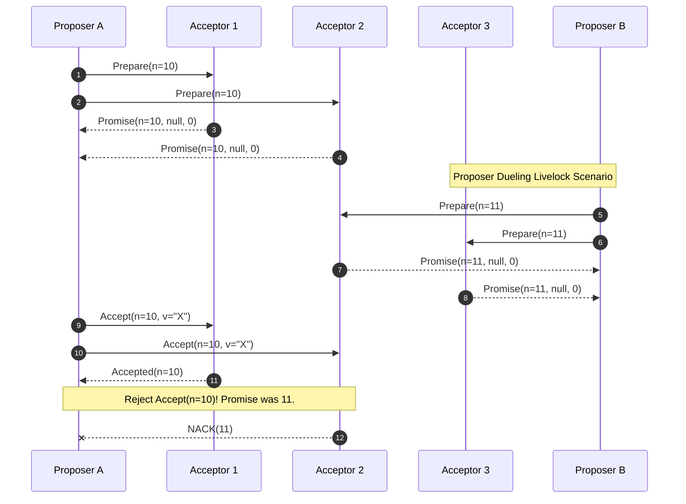

# Paxos vs. Raft - Sự Khác Biệt Giữa Lý Thuyết Học Thuật Và Thực Tiễn Triển Khai (Báo Cáo Chuyên Sâu)

## Tóm tắt Điều hành

Trong quá trình xây dựng các hệ thống phân tán chịu lỗi, sớm muộn gì cũng phải đụng đến bài toán đồng thuận. Hai câu trả lời nổi tiếng nhất cho bài toán này là Paxos và Raft. Cả hai đều nhằm giữ cho trạng thái của máy nhân bản nhất quán trên một mạng lưới không đáng tin cậy, nhưng con đường mỗi thuật toán chọn lại khá khác nhau.

Bài viết này sẽ đặt Paxos vs Raft cạnh nhau để mổ xẻ sự khác biệt: Paxos thiên về sự mềm dẻo, phi tập trung và toán học chặt chẽ; Raft thiên về việc dễ hiểu, có một thủ lĩnh duy nhất, và dễ triển khai trong thực tế.

**Vấn đề cốt lõi:**
Làm sao để các máy tính độc lập đồng ý được với nhau về một giá trị hay một chuỗi lệnh, ngay cả khi mạng gián đoạn, tin nhắn thất lạc, hoặc một số nút bị sập? Định lý FLP (Fischer, Lynch, Paterson) chỉ ra rằng: trong một mạng bất đồng bộ hoàn toàn, nếu có dù chỉ một nút có thể gặp lỗi, thì không thuật toán đồng thuận tất định nào đảm bảo được cả tính an toàn lẫn tính sống động. Để vượt qua giới hạn này, người ta phải dựa vào tính ngẫu nhiên hoặc giả định mạng đồng bộ một phần. Cách Paxos và Raft xử lý giới hạn đó, theo hai hướng khác nhau, chính là điều làm nên sự khác biệt giữa chúng.

**Những điều rút ra được:**
1. **Lý thuyết và thực hành là hai chuyện khác nhau.** Paxos đẹp về mặt toán học nhưng cài đặt thì khá vất vả. Raft chứng minh rằng chỉ cần ưu tiên sự dễ hiểu cũng đủ để có một hệ thống ổn định trong thực tế.
2. **Sự đánh đổi về cấu trúc.** Paxos cho phép commit không theo thứ tự nên tránh được nghẽn đầu dòng, nhưng đổi lại logic phục hồi sau lỗi phức tạp hơn. Raft bắt buộc ghi tuần tự, hy sinh một phần hiệu năng để đổi lấy sự rành mạch.
3. **Split-brain và những hệ quả của nó.** Cả hai thuật toán đều dựa vào nguyên lý giao thoa túc số, nhưng Raft có vấn đề riêng là "lạm phát nhiệm kỳ" khi mạng bị phân mảnh, và cần thêm cơ chế như Pre-Vote để xử lý.

---

## Nền Tảng Lý Thuyết Của Sự Đồng Thuận Phân Tán

### Định Lý FLP và Giao Thoa Túc Số

Nền tảng toán học đứng sau độ tin cậy của các thuật toán đồng thuận, xét cho cùng, gần như quy hết về tính chất giao thoa của các túc số.

Một túc số $\mathbb{Q}$ thường được định nghĩa là nhóm đa số tối thiểu gồm $N = 2F + 1$ nút, trong đó $F$ là số nút lỗi tối đa mà hệ thống vẫn còn hoạt động được.

Tính chất giao thoa của tập hợp được phát biểu bằng tiên đề:
$$ \forall Q_1, Q_2 \in \mathbb{Q}, Q_1 \cap Q_2 \neq \emptyset $$

Ý nghĩa của tiên đề này là: bất kỳ hai nhóm đa số nào cũng luôn chia sẻ ít nhất một thành viên chung. Nút giao thoa đó đóng vai trò như một bộ nhớ chung, ngăn hệ thống chấp nhận hai quyết định mâu thuẫn cùng lúc. Đây là nền tảng an toàn mà cả Paxos lẫn Raft đều dựa vào.

---

## Giải phẫu Thuật Toán Paxos: Nghệ Thuật Phi Tập Trung

Paxos, được Leslie Lamport trình bày qua ẩn dụ về hội đồng Synod hư cấu, không dựa vào một thủ lĩnh duy nhất. Thay vào đó, nó chia hệ thống thành ba vai trò:
- **Proposer:** đưa ra giá trị để hội đồng bỏ phiếu.
- **Acceptor:** ghi nhận đề xuất, đóng vai trò bộ nhớ của hệ thống.
- **Learner:** nhận kết quả cuối cùng khi đồng thuận đạt được.

### Quy Trình Hai Pha của Basic Paxos

Đạt đồng thuận trong Basic Paxos diễn ra qua hai pha:

**Pha 1 (Prepare): thu thập lời hứa**
1. Một Proposer tạo số định danh $n$ (phải là duy nhất và lớn hơn mọi số nó từng dùng), gửi $Prepare(n)$ tới đa số Acceptor.
2. Nếu một Acceptor nhận $Prepare(n)$ và $n$ lớn hơn mọi số nó từng thấy, nó phản hồi bằng $Promise(n, v_a, n_a)$ - lời hứa "sẽ không chấp nhận đề xuất nào có số nhỏ hơn $n$ nữa". Nếu trước đó đã chấp thuận giá trị nào, nó đính kèm giá trị $v_a$ cùng số $n_a$.

**Pha 2 (Accept): gửi yêu cầu chấp thuận**
1. Nếu Proposer thu đủ lời hứa từ một túc số, nó gửi $Accept(n, v)$.
2. Giá trị $v$ không được chọn tùy ý - nó phải là giá trị có $n_a$ lớn nhất trong các $Promise$ nhận được. Chỉ khi mọi $v_a$ đều trống, Proposer mới được đưa ra giá trị của riêng mình.
3. Acceptor chỉ chấp thuận $Accept(n, v)$ nếu chưa hứa với số nào lớn hơn $n$.

### Chứng Minh Bằng Quy Nạp

Giả sử giá trị $v$ đã được chứng thực bởi hội đồng Acceptor với số đề xuất gốc $n$. Điều cần chứng minh là: mọi đề xuất sau đó $n' > n$ đều phải mang đúng giá trị $v$ này.

Gọi $Q_c$ là tập Acceptor đã chấp thuận đề xuất $n$, $Q_p$ là tập Acceptor đã hứa với đề xuất $n'$.
Theo nguyên lý tập hợp: $Q_c \cap Q_p \neq \emptyset$.
Nút nằm trong giao này đã nhớ $v$ cùng số $n$. Khi phản hồi $Prepare(n')$, nó trả về $v$. Proposer mới buộc phải nhìn thấy $v$ và truyền lại đúng giá trị đó. Tính an toàn nhờ vậy được giữ vững.

### Điểm Yếu: Livelock và Proposer Dueling

Việc phi tập trung cũng có cái giá của nó - hiện tượng **Proposer Dueling**.
Proposer A gửi $Prepare(10)$, Acceptor đồng ý. Trước khi A kịp gửi $Accept(10)$, Proposer B đã gửi $Prepare(11)$. Acceptor giờ hứa với B, bỏ rơi lời hứa với A. $Accept(10)$ của A bị từ chối. A tức tối gửi $Prepare(12)$... Vòng lặp này gây ra livelock - hệ thống vẫn chạy nhưng không bao giờ đi đến quyết định, tức mất tính sống động.
Cách xử lý thường là dùng exponential backoff, hoặc tiến hóa thành Multi-Paxos với một leader cố định.



---

## Giải phẫu Thuật Toán Raft: Đặt Cược Vào Một Thủ Lĩnh Duy Nhất

Ngược lại, Raft (do Diego Ongaro và John Ousterhout thiết kế) chọn hướng đi ngược với Paxos: tập trung quyền lực vào một thủ lĩnh duy nhất.

Raft gộp bài toán bầu thủ lĩnh và quá trình nhân bản log lại làm một cách gọn gàng. Tại bất kỳ nhiệm kỳ $T$ nào, chỉ có thể tồn tại đúng một thủ lĩnh.

### Bầu Cử Ngẫu Nhiên và Cách Tránh Livelock

Raft giải quyết hẳn vấn đề Proposer Dueling của Paxos bằng cách ngẫu nhiên hóa thời gian chờ heartbeat.
Xác suất va chạm khi nhiều Follower cùng thức dậy và tranh cử có thể ước lượng bằng công thức:
$$ P(X) = 1 - \prod_{i=1}^{k} (1 - \frac{i-1}{W}) $$
Bằng cách nới rộng cửa sổ ngẫu nhiên $W$ vượt xa độ trễ mạng, xác suất nhiều nút cùng tranh cử một lúc giảm dần về gần như bằng không.

### Tính Hoàn Chỉnh Của Thủ Lĩnh (Leader Completeness)

Khác với Paxos - nơi bất kỳ nút nào cũng có thể truyền dữ liệu bất cứ lúc nào - Raft ép dữ liệu chảy theo một hướng duy nhất: **từ thủ lĩnh xuống follower**. Thủ lĩnh không bao giờ ghi đè hay xóa log của chính mình.

Raft không cho phép một Candidate trở thành thủ lĩnh nếu nó thiếu bất kỳ log entry nào đã được commit.
Việc so sánh log nào "mới hơn" dựa trên thứ tự từ điển của cặp $(Term, Index)$:
$$ (T_{last}^A > T_{last}^B) \lor (T_{last}^A = T_{last}^B \land Index_{last}^A > Index_{last}^B) $$
Nhờ ràng buộc này, thủ lĩnh mới trong Raft luôn chắc chắn đã có đầy đủ dữ liệu của thủ lĩnh cũ. Vì vậy ngay khi vừa đắc cử, thủ lĩnh Raft có thể phục vụ ngay các truy vấn đọc/ghi mà không cần mất thời gian lục lại quá khứ như Paxos.

---

## Vi Kiến Trúc, I/O Hệ Điều Hành Và Độ Trễ Đuôi

Lý thuyết là một chuyện, nhưng chạy Raft hay Paxos trên phần cứng thật lại là một cuộc chiến khác - với băng thông bộ nhớ và ngắt phần cứng.

### Nút Thắt fsync Giữa Bộ Nhớ Và Hệ Điều Hành

Một trong những ràng buộc khắc nghiệt nhất: trước khi hệ thống trả ACK về mạng, mọi trạng thái phải thực sự được ghi vào WAL trên ổ NVMe.

Gọi `fsync()` trên Linux (POSIX) kích hoạt cả một chuỗi thao tác bên dưới: kernel buộc phải đẩy dữ liệu từ page cache qua DMA xuống ổ SSD vật lý. Mỗi lần như vậy tốn khoảng 15-50 micro giây. Nếu gọi `fsync` cho từng gói tin một, thông lượng hệ thống sẽ tụt xuống chỉ còn vài nghìn IOPS.

**Cách khắc phục:**
Cả Raft lẫn Multi-Paxos đều cần **Group Commit** kết hợp với các kỹ thuật I/O bỏ qua kernel như `io_uring` hay SPDK.
Đoạn mã giả Rust dưới đây minh họa một cách tiếp cận theo hướng zero-copy.

```rust
/// Trạng thái Raft nội tại: Các biến nguyên tử chia sẻ được ép buộc phân rã cache line.
#[repr(align(64))]
pub struct AtomicRaftState {
    pub current_term: AtomicU64,
    pub commit_index: AtomicU64,
}

pub async fn handle_append_entries_optimized(
    &mut self, 
    request: ZeroCopyAppendEntriesReq<'_>
) -> AppendEntriesResp {
    let current_term = self.state.current_term.load(Ordering::Acquire);
    
    // Đặc tính An Toàn 1: Từ chối Leader lạc hậu 
    if request.term < current_term {
        return AppendEntriesResp { term: current_term, success: false };
    }
    
    // Thuật toán tiến hóa nhiệm kỳ không cần khóa (Lock-free Term Evolution)
    if request.term > current_term {
        self.state.current_term.store(request.term, Ordering::Release);
        self.voted_for.store(0, Ordering::Relaxed);
        // Lưu WAL bất đồng bộ
        self.wal.persist_metadata(request.term, None).await; 
    }
    
    // Rào chắn Cache line và I/O Batching
    let batch_bytes = request.extract_payload_zero_copy();
    self.wal.submit_sqe_write(batch_bytes);
    self.wal.await_cqe_fsync().await; // Nhường luồng cho tiến trình khác trong khi chờ đĩa

    AppendEntriesResp { term: request.term, success: true }
}
```

### Điểm Yếu Của Garbage Collector: Stop-The-World

Với các hệ phân tán viết bằng ngôn ngữ có garbage collector như Java (JVM) hay Golang, Stop-The-World là kiểu vấn đề âm thầm nhưng nguy hiểm.

Chỉ cần một lần GC dừng hệ thống 200 mili giây là đủ để vượt qua ngưỡng `election_timeout`. Các Follower sẽ hiểu nhầm rằng thủ lĩnh đương nhiệm đã chết, kéo theo một loạt cuộc bầu cử không cần thiết làm sập hiệu năng xử lý.
Đây cũng là lý do các hệ thống siêu quy mô như TiKV hay Redpanda chọn C++ hoặc Rust - việc quản lý bộ nhớ thủ công loại bỏ hoàn toàn kiểu độ trễ khó lường này.

---

## Khi Nào Chọn Raft, Khi Nào Chọn Paxos

### Commit Không Theo Thứ Tự (Multi-Paxos) So Với Tuyến Tính Nghiêm Ngặt (Raft)

**Multi-Paxos (ví dụ Google Spanner)**
Điểm mạnh của Multi-Paxos là khả năng commit không theo thứ tự. Vì mỗi slot trong log là một hội đồng độc lập, hệ thống vẫn có thể chấp thuận slot 10, 11, 13 dù slot 12 bị mất gói tin. Nhờ vậy nó tránh được hiện tượng nghẽn đầu dòng. Kết hợp với đồng hồ nguyên tử kiểu TrueTime, Multi-Paxos trở thành lựa chọn khá mạnh cho lưu trữ phân tán đa vùng địa lý.

**Raft (ví dụ TiKV, CockroachDB, etcd)**
Raft đòi hỏi tính tuyến tính nghiêm ngặt. Để commit index $N$, mọi index từ $1$ đến $N-1$ phải hoàn tất trước. Nếu gói tin số 12 bị mất, toàn bộ pipeline dừng lại cho đến khi gói đó được gửi lại thành công.
Cái giá phải trả này đổi lấy sự rành mạch, và chính sự rành mạch đó giúp giảm đáng kể gánh nặng vận hành - đây cũng là lý do Raft chiếm ưu thế gần như tuyệt đối trong thế giới mã nguồn mở cloud-native hiện nay.

### Phục Hồi Sau Lỗi: Vết Sẹo Của Paxos Và Pre-Vote Của Raft

Khi thủ lĩnh sụp đổ, sự khác biệt giữa hai bên khá rõ:
- **Raft:** thủ lĩnh mới đắc cử đã có sẵn toàn bộ dữ liệu, chi phí phục hồi gần như $O(1)$.
- **Multi-Paxos:** thủ lĩnh mới phải chạy một pha Prepare lớn để quét lại các slot chưa chắc đã commit xong, chi phí phục hồi cỡ $O(L)$, khá chậm và tốn kém.

Nhưng Raft cũng có điểm yếu riêng khi mạng cục bộ bị phân mảnh. Một Follower bị cô lập sẽ liên tục không thấy thủ lĩnh, cứ thế tự tăng nhiệm kỳ lên hàng nghìn, hàng vạn lần để thử bầu cử. Khi mạng phục hồi, nó mang theo con số nhiệm kỳ khổng lồ đó quay lại, buộc thủ lĩnh đang hoạt động hợp lệ phải từ chức ngay lập tức, gây gián đoạn hệ thống.

Để xử lý việc này, Raft cần thêm giai đoạn **Pre-Vote**. Một Candidate bị cô lập trước tiên phải "dò ý" các nút khác: hỏi xem chúng có đang thấy thủ lĩnh không - chỉ khi không ai thấy thủ lĩnh, nó mới được phép tăng nhiệm kỳ và tranh cử thật sự. Cơ chế này lọc bỏ gần như hoàn toàn hiện tượng lạm phát nhiệm kỳ vô căn cứ.

---

## Tổng Kết

Raft không phải là một bước lùi về mặt toán học so với Paxos - nó là kết quả của một sự thỏa hiệp kỹ thuật khá thông minh. Paxos cho thấy rõ giới hạn thật sự của bài toán đồng thuận phân tán, còn Raft trao cho các kỹ sư phần mềm một công cụ đủ chắc chắn để xây những hệ thống chạy được trong thực tế. Hiểu được sự khác biệt giữa dòng chảy có phần rối rắm của Paxos và sự tuyến tính, dễ theo dõi của Raft là một trong những ranh giới phân biệt một lập trình viên bình thường với một người thiết kế hạ tầng lõi.

---
