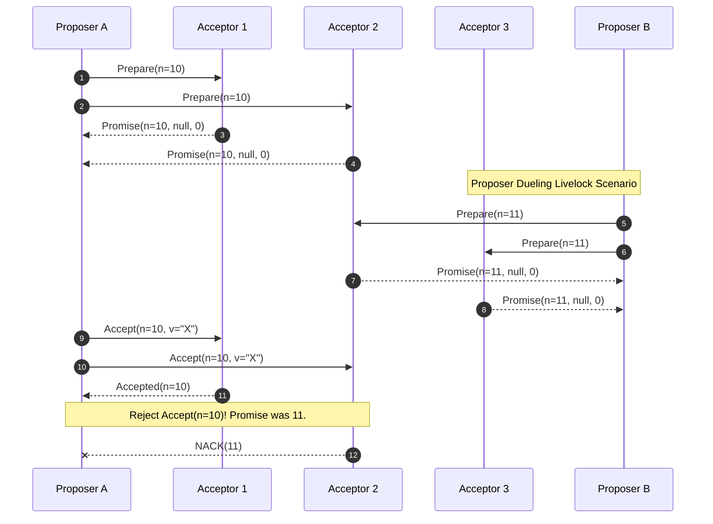
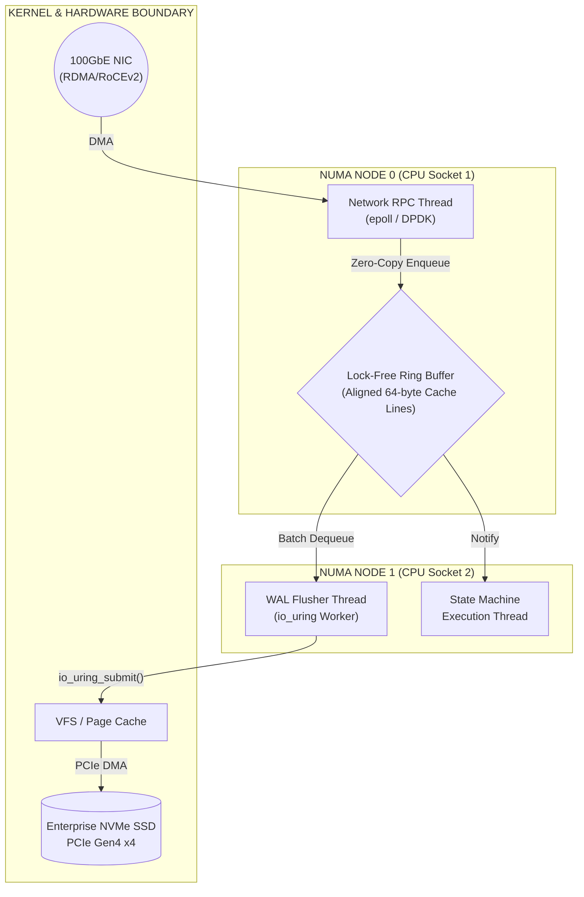

# Paxos vs. Raft: Sự khác biệt lý thuyết và thực tiễn triển khai

## Nền tảng lý thuyết và cơ sở toán học của sự đồng thuận phân tán

Bài toán đồng thuận phân tán là cốt lõi của khoa học máy tính về hệ thống chịu lỗi, nơi một tập hợp các nút vi xử lý độc lập phải đạt được sự thống nhất toán học tuyệt đối về một giá trị hoặc chuỗi trạng thái duy nhất bất chấp sự nhiễu loạn của đường truyền mạng hoặc hiện tượng suy giảm phần cứng. Tính chất phức tạp của bài toán này đã được hệ thống hóa qua Định lý FLP (Fischer, Lynch, Paterson), một công trình chứng minh một cách chặt chẽ và không thể phản bác rằng trong một mô hình mạng bất đồng bộ hoàn toàn (asynchronous networks) - nơi các thông điệp có thể chịu độ trễ giao nhận vô hạn nhưng không bao giờ bị mất hoặc biến đổi - không tồn tại bất kỳ một thuật toán đồng thuận tất định (deterministic consensus algorithm) nào có thể cung cấp đồng thời cấu trúc đảm bảo tính an toàn (safety) và tính sống động (liveness) nếu có dù chỉ một chu trình tác vụ đơn lẻ có thể gặp lỗi dừng đột ngột (crash-fault). Vì sự tồn tại của giới hạn lý thuyết nghiêm ngặt này, các kiến trúc sư hệ thống bắt buộc phải thỏa hiệp thông qua việc thiết kế các thuật toán như Paxos và Raft để duy trì tính an toàn cấu trúc một cách bất biến và tuyệt đối trong mọi tình huống, đồng thời chỉ bảo chứng cho tính sống động dưới các giả định môi trường mạng đồng bộ một phần (partial synchrony). Mạng đồng bộ một phần hàm ý rằng, dù mạng có thể trải qua các đợt gián đoạn phân mảnh (network partitions) không định trước, hệ thống cuối cùng vẫn sẽ bước vào một kỷ nguyên mà ở đó các gói tin được vận chuyển trong một khoảng thời gian giới hạn có thể dự đoán được. Cơ sở toán học nền tảng tạo nên độ tin cậy của các thuật toán này phụ thuộc tuyến tính vào tập hợp đại biểu (quorum intersection properties). Một tập hợp đại biểu $\mathbb{Q}$ thường được định hình là một nhóm đa số tối thiểu bao gồm $N = 2F + 1$ nút, trong đó biến $F$ biểu diễn định mức tối đa các nút có thể gặp lỗi mà hệ thống vẫn duy trì sự kiên cường. Tính chất giao hoán tập hợp được hình thức hóa bằng tiên đề: $\forall Q_1, Q_2 \in \mathbb{Q}, Q_1 \cap Q_2 \neq \emptyset$. Tiên đề giao điểm bất đối xứng này cung cấp một mỏ neo nhận thức rằng bất kỳ hai tập hợp đại biểu nào khi tiến hành phê duyệt dữ liệu cũng chắc chắn chia sẻ ít nhất một thực thể thành viên trung gian, người mang theo trạng thái trí nhớ toàn cục để phủ quyết các quyết định dị giáo hoặc mâu thuẫn trong dòng thời gian của hệ thống.

Thuật toán Paxos, được nhà khoa học máy tính xuất chúng Leslie Lamport trình bày thông qua ẩn dụ hư cấu về hội đồng Synod, thực hiện việc phân rã hệ thống cấu trúc logic thành ba vai trò biểu đạt riêng biệt nhằm phân tách trách nhiệm toán học: Proposers (các cá thể đề xuất giá trị), Acceptors (các cấu trúc lưu trữ độc lập xét duyệt quyết định) và Learners (các quy trình học và thi hành kết quả cuối cùng). Cơ học lượng tử của quá trình đạt được đồng thuận trong mô hình Basic Paxos được thực thi thông qua quy trình kiểm định hai pha độc lập (two-phase commit topology) nhằm phong tỏa tính toàn vẹn của chuỗi dữ liệu. Tại pha khởi tạo (Phase 1a: Prepare), một Proposer khởi sinh một số thứ tự đề xuất tăng ngặt $n$ và phát sóng thông điệp hàm $Prepare(n)$ tới một tập hợp đại biểu cấu thành từ các Acceptors. Nếu định danh số $n$ này vượt qua bài kiểm tra đại số khi so sánh với bất kỳ định danh số nào mà Acceptor đã từng tiếp nhận trước đó, cấu trúc Acceptor sẽ phản hồi bằng một chứng thư toán học $Promise(n, v_a, n_a)$ (Phase 1b). Chứng thư này không chỉ là một cam kết bất khả kháng về việc cự tuyệt mọi đề xuất phát sinh từ các định danh có giá trị nhỏ hơn $n$ trong tương lai, mà còn hoạt động như một cỗ máy thời gian, trả về cho Proposer giá trị đã được hệ thống ghi nhận cao nhất $v_a$ được đính kèm cùng với định danh thời gian lịch sử của nó $n_a$. Ngay khi hạt giống Proposer thu hoạch được các chứng thư hứa hẹn từ một cấu trúc đa số, nó lập tức kích hoạt pha thứ hai (Phase 2a: Accept) bằng cách rải thông điệp $Accept(n, v)$ lên mạng lưới tập hợp đại biểu. Giá trị $v$ tại thời điểm này không được lựa chọn ngẫu nhiên, mà bắt buộc phải là giá trị đi liền với định danh số $n_a$ lớn nhất được kết xuất từ các bản báo cáo trả về; hoặc nếu và chỉ nếu hệ thống ở trạng thái tinh khôi (tất cả các $v_a$ đều mang giá trị null), $v$ mới được quyền khởi tạo thành một giá trị đề xuất nguyên thủy của Proposer đó. Để khẳng định tính an toàn toán học vĩnh cửu của cấu trúc Paxos, chúng ta vận dụng phương pháp quy nạp toán học trên tập hợp (mathematical induction). Giả sử tồn tại một giá trị lượng tử $v$ đã được mạng lưới hội đồng Acceptors chứng thực bằng số đề xuất gốc $n$, mệnh đề chứng minh yêu cầu bất kỳ một đề xuất hậu thế nào mang định danh $n' > n$ đều bắt buộc phải dung chứa duy nhất nội dung giá trị $v$ đó. Ta cấu trúc tập hợp những Acceptors đã đồng thuận bảo vệ đề xuất $n$ là $Q_c$, và song song đó, thiết lập tập hợp các Acceptors đã bị khóa lời hứa tại pha Prepare của đề xuất sinh sau $n'$ là $Q_p$. Bằng cách dựa dẫm vào nguyên lý giao điểm siêu không gian của tập hợp đại biểu, ta có kết luận hệ quả $Q_c \cap Q_p \neq \emptyset$. Sự hiện hữu của vùng giao điểm khác rỗng này chứng minh sự tồn tại của ít nhất một nút Acceptor siêu phàm nằm trong $Q_p$ sẽ đóng vai trò người thổi còi, cung cấp bằng chứng cho Proposer mới về sự hiện diện trước đó của giá trị $v$, từ đó khống chế và đồng hóa Proposer hậu thế phải truyền bá lại đúng di sản giá trị $v$ trong sự kiện $Accept(n', v)$ tiếp diễn. Mặc dù cấu trúc này sở hữu tính đúng đắn toán học thuần túy và không thể phá vỡ, nó lại mang một khiếm khuyết trong biểu đồ tính sống động: hiện tượng Proposer Dueling (livelock), nơi hai hoặc nhiều Proposer luân phiên phát sinh các định danh đề xuất tăng dần ($n=1$, $n=2$, $n=3$,...) và vô tình vô hiệu hóa lẫn nhau tại pha Prepare trước khi bất kỳ ai kịp hoàn tất pha Accept, đòi hỏi kỹ thuật áp dụng khoảng lùi thời gian hàm số mũ ngẫu nhiên (exponential randomized backoff) để phá vỡ vòng lặp vô tận trong thực tiễn.



Ở thái cực đối lập với cơ chế hoạt động phi tập trung và cấu trúc phân phối vai trò theo dạng màng lưới tự thân của Paxos, thuật toán Raft (được thiết kế bởi Diego Ongaro và John Ousterhout) xuất hiện với một triết lý thiết kế tôn sùng tính tập trung hóa quyền lực tuyệt đối (strong leader paradigm). Việc lựa chọn mô hình độc tài này không phải là một sự thụt lùi về học thuật, mà là một bước đột phá chiến lược nhằm thu gọn khối lượng trạng thái (state space reduction) và tăng cường khả năng chuyển đổi trực tiếp sang thiết kế vi kiến trúc phần mềm. Raft dung hợp tinh tế bài toán bầu cử lãnh tụ (Leader Election) và quá trình sao chép sổ cái giao dịch (Log Replication) thành một động cơ điều khiển trạng thái đồng bộ, cắt xẻ dòng thời gian logic thành chuỗi các nhiệm kỳ (terms) phân rã được lập chỉ mục tăng dần đều, với tính chất bất khả xâm phạm: tại bất kỳ một đơn vị nhiệm kỳ $T$ cụ thể nào, chỉ có khả năng tồn tại giới hạn duy nhất một Leader được hệ thống ủy quyền hợp pháp. Điểm tựa của Raft nằm ở kỹ nghệ khống chế xung đột phiếu bầu thông qua bộ tính giờ tĩnh mạch đập ngẫu nhiên hóa (randomized heartbeat timeouts). Cấu trúc toán học đằng sau xác suất va chạm (collision probability) khi một số lượng Follower $k$ thức tỉnh và kích hoạt trạng thái Candidate đồng thời có thể được ước lượng xấp xỉ bằng phương trình $P(X) = 1 - \prod_{i=1}^{k} (1 - \frac{i-1}{W})$, với biến phân bổ $W$ đại diện cho biên độ của cửa sổ thời gian ngẫu nhiên. Công thức phân phối xác suất này chứng thực một thực tế rằng, bằng cách nới rộng hệ số $W$ vượt qua độ trễ truyền tải định tuyến tối đa (maximum broadcast latency) của hạ tầng cáp quang mạng, khả năng hệ thống rơi vào trạng thái bế tắc bầu cử sẽ suy biến tiệm cận về mức thống kê vô nghĩa, đáp ứng một cách mạnh mẽ tiêu chuẩn tính sống động của định lý FLP trên bình diện thực tiễn phần mềm. Thêm vào đó, cốt lõi bảo mật của Raft hội tụ tại Đặc tính Hoàn chỉnh của Leader (Leader Completeness Property) và Đặc tính Khớp Nhật ký (Log Matching Property). Quy tắc của Raft cưỡng chế một dòng chảy thông tin tinh khiết và không đảo nghịch: khối dữ liệu nhật ký chỉ được cấp phép sao chép một chiều từ tầng Leader khuếch tán xuống các Follower, và dưới không bất kỳ nghịch cảnh nào, trạng thái nhật ký cục bộ của Leader bị phép ghi đè (overwrite) hoặc xóa bỏ. Một cấu trúc Candidate khi khởi chạy chiến dịch tranh cử sẽ bị vô hiệu hóa quyền đắc cử nếu nhật ký của nó không sở hữu chỉ số cập nhật tương đương hoặc vượt trội so với đa số tập hợp. Trạng thái "cập nhật nhất" (up-to-date) được biểu diễn bằng đại số logic từ điển (lexicographical comparison) dựa trên tọa độ vector hai chiều: $(T_{last}, Index_{last})$. Nghĩa là ứng cử viên $A$ sẽ trực tiếp từ khước lá phiếu tín nhiệm dành cho ứng cử viên $B$ nếu phương trình sau trả về giá trị chân lý: $(T_{last}^A > T_{last}^B) \lor (T_{last}^A = T_{last}^B \land Index_{last}^A > Index_{last}^B)$. Cơ chế rào cản bất đẳng thức này tạo nên tấm khiên vĩnh cửu, ngăn chặn hiện tượng mất mát dữ liệu; đảm bảo toán học rằng bất kỳ bản ghi nào đã thỏa mãn điều kiện túc số đa số (committed) trong một nhiệm kỳ tiền nhiệm, thông qua phép biến đổi cấu trúc, chắc chắn phải cư trú và bảo tồn nguyên vẹn bên trong hệ cơ sở dữ liệu nội tại của bất kỳ Leader đương nhiệm nào ở chuỗi nhiệm kỳ tương lai tiếp nối. Thuộc tính đồng cấu này của Raft (If two entries in different logs have the same index and term, they store exactly the same command and their preceding entries are identical) đã tiêu biến sự cần thiết của các kỹ thuật xử lý mâu thuẫn chỉ mục thứ tự rườm rà vốn gây ám ảnh trong việc triển khai Paxos thuần túy.

## Kiến trúc vi mô, tối ưu hóa hệ điều hành và kỹ thuật I/O

Sự quyến rũ toán học của các khối phương trình Paxos và Raft trên bản thảo học thuật thường che giấu một vực thẳm kỹ thuật hung bạo khi chuyển giao sang môi trường triển khai thực tế trên bề mặt silicon và các mâm đĩa lưu trữ từ tính. Tại cấu trúc vi mô (microarchitecture), bộ quản lý tác vụ hệ điều hành (OS scheduler), mô hình quản lý bộ nhớ (memory subsystem) và các giới hạn xung nhịp I/O của đĩa cứng vật lý trở thành những bóng ma quyết định vận mệnh hiệu năng của toàn bộ nền tảng dữ liệu phân tán. Một trong những định luật vật lý tàn nhẫn nhất bóp nghẹt băng thông của bất kỳ cỗ máy đồng thuận nào là độ trễ áp đặt bởi sự ràng buộc về tính bền vững (durability constraints). Trước khi hệ thống mạng có thể phúc đáp một gói tin xác nhận (ACK) về không gian người dùng của máy khách, định lý lưu trữ an toàn yêu cầu mọi chuyển đổi trạng thái máy ảo (state machine mutations) phải được ghim chặt vào Nhật ký Ghi trước (Write-Ahead Log - WAL) trên bộ nhớ phi bay hơi (non-volatile storage NAND flash). Trong môi trường hạt nhân POSIX (Linux/Unix), lệnh gọi không gian hệ thống `fsync()` hoặc hàm anh em `fdatasync()` kích hoạt một trận cuồng phong vi mạch: nó bạo lực đánh sập cơ chế trì hoãn ghi tự nhiên của hạt nhân, ép buộc OS Page Cache (bộ đệm trang) nằm trong bộ nhớ RAM DRAM phải thanh trừng dữ liệu dơ (dirty pages), đẩy khối byte này qua lớp giao tiếp khối IO (Block IO Layer). Tiếp đó, cấu trúc bộ điều khiển Direct Memory Access (DMA) tước quyền điều khiển khỏi vi xử lý trung tâm (CPU), chuyển giao các khung dữ liệu trực tiếp qua tuyến đường PCIe băng thông rộng đến thiết bị điều khiển vi mạch của ổ NVMe, nơi các bóng bán dẫn bẫy điện tử sẽ cấu trúc lại hàng triệu hạt electron vào trong các ma trận ô nhớ flash 3D TLC/QLC. Độ trễ lượng tử của tiến trình `fsync()` khổng lồ này, ngay cả trên cấu trúc phần cứng NVMe Enterprise hạng nặng, vẫn dao động từ 15 đến 50 microsecond, và phình to lên mức cực đoan từ 1 đến 5 millisecond trên các ổ cứng thể rắn SSD SATA hoặc đĩa quay từ tính HDD cơ học. Với giới hạn vật lý đó, việc gọi `fsync()` đồng bộ và tuần tự cho mỗi một truy vấn RPC mạng đơn lẻ sẽ đánh sập băng thông giới hạn vật lý xuống chỉ còn vài ngàn giao dịch một giây (TPS), vô hiệu hóa mọi nỗ lực tối ưu phần mềm. Để xuyên phá rào cản độ trễ này, các kiến trúc sư siêu quy mô áp dụng chiến thuật Gộp nhóm Thống nhất (Group Commit Batching) hòa quyện cùng công nghệ hạt nhân I/O bất đồng bộ tối tân nhất như Linux `io_uring` hoặc công nghệ bỏ qua hạt nhân (kernel-bypass SPDK). Các luồng máy chủ (server threads) không trực tiếp ghi dữ liệu mà đẩy liên tục các sự kiện tới một hàng đợi vòng không khóa (lock-free ring buffer) nằm trong ranh giới RAM. Một luồng công nhân WAL chuyên biệt sẽ thức tỉnh định kỳ ở quy mô microsecond, đóng băng hàng đợi, và thực hiện một lệnh dội `fsync()` khổng lồ để hợp nhất hàng vạn thông điệp vào một khối I/O đơn, phân rã hao phí độ trễ đĩa cứng trên hàng chục ngàn thao tác độc lập để tạo ra mức thông lượng tổng thể tiệm cận hằng số O(1). 

Mặt khác, để thiết lập một hàng đợi vòng không khóa thực sự hiệu quả trên môi trường vi xử lý đa nhân NUMA (Non-Uniform Memory Access), các kỹ sư phải đối diện với bài toán Tranh chấp dòng Cache (Cache Line Contention) và Chia sẻ giả (False Sharing). Giao thức gắn kết đa vi xử lý MESI (Modified, Exclusive, Shared, Invalid) đòi hỏi các CPU nội hạt liên tục hủy bỏ và nạp lại các phân đoạn L1/L2 cache 64-byte nếu có nhiều nhân cùng chỉnh sửa các biến cấu trúc liền kề nhau trên bản đồ bộ nhớ vật lý. Trong Raft, nếu biến `commit_index` và `last_applied` nằm ngẫu nhiên cạnh nhau trên cùng một cache line, một nhân CPU xử lý quá trình nạp dữ liệu sẽ liên tục tàn phá bộ nhớ đệm của nhân CPU đang áp dụng trạng thái tĩnh máy, tạo ra độ trễ hàng trăm chu kỳ đồng hồ vô hình. Khắc phục khiếm khuyết vi kiến trúc này đòi hỏi kỹ thuật đệm cấu trúc (cache line padding - ví dụ sử dụng macro `#[repr(align(64))]` trong Rust hoặc `__attribute__((aligned(64)))` trong C) để cưỡng chế biên giới an toàn độc lập giữa các biến động lực (hot atomic variables).



Ngoài áp lực vật lý từ đĩa cứng, quá trình quản lý sinh thái vòng đời bộ nhớ và ngăn xếp mạng đóng vai trò thủ lĩnh tối cao trong việc thao túng hình thái đường cong Phân phối Độ trễ đuôi (Tail Latency - P99.9). Đối với các hệ thống phân tán được dệt nên bởi các ngôn ngữ sở hữu bộ dọn rác tự động (Garbage Collection - GC) như Java (JVM) hay Golang, việc máy chủ liên tục khởi tạo và giải phóng hàng triệu vi mô đối tượng RPC (RPC micro-objects) trên khu vực heap sẽ khuếch đại áp suất phân mảnh bộ nhớ. Điều này không thể tránh khỏi việc gọi dậy ác mộng Stop-The-World (GC Pauses). Một khoảng khắc đóng băng GC kéo dài vài trăm millisecond là một tai họa cấp thảm họa hạt nhân đối với cấu trúc Raft. Nếu thời gian đình trệ của máy ảo JVM vô tình vượt qua ranh giới mong manh của bộ đếm thời gian sinh tử `election_timeout`, các nút Follower sẽ chẩn đoán nhầm lẫn rằng Leader đương nhiệm đã đột tử. Quá trình này châm ngòi cho một cuộc binh biến bầu cử (election storm) không cần thiết, đánh sập năng lực xử lý, cướp đi quyền lãnh đạo và đẩy toàn bộ đồ thị mạng lưới vào sự nhiễu loạn đồng bộ trầm trọng (system thrashing). Đây là nguyên lý giải thích sự dịch chuyển khối lượng công nghệ sang các kiến trúc phần mềm sử dụng mô hình quyền sở hữu tĩnh (static ownership and borrowing models) vô hiệu hóa hoàn toàn trình dọn rác như hệ sinh thái Rust hoặc C++ hiện đại. Hơn thế nữa, ngăn xếp mạng lưới phải khải hoàn triết lý Không sao chép (Zero-copy network protocols). Việc mã nguồn ứng dụng tương tác trực tiếp với bộ đệm của vi mạch card mạng NIC thông qua cơ chế ánh xạ vùng nhớ bộ nhớ hạt nhân trực tiếp mmap(), kết hợp với việc vô hiệu hóa thuật toán đệm giao thức Nagle (`TCP_NODELAY = 1`), biến luồng dữ liệu TCP/IP thành dòng chảy thời gian thực. Cấu trúc mô phỏng bằng mã giả ngôn ngữ Rust siêu phàm dưới đây biểu diễn một chức năng `AppendEntries` đúc kết hàng loạt nguyên lý cực hạn đã thảo luận: bảo chứng nguyên tử tính đa nhân I/O (I/O multiplexing), triệt tiêu cấu trúc khóa đồng bộ cồng kềnh (mutex-free state mutation), và tối ưu hóa chi phí dội đĩa thông qua các lệnh gọi bất đồng bộ.

```rust
/// Trạng thái Raft nội tại: Các biến nguyên tử chia sẻ được ép buộc phân rã cache line.
#[repr(align(64))]
pub struct AtomicRaftState {
    pub current_term: AtomicU64,
    pub commit_index: AtomicU64,
}

pub async fn handle_append_entries_optimized(
    &mut self, 
    request: ZeroCopyAppendEntriesReq<'_>
) -> AppendEntriesResp {
    let current_term = self.state.current_term.load(Ordering::Acquire);
    
    // Đặc tính An Toàn 1: Từ chối các hồn ma Leader lạc hậu từ chiều không gian quá khứ
    if request.term < current_term {
        return AppendEntriesResp { term: current_term, success: false };
    }
    
    // Thuật toán tiến hóa nhiệm kỳ không cần khóa (Lock-free Term Evolution)
    if request.term > current_term {
        self.state.current_term.store(request.term, Ordering::Release);
        self.voted_for.store(0, Ordering::Relaxed);
        // Lưu trữ metadata vào vùng NVMe WAL bất đồng bộ trước khi tiếp tục
        self.wal.persist_metadata(request.term, None).await; 
    }
    
    self.role = Role::Follower;
    self.election_timer.reset_atomic(); // Vô hiệu hóa binh biến timeout

    // Đặc tính Khớp Nhật Ký: Toán học xác minh cấu trúc liên kết chuỗi
    if self.log.last_index() < request.prev_log_index {
        return AppendEntriesResp { term: current_term, success: false };
    }

    if let Some(entry_term) = self.log.term_at(request.prev_log_index) {
        if entry_term != request.prev_log_term {
            // Cắt cụt (Truncate) các nhánh thời gian mâu thuẫn, phá hủy sự phân kỳ
            self.log.truncate_from(request.prev_log_index).await;
            return AppendEntriesResp { term: current_term, success: false };
        }
    }

    // Cơ chế Gộp Nhóm I/O & Bỏ qua Hạt nhân (io_uring submission)
    let batch_bytes = request.extract_payload_zero_copy();
    self.wal.submit_sqe_write(batch_bytes);
    self.wal.await_cqe_fsync().await; // Ngăn cản CPU nhàn rỗi trong khi NVMe đang nạp flash

    // Tịnh tiến ranh giới Cam kết và áp dụng cấu trúc máy trạng thái
    let current_commit = self.state.commit_index.load(Ordering::Acquire);
    if request.leader_commit > current_commit {
        let new_commit = std::cmp::min(request.leader_commit, self.log.last_index());
        if self.state.commit_index.compare_exchange(
            current_commit, new_commit, Ordering::SeqCst, Ordering::Relaxed
        ).is_ok() {
            self.state_machine.trigger_async_apply();
        }
    }

    AppendEntriesResp { term: request.term, success: true }
}
```

## Đánh giá thực tiễn triển khai trong các hệ thống quy mô lớn

Sự tiến hóa và chọn lọc tự nhiên trong hệ sinh thái kỹ thuật công nghiệp hạng nặng phân loại rõ ràng vùng sinh quyển của Multi-Paxos và Raft dựa trên mức độ hấp thụ rủi cấu trúc và tính bất đối xứng của hệ thống mạng. Multi-Paxos (với đỉnh cao là hạ tầng Spanner do Google thai nghén) nổi danh nhờ đặc quyền phớt lờ cơ chế kiểm soát theo trình tự chuỗi thời gian ngặt nghèo (out-of-order commits). Do bản chất kiến trúc xem mọi tọa độ (slot) trong chuỗi dữ liệu giao dịch của Paxos là một tập hợp đại biểu đồng thuận độc lập và kín kẽ, hệ thống sở hữu năng lực bơm song song hàng loạt các đề xuất vào luồng địa chỉ tương lai mà không bị tê liệt cục bộ (head-of-line blocking) nếu các gói tin thuộc chỉ mục quá khứ bị rớt giữa môi trường mạng nhiễu loạn. Kỹ thuật thiết kế dòng chảy pipelining và xử lý song song phân tán (massive parallelism) này, kết hợp cùng hệ thống đồng hồ lượng tử nguyên tử TrueTime khắc phục rủi ro đồng bộ thời gian tương đối tính, biến kiến trúc Multi-Paxos thành vũ khí tối thượng cho cơ sở dữ liệu siêu toàn cầu với hàng vạn tâm chấn phân mảnh trên các lục địa. Ở chiểu kích đối chiếu, thiết kế tinh thể học đơn điệu tuyến tính (linear monotonic log vector) của thuật toán Raft áp đặt một quy luật vật lý cứng nhắc: để vi cấu trúc bản ghi tọa lạc tại vị trí $N$ được hợp pháp hóa sự sinh tồn và cam kết (commit), hệ thống ép buộc tổng thể mọi bản ghi lịch sử tiền thân từ không gian thời gian $1$ đến $N-1$ phải bám rễ vĩnh viễn và đồng bộ hoàn thiện trên ổ đĩa của Follower. Điểm giới hạn nghẽn cổ chai vật lý này đánh đổi hiệu suất đỉnh nhằm mua lại cấu trúc nguyên khối (monolithic transparency) cực kỳ dễ suy luận, giúp giải phóng hoàn toàn gánh nặng kỹ thuật về tái tổ hợp cấu trúc dữ liệu mạng. Chính sự rành mạch vô song này đã thắp sáng sự bùng nổ của phần mềm nguồn mở, sinh ra các huyền thoại đám mây gốc (cloud-native) như etcd (não bộ trung ương của nền tảng Kubernetes), HashiCorp Consul và cơ sở dữ liệu CockroachDB. Trong môi trường Raft, ma trận hồi phục sự cố sụp đổ hệ thống (crash recovery telemetry) yêu cầu chi phí tài nguyên tính toán tiệm cận cận dưới $O(1)$ để phục hồi hoạt động sau thảm họa mất Leader. Khi một cá thể mới vừa chiến thắng cuộc chạy đua nhiệm kỳ, bản thiết kế giao hoán đại biểu đã ban tặng cho nó chứng chỉ mặc định rằng nó đang che chở một cuốn biên niên sử hoàn mỹ nhất hệ thống, cho phép Leader mới phục vụ hàng triệu truy vấn Read/Write lập tức trong tích tắc (milliseconds). Ngược lại, việc cấp cứu một cụm Multi-Paxos truyền thống đòi hỏi hệ thống phải dấn thân vào một quá trình rò mìn đắt đỏ với độ phức tạp $O(L)$, trong đó biến $L$ biểu trưng cho hố đen chứa các chỉ mục nhật ký bất đồng thuận, ép buộc thủ lĩnh tái kích hoạt các pha Prepare lặp lại diện rộng để khai quật dữ liệu, trước khi nền tảng có thể trở lại ranh giới hoạt động an toàn.

Hơn thế nữa, khả năng thay đổi cấu trúc thành viên mạng (dynamic membership configuration) định hình năng lực bảo trì vô thời hạn của một hệ thống chịu lỗi. Thuật toán Raft giới thiệu siêu cơ chế Đồng thuận Kép (Joint Consensus Phase), cấu thành phép biến đổi cấu trúc tiệm tiến từ trạng thái tập hợp đồ thị lõi $C_{old}$ sang cấu trúc giao thời lưỡng lự $C_{old,new}$, và cuối cùng tinh chỉnh hợp nhất về thiết kế kiến trúc hoàn thiện $C_{new}$. Pha bảo mật phân cấp hai chiều này phong tỏa tuyệt đối mọi nguy cơ phát sinh hai Leader ảo tưởng, cho phép kỹ sư vận hành thêm hoặc sa thải hàng loạt các trung tâm dữ liệu mà không cần đóng băng lưu lượng phục vụ người dùng. Khi đối diện với các nghịch cảnh thảm khốc nhất định nghĩa bởi cấu trúc phân mảnh mạng không đối xứng (asymmetric network partitions) hay thảm họa chia rẽ não bộ (split-brain scenarios), hệ quy chiếu Raft cơ bản tiềm ẩn tử huyệt khi nút Follower bị cô lập trong vùng tối (dark network zones) liên tục tăng sinh định mức bộ đếm nhiệm kỳ của nó đến cực đại vô hạn do sự tuyệt vọng trong việc triệu tập bầu cử. Khi hàng rào phân mảnh mạng đứt gãy và nút bị giam cầm hợp nhất trở lại vùng sáng, tham số nhiệm kỳ khổng lồ phi thực tế của nó sẽ đầu độc mạng lưới, tước đoạt quyền trượng hợp pháp của Leader đương nhiệm và kích hoạt một cuộc thanh trừng nội bộ gián đoạn dịch vụ diện rộng. Để vá lỗ hổng nhận thức này, các triển khai Raft cấp độ quân sự như TiKV (Multi-Raft) phải nhúng thêm cơ chế Pha Tiền Bầu Cử (Pre-Vote Mechanism). Cấu trúc mô phỏng giả lập này đóng vai trò màng lọc độc tố, quy định rõ một Candidate tiềm năng phải thu hoạch đủ số liệu thăm dò tán đồng phi chính thức từ túc số đa số nút mạng (rằng chúng tin hệ thống thực sự đang thiếu vắng Leader) trước khi được cấp phép tăng biến thời gian nhiệm kỳ vật lý và khuấy động sự ổn định của mạng lưới cấu trúc đồng thuận phân tán đang tĩnh tại.

## SEO Section

- Tính an toàn và tính sống động trong hệ thống phân tán: Đánh giá toán học Định lý FLP, tính giao hoán tập hợp đại biểu (quorum intersection) trong Paxos và Raft.
- Raft vs Paxos (Multi-Paxos): Khám phá Leader Election, Write-Ahead Log replication, giải thuật Group Commit và sự khác biệt về Out-of-order commits.
- Kỹ thuật tối ưu hóa phần cứng và hệ điều hành cho cơ sở dữ liệu: Phân tích sâu về chi phí độ trễ của fsync(), io_uring, Kernel-bypass (DPDK/SPDK), vòng lặp lock-free NUMA và kỹ nghệ ép đệm dòng cache (cache line padding).
- Bài toán Split-brain & Cấu hình mạng lưới (Network Partitions): Ứng dụng Raft Joint Consensus, cấu trúc Pre-Vote trong CockroachDB, TiKV, và etcd để chống lại hiện tượng nhiễu loạn nhiệm kỳ.
- Trình thu gom rác (GC) và phân phối độ trễ đuôi (Tail Latency): Tại sao các hệ sinh thái sở hữu quyền tĩnh như Rust (Zero-copy network) lại đè bẹp kiến trúc Java/JVM trong việc ngăn chặn Stop-The-World timeout election storm.
