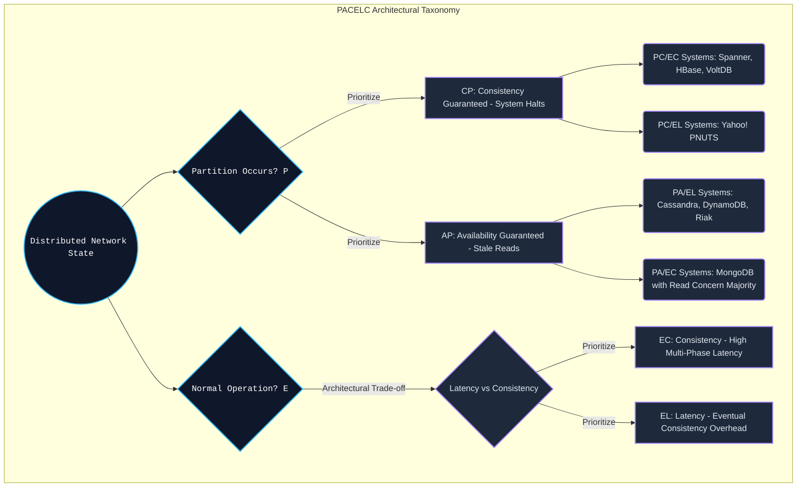

# The PACELC Theorem: Moving Beyond the CAP Theorem's Blind Spot in Distributed Systems Design

## Why CAP Alone Isn't Enough

The CAP theorem has shaped how we talk about distributed systems for two decades, and for good reason — it forces you to admit that consistency and availability can't both survive a network partition. But it has a gap that rarely gets discussed: CAP only says something when the network is actually partitioned. In a well-run data center, that's a rare event — network stability routinely runs above 99.999%. So what is a system actually trading off during the other 99.999% of the time?

That question is what Daniel Abadi (Yale University) set out to answer with PACELC. The theorem extends CAP with a second clause: if there's a **P**artition, a system must choose between **A**vailability and **C**onsistency — that's the CAP part. **E**lse, when the network is behaving normally, the system must choose between **L**atency and **C**onsistency. That second half is the part CAP never addresses, and it's arguably the one that matters more day-to-day, since partitions are rare but every single request has to deal with the latency/consistency trade-off.

This article works through PACELC in some depth — not just the one-line definition, but the actual mechanics behind it: quorum math, CPU cache coherence protocols, kernel I/O paths, and how systems like Google Spanner and Amazon Dynamo land on very different points along the latency-consistency spectrum.

**The core problem:** if you build a system that's always strongly consistent, you pay for it in latency, and that tax is unavoidable. Engineers already ask "what happens if the fiber gets cut?" — CAP prepared them for that. The harder, more common question is: "what happens when everything is running fine, but the product wants sub-millisecond responses?" PACELC gives you a framework for reasoning about that trade-off deliberately, instead of discovering it by accident in production.

**What this article covers:**
1. **CAP's illusion of purity** — no real system is simply AP or CP. PACELC pushes you to classify systems more precisely: PC/EC (Spanner), PA/EL (Cassandra, Dynamo), or PA/EC (MongoDB, depending on configuration).
2. **Latency is the price of consistency** — any attempt to keep state synchronized across multiple nodes runs into the speed of light. Latency is the physical bill you pay for consistency.
3. **The same trade-off shows up in hardware** — you don't need a WAN to see this; it's baked into the MESI protocol running your CPU's L1/L2 cache, enforced by memory fences.
4. **How Spanner cheats the problem** — to get about as close to PC/EC as physically possible, Spanner leans on atomic clocks and GPS (the TrueTime API) to bound the uncertainty in "now."

---

## Where CAP Stops Talking

Eric Brewer's CAP theorem says a distributed system can't simultaneously guarantee all three of Consistency ($C$), Availability ($A$), and Partition tolerance ($P$).

Since any network connected over more than a local link carries some risk of partition — a cut cable, a dead router, a misconfigured switch — $P$ isn't really optional. That leaves two practical choices when a partition happens:

- **CP (Consistency / Partition Tolerance):** on a network fault, the system stops answering rather than risk returning stale data.
- **AP (Availability / Partition Tolerance):** on a network fault, the system keeps answering, accepting that some answers might be out of date.

**Where CAP goes quiet:** it has nothing to say about the normal case — the network working as expected, which is true the vast majority of the time. If you classify databases purely by their CAP behavior, you end up ignoring a dimension that matters just as much in practice: how fast the system responds when there's no partition to worry about.

---

## PACELC: Putting Latency on the Same Footing as Consistency

Daniel Abadi's formalization is compact: if **P**, choose **A** or **C**; **E**lse, choose **L** or **C**. What it does structurally is turn a one-axis decision (CAP) into a two-axis one — latency gets treated as a first-class trade-off alongside consistency, not an afterthought.

The inverse relationship between $L$ and $C$ during normal operation (the "Else" branch) isn't a design choice you can engineer your way out of — it's a consequence of physics. To get real consistency, a server has to run a consensus protocol like Raft or Paxos, which means waiting for acknowledgments from other servers, possibly on other continents, before it can tell the client the write succeeded. That round trip is where the latency comes from.



### 1 Where Real Databases Land on the PACELC Grid

- **PC/EC (Spanner, CockroachDB, HBase):** during a network fault they stop serving to protect data integrity (PC). Under normal conditions, they still pay the cost of consensus or locking, so latency stays relatively high (EC).
- **PA/EL (Cassandra, DynamoDB, Riak):** during a fault they keep answering, even if the answer might be stale (PA). Under normal conditions, they're configured to respond without waiting for full replication, which is what gives them their low-latency reputation (EL — eventual consistency).
- **PA/EC (MongoDB, configuration-dependent):** answers during a fault, but under normal conditions waits for majority acknowledgment (Read Concern Majority) before responding.

---

## Quantifying the Latency/Consistency Trade-off with Quorum Math

The trade-off between $L$ and $C$ isn't just a qualitative story — quorum-based systems like Cassandra and Dynamo let you dial it in with actual numbers.

Three parameters define the shape of the system:
- $N$ — the replication factor.
- $W$ — write quorum: how many nodes must acknowledge a write before it's considered done.
- $R$ — read quorum: how many nodes must respond before a read result is considered reconciled.

For the system to guarantee it always returns the most recent write (strong consistency), the following has to hold:
$$ R + W > N $$
This condition guarantees $Set_{write} \cap Set_{read} \neq \emptyset$ — at least one node in every read overlaps with every write — which is what lets a Last-Write-Wins (LWW) scheme resolve conflicts correctly using timestamps.

**What it costs to pick consistency (the EC branch):** set $W=N$ — every replica must acknowledge before the write returns — and your expected write latency is governed by extreme value statistics: the overall latency equals whatever the *slowest* node in the write set takes to respond, which is effectively your p99 tail latency. If a replica in Frankfurt is stuck in a GC pause for 100ms, the entire write blocks for 100ms, regardless of how fast every other node was.

**What you get by picking latency (the EL branch):** set $W=1, R=1$ instead, and you drop the quorum overlap guarantee entirely. A write is considered complete as soon as it lands in one node's memory. Latency drops to roughly a millisecond. The cost is that you're now running eventual consistency, and the job of reconciling conflicting versions — typically via vector clocks — gets pushed up to the application layer.

---

## The Same Trade-off, Now Inside the CPU: MESI and Memory Fences

PACELC isn't just a WAN phenomenon. The exact same tension shows up inside a single CPU chip, at nanosecond scale.

On a multi-core processor, each core has its own private L1/L2 cache. When core 1 writes to a variable sitting in its L1 cache, core 2 doesn't see that update immediately — it's effectively a miniature distributed system, with its own version of "partition" caused by physical separation between cores.

The MESI protocol (Modified, Exclusive, Shared, Invalid) exists to keep cores' views of memory in sync. Enforced strictly — the hardware equivalent of the EC branch — it would stall the CPU constantly, since every write would need to broadcast an invalidation and wait for acknowledgment.

To avoid that cost, Intel and ARM chips add a **store buffer**. A core can drop a write into its store buffer and keep executing immediately — effectively zero latency from its own point of view. The catch is that other cores can now observe a stale value until that buffer drains, an effect that shows up as out-of-order-looking behavior from software's perspective.

When a programmer needs to restore consistency — pulling the system back toward the EC end — the tool is a memory fence (`MFENCE` and friends). The Rust snippet below shows both sides of this trade-off at the instruction level:

```rust
use std::sync::atomic::{AtomicUsize, Ordering};
use std::sync::Arc;
use std::thread;

// Illustrative code analyzing multi-core cache microarchitecture: PACELC L/C trade-off configuration
fn execute_el_ec_microarchitecture_tradeoff_simulation() {
    let shared_hardware_counter = Arc::new(AtomicUsize::new(0));

    // EC Branch (Else-Consistency) Simulation at the CPU Cache layer
    // Ordering::SeqCst: This instruction inserts an extremely strong hardware fence (MFENCE).
    // Forces the CPU to flush Store Buffers and synchronize the L1 cache. High Latency (L).
    let ec_clone = Arc::clone(&shared_hardware_counter);
    let cpu_thread_ec = thread::spawn(move || {
        ec_clone.fetch_add(1, Ordering::SeqCst); 
    });

    // EL Branch (Else-Latency) Simulation at the CPU Cache layer
    // Ordering::Relaxed: Bypasses the barrier; the core loads the instruction immediately (ultra-low latency).
    // Temporarily accepts a stale read on other cores (Eventual Consistency).
    let el_clone = Arc::clone(&shared_hardware_counter);
    let cpu_thread_el = thread::spawn(move || {
        el_clone.fetch_add(1, Ordering::Relaxed); 
    });

    cpu_thread_ec.join().unwrap();
    cpu_thread_el.join().unwrap();
}
```

---

## Chasing Zero Latency: Kernel Bypass with `io_uring`

Once you're trying to squeeze latency down toward zero on NVMe hardware, databases built for the EL end of the spectrum — ScyllaDB is a good example — start bypassing the operating system's I/O path altogether.

Instead of routing writes through `fsync()`, which keeps both the kernel and the CPU busy waiting, they use `io_uring` (a Linux kernel interface) paired with the `O_DIRECT` flag. The idea is to skip the OS page cache entirely, push the I/O straight to the hardware's DMA engine, and let the client get its acknowledgment the moment the request lands in the submission ring — not when the data is durably confirmed.

```cpp
#include <liburing.h>
#include <fcntl.h>
#include <unistd.h>

struct io_uring ultra_low_latency_ring;

void execute_el_asynchronous_direct_write(int block_device_fd, void* buffer, size_t size, off_t offset) {
    // Extract a submission queue entry (SQE)
    struct io_uring_sqe *sqe = io_uring_get_sqe(&ultra_low_latency_ring);
    
    // Write using O_DIRECT, completely bypassing the OS Page Cache
    io_uring_prep_write(sqe, block_device_fd, buffer, size, offset);
    io_uring_sqe_set_flags(sqe, IOSQE_ASYNC); 
    io_uring_submit(&ultra_low_latency_ring);
    
    // PACELC optimization (EL branch): Acknowledge the client immediately (early ack).
    // If the system ran EC, this thread would be blocked by io_uring_wait_cqe().
    fire_network_acknowledgment_early_response(); 
}
```

---

## Google Spanner and the TrueTime API: Chasing PC/EC as Far as Physics Allows

When Google's engineers set out to build Spanner — a globally distributed database aiming squarely at PC/EC — they ran into a problem that had nothing to do with software: relativity.

There's no such thing as a universal clock. A server in Tokyo and one in New York will disagree on the exact time by some number of milliseconds, simply because clock drift is real and unavoidable at that scale. Left unaddressed, that drift breaks the ordering guarantees the EC branch of PACELC depends on, producing what looks like a linearizability violation — transactions appearing to commit out of the order they actually happened.

Spanner's answer is the **TrueTime API**. Google equips its data centers with atomic clocks and GPS receivers, and instead of returning a single timestamp, TrueTime returns an interval of uncertainty: $TT.now() = [t_{earliest}, t_{latest}]$, with a typical uncertainty radius $\epsilon \approx 7ms$.

To keep consistency intact despite that uncertainty, Spanner adds the **Commit Wait** rule: before a transaction is allowed to declare itself committed, the coordinating server deliberately waits out a period of $2\epsilon$ (roughly 14 milliseconds). That deliberate pause is enough to absorb the worst-case clock uncertainty across the whole system, guaranteeing that transaction ordering can't be violated by clock skew. It's a fairly direct demonstration of the PACELC principle in action: pushing consistency as close to absolute as engineering allows still costs you latency — there's no way around that trade, only ways to manage it.

---
