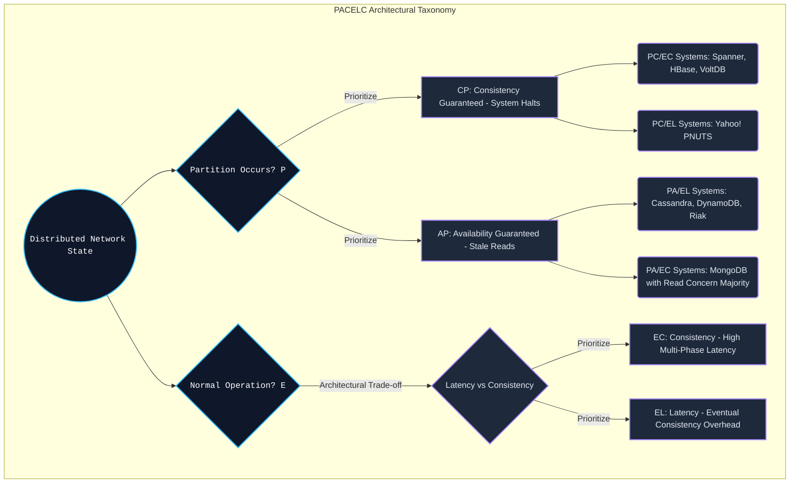

# PACELC Theorem - 分散システム設計におけるCAP境界の打破 (詳細技術レポート)

## エグゼクティブサマリー

CAP定理――一貫性、可用性、分断耐性――は、ここ20年ほど分散システムの設計論を支配してきた。ただ、この定理には見落とされがちな弱点がある。CAPが成立するのはネットワークが分断しているときだけだ、という点だ。実際のデータセンターのネットワーク稼働率は99.999%に達することも珍しくない。では、その正常な時間帯にシステムは何を天秤にかけているのか――CAP定理はこの問いには答えてくれない。

その空白を埋めるために出てきたのがPACELC定理で、イェール大学のDaniel Abadiが提唱した。内容はこうだ。分断($P$)が起きているなら、システムは可用性($A$)と一貫性($C$)のどちらかを選ばなければならない。そうでなければ($E$ - else、つまり平常時)、レイテンシ($L$)と一貫性($C$)のどちらを優先するかを選ばなければならない。

この記事ではPACELC定理を掘り下げ、レイテンシの限界を扱う数学モデル、CPUキャッシュのアーキテクチャ、OSのメモリ管理、そしてGoogle SpannerやAmazon DynamoDBのようなシステムが実際にこのパラメータをどう調整しているかを見ていく。

**背景にある問い:**
常に強い一貫性を保つシステムを作ろうとすると、レイテンシに重いペナルティがかかる。エンジニアが答えるべきなのは「ネットワークが切れたらどうするか」だけではない。「すべて正常に動いているのに、ユーザーがミリ秒未満の応答を求めている場合はどうするか」という、こちらのほうが実はよくある問いにも答える必要がある。PACELC定理は、この最適化問題を考えるための枠組みを提供してくれる。

**押さえておきたいポイント:**
1. **CAPだけで語れる話ではない。** 単純に「APです」「CPです」で済むシステムはほとんどない。PACELCはアーキテクトに、システムをPC/EC(Spanner)、PA/EL(Cassandra、Dynamo)、PA/EC(設定によるMongoDB)のように、もう一段細かく分類することを求める。
2. **レイテンシは一貫性のコストそのもの。** 複数ノードにまたがる状態を同期させようとする限り、光速による制約からは逃れられない。レイテンシ($L$)は一貫性($C$)を得るための物理的な代償だ。
3. **このトレードオフはハードウェアの中にもある。** レイテンシか一貫性かという選択は、WANだけの話ではなく、ローカルのCPUキャッシュ(L1/L2)のMESIプロトコルやメモリバリアのレベルでも現れる。
4. **Spannerの解決策はかなり大胆。** 完全な$PC/EC$を実現するため、Spannerは原子時計とGPSを組み合わせたTrueTime APIを使い、時間の不確かさそのものを扱う設計にした。

---

## システム理論の基礎とCAP定理の盲点

Eric Brewerが提唱したCAP定理は、分散システムが一貫性($C$)、可用性($A$)、分断耐性($P$)の三つを同時に完璧には満たせない、と主張する。

インターネットには常にケーブル切断やルーター故障といった分断のリスクがつきまとうので、$P$は実質的に避けられない前提になる。残る選択肢は二つだけだ。
- **CP(一貫性・分断耐性):** ネットワーク障害が起きたら、古いデータを返すくらいならサービスを止める。
- **AP(可用性・分断耐性):** ネットワーク障害が起きてもサービスを止めず、多少古いデータを返す可能性を受け入れる。

**CAPが黙っている部分:**
CAP定理は、ネットワークが正常なときに何が起きるかについては何も語らない。実際にはネットワークが安定している時間のほうが圧倒的に長く、CAPだけでデータベースを分類してしまうと、応答速度、つまりレイテンシという重要な軸をまるごと見落とすことになる。

---

## PACELCという発想: レイテンシも天秤に載せる

Daniel Abadiが定式化したPACELCは、「$P$が起きたら$A$か$C$を選べ。そうでなければ($E$lse)$L$か$C$を選べ」という一文に集約される。
つまりPACELCは、レイテンシ($L$)を一貫性($C$)と同じ土俵に引き上げた二次元の選択モデルだ。

平常時($E$)における$L$と$C$のトレードオフは、結局のところ光速という物理的な限界に行き着く。完全な一貫性($C$)を得るには、サーバーはRaftやPaxosのようなコンセンサスプロトコルを通じて、世界中の別のサーバーがディスクへの書き込みを終えるのを待ってから、ようやくユーザーに応答を返せる。この待ち時間がそのままレイテンシ($L$)として跳ね返ってくる。



### PACELCで見るデータベースの分類

- **PC/EC(Spanner、CockroachDB、HBase):** ネットワーク障害時はデータ保護のためサービスを止める(PC)。正常時もコンセンサスやロックを経由する必要があるため、レイテンシは高めになる(EC)。
- **PA/EL(Cassandra、DynamoDB、Riak):** ネットワーク障害時でも、多少古い結果であっても応答を返す(PA)。正常時も同期を待たずすぐに応答するよう設計されており、レイテンシは非常に低い(EL - 結果整合性)。
- **PA/EC(設定によるMongoDB):** 障害時は応答を返すが、正常時は同期(Read Concern Majorityなど)を待つ。

---

## クォーラム数学で見るレイテンシの両極端

$L$と$C$の間の厳しいトレードオフは、CassandraやDynamoのようなクォーラム型システムを見るとかなり具体的に定量化できる。

構造は次のパラメータで決まる。
- $N$: レプリケーションファクター。
- $W$: 書き込みを完了とみなすのに必要な成功数(Write Quorum)。
- $R$: 結果をマージするのに必要な読み取り数(Read Quorum)。

システムが常に最新のデータを返す(強い一貫性)ためには、次の代数条件を満たす必要がある。
$$ R + W > N $$
この条件が保証するのは $Set_{write} \cap Set_{read} \neq \emptyset$ ということで、この重なりがLast-Write-Winsのようなアルゴリズムで競合を解決し、最新のタイムスタンプを見つけ出す拠り所になる。

**ECブランチのレイテンシコスト:**
$W=N$(全ノードへの同期書き込み)を選んだ場合、書き込みレイテンシの期待値は極値統計の話になる。全体のレイテンシ $\mathbb{E}[L_{write}]$ は、クラスタの中でいちばん遅いノードの応答時間(いわゆるp99テールレイテンシ)によって決まってしまう。フランクフルトのノードがGCで100msかかっていれば、グローバルな書き込みリクエスト全体が100ms待たされる。

**ELブランチのレイテンシの強み:**
非同期の $W=1, R=1$ を選ぶと、上の条件式は満たされなくなる。その代わり、書き込みは単一ノードのメモリに乗った時点で完了扱いになり、レイテンシは1ミリ秒程度まで縮む。ただしこれは結果整合性の世界に足を踏み入れることを意味し、ベクタークロックによる整合性の調整はアプリケーション層に委ねられる。

---

## CPUのL1/L2キャッシュとメモリバリアのコスト

PACELCの話はWANの世界にとどまらない。CPUチップの内部のマイクロアーキテクチャにも同じ構図が現れる。

マルチコアCPUでは、各コアがそれぞれ独立したL1/L2キャッシュを持つ。あるコアが自分のL1キャッシュ上の変数を書き換えても、別のコアからはすぐには見えない。分散ネットワークのごく小さな縮図と言っていい。
MESI(Modified, Exclusive, Shared, Invalid)プロトコルは、まさにこのコア間の同期のために存在する。だが厳密に同期を取ろうとすると(ECブランチに相当)、CPUはそのたびに止まってしまう。

レイテンシを削るため(ELブランチ)、IntelやARMは **Store Buffer** という仕組みを用意している。CPUは書き込み命令をStore Bufferに投げ込んだ瞬間に次の処理へ進める(レイテンシはほぼゼロ)。ただしこの結果、他のコアからは一時的に古い値が見える(アウトオブオーダー実行の一種だ)。

一貫性を取り戻したい(ECに切り替えたい)場合、プログラマはメモリバリア(`MFENCE`など)を明示的に挿入する必要がある。
次のRust擬似コードは、このトレードオフをナノ秒単位で表している。

```rust
use std::sync::atomic::{AtomicUsize, Ordering};
use std::sync::Arc;
use std::thread;

// マルチコアキャッシュのマイクロアーキテクチャを例示するコード分析: L/C トレードオフ設定 (PACELC)
fn execute_el_ec_microarchitecture_tradeoff_simulation() {
    let shared_hardware_counter = Arc::new(AtomicUsize::new(0));

    // CPUキャッシュ層での EC Branch (Else-Consistency) シミュレーション
    // Ordering::SeqCst: この命令は非常に強力なハードウェアバリア (MFENCE) を挿入します。
    // CPUにStore Buffersをフラッシュさせ、L1キャッシュを同期させます。High Latency (L)。
    let ec_clone = Arc::clone(&shared_hardware_counter);
    let cpu_thread_ec = thread::spawn(move || {
        ec_clone.fetch_add(1, Ordering::SeqCst); 
    });

    // CPUキャッシュ層での EL Branch (Else-Latency) シミュレーション
    // Ordering::Relaxed: バリアをバイパスし、処理コアは命令を即座にロードします (Ultra-low Latency)。
    // 他のコアでの一時的な古い読み取り (Stale Read) を許容します (Eventual Consistency)。
    let el_clone = Arc::clone(&shared_hardware_counter);
    let cpu_thread_el = thread::spawn(move || {
        el_clone.fetch_add(1, Ordering::Relaxed); 
    });

    cpu_thread_ec.join().unwrap();
    cpu_thread_el.join().unwrap();
}
```

---

## Kernel Bypassと非同期I/O、io_uringが押し広げるELの限界

NVMe SSD上でのレイテンシ($L$)を極限まで縮めようとする過程で、ScyllaDBのようなEL寄りのデータベースは、OSの権限を横取りするようなI/Oアーキテクチャ、いわゆるKernel Bypassにたどり着いた。

KernelとCPUを忙しくさせる`fsync()`の代わりに、こうしたシステムは`io_uring`(Linuxのカーネルインターフェース)を`O_DIRECT`フラグと組み合わせて使う。以下の擬似コードが示すのは、OSのページキャッシュを完全に迂回し、I/Oストリームをハードウェアのdmaブロックへ直接叩き込み、メッセージがリングバッファに触れた瞬間にクライアントへ応答を返す、というELシステムらしい設計だ。

```cpp
#include <liburing.h>
#include <fcntl.h>
#include <unistd.h>

struct io_uring ultra_low_latency_ring;

void execute_el_asynchronous_direct_write(int block_device_fd, void* buffer, size_t size, off_t offset) {
    // SQEコマンドブロックを抽出
    struct io_uring_sqe *sqe = io_uring_get_sqe(&ultra_low_latency_ring);
    
    // O_DIRECTによる書き込み、OS Page Cacheを完全にバイパス
    io_uring_prep_write(sqe, block_device_fd, buffer, size, offset);
    io_uring_sqe_set_flags(sqe, IOSQE_ASYNC); 
    io_uring_submit(&ultra_low_latency_ring);
    
    // PACELC最適化 (ELブランチ): クライアントへ即座に確認応答 (Early Ack)。
    // システムがECで実行されている場合、このスレッドは io_uring_wait_cqe() によってブロックされます。
    fire_network_acknowledgment_early_response(); 
}
```

---

## 時間そのものを扱う: Google SpannerのTrueTime API

グローバルに分散したPC/ECシステムであるGoogle Spannerを作ろうとしたとき、設計者たちは相対性理論という、かなり厄介な問題に直面した。
絶対的な時間の基準というものは存在しない。東京のサーバーとニューヨークのサーバーの時計には、どうしても数ミリ秒のずれ(クロックドリフト)が生じる。このずれが、PACELCで言うところの$EC$の前提を壊してしまい、線形化可能性が崩れる原因になる。

Spannerはこれを **TrueTime API** で解決した。Googleは原子時計とGPS受信機をすべてのサーバーラックに組み込んでいる。TrueTimeは一点の時刻ではなく、誤差の範囲を返す。$TT.now() = [t_{earliest}, t_{latest}]$ という形で、この幅はおよそ $\epsilon \approx 7ms$ だ。

完全な$C$を守るために(その代償として$L$が膨らむとしても)、Spannerは **Commit Wait** というルールを設ける。どのサーバーも、トランザクションのコミットを宣言する前に、$2\epsilon$(だいたい14ミリ秒)だけ意図的に待つ。
この一見無駄に見える待ち時間が、地球規模での時刻のずれをまるごと吸収し、トランザクションの順序が壊れないことを保証している。ここに、PACELCが突きつけている一つの真実がある――絶対的な一貫性を求める限り、レイテンシという物理的な代償からは逃れられない、ということだ。

---
