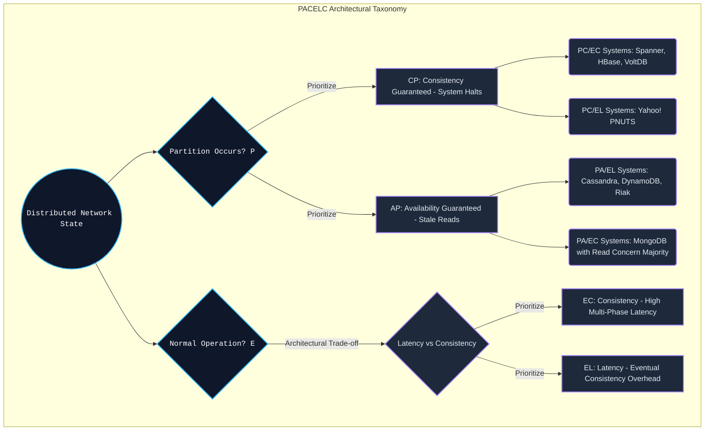

# PACELC Theorem - Vượt Ra Khỏi Ranh Giới CAP Trong Thiết Kế Hệ Thống Phân Tán (Báo Cáo Kỹ Thuật Chuyên Sâu)

## Tóm tắt Điều hành

Định lý CAP - Consistency, Availability, Partition Tolerance - đã định hình cách người ta nghĩ về hệ thống phân tán suốt hai thập kỷ qua. Nhưng nó có một điểm mù khá lớn: CAP chỉ thực sự có ý nghĩa khi mạng bị phân mảnh. Trong thực tế, các trung tâm dữ liệu hiện đại có độ ổn định mạng lên tới 99.999%. Vậy trong phần lớn thời gian mạng vẫn hoạt động bình thường đó, hệ thống đang đánh đổi điều gì? Đây là câu hỏi mà CAP không trả lời được.

Định lý PACELC, do Daniel Abadi (Đại học Yale) đề xuất, ra đời để lấp khoảng trống đó. Nội dung của nó khá gọn: nếu có phân mảnh ($P$), hệ thống phải chọn giữa tính sẵn sàng ($A$) và tính nhất quán ($C$); còn nếu không ($E$ - else, tức mạng bình thường), hệ thống phải chọn giữa độ trễ ($L$) và tính nhất quán ($C$).

Bài viết này sẽ đi sâu vào PACELC - từ các mô hình toán học về độ trễ, kiến trúc CPU cache, cách hệ điều hành quản lý bộ nhớ, cho đến cách những hệ thống như Google Spanner hay Amazon DynamoDB thực sự đánh đổi các tham số này trong thực tế.

**Vấn đề cốt lõi:**
Xây một hệ thống luôn giữ tính nhất quán tuyệt đối kéo theo một cái giá không nhỏ về độ trễ. Kỹ sư không chỉ cần trả lời "làm gì khi đứt cáp quang", mà còn phải trả lời một câu hỏi thường gặp hơn nhiều: "làm gì khi mọi thứ vẫn hoạt động bình thường nhưng người dùng muốn độ trễ dưới một mili giây?". PACELC cho ta một khung để suy nghĩ có hệ thống về bài toán đánh đổi này.

**Những điều rút ra được:**
1. **CAP không phải là bức tranh đầy đủ.** Hiếm có hệ thống nào chỉ đơn giản là AP hoặc CP. PACELC buộc người thiết kế phải phân loại kỹ hơn: PC/EC (Spanner), PA/EL (Cassandra, Dynamo), hay PA/EC (MongoDB tùy cấu hình).
2. **Độ trễ chính là cái giá của tính nhất quán.** Bất kỳ nỗ lực nào để đồng bộ trạng thái trên nhiều node đều bị giới hạn bởi tốc độ ánh sáng. Độ trễ ($L$) là chi phí vật lý phải trả để có tính nhất quán ($C$).
3. **Sự đánh đổi này xuất hiện cả trong phần cứng.** Chọn độ trễ hay tính nhất quán không chỉ là chuyện của mạng WAN - nó cũng hiện diện ngay trong giao thức MESI của bộ đệm CPU (L1/L2) và các hàng rào bộ nhớ.
4. **Cách giải quyết của Spanner khá táo bạo.** Để đạt $PC/EC$ gần như hoàn hảo, Spanner dùng đồng hồ nguyên tử kết hợp GPS qua TrueTime API, coi sự không chắc chắn về thời gian là một phần của thiết kế thay vì cố loại bỏ nó.

---

## Nền Tảng Lý Thuyết Hệ Thống và Điểm Mù Của Định Lý CAP

Định lý CAP, do Eric Brewer đề xuất, khẳng định một hệ thống phân tán không thể đạt cả ba thuộc tính cùng lúc: tính nhất quán ($C$), tính sẵn sàng ($A$), và khả năng chịu phân mảnh ($P$).

Vì mạng internet lúc nào cũng có nguy cơ phân mảnh - đứt cáp, hỏng router - nên $P$ gần như là điều kiện bắt buộc phải chấp nhận. Điều đó để lại đúng hai lựa chọn:
- **CP:** khi mạng lỗi, hệ thống thà từ chối phục vụ còn hơn trả về dữ liệu cũ.
- **AP:** khi mạng lỗi, hệ thống vẫn phục vụ nhưng chấp nhận khả năng trả về dữ liệu đã lỗi thời.

**Điều CAP không nói:**
CAP hoàn toàn im lặng về những gì xảy ra khi mạng hoạt động bình thường. Mà thực tế, phần lớn thời gian mạng không hề đứt gãy. Nếu chỉ phân loại database dựa trên CAP, ta sẽ bỏ sót một trục quan trọng: tốc độ phản hồi.

---

## PACELC: Đưa Độ Trễ Lên Bàn Cân

Daniel Abadi đã gói gọn ý tưởng này thành một câu: nếu có $P$, chọn $A$ hoặc $C$; nếu không ($E$lse), chọn $L$ hoặc $C$.
Nói cách khác, PACELC nâng độ trễ ($L$) lên ngang hàng với tính nhất quán ($C$), biến bài toán thành một ma trận hai chiều thay vì một trục duy nhất.

Ở trạng thái bình thường ($E$), mối quan hệ tỷ lệ nghịch giữa $L$ và $C$ suy cho cùng bắt nguồn từ giới hạn tốc độ ánh sáng. Để có tính nhất quán hoàn hảo, máy chủ phải chạy qua một giao thức đồng thuận như Raft hay Paxos, chờ nhiều máy chủ khác trên khắp thế giới ghi xong xuống đĩa rồi mới trả lời người dùng. Chuỗi chờ đợi đó chính là độ trễ ($L$) mà người dùng cảm nhận được.



### Phân Loại Database Theo PACELC

- **PC/EC (Spanner, CockroachDB, HBase):** khi mạng lỗi, chúng từ chối phục vụ để bảo vệ dữ liệu (PC). Khi mạng bình thường, chúng vẫn phải đi qua cơ chế đồng thuận hoặc khóa, nên độ trễ khá cao (EC).
- **PA/EL (Cassandra, DynamoDB, Riak):** khi mạng lỗi, chúng vẫn trả về kết quả dù có thể đã cũ (PA). Khi mạng bình thường, chúng trả lời ngay không chờ đồng bộ, tối ưu cho độ trễ cực thấp (EL - nhất quán cuối cùng).
- **PA/EC (MongoDB, tùy cấu hình):** trả về kết quả khi mạng lỗi, nhưng chờ đồng bộ (Read Concern Majority) khi mạng bình thường.

---

## Nhìn Sự Đánh Đổi Độ Trễ Qua Toán Học Quorum

Sự đánh đổi giữa $L$ và $C$ có thể được định lượng khá rõ ràng qua các hệ thống dạng quorum như Cassandra hay Dynamo.

Cấu trúc phụ thuộc vào ba tham số:
- $N$: hệ số nhân bản.
- $W$: số bản ghi thành công cần thiết để coi một lệnh ghi là hoàn tất (write quorum).
- $R$: số bản đọc cần thiết để hợp nhất kết quả (read quorum).

Để hệ thống luôn trả về dữ liệu mới nhất, nó phải thỏa điều kiện đại số sau:
$$ R + W > N $$
Điều kiện này đảm bảo $Set_{write} \cap Set_{read} \neq \emptyset$ - chính sự giao nhau đó là chỗ dựa để một thuật toán như Last-Write-Wins giải quyết xung đột dựa trên timestamp mới nhất.

**Chi phí độ trễ của nhánh EC:**
Nếu chọn $W=N$ (ghi đồng bộ vào mọi node), độ trễ ghi kỳ vọng sẽ bị chi phối bởi lý thuyết giá trị cực trị. Độ trễ tổng thể $\mathbb{E}[L_{write}]$ gần như bằng thời gian phản hồi của node chậm nhất trong cụm (p99 tail latency). Nếu một node ở Frankfurt đang bận GC mất 100ms, cả lệnh ghi toàn cầu sẽ bị treo 100ms theo.

**Lợi thế độ trễ của nhánh EL:**
Với cấu hình bất đồng bộ $W=1, R=1$, điều kiện trên không còn được đảm bảo nữa. Bù lại, một lệnh ghi được coi là hoàn tất ngay khi nó vào bộ nhớ của một node duy nhất, độ trễ có thể xuống gần 1 mili giây. Cái giá phải trả là hệ thống rơi vào trạng thái nhất quán cuối cùng, và việc đồng bộ (thường dùng vector clock) bị đẩy lên tầng ứng dụng xử lý.

---

## Bức Tường CPU Cache L1/L2 Và Chi Phí Của Hàng Rào Bộ Nhớ

PACELC không chỉ là chuyện của mạng WAN - cùng một kiểu đánh đổi cũng xuất hiện bên trong chính con chip CPU.

Trên một CPU đa nhân, mỗi lõi có bộ đệm L1/L2 riêng. Khi lõi số 1 thay đổi một biến trong cache của nó, lõi số 2 chưa thấy được ngay. Đây gần như là một phiên bản thu nhỏ của mạng phân tán.
Giao thức MESI (Modified, Exclusive, Shared, Invalid) tồn tại chính là để giữ các lõi đồng bộ với nhau. Nhưng nếu đồng bộ chặt chẽ (tương ứng với nhánh EC), CPU sẽ liên tục phải dừng lại chờ.

Để giảm độ trễ (nhánh EL), Intel và ARM đưa thêm **Store Buffer** vào thiết kế. CPU tiếp tục chạy ngay sau khi đẩy lệnh ghi vào Store Buffer, gần như không mất thời gian chờ. Nhưng điều này khiến các lõi khác có thể đọc phải giá trị cũ trong một khoảng ngắn - một dạng thực thi không theo thứ tự.

Khi lập trình viên cần khôi phục tính nhất quán (chuyển sang EC), họ phải chèn hàng rào bộ nhớ như `MFENCE`.
Đoạn mã giả Rust dưới đây minh họa sự đánh đổi này ở quy mô nano giây.

```rust
use std::sync::atomic::{AtomicUsize, Ordering};
use std::sync::Arc;
use std::thread;

// Phân tích mã minh họa vi kiến trúc bộ đệm đa lõi: Cấu hình đánh đổi L/C (PACELC)
fn execute_el_ec_microarchitecture_tradeoff_simulation() {
    let shared_hardware_counter = Arc::new(AtomicUsize::new(0));

    // EC Branch (Else-Consistency) Simulation tại tầng CPU Cache
    // Ordering::SeqCst: Lệnh này chèn Hardware Fence (MFENCE) cực mạnh.
    // Ép CPU xả sạch Store Buffers, đồng bộ L1 cache. High Latency (L).
    let ec_clone = Arc::clone(&shared_hardware_counter);
    let cpu_thread_ec = thread::spawn(move || {
        ec_clone.fetch_add(1, Ordering::SeqCst); 
    });

    // EL Branch (Else-Latency) Simulation tại tầng CPU Cache
    // Ordering::Relaxed: Bypass rào cản, lõi xử lý nạp lệnh ngay lập tức (Ultra-low Latency).
    // Chấp nhận Stale Read tạm thời ở các lõi khác (Eventual Consistency).
    let el_clone = Arc::clone(&shared_hardware_counter);
    let cpu_thread_el = thread::spawn(move || {
        el_clone.fetch_add(1, Ordering::Relaxed); 
    });

    cpu_thread_ec.join().unwrap();
    cpu_thread_el.join().unwrap();
}
```

---

## Kernel Bypass Và io_uring: Đẩy Giới Hạn Của EL Xa Hơn

Trong nỗ lực kéo độ trễ trên NVMe SSD về gần 0, những database thiên về EL như ScyllaDB đã đi tới kiến trúc I/O bỏ qua luôn quyền kiểm soát của hệ điều hành - Kernel Bypass.

Thay vì dùng `fsync()` vốn khiến cả kernel lẫn CPU bận rộn, các hệ thống này dùng `io_uring` (một API của kernel Linux) kết hợp cờ `O_DIRECT`. Đoạn mã giả dưới đây cho thấy cách một hệ thống EL bỏ hẳn page cache của OS, bắn thẳng luồng I/O vào khối DMA phần cứng, và trả lời client ngay khi thông điệp vừa chạm tới hàng đợi ring-buffer.

```cpp
#include <liburing.h>
#include <fcntl.h>
#include <unistd.h>

struct io_uring ultra_low_latency_ring;

void execute_el_asynchronous_direct_write(int block_device_fd, void* buffer, size_t size, off_t offset) {
    // Trích xuất một khối lệnh SQE
    struct io_uring_sqe *sqe = io_uring_get_sqe(&ultra_low_latency_ring);
    
    // Ghi bằng O_DIRECT, hoàn toàn vượt quyền OS Page Cache
    io_uring_prep_write(sqe, block_device_fd, buffer, size, offset);
    io_uring_sqe_set_flags(sqe, IOSQE_ASYNC); 
    io_uring_submit(&ultra_low_latency_ring);
    
    // Tối ưu PACELC (Nhánh EL): Báo nhận cho Client lập tức (Early Ack).
    // Nếu hệ thống chạy EC, luồng này sẽ bị block bởi io_uring_wait_cqe().
    fire_network_acknowledgment_early_response(); 
}
```

---

## Bẻ Cong Thời Gian: TrueTime API Của Google Spanner

Khi xây dựng Google Spanner - một hệ thống PC/EC phân tán trên phạm vi toàn cầu - các kỹ sư của Google vấp phải một vấn đề khá triết học: thuyết tương đối của Einstein.
Không tồn tại một mốc thời gian tuyệt đối chung cho mọi nơi. Một máy chủ ở Tokyo và một máy chủ ở New York luôn có đồng hồ lệch nhau vài mili giây. Độ lệch này đủ để phá vỡ giả định $EC$ mà PACELC đặt ra, và có thể gây ra những bất thường trong tính tuyến tính của giao dịch.

Spanner giải quyết vấn đề này bằng **TrueTime API**. Google gắn đồng hồ nguyên tử và bộ thu GPS vào từng tủ rack máy chủ. TrueTime không trả về một thời điểm cụ thể, mà trả về một khoảng sai số: $TT.now() = [t_{earliest}, t_{latest}]$, với bán kính khoảng $\epsilon \approx 7ms$.

Để giữ được tính nhất quán tuyệt đối (dù phải đánh đổi bằng độ trễ), Spanner áp dụng quy tắc **Commit Wait**: trước khi tuyên bố một giao dịch đã lưu thành công, mọi máy chủ đều phải chủ động chờ một khoảng đúng bằng $2\epsilon$ (khoảng 14 mili giây).
Khoảng chờ tưởng như lãng phí này thực chất hấp thụ hết mọi sai lệch thời gian có thể xảy ra trên phạm vi toàn cầu, đảm bảo thứ tự giao dịch không bị xáo trộn. Đây cũng là minh chứng rõ nhất cho một sự thật mà PACELC chỉ ra: muốn có tính nhất quán tuyệt đối, bạn luôn phải trả giá bằng độ trễ.

---
