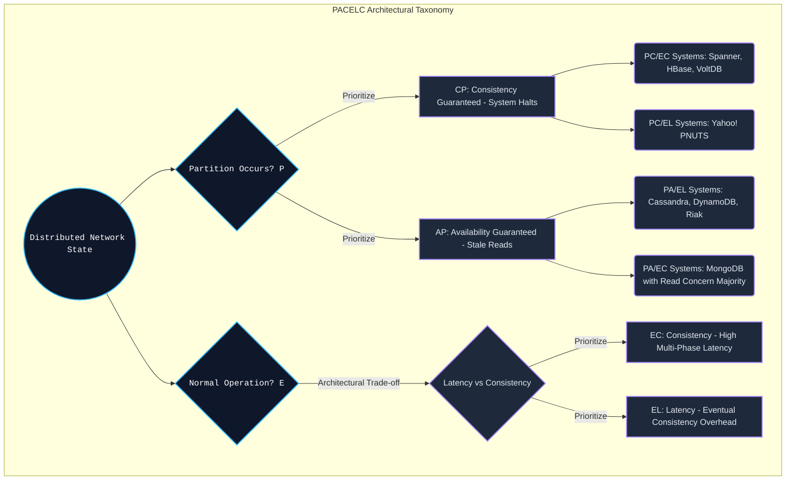

# PACELC Theorem - Vượt Ra Khỏi Ranh Giới CAP Trong Thiết Kế Hệ Thống Phân Tán

## Tóm tắt Điều hành (Executive Summary)

Định lý CAP (Consistency, Availability, Partition Tolerance) đã định hình cách người ta nghĩ về hệ thống phân tán suốt hai thập kỷ qua. Nhưng nó có một lỗ hổng khá nghiêm trọng: CAP chỉ nói lên điều gì đó khi mạng lưới bị phân mảnh (Partition). Trong thực tế, các trung tâm dữ liệu hiện đại có độ ổn định mạng xấp xỉ 99.999%. Vậy phần lớn thời gian còn lại, khi mạng vẫn ổn, hệ thống đang đánh đổi cái gì?

**PACELC**, do Daniel Abadi (Đại học Yale) đề xuất, ra đời để trả lời câu hỏi đó. Phát biểu của nó khá gọn: nếu có phân mảnh ($P$), hệ thống phải chọn giữa tính sẵn sàng ($A$) và tính nhất quán ($C$); còn nếu mạng vẫn bình thường ($E$ - Else), hệ thống phải chọn giữa độ trễ ($L$ - Latency) và tính nhất quán ($C$).

Bài viết này đi sâu vào PACELC — từ mô hình toán học lượng hóa độ trễ, kiến trúc CPU cache, quản lý bộ nhớ hệ điều hành, cho đến cách các hệ thống lớn như Google Spanner hay Amazon Dynamo thực sự đánh đổi các tham số này trong sản xuất.

**Vấn đề cốt lõi (Problem Statement):**
Trong thực tế vận hành, xây một hệ thống luôn nhất quán tuyệt đối (strong consistency) kéo theo một cái giá không nhỏ về độ trễ. Kỹ sư hệ thống không chỉ cần trả lời "làm gì khi đứt cáp quang", mà còn phải trả lời một câu hỏi khó hơn: "làm gì khi mọi thứ đang chạy bình thường nhưng người dùng đòi thời gian phản hồi dưới 1 mili-giây?". PACELC chính là khung lý thuyết giúp trả lời câu hỏi thứ hai này.

**Bài học và Kiến thức rút ra (Lessons Learned):**
1. **CAP dễ gây ngộ nhận:** không hệ thống nào chỉ đơn thuần là AP hay CP. PACELC buộc kiến trúc sư phải xếp hệ thống vào các nhóm cụ thể hơn — PC/EC (Spanner), PA/EL (Cassandra, Dynamo), hoặc PA/EC (MongoDB, tùy cấu hình).
2. **Độ trễ chính là cái giá của tính nhất quán:** mọi nỗ lực đồng bộ trạng thái trên một mạng lưới nhiều điểm đều bị giới hạn bởi tốc độ ánh sáng. Latency (L) là chi phí vật lý không thể tránh của Consistency (C).
3. **Sự đánh đổi này không chỉ ở tầng WAN:** nó xuất hiện ngay trong giao thức MESI của CPU cache nội bộ (L1/L2), thông qua các memory fence.
4. **Giải pháp táo bạo của Spanner:** để đạt $PC/EC$ gần như hoàn hảo, Spanner dùng đồng hồ nguyên tử (Atomic Clocks) và định vị GPS (TrueTime API) để bù trừ cho sự bất định của thời gian giữa các máy chủ toàn cầu.

---

## Nền Tảng Lý Thuyết Hệ Thống và Điểm Mù Của Định Lý CAP

Định lý CAP (do Eric Brewer đề xuất) phát biểu rằng một hệ thống phân tán không thể đồng thời đạt cả ba: tính nhất quán ($C$), tính sẵn sàng ($A$), và khả năng chịu phân mảnh ($P$).

Vì mạng internet lúc nào cũng tiềm ẩn rủi ro phân mảnh (đứt cáp, hỏng router), $P$ gần như là một hằng số bắt buộc phải chấp nhận. Vậy nên lựa chọn thực tế chỉ còn lại hai:
- **CP (Consistency / Partition Tolerance):** khi có lỗi mạng, hệ thống ngừng phục vụ để tránh trả về dữ liệu cũ.
- **AP (Availability / Partition Tolerance):** khi có lỗi mạng, hệ thống vẫn phục vụ nhưng có thể trả dữ liệu lỗi thời.

**Điểm mù của CAP:**
Vấn đề là CAP hoàn toàn im lặng về trạng thái bình thường — tức 99.999% thời gian còn lại khi mạng không đứt. Nếu chỉ dựa vào CAP để phân loại một cơ sở dữ liệu, ta sẽ bỏ lỡ một chiều quan trọng khác: tốc độ phản hồi thực tế.

---

## Mệnh Đề PACELC: Đưa Độ Trễ Lên Bàn Cân

Daniel Abadi phát biểu PACELC gọn trong một câu: nếu $P$, chọn $A$ hoặc $C$; ngược lại ($E$lse), chọn $L$ hoặc $C$.
Nói cách khác, mô hình này buộc kỹ sư nhìn vào một ma trận hai chiều, trong đó độ trễ ($L$) được đặt ngang hàng với tính nhất quán ($C$).

Mối quan hệ tỷ lệ nghịch giữa $L$ và $C$ trong điều kiện bình thường (nhánh Else) bắt nguồn từ một giới hạn vật lý đơn giản: tốc độ ánh sáng. Để đạt tính nhất quán hoàn hảo, máy chủ phải chạy qua các giao thức đồng thuận (Raft, Paxos), chờ hàng chục máy chủ khác trên toàn cầu xác nhận đã ghi xuống đĩa rồi mới trả lời người dùng. Chuỗi bước này tự nhiên kéo độ trễ ($L$) lên cao.



### Phân Loại Các Hệ Quản Trị Cơ Sở Dữ Liệu Theo PACELC

- **PC/EC (Spanner, CockroachDB, HBase):** khi mạng lỗi, các hệ này từ chối phục vụ để bảo vệ dữ liệu (PC). Khi mạng bình thường, chúng vẫn phải chạy qua cơ chế đồng thuận hoặc khóa, nên độ trễ vẫn cao (EC).
- **PA/EL (Cassandra, DynamoDB, Riak):** khi mạng lỗi, vẫn trả kết quả dù có thể cũ (PA). Khi mạng bình thường, hệ thống trả lời ngay không chờ đồng bộ, tối ưu độ trễ tối đa (EL - nhất quán cuối cùng).
- **PA/EC (MongoDB, tùy cấu hình):** vẫn phục vụ khi mạng lỗi, nhưng khi mạng bình thường lại chờ đồng bộ (Read Concern Majority).

---

## Phân Tích Lượng Hóa Độ Trễ Bằng Toán Học Quorum

Sự đánh đổi giữa $L$ và $C$ có thể lượng hóa khá chính xác qua hệ thống quorum (như trong Cassandra hay Dynamo).

Ba tham số chi phối cấu hình:
- $N$: hệ số nhân bản (Replication Factor).
- $W$: số bản ghi cần thành công (Write Quorum) để coi lệnh ghi là hoàn tất.
- $R$: số bản đọc cần thiết (Read Quorum) để hợp nhất kết quả.

Để hệ thống luôn trả về dữ liệu mới nhất (strong consistency), nó phải thỏa điều kiện đại số sau:
$$ R + W > N $$
Điều kiện $Set_{write} \cap Set_{read} \neq \emptyset$ này đảm bảo luôn có ít nhất một nút chung giữ được timestamp ghi mới nhất, và thuật toán Last-Write-Wins (LWW) dựa vào đó để giải quyết xung đột.

**Chi phí độ trễ của nhánh EC (Else - Consistency):**
Nếu chọn cấu hình $W=N$ (ghi đồng bộ vào mọi nút), độ trễ kỳ vọng sẽ bị chi phối bởi lý thuyết giá trị cực trị (Extreme Value Theory): $\mathbb{E}[L_{write}]$ gần như bằng thời gian phản hồi của nút chậm nhất trong toàn mạng lưới (tail latency ở p99).
Nếu một nút ở Frankfurt đang bận garbage collection mất 100ms, cả lệnh ghi toàn cầu sẽ bị treo đúng 100ms đó.

**Lợi thế độ trễ của nhánh EL (Else - Latency):**
Ngược lại, với cấu hình bất đồng bộ $W=1, R=1$, hệ thống không còn giữ được ràng buộc đại số ở trên. Thao tác ghi coi như hoàn tất ngay khi dữ liệu vào RAM của một nút duy nhất, độ trễ gần như tiệm cận 1 mili-giây. Đổi lại, hệ thống rơi vào trạng thái nhất quán cuối cùng, và bài toán đồng bộ (thường giải bằng vector clock) bị đẩy lên tầng ứng dụng.

---

## Bức Tường CPU L1/L2 Cache Và Chi Phí Của Memory Fence

PACELC không chỉ là chuyện của mạng WAN — cùng một kiểu đánh đổi xảy ra ngay bên trong chip xử lý.

Trong một CPU đa nhân, mỗi lõi có cache L1/L2 riêng. Khi lõi 1 sửa một biến trên cache của nó, lõi 2 chưa chắc thấy ngay lập tức. Đây gần như là một phiên bản thu nhỏ của mạng phân tán, chỉ khác về tỷ lệ.
Giao thức MESI (Modified, Exclusive, Shared, Invalid) tồn tại để giữ các lõi đồng bộ với nhau. Nhưng nếu siết chặt giao thức này (tương đương chọn nhánh EC), CPU sẽ liên tục bị stall.

Để tối ưu độ trễ (nhánh EL), Intel và ARM thêm vào **store buffer**: CPU tiếp tục chạy ngay sau khi đẩy lệnh ghi vào buffer, độ trễ gần như bằng không. Cái giá là các lõi khác có thể đọc phải giá trị cũ do thực thi out-of-order.

Muốn khôi phục tính nhất quán (quay về EC), lập trình viên phải chèn memory fence (`MFENCE`).
Đoạn mã giả Rust dưới đây minh họa sự đánh đổi này ở quy mô nano-giây:

```rust
use std::sync::atomic::{AtomicUsize, Ordering};
use std::sync::Arc;
use std::thread;

// Phân tích mã minh họa vi kiến trúc bộ đệm đa lõi: Cấu hình đánh đổi L/C (PACELC)
fn execute_el_ec_microarchitecture_tradeoff_simulation() {
    let shared_hardware_counter = Arc::new(AtomicUsize::new(0));

    // EC Branch (Else-Consistency) Simulation tại tầng CPU Cache
    // Ordering::SeqCst: Lệnh này chèn Hardware Fence (MFENCE) cực mạnh.
    // Ép CPU xả sạch Store Buffers, đồng bộ L1 cache. High Latency (L).
    let ec_clone = Arc::clone(&shared_hardware_counter);
    let cpu_thread_ec = thread::spawn(move || {
        ec_clone.fetch_add(1, Ordering::SeqCst); 
    });

    // EL Branch (Else-Latency) Simulation tại tầng CPU Cache
    // Ordering::Relaxed: Bypass rào cản, lõi xử lý nạp lệnh ngay lập tức (Ultra-low Latency).
    // Chấp nhận Stale Read tạm thời ở các lõi khác (Eventual Consistency).
    let el_clone = Arc::clone(&shared_hardware_counter);
    let cpu_thread_el = thread::spawn(move || {
        el_clone.fetch_add(1, Ordering::Relaxed); 
    });

    cpu_thread_ec.join().unwrap();
    cpu_thread_el.join().unwrap();
}
```

---

## Kernel Bypass Và `io_uring` (Đẩy Giới Hạn Của Nhánh EL)

Trong nỗ lực kéo độ trễ ($L$) trên NVMe SSD gần về 0, các cơ sở dữ liệu thiên về EL (như ScyllaDB) đã chuyển sang các kiến trúc I/O bỏ qua hệ điều hành (kernel bypass).

Thay vì gọi `fsync()` và để kernel cùng CPU bận rộn xử lý, họ dùng `io_uring` (API của Linux kernel) kết hợp cờ `O_DIRECT`. Đoạn mã giả dưới đây cho thấy một hệ thống thiên EL bỏ qua hoàn toàn OS page cache, bắn I/O thẳng vào khối DMA phần cứng, và trả lời client ngay khi thông điệp vừa chạm vào ring buffer.

```cpp
#include <liburing.h>
#include <fcntl.h>
#include <unistd.h>

struct io_uring ultra_low_latency_ring;

void execute_el_asynchronous_direct_write(int block_device_fd, void* buffer, size_t size, off_t offset) {
    // Trích xuất một khối lệnh SQE
    struct io_uring_sqe *sqe = io_uring_get_sqe(&ultra_low_latency_ring);
    
    // Ghi bằng O_DIRECT, hoàn toàn vượt quyền OS Page Cache
    io_uring_prep_write(sqe, block_device_fd, buffer, size, offset);
    io_uring_sqe_set_flags(sqe, IOSQE_ASYNC); 
    io_uring_submit(&ultra_low_latency_ring);
    
    // Tối ưu PACELC (Nhánh EL): Báo nhận cho Client lập tức (Early Ack).
    // Nếu hệ thống chạy EC, luồng này sẽ bị block bởi io_uring_wait_cqe().
    fire_network_acknowledgment_early_response(); 
}
```

---

## Bẻ Cong Thời Gian: TrueTime API Của Google Spanner (Trường Hợp Cực Đoan PC/EC)

Khi xây dựng Google Spanner — một cơ sở dữ liệu PC/EC phân tán toàn cầu — các kỹ sư phải đối mặt với một vấn đề khá triết học: thuyết tương đối của Einstein.

Không có một mốc thời gian tuyệt đối chung cho toàn hệ thống. Một máy chủ ở Tokyo và một máy chủ ở New York sẽ luôn lệch đồng hồ vài mili-giây (clock drift). Sự lệch pha này, nếu không xử lý, sẽ phá vỡ tính nhất quán ở nhánh EC và sinh ra các xung đột ghi vi phạm tính tuyến tính hóa (linearizability).

Spanner giải quyết bằng **TrueTime API**. Google gắn đồng hồ nguyên tử và bộ thu GPS vào từng rack máy chủ. Thay vì trả về một mốc thời gian cố định, TrueTime trả về một khoảng sai số: $TT.now() = [t_{earliest}, t_{latest}]$, với bán kính sai số $\epsilon \approx 7ms$.

Để bảo toàn tính nhất quán tuyệt đối (chấp nhận đánh đổi độ trễ), Spanner áp dụng **Commit Wait Rule**: trước khi công bố một giao dịch đã được ghi, mọi server phải chủ động chờ (sleep) một khoảng thời gian đúng bằng $2\epsilon$ (khoảng 14 mili-giây).

Khoảng chờ có chủ đích này hấp thụ mọi sai lệch thời gian tương đối giữa các máy chủ trên toàn cầu, đảm bảo thứ tự giao dịch không thể bị xáo trộn. Đây có lẽ là minh chứng rõ ràng nhất cho nguyên lý cốt lõi của PACELC: tính nhất quán tuyệt đối luôn đòi một cái giá cụ thể, và cái giá đó chính là độ trễ.
