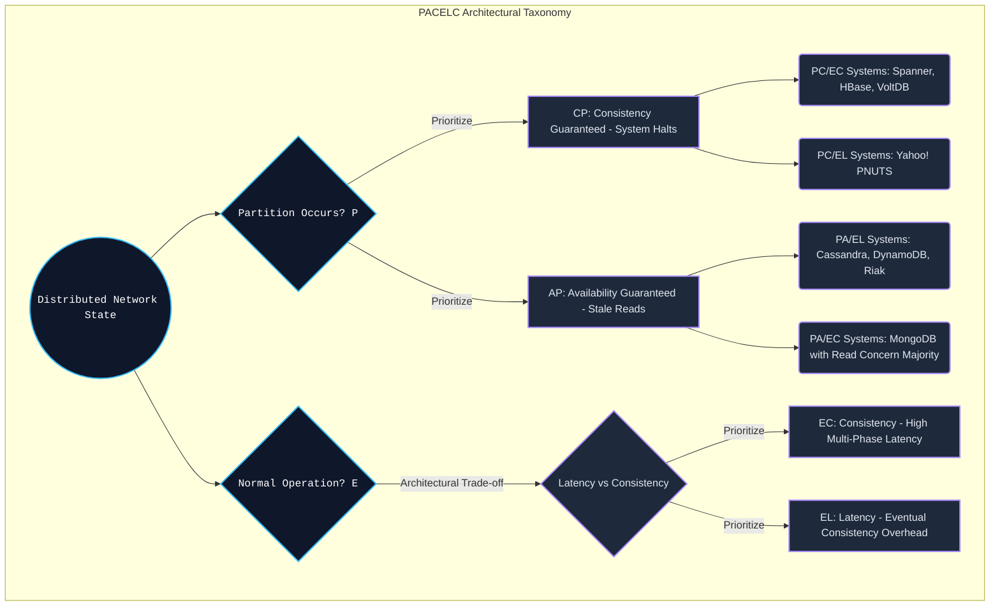

# 27: PACELC Theorem: Mở rộng định lý CAP

## Nền tảng Lý thuyết Hệ thống và Phân tích Cấu trúc Vi mô của Định lý CAP

Trong lĩnh vực khoa học máy tính và lý thuyết hệ thống phân tán, việc xây dựng các kiến trúc cơ sở dữ liệu có khả năng mở rộng trên phạm vi toàn cầu đòi hỏi sự thấu hiểu sâu sắc về các giới hạn vật lý và ranh giới toán học của việc truyền tải thông tin. Định lý CAP, được khởi xướng như một phỏng đoán thiết kế bởi Tiến sĩ Eric Brewer vào năm 2000 và sau đó được chứng minh chặt chẽ về mặt toán học bởi Seth Gilbert và Nancy Lynch thuộc Viện Công nghệ Massachusetts (MIT) vào năm 2002, đã định hình lại toàn bộ nền tảng phát triển của các cơ sở dữ liệu NoSQL trong hơn hai thập kỷ qua. Mệnh đề cốt lõi của định lý CAP thiết lập một định đề bất khả thi: một hệ thống lưu trữ trạng thái phân tán không thể đồng thời đảm bảo ba thuộc tính nền tảng bao gồm Tính nhất quán (Consistency - $C$), Tính sẵn sàng (Availability - $A$), và Khả năng chịu đựng sự phân mảnh mạng (Partition tolerance - $P$). Để mô hình hóa cấu trúc này một cách chính xác, chúng ta có thể biểu diễn mạng lưới phân tán thông qua một đồ thị có hướng và trọng số $\mathcal{G} = (V, E)$, trong đó tập đỉnh $V = \{v_1, v_2, \dots, v_n\}$ đại diện cho các máy chủ lưu trữ (node), và tập cạnh $E$ đại diện cho các liên kết mạng vật lý hoặc logic kết nối các đỉnh này. Trong một mô hình mạng bất đồng bộ (asynchronous network model), nơi thông điệp có thể bị trễ với một khoảng thời gian hữu hạn nhưng không xác định trước, một sự phân mảnh mạng (network partition) xảy ra khi đồ thị $\mathcal{G}$ bị đứt gãy thành ít nhất hai thành phần liên thông riêng biệt $\mathcal{G}_1$ và $\mathcal{G}_2$, sao cho phép giao của chúng là tập rỗng $\mathcal{G}_1 \cap \mathcal{G}_2 = \emptyset$, và không tồn tại bất kỳ đường dẫn hợp lệ nào định tuyến thông điệp từ một đỉnh $v_i \in \mathcal{G}_1$ tới một đỉnh $v_j \in \mathcal{G}_2$. Khi hiện tượng đứt gãy đồ thị này xảy ra do sự cố phần cứng, lỗi cấu hình bộ định tuyến BGP hoặc suy hao quang học trên các tuyến cáp ngầm dưới đại dương, hệ thống bắt buộc phải đối mặt với một nút thắt quyết định cấp bách. Nếu một client thực hiện truy vấn đọc dữ liệu tới một node nằm trong thành phần $\mathcal{G}_2$ trong khi phiên bản dữ liệu mới nhất vừa được ghi nhận thành công và xác thực tại $\mathcal{G}_1$, thuật toán định tuyến phân tán phải đưa ra một trong hai cấu hình khôi phục: từ chối thực thi yêu cầu đọc hoặc đình trệ toàn bộ hệ thống bằng một vòng lặp khóa (blocking spinlock) nhằm chờ phục hồi mạng, qua đó bảo toàn tính nhất quán tuyệt đối của hệ thống tuyến tính (ưu tiên $CP$), hoặc phản hồi truy vấn bằng cách sử dụng phiên bản dữ liệu lưu trữ cục bộ có khả năng đã lỗi thời, chấp nhận vi phạm tính nhất quán để giữ cho hệ thống tiếp tục hoạt động, hoàn thành yêu cầu phản hồi máy khách (ưu tiên $AP$). Tính nhất quán được định nghĩa trong bối cảnh phân tích vi mô của CAP không phải là tính nhất quán cơ sở dữ liệu truyền thống theo chuẩn ACID (Atomicity, Consistency, Isolation, Durability), mà cụ thể là Tính nhất quán tuyến tính (Linearizability) của một chuỗi thao tác bộ nhớ nguyên tử. Khái niệm này có thể được phát biểu toán học một cách chặt chẽ: Một lịch sử thực thi các giao dịch không đồng bộ $H$ được coi là nhất quán tuyến tính khi và chỉ khi nó hoàn toàn đẳng cấu với một lịch sử tuần tự hợp lệ $S$, trong đó mỗi phép toán đọc (Read) và ghi (Write) dường như chiếm một điểm biểu diễn nguyên tử duy nhất trên trục thời gian thực (wall-clock time) và mọi phép đọc đều phải trả về kết quả chính xác của phép ghi hoàn thành gần nhất trước đó. Do bản chất vật lý của sự phân mảnh mạng làm cắt đứt việc lan truyền trạng thái, hệ thống không thể lan truyền xung tín hiệu ánh sáng từ $\mathcal{G}_1$ sang $\mathcal{G}_2$, dẫn đến việc định lý CAP chỉ ra rằng hệ thống không thể giả lập một bộ nhớ ảo chia sẻ duy nhất trong khi vẫn tiếp tục duy trì hoạt động để phục vụ vô điều kiện. Cội nguồn toán học sâu xa đằng sau sự bất khả thi này cũng liên quan chặt chẽ đến định lý vô nghiệm FLP Impossibility nổi tiếng do Fischer, Lynch, và Paterson công bố năm 1985. Định lý FLP chứng minh rằng trong một hệ thống hoàn toàn bất đồng bộ (asynchronous system) không tồn tại các ranh giới trên xác định về độ trễ truyền thông $\Delta t$, không thể tồn tại bất kỳ một thuật toán đồng thuận tất định (deterministic consensus algorithm) nào có thể đạt được sự thỏa thuận trạng thái chung ngay cả khi chỉ có duy nhất một tiến trình (single node) có thể gặp lỗi dừng máy (crash-stop fault). Sự tương quan giữa FLP và định lý CAP nhấn mạnh rằng các thiết kế phân tán luôn hoạt động dựa trên các ma trận xác suất chịu lỗi phức tạp và việc từ bỏ tính sẵn sàng trong kịch bản phân vùng mạng diện rộng là hệ quả tất yếu và mang tính toán học của việc bảo vệ tập hợp sự thật máy tính (computational ground truth).

## Giới hạn của Lăng kính CAP và Sự Ra Đời của Mệnh Đề PACELC

Bất chấp tầm ảnh hưởng to lớn, lăng kính phân tích CAP đã bộc lộ một điểm mù tư duy vô cùng nghiêm trọng trong thực tiễn thiết kế kiến trúc kỹ thuật phần mềm: các hệ thống phân tán thường dành phần lớn vòng đời vận hành vật lý của chúng ở trạng thái bình thường (không có Partition). Theo các thống kê học thuật và báo cáo viễn trắc từ các trung tâm dữ liệu siêu quy mô (hyperscale data centers) của Google và Amazon Web Services, độ tin cậy của phần cứng mạng hiện đại cho phép thời gian hoạt động ổn định chiếm tỷ lệ cực kỳ lớn, tiệm cận mức $99.999\%$ (Five Nines) trên tổng thời gian vòng đời phần mềm. Trong phần lớn khoảng thời gian này, định lý CAP hoàn toàn im lặng, không cung cấp bất kỳ khuôn khổ lý thuyết nào để đo lường và diễn giải các sự thỏa hiệp cấu trúc bắt buộc khi đồ thị mạng $\mathcal{G}$ kết nối liên thông hoàn hảo và các bản tin mạng luân chuyển tự do không bị tắc nghẽn. Thiếu sót mang tính nguyên lý này đã dẫn đến một sự ngộ nhận phổ biến và cứng nhắc trong việc dán nhãn phân loại các nền tảng dữ liệu hiện đại, khi các kỹ sư hệ thống thường có xu hướng quy nạp cứng nhắc các công nghệ cơ sở dữ liệu phân tán vào hai không gian vector trực giao $CP$ (như HBase, MongoDB ở cấu hình chặt chẽ) hoặc $AP$ (như Apache Cassandra, Amazon Dynamo), bất chấp việc hành vi cấu trúc, thuật toán đồng bộ, và hiệu năng cấp thấp của chúng trong điều kiện không phân mảnh mạng là những ranh giới hoàn toàn biệt lập. Nhằm khỏa lấp khoảng trống học thuật cốt lõi này, Giáo sư Daniel Abadi thuộc Đại học Yale đã chính thức công bố một phương trình đánh đổi toàn diện và chi tiết hơn vào năm 2012 dưới danh xưng định lý PACELC. Cấu trúc ngữ nghĩa của định lý PACELC được xây dựng từ hai khối logic có điều kiện đan xen phức tạp nhưng vô cùng chính xác: "If there is a Partition ($P$), how does the system trade off between Availability ($A$) and Consistency ($C$); Else ($E$), when the system is running normally without partitions, how does it trade off between Latency ($L$) and Consistency ($C$)". 



Bản chất cách mạng của định lý PACELC nằm ở việc nó đã thăng cấp tham số thuộc tính Độ trễ ($L$) lên một vị thế cốt lõi của lý thuyết thiết kế hệ thống, đứng ngang hàng về tầm quan trọng toán học với Tính nhất quán ($C$) và Tính sẵn sàng ($A$). Độ trễ hệ thống $L$, được biểu diễn vi phân bằng đơn vị mili-giây ($ms$) hoặc micro-giây ($\mu s$), là một khoảng thời gian hữu hạn đo lường từ thời khắc máy khách phát đi xung tín hiệu khởi tạo một chuỗi giao dịch gọi thủ tục từ xa (RPC request) cho tới thời điểm hàm xử lý ngắt phần cứng ghi nhận được tín hiệu xác nhận (acknowledgment) hoàn thành thao tác nguyên tử từ cấu trúc máy chủ phân tán. Sự tương quan tỷ lệ nghịch trực tiếp và khốc liệt giữa $L$ và $C$ trong điều kiện hoạt động bình thường (mệnh đề $Else$) phản ánh chính xác thực tại vật lý nhiệt động lực học khắc nghiệt nhất mà các nhà thiết kế kiến trúc vi mô phải đương đầu. Khi một hệ thống cơ sở dữ liệu được cấu hình nhằm mục đích tối thượng là đảm bảo tính nhất quán cao, nó bắt buộc phải kích hoạt cơ chế đồng bộ hóa dữ liệu tuần tự đi qua hàng loạt các nút trung gian, tuân thủ nghiêm ngặt các quy tắc biểu quyết đồng thuận (quorum consensus) đa pha (multi-phase) phức tạp. Các thuật toán này bơm một dung lượng chi phí thời gian luân chuyển tín hiệu khổng lồ vào biểu thức tối ưu hóa độ trễ tổng thể, ép buộc máy chủ phải khóa chờ (spin wait). Điển hình như, một kiến trúc nằm trong phân lớp $PC/EC$ (như Google Spanner hoặc FoundationDB) sẽ luôn kích hoạt cơ chế phòng vệ tự động từ chối phục vụ (deny requests) ngay khi bộ theo dõi mạng (failure detector) ghi nhận phân mảnh mạng diện rộng, và trong thời bình (trạng thái bình thường), nó sẽ duy trì một quỹ đạo độ trễ rất cao do cần đồng bộ hóa cấu trúc cây B-Tree phân mảnh (sharded B-Tree) băng qua nhiều trung tâm dữ liệu đặt tại các mảng lục địa khác nhau. Ngược lại, một cỗ máy xử lý dữ liệu dòng chảy thuộc nhóm $PA/EL$ (như Amazon DynamoDB ở cấu hình mặc định) sẽ sẵn sàng hy sinh toàn bộ tính toàn vẹn phiên bản để tiếp tục phục vụ dữ liệu tiềm ẩn nguy cơ lỗi thời khi có phân mảnh xảy ra, đồng thời cung cấp một tần số phản hồi cực độ siêu nhanh khi mạng lưới luân chuyển ổn định, nhưng với cái giá đắt đỏ là đồ thị dữ liệu dọc theo trục thời gian tuyến tính có thể bị đứt gãy tính nhất quán. Việc chiếu các tham số hệ điều hành và vi kiến trúc vào đồ thị hàm số đa biến đánh đổi $EL$ và $EC$ cho phép chúng ta phá vỡ bề mặt lý thuyết để tiến vào sâu bên trong việc giải mã các nguyên lý cấu thành giới hạn trễ tốc độ ánh sáng.

## Mô hình Toán học về Cực trị Độ trễ, Phân phối Xác suất trong Quorum và Thuật toán Hỗn loạn

Sự đánh đổi khốc liệt mang tính quy luật giữa tham số độ trễ $L$ và tính nhất quán $C$ có thể được định lượng chính xác bằng toán học tối ưu thông qua mô hình lý thuyết đồng thuận dựa trên nguyên lý Quorum (Quorum-based consensus) mà cụm hệ thống phân tán thế hệ đầu của Amazon Dynamo đã sử dụng làm cấu trúc nền móng. Cấu trúc hệ thống này vận hành trên cơ sở của ba tham số đại số cấu hình tĩnh: $N$ (replication factor) là tổng số bản sao vật lý của một khối dữ liệu phân mảnh (data partition), $W$ (write quorum) là số lượng các gói tin phản hồi xác nhận thành công thao tác tối thiểu từ các bản sao để một giao dịch ghi được hệ thống công nhận là hoàn tất cam kết (committed), và $R$ (read quorum) đại diện cho số lượng tối thiểu các node phân tán được truy vấn cùng lúc để khai thác và tái tạo dữ liệu trạng thái mới nhất cho yêu cầu đọc. Điều kiện biên toán học khắt khe nhằm đảm bảo một biến thể cục bộ của tính nhất quán mạnh (Strict Quorum Consistency) bắt buộc cấu hình phải thỏa mãn bất phương trình đại số: $R + W > N$. Điều kiện nguyên thủy này cấu thành một định lý giao hoán hình học logic, bảo chứng một sự thật toán học rằng phần giao tập của tập hợp các node được cấp phát ghi dữ liệu và tập hợp các node được phân công đọc dữ liệu sẽ luôn luôn tồn tại chứa ít nhất một phần tử: $Set_{write} \cap Set_{read} \neq \emptyset$. Phần tử giao điểm đặc thù này hoạt động dưới vai trò một "điểm chốt sự thật", lưu trữ nguyên vẹn con dấu thời gian (timestamp vector) hoặc chỉ số phiên bản tuyến tính (monotonic version number) cập nhật mới nhất, cung cấp đủ thông tin vi phân cho phép cỗ máy hệ thống tự động phân giải các xung đột (conflict resolution) qua thuật toán Last-Write-Wins (LWW) và trả về phiên bản chính xác nguyên thủy cho người dùng.

Tiến sâu hơn vào góc độ phân tích chi phí vận hành vi mô, đồ thị hàm kỳ vọng độ trễ ghi $\mathbb{E}[L_{write}]$ bộc lộ sự phụ thuộc chặt chẽ và nhạy cảm vào việc cấu hình giá trị hằng số $W$. Giả định logic rằng độ trễ thời gian luân chuyển thông tin mạng hai chiều (Network Round-Trip Time - RTT) từ một node điều phối trung tâm (coordinator node) đến một node bản sao đích danh thứ $i$ bất kỳ là một tập hợp các biến ngẫu nhiên độc lập phân phối đồng nhất (i.i.d random variables) ký hiệu là $X_i$, tuân theo hàm mật độ phân phối chuẩn hóa có xu hướng kéo dài đuôi (log-normal distribution probability density function) trong môi trường dữ liệu thực tế. Tổng thời gian tuyệt đối mà hệ điều hành phải tiến hành chặn luồng (block thread) để thu thập thành công trọn vẹn $W$ tín hiệu phản hồi mạng đồng nghĩa một cách toán học với việc hệ thống phải chờ đợi sự kiện hoàn thành trễ nhất nằm trong số $W$ kết nối có tốc độ trả về nhanh nhất. Ứng dụng công cụ giải tích từ Lý thuyết Cực trị thống kê (Extreme Value Theory), giá trị độ trễ ghi chính xác là kỳ vọng của thống kê trật tự toán học bậc thứ $W$ (order statistic) trích xuất ra từ một mẫu quần thể có kích thước tối đa $N$, được công thức hóa dưới dạng:

$$ L_{write} \approx \mathbb{E}[X_{(W)}] = \int_{0}^{\infty} x \cdot \frac{N!}{(W-1)!(N-W)!} [F(x)]^{W-1} [1-F(x)]^{N-W} f(x) dx $$

Trong đó $F(x)$ và $f(x)$ lần lượt là hàm phân phối tích lũy (CDF) và hàm mật độ xác suất (PDF) của biến độ trễ mạng đơn lẻ. Khi các kỹ sư phần mềm cố gắng tinh chỉnh cụm phân tán tiến dần về cực trị dương của trục Consistency (tương ứng với việc áp đặt trạng thái $EC$), họ bắt buộc phải tịnh tiến tham số $W$ nhằm tạo xấp xỉ biên $W \approx N$, qua đó mở ra cơ hội thiết kế giảm tối đa giá trị hằng số $R$ nhằm tăng tốc độ truy xuất đọc với cấu trúc $R=1$. Tuy nhiên, nghịch lý vật lý xuất hiện khi việc gán $W=N$ (giao thức sao chép đồng bộ hoàn toàn - fully synchronous replication) đẩy đồ thị hàm kỳ vọng độ trễ $\mathbb{E}[X_{(N)}]$ vọt thẳng lên mức giới hạn, tiệm cận một cách tàn nhẫn với biên đuôi phân phối (extreme tail distribution latency). Phân tích một cách trực diện, điều này có nghĩa tốc độ ghi tối đa của toàn bộ cỗ máy khổng lồ vận hành theo cấu trúc $EC$ sẽ bị áp đặt giam cầm bởi giới hạn tốc độ xử lý vật lý của một bản sao phản hồi chậm chạp và ì ạch nhất đang tồn tại lạc lõng trong toàn mạng lưới (hiện tượng bóp méo p99 hoặc p99.9 tail latency). Điều này sinh ra một hiệu ứng bóp nghẹt tài nguyên phần cứng cực độ: nếu một ổ đĩa cứng thể rắn NVMe gắn trên một phiến máy chủ ở trạm điện Frankfurt đang rơi vào chu kỳ thực hiện việc thu gom rác bộ nhớ (Garbage Collection trong lớp vi điều khiển Flash Translation Layer) kéo dài 50 mili-giây, mọi tác vụ ghi phân tán trên phạm vi toàn cầu có chứa thiết lập kết nối sao chép nền (replication link) với bản sao vật lý này đều sẽ bị khối hệ điều hành phong tỏa (thread blocked) triệt để trong chính xác 50 mili-giây đó. 

Nằm ở một hệ quy chiếu hoàn toàn đối lập, nếu kiến trúc sư cốt lõi của hệ thống quyết định chọn chiến lược triệt để tối ưu hóa tham số độ trễ vi mô để đáp ứng tiêu chuẩn $EL$ siêu nghiêm ngặt, họ sẽ cố tình thiết lập một cấu hình lưới mạng bất đồng bộ cường độ cực cao bằng cách thiết lập tham số $W=1$ và $R=1$. Dưới lăng kính toán học, biểu thức kỳ vọng độ trễ suy biến thành $\mathbb{E}[L_{write}] = \mathbb{E}[X_{(1)}]$, nghĩa là thao tác ghi được tuyên bố hoàn thành và giải phóng ngắt ngay lập tức khi bản sao phản hồi nhanh nhẹn nhất (thông thường là chính node điều phối I/O được đặt cùng cục bộ) hoàn tất việc đẩy chuỗi dữ liệu nhị phân vào một cấu trúc bộ nhớ cache tạm thời trên RAM (in-memory hash table). Phân tích lý thuyết giới hạn chỉ ra rằng quá trình cực tiểu hóa vi phân này cho phép cắt giảm độ trễ vòng lặp xuống tận cấp độ vài micro-giây, nhưng nó ngang nhiên vi phạm trắng trợn định lý bất đẳng thức nền tảng $R + W > N$. Sự phá vỡ nguyên tắc này dẫn dắt cấu trúc hệ thống rơi tự do vào vực thẳm của mô hình kiến trúc Nhất quán cuối cùng (Eventual Consistency). Các hệ thống phân phối theo nguyên lý này sẽ buộc phải chấp nhận sự tồn tại vĩnh viễn của một "cửa sổ thời gian bất đồng bộ" có chiều dài $\Delta t$. Nếu bất kỳ luồng truy vấn đọc nào tình cờ rơi vào lọt lõm trong khung biên thời gian này và thiết lập kết nối tiếp cận một node dữ liệu chưa kịp nhận được chuỗi sao chép cập nhật chạy ngầm (background replication log stream), ứng dụng người dùng sẽ truy xuất và đọc phải một mảng khối dữ liệu trạng thái cổ đại (Stale Read Exception). Hiện tượng nhiễu loạn thông tin này chính là định nghĩa nguyên thủy và chính xác nhất cho việc thực hành hiến tế tham số Nhất quán ($C$) như một nguồn năng lượng để đạt được cực đại của tham số Tốc độ phản hồi ($L$) trong thời bình cấu trúc (mệnh đề $Else$). Để cấu trúc hóa sự bù trừ này, kỹ thuật phân tán phải nhúng các thuật toán phát hiện và dung sai dựa trên khái niệm đồng hồ nguyên nhân hệ quả (Causal Vector Clocks). Mỗi đối tượng dữ liệu được gắn một ma trận vector thời gian cấu trúc đa chiều $V = \langle v_1, v_2, \dots, v_n \rangle$. Quy tắc định tuyến nhân quả toán học yêu cầu hai sự kiện $a$ và $b$ được xếp hạng thời gian tuân theo logic $V_a \le V_b \iff \forall i, V_a[i] \le V_b[i]$. Thuật toán ma trận phi tuyến này giải quyết các biến dạng thứ tự do độ trễ bằng cách ép tầng ứng dụng gánh vác phần chi phí đồng bộ cuối cùng trong quá trình gộp nhánh (merge conflicts), bảo vệ vi kiến trúc lưu trữ khỏi sự sụp đổ.

## Vi kiến trúc CPU Cấp Vi Phân, Giao thức Đồng bộ Cục bộ và Hàng rào Bộ nhớ (Memory Fences)

Ảnh hưởng bao trùm của định lý PACELC không chỉ giới hạn tác động ở việc chi phối hành vi của những cụm máy chủ khổng lồ trải dài xuyên suốt nhiều lục địa địa lý riêng biệt, mà những triết lý định luật vật lý sâu thẳm của nó còn ngấm thẳng xuống và ăn mòn vào lớp vi kiến trúc bộ vi xử lý silic đa lõi (multi-core microarchitecture) chìm sâu bên trong một vỉ socket CPU vật lý duy nhất. Ở cấp độ đo lường độ phân giải bằng bóng bán dẫn nano-mét, bộ nhớ truy cập ngẫu nhiên chia sẻ chung (Main Memory - Dynamic RAM) hoạt động với một độ trễ vật lý cực lớn (dao động trong khoảng $\approx 60-100$ nano-giây) so với tốc độ tính toán nguyên tử điên cuồng của một lõi CPU (1 chu kỳ xung nhịp pipeline cơ bản chỉ mất $\approx 0.2$ nano-giây ở cường độ xung nhịp $5$ GHz). Do hậu quả từ rào cản tốc độ này, các bộ óc kiến trúc sư hệ thống phần cứng bộ vi xử lý đã buộc phải nhúng thẳng vào các màng vi mạch một hệ thống phân cấp bộ nhớ đệm tinh vi và đa tầng (phân lớp L1, L2 cục bộ khép kín cho từng lõi logic, và dải L3 có chức năng chia sẻ chung). Sự ra đời và vận hành song song của các bộ đệm tĩnh cục bộ vô tình biến đổi một bộ vi xử lý nguyên khối thành một hệ thống "tiểu phân tán" (micro-distributed system thu nhỏ), nơi mà một lõi CPU (core) thực thi lệnh hoàn toàn có thể ghi cập nhật một biến bộ nhớ cụ thể vào một ô cell trong bộ đệm L1 của riêng nó, hệ quả làm cho trạng thái hệ quy chiếu của ô bộ nhớ đó ngay lập tức trở nên không nhất quán đối với lăng kính truy xuất của tất cả các lõi CPU khác đang đồng thời chạy tác vụ quét đọc cùng một địa chỉ biến đó. Giao thức đồng bộ bộ đệm vi mô MESI (Modified, Exclusive, Shared, Invalid) được các phòng thí nghiệm bán dẫn thiết kế và phát triển nhằm duy trì tính nhất quán tuần tự tuyệt đối đối với khối bộ nhớ vật lý hệ thống. Tuy nhiên, nếu tuân thủ nghiêm ngặt giao thức bảo chứng này, tức là vi xử lý phải chủ động đình trệ lệnh chờ cho đến khi tín hiệu Invalid (vô hiệu hóa đường đệm) được phát tán và phát nhận xác nhận thành công bởi toàn bộ các lõi CPU (một trạng thái tương đương với cấu hình đồng bộ hóa tối đa $EC$ - với $W=N$ thu nhỏ ở cấp độ CPU), thì CPU sẽ liên tục bị treo tắc nghẽn (stall condition) hàng trăm hoặc thậm chí hàng ngàn chu kỳ xung nhịp đồng hồ cho mỗi một thao tác lưu trữ (store instruction). 

Để triệt tiêu khoảng trễ chết chóc này (tức là buộc hệ thống dịch chuyển sang cấu hình $EL$), các kỹ sư lập trình chip silicon buộc phải bổ sung và khai sinh thêm các cấu trúc hàng chờ vi mạch bao gồm Hàng đệm lưu trữ (Store Buffer) và Hàng đợi vô hiệu hóa bộ đệm (Invalidation Queue). Thay vì bị đóng băng, CPU hoàn toàn có khả năng nhồi nhét mã lệnh ghi dữ liệu thẳng vào dải Store Buffer và ngang nhiên tiếp tục nạp lệnh thực thi mã logic kế tiếp ở chu kỳ ngay lập tức tiếp theo (đẩy tham số $L$ xuống cực thấp), tạo cơ hội cho trạng thái ghi giá trị được âm thầm phổ biến một cách bất đồng bộ sau đó đến các khối lõi khác (hy sinh trì hoãn tham số $C$). Bởi vì cơ chế tối ưu hóa $L$ vô cùng táo bạo này có khả năng trực tiếp phá vỡ cấu trúc và tính đúng đắn toán học của các luồng logic trong một chương trình phần mềm đa luồng, các bộ kiến trúc sư tập lệnh (Instruction Set Architecture - ISA) có trách nhiệm cung cấp cho tầng lập trình viên các công cụ mã vi mô ép buộc tái thiết lập tính nhất quán mang tên Hàng rào bộ nhớ vi phân (Memory Barriers hoặc Memory Fences).

Khi một kỹ sư phát triển mã C++ hoặc Rust khai báo và sử dụng một biến số học nguyên tử (atomic variable primitives) tích hợp cùng tham số chế độ sắp xếp chuỗi thao tác bộ nhớ khắt khe bậc nhất `std::memory_order_seq_cst` (Sequentially Consistent), các trình biên dịch LLVM hoặc GCC sẽ bị buộc phải tiêm chèn một lệnh vi mô phần cứng vô cùng nặng nề như `MFENCE` (trong kiến trúc tập lệnh x86) hoặc `DMB` (Data Memory Barrier đối với họ vi xử lý ARM). Bức tường chắn lệnh này tàn bạo cưỡng ép CPU lõi phải xả sạch (flush) ngay lập tức toàn bộ trạng thái trong Store Buffer, hoàn thành việc lan truyền và đồng bộ toàn bộ lưới trạng thái bộ đệm đan chéo trước khi cấp quyền cho phép giải mã lệnh vi mô tiếp nối tiếp theo. Việc quyết định thiết lập và sử dụng định mức `seq_cst` chính xác là một bộ luật ép buộc hạ tầng bán dẫn tái lập trạng thái $EC$ thu nhỏ tại tầng bóng bán dẫn, gây ra sự sụp đổ nghiêm trọng đối với hiệu năng trích xuất luồng song song (pipelining performance) của bản thân đơn vị điều khiển CPU. Ngược lại, nếu người kỹ sư tối ưu hóa chủ động chọn lệnh lách rào `std::memory_order_relaxed`, hệ thống vi xử lý được lập tức thả lỏng mọi rào cản ngăn chặn, tối ưu hóa tối đa hành vi thiết lập $EL$, dũng cảm chấp nhận việc các luồng vi xử lý (thread context) khác có khả năng sẽ bắt gặp các sự kiện chuyển đổi trạng thái bộ nhớ diễn tiến ngoài trật tự khung thời gian thực (out-of-order execution phenomena). Đoạn mã giả ngữ pháp Rust dưới đây được phác thảo nhằm minh họa cực kỳ trực quan các khái niệm lý thuyết trừu tượng này đang hiện diện trong môi trường lập trình song song cấp thấp trực tiếp tiếp xúc phần cứng:

```rust
use std::sync::atomic::{AtomicUsize, Ordering};
use std::sync::Arc;
use std::thread;

// Phân tích mã minh họa vi kiến trúc bộ đệm đa lõi: Cấu hình đánh đổi L/C (PACELC)
fn execute_el_ec_microarchitecture_tradeoff_simulation() {
    // Khởi tạo một thanh ghi nguyên tử trên heap dùng chung cho đa lõi xử lý
    let shared_hardware_counter = Arc::new(AtomicUsize::new(0));

    // EC Branch (Else-Consistency) Simulation tại tầng CPU Cache
    // Việc sử dụng chỉ thị phần cứng Ordering::SeqCst đảm bảo tuyệt đối tính nhất quán tuyến tính
    // trên toàn bộ mảng lưới CPU cores, tuy nhiên nó ép bộ điều khiển phải flush Store Buffers, 
    // tạo ra những dòng tín hiệu gián đoạn dẫn đến việc phóng đại độ trễ nội bộ L.
    let ec_clone_reference = Arc::clone(&shared_hardware_counter);
    let cpu_thread_ec_mode = thread::spawn(move || {
        ec_clone_reference.fetch_add(1, Ordering::SeqCst); // Lệnh chèn Hardware Fence cực mạnh, High Latency L
    });

    // EL Branch (Else-Latency) Simulation tại tầng CPU Cache
    // Việc sử dụng chỉ thị xả rào Ordering::Relaxed cho phép thông lượng băng chuyền lệnh (instruction throughput)
    // đạt ngưỡng cực đại. Core CPU không bị bắt buộc chờ đợi gói tin báo nhận (acknowledgments)
    // phát sinh từ cơ chế invalidation của các lõi cache đồng cấp. Minimal Latency L.
    let el_clone_reference = Arc::clone(&shared_hardware_counter);
    let cpu_thread_el_mode = thread::spawn(move || {
        el_clone_reference.fetch_add(1, Ordering::Relaxed); // Lệnh bypass rào, Ultra-low Latency, chấp nhận Stale Read cục bộ tạm thời
    });

    cpu_thread_ec_mode.join().expect("Lỗi luồng EC do xung đột tài nguyên");
    cpu_thread_el_mode.join().expect("Lỗi luồng EL do ngắt ngoại lệ");
}
```

## Giao thức Đồng thuận Chịu lỗi và Chi phí Tính Toán I/O Trong Môi Trường Nhân (Kernel Environment)

Mở rộng quy mô phân tích sang góc độ vận hành của toàn trung tâm dữ liệu, việc triển khai thiết kế nền móng một hệ thống phân mảnh đạt chuẩn $PC/EC$ mang tính đáng tin cậy cao yêu cầu một sự phụ thuộc tuyệt đối vào các ma trận thuật toán đồng thuận như Multi-Paxos hoặc giao thức Raft. Các khối thuật toán logic này đảm nhận nhiệm vụ giám sát bản ghi trạng thái hệ thống (Replicated State Machine) bằng cơ chế bầu cử và thiết lập vĩnh viễn một Nút dẫn đầu độc bản (Leader Node). Theo định lý đồng thuận, mọi tiến trình ghi thao tác bắt buộc phải thông qua cánh cổng định tuyến duy nhất của Leader, sau đó vi điều khiển của Leader sẽ liên tục đóng gói yêu cầu gửi bản tin AppendEntries (trong ngữ cảnh Raft) dưới dạng các gói lệnh gọi RPC bất đồng bộ bắn phá tới các Nút theo sau phòng ngự thụ động (Follower Nodes). Một giao dịch ghi nguyên tử chỉ được xác nhận khi nào và chỉ khi quá bán toàn hệ thống (công thức đa số $\lfloor N/2 \rfloor + 1$) các node Follower trả về tín hiệu đã lưu trữ thành công các byte dữ liệu vào mảng đĩa từ vĩnh cửu chống bay hơi (non-volatile static storage array). Lúc bấy giờ Leader mới chính thức khởi động việc nâng biến trạng thái chỉ số cam kết (Commit Index) lên một đơn vị vòng quay mới và phản hồi mã trạng thái 200 OK thành công cho kết nối client. Một chuỗi hành động đồng bộ kéo dài liên tục, chắp vá nhau dọc theo trục thời gian thực này tạo thành một bức tường rào cản từ trường vô hình bóp nghẹt thông lượng và làm phình to độ trễ tuyến tính. Quá trình lưu cất nhật ký vào bề mặt đĩa cứng từ tính buộc vi xử lý hệ điều hành phải phát động thực thi hệ lệnh tốn kém mang tên `fsync()` hoặc `fdatasync()` nhằm xuyên thủng lớp giao diện ảo VFS (Virtual File System). Khối mã lệnh kernel này phá vỡ cơ chế tự động giữ chậm và hiệu năng cực độ tối ưu hóa của Bộ đệm trang lưu trú trên RAM (Page Cache), dùng sức mạnh ngắt phần cứng ép buộc Kernel phát thẳng tín hiệu lệnh điều khiển điện áp hạ thấp xuống tận vi điều khiển DMA logic của khối băng thông ổ cứng NVMe. Quỹ thời gian để chờ khối lệnh `fsync()` hoàn thành một chu trình vật lý liên tục sẽ làm nghẽn dòng băng thông bus I/O tổng thể do việc kích hoạt hiện tượng Khuếch đại thao tác ghi vật lý (Write Amplification) nổ ra dữ dội tại tầng chuyển dịch cấu trúc chip nhớ Flash Translation Layer (FTL) của SSD. Nó dồn ép độ trễ giao dịch ứng dụng tiếp tục leo thang theo cấp số nhân từ mức vi phân chỉ vài chục micro-giây trong bộ nhớ đệm bốc cháy lên mức ngọn lửa độ trễ 5-10 mili-giây dài vô tận.

Để nỗ lực bù đắp lại vực thẳm độ trễ bị lãng phí trong các cơ sở dữ liệu chuyên ưu tiên hiệu năng cực độ đạt ngưỡng $PA/EL$ cực đoan, các hệ thống cơ sở dữ liệu không sơ đồ như nền tảng ScyllaDB hoặc Aerospike buộc lòng áp dụng hệ thống giao diện kernel hệ điều hành hoàn toàn mới nhằm loại bỏ ma sát phần mềm, phổ biến với cái tên `io_uring` siêu bất đồng bộ hoặc kỹ thuật vòng lặp I/O trực tiếp (`O_DIRECT`). Táo bạo hơn, các đội ngũ chuyên gia hạ tầng kết hợp thêm module bypass lớp ngăn xếp mạng (Bypass Linux Kernel TCP/IP Network Stack) thông qua thư viện mạng tầng thấp Data Plane Development Kit (DPDK) của Intel. Công nghệ mã nguồn mở phức hợp này ngang nhiên tước đoạt toàn bộ quyền quản trị vận hành thẻ mạng phần cứng và luồng xử lý truy cập đĩa vật lý khỏi sự can thiệp của Kernel hệ điều hành (chấm dứt hoàn toàn chi phí phát sinh khổng lồ do các vòng lặp chuyển ngữ cảnh user-kernel context switch hoặc thời gian trễ vi phân sinh ra bởi ngắt ưu tiên hardware interrupt delay). Qua đó, các khối byte bộ nhớ từ bộ đệm của card mạng (NIC) được xúc tu DMA truyền thẳng băng qua không gian hệ điều hành để chạy nhào vào không gian bộ đệm người dùng Ring Buffer, hiện thực hóa quá trình Zero-Copy I/O tuyệt đối. 

```cpp
// Thuật toán mã giả lập C++: Khai thác Kỹ thuật kernel bypass I/O nhằm ép xung L (Latency) 
// tiệm cận tới mức sàn giới hạn vật lý phần cứng trong môi trường phân tán EL
#include <liburing.h>
#include <fcntl.h>
#include <unistd.h>
#include <iostream>

// Cấu trúc vòng lặp sự kiện bất đồng bộ nhân hệ điều hành tiên tiến
struct io_uring ultra_low_latency_ring;
const int SQE_RING_DEPTH = 8192;

void initialize_kernel_bypassed_io() {
    // Khởi tạo vòng lặp io_uring tích hợp cờ IORING_SETUP_SQPOLL: Chấm dứt sự phụ thuộc vào Syscalls đắt đỏ.
    // Lệnh này triệu hồi một tiểu luồng (kernel polling thread) chạy ngầm vĩnh cửu dưới chế độ vòng lặp vô hạn, 
    // liên tục quét và hút lệnh I/O, giải phóng hoàn toàn tầng ứng dụng User-space khỏi nguy cơ bị khóa (non-blocking).
    if (io_uring_queue_init(SQE_RING_DEPTH, &ultra_low_latency_ring, IORING_SETUP_SQPOLL | IORING_SETUP_IOPOLL) < 0) {
        std::cerr << "Kiến trúc io_uring sụp đổ: Kernel không hỗ trợ cấu hình Polling" << std::endl;
        exit(1);
    }
}

void execute_el_asynchronous_direct_write(int block_device_fd, void* aligned_buffer, size_t payload_size, off_t disk_offset) {
    // Trích xuất một khối nạp lệnh Submission Queue Entry (SQE) từ ring
    struct io_uring_sqe *sqe = io_uring_get_sqe(&ultra_low_latency_ring);
    if (!sqe) return;
    
    // Khởi tạo ghi với file descriptor mở bằng cờ O_DIRECT: Hành vi này vô hiệu hóa triệt để OS Page Cache.
    // Các lệnh được bắn thẳng xuống hàng đợi phần cứng của NVMe controller, loại bỏ hiện tượng Latency Jitter.
    io_uring_prep_write(sqe, block_device_fd, aligned_buffer, payload_size, disk_offset);
    io_uring_sqe_set_flags(sqe, IOSQE_ASYNC); // Gán nhãn bất đồng bộ triệt để
    io_uring_submit(&ultra_low_latency_ring);
    
    // Điểm nút đánh đổi kiến trúc EL (Else-Latency): Lập tức gửi bản tin báo nhận thành công ngược về cho Client
    // ngay tại khoảnh khắc mà packet dữ liệu chỉ vừa kịp nằm ngấp nghé ở hàng đợi SQE Ring Buffer, 
    // chứ chưa hề đi vào khối tế bào NAND Flash.
    // Nếu sử dụng mô hình EC, Thread này buộc phải đóng băng (block) tại lệnh io_uring_wait_cqe(),
    // chờ đợi ổ cứng xác nhận và một mạng đa số quorum báo hiệu chấp thuận trước khi return.
    fire_network_acknowledgment_early_response(); 
}
```

## Thời Gian Vĩ Mô Toàn Cục, Khoảng Sai Số Bất Định và Giới Hạn Tương Đối Của Tính Nhất Quán

Ở cấp bậc phân tích vĩ mô toàn thể cuối cùng, tính liên đới mật thiết giữa sự phình to không giới hạn của tham số độ trễ hệ thống và sự khuyết thiếu đau đớn của một hệ quy chiếu định lý toán học giúp phân giải trục thời gian không gian tuyệt đối là hệ quả vật lý tất yếu không thể đào tẩu được trong các khối siêu cơ sở dữ liệu Geo-Replication (các nút phân mảnh vượt mảng kiến tạo địa lý). Thuyết tương đối hẹp cấu thành nền tảng vũ trụ từ Einstein đã khẳng định một sự thật cay đắng: không hề tồn tại một hệ quy chiếu đồng hồ đếm nhịp thời gian tĩnh tuyệt đối cho mọi điểm giao tiếp dao động trong không gian. Trong không gian điện toán máy chủ phân tán toàn cầu, một bộ đếm đập nhịp xung nhịp tinh thể thạch anh (Quartz drift anomaly) cắm trên mainboard của máy chủ vật lý chắc chắn sẽ xuất hiện sai lệch lệch pha biến thiên ngẫu nhiên từ vài chục vi-giây siêu nhỏ cho đến trượt dốc vài mili-giây gộp lại mỗi giờ luân chuyển quỹ đạo khi đối chiếu đồng bộ với các node máy chủ vệ tinh khác. Các cụm hệ thống phân tán theo đuổi triết lý $PA/EL$ như Dynamo hoặc kiến trúc Riak phá vỡ được bức tường rào cản thời gian rối rắm này bằng cách đoạn tuyệt và từ bỏ hoàn toàn khái niệm dấu thời gian tuyến tính thực tế. Chúng thay thế bằng một cơ chế tinh vi sử dụng Đồng hồ nhân quả Vector Clocks (Vector Versioning) hoặc Đồng hồ Logic tuyến tính Lamport Logical Clocks chuyên dùng để phân rã và sắp xếp đồ thị chuỗi quan hệ hệ quả (Causal Dependency Relationship Graph) thay vì cố sức căn chỉnh các giao dịch theo chuỗi thời gian nguyên thủy không thể đồng bộ. Hệ quả đạt được là duy trì được thông lượng $L$ sụt giảm cực thấp, nhưng bắt buộc phải chuyển giao cái giá giải quyết chi phí độ trễ thành nhiệm vụ xử lý phân giải các cụm xung đột cập nhật dữ liệu do các thread thao tác chồng chéo, đùn đẩy trách nhiệm tốn kém này ngược về cho nhà phát triển mã nguồn ở tầng ứng dụng (Application Level Merge Resolution).

Đi ngược lại triết lý hỗn loạn đó, đỉnh cao của nghệ thuật công trình phần mềm kỹ thuật tối thượng trong nhiệm vụ bẻ cong các quy tắc vật lý nhằm duy trì hệ thống $PC/EC$ hoàn hảo đã được minh chứng bất hủ thông qua siêu cơ sở dữ liệu nền tảng Google Spanner. Bất chấp sự cách biệt địa lý xa xăm giữa các mảng lục địa chia cắt và sức nặng của cấu trúc định lý PACELC điên cuồng đòi hỏi một sự đánh đổi bù trừ khắc nghiệt bằng việc trả giá cắt cổ thông lượng thời gian đáp ứng hệ thống (Latency Penalization), cấu trúc kiến trúc của Spanner đã khéo léo bóp méo vi phân và tối thiểu hóa rào cản hàm kỳ vọng độ trễ $\mathbb{E}[L]$ bằng phương pháp chèn trực tiếp các khối Đồng hồ dao động đa nguyên tử (Atomic Clocks) và hệ thống máy thu tín hiệu GPS vệ tinh tinh vi vào sâu bên trong từng tủ rack máy chủ (server racks) nhằm mục tiêu duy nhất: hình thành và thiết lập một cấu trúc nền giao tiếp thời gian TrueTime API thần thánh. Vượt qua giới hạn của hệ đếm thời gian vi xử lý POSIX time thông thường, khối TrueTime API này tuyệt nhiên không bao giờ trả về dưới dạng một con số vô hướng biểu diễn giá trị thời gian rời rạc thiếu chính xác, mà nó xuất ra một khoảng chu kỳ thời gian chứa vi sai độ trễ toán học bất định: $TT.now() = [t_{earliest}, t_{latest}]$. Bán kính vi phân của độ bất định thời gian vật lý cực đại phát sinh trong khoảng khung thời gian này được biểu diễn bằng hằng số $\epsilon = (t_{latest} - t_{earliest}) / 2$, và nó luôn luôn được giới hạn cưỡng bức ở mức cực nhỏ $\approx 7 mili-giay$ nhờ sức mạnh đồng bộ tín hiệu từ các vệ tinh GPS tinh vi trên quỹ đạo thiên thể. 

Để giữ vững sự đảm bảo không thể bẻ gãy về một ranh giới toán học cho tham số $C$ một cách tuyệt đối, hỗ trợ hoàn hảo cho phép tính cấu trúc vi mô Nhất quán Ngoài (External Consistency Level) mà không làm suy sụp vỡ vụn bộ máy (Crash), mỗi node máy chủ chịu tải trong Spanner khi thụ lý một tác vụ giao dịch ghi phân tán bắt buộc phải tuân theo một điều luật thực thi ngặt nghèo có tên gọi mệnh lệnh cấu trúc `Commit Wait Rule`: bản thân vi xử lý của chiếc máy chủ đó phải dùng mã lệnh ngắt chủ động để tự đóng băng cứng luồng thực thi ghi I/O (freeze instruction pipeline) trong một biên độ tĩnh kéo dài với thời gian bằng chính xác kết quả tích phân $2\epsilon$ (hay $\approx 14ms$) trước khoảnh khắc nó được cấp thẩm quyền ký đóng dấu và phát tán công bố rộng rãi giá trị biến trạng thái đó ra cho toàn thể không gian mạng toàn cục. Khối thời gian bị thiết kế trừng phạt nhằm đóng băng chủ động và đình trệ giao dịch này đảm đương một chức năng vô giá: nó bảo chứng rằng mọi khoảng thời gian trôi nổi vi sai bất định mang tính tương đối (relative time dilation drift) xảy ra cục bộ giữa toàn bộ hệ thống các server đã luân chuyển giao dịch đã được hệ quy chiếu phân giải hoàn toàn và triệt tiêu sạch sẽ mọi khả năng xảy ra va chạm tuần tự (serialization anomaly collision). Rút gọn lại, Google Spanner biểu diễn rực rỡ và thành công nhất bản chất sự khắc nghiệt vật lý của định lý PACELC: để chiếm đoạt được Tính nhất quán phân tán ($C$) đạt ngưỡng cực đại cao nhất có thể mà hoàn toàn không bị hệ quy chiếu giam hãm bởi hiện tượng phân mảnh vùng định tuyến ảo (Logical Network Partitions), một hệ thống thông tin bắt buộc phải tự tổn thương chính mình bằng cách tự tiêm chèn vào lõi một khoảng Độ trễ tuyến tính ($L$) nhân tạo cưỡng bức tương quan tỷ lệ thuận hoàn hảo với đồ thị ranh giới sai số thời gian vi mô dao động bên trong hạt nhân đồng hồ phần cứng của máy chủ cấu tạo. Toàn bộ tính đúng đắn của định lý cấu trúc siêu vĩ mô này hoàn toàn có thể được cô đọng chặt chẽ lại trong một chân lý tính toán học siêu việt: Trong suốt phần còn lại của kỷ nguyên khoa học điện toán thông tin, không một kiến trúc sư hệ thống phần mềm nào sở hữu khả năng phá vỡ các giới hạn nhiệt động lực học của hệ thống phần cứng, họ thực chất chỉ đang cân nhắc quyết định sẽ lựa chọn địa điểm I/O nào để trả cái giá độ trễ cho các định luật vật lý quản trị luồng định tuyến dữ liệu.

## SEO Metadata & Optimization
- **Keywords**: PACELC Theorem, Định lý CAP mở rộng vi phân, Kiến trúc siêu phân tán hệ thống, Sự đánh đổi độ trễ và tính nhất quán, Amazon DynamoDB Quorum Model, Thuật toán đồng thuận Raft Multi-Paxos, Giao thức đồng bộ MESI vi kiến trúc CPU Cache, I/O Kernel Bypass Architecture, C++ io_uring O_DIRECT, Hệ thống DPDK Network Stack, Google Spanner TrueTime API Atomic Clocks, Linearizability, Eventual Consistency Vector Clocks.
- **Meta Description**: Phân tích học thuật chuyên sâu chưa từng có về định lý PACELC trong kỹ thuật phần mềm mạng lưới phân tán. Trình bày cuộc giải phẫu sự đánh đổi toán học bất khả thi giữa độ trễ (Latency) và tính nhất quán (Consistency) khởi nguồn từ giao thức đồng thuận nhiều pha (Raft, Quorum), cấu trúc vi mô bóng bán dẫn (MESI CPU Cache) cho đến kỹ thuật cực trị tối ưu nhân hệ điều hành (I/O Kernel bypass io_uring, DPDK).
- **Title Tag**: Khám phá Kỹ thuật Hệ thống PACELC Theorem: Giải phẫu Vi mô Kiến trúc và Giới hạn Toán học Định lý CAP
- **Target Audience**: Staff/Principal Software Engineers, System Architects, Distributed Database Engine Core Developers, Extreme Low-level Performance Optimizers, Advanced Computer Science Academics.
