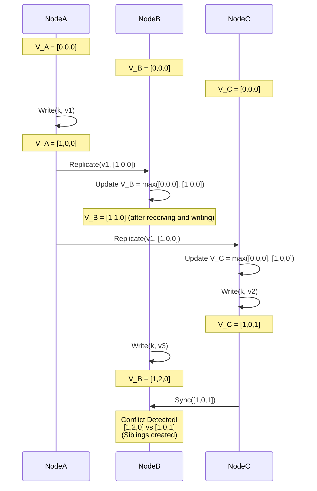

# Vector Clocks and CRDTs: How Distributed Databases Resolve Conflicting Writes

## Why Availability Forces You to Deal With Conflicts

When Amazon built the original Dynamo architecture, and later when Basho built Riak, both teams made the same trade: give up strong consistency to keep the system available even when parts of the network can't talk to each other. That's the trade behind the "five nines" uptime numbers people quote for these systems. Once you accept it, you land in eventual consistency territory, where replicas in different data centers accept writes independently, without checking in with each other first.

The catch is that independent writes can disagree. If someone in Virginia and someone in Frankfurt edit the same record while a transatlantic link is down, you now have two versions of the truth sitting on two different machines. When the network heals and the replicas start talking again, something has to decide what the "current" value actually is — or whether there even is a single current value anymore.

This is where Vector Clocks and CRDTs come in. They're the two main mathematical tools engineers reach for to handle this problem, and they take fairly different approaches: one detects conflicts and hands them to the application, the other resolves them automatically by construction. This piece walks through both — starting from Leslie Lamport's happens-before relation, through how Dynamo and Riak actually implement these ideas, down to the cache-line and compaction-level engineering that makes them practical at scale.

**The problem, stated plainly:** how do you keep data causally consistent across a distributed network without routing every write through a central lock? Locks don't scale — they turn a distributed system back into a bottlenecked one. What you want instead is a decentralized way to let data diverge safely and then merge it back deterministically, without silently dropping anyone's update.

A few things worth keeping in mind as you read:

1. **Wall-clock time doesn't work for ordering events.** Clocks drift, NTP corrections jump backwards, and two machines a continent apart will never agree closely enough. Vector clocks sidestep this by tracking logical time instead.
2. **There's a real design fork between "detect and delegate" and "detect and auto-merge."** Vector clocks tell you two writes conflict and then leave it to your application code to figure out what that means. CRDTs go further: because their merge operation is commutative, associative, and idempotent, they can resolve the conflict automatically, with no application-specific logic required.
3. **None of this is free.** Tracking causal history costs memory, and it doesn't shrink on its own. Tombstones in CRDTs and the node lists inside vector clocks both grow without bound unless something is actively pruning them.

---

## Happens-Before and the Mechanics of Vector Clocks

Before a system can resolve conflicts, it needs a way to talk about the order of events. Leslie Lamport gave us the formal tool for this back in 1978: the **happens-before** relation, written $\rightarrow$.

- If $a \rightarrow b$, there's a causal chain — information from $a$ could plausibly have influenced $b$.
- If neither $a \rightarrow b$ nor $b \rightarrow a$ holds, the two events are **concurrent**, written $a \parallel b$. Concurrency is exactly where conflicts come from — two events that neither one could have known about the other.

### 1 How a Vector Clock Actually Updates

A vector clock for a system with $N$ nodes is just a vector $V$ of $N$ integers — one counter per node. The update rules are simple:

1. Every $V_i[j]$ starts at 0.
2. Before node $i$ performs a write, it bumps its own counter: $V_i[i] \leftarrow V_i[i] + 1$.
3. When node $i$ sends a message, it attaches its current vector $V_i$.
4. When node $j$ receives a message, it merges the incoming vector into its own using element-wise max — $\forall k, V_j[k] \leftarrow \max(V_j[k], V_m[k])$ — and then increments its own counter $V_j[j]$.

**Detecting a conflict** comes down to comparing two vectors. Given versions $A$ and $B$ with vectors $V_A$ and $V_B$:

- If $\forall k, V_A[k] \le V_B[k]$, then $A$ is a strict ancestor of $B$ — $B$ has already absorbed everything $A$ knew. It's safe to just discard $A$.
- If neither vector dominates the other ($V_A \not\le V_B$ and $V_B \not\le V_A$), the versions are concurrent. A system like Dynamo won't guess which one is "right" — it stores both as **siblings** and hands them back to the client, which has to decide how to reconcile them (the classic example being Amazon merging two divergent shopping carts by taking the union of items).



### 2 The State-Space Problem

Vector clocks have one glaring weakness: they grow with the cluster. In a deployment with thousands of nodes, a vector clock ends up with thousands of entries, and attaching that to every single read and write starts to hurt — bandwidth gets chewed up, and the CPU cache takes a beating just processing the metadata.

Amazon's answer in Dynamo was a **pruning algorithm**: instead of a full per-node vector, the clock gets compressed into a bounded list of `(NodeID, Counter, Timestamp)` tuples, and once that list exceeds some threshold, the oldest entries get dropped. It works, but it isn't free either — pruning throws away causal history, which means the system can occasionally get a **false positive**, mistaking two writes that were actually sequential for a genuine conflict.

---

## CRDTs: Letting the Math Do the Merging (Basho Riak)

Vector clocks are honest about their limits — they detect conflict and stop there, leaving resolution to the application. **CRDTs (Conflict-free Replicated Data Types)** take a different stance: fix it at the data-structure level, before it ever becomes the application's problem. This is the approach Basho built into Riak.

Formally, the state-based CRDT family (CvRDTs) requires that the merge function $m(x,y)$, written $x \sqcup y$, form a **join-semilattice**. That means it has to satisfy three algebraic properties, no exceptions:

1. **Commutativity** — $x \sqcup y = y \sqcup x$. It doesn't matter what order packets arrive in over the network; the merged result is identical either way.
2. **Associativity** — $(x \sqcup y) \sqcup z = x \sqcup (y \sqcup z)$. However data happens to get routed and grouped along the way, it converges to the same answer.
3. **Idempotency** — $x \sqcup x = x$. If TCP retransmits the same packet 100 times, merging it in 100 times causes no damage.

### 1 Inside the OR-Set (Observed-Remove Set)

Here's a concrete design problem: how do you build a set where people on different continents can add and remove the same element $E$ concurrently, and never end up with a conflict?

The OR-Set is the CRDT answer. Instead of storing just the value $E$, it tags every insertion with a unique identifier — a **UUID tag**. The internal state is really a set of `(E, Tag)` pairs, not a set of bare values.

- The US adds $E$: stored as `(E, tag_US)`
- Europe adds $E$: stored as `(E, tag_EU)`

When the two sides sync, the result is simply the union: `{ (E, tag_US), (E, tag_EU) }`. $E$ is present.

Now say Europe deletes $E$. That doesn't erase anything from memory — it moves `(E, tag_EU)` into a **tombstone set**, marking that specific tagged instance as removed. When Europe syncs back with the US, the merge sees that `(E, tag_EU)` has been tombstoned, but `(E, tag_US)` was never touched and is still very much alive. Net result: $E$ still shows up. There's no "resurrection" bug here, because the tag makes each insertion individually addressable — deleting one instance never silently deletes another.

```cpp
#include <iostream>
#include <set>
#include <string>
#include <algorithm>

// Low-level simulation of an OR-Set CRDT architecture
struct Element {
    std::string value;
    std::string tag;
    bool operator<(const Element& other) const {
        if (value != other.value) return value < other.value;
        return tag < other.tag;
    }
};

class ORSet {
private:
    std::set<Element> add_set;
    std::set<Element> tombstone_set; // The tombstone set

    std::string generate_tag() {
        static int counter = 0;
        return "uuid_" + std::to_string(++counter);
    }

public:
    void add(const std::string& val) {
        add_set.insert({val, generate_tag()});
    }

    void remove(const std::string& val) {
        // Move every observed tag into the tombstone set
        for (const auto& elem : add_set) {
            if (elem.value == val) tombstone_set.insert(elem);
        }
    }

    bool contains(const std::string& val) const {
        for (const auto& elem : add_set) {
            // Exists if present in add_set and not yet in tombstone_set
            if (elem.value == val && tombstone_set.find(elem) == tombstone_set.end()) {
                return true;
            }
        }
        return false;
    }

    // Join-semilattice operation: Idempotent, Commutative, Associative
    void merge(const ORSet& other) {
        std::set<Element> new_add;
        std::set_union(add_set.begin(), add_set.end(),
                       other.add_set.begin(), other.add_set.end(),
                       std::inserter(new_add, new_add.begin()));
        add_set = new_add;

        std::set<Element> new_tomb;
        std::set_union(tombstone_set.begin(), tombstone_set.end(),
                       other.tombstone_set.begin(), other.tombstone_set.end(),
                       std::inserter(new_tomb, new_tomb.begin()));
        tombstone_set = new_tomb;
    }
};
```

---

## Microarchitecture, Memory, and LSM-Tree Integration

The algebra behind CRDTs is clean, but running it on real hardware introduces its own set of headaches around caching and garbage collection.

### 1 NUMA, Cache Lines, and False Sharing

On a multi-core NUMA box handling thousands of transactions per second across hundreds of threads, CRDT state tends to be bulky — all those tombstones and vector-clock entries routinely push an object past 64 bytes, the usual L1 cache line size.

That matters because a single write to a CRDT that spans a cache line will invalidate that line for every other core touching it, and you get **false sharing**: cores that aren't even logically contending for the same data end up fighting over cache coherence traffic anyway.

The usual fix is **thread-local state shards**. Each CPU thread keeps its own private CRDT in local memory — no shared state, no mutexes between threads during normal operation. Periodically (every 5ms, say), a background thread walks the local shards and folds them together using the CRDT's merge function $m(x,y)$, leaning on fast atomic instructions like compare-and-swap to do it safely.

### 2 Pushing the Merge Function Into LSM-Tree Compaction

The OR-Set's biggest practical liability is that tombstones never go away on their own. Left unchecked, they'll eventually eat all your RAM and disk. Riak's answer to this was to push the CRDT merge logic down into the physical storage engine — specifically, into **LSM-tree** compaction.

LSM-trees (LevelDB, RocksDB, and similar engines) periodically run compaction, merging and rewriting SSTable files on disk. Instead of the compactor doing a naive "newer version wins" overwrite when it encounters two versions of the same key, Riak embeds the CRDT's join operator $\sqcup$ directly into that merge step.

Because compaction scans data at the block I/O layer, it has visibility across the whole dataset that a single write path doesn't. If it can confirm — using epoch-based reclamation — that a given tombstone has already propagated to every physical replica in the cluster, it can safely drop that tombstone from disk for good. That's effectively garbage collection riding for free on work the storage engine was already doing, with no extra pass and no interruption to the transaction path.

---

## Where This Leaves Us

Vector clocks and CRDTs are a good example of taking an abstract algebraic property — commutativity, associativity, idempotency — and turning it into something that runs correctly on real, failure-prone hardware.

Together they're what lets a hyperscale database stay available even while parts of it are cut off from each other: data can diverge across a noisy, partitioned network and still converge back to a single consistent state once connectivity returns, without a human or a central coordinator stepping in. If you're building or operating cloud-native systems without a single point of failure, understanding how Vector Clocks and CRDTs actually work under the hood — not just the marketing description — is what lets you reason about correctness when things go wrong.

---
